# 一元线性回归-理论与实践

> 原文：<https://towardsdatascience.com/univariate-linear-regression-theory-and-practice-99329845e85d?source=collection_archive---------26----------------------->


卢克·切瑟在 [Unsplash](https://unsplash.com?utm_source=medium&utm_medium=referral) 上的照片

**简介:**这篇文章解释了一元线性回归的数学和执行。这将包括成本函数背后的数学、梯度下降和成本函数的收敛。

机器学习主要分为三种类型

1.  监督机器学习
2.  无监督机器学习
3.  强化学习

在监督机器学习中，使用一组具有预期输出的训练示例来训练模型。模型在对这些示例进行训练后，会尝试预测另一组示例的输出值。有两种类型的监督机器学习:

1.  回归-预测连续值输出。所有类型的回归都属于这一部分。
2.  分类-预测离散值输出。SVM、KNN 和兰登森林属于这一部分。

有几种类型的回归算法，如线性回归，逻辑回归，多项式回归，逐步回归，岭回归，套索回归，弹性网回归。

让我们考虑一元线性回归的情况。我们将同时处理数学和执行。所用数据集的链接如下:

[https://www.kaggle.com/c/home-data-for-ml-course/data](https://www.kaggle.com/c/home-data-for-ml-course/data)

该数据集包含波士顿不同房屋的销售价值信息及其对其他要素的依赖性。

让我们导入所需的库:

```
import pandas as pd
import matplotlib.pyplot as plt
from matplotlib import style
```

并将数据集加载到熊猫数据框架中

```
read_df = pd.read_csv(‘train.csv’)
df = read_df.copy()
df.head()
df.info()
```

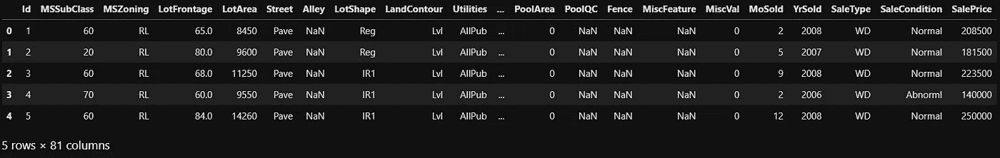

这些特征的详细描述与数据集一起提供。可以获得简要信息:

```
<class 'pandas.core.frame.DataFrame'>
RangeIndex: 1460 entries, 0 to 1459
Data columns (total 81 columns):
 #   Column         Non-Null Count  Dtype  
---  ------         --------------  -----  
 0   Id             1460 non-null   int64  
 1   MSSubClass     1460 non-null   int64  
 2   MSZoning       1460 non-null   object 
 3   LotFrontage    1201 non-null   float64
 4   LotArea        1460 non-null   int64  
 5   Street         1460 non-null   object 
 6   Alley          91 non-null     object 
 7   LotShape       1460 non-null   object 
 8   LandContour    1460 non-null   object 
 9   Utilities      1460 non-null   object 
 10  LotConfig      1460 non-null   object 
 11  LandSlope      1460 non-null   object 
 12  Neighborhood   1460 non-null   object 
 13  Condition1     1460 non-null   object 
 14  Condition2     1460 non-null   object 
 15  BldgType       1460 non-null   object 
 16  HouseStyle     1460 non-null   object 
 17  OverallQual    1460 non-null   int64  
 18  OverallCond    1460 non-null   int64  
 19  YearBuilt      1460 non-null   int64  
 20  YearRemodAdd   1460 non-null   int64  
 21  RoofStyle      1460 non-null   object 
 22  RoofMatl       1460 non-null   object 
 23  Exterior1st    1460 non-null   object 
 24  Exterior2nd    1460 non-null   object 
 25  MasVnrType     1452 non-null   object 
 26  MasVnrArea     1452 non-null   float64
 27  ExterQual      1460 non-null   object 
 28  ExterCond      1460 non-null   object 
 29  Foundation     1460 non-null   object 
 30  BsmtQual       1423 non-null   object 
 31  BsmtCond       1423 non-null   object 
 32  BsmtExposure   1422 non-null   object 
 33  BsmtFinType1   1423 non-null   object 
 34  BsmtFinSF1     1460 non-null   int64  
 35  BsmtFinType2   1422 non-null   object 
 36  BsmtFinSF2     1460 non-null   int64  
 37  BsmtUnfSF      1460 non-null   int64  
 38  TotalBsmtSF    1460 non-null   int64  
 39  Heating        1460 non-null   object 
 40  HeatingQC      1460 non-null   object 
 41  CentralAir     1460 non-null   object 
 42  Electrical     1459 non-null   object 
 43  1stFlrSF       1460 non-null   int64  
 44  2ndFlrSF       1460 non-null   int64  
 45  LowQualFinSF   1460 non-null   int64  
 46  GrLivArea      1460 non-null   int64  
 47  BsmtFullBath   1460 non-null   int64  
 48  BsmtHalfBath   1460 non-null   int64  
 49  FullBath       1460 non-null   int64  
 50  HalfBath       1460 non-null   int64  
 51  BedroomAbvGr   1460 non-null   int64  
 52  KitchenAbvGr   1460 non-null   int64  
 53  KitchenQual    1460 non-null   object 
 54  TotRmsAbvGrd   1460 non-null   int64  
 55  Functional     1460 non-null   object 
 56  Fireplaces     1460 non-null   int64  
 57  FireplaceQu    770 non-null    object 
 58  GarageType     1379 non-null   object 
 59  GarageYrBlt    1379 non-null   float64
 60  GarageFinish   1379 non-null   object 
 61  GarageCars     1460 non-null   int64  
 62  GarageArea     1460 non-null   int64  
 63  GarageQual     1379 non-null   object 
 64  GarageCond     1379 non-null   object 
 65  PavedDrive     1460 non-null   object 
 66  WoodDeckSF     1460 non-null   int64  
 67  OpenPorchSF    1460 non-null   int64  
 68  EnclosedPorch  1460 non-null   int64  
 69  3SsnPorch      1460 non-null   int64  
 70  ScreenPorch    1460 non-null   int64  
 71  PoolArea       1460 non-null   int64  
 72  PoolQC         7 non-null      object 
 73  Fence          281 non-null    object 
 74  MiscFeature    54 non-null     object 
 75  MiscVal        1460 non-null   int64  
 76  MoSold         1460 non-null   int64  
 77  YrSold         1460 non-null   int64  
 78  SaleType       1460 non-null   object 
 79  SaleCondition  1460 non-null   object 
 80  SalePrice      1460 non-null   int64  
dtypes: float64(3), int64(35), object(43)
memory usage: 924.0+ KB
```

包括 ID 在内共有 81 个特征。参赛作品总数为 1460 件。我们现在不会做任何数据清理，因为我们的目的只是了解线性回归。让我们将特性 LotArea 作为输入特性，将 SalePrice 作为输出特性。策划他们两个:

```
fig = plt.figure(figsize = (10,10))
style.use(‘ggplot’)
plt.scatter(df.LotArea, df.SalePrice, s = 5, c = ‘k’)
```

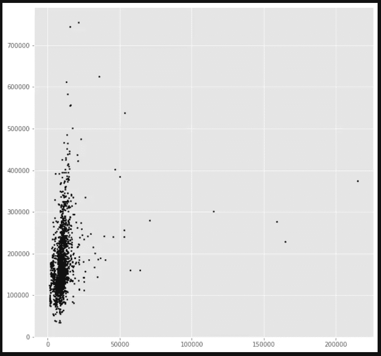

正如我们所看到的，大多数房子的土地面积不到 50000 平方英尺，售价不到 500000 美元。所有其他情况都可以被认为是例外情况或异常值(取决于其他特征)。

线性回归的基本思想是找到一条符合数据点集的直线。我将在本文中使用以下符号:

在我们的例子中，m =训练样本数=> 1460

x's = 'Input '变量/特征=> LotArea

y's = '输出'变量/标签= >销售价格

(x，y)包括一个训练示例。

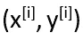

表示第 I 个训练示例。

一般来说，回归过程由下面的流程图解释:

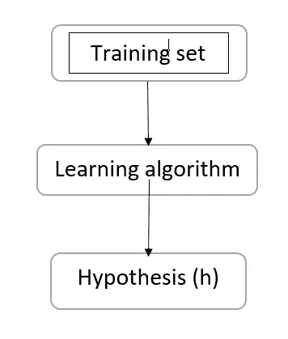

训练集被植入学习算法以产生假设。假设是根据输入值预测输出值的函数。在我们的例子中，LotArea 作为假设的输入，得到估计的销售价格。h 是从 x 到 y 的映射函数。

在线性回归的情况下，假设由以下等式表示:

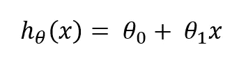

是假设的参数。在引用参数时，我将使用‘theta _ 0’和‘theta _ 1’。

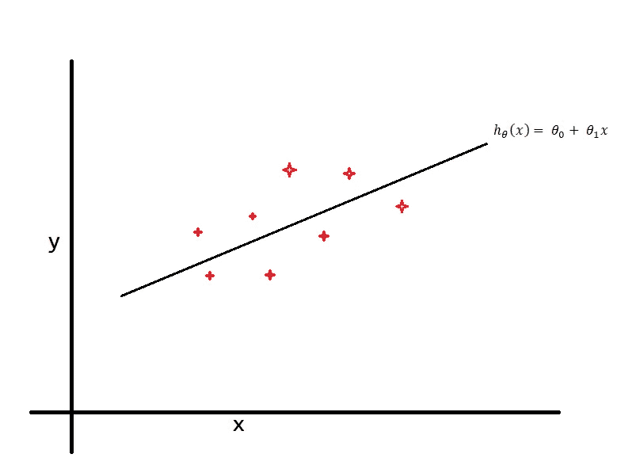

上图展示了一个假设的图示例子。它是符合给定数据点的回归线。这里的假设类似于直线方程，因为我们使用的是线性回归。我们也可以使用任何类型的函数作为假设来相应地拟合数据。这里使用的假设是单变量线性回归或单变量线性回归。

我们来看看如何选择假设的参数。这里的想法是选择参数，使其最适合 y，即选择 theta_0 和 theta_1，使 h(x)接近每个 x 的 y 值。这种情况可以用数学方法表示如下:

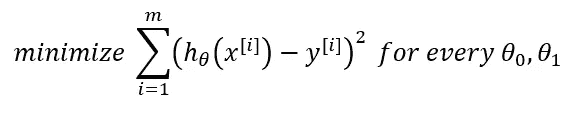

其中 m 是训练样本的数量。

上述等式相当于:

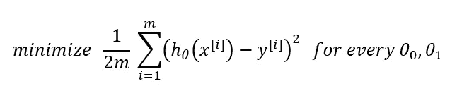

这里 h(x)是上面提到的假设，y 是相应 x 值的输出值。上述等式简化为寻找θ_ 0 和θ_ 1 的值，该值最小化估计输出 h(x)和实际输出 y 之间的差。

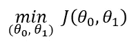

J(theta_0，theta_1)称为**代价函数**。有许多类型的成本函数可用。均方差(MSE)成本函数是回归问题中通常使用的函数，如上所示。

让我们进一步分析成本函数。为简化起见，请考虑:

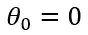

于是假设变成了:

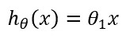

和成本函数

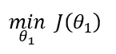

这意味着所有假设函数都经过原点，即(0，0)。

考虑以下数据点:

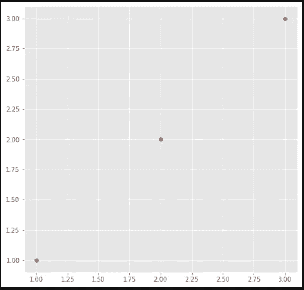

考虑:

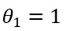

将获得以下回归线:

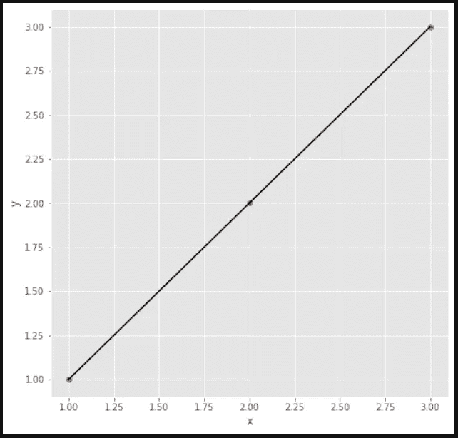

成本函数的值是:

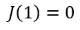

认为

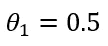

得到的回归线将是:

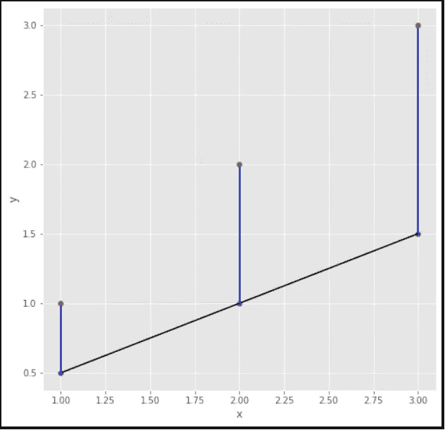

从数据点到回归线的直线是实际值和估计值之间的误差。计算成本 J

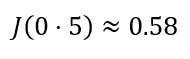

认为

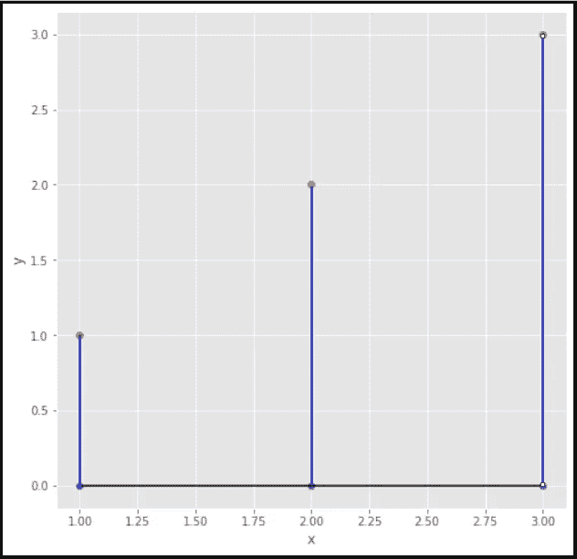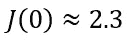

绘制不同θ_ 0 值的成本，我们得到:

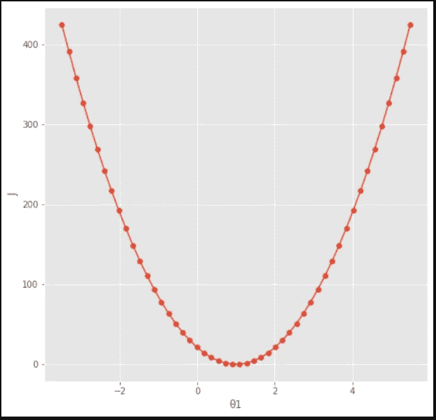

从图中，我们可以看到成本函数值在


其对应于穿过所有三个数据点的回归线。由此，我们可以暗示，给出成本函数值最小的参数值对应于最佳拟合回归线。

让我们回到最初的成本函数。由于我们在上一节中考虑了θ_ 0 = 0，我们能够为成本函数绘制一个二维图。但实际上，由于成本函数取决于θ_ 0 和θ_ 1，我们将得到一个弓形的三维图形(该形状取决于训练集)。考虑房价数据集中的 LotArea 和 SalePrice 要素。让我们试着画出这些特征的成本函数。

```
from mpl_toolkits.mplot3d.axes3d import Axes3D
import numpy as np
m = len(df.LotArea)
theta_0 = np.linspace(10000, 100000, num = 1000)
theta_1 = np.linspace(5, 10, num = 1000)
Theta_0, Theta_1 = np.meshgrid(theta_0, theta_1)
def cost(theta_0, theta_1, LotArea, SalePrice):
    h = 0
    for i in range(len(LotArea)):
        h += (((theta_0 + (theta_1 * LotArea[i])) - SalePrice[i]) **            2)
    J = (1/2*len(LotArea)) * h
    return J
fig = plt.figure(figsize = (12,12))
style.use('ggplot')
ax = fig.add_subplot(111, projection = '3d')
ax.plot_surface(Theta_0, Theta_1, cost(Theta_0, Theta_1, df.LotArea, df.SalePrice), cmap = 'viridis')
ax.set_xlabel('θ0')
ax.set_ylabel('θ1')
ax.set_zlabel('J')
```

得到了如下的图:


XY 平面表示θ_ 0 和θ_ 1 的不同值，并且从 XY 平面上的任意点开始的表面图的高度给出了对应于该点的θ_ 0 和θ_ 1 值的 J 值。我们也可以画一个等高线图来表示 J(theta_0，theta_1)。

```
fig = plt.figure(figsize = (12,12))
style.use(‘ggplot’)
ax = fig.add_subplot(111)
cs = ax.contourf(Theta_0, Theta_1, cost(Theta_0, Theta_1, df.LotArea, df.SalePrice))
cbar = fig.colorbar(cs)
ax.set_xlabel('θ0')
ax.set_ylabel('θ1')
plt.show()
```

获得以下等高线图:

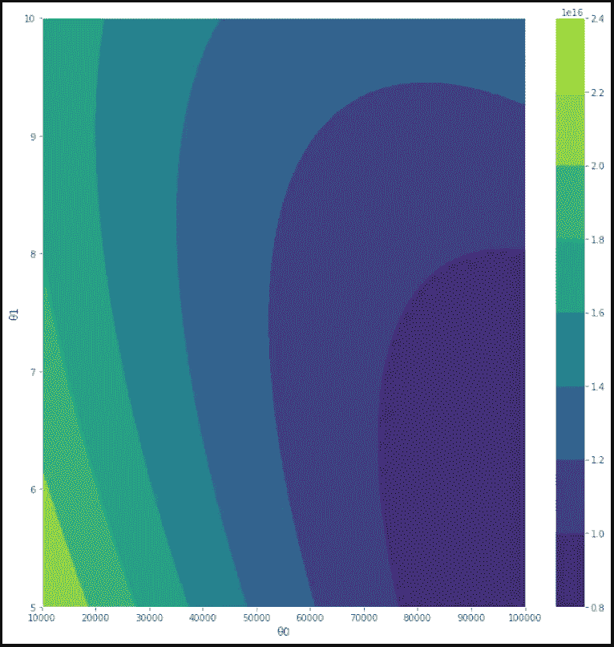

侧栏显示了 J 值随着图中颜色的变化而变化。对于不同的θ_ 0 和θ_ 1 值，等高线图中特定环中的所有点具有相同的 J 值。

让我们为上面考虑的θ_ 0 和θ_ 1 的值绘制回归线:

```
minj = np.min(cost(Theta_0, Theta_1, df.LotArea, df.SalePrice))
point = np.array(cost(Theta_0, Theta_1, df.LotArea, df.SalePrice)) == minj
position = np.where(point)
positionoutput>>(array([9]), array([999]))
```

输出显示了给出最小成本值的θ_ 0 和θ_ 1 的值的位置。

```
theta_1_min = Theta_1[9][999]
theta_0_min = Theta_0[9][999]
def fitline(theta_0, theta_1, LotArea):
    x = []
    for i in range(m):
        x.append(theta_0 + (theta_1 * LotArea[i]))
    return x
fig = plt.figure(figsize = (10,10))
style.use('ggplot')
count = 0
for i in range(len(theta_0)):
    plt.plot(df.LotArea,fitline(theta_0[i], theta_1[i], df.LotArea), color = 'k', alpha = 0.1, linewidth = 0.1)
    count += 1
print(count)
plt.scatter(df.LotArea, df.SalePrice, s = 5, c = 'r')
plt.plot(df.LotArea, (theta_0_min + (theta_1_min * df.LotArea)), color = 'k')
plt.show()
```

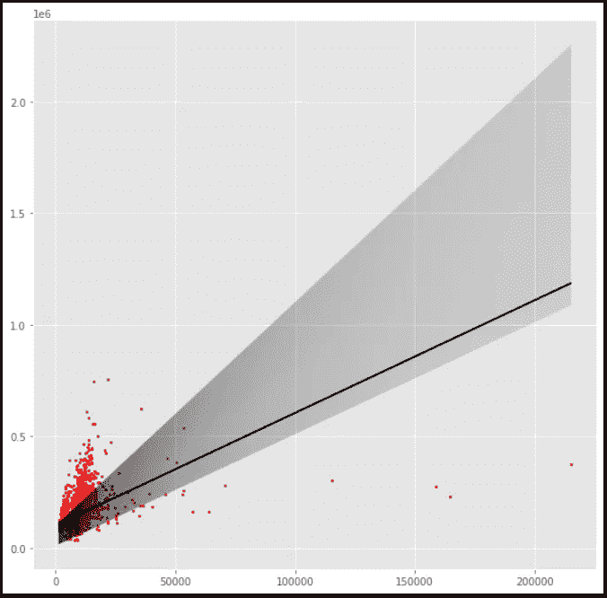

阴影区域由对应于θ_ 0 和θ_ 1 值的 1000 条线组成，突出显示的线是对应于我们获得最小成本的参数值的线。这不是实际的最小成本，而只是所考虑的参数范围内的最小值。

用于找到给出实际最小成本值的参数值的算法是**梯度下降**。它是一种通用算法，不仅用于最小化成本函数 J，还用于最小化其他函数。该算法的大致轮廓将是:

1.  从θ_ 0 和θ_ 1 的某个值开始(通常两者都被设置为零。)
2.  不断改变数值，直到我们达到 J(theta_0，theta_1)的最小值。

算法如下:

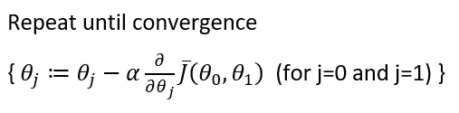

在哪里

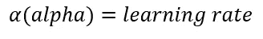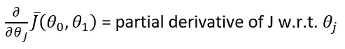

Alpha 或学习率决定了算法达到最小成本值(即，给出最小成本值的参数值)所采取的步长。我们必须注意的非常重要的细节是，我们必须**同时更新 theta_1 和 theta _ 0**。我们不应该更新θ_ 0，然后升级成本函数，然后θ_ 1，这不是我们想要的方式。

通过研究算法的偏导数部分，考虑我们之前绘制的二维成本函数图。假设我们正在更新θ_ 1 的值，因为我们在那种情况下忽略了θ_ 0。

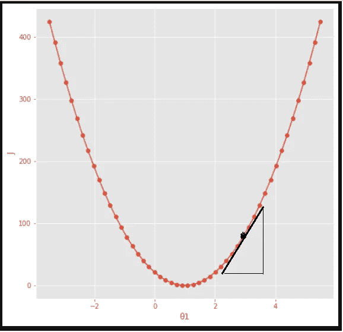

偏导数项给出了图上每个θ_ 1 点切线的斜率。算法将是:

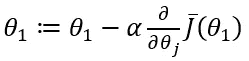

考虑上图中的点及其切线。正如我们所见，切线具有正斜率，因此等式为:

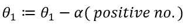

因此，我们可以看到，θ_ 1 的值在减小，这就是我们要做的，逐步达到最小值。如果我们考虑曲线左侧的θ_ 1 值，斜率将是负数，从而增加θ_ 1 并最终达到最小值。

学习率(α)也会影响收敛路径。如果α太小，则算法需要很长时间才能达到最小值，从而延迟收敛。

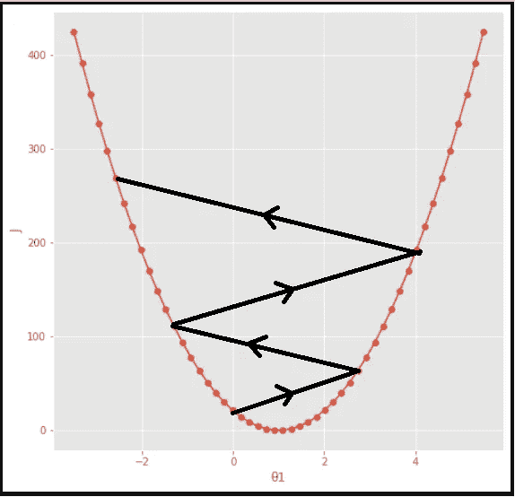

如果 alpha 太大，则算法可能会超过最小值，从而不会收敛，甚至可能发散，如上图所示。

当我们达到局部最小值时，考虑应用该算法。该算法的偏导数部分将为零，因为切线在该点将是水平的，因此θ_ 0 的值不会改变。

当我们接近一个局部最小值时，切线的斜率继续下降到零。因此，当我们接近最小值时，参数减少或增加的值也减少。由此我们可以看出，即使我们保持α值不变，算法也是收敛的。

将这种梯度下降算法应用于一元线性回归问题。

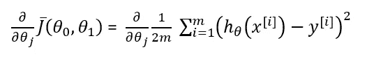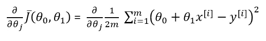

对于 j = 0

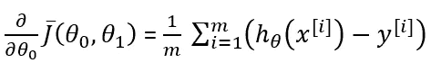

对于 j = 1

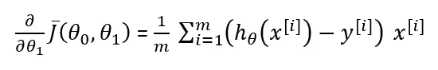

这为我们提供了梯度下降算法

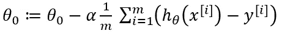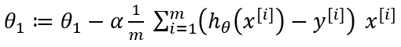

再次考虑房价数据集。让我们对特征 LotArea 和输出 SalePrice 执行梯度下降。

```
from sklearn import preprocessing
x = df.LotArea
y = df.SalePrice
x = preprocessing.scale(x)
theta_0_gd = 0
theta_1_gd = 0
alpha = 0.01
h_theta_0_gd = 1
h_theta_1_gd = 1
epoch = 0
fig = plt.figure(figsize = (10,10))
style.use('ggplot')
plt.scatter(x, y, s = 5, c = 'r')
while h_theta_0_gd != 0 or h_theta_0_gd != 0:
    if epoch > 1000:
        break
    h_theta_0_gd = 0
    h_theta_1_gd = 0
    for i in range(m):
        h_theta_0_gd += (theta_0_gd + (theta_1_gd * x[i]) - y[i])
        h_theta_1_gd += ((theta_0_gd + (theta_1_gd * x[i]) - y[i]) * x[i])
    h_theta_0_gd = (1/m) * h_theta_0_gd
    h_theta_1_gd = (1/m) * h_theta_1_gd
    theta_0_gd -= (alpha * h_theta_0_gd)
    theta_1_gd -= (alpha * h_theta_1_gd)
    plt.plot(x,(theta_0_gd + (theta_1_gd * x)), color = 'k', alpha = 0.1, linewidth = 1)
    epoch += 1
plt.plot(x,(theta_0_gd + (theta_1_gd * x)), color = 'r', linewidth = 3)
plt.show()
```

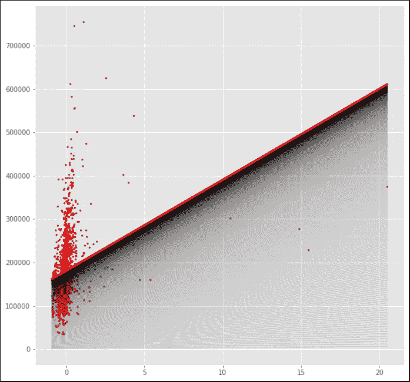

参数的初始值被设置为零。学习率设置为 0.01。最多允许 1000 个重复或时期。图中所有阴影部分由获得每个时期的参数后绘制的回归线组成。突出显示的红线是 1000 个时期后的最终回归线。正如我们所见，线的密度随着接近红线而增加。这是因为当算法接近最小值时所采取的步骤很小，从而减少了每个时期中相应回归线之间的间隔。为了确认我们是否正确地应用了该算法，我们可以用 sklearn 的线性回归模型进行交叉验证。

```
from sklearn import model_selection
from sklearn.linear_model import LinearRegression
x_model = np.array(df.LotArea).reshape(-1,1)
y_model = np.array(df.SalePrice).reshape(-1,1)
x_model = preprocessing.scale(x_model)
x_train, x_test, y_train, y_test = model_selection.train_test_split(x_model, y_model, test_size = 0.33)
clf = LinearRegression()
clf.fit(x_train, y_train)
theta_1_model = clf.coef_
theta_0_model = clf.intercept_
fig = plt.figure(figsize = (10,10))
style.use('ggplot')
plt.scatter(x, y, s = 5, c = 'r')
plt.plot(x_model,(theta_0_model + (theta_1_model * x_model)), color = 'k')
```

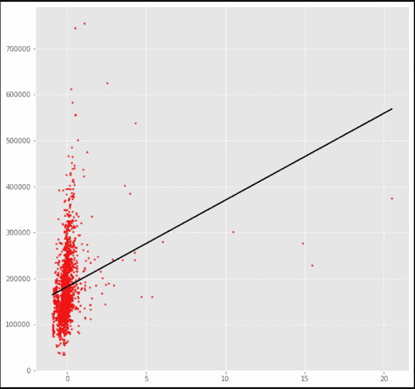

正如我们可以看到的，sklearn 的回归模型也产生了相同的图形。

**结论:**我们开始了解不同类型的机器学习以及监督学习的类型。我们看到了假设、成本函数和单变量线性回归的梯度下降背后的概念，并从头开始使用上述概念在房价数据集的要素上构建了一条回归线。然后将其与使用 sklearn 的线性回归模型构建的模型进行比较。

**参考文献:**

我正在从这个 Youtube 播放列表中学习大多数关于机器学习的概念。这很有帮助，也很容易理解。