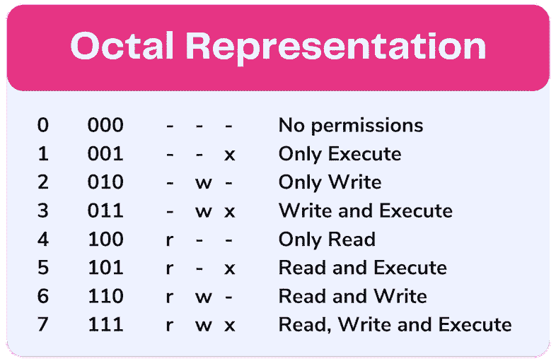
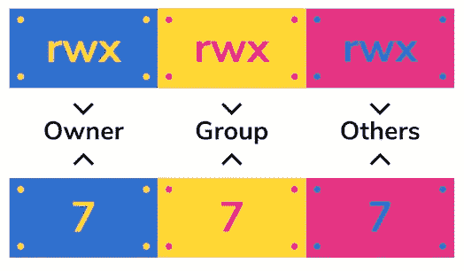

# Unix 权限—最简单的方法

> 原文：<https://towardsdatascience.com/unix-permissions-the-easy-way-98cc19979b3e?source=collection_archive---------7----------------------->

## 所有 chmod 置换的索引


我最近不得不交付一个托管在 Linux 中的项目，我已经记不清我不得不摆弄文件和目录权限的次数了……*是的*我了解它们是如何工作的；是的我可以在脑子里算出来；是的，到目前为止，我已经记住了最常见的一些；*是的*我可以使用`stat`命令；是的，我可以用符号符号来代替！但是为什么我要这样做。单身。有时间让我看看吗？所以我写了一个快速的 python 脚本来生成完整的权限列表，然后我用它作为参考来查找我遇到的任何组合。

对于那些你更喜欢把你的脑力用在重要的事情上，而你只是想要平凡事情的简单答案的情况，这篇文章是给你的。我会很快地介绍一下基础知识，以免成为有史以来最没有启发性的文章，但是…

> 我的主要意图是提供一个从 0 到 777 的所有权限排列的“备忘单”!

# 基础知识

Unix 权限被授予三个不同的实体:

*   物主
*   小组成员
*   其他人(即世界)

有三个权限属性:r、w 和 x。

**read (r)** 读取一个文件的内容或者列出一个目录中所有文件的能力。

写(w)改变一个文件的内容或在目录中创建新文件。

**execute (x)**
这意味着有权执行一个文件(如 bash 或程序)。对于目录，执行权限授予进入目录和访问其中任何文件的权利。


权限不仅可以用 rwx 来表示，还可以用八进制的符号来表示(0 到 7)。每个八进制是二进制数字系统中其组成位的总和:



一组三个八进制反映了三个实体:从左到右，第一个数字代表**用户**的权限，第二个数字代表**组**的权限，第三个数字代表**其他**的权限。



就是这样！这确实很简单！

# 简单的方法

正如承诺的那样，你可以在下面随意查找:

```
**0**----------**1**---------x**2**--------w-**3**--------wx**4**-------r--**5**-------r-x**6**-------rw-**7**-------rwx**10**------x---**11**------x--x**12**------x-w-**13**------x-wx**14**------xr--**15**------xr-x**16**------xrw-**17**------xrwx**20**-----w----**21**-----w---x**22**-----w--w-**23**-----w--wx**24**-----w-r--**25**-----w-r-x**26**-----w-rw-**27**-----w-rwx**30**-----wx---**31**-----wx--x**32**-----wx-w-**33**-----wx-wx**34**-----wxr--**35**-----wxr-x**36**-----wxrw-**37**-----wxrwx**40**----r-----**41**----r----x**42**----r---w-**43**----r---wx**44**----r--r--**45**----r--r-x**46**----r--rw-**47**----r--rwx**50**----r-x---**51**----r-x--x**52**----r-x-w-**53**----r-x-wx**54**----r-xr--**55**----r-xr-x**56**----r-xrw-**57**----r-xrwx**60**----rw----**61**----rw---x**62**----rw--w-**63**----rw--wx**64**----rw-r--**65**----rw-r-x**66**----rw-rw-**67**----rw-rwx**70**----rwx---**71**----rwx--x**72**----rwx-w-**73**----rwx-wx**74**----rwxr--**75**----rwxr-x**76**----rwxrw-**77**----rwxrwx**100**---x------**101**---x-----x**102**---x----w-**103**---x----wx**104**---x---r--**105**---x---r-x**106**---x---rw-**107**---x---rwx**110**---x--x---**111**---x--x--x**112**---x--x-w-**113**---x--x-wx**114**---x--xr--**115**---x--xr-x**116**---x--xrw-**117**---x--xrwx**120**---x-w----**121**---x-w---x**122**---x-w--w-**123**---x-w--wx**124**---x-w-r--**125**---x-w-r-x**126**---x-w-rw-**127**---x-w-rwx**130**---x-wx---**131**---x-wx--x**132**---x-wx-w-**133**---x-wx-wx**134**---x-wxr--**135**---x-wxr-x**136**---x-wxrw-**137**---x-wxrwx**140**---xr-----**141**---xr----x**142**---xr---w-**143**---xr---wx**144**---xr--r--**145**---xr--r-x**146**---xr--rw-**147**---xr--rwx**150**---xr-x---**151**---xr-x--x**152**---xr-x-w-**153**---xr-x-wx**154**---xr-xr--**155**---xr-xr-x**156**---xr-xrw-**157**---xr-xrwx**160**---xrw----**161**---xrw---x**162**---xrw--w-**163**---xrw--wx**164**---xrw-r--**165**---xrw-r-x**166**---xrw-rw-**167**---xrw-rwx**170**---xrwx---**171**---xrwx--x**172**---xrwx-w-**173**---xrwx-wx**174**---xrwxr--**175**---xrwxr-x**176**---xrwxrw-**177**---xrwxrwx**200**--w-------**201**--w------x**202**--w-----w-**203**--w-----wx**204**--w----r--**205**--w----r-x**206**--w----rw-**207**--w----rwx**210**--w---x---**211**--w---x--x**212**--w---x-w-**213**--w---x-wx**214**--w---xr--**215**--w---xr-x**216**--w---xrw-**217**--w---xrwx**220**--w--w----**221**--w--w---x**222**--w--w--w-**223**--w--w--wx**224**--w--w-r--**225**--w--w-r-x**226**--w--w-rw-**227**--w--w-rwx**230**--w--wx---**231**--w--wx--x**232**--w--wx-w-**233**--w--wx-wx**234**--w--wxr--**235**--w--wxr-x**236**--w--wxrw-**237**--w--wxrwx**240**--w-r-----**241**--w-r----x**242**--w-r---w-**243**--w-r---wx**244**--w-r--r--**245**--w-r--r-x**246**--w-r--rw-**247**--w-r--rwx**250**--w-r-x---**251**--w-r-x--x**252**--w-r-x-w-**253**--w-r-x-wx**254**--w-r-xr--**255**--w-r-xr-x**256**--w-r-xrw-**257**--w-r-xrwx**260**--w-rw----**261**--w-rw---x**262**--w-rw--w-**263**--w-rw--wx**264**--w-rw-r--**265**--w-rw-r-x**266**--w-rw-rw-**267**--w-rw-rwx**270**--w-rwx---**271**--w-rwx--x**272**--w-rwx-w-**273**--w-rwx-wx**274**--w-rwxr--**275**--w-rwxr-x**276**--w-rwxrw-**277**--w-rwxrwx**300**--wx------**301**--wx-----x**302**--wx----w-**303**--wx----wx**304**--wx---r--**305**--wx---r-x**306**--wx---rw-**307**--wx---rwx**310**--wx--x---**311**--wx--x--x**312**--wx--x-w-**313**--wx--x-wx**314**--wx--xr--**315**--wx--xr-x**316**--wx--xrw-**317**--wx--xrwx**320**--wx-w----**321**--wx-w---x**322**--wx-w--w-**323**--wx-w--wx**324**--wx-w-r--**325**--wx-w-r-x**326**--wx-w-rw-**327**--wx-w-rwx**330**--wx-wx---**331**--wx-wx--x**332**--wx-wx-w-**333**--wx-wx-wx**334**--wx-wxr--**335**--wx-wxr-x**336**--wx-wxrw-**337**--wx-wxrwx**340**--wxr-----**341**--wxr----x**342**--wxr---w-**343**--wxr---wx**344**--wxr--r--**345**--wxr--r-x**346**--wxr--rw-**347**--wxr--rwx**350**--wxr-x---**351**--wxr-x--x**352**--wxr-x-w-**353**--wxr-x-wx**354**--wxr-xr--**355**--wxr-xr-x**356**--wxr-xrw-**357**--wxr-xrwx**360**--wxrw----**361**--wxrw---x**362**--wxrw--w-**363**--wxrw--wx**364**--wxrw-r--**365**--wxrw-r-x**366**--wxrw-rw-**367**--wxrw-rwx**370**--wxrwx---**371**--wxrwx--x**372**--wxrwx-w-**373**--wxrwx-wx**374**--wxrwxr--**375**--wxrwxr-x**376**--wxrwxrw-**377**--wxrwxrwx**400**-r--------**401**-r-------x**402**-r------w-**403**-r------wx**404**-r-----r--**405**-r-----r-x**406**-r-----rw-**407**-r-----rwx**410**-r----x---**411**-r----x--x**412**-r----x-w-**413**-r----x-wx**414**-r----xr--**415**-r----xr-x**416**-r----xrw-**417**-r----xrwx**420**-r---w----**421**-r---w---x**422**-r---w--w-**423**-r---w--wx**424**-r---w-r--**425**-r---w-r-x**426**-r---w-rw-**427**-r---w-rwx**430**-r---wx---**431**-r---wx--x**432**-r---wx-w-**433**-r---wx-wx**434**-r---wxr--**435**-r---wxr-x**436**-r---wxrw-**437**-r---wxrwx**440**-r--r-----**441**-r--r----x**442**-r--r---w-**443**-r--r---wx**444**-r--r--r--**445**-r--r--r-x**446**-r--r--rw-**447**-r--r--rwx**450**-r--r-x---**451**-r--r-x--x**452**-r--r-x-w-**453**-r--r-x-wx**454**-r--r-xr--**455**-r--r-xr-x**456**-r--r-xrw-**457**-r--r-xrwx**460**-r--rw----**461**-r--rw---x**462**-r--rw--w-**463**-r--rw--wx**464**-r--rw-r--**465**-r--rw-r-x**466**-r--rw-rw-**467**-r--rw-rwx**470**-r--rwx---**471**-r--rwx--x**472**-r--rwx-w-**473**-r--rwx-wx**474**-r--rwxr--**475**-r--rwxr-x**476**-r--rwxrw-**477**-r--rwxrwx**500**-r-x------**501**-r-x-----x**502**-r-x----w-**503**-r-x----wx**504**-r-x---r--**505**-r-x---r-x**506**-r-x---rw-**507**-r-x---rwx**510**-r-x--x---**511**-r-x--x--x**512**-r-x--x-w-**513**-r-x--x-wx**514**-r-x--xr--**515**-r-x--xr-x**516**-r-x--xrw-**517**-r-x--xrwx**520**-r-x-w----**521**-r-x-w---x**522**-r-x-w--w-**523**-r-x-w--wx**524**-r-x-w-r--**525**-r-x-w-r-x**526**-r-x-w-rw-**527**-r-x-w-rwx**530**-r-x-wx---**531**-r-x-wx--x**532**-r-x-wx-w-**533**-r-x-wx-wx**534**-r-x-wxr--**535**-r-x-wxr-x**536**-r-x-wxrw-**537**-r-x-wxrwx**540**-r-xr-----**541**-r-xr----x**542**-r-xr---w-**543**-r-xr---wx**544**-r-xr--r--**545**-r-xr--r-x**546**-r-xr--rw-**547**-r-xr--rwx**550**-r-xr-x---**551**-r-xr-x--x**552**-r-xr-x-w-**553**-r-xr-x-wx**554**-r-xr-xr--**555**-r-xr-xr-x**556**-r-xr-xrw-**557**-r-xr-xrwx**560**-r-xrw----**561**-r-xrw---x**562**-r-xrw--w-**563**-r-xrw--wx**564**-r-xrw-r--**565**-r-xrw-r-x**566**-r-xrw-rw-**567**-r-xrw-rwx**570**-r-xrwx---**571**-r-xrwx--x**572**-r-xrwx-w-**573**-r-xrwx-wx**574**-r-xrwxr--**575**-r-xrwxr-x**576**-r-xrwxrw-**577**-r-xrwxrwx**600**-rw-------**601**-rw------x**602**-rw-----w-**603**-rw-----wx**604**-rw----r--**605**-rw----r-x**606**-rw----rw-**607**-rw----rwx**610**-rw---x---**611**-rw---x--x**612**-rw---x-w-**613**-rw---x-wx**614**-rw---xr--**615**-rw---xr-x**616**-rw---xrw-**617**-rw---xrwx**620**-rw--w----**621**-rw--w---x**622**-rw--w--w-**623**-rw--w--wx**624**-rw--w-r--**625**-rw--w-r-x**626**-rw--w-rw-**627**-rw--w-rwx**630**-rw--wx---**631**-rw--wx--x**632**-rw--wx-w-**633**-rw--wx-wx**634**-rw--wxr--**635**-rw--wxr-x**636**-rw--wxrw-**637**-rw--wxrwx**640**-rw-r-----**641**-rw-r----x**642**-rw-r---w-**643**-rw-r---wx**644**-rw-r--r--**645**-rw-r--r-x**646**-rw-r--rw-**647**-rw-r--rwx**650**-rw-r-x---**651**-rw-r-x--x**652**-rw-r-x-w-**653**-rw-r-x-wx**654**-rw-r-xr--**655**-rw-r-xr-x**656**-rw-r-xrw-**657**-rw-r-xrwx**660**-rw-rw----**661**-rw-rw---x**662**-rw-rw--w-**663**-rw-rw--wx**664**-rw-rw-r--**665**-rw-rw-r-x**666**-rw-rw-rw-**667**-rw-rw-rwx**670**-rw-rwx---**671**-rw-rwx--x**672**-rw-rwx-w-**673**-rw-rwx-wx**674**-rw-rwxr--**675**-rw-rwxr-x**676**-rw-rwxrw-**677**-rw-rwxrwx**700**-rwx------**701**-rwx-----x**702**-rwx----w-**703**-rwx----wx**704**-rwx---r--**705**-rwx---r-x**706**-rwx---rw-**707**-rwx---rwx**710**-rwx--x---**711**-rwx--x--x**712**-rwx--x-w-**713**-rwx--x-wx**714**-rwx--xr--**715**-rwx--xr-x**716**-rwx--xrw-**717**-rwx--xrwx**720**-rwx-w----**721**-rwx-w---x**722**-rwx-w--w-**723**-rwx-w--wx**724**-rwx-w-r--**725**-rwx-w-r-x**726**-rwx-w-rw-**727**-rwx-w-rwx**730**-rwx-wx---**731**-rwx-wx--x**732**-rwx-wx-w-**733**-rwx-wx-wx**734**-rwx-wxr--**735**-rwx-wxr-x**736**-rwx-wxrw-**737**-rwx-wxrwx**740**-rwxr-----**741**-rwxr----x**742**-rwxr---w-**743**-rwxr---wx**744**-rwxr--r--**745**-rwxr--r-x**746**-rwxr--rw-**747**-rwxr--rwx**750**-rwxr-x---**751**-rwxr-x--x**752**-rwxr-x-w-**753**-rwxr-x-wx**754**-rwxr-xr--**755**-rwxr-xr-x**756**-rwxr-xrw-**757**-rwxr-xrwx**760**-rwxrw----**761**-rwxrw---x**762**-rwxrw--w-**763**-rwxrw--wx**764**-rwxrw-r--**765**-rwxrw-r-x**766**-rwxrw-rw-**767**-rwxrw-rwx**770**-rwxrwx---**771**-rwxrwx--x**772**-rwxrwx-w-**773**-rwxrwx-wx**774**-rwxrwxr--**775**-rwxrwxr-x**776**-rwxrwxrw-**777**-rwxrwxrwx
```

感谢阅读！

*我经常在媒体上写关于领导力、技术&的数据——如果你想阅读我未来的帖子，请*[*‘关注’我*](https://medium.com/@semika) *！*