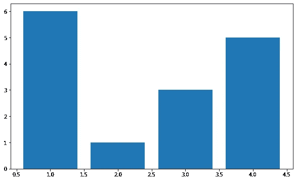
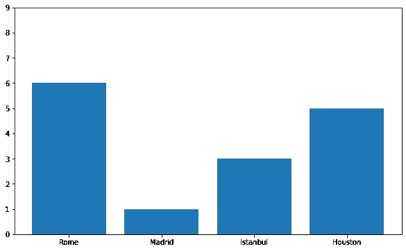
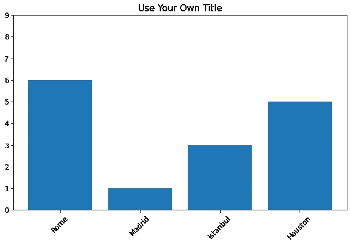
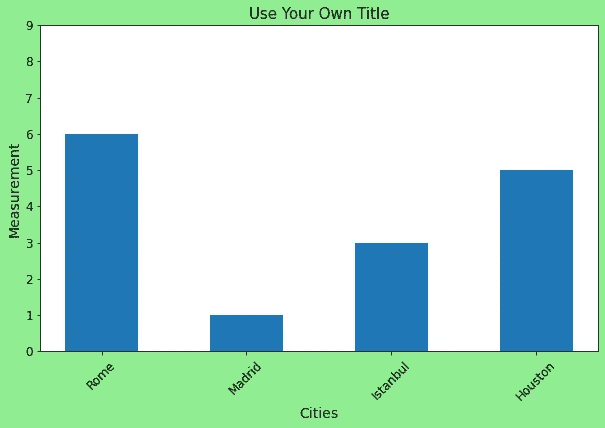
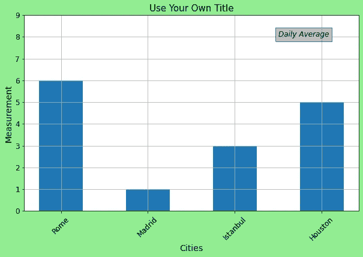
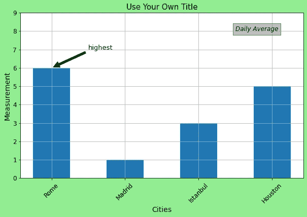

# Matplotlib 的无限灵活性

> 原文：<https://towardsdatascience.com/unlimited-flexibility-of-matplotlib-7c2a95f2e53e?source=collection_archive---------34----------------------->

## 你可以在你的土地上做任何事。


韦斯利·廷吉在 [Unsplash](https://unsplash.com/s/photos/flexible?utm_source=unsplash&utm_medium=referral&utm_content=creditCopyText) 上拍摄的照片

Matplotlib 是一个广泛使用的 Python 数据可视化库，它提供了大量的 2D 和 3D 绘图，对于数据分析和机器学习任务非常有用。

创建一个复杂情节的语法可能看起来吓人，但它提供了很大的灵活性。您几乎可以接触到图上的任何组件并对其进行定制。

在这篇文章中，我将向你展示如何创建一个基本的情节，并通过各种方式定制它。我们将在脚本层工作，这是 **matplotlib.pyplot** 接口。您最有可能在您的分析中使用这个界面。

```
import matplotlib.pyplot as plt
%matplotlib inline #render plots in notebook
```

一切都是从创建一个**图形**开始的，它是将所有东西结合在一起的主要艺术家对象。

```
plt.figure(figsize=(10,6))
```

我们创建了一个大小为(10，6)的图形。让我们在这个图上画一个基本的柱状图。

```
plt.figure(figsize=(10,6))plt.bar(x=[3,4,2,1], height=[3,5,1,6])
```



x 轴上的刻度太多。如果只显示条形的刻度，效果会更好。此外，我想扩展 y 轴上的范围，以便最高的栏不会到达顶部。我们也可以在 x 记号上分配标签，我认为这比简单的数字更好看。

```
plt.figure(figsize=(10,6))plt.bar(x=[3,4,2,1], height=[3,5,1,6])plt.xticks(ticks=[1,2,3,4], 
labels=['Rome','Madrid','Istanbul','Houston'])plt.yticks(ticks=np.arange(10))
```



更高的 punto 标签看起来更好。让我们增加它，并使用**旋转**参数旋转标签。加个标题也不错。

```
plt.figure(figsize=(10,6))plt.title("Use Your Own Title", fontsize=15)plt.bar(x=[3,4,2,1], height=[3,5,1,6])plt.xticks(ticks=[1,2,3,4], labels=['Rome','Madrid','Istanbul','Houston'], rotation="45", fontsize=12)plt.yticks(ticks=np.arange(10), fontsize=12)
```



我们可以用 facecolor 参数给 Figure 对象添加一个框架。xlabel 和 ylabel 函数可用于添加轴标签。也可以使用条形功能的宽度参数来调整条形的宽度。

```
plt.figure(figsize=(10,6), facecolor="lightgreen")plt.title("Use Your Own Title", fontsize=15)plt.bar(x=[3,4,2,1], height=[3,5,1,6], width=0.5)plt.xticks(ticks=[1,2,3,4], labels=['Rome','Madrid','Istanbul','Houston'], rotation="45", fontsize=12)plt.yticks(ticks=np.arange(10), fontsize=12)plt.xlabel("Cities", fontsize=14)plt.ylabel("Measurement", fontsize=14)
```



注释和文本可以用在绘图上，使它们更具信息性或传递信息。Matplotlib 也允许添加它们。

我们将在图上使用 Axes 对象来添加文本和注释。为了在轴上定位这些附件，我们需要使用坐标。因此，添加网格线是有意义的，这可以通过 plt.grid()函数来实现。

让我们首先添加网格线和一个文本框。

```
ax = plt.figure(figsize=(10,6), facecolor="lightgreen").add_subplot(111)plt.title("Use Your Own Title", fontsize=15)plt.bar(x=[3,4,2,1], height=[3,5,1,6], width=0.5)plt.xticks(ticks=[1,2,3,4], labels=['Rome','Madrid','Istanbul','Houston'], rotation="45", fontsize=12)plt.yticks(ticks=np.arange(10), fontsize=12)plt.xlabel("Cities", fontsize=14)plt.ylabel("Measurement", fontsize=14)plt.grid(which='both')ax.text(3.5, 8, 'Daily Average', style='italic', fontsize=12,
        bbox={'facecolor': 'grey', 'alpha': 0.5, 'pad': 5})
```



ax.text()函数的前两个参数分别是 x 和 y 坐标。指定文本和样式后，我们使用 bbox 参数在它周围添加一个框。

让我们也添加一个注释。我不想重复代码的相同部分，所以我只写注释部分。您可以将它添加到生成前一个图的代码中。

```
ax.annotate('highest', xy=(1, 6), xytext=(1.5, 7), fontsize=13,   arrowprops=dict(facecolor='black', shrink=0.05))
```



我们添加了一个指向最高栏顶部的箭头。 **xy** 参数包含箭头的坐标， **xytext** 参数指定文本的位置。 **Arrowprops** ，顾名思义，是用来给箭头造型的。

一旦你对你的绘图满意，你可以使用 **plt.savefig()** 函数保存它。

这篇文章的目的是向你展示 Matplotlib 的巨大灵活性。我们制作的情节可能一点用也没有，但它们传达了信息。语法可能看起来不必要的长，但这是灵活性的代价。

值得一提的是，这只是你可以用 Matplotlib 创建的一部分。例如，支线剧情的结构是一个完全不同的话题。一旦您熟悉了 Matplotlib，您可以创建的东西就没有限制了。

感谢阅读。如果您有任何反馈，请告诉我。