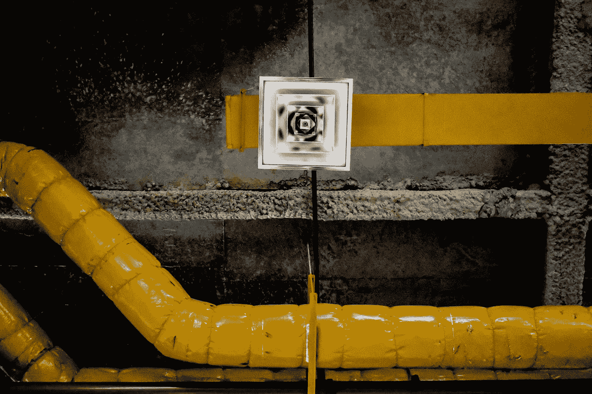
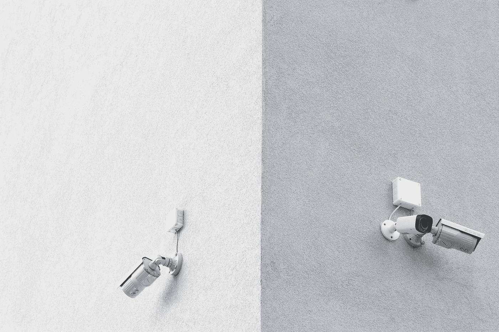
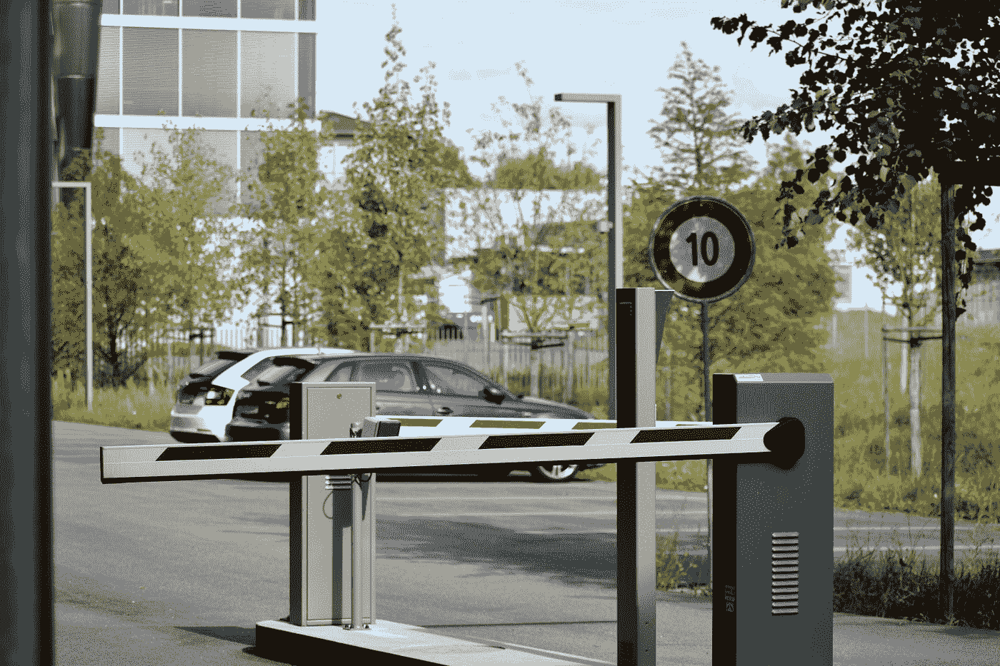
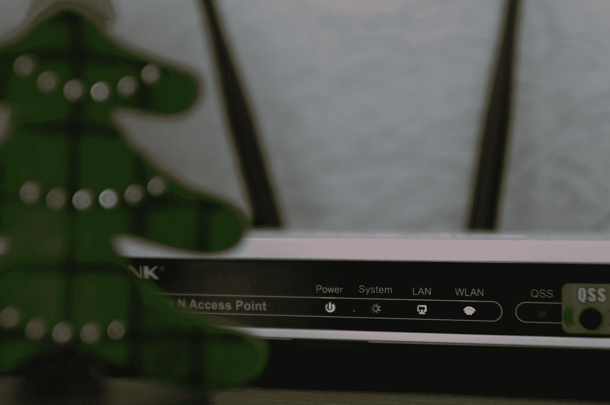

# 解锁您已经拥有的物联网数据

> 原文：<https://towardsdatascience.com/unlock-iot-data-you-already-have-4454ddb4da79?source=collection_archive---------51----------------------->

## 物联网

## 您的建筑物中已经存在的 5 种传感器数据来源


扎克·沃尔夫在 [Unsplash](https://unsplash.com?utm_source=medium&utm_medium=referral) 上的照片

M 机器学习模型极大地受益于物联网传感器数据。AI 和 IoT 早就是一丘之貉，就问[连线](https://www.wired.com/brandlab/2018/05/bringing-power-ai-internet-things/)。

物联网(IoT)是所有的乐趣和游戏，直到是时候购买传感器。众所周知，物联网难以扩展和管理— [30%的物联网项目从未通过概念验证阶段](https://venturebeat.com/2019/07/30/microsoft-30-of-iot-projects-fail-in-the-proof-of-concept-stage/)。

但是，如果我告诉您，您的建筑物中已经有未开发的物联网传感器数据，会怎么样？每座现代商业建筑都布满了传感器。它们已经大规模安装和管理。问题是它们是用于单一用途的封闭系统。

但是，如果您可以解锁传感器数据，它们可以在不需要新硬件的情况下为许多数据科学项目提供动力。

这里有 5 个你应该探索利用的企业系统:

## 1.建筑管理系统(BMS)



[泰勒·维克](https://unsplash.com/@tvick?utm_source=medium&utm_medium=referral)在 [Unsplash](https://unsplash.com?utm_source=medium&utm_medium=referral) 上的照片

[楼宇管理系统](https://www.iotacommunications.com/blog/the-components-of-a-building-management-system/)包括一些控制建筑环境的技术。最常见的包括照明控制系统和 HVAC(空调)系统。

最基本的照明控制系统包括房间和走道中的运动传感器——以前当灯熄灭时，你可能不得不在房间里挥舞手臂。更先进的照明控制系统包括窗户附近的流明传感器，可以在自然光较多的区域调暗灯光以节省电力。

HVAC 系统包括遍布整个建筑的温度传感器，以根据需要调节冷却和加热。

这两个系统在整个建筑中都有环境传感器，只需要一些创造性的集成，就可以将这些传感器反馈用于物联网应用。事实上，这种转变已经发生，因为 [BMS 应用受益于物联网集成](https://www.iotforall.com/iot-meets-building-automation/)。

这是一个伪数据集，显示了您可能从 BMS 运动传感器获得的信息:

```
{
  "zoneID": 129043805,
  "zoneName": "**Front Lobby**",
  "events": [
    "movement": **FALSE**, "timestamp": "**2012-04-21T18:00:00-05:00**"},
    "movement": **FALSE**, "timestamp": "**2012-04-21T18:30:00-05:00**"},
    "movement": **TRUE**, "timestamp": "**2012-04-21T19:00:00-05:00**"}]
}
```

## 2.实时定位系统(RTLS)


由[查理兹·伯德辛格](https://unsplash.com/@charlize?utm_source=medium&utm_medium=referral)在 [Unsplash](https://unsplash.com?utm_source=medium&utm_medium=referral) 上拍摄的照片

作为物联网的鼻祖， [RTLS](https://en.wikipedia.org/wiki/Real-time_locating_system) 十多年来已经证明了物联网如何提供价值。事实上，预计到 2024 年，RTLS 市场将增长至近 120 亿美元。

RTLS 包括放置在企业想要跟踪位置的资产或人员上的标签。这些标签与传感器和网关的专用基础设施进行通信。基于这些通信，一种算法计算出标签在室内平面图上的估计位置。

RTLS 用于减少寻找物品所花费的时间，并自动化具有位置驱动事件的工作流。RTLS 是物联网应用背景数据的金矿。

以下是您可能从 RTLS 获得的伪数据集:

```
{
  "tagID": 129043805,
  "assetName": "**Kevin's backpack**",
  "zone": "**Front Lobby**",
  "location": [
    "X": 1.34095, "Y": "5.3257", "variance": 2, "timestamp": "**2012-04-21T18:00:00-05:00**"},
  ],
}
```

## 3.安全监控系统



由[paweczerwiński](https://unsplash.com/@pawel_czerwinski?utm_source=medium&utm_medium=referral)在 [Unsplash](https://unsplash.com?utm_source=medium&utm_medium=referral) 上拍摄的照片

几乎每个商业建筑都有安全摄像头进行基本监控。至少，它们用于记录活动，以防现场犯罪需要证据。

一段时间以来，这些[安全监控系统](https://www.inc.com/operations/guide-to-video-surveillance-systems.html)已经从老式的学校同轴电缆连接过渡到可以在您的内部网络上访问的基于 IP 的连接。[蜂窝视频摄像头连接的增长预计将从 2019 年的 370 万增长到 2024 年的超过 2000 万](https://www.wfmz.com/news/pr_newswire/pr_newswire_technology/connected-video-cameras-market-insights-2020-cellular-iot-connections-for-video-camera-applications-forecast-to/article_53bd2169-7917-5d67-80c3-398e57abe282.html)。

可以在这些现有的视频流上使用计算机视觉(CV)来收集上下文数据并生成警报。CV 由机器学习(ML)模型提供支持，这些模型经过训练，可以识别一系列图像中的对象、人和事件。

这是一个伪数据集，你可以从 CV 算法中得到:

```
{
  "cameraID": 129043805,
  "location": '**Front Lobby**',
  "objects": [
    {"type": "object", "name": "**coffee**", "confidence": 75},
    {"type": "person", "name": "**Kevin Ferris**", "face mask": **TRUE**,    "confidence": 98}]
}
```

## 4.门禁系统



照片由 [Mauro Sbicego](https://unsplash.com/@maurosbicego?utm_source=medium&utm_medium=referral) 在 [Unsplash](https://unsplash.com?utm_source=medium&utm_medium=referral) 拍摄

大多数办公室不会让任何人大摇大摆地进来——你需要证明你被允许在那里。[门禁系统](https://www.inc.com/operations/guide-to-access-control-systems.html)为你用来开门的徽章阅读器供电。

通常，这些标签阅读器使用无源 RFID 技术。这意味着读取器完成所有工作，因此徽章不需要电池。

员工徽章实际上是一种物联网设备。它是员工身份和凭证的小型物理表示。

一些物联网应用需要识别人员来提供个性化体验。但是，没有人想携带另一个“东西”来启动物联网解决方案。也不是每个人都希望他们的手机被追踪——去年主要新闻媒体敦促消费者禁用位置追踪。

员工徽章和您的访问控制系统是将人类身份输入物联网应用程序的可重复模型。

以下是您可能从访问控制系统中获得的伪数据集:

```
{
  "readerID": 129043805,
  "location": '**Front Lobby**',
  "events": [
    {"eventID": 452902, "badgeID": 12345, "name": "**Kevin Ferris**",            "timestamp": "**2012-04-21T18:25:43-05:00**"}]
}
```

## 5.无线网络接入点



米沙·费舍切克在 [Unsplash](https://unsplash.com?utm_source=medium&utm_medium=referral) 上拍摄的照片

人们需要连接到互联网。以太网已经不再适用了——无线互联网连接在几乎所有的商业环境中都是不可或缺的。

天花板上的每个 Wi-Fi 接入点都是网络连接的网关。但是，您是否考虑过它们也可以成为物联网网关？

一些传感器端点可以通过 Wi-Fi 回程，因此您不必购买独立的物联网网关。代价是 Wi-Fi 连接增加了小型物联网设备的功耗。

为了帮助解决这个问题，许多 Wi-Fi 供应商正在为他们的接入点增加其他无线通信无线电，例如:

*   [蓝牙&蓝牙低能耗(BLE)](https://www.bluetooth.com/learn-about-bluetooth/bluetooth-technology/radio-versions/)
*   [Zigbee](https://zigbeealliance.org/solution/zigbee/)
*   [RFID(通常为 900 MHz)](https://en.wikipedia.org/wiki/Radio-frequency_identification)

这些无线电对于物联网设备来说更加省电，这意味着它们可以在不牺牲性能的情况下使用电池持续更长时间。

检查您的 Wi-Fi 接入点，了解他们有哪些可用于物联网回程的无线无线电。

最后，企业 Wi-Fi 供应商经常向客户的 IT 网络支持团队提供分析工具，如[思科的 DNA 平台](https://www.cisco.com/c/en/us/solutions/enterprise-networks/dna-analytics-assurance.html)或 [Aruba 的运营智能平台](https://www.arubanetworks.com/products/location-services/analytics/)。虽然这些系统侧重于问题解决的性能指标，但它们也经常捕获可用于了解谁的设备连接到哪里的客户端数据。

## 将数据整合在一起，讲述一个故事

根据上面的伪数据集，如果没有被孤立起来，这些系统有数据来讲述一个令人信服的故事。

一个引人注目的物联网数据云平台可以实现这一梦想，但这并不容易:

[](https://medium.com/datadriveninvestor/does-the-customer-need-an-iot-platform-10c52286586d) [## 如果我们想要发展物联网行业，我们需要重新设计物联网平台体验

### 扩展物联网时的 3 大客户痛点

medium.com](https://medium.com/datadriveninvestor/does-the-customer-need-an-iot-platform-10c52286586d) 

作为一个示例事件，当我进入办公室的主大厅时，我们可以利用现有的基础架构捕捉到以下内容:

*   BMS 系统*知道至少有一个人在主大厅*
*   RTLS 系统知道凯文的背包在大厅里
*   安全监视系统证明凯文在大厅里
*   *门禁系统*知道凯文在大厅扫描了他的徽章
*   *Wi-Fi 接入点*知道 Kevin 的 iPhone 连接到网络

> 您已经拥有物联网传感器，去解锁它们吧