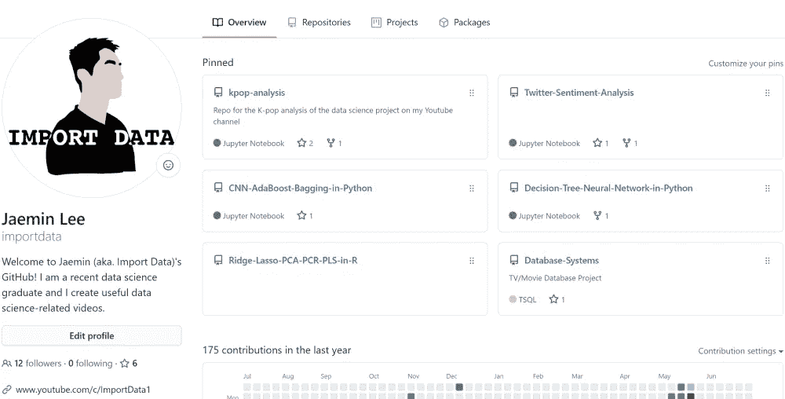
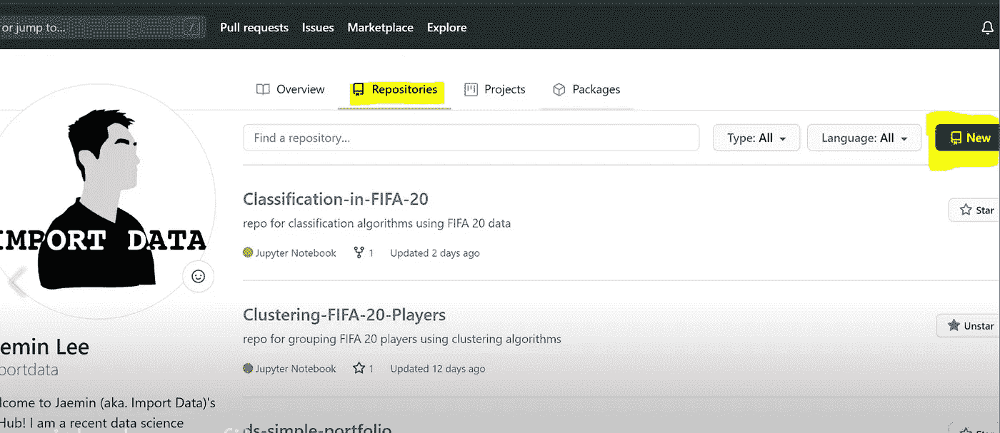
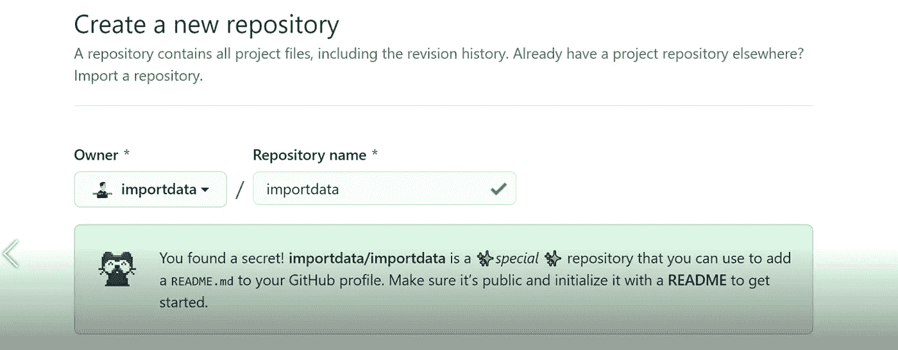
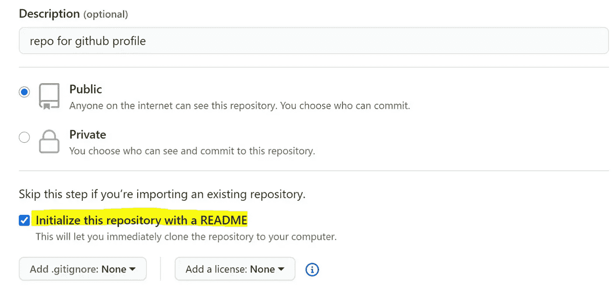
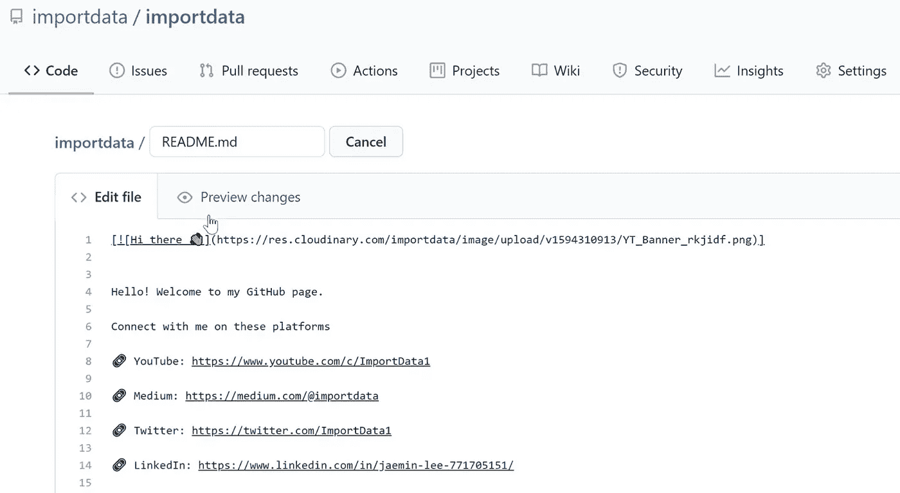
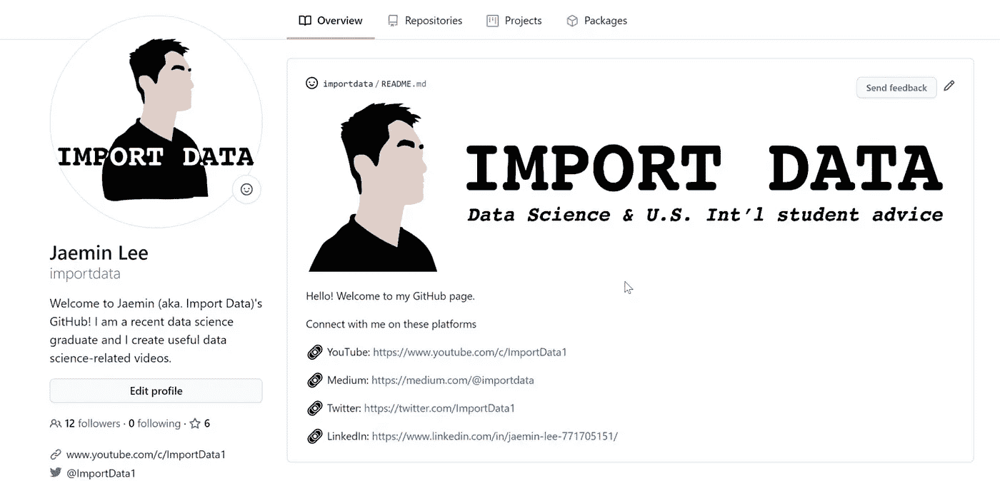

# 3 分钟解锁 GitHub 的隐藏功能

> 原文：<https://towardsdatascience.com/unlocking-githubs-hidden-feature-in-3-minutes-2c21c8e47a20?source=collection_archive---------42----------------------->

## 关于如何定制 GitHub 个人资料页面的简单说明

照片由[晨酿](https://unsplash.com/@morningbrew?utm_source=unsplash&utm_medium=referral&utm_content=creditCopyText)在 [Unsplash](https://unsplash.com/s/photos/unlock?utm_source=unsplash&utm_medium=referral&utm_content=creditCopyText) 拍摄

视频版本

# 介绍

GitHub 最近有一个巨大的更新，显然他们增加了一个隐藏的功能！这可以让你自定义你的个人资料页面，我认为这是一个很酷的功能。这只要几步就能做到！

# 步伐

*   **前往你的 GitHub 页面**

*   **创建新的存储库**

*   **用您的用户名命名您的存储库以解锁隐藏功能**

*   **初始化 READ.me 文件**

*   **玩降价游戏，根据自己的喜好定制**

[**降价备忘单链接**](https://www.markdownguide.org/cheat-sheet/)

*   **尽情享受你酷炫的个人资料页面吧！**

最后一眼

希望你觉得这个教程有用！感谢您的阅读！