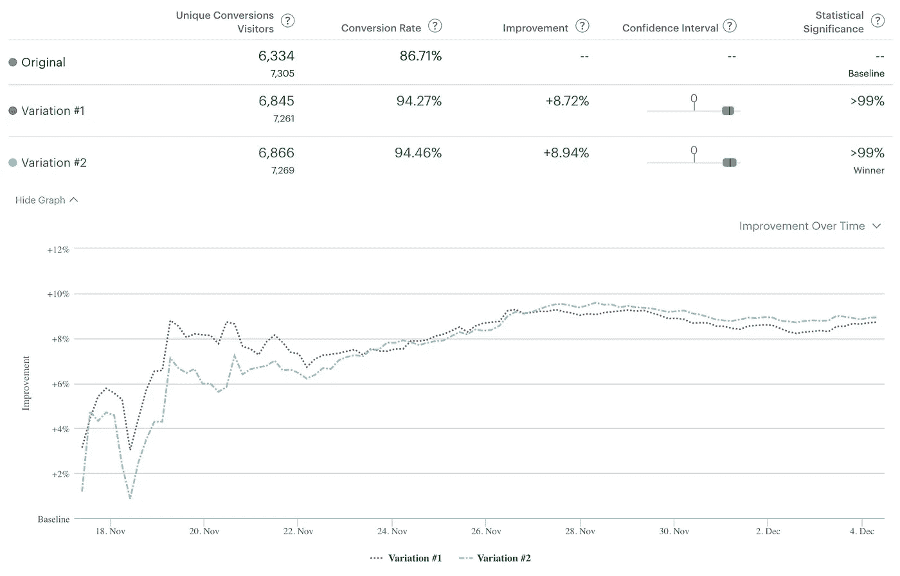
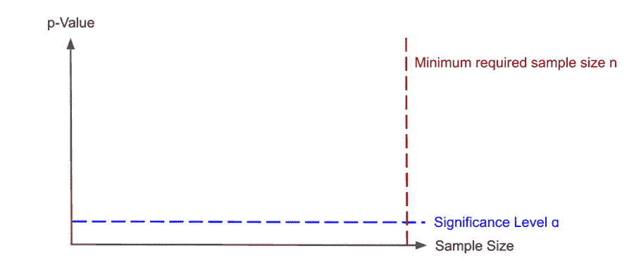
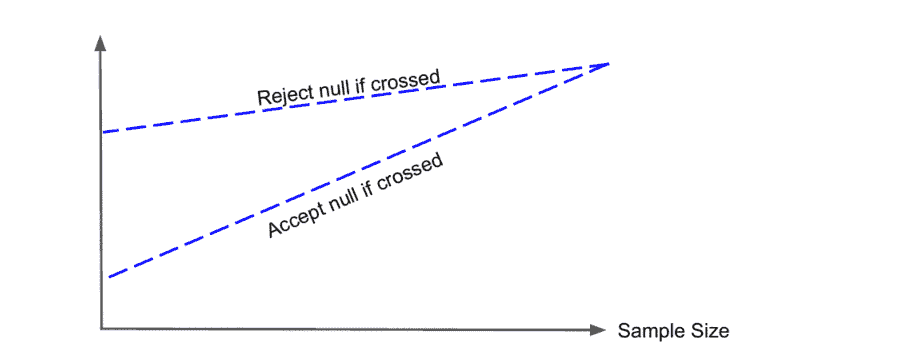
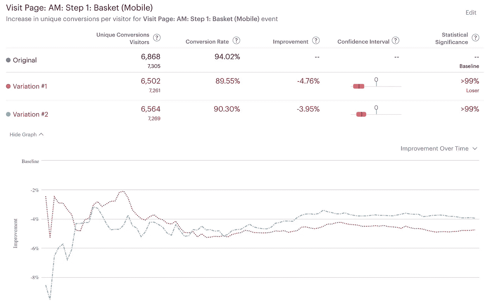

# 在 AB 测试中解锁偷看

> 原文：<https://towardsdatascience.com/unlocking-peeking-in-ab-tests-7847b9c2f6bb?source=collection_archive---------9----------------------->

(图片来自 [Unsplash](https://unsplash.com/photos/F85pIdl7cS8) 由 [Pawel Szvmanski](https://unsplash.com/@szvmanski) 拍摄)

## [入门](https://towardsdatascience.com/tagged/getting-started)

## 像 Optimizely 这样的实验平台是如何忽略 AB 测试中最基本的原则之一的

在 AB 测试的世界里，你学到的第一条原则是:*在你达到最小样本量之前，不要看你的结果！*

像 Optimizely 这样的 AB 测试平台使用户能够在实验进行的任何时候监控甚至解释测试结果。但是这些产品怎么能允许从业者忽略 AB 测试的这个非常基本的原则呢？

在这篇文章中，我阐明了:

*   为什么**偷看**可以帮助**提高业务数字**但同时会损害传统 AB 测试的结果，
*   **顺序测试**如何允许连续监控 AB 测试和
*   最大的 AB 测试平台**如何优化**利用顺序测试来允许具有不同测试偏好的用户在其可视界面中监控他们的测试:

优化监控 AB 测试(图片由作者提供)

# 我们为什么要偷看

收集足够的样本可能需要几周甚至几个月的时间，我们有充分的理由想要更早地检查我们的结果(也称为*偷看*)。

> 我们希望 peek 能够最大限度地减少不良测试的危害，最大限度地提高良好测试细胞的益处。

让我们假设我们正在测试网站结账页面的新设计。如果设计损害了转换率，我们希望尽早停止实验，以防止任何进一步的收入损失。另一方面，如果设计迫使更多的用户完成他们的购买，我们也希望尽早停止测试，这样所有的用户都可以接触到新的设计。在这两种情况下，提前结束实验都会对我们的收入产生积极影响。

# 为什么你不应该偷看 AB 测试

在获得所需的最小样本量之前不检查结果是 AB 测试的基本原则之一。这是由于固定样本量测试的性质以及它们是如何进行的:

1.  **设置参数**，如显著性水平、功率水平和最小可检测效应
2.  计算**最小所需样本量**n*n*
3.  运行测试并**收集每个测试单元的 *n* 个样品**
4.  计算 p 值，如果 p 值低于选定的显著性阈值，则**拒绝零假设**

人们可能会试图持续监测 p 值，一旦它低于我们的显著性阈值，就反驳零假设。看看下面的图表。当我们获得更多样本时，p 值会随时间波动。假设我们在获得所需的样本大小 n 之前查看了 8 次，由黑点和红点表示。每次我们查看并且 p 值达到显著性阈值(用红点标记)时，我们都会拒绝零假设:

随着时间的推移监测 p 值(图片由作者提供)

听起来很直观，不是吗？

不幸的是，持续监控我们的测试统计数据(或偷看)增加了反驳零假设的可能性，尽管没有真正的效果。当建立一个实验时，我们使用显著性水平来设置我们想要的假阳性率(或 I 型错误率)。显著性水平决定了我们**错误地**得出实验中存在真实效应的概率。因此，如果我们将显著性水平设定为 5%，那么我们**错误地**推断我们的新设计、活动或功能具有真实效果的可能性不超过 5%。

> 控制错误拒绝零假设的风险在 AB 测试中至关重要。

在 AB 测试中，控制我们做出错误决定的概率并拒绝零假设是至关重要的，尽管它是真实的。想象一下，我们错误地认为一个昂贵的活动对我们的测试用户有积极的影响，现在我们把它推广给其他人。我们会白白花很多钱！

## 窥视和假阳性率(或 I 型错误)

测试的假阳性率是基于这样的假设，即在获得足够的样本后，我们只检查结果一次。计算所需的最小样本量，以便当我们有足够的样本时，在查看结果时错误地反驳零假设的概率是选定的*显著性水平*。相反，如果我们在进行测试时检查结果 k 次，我们有 k 次机会根据结果做出错误的决定。**因此，每次查看结果时，我们测试的 I 型错误率都会增加！**

通过窥视，我们最终会得到比实际值小得多的名义 p 值。因此，我们更有可能反驳一个真正的假设。

> **一旦 p 值低于显著性水平，我们就不能停止测试并反驳零假设。**

因此，在经典 AB 测试设置中获得可靠测试结果的唯一方法是等待测试收集足够的样本，然后决定是否反驳零假设。在我们进行测试和收集样本时，不管你的测试结果看起来有多离谱。

但幸运的是，所谓的*连续 AB 测试*允许连续监测 p 值，并根据观察到的结果更早地做出否定假设的决定！让我们来看看这些是如何工作的。

# 允许通过连续的 AB 测试进行窥视

在序贯 AB 检验中，AB 检验停止时的最终样本量取决于我们在检验过程中观察到的数据。因此，如果我们在开始时观察到更极端的结果，测试可以更早结束。为了实现这一点，绘制了一对统计边界，例如基于我们希望在测试中获得的 I 类错误率。对于我们获得的每个新数据点，我们的数据的对数似然比之和将与这些边界进行比较:

连续 AB 测试(图片由作者提供)

如你所见，我们收集的样本越多，界限就越窄。这意味着在开始时，我们将不得不看到非常极端的影响，以尽早停止测试。随着样本越来越多，我们获得了更高的精度(或功效),因此我们可以检测到更小的影响，从而边界可以变得更窄。

基于此，可以在测试运行的任何时间点实施以下决策规则:

*   **没有越界:**继续测试
*   **上界交叉:**反驳零假设
*   **下边界交叉:**停止测试，不反驳零假设

有了这套规则，如果存在强烈的影响，测试可以在少量样本后就停止！因此，如果我们从实验一开始就看到非常积极的效果，我们的奇妙设计可能已经发布给用户了。

# Optimizely 的统计引擎背后的逻辑

*免责声明:根据我的经验，所有主要的 AB 测试平台都提供了实时监控实验的可能性。我特别提到 Optimizely，因为他们的方法已经发表在* [*科学论文*](http://library.usc.edu.ph/ACM/KKD%202017/pdfs/p1517.pdf) *中。*

Optimizely 将自己描述为*世界领先的渐进式交付&实验平台。*与其他供应商相比，他们的竞争优势之一是其复杂的统计引擎。其中，该模型允许用户实时监控他们的测试，并就何时停止实验做出明智的决定。

优化监控 AB 测试(图片由作者提供)

## 顺序 AB 测试的问题是

当使用顺序 AB 测试时，我们通常权衡检测率(或功率)和运行时间。我们越愿意进行更长时间的测试，我们的检出率就越高。

有各种顺序 AB 测试模型，在功耗和运行测试的时间量之间有不同的权衡。当然，我们总是可以为我们的特定用例选择正确的模型，并在检测率和我们希望运行测试的时间量之间取得平衡。但是这在 AB 测试平台中是不可行的，AB 测试平台有大量的用户基础，并且关于这种平衡有非常不同的偏好。

因此，Optimizely 团队认为用户需要自己决定功率和样本大小之间的平衡。在这个目标的基础上，开发了总是有效的 p 值的概念。

## 构建始终有效的 p 值

如果你走到这一步，请忍耐。下一段会有一点技术性，但是我尽量简单明了的把它分解了！下面是始终有效的 p 值的定义:

> 给定一个序贯检验，观察值 I 处始终有效的 p 值被定义为最小的α*【或显著性水平】*，因此α水平检验将在点 I 处停止并拒绝 H0。

这意味着，在测试过程中的任何时候，你都可以要求一个最小的显著性阈值，在这个阈值上，你已经拒绝了零假设。如果该水平低于用户期望的显著性水平(例如 5%)，则可以拒绝零假设，并且用户可以结束测试。这个过程保证了当我们决定拒绝零假设时，零假设事实上为真的概率(I 型错误率)在任何时间点都等于或小于我们期望的显著性水平。

为了计算测试统计数据，Optimizely 的统计引擎建立在一种特定类型的顺序测试之上，称为*混合顺序概率比测试* (mSPRT)。这种类型的顺序测试提供了运行时间和功率之间的最佳平衡。mSPRT 背后的逻辑很简单:

1.  使用我们拥有的 *n* 个样本，计算针对零假设(没有影响)的似然比。
2.  如果似然比λ**高于我们的显著性阈值，则拒绝零假设。**

**可以证明，如果存在真正的差异，mSPRT 将总是在某个点拒绝零假设。否则，它将永远继续运行。**

**数据点 *n* 的始终有效的 p 值被定义为前一数据点的 p 值和新的对数似然比的最小值，包括所有可用的数据点:**

****

**始终有效的 p 值可以在任何时间点以流式方式计算。可以在 Optimizely UI 中持续监控该指标，一旦达到预定义的显著性阈值，用户就可以停止测试。用户也可以决定在他们个人的最大运行时间提前结束测试，从而以统计能力为代价减少运行时间。**

# **摘要**

**众所周知，在获得最小样本量之前，不应该检查 AB 测试的结果。与此同时，我们有充分的理由想要偷看。尽早停止测试会对企业产生重大的经济影响。**

**幸运的是，有一些方法，如连续 AB 测试和始终有效的 p 值，可以持续监控实验结果。我希望这篇文章很好地概述了这些方法是如何工作的，以及它们背后的思想是什么。**快乐偷看！****

## **参考资料和进一步阅读**

*   **[在线 AB 测试中的统计方法](https://www.amazon.co.uk/Statistical-Methods-Online-Testing-commerce/dp/1694079724/ref=asc_df_1694079724/?tag=googshopuk-21&linkCode=df0&hvadid=375380075215&hvpos=&hvnetw=g&hvrand=17238558558700161845&hvpone=&hvptwo=&hvqmt=&hvdev=c&hvdvcmdl=&hvlocint=&hvlocphy=9044965&hvtargid=pla-825098628161&psc=1&th=1&psc=1&tag=&ref=&adgrpid=79766932074&hvpone=&hvptwo=&hvadid=375380075215&hvpos=&hvnetw=g&hvrand=17238558558700161845&hvqmt=&hvdev=c&hvdvcmdl=&hvlocint=&hvlocphy=9044965&hvtargid=pla-825098628161)(乔治·乔尔杰夫)**
*   **[窥视 AB 测试:为什么它很重要，以及如何处理它](http://library.usc.edu.ph/ACM/KKD%202017/pdfs/p1517.pdf)(乔哈里等人)**
*   **新的统计引擎**
*   **[始终有效的推断:持续监控 A/B 测试](https://www.youtube.com/watch?v=BanBrr3Hzm8)**

## **更多关于 AB 测试的文章:**

** [## 社交网络中的 AB 测试挑战

### 脸书和他的同事如何在 AB 测试中克服互联用户的挑战。

towardsdatascience.com](/ab-testing-challenges-in-social-networks-e67611c92916)  [## 为 AB 测试找到正确的显著性水平

### 为什么使用默认的 95%显著性和 80%功效水平的 AB 测试可能无法评估业务风险…

towardsdatascience.com](/finding-the-right-significance-level-for-an-ab-test-26d907ca91c9)**