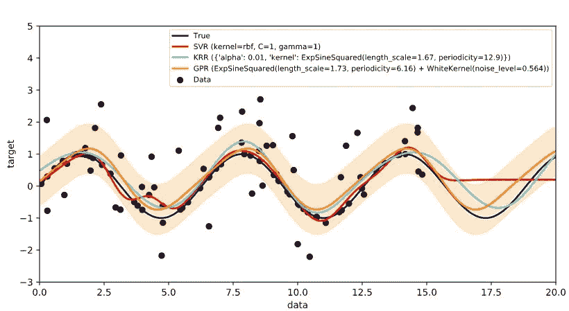
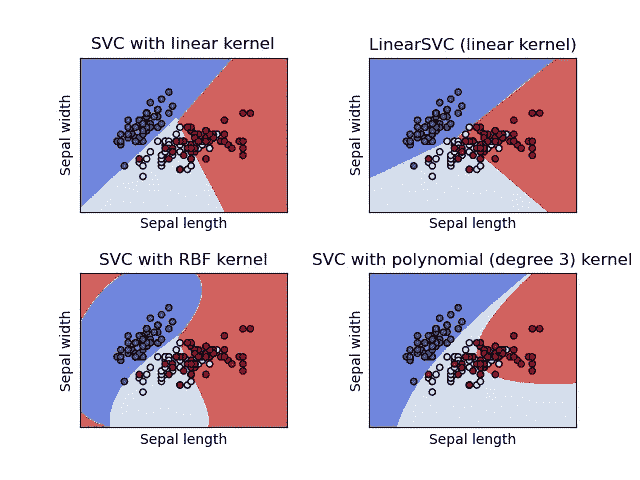
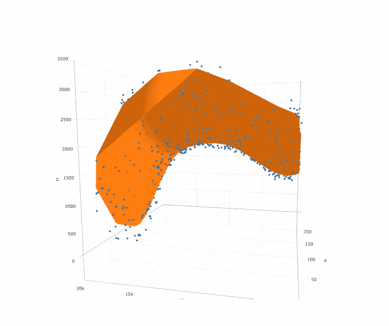
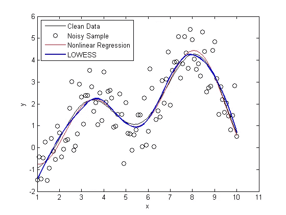
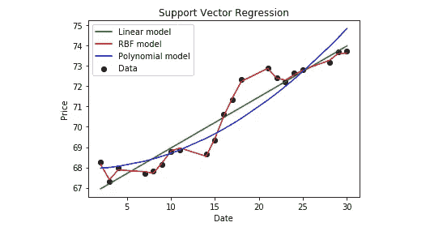

# 释放支持向量回归的真正力量

> 原文：<https://towardsdatascience.com/unlocking-the-true-power-of-support-vector-regression-847fd123a4a0?source=collection_archive---------0----------------------->


图片来自 [Pixabay](https://pixabay.com/?utm_source=link-attribution&utm_medium=referral&utm_campaign=image&utm_content=2104445)

## 用支持向量机解决回归问题

支持向量机是机器学习中处理分类问题的最流行和最广泛使用的算法之一。然而，支持向量机在回归中的使用并没有很好的记录。该算法承认数据中非线性的存在，并提供了一个熟练的预测模型。

在本文中，我将首先通过深入研究算法背后的理论，让您对算法有一个直观的理解。然后，我们将建立我们自己的 SVM 回归模型。最后，我们将探讨使用支持向量回归机的一些优点。

SVM 回归算法被称为**支持向量回归**或 **SVR** 。在开始学习算法之前，我们有必要对支持向量机有一个直观的了解。

# 支持向量机

在机器学习中，支持向量机是具有相关学习算法的监督学习模型，这些算法分析用于分类和回归分析的数据。在支持向量回归中，拟合数据所需的直线被称为**超平面**。



图片来自[维基共享资源](https://commons.wikimedia.org/wiki/File:Regressions_sine_demo.svg)

支持向量机算法的目标是在 n 维空间中找到一个超平面，该超平面清楚地分类数据点。超平面两侧最接近超平面的数据点称为**支持向量**。这些影响超平面的位置和方向，从而有助于建立 SVM。

# **SVR 中的超参数**

既然我们对什么是支持向量机有了直观的认识，我们将研究支持向量回归中使用的各种超参数。使用的一些关键参数如下所述:

## **1。超平面:**

超平面是用于预测连续输出的决策边界。超平面任一侧最接近该超平面的数据点称为支持向量。这些用于绘制显示算法预测输出的所需线条。

## **2。内核:**

内核是一组数学函数，它将数据作为输入，并将其转换为所需的形式。这些通常用于在高维空间中寻找超平面。



图片来自 [Sci Kit Learn](https://scikit-learn.org/stable/modules/svm.html)

应用最广泛的核包括**线性**、**非线性**、**多项式**、**径向基函数**和 **Sigmoid** 。默认情况下，RBF 用作内核。这些核的使用取决于数据集。

## **3。** **边界线:**

这是在超平面周围距离**ε(ε)**处画的两条线。它用于在数据点之间创建边距。

# **支持向量回归**

支持向量回归是一种监督学习算法，用于预测离散值。支持向量回归机使用与支持向量机相同的原理。支持 SVR 的基本思想是找到最佳拟合线。在 SVR 中，最佳拟合线是具有最大点数的超平面。



图片来自 [Semspirit](http://www.semspirit.com/artificial-intelligence/machine-learning/regression/support-vector-regression/support-vector-regression-in-r/)

与试图最小化实际值和预测值之间的误差的其他回归模型不同，SVR 试图在阈值内拟合最佳直线。阈值是超平面和边界线之间的距离。SVR 的拟合时间复杂度大于样本数量的二次方，这使得它很难扩展到具有超过 10000 个样本的数据集。

对于大型数据集，使用**线性 SVR** 或 **SGD 回归器**。线性 SVR 提供了比 SVR 更快的实现，但是只考虑线性核。由支持向量回归产生的模型仅依赖于训练数据的子集，因为成本函数忽略了预测接近其目标的样本。



图片来自 [MathWorks 博客](https://blogs.mathworks.com/loren/2011/01/13/data-driven-fitting/)

现在我们有了什么是支持向量回归机的要点，我们将尝试构建我们自己的 SVR 回归机。构建这个回归模型的代码和其他资源可以在这里找到[。](https://github.com/ashwinraj-in/MachineLearningTutorials/blob/master/SupportVectorRegression.ipynb)

## **第一步:导入所需的库**

我们的第一步是导入构建模型所需的库。没有必要在一个地方导入所有的库。Python 给了我们在任何地方导入库的灵活性。首先，我们将导入 Pandas、Numpy、Matplotlib 和 Seaborn 库。

```
#Import the Libraries and read the data into a Pandas DataFrameimport pandas as pd
import numpy as np
import matplotlib.pyplot as plt
import seaborn as snstest = pd.read_csv("california_housing_test.csv")
train = pd.read_csv("california_housing_train.csv")
```

一旦导入了这些库，我们的下一步将是获取数据集并将数据加载到我们的笔记本中。对于这个例子，我使用了加州住房数据集。

## **第二步:可视化数据**

成功加载数据后，我们的下一步是可视化这些数据。**海滨**是一个优秀的库，可以用来可视化数据。

```
#Visualise the dataplt.figure()
sns.heatmap(data.corr(), cmap='coolwarm')
plt.show()sns.lmplot(x='median_income', y='median_house_value', data=train)
sns.lmplot(x='housing_median_age', y='median_house_value', data=train)
```

## **第三步:特征工程**

特征工程是利用领域知识通过数据挖掘技术从原始数据中提取特征的过程。对于这个模型，我选择了只有数值的列。为了处理分类值，应用了标签编码技术。

```
#Select appropriate featuresdata = data[[‘total_rooms’, ‘total_bedrooms’, ‘housing_median_age’, ‘median_income’, ‘population’, ‘households’]]
data.info()data['total_rooms'] = data['total_rooms'].fillna(data['total_rooms'].mean())
data['total_bedrooms'] = data['total_bedrooms'].fillna(data['total_bedrooms'].mean()
```

要素缩放基本上有助于在特定范围内归一化数据。通常，几个常见的类类型包含特征缩放功能，以便自动进行特征缩放。

## **第四步:拟合模型**

选择所需参数后，下一步是从 sklearn 库中导入 train_test_split，该库用于将数据集拆分为训练和测试数据。

```
#Split the dataset into training and testing dataimport train_test_split
X_train, X_test, y_train, y_test = train_test_split(train, y, test_size = 0.2, random_state = 0)y_train = y_train.reshape(-1,1)
y_test = y_test.reshape(-1,1)
```

在此之后，从 **sklearn.svm** 导入 **SVR** ，并且模型适合训练数据集。

```
# Fit the model over the training datafrom sklearn.svm import SVR
regressor = SVR(kernel = 'rbf')
regressor.fit(X_train, y_train)
```

这里，在这个特殊的例子中，我使用了 RBF 核。模型的其他参数保留其默认配置。一旦模型适合训练数据，我们的模型就可以使用了。

# **支持向量回归的优势**

尽管支持向量回归很少使用，但它具有如下优点:

1.  它对异常值是鲁棒的。
2.  决策模型可以很容易地更新。
3.  它具有良好的泛化能力，预测精度高。
4.  它的实现很容易。



图片由戴尔·阮

# 支持向量回归的缺点

支持向量机在处理回归问题时面临的一些缺点如下所述:

1.  它们不适合大型数据集。
2.  如果每个数据点的特征数量超过了训练数据样本的数量，则 SVM 将表现不佳。
3.  当数据集具有更多噪声时，即目标类重叠时，决策模型的表现不是很好..

至此，我们已经到了这篇文章的结尾。我希望这篇文章能够帮助您了解 SVR 算法背后的思想。如果你有任何问题，或者如果你认为我有任何错误，请联系我！您可以通过[邮箱](http://rajashwin812@gmail.com/)或 [LinkedIn](http://linkedin.com/in/rajashwin/) 与我联系。