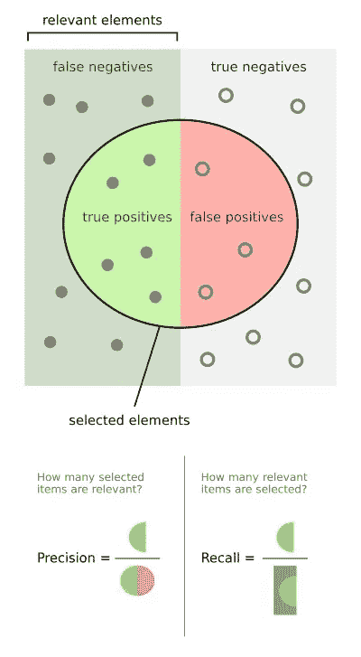
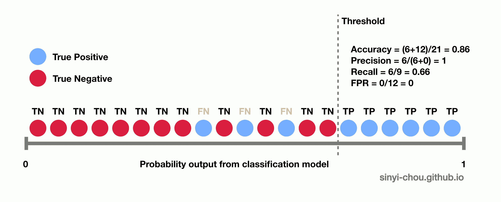

# 解开客户流失及其挑战

> 原文：<https://towardsdatascience.com/unraveling-churn-and-its-challenges-a207276ff4a9?source=collection_archive---------50----------------------->

Jornada Produtora 在 [Unsplash](https://unsplash.com/photos/UHSjj-7jPYQ) 上拍摄的照片

## 了解降低业务流失率的原因和方法

关系管理是企业健康发展的决定性因素之一。这种联系的最重要因素之一是识别客户何时可能取消服务的能力。因此，有必要采取措施最大限度地留住客户。

因此，识别易流失客户的项目已成为组织经常关注的问题，因为保留客户的成本通常低于获取客户的成本。

虽然它获得了许多公司的关注，但没有解决流失问题的神奇公式。此外，该解决方案可能有许多复杂性，如确定客户流失原因以应用不同的保留策略。

# **挑战**

## **获取新客户的成本是否大于留存成本？**

为了获得和留住客户，观察财务和战略支出是至关重要的，因为对于一些公司来说，获得成本可能比留住成本高 5 倍。

## 什么类型的客户流失将被处理？

需要强调的是，产品或服务的流失会以多种方式增加，例如:

1.  **志愿者**:当客户因对竞争对手不满或偏爱而选择取消服务时。
2.  **静默**:当客户长时间停止使用服务，并且不产生费用时发生——就像使用没有月费的信用卡一样。
3.  **非自愿**:当消费者不打算取消服务，但由于疏忽，他的计划可能因不正常使用、未付款等原因而未能延期或取消。

## 你的专家对这个问题了解多少？

拥有一个熟练的团队对于分析项目是否可以内部执行或者是否需要外包帮助是非常重要的。个性化的解决方案和有准备的专业人员可以帮助克服问题的挑战，并获得丰富和适用的结果。

## 您是否有一个数据库可以让您提取关于企业及其客户的信息？

一个可靠的数据库使项目执行更加可行，并产生可靠的结果。这是获得客户知识，进而了解如何规划和开发您的解决方案的基本步骤。这就引出了下一个问题:

## 你有多了解你的客户？

还需要诊断您的行为如何影响客户，为此，您需要收集定义客户个人特征和行为的信息。这种分析是确定他们是否容易流失的关键。

# 解决的方法

说到解决问题，专家团队还需要克服一些挑战。第一个是关于结合技术知识和业务理解，因为探索性分析和特性工程必须考虑组织模型才能成功。

在特征整合和业务洞察插入之后，是时候开始建模了。在这一阶段，你可能会遇到不平衡的数据，换句话说，通过划分客户群和忠实客户群，你可能会发现更高比例的忠实客户。

不平衡数据的最大问题是，如果不解决这个问题，机器学习算法往往只会对大多数类别有良好的响应。这意味着许多假阴性的产生，因为有一种倾向将可能离开的客户归类为忠诚客户。

## 处理不平衡数据的技术

在这一点上，有必要使用技术来解决不平衡的数据集问题，并优化客户行为的过滤器。其中我们可以提到一些最常见的:过采样、欠采样、SMOTE 和 ADASYN。值得一提的是，他们都不是通才，这就解释了为什么每个问题都要根据其特殊性来对待。

欠采样和过采样是更基本的技术，分别意味着代表性大的类的减少和代表性小的类的扩大。

SMOTE 和 ADASYN 更复杂，它们对数据进行合成采样。两者都是类似的策略，但 ADASYN 使用密度分布来创建合成元素。

## 了解您的客户流失解决方案的性能

客户流失模型必须建立在预期响应的基础上，关注性能和输出应该如何呈现。衡量模型性能时，选择正确的评估指标非常重要。例如，准确性可能会给我们一个令人震惊的模型的错误感觉，然而，结果可能是由于只对多数类进行了正确的分类——其中不存在流失。

精确和召回——图片来自[维基百科](https://en.wikipedia.org/wiki/Precision_and_recall)上的[沃尔伯](https://commons.wikimedia.org/wiki/User:Walber)

这种评估可以集中在解决方案在多大程度上改进了您当前的保留策略。如果我们认为保留行为是在随机客户上进行的，我们可以评估模型所指示的样本将在多大程度上改进对易于流失的客户的选择。

传统的评估指标，如精确度和召回率，也非常有用。前者是正确指示的数量占指示总数的比例，而第二个是正确分类的流失客户占流失总数的百分比。另一种方法是 f1 分数，可描述为:

F1 = 2 *(精度*召回)/(精度+召回)

## 了解结果

为了评估要使用的指标，考虑到预期未来收入的潜力(终身价值——LTV)，了解留住客户的运营成本至关重要。

LTV 高的客户可能认为保留客户需要更高的费用，而 LTV 低的客户可能认为保留客户的投资不值得。

从保留客户的参数的知识中，该操作可以被标记出来，不管它是否使得错误分类的消费者的接受更加灵活。这个因素与产生误报的惩罚直接相关——当一个忠诚的客户被归类为流失时。

如果保留操作的成本较低，您可以选择标记更多的客户，从而获得大多数真正的客户。然而，这将导致出现更多的假阳性。同样，如果成本很高，为了避免不必要的开支，关注所选组的准确性是至关重要的。

在分类模型中，默认情况下，将客户分类为搅动者的阈值是离开服务的概率超过 50%。这个限制可以根据业务而改变，例如，如果需要更高的精度，我们可以将概率超过 70%的元素评估为仅流失元素。

分类模型阈值— Gif 由[周信义](https://sinyi-chou.github.io/)在 [Github](https://sinyi-chou.github.io/classification-auc/) 上发布

# 模型

预期的输出会影响用来解决问题的策略。除了具有二元响应的分类算法之外，还有使用生存和混合模型的方法。

生存分析模型并不将客户归类为易流失或不易流失。生成的响应是一条曲线，可以用来跟踪每个客户随时间流失的概率。

为了克服涉及复杂和非线性风险函数的生存分析问题，已经开发了扩展二元分类并将它们的结果转化为生存分析的模型。这种模型被称为混合模型，其中一些是:RF-SRC，deepSurv 和 WTTE-RNN。

# 结论

总之，很明显，客户流失建模对于公司留住客户和降低成本至关重要。因此，有必要意识到这些资源的成功经历了几个方面——从公众的知识，到模型的复杂性和稳健性。如有任何疑问，请随时联系我！