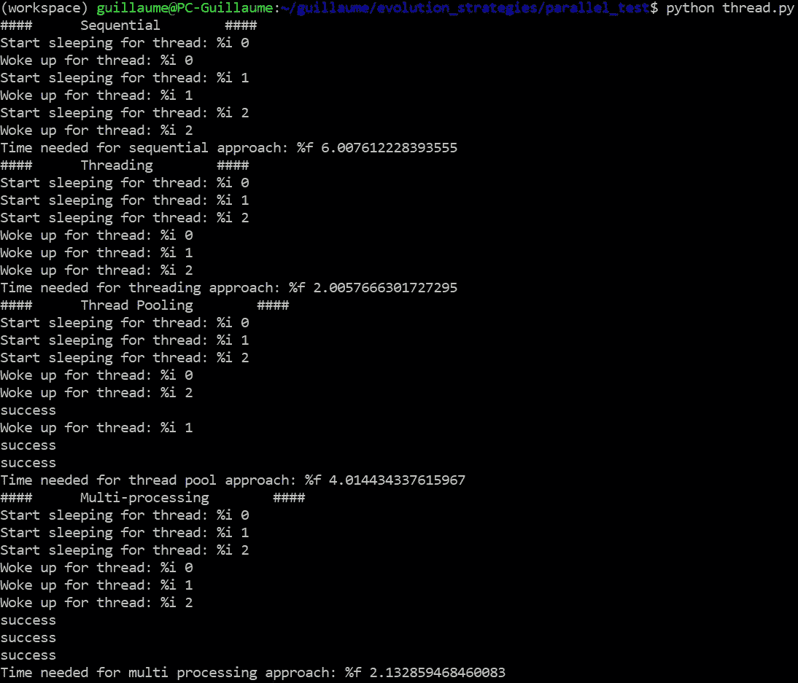
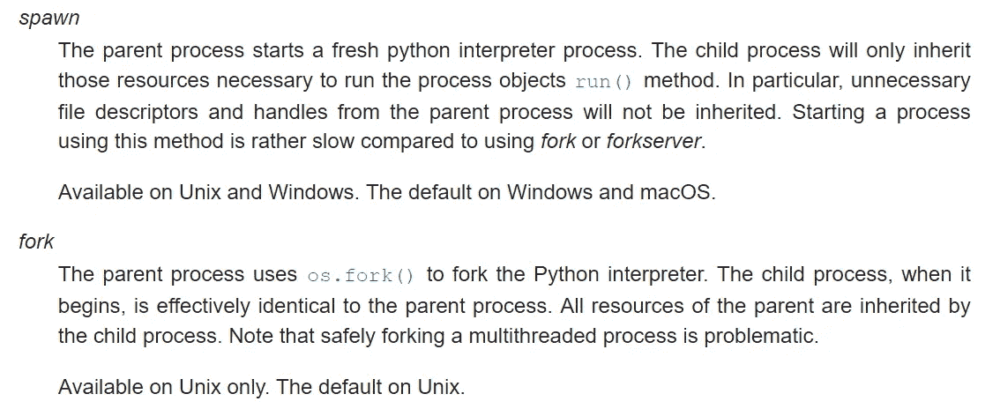

# 解开 Python 的线程之谜。

> 原文：<https://towardsdatascience.com/unraveling-pythons-threading-mysteries-e79e001ab4c?source=collection_archive---------8----------------------->

## Python 如何实现计算并行化？

现在我们的大多数计算机都有多核架构，多线程等术语经常在我们耳边响起，作为提高应用程序处理效率的一种方式。Python 确实提供了一些并行计算的工具，但是它们并不为人所知。让我们在这篇文章中揭开他们的秘密。

马修·施瓦茨在 [Unsplash](https://unsplash.com?utm_source=medium&utm_medium=referral) 上的照片

首先是关于线程的一个小提示。什么是线程？这是一个轻量级的进程，运行在你的计算机上，执行它自己的指令集。当你在计算机上运行两个程序时，你实际上创建了两个进程。它们中的每一个都有一组指令(打开你的浏览器或提高音量)，它希望调度程序(决定向处理器提供什么的裁判)读取这些指令。线程相对于进程的特殊性在于它们可以共享变量。

就编码而言，当我们运行两个线程时，我们允许两段代码同时运行。然而，这不同于同时执行两个程序，因为线程给了我们更多的控制权。例如，我们可以在线程之间共享一些变量，或者我们可以等待线程完成，合并结果，然后继续执行其余的代码。这是一个非常强大的工具，可以允许更快的计算或处理并发事件的能力(想想有多个传感器数据要处理的机器人)。

让我们稍微跑题一下，分析一下 Python 提供的并行运行计算的不同可能性。这三位获奖者分别是:**线程**、**线程池**和**多处理**。

为了清楚起见，让我们首先介绍我们希望并行化的函数。睡眠功能，其目的是…睡眠。

1.  **线程**:Python 可以提供的最基本的线程工具

Python 库允许我们手动创建线程，为此我们可以指定目标(我们希望在这个线程中执行的函数)及其参数。该接口还包括一个 start 函数和一个 join 函数，它将等待线程的执行结束。当我们想要利用线程返回的结果时，加入线程通常是可取的。但是基本的穿线。Thread 的局限性很大，它不允许我们访问 sleep 函数返回的变量。

2.**线程池:**(并且是库 concurrent.futures)

线程池执行器为线程提供了一套更完整的接口。然而，它的底层实现仍然使用线程库，这提供了与前一选项相同的优点和缺点。在接口差异方面，它提出了 future 的概念，这对于 C++ 14 的用户来说似乎会很熟悉。对我们来说，未来的最大优势在于它允许我们使用 result()接口线程化函数返回变量。

3.**多重处理**(来自库多重处理)

多重处理是能够提供线程能力的最完整的库。除了提供更多接口之外，它与其他两个工具的主要区别在于，它能够使用名为 pickle 的第三方库来序列化和反序列化数据。序列化是转换数据类型(int、array 等)的能力。)转化为二进制，0 和 1 的序列。这样做需要能够使用协议(tcp/ip、http、UDP……)发送数据，因为这些协议对我们使用的数据类型是不可知的:发送者可能在 Python 中运行他的代码，而接收者可能使用 C++。在多处理的情况下，当我们将函数和参数传递给池对象时，就会发生序列化。这允许我们做一些不可思议的事情:发送这个线程来执行..另一台电脑！因此，多重处理库旨在支持多台计算机之间的共享计算。

注意，多处理库提供了 apply (sync)和 apply_async 接口，代表同步和异步。在第一种情况下，线程被迫以它们启动时的顺序返回，而在第二种情况下，线程一结束就返回。apply_async 提供了一个额外的参数“callback ”,它提供了在线程返回时执行函数的可能性(例如，存储结果)。

现在是时候比较不同线程方法的结果了。我们首先使用前面提到的“sleep”函数对结果进行基准测试:

我们还依次计算睡眠函数，以提供用于比较的基本结果。每次睡眠 2 秒，我们得到顺序方法的总计算时间，这似乎是合乎逻辑的。对于线程化和多处理方法，我们获得了 2s 的计算时间，这意味着所有线程都可以成功地并行运行，但是对于线程池执行器，我们获得了 4s 的计算时间，这表明在该过程中有一些额外的计算时间开销。现在，只有 3 个线程并行运行是非常好的，但是我们可能想要运行超过 1000 个线程。让我们看看在更高的难度下，比如说 100 个线程:

至于线程和线程池，从 3 个线程到 100 个线程，结果没有变化。然而，对于多处理方法，计算时间跳到了 50 秒！为了理解发生了什么，让我们来看看我们精心放置的警告:“警告，试图创建比可用内核更多的线程”。因此，多处理将尝试将线程分派到可用的内核(在我的例子中是 4 个)，但是如果没有内核可用，我们可以猜测线程的计算被排队，从而变得有序。

我们可以结束这个话题，以“多处理很糟糕，线程库很棒”结束。但是等一下。到目前为止，我们在线程函数中所做的只是休眠，这意味着在处理指令方面:什么都不做。现在，如果我们有一个对计算资源更加贪婪的线程会怎么样。让我们以计数函数为例:

我们使用 4 个线程(我个人电脑上的内核数量)，可以看到以下结果:

这里的多处理方法至少比其他两种方法快 4 倍。但更重要的是，当最初的目标是优化计算时间时，线程化花费的时间几乎是顺序方法的两倍，而线程池方法花费的时间是顺序方法的两倍！

为了理解为什么会发生这种情况，我们需要看一下 GIL(全局解释器锁)。Python 是一种解释型语言，而 C 或 C++是编译型语言。编译所做的是将编写的代码转换成处理器可以理解的语言:二进制文件。因此，当代码被执行时，它直接被调度程序读取，然后被处理器读取。然而，在解释语言的情况下，在启动程序时，代码仍然是以人类可读的方式编写的，这里是 python 语法。为了被处理器读取，它必须在运行时被所谓的 Python 解释器解释。然而，当线程化时会出现一个问题。Python 解释器不允许同时解释多个线程，因此有一个锁，GIL 来强制执行。让我们看一张图来更好地理解这种情况:

在这种情况下，GIL 会成为瓶颈，抵消线程的优势。这很好地解释了为什么线程和池线程在对比分析中表现如此之差。每次线程各自的计数需要增加十亿次时，每个线程都会争着通过 Python 解释器进行访问，而当线程休眠时，Python 解释器在线程存在的整个过程中只被请求一次。如果是这样的话，为什么多重处理方法提供了明显更好的结果？该库实际上是通过为每个线程创建一个 Python 解释器实例来欺骗 GIL:

因此，瓶颈消失了，可以释放全部线程潜力。

值得一提的是，由于序列化过程，多处理仍然有一些缺点:不是所有东西都可以序列化。尤其是 python[generators](https://wiki.python.org/moin/Generators)**或者任何有类似指针行为的东西都不能序列化(这看起来很正常)。假设我们有一个带有一些未知内容的“代理”对象(例如这里的一些 pytorch 对象)，那么我们最终会得到一个错误:**

****

**我们可以从计算效率的角度来解释线程和多进程之间的区别。在第二部分中，我们可以仔细看看资源和变量管理的主要区别，尤其是对于共享资源。让我们考虑下面的代码，它让线程使用一个全局变量:**

**即使我们分派不同的处理器(子进程)访问同一个全局变量来评估代码片段，这段代码也运行得很好。这意味着所有的 python 解释器都能够访问这个全局变量。那么 python 解释器可以在运行时互相通信吗？这背后的巫术是什么？让我们考虑下面代码的变体:**

**这段代码的目的是在运行时从不同的线程中有意更改全局变量的值。不仅如此，他们还用不同的计时来做这件事(观察不同输入的睡眠)。**

****

**如果这个变量真的是全局变量，当第二个线程输出全局变量的值时，它应该已经增加了不少。然而，我们看到当线程打印它时，这个值始终为 1。所以现在我们对正在发生的事情有了更好的了解。当线程被创建时(python 解释器也随之创建)，所有的变量都被复制到新线程中，全局变量也不例外。从某种意义上说，所有线程都是您正在运行的更大进程的相同副本，只是传递给线程的参数略有不同。现在，多重处理提供了与如何创建子进程相关的不同选项。我们可以选择三种启动方法，即 spawn、fork 和 forkserver。我们将分析前两个。根据 Python 文档:**

****

**因此，主要区别在于创建子流程时从父流程继承了哪些变量。考虑上面介绍的代码。如果您仔细观察，您会注意到 start 方法被指定为“fork”。让我们看看这段代码实际输出了什么:**

****

**这里没有什么特别的，我们知道子进程能够访问全局变量，因为它已经复制了它。现在让我们看看当我们切换到“产卵”时会发生什么:**

****

**我能看到你眼中惊讶的表情，不，你不是在做梦，你是多次看到这个。“print(“应该只看到这一次”)”是在程序的最开始制作的，完全在线程被调度的循环之外。然而这本书被印了 4 次。那么发生了什么？python 文档只告诉我们“父进程启动一个新的 Python 解释器进程”，并且它只继承 run()方法所必需的对象(理解您正在尝试线程化的函数)。由此你需要明白的是**继承=复制**，**非 _ 继承=重求值**。所以当我们选择“spawn”时，进程的每条指令都被重新解释，函数调用以及变量内存分配。
现在你可以注意到“if __name__ == '__main__ ':”语句。这对解释器来说意味着，内部的任何东西都属于主进程，因此应该由子进程继承。对于每个子进程，不在该语句中的所有内容都将被重新评估。这意味着默认情况下“spawn”试图重新评估一切，但我们确实可以控制继承什么，而对于“fork”，默认情况下每个变量都会被继承。你可能想知道这有什么关系，在我们的全局变量中，它变化不大。但是对于某些对象，复制构造函数(当您使用=操作符时)可能没有很好地定义，这使得在某些情况下使用 fork 方法不安全。因此，在 python 文档中可以看到 spawn 方法正在成为所有平台的默认启动方法。**

**你可能想知道这是一个相当大的限制，如果由多重处理创建的线程被完全封闭，我们就失去了线程间一定程度同步的能力。这并不完全正确，因为该库提供了一些工具供我们使用:管道。**

**结果:**“休眠时间:2.00”，**这意味着线程实际上是在等待接收父进程提供的数据，然后再继续。在某种程度上，管道相当于 C++的未来，我们能够等待不同线程提供的一些数据的获取。当然，在这种情况下，由于多重处理可以在不同的计算机上发生，通过管道发送的数据也需要在幕后序列化。**

**我们谈到了多重处理的资源管理。对于线程库(和线程池执行器)，事情有点不同，因为我们只有一个 python 解释器。让我们看一个例子:**

**我们同时启动 4 个线程，每个线程实际开始计数时会有一点不同的延迟。**

****

**与多重处理相反，全局变量在这里是跨线程共享的，并且不保存本地副本。如果你习惯了被操纵的线程，你可能会被上面的代码吓坏，喊出“竞争条件”或“锁”这样的术语。锁(可以跨线程共享)是一种看门人，只允许一个线程同时打开代码执行的门，以防止变量同时被访问或修改。等等，我们实际上已经在某个地方听说过了:GIL(全局解释器锁)。**

**所以 python 确实已经有了一个锁机制来防止两个线程同时执行代码。好消息是，上面的代码可能没有那么可怕。让我们通过打印三个线程执行后生成的总计数来证明这一点(并删除睡眠)。由于 GIL 保护我们免受线程同时执行指令的影响，无论哪个线程正在递增全局变量，我们都应该将 10e5 * 4 乘以 1 相加，因此总数为 4.000.000。**

****

**好吧，我们需要一些解释。尤其是 GIL 实际上是如何工作的。“同时只让一个线程运行”的描述可能不足以准确地解释这种情况。如果我们更深入地研究细节，我们可以看到这一点:“**为了支持多线程 Python 程序，解释器定期释放和重新获取锁——默认情况下，每十个字节码指令**”。所以这与同时只允许读取一行实际的 python 代码是不同的。为了充分理解这一点，我们需要降低一个级别。**

**当你执行一个 python 程序时会发生什么？python 解释器首先将代码(在运行时)编译成更容易转换成字节的东西(给处理器单元的食物)。对于 python，这种中间代码称为字节码。字节码操作的完整描述可以在[这里](https://docs.python.org/3/library/dis.html)找到。dis 模块使我们能够看到特定函数的字节码是什么样子的。如果我们试着看一下一个给全局变量加 1 的函数:**

****

**要简单地将一个常量添加到一个变量中，我们需要 4 个字节码操作，获取变量，将它们相加并存储结果。
现在我们对什么是字节码操作有了更好的理解，我们可以注意到 GIL 附带了我们可以控制的设置: **sys.setcheckinterval()** 使我们能够控制我们想要锁定 GIL 的字节码的数量。但是，即使我们将它设置为 1(GIL 在每个字节码指令中都被锁定)，这对我们也没有什么帮助。让我们分析一下在 GIL 每三个字节码锁定一次的情况下会发生什么:**

****

**数字 1 到 4 代表 GIL 允许处理字节码组的顺序。现在让我们假设全局变量的初始值为 0。在每个线程中，我们都试图给这个变量加 1。在字节码组“1”执行结束时，它从 LOAD_FAST 获得的变量副本增加了 1(in place _ ADD)。但是全局变量本身没有被修改，因为 STORE_FAST 没有被执行。现在轮到第二个线程了:由于变量没有被存储，它仍然会复制一个值为 0 的全局变量，并对其加 1。现在，当组 3 被执行时，global_variable 最终被存储为值 1。但是你可以想象，在执行组 4 时，本地副本的值也是 1，全局变量将再次存储为 1，而我们期望它是 2。坏消息是，不管我们多频繁地锁定 GIL，只要“global_variable += 1”等价字节码的部分被混淆，我们就有了竞争条件。**

**因此，GIL 不足以保护我们的变量，我们别无选择，只能使用锁来强制解释器跨线程一次只执行一段代码:**

****

**工作正常，线程计数到正确的数目，同时并行执行这项工作。然而，如果你看看总的计算时间，这是超出了屋顶。获取和释放锁确实很耗时，当我们需要像这里这样频繁地访问变量时，它会累积起来，形成非常繁重的计算时间。**

**现在是时候总结一下我们在 Python 中并行计算的经验了:**

*   **我们有两个主要的库允许我们进行并行计算:线程和多重处理。**
*   **全局解释器锁(GIL)在并行计算效率方面限制了 python 程序，但是多重处理通过创建多个解释器绕过了它。**
*   **多处理可以充分利用多核架构，甚至可以通过序列化/反序列化每个线程所需的数据，在不同的计算机上并行化计算。但是，它确实会创建一个拷贝或重新评估环境的资源。每个线程都在其受限的环境中进化，除非使用特定的工具，否则无法与其他线程交换。**
*   **线程库使子进程能够访问和修改相同的变量，但是 GIL 不能防止竞争情况，我们必须使用锁来防止这种情况发生。**

**那么什么时候用多处理，什么时候用线程呢？我们可以分析应用程序并行化的两个用例。**

1.  **计算效率:目标是节省计算时间。在这种情况下，我们希望充分利用多核架构，而不受 GIL 的困扰。选择:**多重处理。****
2.  **I/O 通信:当您可能从多个数据源接收数据，并且希望能够同时监控不同数据源的输入时。在这种情况下，您可能希望所有线程拥有相同的环境，因为它们可能想要修改相同的变量，并且您可能不关注计算效率。您可能还想要比可用内核数量多得多的线程。选择:**穿线**。**