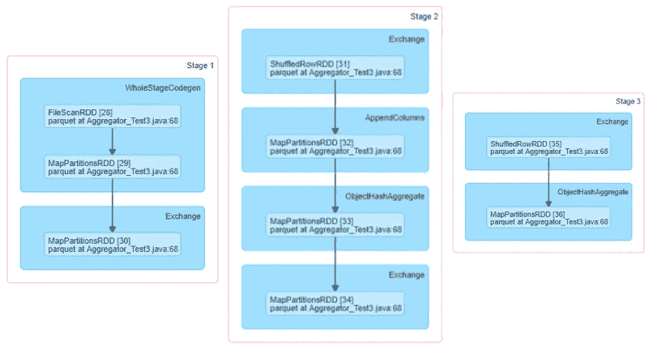
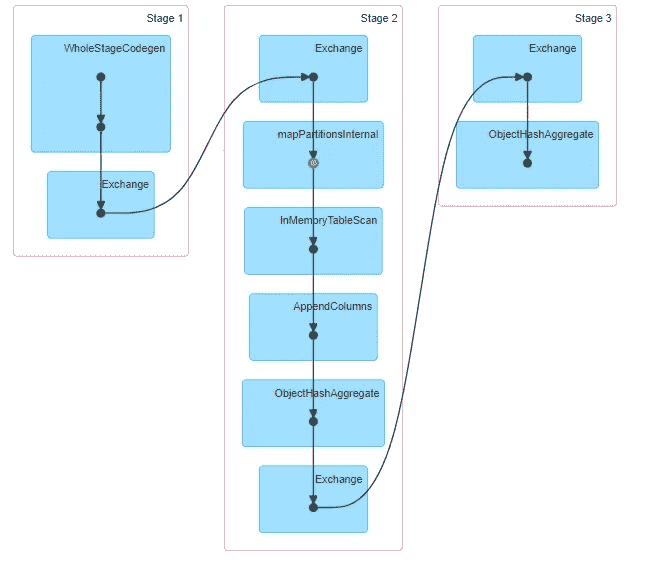
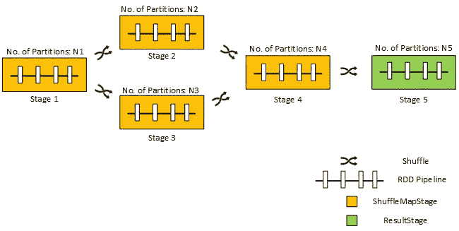
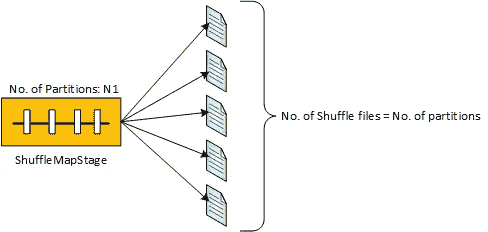
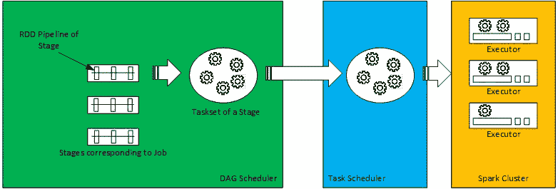
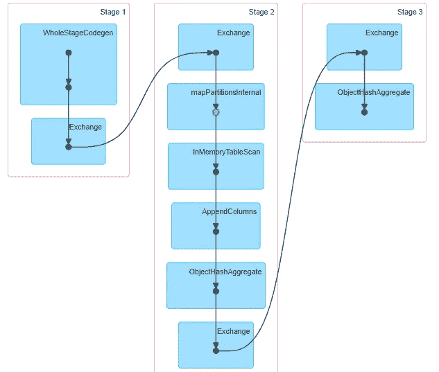
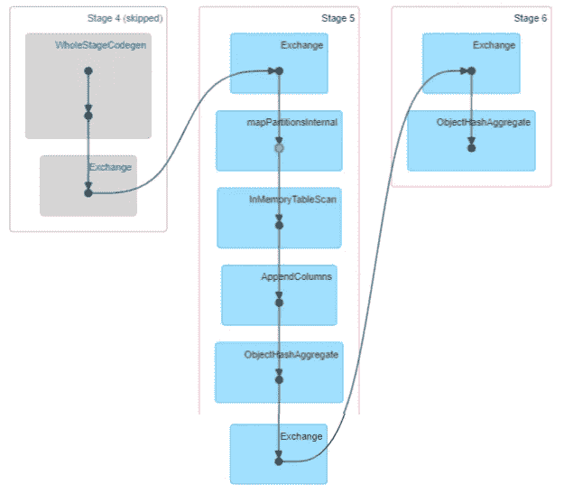

# 解开 Apache Spark 中的分阶段执行

> 原文：<https://towardsdatascience.com/unraveling-the-staged-execution-in-apache-spark-eff98c4cdac9?source=collection_archive---------14----------------------->


[参考](https://pixabay.com/images/)

## APACHE SPARK 执行指南

## Spark 中的 Stage 表示并行计算的逻辑单元。许多这样的阶段组装在一起，构建了 Spark 应用程序的执行框架。这个故事试图解开火花阶段的概念，并描述了重要的相关方面。

火花阶段可以被理解为计算分布式集合的数据分区的计算块，该计算块能够在计算节点的集群中并行执行。Spark 使用单个或多个阶段为 Spark 应用程序构建并行执行流。Stages 提供模块化、可靠性和弹性来激发应用程序执行。以下是与火花阶段相关的各个重要方面:

**阶段由 DAG 调度程序创建、执行和监控:**每个正在运行的 Spark 应用程序都有一个与之相关联的 DAG 调度程序实例。该调度器响应于作业的提交而创建阶段，其中作业实质上表示对应于 Spark 应用中采取的动作的 RDD 执行计划(也称为 RDD DAG)。如果在一个 Spark 应用程序中执行多个操作，那么多个作业可能会被提交给 DAG 调度程序。对于提交给它的每个作业，DAG 调度程序创建一个或多个阶段，构建阶段 DAG 以列出阶段依赖关系图，然后根据阶段 DAG 为创建的阶段规划执行调度。此外，调度程序还监视阶段执行完成的状态，结果可能是成功、部分成功或失败。相应地，调度器尝试阶段重新执行，推断作业失败/成功，或者按照阶段 DAG 调度相关阶段。

以下是针对作业的 RDD 执行计划(DAG)示例:

```
(200) MapPartitionsRDD[36] 
 | ShuffledRowRDD[35] 
 +-(500) MapPartitionsRDD[34] 
 | MapPartitionsRDD[33] 
 | MapPartitionsRDD[32] 
 | ShuffledRowRDD[31] 
 +-(3) MapPartitionsRDD[30] 
 | MapPartitionsRDD[29] 
 | FileScanRDD[28]
```

DAG 调度程序为上述 RDD 执行计划创建了以下三个阶段:



图(2):根据图(2)所示的 RDD 执行计划创建的三个阶段

以下是 DAG 计划程序根据上述阶段创建的阶段 DAG，它清楚地表明了阶段间的依赖关系:



图(3):根据图(1)所示的作业的 RDD 执行计划，为图(2)所示的三个阶段创建的阶段 DAG

> DAG 调度程序创建的每个阶段在 Spark 应用程序的所有作业中都有一个唯一的 ID。此外，根据阶段 DAG 来调度阶段以供执行，这意味着在已经计算了所有相关阶段(如阶段 DAG 中所列)之后，调度阶段以供执行。如果两个阶段互不依赖，并且它们的所有其他依赖阶段都已经计算过，则可以同时执行这两个阶段。

**在混洗边界上创建阶段** : DAG 调度程序通过在计划中由 ShuffleRDD 指示的混洗边界处分割 RDD 执行计划/DAG(与作业相关联)来创建多个阶段。因此，在这个拆分过程中，RDD 执行计划的一个片段(本质上是 RDD 管道)成为了阶段的一部分。对于 Spark 应用程序中提到的大范围转换，Shuffle 是必需的，例如聚合、连接或重新分区操作。

下面是在各种洗牌边界的舞台创作的插图。



洗牌边界的舞台创作插图。

此外，在图(1)所示的例子中，如 RDD 执行计划中的两个 ShuffleRowRDD 所示，发生了两次洗牌，因此创建了三个阶段，如图(2)所示。从图(2)可以明显看出，三个阶段中每一个都包含一个 RDD 流水线(作业的原始 RDD 执行计划/DAG 的一部分)。

> 如果提交的作业中不需要重排，DAG 调度程序将仅为该作业创建和调度单个阶段

**阶段有 ShuffleMapStage 或 ResultStage 两种类型:**ShuffleMapStage 类型的阶段是一个作业执行计划的中间阶段，该作业由 Spark 应用程序中提到的动作触发。ShuffleMapStage 实质上产生由 ShuffledRDD 在后续阶段中使用的混洗数据文件。但是，在产生输出数据之前，ShuffleMapStage 必须执行 ShuffleMapStage 中包含的作业的 RDD 执行计划段(实质上是一个 RDD 管道)。ShuffleMapStage 产生的混洗数据量可作为称为 ShuffleWrite 的阶段度量。此外，由于 SortShuffle 过程主要用于产生混洗数据文件，所以由 ShuffleMapStage 产生的混洗数据文件的数量等于由该级的 RDD 流水线计算的数据分区的数量。



ShuffleMapStage 生成一组随机文件的图示。shuffle 文件的数量等于 ShuffleMapStage 中分区的数量

ResultStage 是作业执行计划中的最后一个阶段，其中一个函数(对应于启动作业的动作)被应用于所有或一些分区，这些分区是通过执行包含在 ResultStage 中的 RDD 执行计划的段来计算的。该函数产生 spark 应用程序中相应动作执行的最终期望输出。[此处列出了 spark 应用的可能操作列表。](https://spark.apache.org/docs/latest/rdd-programming-guide.html#actions)

> 由 Spark 应用程序中的操作触发的作业，要么仅由单个 ResultStage 组成，要么由中间 ShuffleMapStage 和单个 ResultStage 的组合组成。但是，对于自适应查询规划或自适应调度，一些仅由 ShuffleMapStage 组成的特殊作业可以由 DAG 调度程序根据请求执行。
> 
> ShuffleMapStage 或 ResultStage 的数据是从输入文件、来自先前 shuffle map stage 的 shuffle 文件或缓存的 rdd 单独或组合提供的。

**每个阶段都有一个相关的任务集用于执行:**对于一个阶段的执行尝试，DAG 调度程序会创建一个相应的任务集。阶段任务集基本上是任务的集合，其中每个任务执行特定数据分区的阶段 RDD 管道，并产生所需的输出。

与阶段类型类似，阶段任务集中的任务属于 ShuffleMapTask 或 ResultTask 类型。ShuffleMapTasks 是为 ShuffleMapStage 创建的，而 ResultTasks 是为 ResultStage 创建的。

为 stage 的执行尝试创建的 Taskset 被提交给 Spark 应用程序的任务调度器实例。反过来，任务调度器在集群中的适当位置调度每个任务(包含在任务集中)的执行。在任务集中的所有任务被执行之后，任务集中每个任务的相应执行状态被报告回 DAG 调度器。因此，DAG 调度器将阶段执行标记为完全成功、部分成功或完全失败。



DAG 调度程序为某个阶段创建任务集，将任务集提交给任务调度程序，以及 DAG 调度程序调度(已提交任务集的)任务，以便在 Spark 集群中的执行器上执行

在部分成功的情况下，使用仅包含先前失败的任务的部分任务集重新尝试阶段执行。在完全失败的情况下，将使用成熟的任务集重新尝试阶段执行。

> 一个阶段只重试一定的次数，当所有的重试都不能将阶段执行标记为完全成功时，阶段执行被标记为失败，导致提交给 DAG 调度程序的相应作业的执行失败。
> 
> 此外，大多数情况下，由于父级产生的部分或全部混洗数据文件不可用，一个级会部分失败。这导致在报告失败的阶段被再次重试之前，父阶段的部分重新执行(以便计算丢失的混洗文件)。此外，如果在祖先中的连续级别处存在丢失的混洗文件，则这种重新执行也可以到达父级祖先中更深级别处存在的级。当托管文件的执行器由于内存溢出或集群管理器强制终止而丢失时，无序文件变得不可用。此外，当相应的 ShuffledRDD 被垃圾收集时，shuffle 文件仍然不可用。

**阶段计算可在时间**跳过:DAG 调度程序可决定跳过已提交作业中 ShuffleMap 阶段的计算，前提是已针对提交给调度程序的前一个作业计算了类似的阶段。如果这两个阶段执行相同的 RDD 流水线，则它们被认为是相似的。这种跳过是可能的，因为混洗输出文件保留在磁盘中，直到混洗的 RDD 引用保留在 Spark 应用程序中。

此外，在另一实例中，如果从属下游阶段所需的混洗 RDD 已经被缓存，DAG 调度器可以决定跳过混洗映射阶段的计算，该缓存是在针对提交给调度器的先前作业的另一阶段的执行期间完成的。

下面是一个示例 Spark 应用程序，用于说明 DAG 调度程序的阶段跳过，这个特定的应用程序缓存一个重新分区的数据集(在第 10 行),该数据集分别在第 15 行和第 20 行的两个文件写入操作中使用:

下面是上述 Spark 应用程序中属于两个不同作业(由两个操作触发)的 RDD 执行计划(带有阶段标记)。在应用程序中，数据集“ds”被缓存，导致相应的“ShuffledRowRDD[11]”被缓存。


以下是 DAG 调度程序为这两个作业构建的阶段计算 DAG:



作业 1 的阶段计算 DAG



作业 2 的阶段计算 DAG

从两个作业的阶段计算 DAG 可以清楚地看出，在作业-2 的阶段计算 DAG 中，阶段 4 被跳过用于计算(被跳过的阶段是灰色的)，因为在作业-2 的阶段 5 中使用的“ShuffledRowRDD[11]”已经被计算并缓存在作业-1 的阶段 2 中，作业-1 提前提交用于执行。

**总结**:现在应该很明显了，Spark 中执行流的分段如何为 Spark 应用程序的整体执行提供模块化和弹性。用户可以跟踪 Spark 应用程序的阶段进度，可以访问多个阶段指标来评估阶段执行效率。最后，也是最重要的一点，阶段进度和相关指标可以为应用优化提供线索。

如果对 Spark stages 有任何疑问，或者对这个故事有任何反馈，请写在评论区。