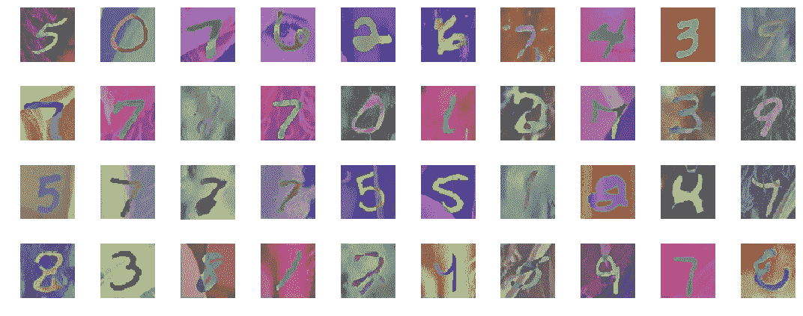
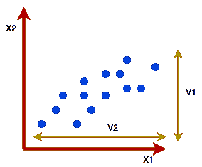
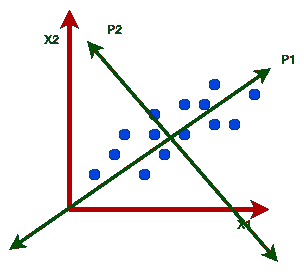
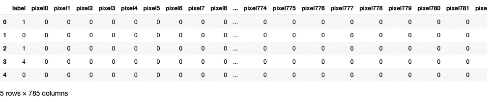
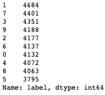
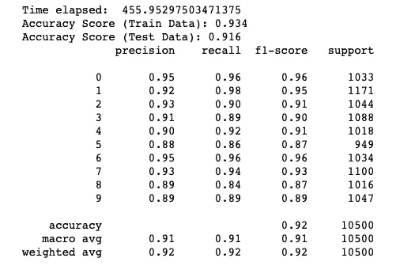
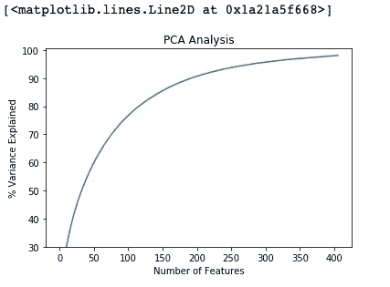
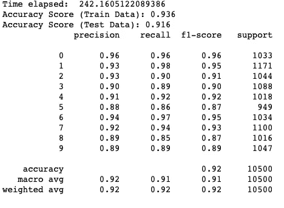

# 解开主成分分析

> 原文：<https://towardsdatascience.com/unravelling-principal-component-analysis-a14dd07c1904?source=collection_archive---------56----------------------->

## 从 MNIST 数据库看主成分分析



来自 [MNIST 数据库](https://www.wouterbulten.nl/blog/tech/getting-started-with-gans-2-colorful-mnist/)的示例图像

在现实世界中，我们可能会在数据集中获得比预测目标变量所需更多的要素。有时，特征的数量可能会扩展到几百个甚至几千个，导致我们失去对特征的跟踪。事实上，它们中的许多实际上可能彼此高度相关，因此可以被去除！

降维不仅可以让我们压缩数据，还有助于加快机器学习过程。将三维地球转换成二维地图是最简单的降维示例。


[地图投影](http://www.geography.hunter.cuny.edu/~jochen/GTECH361/lectures/lecture04/concepts/06%20-%20Projected%20coordinate%20systems.html)

PCA 是一种降维技术，也是一种无监督学习算法，这意味着它只考虑解释变量，而不考虑目标变量。它有助于可视化高维数据，减少噪音，并帮助其他算法更好地工作。

在下图中，我们有两个解释变量 X1 和 X2，分别绘制在 X 轴和 Y 轴上。数据在两个轴上的差异(V1 和 V2)或分布是显著的。因此，我们不能放弃任何一个功能。



在 draw.io 上创建

但是，如果我们仍然不得不放弃其中一个特征，我们可以将轴转换到 P1 和 P2。现在 P1 的方差比 P2 的方差大得多，因此我们现在可以保留 P1，放弃 P2。



在 draw.io 上创建

在这个过程中，我们可能会丢失某个特定变量提供的某些百分比的信息或方差。然而，目标是在处理成本和差异之间达成一个平衡。P1 和 P2 是主成分，它们只不过是 X1 和 X2 的轴变换。

我们将检查在 MNIST 数字数据集上使用 PCA 的效果。数据集包含手绘数字的像素值，从 0 到 9。每个图像的高度和宽度都是 28 像素，总共是 784 像素。像素值是从 0 到 255 的整数，包括 0 和 255。

训练数据集包含 784 列，表示 784 个像素值。“标签”列是我们的目标列，值从 0 到 9。从 pixel0 到 pixel783 填充的像素值包含从 0 到 255 的整数值，包括 0 和 255。

```
train.head()
#Training dataset
```



标签列中的值几乎均匀分布:

```
train.label.value_counts()
```



我们将把数据分成训练集和标签，然后再进行其余的处理。

```
y=train["label"]
X=train.loc[:, train.columns != "label"]
```

接下来，使用标准标量对数据进行标准化

```
X_values = X.values
X_std = StandardScaler().fit_transform(X_values)
```

我们将数据分为训练集和测试集:

```
X_train, X_test, y_train, y_test = train_test_split(X_std, y, test_size = 0.25, random_state = 42, stratify = y)
```

接下来，我们运行逻辑回归对数据进行分类，并计算将模型拟合到 784 列所需的时间:

```
import time
log  = LogisticRegression(random_state = 42, multi_class="multinomial", solver="saga", max_iter=200)
start_time = time.time()
log.fit(X_train, y_train)
end_time = time.time()
time1 = end_time-start_time
print("Time elapsed: ",time1)
y_pred = log.predict(X_test)# Accuracy Estimation
print('Accuracy Score (Train Data):', np.round(log.score(X_train, y_train), decimals = 3))
print('Accuracy Score (Test Data):', np.round(log.score(X_test, y_test), decimals = 3))# Classification Report
logistic_report = classification_report(y_test, y_pred)
print(logistic_report)
```



逻辑回归花了大约 455 秒来拟合数据，并给了我们 92%的平均准确率。

我们将检查我们是否可以用 PCA 得到更好的结果。我们会选取 30%的数据进行 PCA，这样就不用花很多时间去拟合 PCA。根据我们的目标，我们将指定我们希望通过我们的模型解释多少差异。这里我们选择 0.98 来表示我们希望解释最大 98%的方差。

```
X_data, X_pca = train_test_split(X_std, test_size=0.3, random_state=1)
pca = PCA(0.98).fit(X_pca)
```

我们现在将绘制一个肘形图来检查能够解释 98%数据差异的最佳特征数量

```
var=np.cumsum(np.round(pca.explained_variance_ratio_, decimals=4)*100)
plt.ylabel('% Variance Explained')
plt.xlabel('Number of Features')
plt.title('PCA Analysis')
plt.ylim(30,100.5)
plt.style.context('seaborn-whitegrid')
plt.plot(var)
```

“肘图”表示我们需要达到预期的解释方差百分比的最佳主成分数。除了这些组成部分，解释方差的增量可以忽略不计，因此这些特征可以删除。下图解释了这一概念。



406 个主成分解释了 98%的数据差异。因此，大约只有 50%的特征解释了数据中的大部分差异。

我们现在将对 PCA 简化的数据集再次运行逻辑回归。



因此，逻辑回归在 242 秒内拟合缩减的数据集，同时保持平均准确率为 92%！因此，主成分分析帮助逻辑回归以几乎一半的计算时间达到相同的精度。

当我们处理更大的数据集时，这变得更加重要，因为减少计算时间是不可避免的。

PCA 广泛用于人脸和图像识别，因为这种数据通常具有大量的特征，并且维数减少可以帮助减少进行预测所需的特征数量。

全部代码可在[这里](https://github.com/pritha21/Concepts/tree/master/PCA)获得。