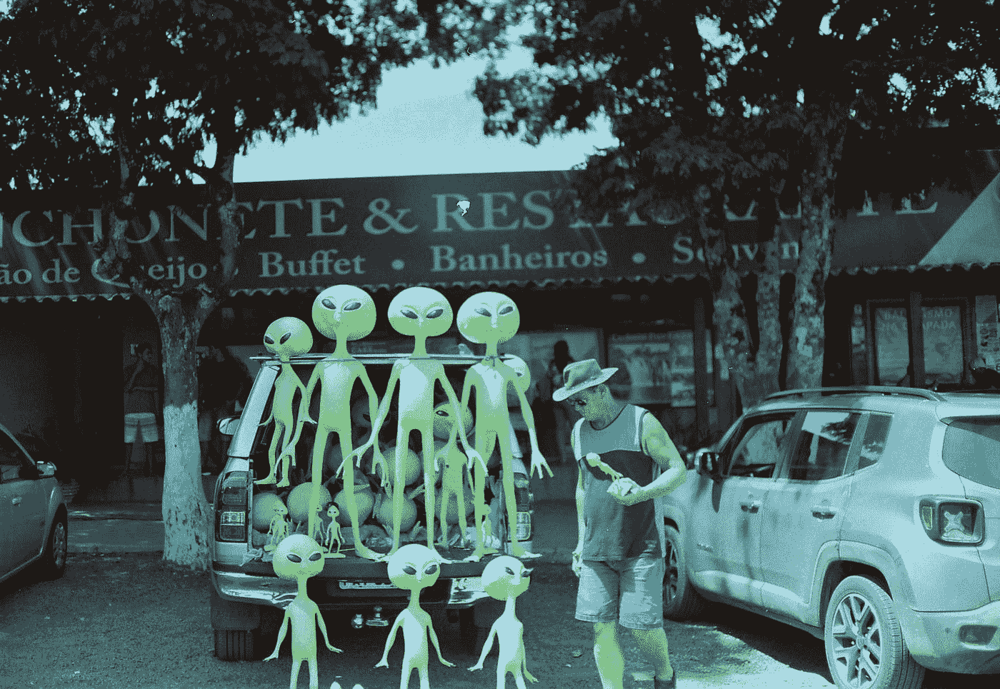

# 拿出你的幻灯片，杀死一条龙，拯救企业

> 原文：<https://towardsdatascience.com/unsheathe-your-slides-to-kill-a-dragon-and-save-the-business-bbfed4b7cf3?source=collection_archive---------54----------------------->

## [办公时间](https://towardsdatascience.com/tagged/office-hours)

## 五个技巧，让你更好地讲述故事，展示数据科学实验的最佳价值。

由[伊曼纽尔·梅利](https://unsplash.com/@ema_90?utm_source=medium&utm_medium=referral)在 [Unsplash](https://unsplash.com?utm_source=medium&utm_medium=referral) 上拍摄的照片

我知道… *幻灯片*。大多数数据科学家讨厌构建它们。这是令人沮丧的，因为你花了大量的时间来设计它们，结果往往不如你预期的好。但是不要难过，我是来帮你让你的滑梯制作更有趣的。

你可能已经注意到了，幻灯片是公司(无论大小)内部交流知识最流行的工具。没有他们，很少有人会注意你要说的话。演示如此受欢迎是因为人类是视觉学习者。麻省理工学院 2014 年的一项研究测量出我们的大脑可以在大约 13 毫秒内处理图像。这比阅读哪怕是很小的文本节选都要快得多。

> 如果你想为你的数据科学成果带来关注，你应该掌握你的 Powerpoint fu 或者你的 Google slides fu。

为了让建造滑梯更有趣，我把它变成了建造世界的任务；创造一个小世界并讲述一个故事的挑战。而且，在每一个叙述中，你首先需要考虑两个主要问题:

1.  这个故事是关于什么的？(你需要用一个*短语来回答这个问题)*
2.  故事的受众是什么？

第一个问题会告诉你 ***你需要展示什么*** 。你的回答听起来有趣吗？第二个问题应该让你知道你应该如何展示它。

一旦你回答了这些问题，你就可以组织你的情节结构，并决定你应该使用哪些元素。下面，我给你五个建议，也许能帮到你。

## 1.制造一个诱饵

一些著名的说书人说你应该用一个钩子开始你的故事。或者，著名小说家杰夫·范德米尔在他令人惊叹的神奇书籍中，讲述了一些不同的东西:

> “事实是，任何事情都可以变得有趣，所以你应该[……]更多地考虑在特定的情况或场景中，兴趣在哪里，以及从什么角度出发。一个鱼钩也不能仅仅是一个鱼钩——它必须是一个诱饵和诱惑，它还必须是一个锚。你在邀请读者享受某种乐趣或挑战……”

[奖杯技术](https://unsplash.com/@trophytechnology?utm_source=medium&utm_medium=referral)在 [Unsplash](https://unsplash.com?utm_source=medium&utm_medium=referral) 上拍摄的照片

你可以在演讲中使用这个策略。对你的观众来说,*最有价值的信息*是什么？

例如，假设您构建了一个 ML 模型来预测未来几个月的销售额。因此，不要在开始演示时解释您用来准备数据和构建模型的所有技术，而是从您的预测中获得的有趣数字开始。

此外，从右侧视角*创造诱惑*。例如，销售团队可能对预测的交易中涉及的金额感兴趣。相比之下，营销团队可能更喜欢每个客户群和人口统计数据中售出的商品数量。

用你的诱饵作为锚。随着你在演示中的进展——详细介绍你的发现，深入研究你的结果——观众很容易迷失。因此，用你的诱惑让他们和对他们最重要的东西保持联系。

回到我们的例子，你可能已经开始展示在预测的交易中涉及了多少钱，但是接下来你可以解释这些钱如何转化为市场份额。你从你的锚(钱)跳到一个新的彼岸(市场份额数据)。如果你坚持这样做，观众会觉得所有的事情都与他们最重要的事情有着恰当的联系。更容易理解。

此外，帮助观众理解，诱惑只是邀请一些宏伟的未来。如果你在诱惑中破坏了你所有的洞察力，观众很快就会变得厌烦，并相信他们已经从你那里得到了一切。如果他们知道你有更多有价值的信息可以分享，他们会保持联系。

## 2.恰当地描述你的角色

就像在一个故事里，我们也应该把我们的结果当成人物。

> 你故事中的英雄是谁？

也许是你的新颖算法，或者是你数据挖掘实验的一些感悟。作为科学家，我们热衷于详细描述一切。然而，这可能是一个吸引你的观众的糟糕策略，因为太多的信息很容易变得太难或太无聊。

在一本书里，小说作者通常不会给你他们的英雄的所有特征。通常，他们描述什么是更重要的或最引人注目的痕迹。我们的大脑根据已知的原型和直觉想象缺失的部分。试着对你的结果使用同样的策略。只描述你研究中最重要的方面。对于那些想了解所有细节的人，您可以在幻灯片底部留下详细文档的链接。

此外，抽象是良好描述的关键。使用易于理解的图表、图表、隐喻，任何引导观众直觉和理解的东西，即使他们没有技术背景。就像是给他们的头脑指了捷径。

## 3.充分利用一种语言

2016 科幻电影*降临*看了吗？如果没有，看完这个帖子再看。

照片由[茱莉亚·博尔赫斯](https://unsplash.com/@juliaborgesfoto?utm_source=medium&utm_medium=referral)在 [Unsplash](https://unsplash.com?utm_source=medium&utm_medium=referral) 上拍摄

展示数据科学成果就像和外星人聊天一样困难。想象他们需要理解你，否则他们可能会摧毁你的世界。为了避免这种情况，像路易丝·班克斯一样，尝试以下方法:

1.  找出或建立一些你和你的听众之间的“共同语言”。
2.  传达开发该语言用途的信息。

你可以用符号、颜色、关键词作为你语言的组成部分。任何能让你的观众更容易理解你的故事并保持联系的东西。

一旦你定义了你的语言，就要保持一致。如果你选择一种颜色来代表某样东西(一个变量，一个类别，或者一个策略)，在整个演示过程中始终使用同一种颜色。如果你需要色调的变化，改变透明度，但保持色调。此外，保持变量名、图表、类别等一切的一致性。

## 4.剧情变得复杂了！

在数据科学实验之后，我们通常会有几个图表和示意图要展示。你展示结果的顺序可以帮助你讲述一个更好的故事。请记住，就像在书中一样，时间顺序不一定是使故事有趣的最佳选择。

不幸的是，我不相信在结果排序方面有一个黄金法则。我考虑的两个方面是:

*   结果的复杂性；
*   他们的影响。

首先，从简单的片段构建复杂的结果。从基本前提开始，不断添加元素，直到完成更大的图片。这是一个让你的听众理解你的推理的简单策略。这就像拼图，你应该让每个人都玩，一次一块。

其次，最有冲击力的结果应该是接近尾声的。这样，观众更容易记住他们。然而，这种影响很难衡量，因为它取决于视角。你可以试着去猜，随着时间的推移，随着你获得经验，你的选择会更好。

## **5。没有开放式结尾**

科学是开放的。你的幻灯片不需要。我认为结论幻灯片如果具体客观，效果会更好。通常，我会用外卖代替总结幻灯片。我列出了我的观众应该记住的最有价值的作品。

根据具体情况，听众可能希望听到后续步骤(或未来工作)。在这种情况下，有开放结局的空间，但不要忘记先非常好地关闭你当前的故事。

一些演示指南告诉你在结论中对你的工作做一个总结。我个人觉得很无聊，观众会分心，愿意走开。如果你发表了引人入胜的演讲，人们会记住你的故事。你最好突出你有影响力的见解，像英雄一样结束。

你有没有自己的妙招让自己讲故事更有趣？请在评论里告诉我！此外，如果你想保持联系并在电子邮件中收到一些数据科学技巧和极客文化，请订阅我即将开始的每月[简讯](https://mailchi.mp/56e8e3f8eeb0/join-my-newsletter)。