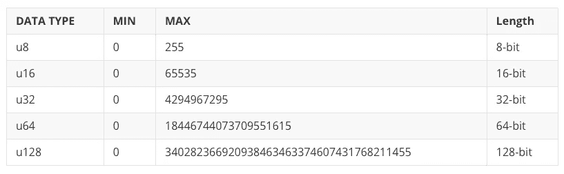
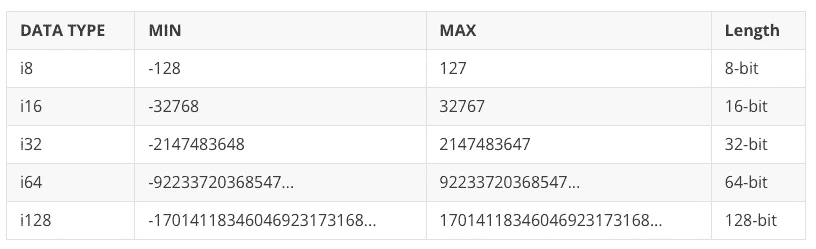
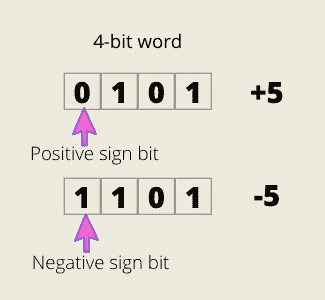
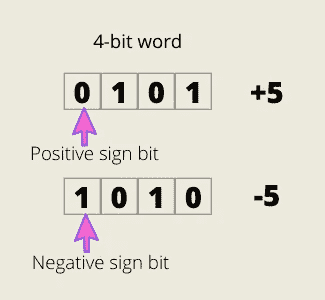
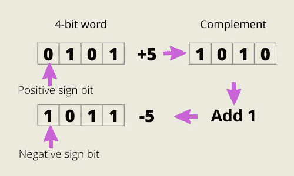
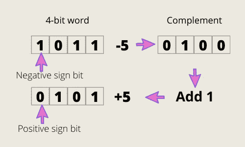
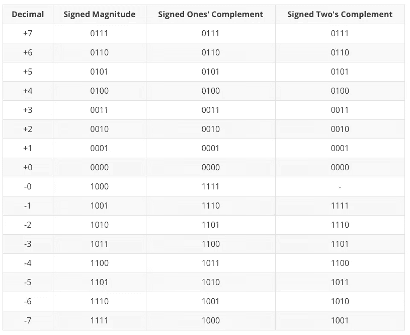
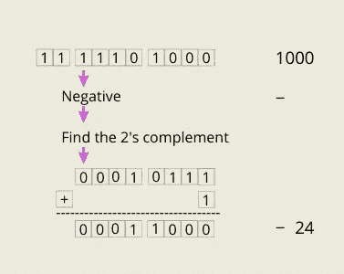
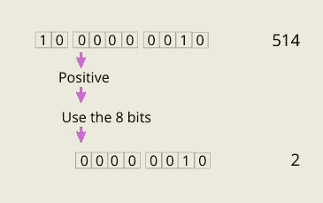

# 关于无符号、有符号整数和 Rust 中的造型，你应该知道什么

> 原文：<https://towardsdatascience.com/unsinged-signed-integers-and-casting-in-rust-9a847bfc398f?source=collection_archive---------16----------------------->

## 理解符号和幅度、一的补码和二的补码


由 [Freepik](http://www.freepik.com) 设计

[更新于 2021 年 2 月 18 日。代码更改为要点并添加了链接]

```
**Table of Contents**[**Introduction**](#a73e)🦀 [Unsigned Integer Types](#f4ce)
🦀 [Signed Integer Types](#3e54)
🦀 [Signed, Ones’ Complement and Two’s Complement](#ac74)
🦀 [Sign-and-Magnitude](#7b01)
🦀 [Ones’ Complement](#fbfa)
🦀 [Two’s Complement](#41ce)
🦀 [4-bit Signed Binary Number Comparison](#6677)
🦀 [Rust signed two’s complement integer types](#0a26)
🦀 [Casting in Rust](#0883)
🦀 [Casting to an Unsigned Type](#edbc)
🦀 [Casting to a Signed Type](#47e3)
🦀 [Bitwise Negation](#108b)
🦀 [Adding a Negative Number](#baae)[**Conclusion**](#6f4b)
```

# 介绍

Rust 有两个[数据类型子集](https://doc.rust-lang.org/book/ch03-02-data-types.html)，标量和复合。标量类型有整数、浮点数、布尔值和字符。复合类型是数组和元组。

在本文中，我们将了解以下代码失败的原因:

```
fn main() {
    let a: i16 = 2;
    let b: u16 = 4;
    println!("{}", a+b);
}
```

还有为什么选角`128`到`i8`是`-128`。

[网上试试这个 Rust lang 代码。](https://tech.io/snippet/TlBrkrg)

输出:

```
128 as a i8 is : -128
```

为了更好地理解造型，我们需要回顾一下有符号、一的补码和二的补码。

我们还将讨论添加负数、按位求反以及将二进制转换为无符号和有符号十进制。

让我们先从 Rust 整数类型开始。

[](/learning-rust-by-converting-python-to-rust-259e735591c6) [## 通过将 Python 转换成 Rust 来学习 Rust

### Rust 基础入门教程

towardsdatascience.com](/learning-rust-by-converting-python-to-rust-259e735591c6) 

# 无符号整数类型

Rust 中的无符号整数类型以`u`开始，它有 8 位、16 位、32 位、64 位和 128 位。最小值和最大值从 **0 到 2ⁿ-1** 。

例如`u8`有 0 到 2⁸-1，也就是 255。下表显示了无符号整数的所有详细信息。



信任无符号整数类型。图片由作者提供。

寻找无符号整数类型的最大值。[网上试试这个 Rust lang 代码。](https://tech.io/snippet/wZSxuY6)

输出:

```
u8 has the max value of 255.
u16 has the max value of 65535.
u32 has the max value of 4294967295.
u64 has the max value of 18446744073709551615.
u128 has the max value of 340282366920938463463374607431768211455.
```

如果试图将负数赋给无符号类型，将会失败。

```
fn main() {
    let u:u32 = -1;
    println!("{} in binary is {:b}", u, u);
}error[E0600]: cannot apply unary operator `-` to type `u32`
 --> main.rs" data-line="2" data-column="17">main.rs:2:17
  |
2 |     let u:u32 = -1;
  |                 ^^ cannot apply unary operator `-`
  |
  = note: unsigned values cannot be negated
```

`-`是 Rust 的 [**一元** **运算符**](https://doc.rust-lang.org/reference/expressions/operator-expr.html) 之一，是有符号整数类型和浮点类型的非运算符。

# 有符号整数类型

Rust 中的**默认**整数类型为`i32`。Rust 中的有符号整数类型以`i`开始，它有 8 位、16 位、32 位、64 位和 128 位。最小值和最大值是从 **-(2ⁿ⁻到 2ⁿ⁻ -1** 。`n-1`中的`-1`是符号位(正或负)，我们将在下一节中介绍。

例如`i8`有-(2⁷)到 2⁷-1，也就是-128 到 127。下表显示了有符号整数的所有详细信息。



信任有符号整数类型。图片由作者提供。

寻找有符号整数类型的最小值和最大值。在线尝试这个 Rust lang 代码。

输出:

```
i8 has the min value of -128.
i8 has the max value of 127.
i16 has the min value of -32768.
i16 has the max value of 32767.
i32 has the min value of -2147483648.
i32 has the max value of 2147483647.
i64 has the min value of -9223372036854775808.
i64 has the max value of 9223372036854775807.
i128 has the min value of -170141183460469231731687303715884105728.
i128 has the max value of 170141183460469231731687303715884105727.
```

# 有符号、一的补码和二的补码

在计算中，需要用**有符号的数字表示法**来对二进制数字系统中的负数进行编码。让我们检查一下[符号和幅度](https://www.wikiwand.com/en/Signed_number_representations#Sign-and-magnitude_method)、[一进制补码](https://www.wikiwand.com/en/Signed_number_representations#Ones%27_complement)和[二进制补码](https://www.wikiwand.com/en/Signed_number_representations#Two%27s_complement)。

# 符号和幅度

**符号和幅度**也称为**符号幅度**。第一位(称为最高有效位或 MSB)表示它是正 0 还是负 1。其余的称为幅度位。



+5 的 4 位有符号幅度。图片由作者提供。

正如我之前提到的，有符号整数类型具有从 **-(2ⁿ⁻到 2ⁿ⁻ -1** 的最小值和最大值，其中 n 代表位数。因为我们将第一位用于正负符号，所以在 **2ⁿ⁻** 中有`n-1`。

对于 4 位，最小值和最大值从-(2)到 2–1，即-8 到+7。

正如你在上图中看到的，除了符号位之外，正数和负数有相同的数字。

有符号幅度的问题是有两个零，`0000`和`1000`。

# 一的补码

第一位(MSB)与带符号幅度相同。它以 0 表示正，以 1 表示负。其余的位将接受补码，这意味着如果它为 1，补码为 0，如果它为 0，则补码为 1。



+5 的一进制补码(4 位)。图片由作者提供。

有符号一的补码与有符号幅度具有相同的问题。有两个零，`0000`和`1111`。

# 二进制补码

在**二进制**计数系统中，基数(基数)是二。这就是为什么基数补码被称为二进制补码，而减基数补码被称为一进制补码。

二进制补码可以避免 0 的多重表示，并且避免在溢出的情况下跟踪进位。



+5 的二进制补码(4 位)。图片由作者提供。

我们再次将第一位(MSB)用于`+`和`-`符号。我们取这个数的补数，加上`1`得到相反的数。这从正到负起作用，反之亦然。



-5 的二进制补码(4 位)。图片由作者提供。

对于二进制中的零`0000`，补码是`1111`，加上`1`得到`1 0000`。`1`被称为“溢出”位。当最高有效(最左边)列的总和产生结转时，发生溢出。该溢出位或进位位可以忽略。

下表显示了三种有符号数字表示法的比较。

# 4 位有符号二进制数比较



4 位有符号二进制数比较。图片由作者提供。

# Rust 有符号二进制补码整数类型

现在让我们将上表中的有符号二进制补码的负数(从-1 到-7)与 Rust 的有符号整数进行比较。

[网上试试这个 Rust lang 代码。](https://tech.io/snippet/mI3rvun)

输出:

```
-1 in binary is 11111111111111111111111111111111
-2 in binary is 11111111111111111111111111111110
-3 in binary is 11111111111111111111111111111101
-4 in binary is 11111111111111111111111111111100
-5 in binary is 11111111111111111111111111111011
-6 in binary is 11111111111111111111111111111010
-7 in binary is 11111111111111111111111111111001
```

除了 Rust 使用默认的 32 位之外，它们完全相同。Rust 的有符号整数类型被称为**有符号二进制补码整数类型**。

# 生锈的铸件

[**造型**](https://doc.rust-lang.org/rust-by-example/types/cast.html) 是将一条数据的数据类型从一种类型改变为另一种类型。

`[as](https://doc.rust-lang.org/std/keyword.as.html)` [关键字](https://doc.rust-lang.org/std/keyword.as.html)将原始类型转换为其他原始类型。我们可以使用`as`关键字来解决简介中的代码。

铸造 u16 到 i16。[网上试试这个 Rust lang 代码。](https://tech.io/snippet/Fy9iH89)

当你从小长度转换到大长度时，比如从 8 位转换到 16 位，不会有任何问题，但是当你向下转换时，就有问题了。

# 强制转换为无符号类型

**方法一**

当您强制转换为无符号类型时，会加上或减去 T，T::MAX + 1，直到该值适合新类型。

示例 1:从默认的`i32`到`u8`铸造 1000

`u8`的最大数是 255，所以我们减去 255+1，也就是从 1000 减去 256，直到小于 255。

```
1000 - 256             = 744 
1000 - 256 - 256       = 488 
1000 - 256 - 256 - 256 = 232
```

铸造 1000 个 i32 到 u8。[网上试试这个 Rust lang 代码。](https://tech.io/snippet/Ln7SgIv)

输出:

```
1000 as a u8 is : 232
```

**方法二**

十进制的 1000₁₀是二进制的 1 1110 1000₂。我们可以取后 8 位，也就是`1110 1000`，十进制是 232。

一个有趣的数字是 256₁₀.

铸造 256 i32 到 u8。[网上试试这个 Rust lang 代码。](https://tech.io/snippet/Rmafm8K)

输出:

```
256 as a u8 is : 0
```

256₁₀是二进制的 100000000₂。如果取最后 8 位，就是`00000000`。

# 强制转换为有符号类型

**方法一**

这与上面的相同，但是您需要注意数据类型的最小/最大数量。

`i8`的最小和最大数字是-128 和 127。所以这个数字必须介于两者之间。

铸造 128 到`i8`:

```
128-256=-128
```

铸造 1000 到 i8:

```
1000 - 256 = 744
1000 - 256 - 256 = 488
1000 - 256 - 256 - 256 = 232
1000 - 256 - 256 - 256 - 256 = -24
```

将 i32 数字转换为 i8。[网上试试这个 Rust lang 代码。](https://tech.io/snippet/sefhUMo)

输出:

```
128 as a i8 is : -128
1000 as a i8 is : -24
232 as a i8 is : -24
257 as a i8 is : 1
130 as a i8 is : -126
514 as a i8 is : 2
```

**方法二**

十进制的 1000₁₀是二进制的 11 **1** 110 1000₂。8 位以内的 MSB 是 1，所以是负数。然后用 2 的补码。补足语是 00010111₂，我们加上 1₂就成了 00011000₂.最后，是-24₁₀.



图片由作者提供。

当 8 位以内的 MSB 为 0 时，为正数。然后取前 8 个最低有效位(LSB)。



图片由作者提供。

# 逐位求反

Rust 使用`!`进行逐位求反(逐位非)。这根据类型产生不同的结果。

[网上试试这个锈郎代码。](https://tech.io/snippet/9d6KeRo)

输出:

```
u is 2
u in binary is 10
i is 2
i in binary is 10
Bitwise negation !u is 4294967293
Bitwise negation !i is -3
```

正如你看到的`!2`带有无符号类型返回`4294967293`，带有有符号类型返回`-3`。

有符号整数上的按位求反返回二进制补码，正如我们之前在[信任有符号二进制补码整数类型](#0a26)中看到的。

# 添加负数

减法和负数的加法是一样的。

```
5 - 2 = 5 + (-2) = 3
```

这也适用于二进制。

```
0101 - 0010 
= 0101 + (-0010) // (1)
= 0101 + 1110    // (2)
= 0011           // this is 3 in decimal number.
```

我们通过找到`0010`的二进制补码即`1110`来找到`-0010`。

# 结论

我们讨论了 Rust 整数类型、三种类型的有符号二进制数、转换为无符号类型和有符号类型。我希望你在处理 Rust integers 和 casting 时，对发生的事情有更好的了解。

请继续关注下一篇文章。

**通过** [**成为**](https://blog.codewithshin.com/membership) **会员，可以完全访问媒体上的每一个故事。**


[https://blog.codewithshin.com/subscribe](https://blog.codewithshin.com/subscribe)

[](/you-want-to-learn-rust-but-you-dont-know-where-to-start-fc826402d5ba) [## 你想学 Rust 但是不知道从哪里开始

### Rust 初学者的完整资源

towardsdatascience.com](/you-want-to-learn-rust-but-you-dont-know-where-to-start-fc826402d5ba)