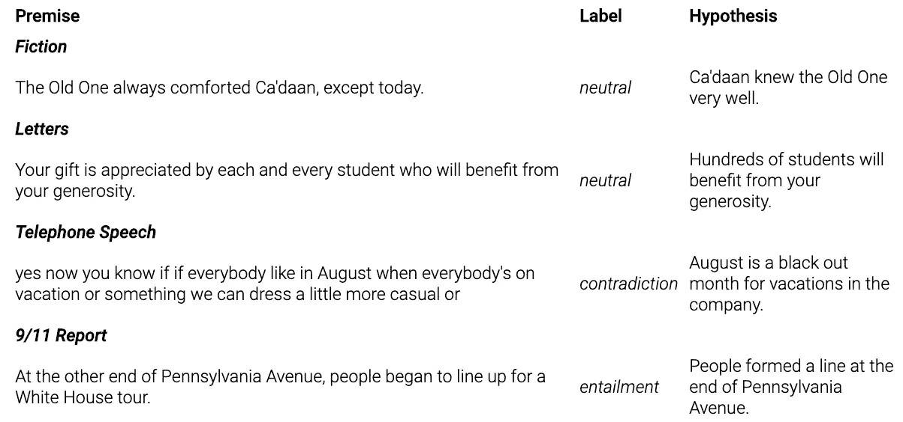

# 自然语言理解数据集未解决的问题

> 原文：<https://towardsdatascience.com/unsolved-problems-in-natural-language-datasets-2b09ab37e94c?source=collection_archive---------33----------------------->

## 即使是最受欢迎的 NLP 基准也面临着这些挑战

杰森·德沃尔在 [Unsplash](https://unsplash.com?utm_source=medium&utm_medium=referral) 上拍摄的照片

*垃圾进来，垃圾出去。你不必是一个 ML 专家也能听到这个短语。模型揭示了数据中的模式，因此当数据被破坏时，它们会发展出破坏的行为。这就是为什么研究人员分配大量资源来管理数据集。然而，尽管尽了最大努力，收集完全干净的数据几乎是不可能的，尤其是在深度学习所需的规模上。*

本文讨论了流行的自然语言数据集，尽管这些数据集是由该领域的专家制作的，但结果却违反了机器学习和数据科学的基本原则。这些缺陷中的一些在数据集公布和大量使用多年后被暴露和量化。这是为了说明**数据收集和验证是一个艰巨的过程**。以下是他们的一些主要障碍:

1.  **机器学习是数据饥渴。ML(特别是深度学习)所需的庞大数据量要求自动化，即挖掘互联网。数据集最终会从互联网上继承不需要的属性(例如，重复、统计偏差、虚假)，这些属性很难检测和删除。**
2.  **desire data 无法详尽捕获。**即使 oracle 能够根据一些预定义的规则产生无限的数据，要列举所有的需求实际上也是不可行的。考虑对话机器人的训练数据。我们可以表达一般的愿望，如不同的话题，尊重的交流，或对话者之间的平衡交流。但是我们没有足够的想象力去指定所有的相关参数。
3.  **人类选择阻力最小的道路**。一些数据收集工作在人类规模上仍然是可管理的。但是我们自己并不是完美无缺的，尽管我们尽了最大努力，我们还是下意识地倾向于走捷径。如果你的任务是写一个与前提“狗在睡觉”相矛盾的陈述，你的答案会是什么？继续阅读，看看你是否会成为问题的一部分。

# 重叠的训练和评估集

ML 从业者将他们的数据分成三部分:有一个*训练集*用于实际学习，一个*验证集*用于超参数调整，一个*评估集*用于测量模型的最终质量。众所周知，这些集合应该*大部分是*析取的。在评估训练数据时，您测量的是模型的记忆能力，而不是它识别模式并将其应用于新环境的能力。

这个指导方针听起来很容易应用，但是 Lewis 等人[1]在 2020 年的一篇论文[中显示，最流行的开放领域问答数据集(open-QA)在它们的训练集和评估集之间有很大的重叠。他们的分析包括](https://arxiv.org/abs/2008.02637) [WebQuestions](https://www.aclweb.org/anthology/D13-1160/) 、 [TriviaQA](https://nlp.cs.washington.edu/triviaqa/) 和[开放式自然问题](https://ai.google.com/research/NaturalQuestions)——由知名机构创建的数据集，被大量用作 QA 基准。

> 我们发现 60–70%的测试时答案也存在于训练集中的某个地方。我们还发现，30%的测试集问题在其对应的训练集中有近似重复的释义。

当然，培训和测试之间 0%的重叠也是不理想的。我们确实需要某种程度的记忆——模型应该能够回答训练中看到的问题，并知道何时展示之前看到的答案。**真正的问题是在训练/评估高度重叠的数据集上对模型进行基准测试，并对其泛化能力做出仓促的结论。**

Lewis 等人[1]在将评估集划分为三个子集后，重新评估了最先进的 QA 模型:(a) *问题重叠—* ，其中相同或转述的问答对出现在训练集中，(b) *答案仅重叠—* ，其中相同的答案出现在训练集中，但与不同的问题配对，以及(c) *没有重叠*。QA 模型在这三个子集上的得分差别很大。例如，当在[开放式自然问题](https://ai.google.com/research/NaturalQuestions)上测试时，最先进的[解码器融合](https://arxiv.org/abs/2007.01282)模型在问题重叠上的得分约为 70%，仅在答案重叠上的得分约为 50%，在没有重叠上的得分约为 35%。

> 很明显，这些数据集上的性能无法通过总体 QA 准确性来正确理解，这表明在未来，应更加重视更多行为驱动的评估，而不是追求单一数字的总体准确性数字。

# 虚假相关

就像人类一样，模型走捷径，发现解释数据的最简单模式。例如，考虑一个狗对猫图像分类器和一个天真的训练集，其中所有的狗图像都是灰度的，所有的猫图像都是全色的。该模型将最有可能抓住颜色和标签的存在/不存在之间的伪相关性。在全彩狗身上测试，大概会贴上猫的标签。

Gururangan 等人[2]表明，在两个最受欢迎的自然语言推理(NLI)数据集、 [SNLI](https://nlp.stanford.edu/projects/snli/) (斯坦福·NLI)和 [MNLI](https://cims.nyu.edu/~sbowman/multinli/) (多体裁 NLI)中出现了类似的**虚假相关性。给定两个陈述，一个*前提*和一个*假设，*自然语言推理的任务是决定它们之间的关系:*蕴涵、矛盾*或*中立。*以下是 MNLI 数据集中的一个示例:**

来自 [MNLI 数据集](https://cims.nyu.edu/~sbowman/multinli/)的示例

解决 NLI 问题需要理解前提和假设之间的微妙联系。然而，Gururangan 等人[2]揭示，**当模型仅显示假设时，它们在 SNLI 上可以达到高达 67%的准确度，在 MNLI 上可以达到 53%的准确度**。这明显高于最频繁类基线(~35%)，暴露了数据集中不可否认的缺陷。

这是怎么发生的？SNLI 和 MNLI 都是众包；给人类一个前提，要求他们提出三个假设，每个标签一个。这又把我们带回了前提“狗在睡觉”。你会如何反驳它？“狗没有睡觉”是一个完全合理的候选词。然而，如果否定一直作为一种启发来应用，模型就学会了通过简单地检查假设中“不是”的出现来检测矛盾，甚至不需要阅读前提就可以获得高准确度。

Gururangan 等人[2]揭示了其他几个这样的注释人工制品:

*   蕴涵假设是通过**概括在前提中发现的词语**(*狗→动物，3 →一些，女人→人*)产生的，使得仅从假设中就可以识别蕴涵。
*   中性假设是通过**注入修饰语** ( *高，第一，最* ) 而产生的，作为一种简单的方法来引入不被前提所包含但又不与之矛盾的信息。

尽管有这些发现，MNLI 仍然在 [GLUE 排行榜](https://gluebenchmark.com/leaderboard)之下，这是自然语言处理最流行的基准之一。与其他 GLUE 语料库(约 400，000 个数据实例)相比，MNLI 具有相当大的规模，因此在摘要中非常突出，并用于消融研究。虽然它的缺点开始被更广泛地认识到，但在我们找到更好的替代品之前，它不太可能失去它的受欢迎程度。

# 偏见和代表性不足

在过去的几年里，机器学习中的偏见已经在多个维度上暴露出来，包括性别和种族。为了应对有偏见的单词嵌入和模型行为，研究社区已经将越来越多的努力指向偏见缓解，如 Sun 等人[3]在其[综合文献综述](https://www.aclweb.org/anthology/P19-1159/)中所述。

2018 年图灵奖的共同获奖者 Yann LeCun 指出，有偏差的数据导致有偏差的模型行为:

他的推文吸引了研究界的大量参与，反应不一。一方面，人们几乎一致承认在许多数据集中确实存在偏见。另一方面，一些人不同意偏见仅仅源于数据的暗示，还指责建模和评估选择，以及设计和构建模型的人的无意识偏见。Yann LeCun 后来澄清说，他不认为数据偏差是模型中*社会*偏差的唯一原因:

尽管正在讨论的数据集是用于计算机视觉的图像语料库，但自然语言处理同样会受到有偏见的数据集的影响。暴露出性别偏见的一个突出任务是*共指消解*，其中指称表达(如代词)必须与文本中提到的实体相关联。下面是 Webster 等人的一个例子[4]:

> 五月，藤泽作为球队的队长加入了本桥麻里的溜冰场，从轻井泽回到她曾经度过初中时光的北见。

作者指出，维基百科上不到 15%的传记是关于女性的，而且他们倾向于比关于男性的页面更突出地讨论婚姻和离婚。鉴于许多 NLP 数据集是从维基百科中提取的，这影响了许多下游任务。特别是对于共指消解来说，缺少女性代词或者它们与某些定型的关联是有问题的。例如，你如何解释这句话“当玛丽走进房间时，她看到了她的医生”？

从*训练*数据中消除偏差是一个尚未解决的问题。首先，因为我们不能详尽无遗地列举偏见表现的轴；除了性别和种族之外，还有许多其他微妙的方面会引起偏见(年龄、专有名称、职业等。).第二，即使我们选择了一个像性别这样的单一轴，消除偏见将意味着要么丢弃大部分数据，要么应用容易出错的试探法将男性代词变成代表不足的性别代词。相反，研究界目前正专注于产生无偏的*评估*数据集，因为它们较小的规模更有利于人工干预。这至少让我们有能力更真实地测量我们的模型的性能，通过人口的代表性样本。

构建自然语言数据集是一个永无止境的过程:我们不断地收集数据，验证数据，承认数据的缺点并解决它们。然后，每当有新的来源时，我们就冲洗并重复。与此同时，我们取得了进展。上面提到的所有数据集，尽管有缺陷，但不可否认地帮助推动了自然语言理解的发展。

# 参考

1.  Lewis 等人，[开放领域问答数据集的问答测试序列重叠](https://arxiv.org/abs/2008.02637) (2020)
2.  Gururangan 等人，[自然语言推理数据中的标注工件](https://www.aclweb.org/anthology/N18-2017.pdf) (2017)
3.  孙等，[减轻自然语言处理中的性别偏见:文献综述](https://arxiv.org/abs/1906.08976) (2019)
4.  韦伯斯特等人，[注意差距:性别歧义代词的平衡语料库](https://arxiv.org/abs/1810.05201) (2018)