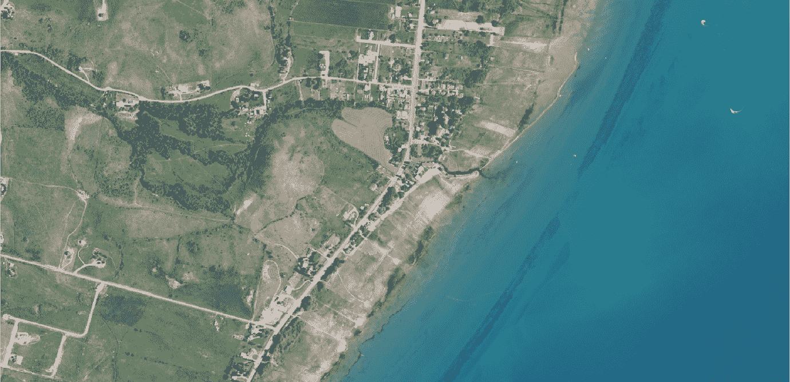
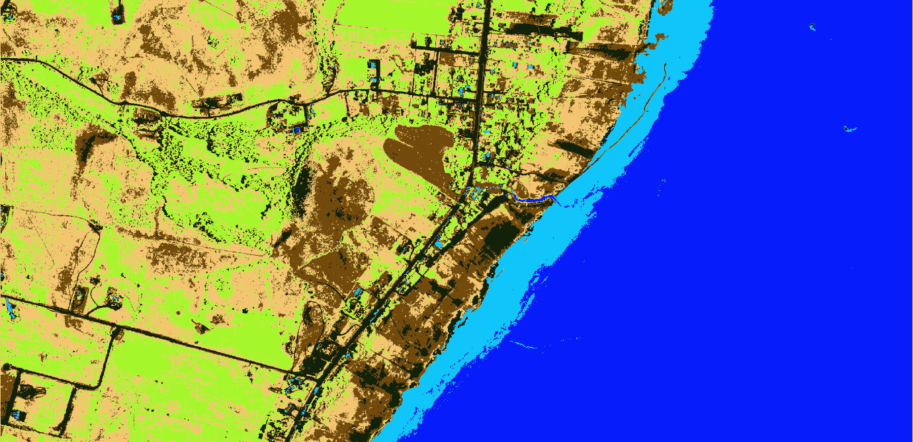

# 基于 Python 的无监督土地覆盖分类

> 原文：<https://towardsdatascience.com/unsupervised-land-cover-classification-with-python-8e3734dc3c6d?source=collection_archive---------29----------------------->

## 你并不总是需要训练数据。。。

航空影像的用途从军事行动到检查你可能购买的房子的后院。我们的人类大脑可以很容易地识别这些照片中的特征，但对计算机来说就不那么简单了。航空影像的自动分析需要将每个像素分类为土地覆盖类型。换句话说，我们必须训练计算机知道它在看什么，这样它才能知道要找什么。

有两种主要的分类方法。有人监督和无人监督。监督分类使用观察到的数据来指导一种算法，即红色、绿色和蓝色光的组合(图像中的像素值)代表草地、树木、泥土、路面等。无监督分类根据每个像素与其他像素的相似性将像素分配到组中(不需要真实数据或观察数据)。

我之前描述了如何实现一个复杂的、[基于对象的算法用于监督图像分析](/object-based-land-cover-classification-with-python-cbe54e9c9e24)。本文描述了一个简单的实现的 K-均值算法的无监督图像分类。因为无监督分类不需要观察数据(收集这些数据既费时又费钱),所以它可以应用于任何地方。

我们将使用国家农业图像项目(NAIP，如下所示)的一部分图像。文章最后给出了包含所有代码的要点。



# 入门指南

这个分析只需要三个 Python 模块。`scikit-learn`(或`sklearn`)`gdal`和`numpy`。

导入模块，用`gdal`加载镜像。用`RasterCount`查询图像(`gdal`数据集)中的波段数。根据用于收集图像的传感器，您可能有 3 到 500 个波段(用于高光谱图像)。NAIP 有 4 个波段，量化反射红、绿、蓝和近红外光。

另外，创建一个空的`numpy`数组来保存来自每个图像波段的数据。我们将展平数据，以便更好地使用`sklearn` k-means 算法。空数组需要与影像中行和列的乘积一样多的行，以及与栅格波段一样多的列。

```
from sklearn.cluster import KMeans 
import gdal 
import numpy as np naip_fn = 'path/to/image.tif' 
driverTiff = gdal.GetDriverByName('GTiff') 
naip_ds = gdal.Open(naip_fn) 
nbands = naip_ds.RasterCount data = np.empty((naip_ds.RasterXSize*naip_ds.RasterYSize, nbands))
```

读取每个栅格波段的数据。用`numpy.flatten()`将每个 2D 栅格波段阵列转换成 1D 阵列。然后将每个数组添加到`data`数组中。现在，所有波段数据都在一个数组中。

```
for i in range(1, nbands+1): 
    band = naip_ds.GetRasterBand(i).ReadAsArray() 
    data[:, i-1] = band.flatten()
```

# k-均值分类

我们可以用三行代码实现 k-means 算法。首先用您想要将数据分组到的集群(类)的数量设置`KMeans`对象。通常，您将使用不同数量的分类对此进行测试，以找到最佳分类计数(在不过度拟合的情况下最能描述数据的分类数量)。我们不会在这篇文章中讨论这个问题，只讨论如何进行分类。在对象被设置后，使聚类适合图像数据。最后，使用拟合的分类来预测相同数据的类。

```
km = KMeans(n_clusters=7) 
km.fit(data) 
km.predict(data)
```

# 保存结果

用`labels_`从 k-means 分类中检索类。这将返回输入数据的每一行的类别号。调整标签形状以匹配 NAIP 图像的尺寸。

```
out_dat = km.labels_.reshape((naip_ds.RasterYSize,\
naip_ds.RasterXSize))
```

最后，使用`gdal`将结果数组保存为光栅。

```
clfds = driverTiff.Create('path/to/classified.tif',\
naip_ds.RasterXSize, naip_ds.RasterYSize, 1, gdal.GDT_Float32)clfds.SetGeoTransform(naip_ds.GetGeoTransform())
clfds.SetProjection(naip_ds.GetProjection())
clfds.GetRasterBand(1).SetNoDataValue(-9999.0)
clfds.GetRasterBand(1).WriteArray(out_dat)
clfds = None
```



# 结论

对任何图像实现无监督分类算法都非常简单。无监督分类结果有一个主要缺点，您应该时刻注意。使用非监督方法创建的类不一定对应于现实世界中的实际特征。这些类别是通过对所有四个波段中具有相似值的像素进行分组而创建的。房子的屋顶可能和水有相似的光谱属性，所以屋顶和水可能会混淆。解释无监督的结果时必须谨慎。

*原载于 2020 年 7 月 1 日【https://opensourceoptions.com】[](https://opensourceoptions.com/blog/unsupervised-land-cover-classification-with-python/)**。***