# 无监督学习:聚类算法

> 原文：<https://towardsdatascience.com/unsupervised-learning-clustering-algorithms-5b290967f746?source=collection_archive---------17----------------------->

## 从头开始的数据科学

## 使用 K-means 和凝聚聚类算法对无标签数据进行分组

预测模型通常需要所谓的“标记”数据来进行训练——也就是说，数据中有一些你已经填写好的目标变量。当然，我们的目标是在您不知道目标变量的值的未知数据上使用模型，但是如果没有正确标记的训练数据，您就无法验证您的模型。因此，数据生产通常是数据科学项目中最困难的部分。比方说，你想教一台计算机阅读手写内容。收集几百页的文字扫描进去是不够的。你还需要给这些数据贴上标签，让每个单词都有一个相应的“正确读数”。对于像手写这样复杂的东西，您可能需要成千上万的训练样本，并且手工标注许多条目会很费力。

也许如果您遇到一个没有标记目标变量的数据集，有一种方法可以从它那里获得一些洞察力，而不需要经过标记它的麻烦。也许你只是没有时间或资源来标记数据，或者也许没有一个明确的目标变量来预测，是否仍然有一种方法来使用这些数据？这就是‘无监督学习’的世界。无监督学习的一个更常见的目标是对数据进行聚类，以找到合理的分组，其中每个组中的点看起来比其他组中的点更相似。最常见的两种聚类方法是 K 均值聚类和凝聚聚类。

**K-均值聚类**

所以，你有一些数据，你没有任何类别标签，但你很确定你可以将数据分成合理的组，你只是不知道那些组是什么。让我们生成一些数据进行实验:

一些假设的数据，生成为三个 blobs

如你所见，这些数据是由三个簇生成的。对于本例，这保证了有一个合理的分组为三个集群，但请记住，这里的要点是看您是否能自己找到该分组，因此让我们删除颜色编码:

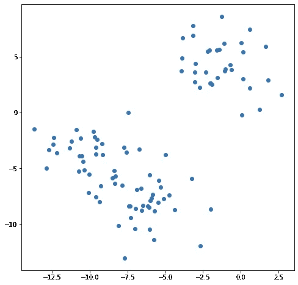

我们的观点没有颜色编码的好处

从视觉上看，你可能仍然能看到星团，至少能看到一点点，但是我们如何让计算机自己发现星团呢？我们要讨论的第一个策略是 k-means。在 k-means 策略中，首先指定要寻找多少个聚类，在这种情况下，我们假设是 3 个，计算机开始在图上随机放置这么多新点:

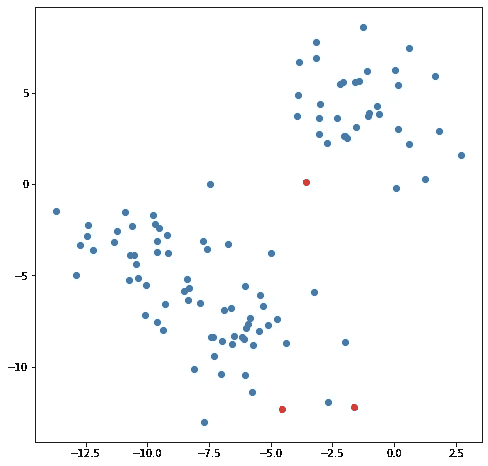

我们的数据有三个新的点——我们的质心——用红色表示

这些新点被称为“质心”——它们将成为我们星团的中心。为什么要随机放置？实际上，计算机没有办法提前知道哪里是放置聚类中心的合适位置，所以策略是随机放置它们，然后逐步移动它们以改善聚类。要决定如何移动质心，首先将每个点分配到离它最近的质心:

这些点已经被分配到最近的质心，现在是星形

我已经把形心做成星形，然后根据哪个形心最近来给这些点标上颜色。您可以看到红色和绿色的质心彼此靠近，并朝向数据的边缘，这似乎没有太大的意义-首先，红色聚类只有两个点。所以我们试着把这些质心移到更中心的地方。我们将每个质心移动到聚类的中心，这是聚类内的平均位置。一旦我们移动了质心，我们就把这些点重新分配给最近的质心。这是流程中新任务的第一步:

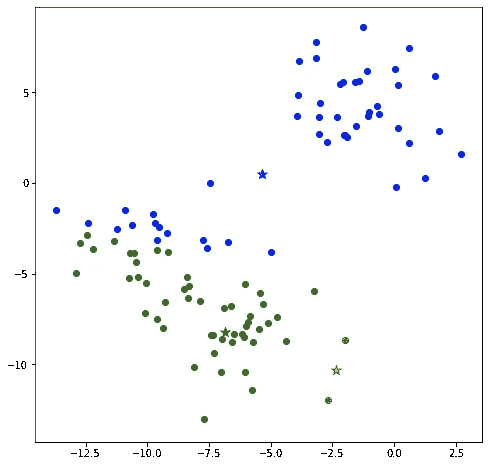

在将每个质心移动到其聚类的中心并重新分配这些点之后

红色质心没有移动很远，它仍然只有两个点在它的集群中。然而，绿色的质心向星团的中心迈了一大步。当它这样做的时候，它从蓝色星团中捕获了一堆点。因此，当我们重复这个过程时，蓝色质心将进一步移动到顶角，将底部留给绿色和红色:

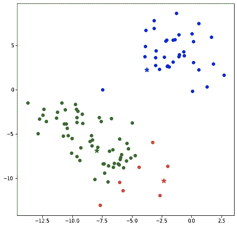

这一过程又进了一步

再次重复该过程会产生:

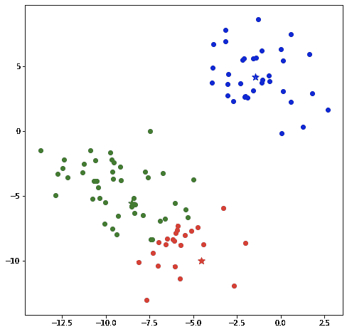

我们继续这个过程，一步一步地移动质心，并将这些点重新分配给相关的簇，直到我们找到一组稳定的停止移动的中心。在这种情况下，均衡看起来像这样:

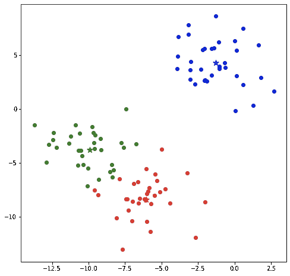

这是分割数据集的一个不错的方法！这也有助于可视化质心本身的运动:

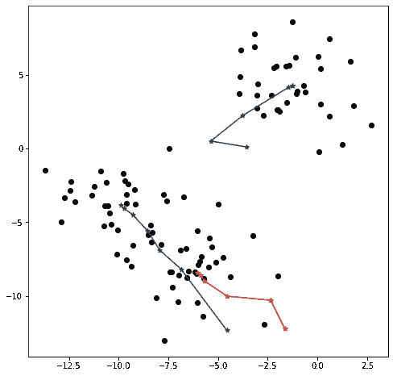

每个质心是如何逐步移动的

在这个过程中，第一个 fews 步骤相当大，因为质心被拉向其簇的中心，但后来它们采取的步骤变得越来越小，因为在每个步骤中只有少数点被重新分配。

在这种情况下，您会注意到集群算法最终基本上发现了我生成数据时创建的组。然而，重要的是，记住这是一个无监督的学习问题，算法没有办法以任何方式验证这些组。这些分组是在没有参考这些点属于哪一个“类”的情况下进行的，仅仅是它们的位置，不管怎样，计算机都无法判断这些分组代表了什么。如果您想要对聚类进行解释，则需要查看这些组并对它们进行思考，并且无法保证人们能够立即看到哪些特征代表了已创建的聚类，尤其是如果有两个以上的特征变量使得数据难以可视化。

另一个挑战是，您创建的分组取决于您的初始质心所在的位置以及有多少个质心，并且，同样，您可能无法验证您找到的分组是否是最佳分组，或者您是否有适当数量的簇！考虑这个例子，它也有三个簇，但是质心从不同的地方开始:

红色和绿色集群最终都迁移到右上角的斑点，在它们之间分裂，留下蓝色质心独自拥有三分之二的数据。k-means 算法无法知道这组聚类是否比我们发现的第一组更有意义。类似地，我们必须指定我们想要将数据分组到多少个簇中，我们不需要选择 3，我们可以选择任何数字。这是另一个分组，有 5 个集群，而不是 3 个:

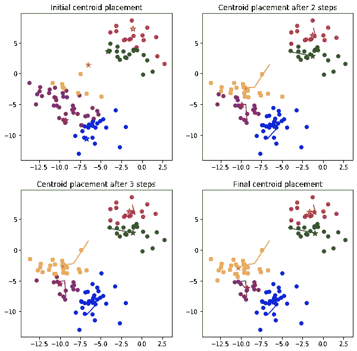

在某些情况下，您可能有特定的原因来选择一个特定数量的组—也许您正在将客户支持案例划分给一些支持人员，以便您只需要与员工人数一样多的组—但是一般来说，无监督聚类的挑战之一是决定聚类的数量。

在建立 k-means 算法或我们马上要讨论的凝聚算法时要记住的另一件事是，实际上有几种不同的方法来计算抽象空间中两点之间的“距离”。也许最常见的是“欧几里德距离”,你会记得毕达哥拉斯定理。还有[“曼哈顿距离”](https://en.wikipedia.org/wiki/Taxicab_geometry)之所以这么叫，是因为它将每个轴上的距离单独累加起来，就好像你正沿着直角街道网格从曼哈顿的一个十字路口走到另一个十字路口。更一般地说，欧几里德距离和曼哈顿距离实际上都是称为[闵可夫斯基距离](https://en.wikipedia.org/wiki/Minkowski_distance)的一般度量的特定情况。如果您正在处理多维但稀疏的数据，您可能还会使用[余弦相似度](https://en.wikipedia.org/wiki/Cosine_similarity)作为相似度的度量——虽然余弦相似度本身并不是距离的度量，但如果您有许多变量，并且每行都趋于“稀疏”，那么余弦相似度在某种程度上可以更快地计算出相似的东西(也许您正在查看的客户可能都从拥有数千种不同产品的在线商店购买了少量产品)。不同的距离度量也可能在最终分组中产生略微不同的结果。

**层次凝聚聚类**

K-means 是一种“自上而下”的方法；它一次将所有东西分组，然后分几步调整这些分组。聚集聚类是一种自下而上的方式。它开始时没有聚类，只是所有的单个点，然后慢慢地一次一个地将点组合在一起。这个过程很简单。首先你要计算每个点和其他点之间的距离。选择彼此最接近的点，并将它们组合在一起。您继续重复这个过程，计算任何单个点或簇到所有其他点和簇之间的距离，慢慢地将点连接成簇，簇连接成其他簇，直到您只剩下您开始寻找的簇。举例来说，下面是一个在只有 20 个点的较小数据集上工作的算法示例:

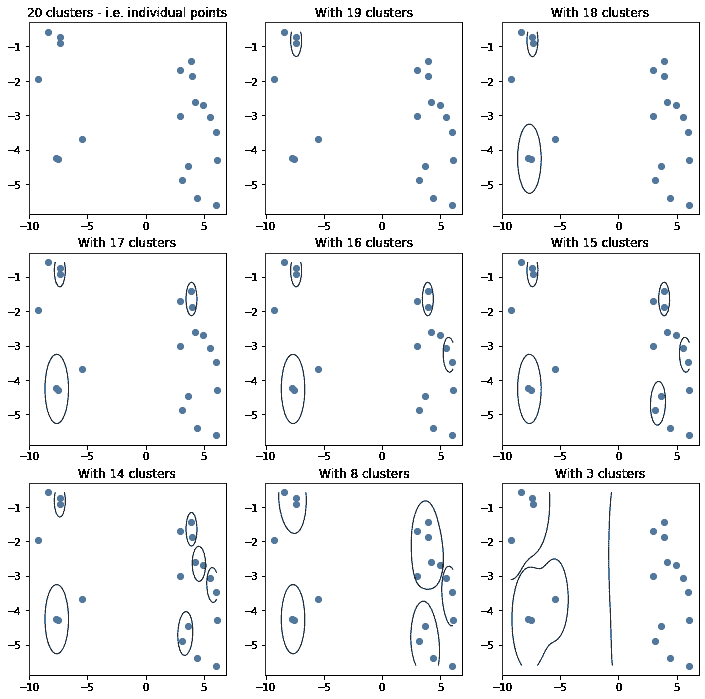

这是这个凝聚算法如何结束划分第一个数据集(你会看到一些点自己浮出来，看起来好像是自己分组的，但该算法实际上已经确定了三个集群，这些点实际上正在与附近更大的组进行分组。它们看起来像是自己浮动的，这是我用来自动绘制集群周围的围栏的核密度估计器的一个怪癖):

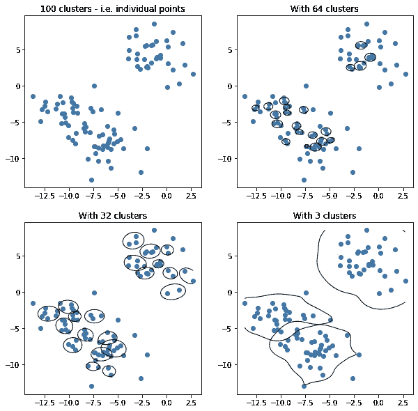

使用凝聚聚类对原始数据集进行分组

使用这样的算法，除了决定两点之间的距离度量之外，实际上还需要决定如何度量两个聚类之间的距离。您可以测量一个集群中的一个点到另一个集群中的一个点之间的最短距离，有点像两个集群内侧边缘之间的距离，这被称为“单一关联”。你也可以测量其中一个点到另一个点的最远距离——这被称为“完全链接”。或者你可以取一个集群中任意点到另一个集群中任意点的平均距离——“平均连接”。选择不同的距离度量或链接类型可能会导致不同的分组决策。

这种类型的集群的一个好处是它是稳定的。它不像 k-means 方法那样依赖于随机种子。一旦决定了距离的度量和聚类的数量，最终总是会得到相同的聚类。一个缺点是计算量很大。您需要测量每两组点之间的距离(对于 n 个点，此类链接的数量公式为 n(n-1)/2)，这只是为了决定您进行的第一个链接！

**决定集群的数量**

我前面提到过，决定一些集群是这些集群算法的挑战之一。那么，你如何选择集群的数量呢？没有硬性的规则，但是有一些方法可以用来指导你的选择。判断集群的度量标准倾向于关注集群的紧密程度，也就是说，集群中的点有多相似。一个简单的度量可能是组内平方和(WSS ),如果组内的点更分散，则该值会更大，如果点更靠近，则该值会更小。单独使用这种方法的挑战在于，随着您添加更多集群，WSS 将始终下降。你可以通过拥有和点一样多的聚类来最小化 WSS，那么 WSS 就是 0！

您如何知道何时停止添加集群？目标是找到一些聚类，在这些聚类中，再增加一个聚类对 WSS 度量不再有真正显著的好处。如果集群定义良好，那么这种情况通常会非常明显。考虑这个数据集，它被生成为具有 4 个相当不同的斑点:

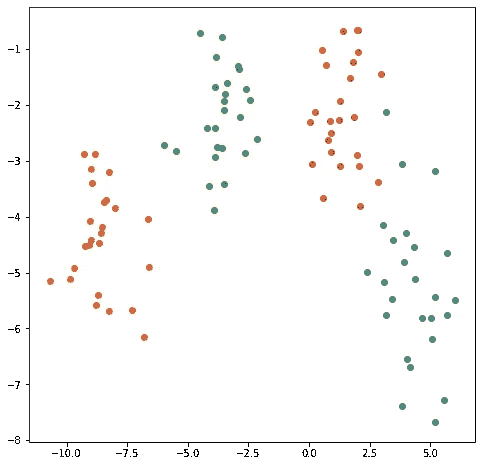

现在，我将使用 k-means 将这些数据多次分组，每次都增加分组的数量。我将记录每一个的 WSS 值，然后将它与聚类数对应起来绘制成图表:

您会注意到，当我将聚类数从 2 增加到 3，再从 3 增加到 4 时，我的 WSS 度量下降了很多，但每次增加都不是很多。一旦我找到 4 个聚类，算法通常会找到合理的分组。当我添加更多超过 4 的聚类时，算法开始分裂自然的聚类，我的紧凑性度量的边际效益并没有那么大。

这种确定适当聚类数的方法有时被称为“肘方法”；你在寻找图中的弯曲处或肘部，在那里增加 k 不再产生紧凑性方面的大的步骤。这是一个合理的起点，但是没有一种选择集群数量的方法是绝对可靠的。这种方法可能会被重叠、有点模糊或大小非常不同的簇所欺骗。

**选择聚类方法**

虽然这些不同的算法通常都在处理同一类事情，即紧密分组的簇，但它们以不同的方式完成任务，因此以不同的方式对不同的形状和分布做出响应。举个极端的例子，考虑以下几点:

也许我通过颜色编码泄露了一点，但是我想很多人会同意这里确实有两个不同的类:内环和外环。k-means 算法如何处理这些点？结果并不好:

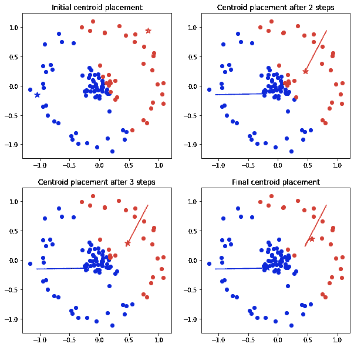

k-means 不能正确区分嵌套环

这个例子可能会让你觉得有点做作，甚至可能不公平。一个简单的算法可能挑出嵌套的形状吗？然而，答案实际上是肯定的；在这种情况下，使用单个链接来寻找聚类之间的距离的凝聚方法实际上识别了嵌套环:

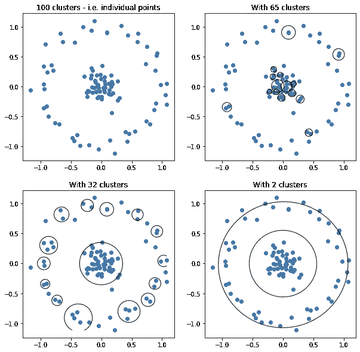

单链聚合聚类成功！

不幸的是，没有对所有形状都同样有效的主聚类算法，但是在使用聚类方法一段时间后，希望您会有一种直觉，知道哪种情况更适合一种算法或一种距离度量。