# 用于异常检测的无监督学习

> 原文：<https://towardsdatascience.com/unsupervised-learning-for-anomaly-detection-44c55a96b8c1?source=collection_archive---------1----------------------->

# 内容

在本帖中，我们将了解:

1.  异常检测的需求
2.  基于数学的异常检测基线算法
3.  评估异常检测算法
4.  多元高斯分布的扩展基线算法和马氏距离的使用
5.  在 Kaggle 上可用的信用卡数据集上检测欺诈交易

在[之前的](/deep-dive-into-principal-component-analysis-fc64347c4d20)帖子中，我们深入研究了主成分分析(PCA)及其试图解决的问题。为了巩固我们的概念，我们还在 Kaggle 上的 MNIST 数字数据集上可视化了 PCA 的结果。到目前为止，在每篇帖子中，我们讨论了监督学习算法或非监督学习算法，但在这篇帖子中，我们将讨论异常检测算法，这可以使用监督和非监督学习方法来解决。不过在这里，我们将讨论如何使用无监督学习来解决这个问题，并理解为什么使用无监督学习的异常检测在大多数情况下是有益的。

# 异常检测

异常是“离群值”一词的同义词。异常检测(或异常值检测)是对罕见项目、事件或观察结果的识别，这些项目、事件或观察结果因与大多数数据显著不同而引起怀疑。异常活动可能与某种问题或罕见事件有关，如银行欺诈、医疗问题、结构缺陷、设备故障等。

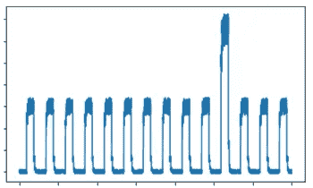

异常活动的示例

# 异常检测的需求

根据 2018 年 6 月发表的一项由 [Domo](https://www.domo.com/) 进行的研究，每天都有超过 2.5 万亿字节的数据被创建，据估计，到 2020 年，地球上每个人每秒将创建近 1.7 兆字节的数据。在新冠肺炎时代，当世界经济因在线业务和在线教育系统而稳定下来时，使用互联网的用户数量随着在线活动的增加而增加，因此，可以有把握地假设人均产生的数据增加了数倍。简而言之，一个人和一个组织的数字足迹已经飞速增长。服务器上充斥着大量的用户活动，这给所有企业带来了巨大的挑战。银行系统中的欺诈活动、社交媒体上的假 id 和垃圾邮件发送者以及针对小型企业的 DDoS 攻击都有可能导致相关组织崩溃，只有找到检测此类恶意(异常)活动的方法，才能防止这种情况的发生。由于引发特定网络攻击的方式数不胜数，因此很难事先在数据集中获得所有这些攻击的信息。但是，由于大多数在线用户活动是正常的，我们可以捕捉到几乎所有表明正常行为的方式。从包含-排除原理来看，如果一个被检查的活动没有给出正常活动的迹象，我们可以很有把握地预测给定的活动是异常的。

让我们用一个类比来理解上面的内容。在人类疾病的世界里，正常的活动可以与疟疾、登革热、猪流感等疾病相提并论。对此我们有治疗方法。另一方面，SarS-CoV-2(新冠肺炎)是一种悄悄进入我们疾病世界的异常现象，除了延迟症状之外，它具有正常疾病的特征。如果 SarS-CoV-2 **异常**在非常早期**被检测到**，它的传播可能会被显著控制，我们今天就不会面临疫情。由于 SarS-CoV-2 是一种前所未见的全新异常，即使有监督的学习程序将其检测为异常也会失败，因为有监督的学习模型只是从给定数据集中的特征和标签中学习模式，而通过向无监督的学习算法提供预先存在的疾病的正常数据，我们可以以很高的概率将该病毒检测为异常，因为它不会落入正常疾病的类别(群)中。我希望这给出了足够的直觉来认识到异常检测的重要性，以及为什么在大多数情况下，对于这样的任务，非监督学习方法优于监督学习方法。

# 异常检测算法

有不同类型的异常检测算法，但我们今天将讨论的算法将从逐个特征的概率分布开始，以及它如何引导我们使用**马氏距离**进行异常检测算法。

无监督异常检测算法的一个最重要的假设是，用于学习目的的数据集被假设具有所有非异常训练样本(或者非常非常小部分的异常样本)。这似乎是一个非常大胆的假设，但是我们在上一节已经讨论了异常活动的可能性有多小(但是非常危险)。此外，异常检测算法的目标是通过提供给它的数据来学习正常活动的模式，以便当异常活动发生时，我们可以通过包含-排除原则来标记它。有了这个东西，我们再来详细讨论一下异常检测算法。

数据集中的数据点通常具有某种类型的分布，如[高斯(正态)分布](https://en.wikipedia.org/wiki/Normal_distribution)。并非所有数据集都遵循正态分布，但我们总是可以对要素应用某种变换(我们将在后面的部分中讨论)，将数据的分布转换为正态分布，而不会损失任何类型的要素方差。具有高斯分布的数据点集如下所示:

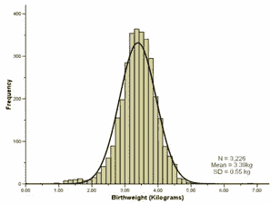

正态分布数据([来源](https://www.healthknowledge.org.uk/public-health-textbook/research-methods/1b-statistical-methods/statistical-distributions))

从上面的直方图中，我们看到数据点遵循高斯概率分布，并且大多数数据点分布在中心(平均)位置周围。当 y 轴上的频率值作为概率提及时，钟形曲线下的面积总是等于 1。在我们继续讨论之前，先看看下面的正态分布。


([来源](https://en.wikipedia.org/wiki/Normal_distribution))

我们观察到了什么？上面所有的线形图都代表正态概率分布，但它们仍然是不同的。这是因为上面的每个分布有两个参数使每个图都是唯一的:数据的**均值(μ)** 和**方差(σ )** 。红色、蓝色和黄色分布都以 0 平均值为中心，但它们都是不同的，因为它们关于其平均值有不同的分布。另一方面，绿色分布不具有 0 均值，但仍代表正态分布。由此可见，要描述正态分布，两个参数 **μ** 和 **σ** 控制着分布的样子。事实上，68%的数据位于平均值的第一个标准差( **σ** )附近(每侧 34%)，26.2 %的数据位于第一个和第二个标准差( **σ** )(每侧 13.1%)之间，以此类推。这意味着高斯分布中大约 95%的数据位于平均值的 2 个标准偏差之内。我们可以用它来验证真实世界的数据集是否具有(近乎完美的)高斯分布。

真实世界的数据有很多特性。如果每个特征的数据都以正态分布，那么我们可以继续，否则，建议将给定的分布转换成正态分布。下图显示了我们可以对给定的概率分布应用哪些变换来将其转换为正态分布。所得的变换可能不会产生完美的概率分布，但它会产生足够好的近似值，从而使算法运行良好。

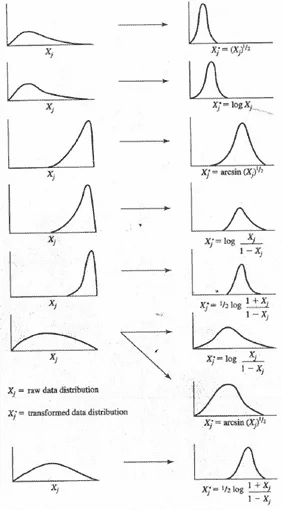

转换正态概率分布([来源](https://www.statisticssolutions.com/transforming-data-for-normality/))

请记住我们所做的假设，所有用于训练的数据都被假设为非异常的(或者应该有非常非常小的一部分异常)。我们将在这里使用它。我们之前看到，正态分布中几乎 95%的数据位于平均值的两个标准偏差之内。由于异常的可能性一般很低，我们可以很有把握地说，分布在平均值附近的数据点是非异常的。由于均值和两个标准差之间的概率分布值足够大，我们可以将此范围内的值设置为阈值(一个可以调整的参数)，其中概率大于此阈值的特征值表示给定的特征值不是异常的，否则就是异常的。考虑数据中总共有 **n** 个特征。对于阈值为 **ε(i)** 的特征 **x(i)** ，高于该阈值的所有数据点的概率是非异常数据点，即相对于特定特征的非异常数据点表示为:

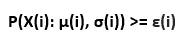

其中 **P(X(i):** **μ(i)，σ(i))** 表示特征 **X(i)** 的给定训练样本的概率，其特征在于 **μ(i)** 的均值和 **σ(i)** 的方差。

上述情况基于特定特征将数据点标记为异常/非异常。事实上，我们不能根据单一特征将数据点标记为异常。只有当计算出给定数据点的所有特征的所有概率值的组合时，我们才能非常有把握地说一个数据点是否是异常的。这个场景可以从前面的场景扩展，可以用下面的等式表示。

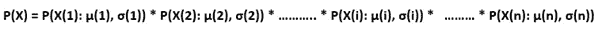

在以下情况下，数据点被视为非异常

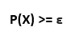

现在我们知道了如何使用数据的所有 n 特征来标记异常，让我们快速看看如何计算给定正态概率分布的 **P(X(i))** 。为此，我们还需要计算 **μ(i)** 和 **σ2(i)** ，具体操作如下。

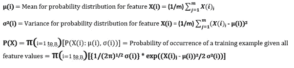

其中 **m** 是训练样本的数量，而 **n** 是特征的数量。

我们现在已经知道了计算正态分布中数据点的概率所需的一切。让我们看一个例子，看看这个过程是如何工作的。考虑由两个特征 x1 和 x2 组成的数据，正态概率分布如下:

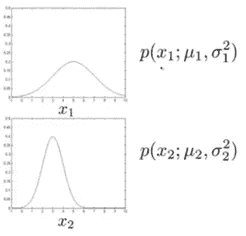

如果我们考虑训练集中的一个数据点，那么我们必须分别计算它的概率值 wrt x1 和 x2，然后将它们相乘，以获得最终结果，然后我们将它与阈值进行比较，以确定它是否是异常。为了更好地形象化事物，让我们在二维图中绘制 x1 和 x2，如下所示:

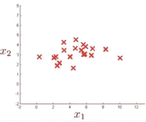

这两个特征的组合概率分布将在 3-D 中表示如下:

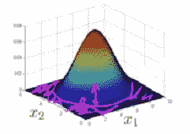

所得的概率分布是高斯分布。现在，如果我们考虑围绕中心值的训练示例，我们可以看到它将具有更高的概率值，而不是远的数据点，因为它位于概率分布曲线的相当高的位置。我们之前看到，大约 95%的训练数据位于平均值的 2 个标准偏差内，这导致我们选择第二个标准偏差的边界概率值周围的 **ε** 的值，然而，这可以根据不同的任务进行调整。这表明位于平均值第二标准差之外的数据点出现异常的概率更高，这从上图中概率分布的紫色阴影部分可以明显看出。

# 评估异常检测算法

任何异常检测算法，无论是有监督的还是无监督的，都需要进行评估，以了解算法的有效性。由于与正常数据点相比，异常发生的次数相对非常少，因此我们不能使用准确性作为评估指标，因为对于预测一切正常的模型，准确性将大于 99.9%，并且我们不会捕捉到任何异常。这是完全不可取的。我们的要求是评估我们检测到了多少异常，以及我们遗漏了多少异常。将非异常示例预测为异常几乎不会对任何系统造成损害，但是将异常示例预测为非异常会造成重大损害。在这样的评估标准中，一个帮助我们的度量是通过计算预测值的**混淆矩阵**。混淆矩阵是对分类问题预测结果的总结。正确和错误预测的数量用计数值汇总，并按每个类别细分。这是混乱矩阵的关键。混淆矩阵显示了分类模型在进行预测时被混淆的方式。它不仅让我们洞察到分类器所犯的错误，更重要的是让我们洞察到所犯错误的类型。

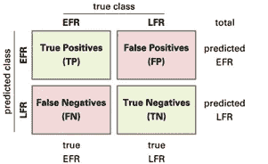

**真阳性**是模型正确预测阳性类别(非异常数据为非异常)的结果。类似地，**真阴性**是模型正确预测阴性类别(异常数据为异常)的结果。**假阳性**是模型错误地预测阳性类别(非异常数据为异常)的结果，而**假阴性**是模型错误地预测阴性类别(异常数据为非异常)的结果。在我们的异常检测算法中，我们的目标是尽可能减少假阴性。假阴性的数量越少，异常检测算法的性能越好。

我们忽略了一个非常重要的细节。我们上面讨论的异常检测算法是一种无监督学习算法，那么我们如何评价它的性能呢？在收集数据的同时，我们肯定知道哪些数据是异常的，哪些不是。不使用监督学习的原因是它不能从如此有限数量的异常中捕获所有的异常。这就是为什么我们使用包含-排除原则的无监督学习。假设我们有 10，040 个训练样本，其中 10，000 个是非异常的，40 个是异常的。这些数据将分为训练集、交叉验证集和测试集，如下所示:

训练集:8000 个非异常示例

交叉验证集:1，000 个非异常和 20 个异常示例

测试集:1，000 个非异常和 20 个异常示例

这种分布将使我们能够捕获非异常数据点中出现的尽可能多的模式，然后我们可以将它们与 20 个异常进行比较和对比，每个异常都在交叉验证和测试集中。这里创建交叉验证集的目的是调整阈值点 **ε的值。**

# 这种异常检测算法的缺点

我们需要知道异常检测算法如何分析非异常数据点的模式，以便知道是否有进一步改进的余地。让我们考虑一个数据分布，其中绘制的点不呈圆形，如下所示。

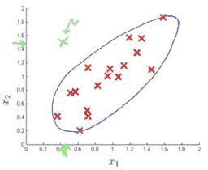

上图中所有的红点都是正常的例子。如果我们考虑用绿色标记的点，利用我们的智慧，我们会将这个点标记为异常点。但是，按照我们所讨论的异常检测算法的工作方式，该点将位于可以被检测为正常数据点的区域中。

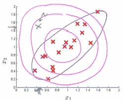

到目前为止讨论的异常检测算法都是循环工作的。内圆代表接近平均值的正态分布的概率值。绿点所在的第二个圆圈代表接近平均值的第一个标准差的概率值，依此类推。这是不可取的，因为我们不会每次都有散点图导致二维圆形分布、三维球形分布等的数据。我们需要一种异常检测算法，它能够根据数据点的分布进行调整，并给出良好的结果。事实证明，对于这个问题，我们可以使用多元高斯分布的 **Mahalanobis 距离(MD)** 属性(到目前为止，我们一直在处理多元高斯分布)。

# 多元高斯分布异常检测的马氏距离

马氏距离(MD)是多元空间中两点之间的距离。在规则的欧几里得空间中，变量(例如 x，y，z)由彼此成直角绘制的轴来表示。任何两点之间的距离都可以用尺子测量。对于不相关的变量，欧几里得距离等于 MD。然而，如果两个或更多的变量相关，轴不再是直角，并且用尺子测量变得不可能。另外，如果你有三个以上的变量，你根本无法在常规的 3D 空间中绘制它们。MD 解决了这个测量问题，因为它测量点之间的距离，甚至是多个变量的相关点。

****Mahalanobis 距离测量相对于质心的距离，质心是一个基点或中心点，可视为多元数据的整体平均值**。形心是多元空间中的一个点，所有变量的所有平均值都在该点相交。MD 越大，数据点离质心越远。**

**为了使用 Mahalanobis 距离进行异常检测，我们不需要计算每个特征的单独概率值。相反，我们可以直接计算每个数据点的最终概率，考虑数据的所有特征，最重要的是，由于在计算 Mahalanobis 距离时协方差矩阵**σ**的非零非对角线值，所得到的异常检测曲线不再是圆形的，而是符合数据分布的形状。**

**Mahalanobis 距离使用下面给出的公式计算。**

**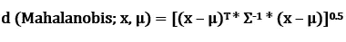**

**一旦计算出 Mahalanobis 距离，我们就可以计算出 **P(X)** ，一个训练样本出现的概率，假设所有 **n** 特征如下:**

**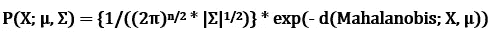**

**其中**|σ|**表示协方差矩阵**σ**的行列式。**

**值 **μ** 和**σ**计算如下:**

**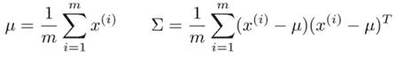**

**最后，我们可以设置一个阈值 **ε** ，其中 **P(X) <** **ε** 的所有值都标志着数据中的异常。但是，该值是一个参数，可以使用交叉验证集进行调整，该交叉验证集具有我们为前面的异常检测算法讨论的相同数据分布。**

**在结束本文的理论部分之前，必须指出，虽然使用 Mahalanobis 距离进行异常检测是一种更通用的异常检测方法，但正是这个原因使得它在计算上比基线算法更昂贵。此外，我们必须使训练样本数 **m** 大于特征数**n**(**m**>**n**)，否则协方差矩阵**σ**将不可逆(即**σ^-1**将变得不确定)。**

**最后，我们到达了文章理论部分的结论部分。在深入研究异常检测算法背后的数学知识之前，我们理解了异常检测算法的必要性。如果此时你的头脑有点混乱，我建议你多读一遍理论部分，尽管这完全是正常的。现在，让我们回顾一下 Kaggle 的欺诈性信用卡交易数据集，我们在[这篇](/machine-learning-iv-support-vector-machines-kaggle-dataset-with-svms-57d7c885652a)文章中使用支持向量机解决了该数据集，并使用异常检测算法解决了该数据集。**

# **问题陈述**

**在本节中，我们将使用异常检测算法来确定欺诈性信用卡交易。这个问题的数据集可以在这里[找到。这里需要注意的一点是，该数据集的特征已经作为 PCA 的结果进行了计算。这在两个方面帮助了我们:](https://www.kaggle.com/mlg-ulb/creditcardfraud)**

**(I)维护用户数据的机密性。**

**(ii)由于 PCA 变换，数据集中的特征相互独立。**

**让我们从在熊猫数据框中加载内存中的数据开始。**

```
import numpy as np
import pandas as pd
import matplotlib.pyplot as pltfrom sklearn import preprocessing
from sklearn.neighbors import LocalOutlierFactor
from sklearn.metrics import confusion_matrix, classification_report,accuracy_scoreimport os
for dirname, _, filenames **in** os.walk(‘/kaggle/input’):
  for filename **in** filenames
    print(os.path.join(dirname, filename))
```

**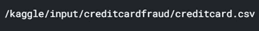**

```
df = pd.read_csv("/kaggle/input/creditcardfraud/creditcard.csv")
df.head()
```

**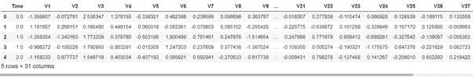**

**我们继续进行数据预处理步骤。让我们看看这些值是如何分布在数据集的各个要素中的。**

```
df.describe()
```

**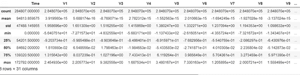**

**原始数据集有超过 284k+的数据点，其中只有 492 个是异常的。在整个数据集上训练模型导致 Kaggle 超时，所以我使用了 20%的数据(> 56k 数据点)。**

```
print(df.shape)
data= df.sample(frac = 0.2,random_state=1)
print(data.shape)
```

**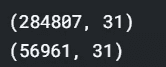**

**数据没有空值，这可以通过下面的代码来检查。**

```
df.isnull().values.any()
```

**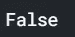**

**让我们在条形图上绘制正常交易与异常交易，以了解数据集中欺诈交易的比例。此外，我们还可以在自己的数据集中区分正常交易和欺诈交易。**

```
num_classes = pd.value_counts(df['Class'], sort = True)
num_classes.plot(kind = 'bar')plt.title("Transaction Class Distribution")
plt.xticks(range(2), ["Normal", "Fraud"])
plt.xlabel("Class")
plt.ylabel("Frequency")fraud = df[df['Class'] == 1]
normal = df[df['Class'] == 0]print(fraud.shape, normal.shape)
```

**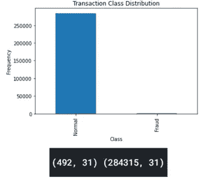**

**在数据集中，我们只能根据输出“类”来解释“时间”和“金额”值。让我们看看，如果我们能找到一些观察，使我们能够明显区分正常和欺诈交易。**

```
f, (ax1, ax2) = plt.subplots(2, 1, sharex=True)
f.suptitle('Time of transaction v/s Amount by Class type')ax1.scatter(fraud.Time, fraud.Amount)
ax1.set_title('Fraud')
ax2.scatter(normal.Time, normal.Amount)
ax2.set_title('Normal')plt.xlabel('Time (in secs)')
plt.ylabel('Amount')
plt.xlim((0, 20000))plt.show()
```

**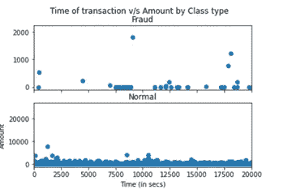**

```
f, (ax1, ax2) = plt.subplots(2, 1, sharex=True)
f.suptitle('Amount per transaction by class')bins = 10
ax1.hist(fraud.Amount, bins = bins)
ax1.set_title('Fraud')
ax2.hist(normal.Amount, bins = bins)
ax2.set_title('Normal')plt.xlabel('Amount ($)')
plt.ylabel('Number of Transactions')
plt.xlim((0, 20000))
plt.yscale('log')
```

**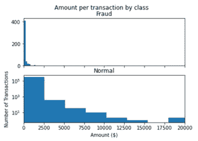**

**从第一个情节中，我们可以观察到，欺诈交易与正常交易同时发生，使得时间成为一个不相关的因素。从第二个情节可以看出，大部分的诈骗交易都是小额交易。然而，这并不是一个巨大的区别特征，因为大多数正常交易也是小额交易。**

**在继续下一步之前，让我们看看在缩减的数据集(20%的特征)中有多少欺诈性和非欺诈性交易，我们将使用这些数据来训练机器学习模型以识别异常。**

```
fraud = data[data['Class']==1]
normal = data[data['Class']==0]anomaly_fraction = len(fraud)/float(len(normal))
print(anomaly_fraction)print("Fraud Cases: " + str(len(fraud)))
print("Normal Cases: " + str(len(normal)))
```

**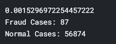**

**我们的数据集中只有 0.1%的欺诈交易。这意味着模型的随机猜测对于欺诈性交易应该产生 0.1%的准确性。然而，我们将构建一个比这个更精确的模型。你可能会想为什么我在这里提到这个。我将参考这些线，同时评估最终模型的性能。**

**回想一下，我们已经知道，为了应用无监督异常检测算法，每个特征应该是正态分布的。让我们为每个特征绘制直方图，看看哪些特征根本不代表高斯分布。**

```
data.hist(figsize=(15,15), bins = 64)
plt.show()
```

**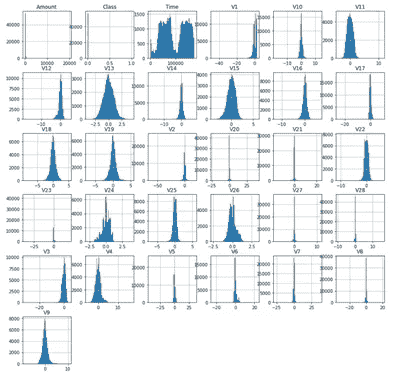**

**从上面的直方图中，我们可以看到‘时间’、‘V1’和‘v 24’甚至都不是近似高斯分布的。让我们从模型训练过程中去掉这些特性。无论如何，我们都要省略“时间”功能。**

```
columns = data.columns.tolist()target=columns[-1]
columns = columns[:-1]X_train = data.iloc[:45000, :-1]
y_train = data.iloc[:45000, -1]X_test = data.iloc[45000:, :-1]
y_test = data.iloc[45000:, -1]print(X_train.shape, X_test.shape)
print(y_train.shape, y_test.shape)
```

**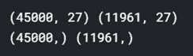**

**让我们使用 scikit-learn 库中的*localooutlierfactor*函数，以便使用上面讨论的无监督学习方法来训练模型。**

```
model = LocalOutlierFactor(contamination=anomaly_fraction)y_train_pred = model.fit_predict(X_train)
y_train_pred[y_train_pred == 1] = 0y_train_pred[y_train_pred == -1] = 1
y_test_pred = model.fit_predict(X_test)y_test_pred[y_test_pred == 1] = 0
y_test_pred[y_test_pred == -1] = 1
```

**现在我们已经训练了模型，让我们通过查看混淆矩阵来评估模型的性能，正如我们之前讨论的那样，准确性不是评估任何异常检测算法的好指标，尤其是像这样具有如此扭曲的输入数据的算法。**

```
import itertoolsclasses = np.array(['0','1'])def plot_confusion_matrix(cm, classes,title='Confusion matrix', cmap=plt.cm.Blues):plt.imshow(cm, interpolation='nearest', cmap=cmap)
plt.title(title)
plt.colorbar()tick_marks = np.arange(len(classes))
plt.xticks(tick_marks, classes, rotation=45)
plt.yticks(tick_marks, classes)fmt = 'd'
thresh = cm.max() / 2.for i, j **in** itertools.product(range(cm.shape[0]), range(cm.shape[1])):
plt.text(j, i, format(cm[i, j], fmt),
horizontalalignment="center",
color="white" if cm[i, j] > thresh else "black")plt.tight_layout()
plt.ylabel('True label')
plt.xlabel('Predicted label')
```

**上面的函数是一个帮助函数，使我们能够构建一个混淆矩阵。我们将绘制混淆矩阵来评估训练集和测试集的性能。**

```
cm_train = confusion_matrix(y_train, y_train_pred)
plot_confusion_matrix(cm_train,["Normal", "Fraud"])
```

**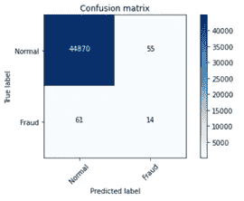**

```
cm_test = confusion_matrix(y_test_pred, y_test)
plot_confusion_matrix(cm_test,["Normal", "Fraud"])
```

**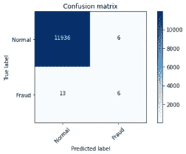**

**我们看到，在训练集上，该模型正确检测到 44，870 个正常交易，只有 55 个正常交易被标记为欺诈。这很好，但这不是我们所关心的。我们可以看到，在训练集中的 75 个欺诈交易中，只有 14 个被正确捕获，而 61 个被错误分类，这是一个问题。当我们将这一性能与 0.1%的随机猜测概率进行比较时，这是一个显著的改进，但还不够令人信服。即使在测试集中，我们看到 11，936/11，942 个正常交易被正确预测，但只有 6/19 个欺诈交易被正确捕获。**

# **分析性能**

**当我在解决这个数据集时，甚至我也惊讶了一会儿，但后来我批判性地分析了数据集，并得出结论，对于这个问题，这是无监督学习所能做的最好的事情。无监督学习表现不够好的一个原因是因为大多数欺诈性交易没有太多可以与正常交易很好地区分开的异常特征。我们针对“类”特征绘制的“时间”和“数量”图支持了这一点。我认为这是数据集提供标记交易为欺诈和非欺诈的标签的主要原因，因为欺诈交易没有任何明显的区别特征。在测试集上检测异常的准确率是 25%，这比随机猜测好得多(数据集中异常的比例是< 0.1%) despite having the accuracy of 99.84% accuracy on the test set.**

```
print('Total fraudulent transactions detected in training set: ' + str(cm_train[1][1]) + ' / ' + str(cm_train[1][1]+cm_train[1][0]))print('Total non-fraudulent transactions detected in training set: ' + str(cm_train[0][0]) + ' / ' + str(cm_train[0][1]+cm_train[0][0]))print('Probability to detect a fraudulent transaction in the training set: ' + str(cm_train[1][1]/(cm_train[1][1]+cm_train[1][0])))print('Probability to detect a non-fraudulent transaction in the training set: ' + str(cm_train[0][0]/(cm_train[0][1]+cm_train[0][0])))print("Accuracy of unsupervised anomaly detection model on the training set: "+str(100*(cm_train[0][0]+cm_train[1][1]) / (sum(cm_train[0]) + sum(cm_train[1]))) + "%")
```

**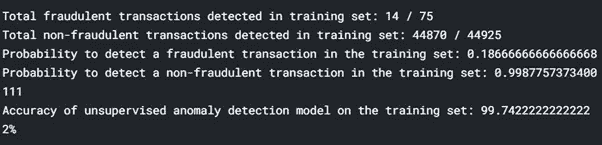**

```
print('Total fraudulent transactions detected in test set: ' + str(cm_test[1][1]) + ' / ' + str(cm_test[1][1]+cm_test[1][0]))print('Total non-fraudulent transactions detected in test set: ' + str(cm_test[0][0]) + ' / ' + str(cm_test[0][1]+cm_test[0][0]))print('Probability to detect a fraudulent transaction in the test set: ' + str(cm_test[1][1]/(cm_test[1][1]+cm_test[1][0])))print('Probability to detect a non-fraudulent transaction in the test set: ' + str(cm_test[0][0]/(cm_test[0][1]+cm_test[0][0])))print("Accuracy of unsupervised anomaly detection model on the test set: "+str(100*(cm_test[0][0]+cm_test[1][1]) / (sum(cm_test[0]) + sum(cm_test[1]))) + "%")
```

**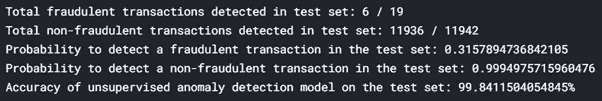**

**The entire code for this post can be found [这里是](https://www.kaggle.com/vardaanbajaj/unsupervised-anomaly-detection-for-fraud-detection))。**

**这个帖子到此为止。这篇文章也标志着机器学习系列文章的结束。写这些帖子是一种享受，在这个过程中我也学到了很多。我相信我们对事物的理解取决于我们教给他们的东西，在这些帖子中，我尽我所能简化事物。在最后几个帖子中，数学变得有点复杂，但这就是这些话题的情况。感谢阅读这些帖子。**