# 无监督学习—第 1 部分

> 原文：<https://towardsdatascience.com/unsupervised-learning-part-1-c007f0c35669?source=collection_archive---------32----------------------->

## [FAU 讲座笔记](https://towardsdatascience.com/tagged/fau-lecture-notes)关于深度学习

## 动机和受限玻尔兹曼机器

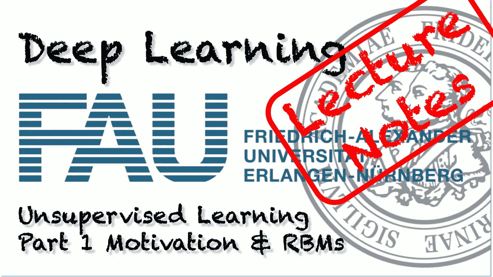

FAU 大学的深度学习。下图 [CC BY 4.0](https://creativecommons.org/licenses/by/4.0/) 来自[深度学习讲座](https://www.youtube.com/watch?v=p-_Stl0t3kU&list=PLpOGQvPCDQzvgpD3S0vTy7bJe2pf_yJFj&index=1)

**这些是 FAU 的 YouTube 讲座** [**深度学习**](https://www.youtube.com/watch?v=p-_Stl0t3kU&list=PLpOGQvPCDQzvgpD3S0vTy7bJe2pf_yJFj&index=1) **的讲义。这是与幻灯片匹配的讲座视频&的完整抄本。我们希望，你喜欢这个视频一样多。当然，这份抄本是用深度学习技术在很大程度上自动创建的，只进行了少量的手动修改。** [**自己试试吧！如果您发现错误，请告诉我们！**](http://autoblog.tf.fau.de/)

# 航行

[**上一讲**](/reinforcement-learning-part-5-70d10e0ca3d9) **/** [**观看本视频**](https://youtu.be/aoOE4bJxybA) **/** [**顶级**](/all-you-want-to-know-about-deep-learning-8d68dcffc258)/[**下一讲**](/unsupervised-learning-part-2-b1c130b8815d)

欢迎回到深度学习！所以今天，我们想谈谈无监督方法，特别是，我们将在接下来的几个视频中重点关注自动编码器和 GANs。我们今天将从基础、动机开始，并研究一种相当历史的方法——受限玻尔兹曼机器。我们仍然在这里提到它们，因为它们对无监督学习的发展很重要。

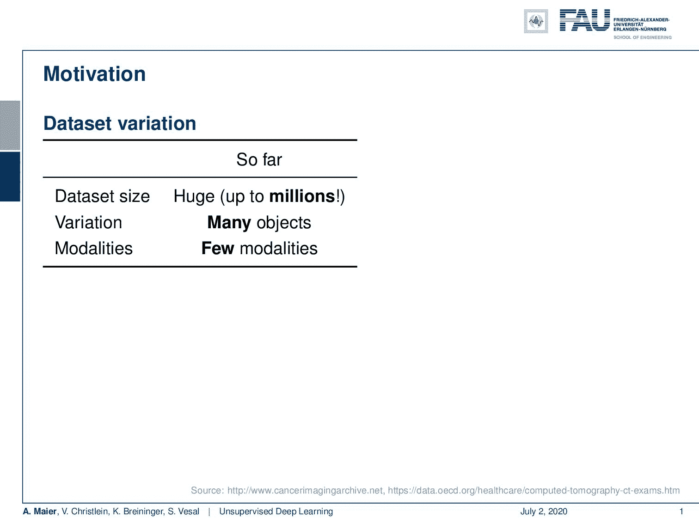

无监督学习的动机。 [CC 下的图片来自](https://creativecommons.org/licenses/by/4.0/)[深度学习讲座](https://www.youtube.com/watch?v=p-_Stl0t3kU&list=PLpOGQvPCDQzvgpD3S0vTy7bJe2pf_yJFj&index=1)的 4.0 。

让我们看看我为你准备了什么。所以，我说的主要话题是无监督学习。当然，我们从我们的动机开始。所以，你可以看到，我们到目前为止看到的数据集是巨大的，它们有多达数百万个不同的训练观察，许多对象，特别是少数模态。我们所看到的大部分东西本质上都是相机拍摄的图像。可能使用了不同的摄像机，但通常只有一个或两个模态在一个数据集中。然而，通常情况并非如此。例如，在医学成像领域，您通常有非常小的数据集，可能只有 30 到 100 名患者。你只有一个复杂的对象，那就是人体和许多不同的模态，从 MR、X 射线到超声波。它们都有非常不同的外观，这意味着它们在加工方面也有不同的要求。那么为什么会这样呢？在德国，实际上每 1000 名居民有 65 次 CT 扫描。这意味着仅在 2014 年，德国就有 500 万次 CT 扫描。所以，应该有大量的数据。为什么我们不能使用所有这些数据？当然，这些数据是敏感的，它们包含了病人的健康信息。例如，如果你有一个包含头部的 CT 扫描，[那么你可以渲染脸部表面](https://link.springer.com/article/10.1007/s10278-016-9932-7)，你甚至可以使用一个自动系统来确定这个人的身份。也有不明显的暗示。例如，如果你有大脑的表面，这个表面实际上是某个人的特征。你可以通过大脑形状的[来识别人，准确率高达 99%](https://www.ncbi.nlm.nih.gov/pmc/articles/PMC4340729/)。所以，你可以看到这确实是高度敏感的数据。如果你分享整本书，人们也许能认出这个人，尽管，你可能会说很难从一张切片图像中认出一个人。因此，有一些趋势使这样的数据变得可用。但是，你仍然有问题，即使你有数据，你需要标签。所以，你需要专家来查看数据，告诉你存在什么样的疾病，哪个解剖结构在哪里，等等。这也是非常昂贵的获得。

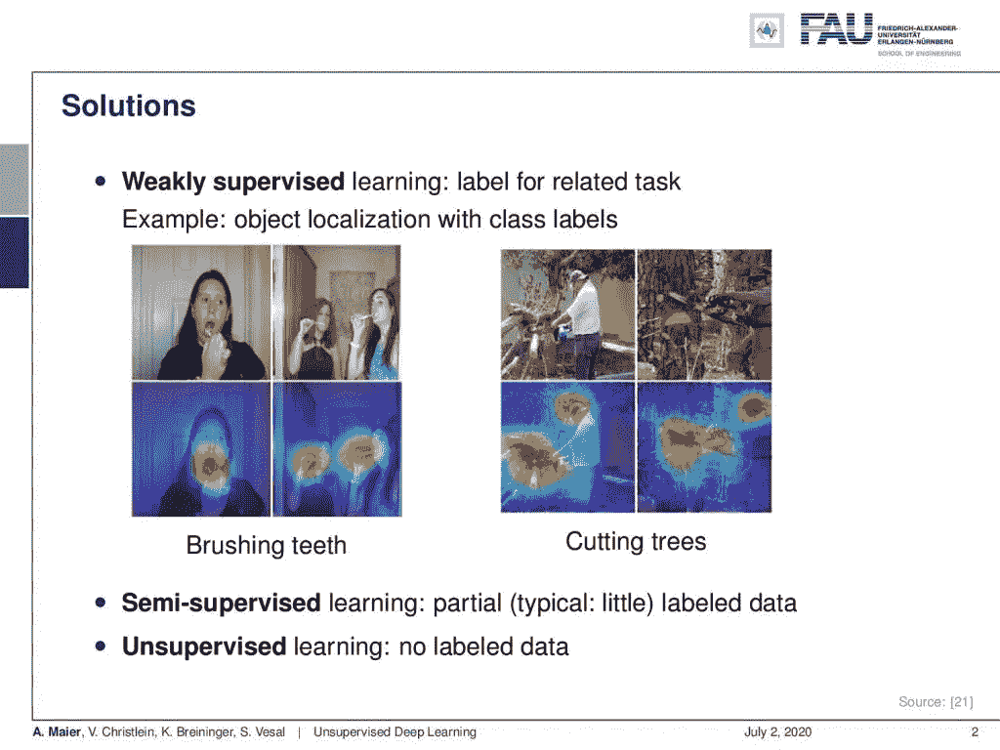

类激活映射。来自[深度学习讲座](https://www.youtube.com/watch?v=p-_Stl0t3kU&list=PLpOGQvPCDQzvgpD3S0vTy7bJe2pf_yJFj&index=1)的 [CC BY 4.0](https://creativecommons.org/licenses/by/4.0/) 下的图片。

因此，如果我们有一些方法可以在很少注释甚至没有注释的情况下工作，那就太好了。我这里有一些这方面的例子。一个趋势是弱监督学习。因此，这里有一个相关任务的标签。我们在这里展示的例子是来自类标签的本地化。比方说，你有图像，你有像刷牙或砍树这样的课程。然后，你可以使用这些加上相关的梯度信息，像使用可视化机制，你可以在特定的图像中定位类。这是一种可以获得非常便宜的标签的方法，例如，对于边界框。还有半监督技术，在这种技术中，你只有很少的标记数据，你试图将它应用到一个更大的数据集。这里的典型方法是自举。从一个小的带标签的数据集创建一个弱分类器。然后，将它应用于一个大型数据集，并尝试估计该大型数据集中的哪些数据点已被可靠地分类。接下来，你把可靠的系统放入一个新的训练集，用这个新的训练集，你可以重新开始尝试建立一个新的系统。最后，你迭代，直到你有一个更好的系统。

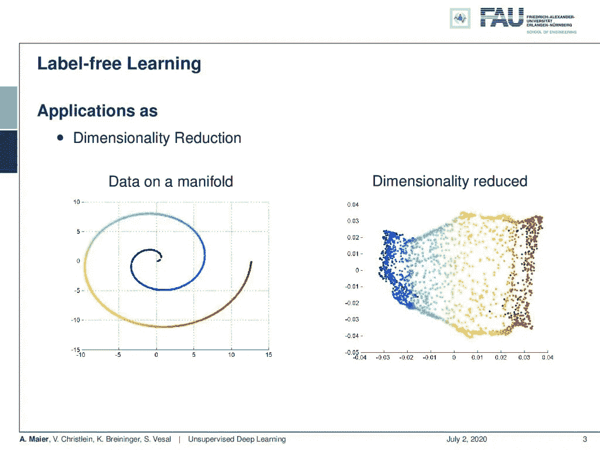

瑞士卷。 [CC 下的图片来自](https://creativecommons.org/licenses/by/4.0/)[深度学习讲座](https://www.youtube.com/watch?v=p-_Stl0t3kU&list=PLpOGQvPCDQzvgpD3S0vTy7bJe2pf_yJFj&index=1)的 4.0 。

当然，也有不需要任何标记数据的无监督技术。这将是接下来几个视频的主题。所以我们来看看无标签学习。这里的一个典型应用是降维。这里，你有一个数据在高维空间的例子。我们有一个三维空间。实际上，我们只是给你展示这个三维空间的一部分。你可以看到数据被卷起，我们在这张图片中用相似的颜色来标识相似的点。你可以看到这个三维流形，通常被称为瑞士卷。现在，瑞士卷实际上并不需要三维表示。所以，你想做的是自动展开它。你可以看到在右边，维度减少了。所以，这里只有两个维度。这已经使用非线性的流形学习技术或维度缩减技术自动完成。使用这些非线性方法，您可以将数据集分解成更低的维度。这很有用，因为较小的维度应该携带所有你需要的信息，你现在可以用它作为一种表示。

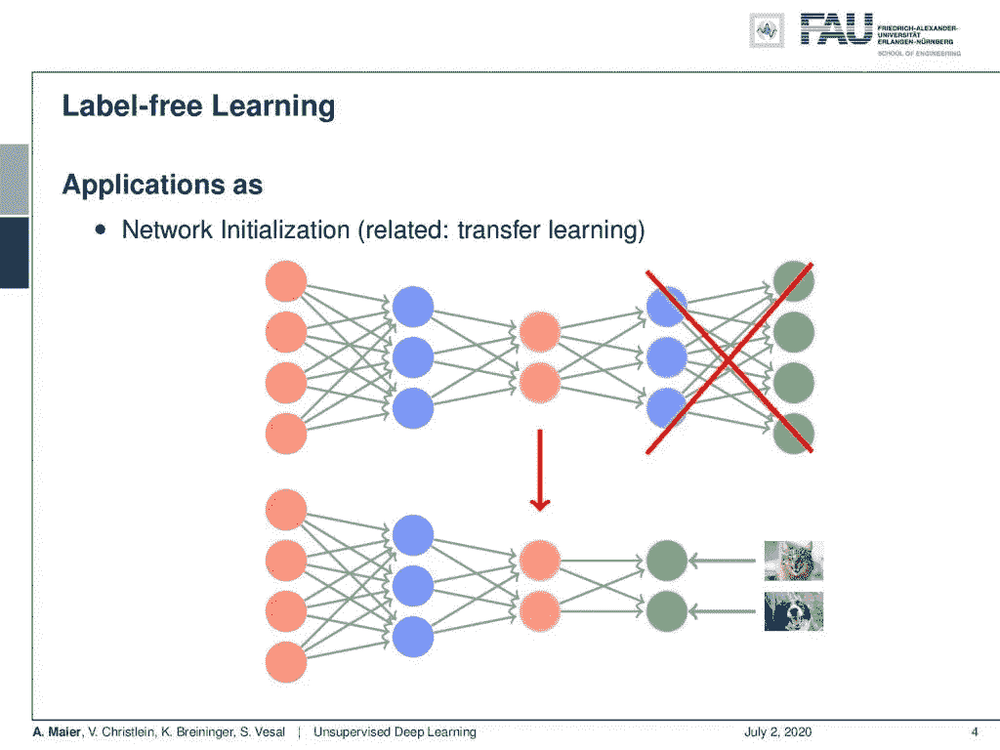

使用自动编码器的表征学习。 [CC 下的图片来自](https://creativecommons.org/licenses/by/4.0/)[深度学习讲座](https://www.youtube.com/watch?v=p-_Stl0t3kU&list=PLpOGQvPCDQzvgpD3S0vTy7bJe2pf_yJFj&index=1)的 4.0 。

我们还将在接下来的几个视频中看到，您可以将此用作网络初始化。你已经看到了第一个自动编码器结构。你训练这样一个有瓶颈的网络，在那里你有一个低维的表示。后来，你把这种低维的表现，并重新利用它。这意味着您实际上删除了网络的右边部分，并用一个不同的部分替换它。在这里，我们用它来分类，同样我们的例子是分类猫和狗。因此，你已经可以看到，如果我们能够进行这样的降维，在低维空间中保留原始信息，那么我们可能会有更少的权重来处理分类任务。顺便说一下，这与我们在讨论迁移学习技巧时已经讨论过的非常相似。

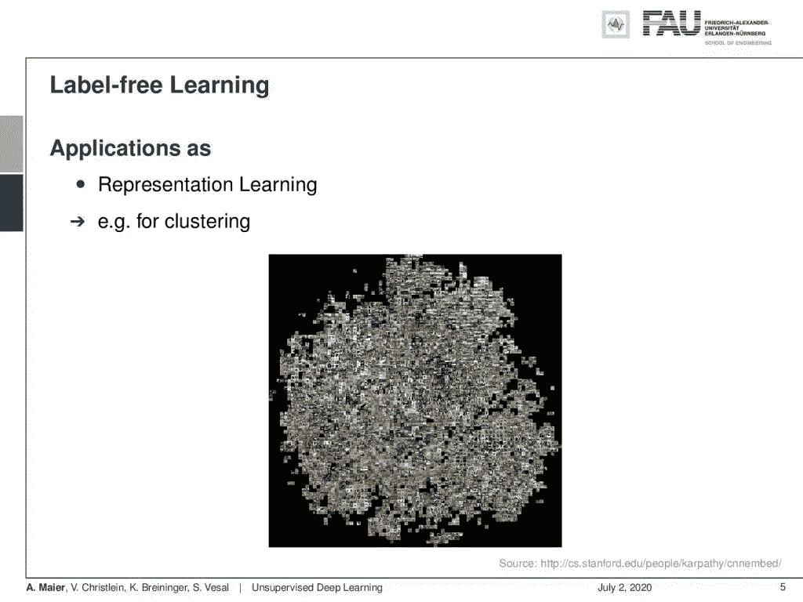

基于 t-SNE 的维数约简。来自[深度学习讲座](https://www.youtube.com/watch?v=p-_Stl0t3kU&list=PLpOGQvPCDQzvgpD3S0vTy7bJe2pf_yJFj&index=1)的 [CC BY 4.0](https://creativecommons.org/licenses/by/4.0/) 下的图片。

您也可以使用它进行聚类，您已经看到了这一点。我们已经在可视化一章中使用了这种技术，在这一章中，我们进行了非常好的降维，我们放大并查看了这里的不同地方。

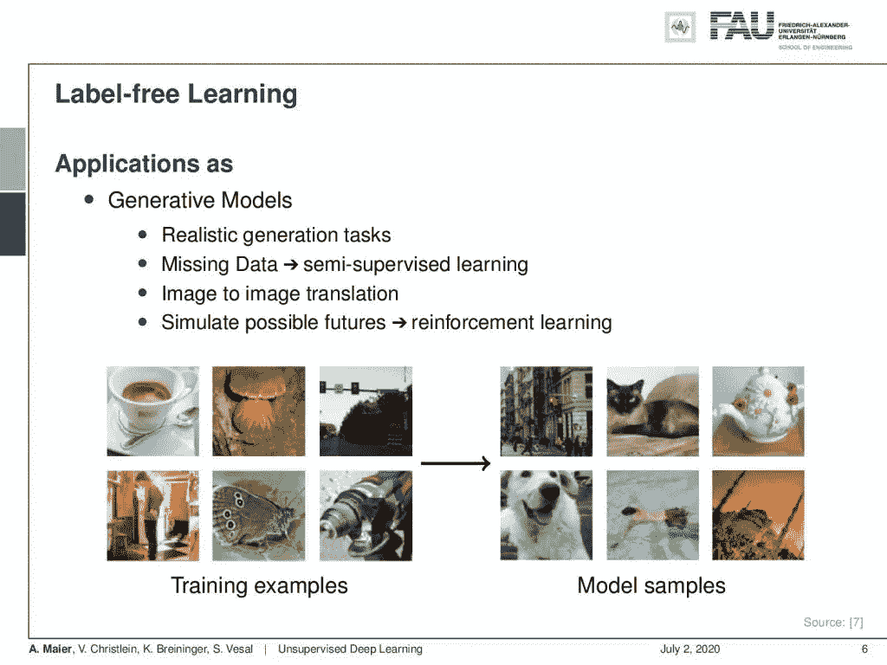

无监督学习的应用。 [CC 下的图片来自](https://creativecommons.org/licenses/by/4.0/)[深度学习讲座](https://www.youtube.com/watch?v=p-_Stl0t3kU&list=PLpOGQvPCDQzvgpD3S0vTy7bJe2pf_yJFj&index=1)的 4.0 。

你已经看到，如果你有一个好的学习方法，可以提取一个好的表示，那么你也可以用它来识别这样一个低维空间中的相似图像。嗯，这也可以用于生成模型。所以在这里，任务是生成逼真的图像。你可以用这个来解决丢失数据的问题。这就导致了半监督学习，你也可以利用这一点，例如，增强。你也可以用它来进行图像到图像的翻译，这也是一个非常酷的应用。我们稍后将看到所谓的循环 GAN，在这里您可以真正地进行域转换。你也可以用这个来模拟强化学习中可能的未来。所以，我们会有各种各样有趣的领域，我们也可以在这些领域应用这些无监督的技术。这里有一些数据生成的例子。你用左手边训练，然后在右手边生成这些图像。这将是一件很有吸引力的事情。你可以生成看起来像真实观察的图像。

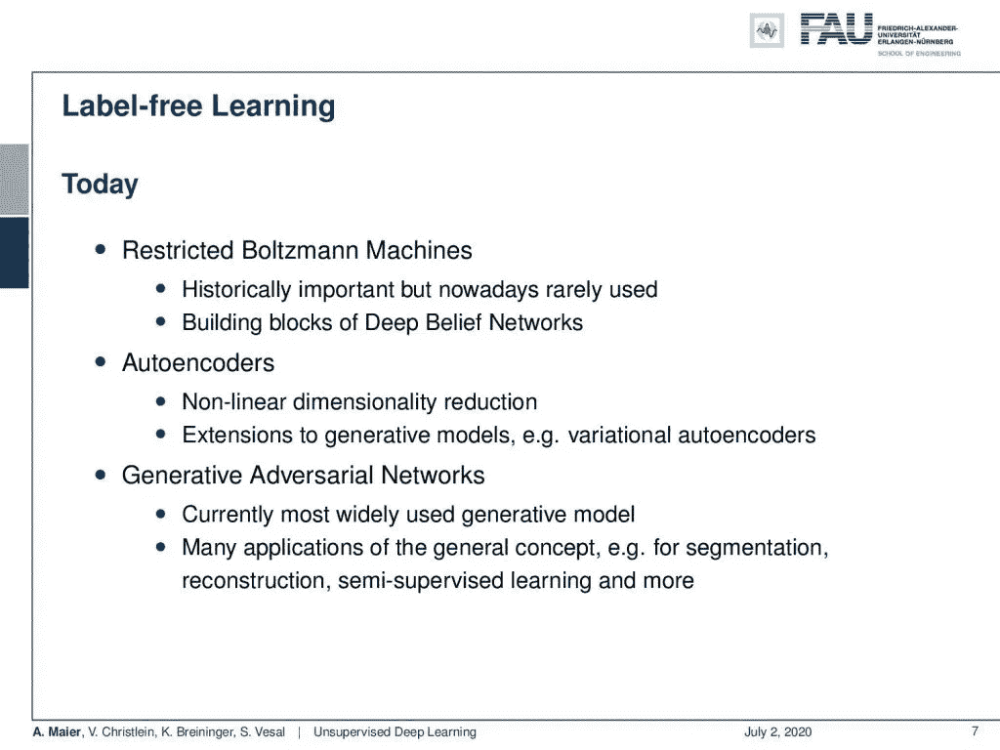

对我们班上接下来几个话题的概述。 [CC 下的图片来自](https://creativecommons.org/licenses/by/4.0/)[深度学习讲座](https://www.youtube.com/watch?v=p-_Stl0t3kU&list=PLpOGQvPCDQzvgpD3S0vTy7bJe2pf_yJFj&index=1)的 4.0 。

所以今天，我们将讨论受限玻尔兹曼机器。如前所述，它们具有重要的历史意义。但是，老实说，现在它们已经不常用了。它们是我们之前看到的重大突破的一部分。比如在谷歌梦里。所以，我觉得你应该了解这些技术。

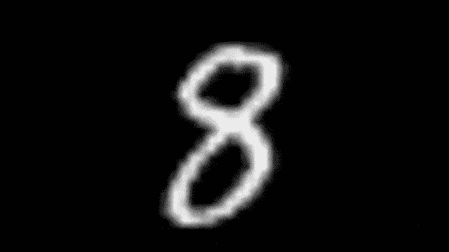

MNIST 之梦。使用 [gifify](https://github.com/vvo/gifify) 创建的图像。来源: [YouTube](https://youtu.be/5ZTdjtlT3IE)

稍后，我们将讨论自动编码器，它本质上是一种新兴技术，有点类似于受限玻尔兹曼机器。您可以在前馈网络环境中使用它们。你可以使用它们进行非线性降维，甚至可以扩展到生成模型，比如变分自动编码器，这也是一个很酷的技巧。最后，我们将讨论一般的敌对网络，这可能是目前最广泛使用的生成模型。这个非常普遍的概念有许多应用。您可以将它用于图像分割、重建、半监督学习等等。

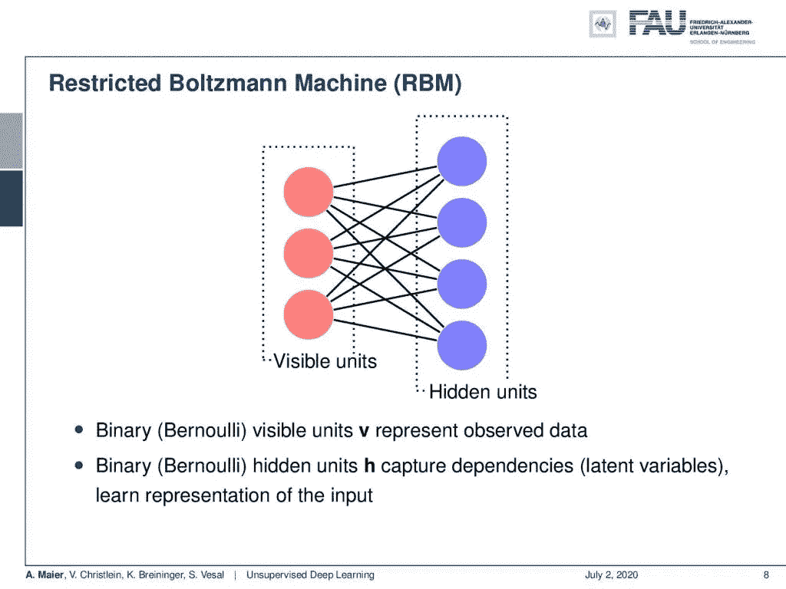

受限玻尔兹曼机综述。 [CC 下的图片来自](https://creativecommons.org/licenses/by/4.0/)[深度学习讲座](https://www.youtube.com/watch?v=p-_Stl0t3kU&list=PLpOGQvPCDQzvgpD3S0vTy7bJe2pf_yJFj&index=1)的 4.0 。

但我们先从历史角度来看。大概这些像受限玻尔兹曼机这样的历史东西，如果你在某个时候和我一起遇到考试，就没那么重要了。尽管如此，我认为你应该知道这项技术。这个想法非常简单。所以，你从两组节点开始。其中一个由可见单元组成，另一个由隐藏单元组成。他们是有联系的。所以，你有可见的单位 **v** ，它们代表观察到的数据。然后，您有了捕获依赖关系的隐藏单元。所以它们是潜在变量，应该是二进制的。所以它们应该是 0 和 1。现在，我们可以用这个二分图做什么呢？

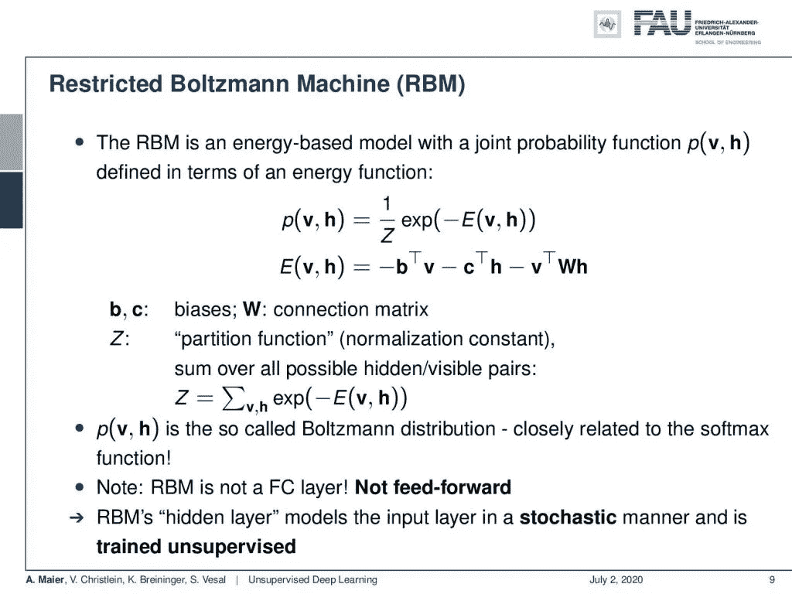

RBM 寻求最大化玻尔兹曼分布。来自[深度学习讲座](https://www.youtube.com/watch?v=p-_Stl0t3kU&list=PLpOGQvPCDQzvgpD3S0vTy7bJe2pf_yJFj&index=1)的 4.0CC 下的图片。

嗯，你可以看到，受限玻尔兹曼机是基于一个能量模型，它的联合概率函数是 p( **v** ， **h** )。它是用能量函数来定义的，这个能量函数用在概率中。所以，你有 1/Z，这是一种归一化常数。然后，E 的-E 次方( **v** ， **h** )。我们在这里定义的能量函数 E( **v** ， **h** )本质上是一个偏差与 **v** 另一个偏差和 **h** 的内积，然后是一个用矩阵 **W** 加权的 **v** 和 **h** 的加权内积。所以，你可以看到这里的未知数本质上是 **b** 、 **c** 和矩阵 **W** 。所以，这个概率密度函数叫做玻尔兹曼分布。它与 softmax 函数密切相关。请记住，这不仅仅是一个完全连接的层，因为它不是前馈。所以，你输入受限玻尔兹曼机器，你确定 **h** ，然后从 **h** 你可以再次产生 **v** 。因此，隐藏层以随机方式模拟输入层，并在无监督的情况下进行训练。

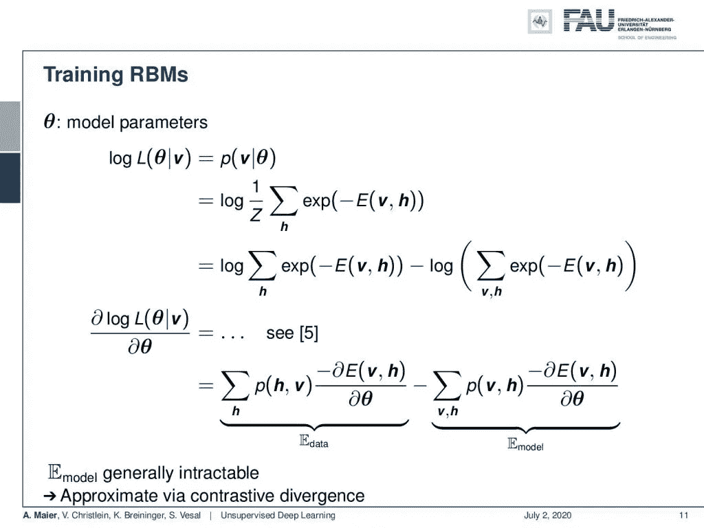

我们使用波尔兹曼分布的对数似然性来推导训练过程。 [CC 下的图片来自](https://creativecommons.org/licenses/by/4.0/)[深度学习讲座](https://www.youtube.com/watch?v=p-_Stl0t3kU&list=PLpOGQvPCDQzvgpD3S0vTy7bJe2pf_yJFj&index=1)的 4.0 。

所以让我们来看看这里的一些细节。正如我已经提到的，可见和隐藏的单元形成了这个二分图。你可能会说我们的 RBM 是带有隐藏变量的马尔可夫随机场。然后，我们想要找到 **W** 使得我们的概率对于低能态是高的，反之亦然。该学习基于负对数似然的梯度下降。所以，我们从对数似然开始，你可以在这张幻灯片上看到一个小错误。我们在 p( **v** ， **h** 中少了一个日志。我们已经在下一行中解决了这个问题，我们有 1/Z 的对数和指数函数的和。现在，我们可以使用 Z 的定义并扩展它。这允许我们把这个乘法写成第二个对数项。因为它是 1/Z，所以它是-log Z 的定义。这是对-E( **v** ， **h** )的指数函数的 **v** 和 **h** 之和。现在，如果我们看看梯度，你可以看到完整的推导在[5]中给出。你实际上得到的是两个和。一个是 p( **h** ， **v** )乘以关于参数的能量函数的负偏导数的总和减去 p( **v** ， **h** )乘以关于参数的能量函数的负偏导数的总和。同样，您可以将这两个术语解释为数据的期望值和模型的期望值。一般来说，模型的期望值是难以处理的，但是你可以用所谓的对比散度来近似这个。

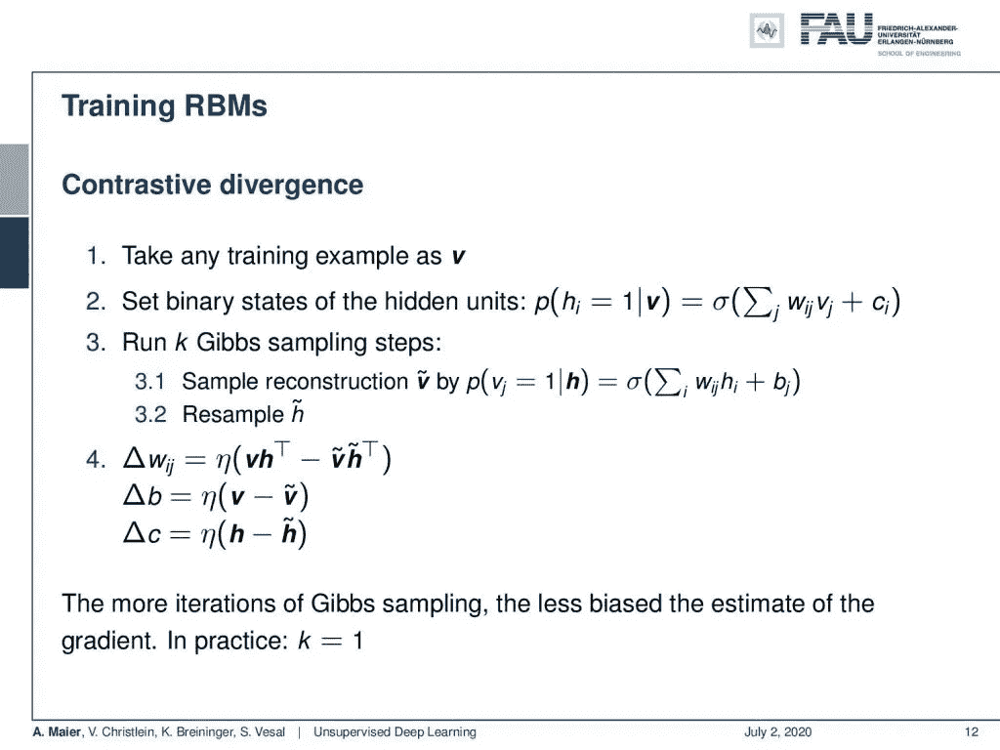

对比差异的更新规则。 [CC 下的图片来自](https://creativecommons.org/licenses/by/4.0/)[深度学习讲座](https://www.youtube.com/watch?v=p-_Stl0t3kU&list=PLpOGQvPCDQzvgpD3S0vTy7bJe2pf_yJFj&index=1)的 4.0 。

现在，对比分歧是这样运作的:你把任何一个训练的例子都看作是**对**。然后，通过计算 **v** s 加上偏差的加权和的 sigmoid 函数，设置隐藏单元的二进制状态。这给了你隐藏单元的概率。然后，您可以运行 *k* Gibbs 采样步骤，通过计算给定 **h** 的 v 下标 j =1 的概率，再次计算对 **h** 加上偏差的加权和的 sigmoid 函数，从而对重构 **v** 波形进行采样。所以，你用的是在第二步中计算的隐藏单位。然后，您可以使用它对重建的 **v** 波浪号进行采样。这允许您再次对 **h** 波浪号重新取样。所以，你运行这个程序几个步骤，如果你这样做了，你就可以计算梯度更新。矩阵 **W** 的梯度更新由η乘以**v**h 转置减去 **v** 波浪号 **h** 波浪号转置给出。偏差的更新为η乘以 **v** — **v** 波形，偏差 c 的更新为η乘以 **h** — **h** 波形。这也允许你更新权重。这样你就可以开始计算适当的权重和偏差。所以 Gibbs 抽样的迭代次数越多，梯度的估计偏差就越小。在实际操作中， *k* 简单选择为一。

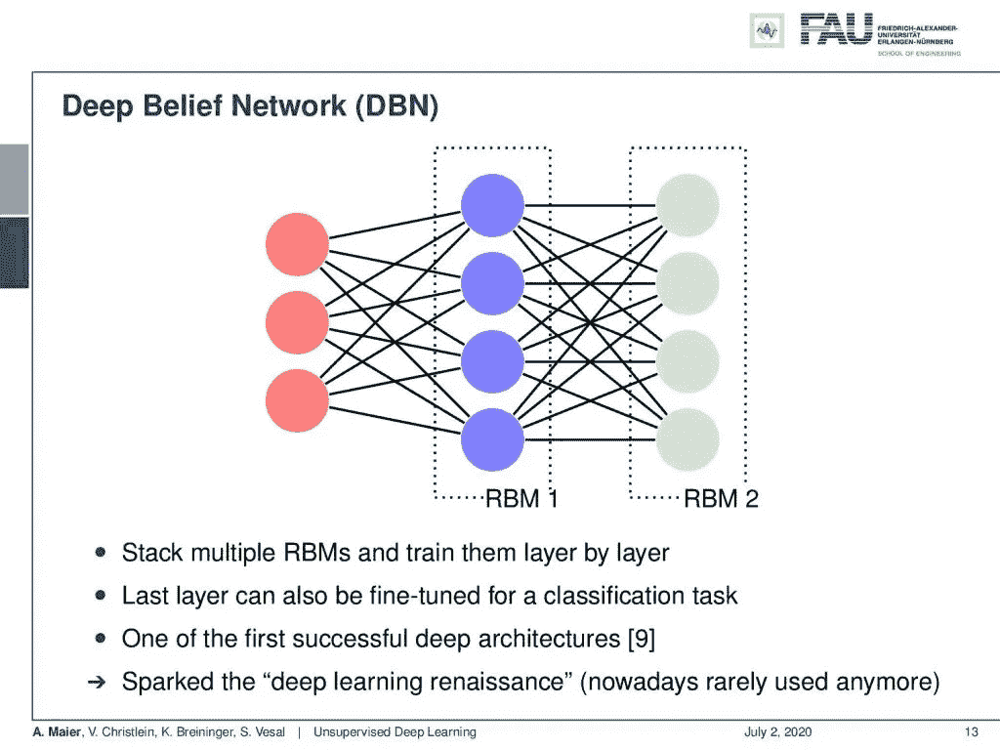

RBM 上的 RBM 创建深度信任网络。 [CC 下的图片来自](https://creativecommons.org/licenses/by/4.0/)[深度学习讲座](https://www.youtube.com/watch?v=p-_Stl0t3kU&list=PLpOGQvPCDQzvgpD3S0vTy7bJe2pf_yJFj&index=1)的 4.0 。

你可以在此基础上扩展成一个深度的信念网络。这里的想法是，然后你在顶部再次堆叠层。深度学习的想法就像一层层的。所以我们需要更深入，这里我们有一个受限玻尔兹曼机器，在另一个受限玻尔兹曼机器上面。所以，你可以用它来创建真正的深层网络。您可以使用的另一个技巧是，例如，使用最后一个图层对其进行微调以完成分类任务。

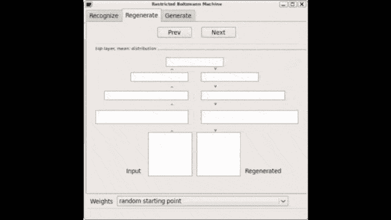

行动中的深度信任网络。使用 [gifify](https://github.com/vvo/gifify) 创建的图像。来源: [YouTube](https://youtu.be/0LTG64s6Xuc)

正如你在[9]中看到的，这是第一个成功的深度架构之一。这引发了深度学习的复兴。现在人民币已经很少用了。所以，深度信念网络不再常用了。

在这个深度学习讲座中，更多令人兴奋的事情即将到来。 [CC 下的图片来自](https://creativecommons.org/licenses/by/4.0/)[深度学习讲座](https://www.youtube.com/watch?v=p-_Stl0t3kU&list=PLpOGQvPCDQzvgpD3S0vTy7bJe2pf_yJFj&index=1)的 4.0 。

这就是我们下次讨论自动编码器的原因。在接下来的几个视频中，我们将探讨更复杂的方法，例如，生殖对抗网络。所以，我希望你喜欢这个视频，如果你喜欢它，那么我希望在下一个视频中看到你。再见！

如果你喜欢这篇文章，你可以在这里找到[更多的文章](https://medium.com/@akmaier)，在这里找到更多关于机器学习的教育材料[，或者看看我们的](https://lme.tf.fau.de/teaching/free-deep-learning-resources/)[深度](https://www.youtube.com/watch?v=p-_Stl0t3kU&list=PLpOGQvPCDQzvgpD3S0vTy7bJe2pf_yJFj) [学习](https://www.youtube.com/watch?v=p-_Stl0t3kU&list=PLpOGQvPCDQzvgpD3S0vTy7bJe2pf_yJFj&index=1) [讲座](https://www.youtube.com/watch?v=p-_Stl0t3kU&list=PLpOGQvPCDQzvgpD3S0vTy7bJe2pf_yJFj)。如果你想在未来了解更多的文章、视频和研究，我也会很感激关注 YouTube、Twitter、脸书、LinkedIn 或 T21。本文以 [Creative Commons 4.0 归属许可](https://creativecommons.org/licenses/by/4.0/deed.de)发布，如果引用，可以转载和修改。如果你有兴趣从视频讲座中生成文字记录，试试[自动博客](http://autoblog.tf.fau.de/)。

# 链接

[链接](http://dpkingma.com/wordpress/wp-content/%20uploads/2015/12/talk_nips_workshop_2015.pdf) —变型自动编码器:
[链接](https://www.youtube.com/watch?v=AJVyzd0rqdc)—NIPS 2016 good fellow 的 GAN 教程
[链接](https://github.com/soumith/ganhacks) —如何训练一个 GAN？让 GANs 发挥作用的技巧和诀窍(小心，而不是
一切都是真的了！)
[链接](https://github.com/hindupuravinash/the-gan-zoo)——有没有想过怎么给自己的甘起名？

# 参考

[1]陈曦，陈曦，闫端，等.“InfoGAN:基于信息最大化生成对抗网的可解释表征学习”.神经信息处理系统进展 29。柯伦咨询公司，2016 年，第 2172-2180 页。
[2] Pascal Vincent，Hugo Larochelle，Isabelle Lajoie 等，“堆叠去噪自动编码器:用局部去噪标准学习深度网络中的有用表示”。《机器学习研究杂志》第 11 期。2010 年 12 月，第 3371-3408 页。
[3] Emily L. Denton，Soumith Chintala，Arthur Szlam 等，“使用拉普拉斯金字塔对抗网络的深度生成图像模型”。载于:CoRR abs/1506.05751 (2015 年)。arXiv: 1506.05751。
[4]理查德·杜达、彼得·e·哈特和大卫·g·斯托克。模式分类。第二版。纽约:Wiley-Interscience，2000 年 11 月。
[5]阿斯嘉菲舍尔和克里斯蒂安伊格尔。“训练受限制的玻尔兹曼机器:介绍”。载于:模式识别 47.1 (2014)，第 25–39 页。
[6]约翰·高迪尔。用于人脸生成的条件生成对抗网络。2015 年 3 月 17 日。网址:[http://www.foldl.me/2015/conditional-gans-face-generation/](http://www.foldl.me/2015/conditional-gans-face-generation/)(2018 年 1 月 22 日访问)。
【7】伊恩·古德菲勒。NIPS 2016 教程:生成性对抗网络。2016.eprint: arXiv:1701.00160。
【8】Martin HEU sel，Hubert Ramsauer，Thomas Unterthiner 等，“通过双时标更新规则训练的 GANs 收敛到局部纳什均衡”。神经信息处理系统进展 30。柯伦联合公司，2017 年，第 6626–6637 页。[9]杰弗里·E·辛顿和鲁斯兰·R·萨拉胡季诺夫。"用神经网络降低数据的维数."刊登在:科学 313.5786(2006 年 7 月)，第 504–507 页。arXiv: 20。
【10】杰弗里·e·辛顿。“训练受限玻尔兹曼机器的实用指南”。神经网络:交易技巧:第二版。柏林，海德堡:施普林格柏林海德堡，2012 年，第 599-619 页。
[11]菲利普·伊索拉，，周廷辉等，“条件对立网络下的意象翻译”。在:(2016 年)。eprint: arXiv:1611.07004。
[12]迪耶德里克·P·金马和马克斯·韦林。“自动编码变分贝叶斯”。载于:arXiv 电子版，arXiv:1312.6114(2013 年 12 月)，arXiv:1312.6114。arXiv:1312.6114[统计。ML】。
[13] Jonathan Masci、Ueli Meier、Dan Ciresan 等人，“用于分层特征提取的堆叠卷积自动编码器”。载于:人工神经网络和机器学习— ICANN 2011。柏林，海德堡:施普林格柏林海德堡，2011 年，第 52-59 页。
[14]卢克·梅茨、本·普尔、大卫·普法乌等人，《展开的生成性敌对网络》。国际学习代表会议。2017 年 4 月。eprint: arXiv:1611.02163。
[15]迈赫迪米尔扎和西蒙奥辛德罗。“条件生成对抗网”。载于:CoRR abs/1411.1784 (2014 年)。arXiv: 1411.1784。
[16]亚历克·拉德福德、卢克·梅斯和索史密斯·钦塔拉。深度卷积生成对抗的无监督表示学习 2015。eprint: arXiv:1511.06434。
[17] Tim Salimans，Ian Goodfellow，Wojciech Zaremba 等，“训练 GANs 的改进技术”。神经信息处理系统进展 29。柯伦咨询公司，2016 年，第 2234–2242 页。
【18】吴恩达。“CS294A 课堂笔记”。2011 年。
【19】张寒、徐涛、李洪生等，“StackGAN:利用堆叠生成式对抗网络进行文本到照片级真实感图像合成”。载于:CoRR abs/1612.03242 (2016 年)。arXiv: 1612.03242。
【20】张寒、徐涛、李洪生等，“Stackgan:利用堆叠生成式对抗网络进行文本到照片级真实感图像合成”。载于:arXiv 预印本 arXiv:1612.03242 (2016)。
【21】周，Aditya Khosla，Agata Lapedriza 等，“学习深度特征用于鉴别性定位”。In: 2016 年 IEEE 计算机视觉与模式识别大会(CVPR)。拉斯维加斯，2016 年 6 月，第 2921–2929 页。arXiv: 1512.04150。
[22]朱俊彦，朴泰成，菲利普·伊索拉等，“利用循环一致的对立网络进行不成对的图像到图像的翻译”。载于:CoRR abs/1703.10593 (2017 年)。arXiv: 1703.10593。