# 无监督学习—第二部分

> 原文：<https://towardsdatascience.com/unsupervised-learning-part-2-b1c130b8815d?source=collection_archive---------26----------------------->

## [FAU 讲座笔记](https://towardsdatascience.com/tagged/fau-lecture-notes)关于深度学习

## 自动编码器

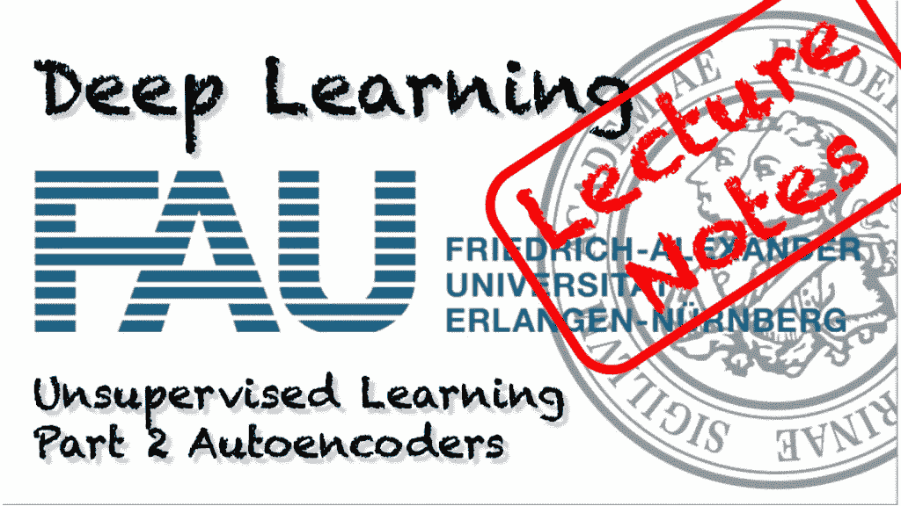

FAU 大学的深度学习。下图 [CC BY 4.0](https://creativecommons.org/licenses/by/4.0/) 来自[深度学习讲座](https://www.youtube.com/watch?v=p-_Stl0t3kU&list=PLpOGQvPCDQzvgpD3S0vTy7bJe2pf_yJFj&index=1)

**这些是 FAU 的 YouTube 讲座** [**深度学习**](https://www.youtube.com/watch?v=p-_Stl0t3kU&list=PLpOGQvPCDQzvgpD3S0vTy7bJe2pf_yJFj&index=1) **的讲义。这是讲座视频&配套幻灯片的完整抄本。我们希望，你喜欢这个视频一样多。当然，这份抄本是用深度学习技术在很大程度上自动创建的，只进行了少量的手动修改。** [**自己试试吧！如果您发现错误，请告诉我们！**](http://autoblog.tf.fau.de/)

# 航行

[**上一讲**](/unsupervised-learning-part-1-c007f0c35669) **/** [**观看本视频**](https://youtu.be/GpAHm7dvP_k) **/** [**顶级**](/all-you-want-to-know-about-deep-learning-8d68dcffc258)/[**下一讲**](/unsupervised-learning-part-3-7b15038bb884)

欢迎回到深度学习！今天，我们想继续讨论无监督方法，并研究一种非常流行的技术，即所谓的自动编码器。

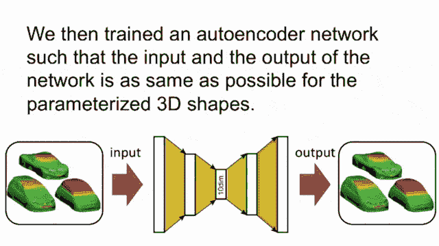

一个“自动”编码形状的例子(双关语)。使用 [gifify](https://github.com/vvo/gifify) 创建的图像。来源: [YouTube](https://youtu.be/25xQs0Hs1z0)

这是我们的幻灯片。我们讲座的第二部分和主题自动编码器。嗯，自动编码器的概念是我们想要使用前馈神经网络的想法。你可以说前馈神经网络是产生某种编码的 **x** 的函数 **y** 。

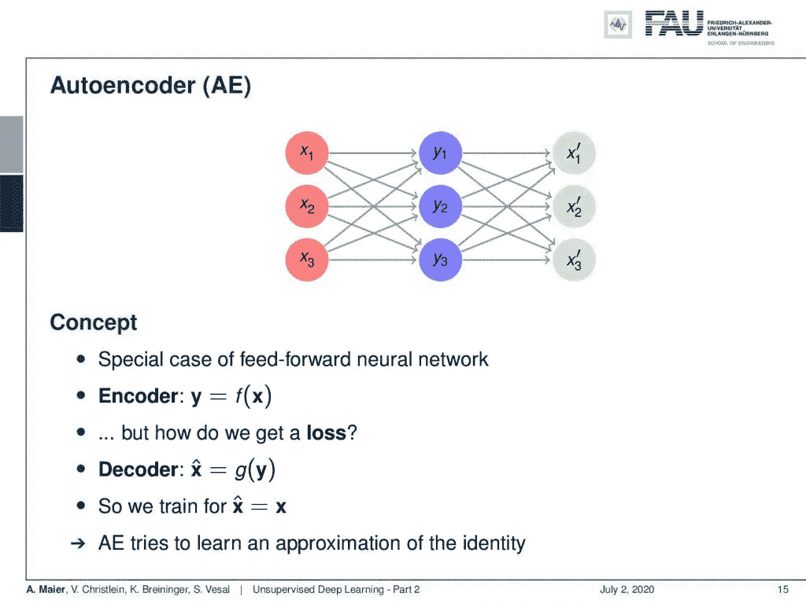

给定一些额外的约束，自动编码器尝试再现输入。 [CC 下的图片来自](https://creativecommons.org/licenses/by/4.0/)[深度学习讲座](https://www.youtube.com/watch?v=p-_Stl0t3kU&list=PLpOGQvPCDQzvgpD3S0vTy7bJe2pf_yJFj&index=1)的 4.0 。

现在，问题是:“我们如何在这样的星座中产生损失？”这个想法相当简单。我们在顶部添加了一个附加层，该层的目的是计算解码。所以，我们还有另一层，那就是 g( **y** )。g( **y** )产生一些 **x** 的帽子。我们可以定义的损失是 **x** hat 和 **x** 需要相同。所以自动编码器试图学习身份的近似值。嗯，听起来很简单。老实说，如果我们在输入和隐藏层中对于这里的 **y** 有完全相同数量的节点，那么最简单的解决方案可能是同一性。那么这到底有什么用呢？

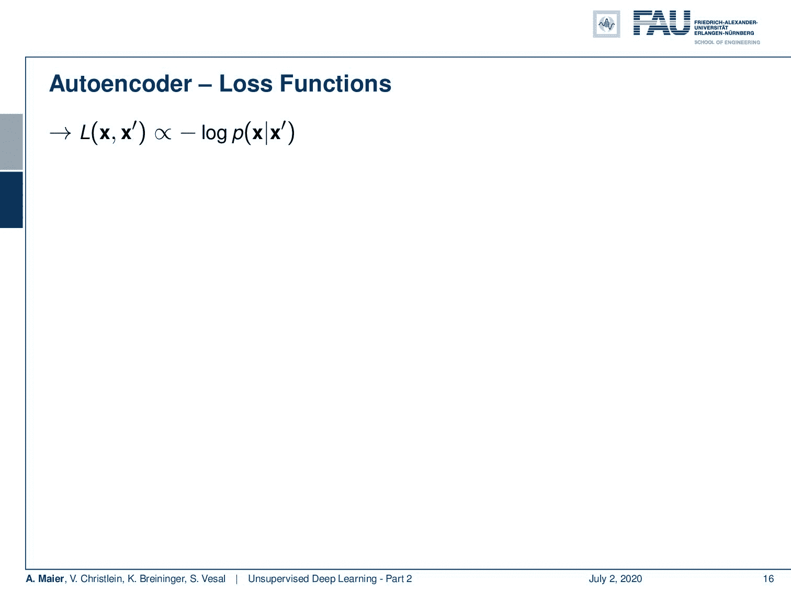

不同的自动编码器损失函数。来自[深度学习讲座](https://www.youtube.com/watch?v=p-_Stl0t3kU&list=PLpOGQvPCDQzvgpD3S0vTy7bJe2pf_yJFj&index=1)的 4.0CC 下的图片。

我们来看看一些损失函数。你通常可以使用一个损失函数，然后在这里对 **x** 和一些 **x** 进行运算。它可以与负对数似然函数成比例，其中有 p( **x** | **x** ')和结果函数。然后，以类似的方式，正如我们在本课程前面看到的[，你可以使用平方 L2 范数，假设你的函数的概率密度是均匀方差的正态分布。然后，你以 L2 的损失而告终。简单来说就是 **x** 减去 **x** ，这包含在 L2 范数中。当然也可以做交叉熵之类的事情。所以，如果你假设伯努利分布，你会看到我们最终得到的是交叉熵。这就是加权的 **x** 乘以 **x** 的对数加上 1- **x** 下标 I 乘以 1-**x**下标 I 的和。记住，如果你想这样使用它，那么你的 **x** 需要在概率范围内。因此，如果您想要应用这种损失函数，那么您可能想要将它与 softmax 函数结合使用。](https://youtu.be/4-t1YDp8qHU)

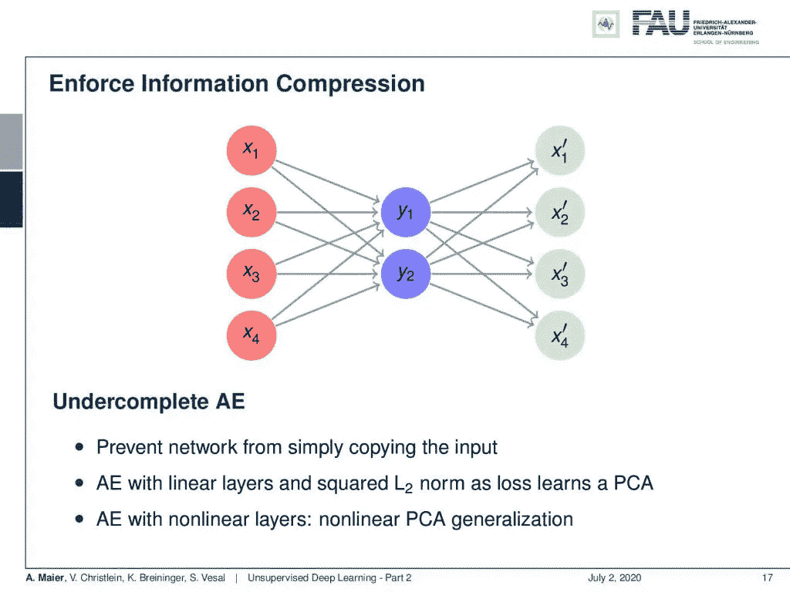

不完整的自动编码器。 [CC 下的图片来自](https://creativecommons.org/licenses/by/4.0/)[深度学习讲座](https://www.youtube.com/watch?v=p-_Stl0t3kU&list=PLpOGQvPCDQzvgpD3S0vTy7bJe2pf_yJFj&index=1)的 4.0 。

好了，这里有一些构建这种自动编码器的典型策略。我认为最流行的是欠完整自动编码器。所以在这里，你通过在隐藏层使用更少的神经元来实施信息压缩。你试图找到一种变换，这种变换实质上是对隐藏层进行降维。然后，您尝试从这个隐藏层扩展到原始数据域，并尝试找到产生最小损失的解决方案。所以，你试着在这里学习压缩。顺便说一句，如果你用线性图层和平方 L2 范数来做这件事，你基本上学会了主成分分析(PCA)。如果将它用于非线性图层，最终会得到类似非线性 PCA 泛化的结果。

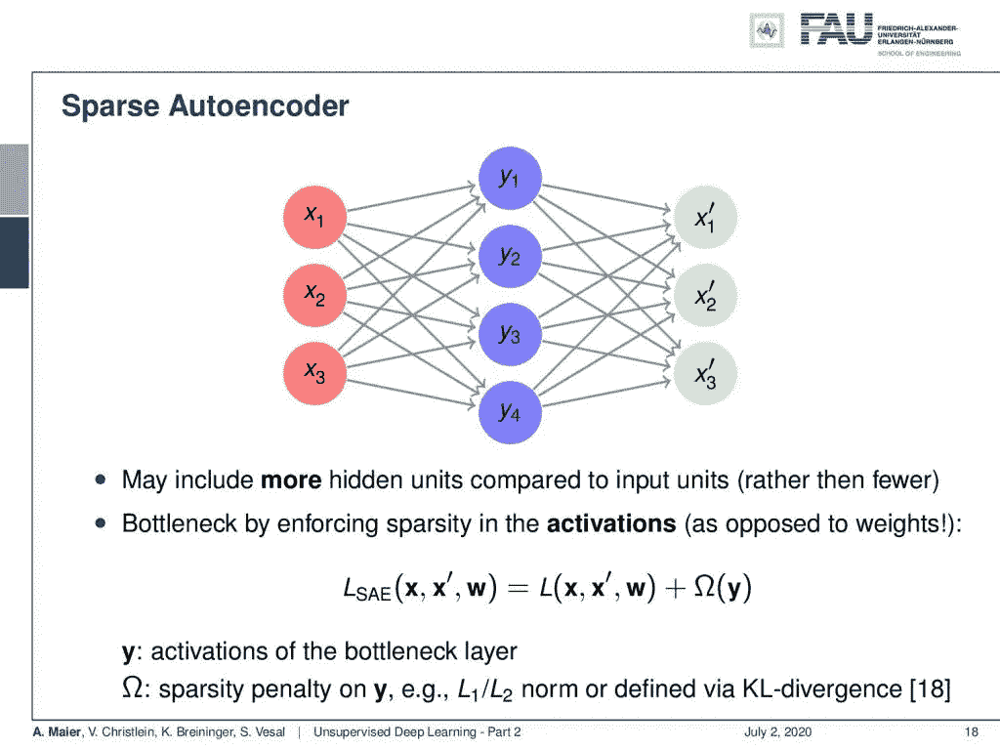

稀疏自动编码器。 [CC 下的图片来自](https://creativecommons.org/licenses/by/4.0/)[深度学习讲座](https://www.youtube.com/watch?v=p-_Stl0t3kU&list=PLpOGQvPCDQzvgpD3S0vTy7bJe2pf_yJFj&index=1)的 4.0 。

还有类似这些稀疏自动编码器的东西。这里，我们有一个不同的想法。我们甚至增加了神经元的数量，以模拟一个一键编码的向量。所以，你可能会说:“为什么要增加神经元的数量呢？然后，你甚至可以找到一个更简单的解决方案，比如身份，然后忽略其中的几个神经元！”所以，这个想法不会直接奏效。你必须加强稀疏性，这也创造了稀疏自动编码器的名称。这里，您必须使用一些额外的正则化来增强激活的稀疏性。例如，您可以在 **y** 的激活上使用 L1 范数来实现这一点。请记住，稀疏自动编码器中的稀疏性源于激活中的稀疏性，而不是权重中的稀疏性。如果你看看你的身份，你会发现这只是一个对角线矩阵，对角线上有 1。所以，这也是一个非常稀疏的解决方案。因此，再次强调激活的稀疏性，而不是权重。

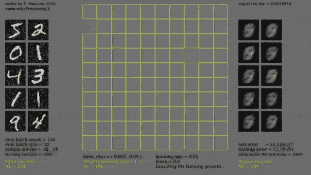

稀疏自动编码的作用。使用 [gifify](https://github.com/vvo/gifify) 创建的图像。来源: [YouTube](https://youtu.be/fG0dQVJmQzw)

还能做什么？你可以使用自动编码器变体。你可以把它和我们在这个课程中学到的所有[食谱结合起来。您可以构建卷积自动编码器。在这里，您可以用卷积层替换完全连接的层，也可以选择添加池层。](https://youtu.be/WJ-Es3gtR-M)

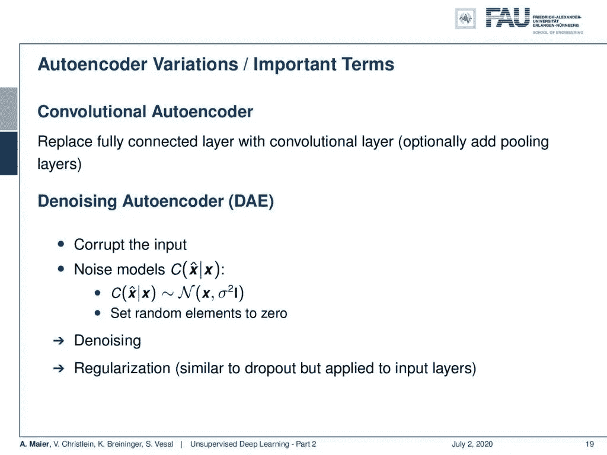

更多自动编码器变体。 [CC 下的图片来自](https://creativecommons.org/licenses/by/4.0/)[深度学习讲座](https://www.youtube.com/watch?v=p-_Stl0t3kU&list=PLpOGQvPCDQzvgpD3S0vTy7bJe2pf_yJFj&index=1)的 4.0 。

还有去噪自动编码器，这也是一个非常有趣的概念。在这里，噪声破坏了输入，目标就是无噪声的原始样本。因此，这就产生了一个经过训练的系统，它不只是进行降维或寻找稀疏表示。同时，它还执行去噪，您可能会认为这是一种额外的正则化，类似于 dropout，但本质上应用于输入图层。还有一篇名为 [noise2noise](https://arxiv.org/pdf/1803.04189.pdf) 的非常有趣的论文，其中他们表明，即使你有一个嘈杂的目标，你甚至可以建立这样的去噪自动编码器。这里的关键是，在输入和目标中有不同的噪声模式，这样你也可以训练去噪自动编码器，至少如果你建立在卷积自动编码器之上。

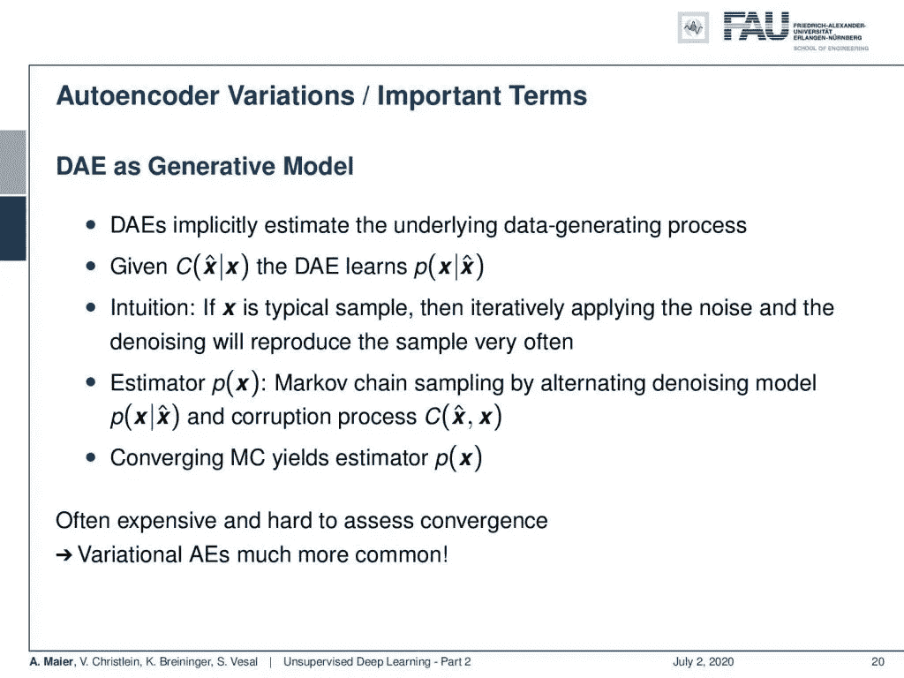

去噪自动编码器也用于图像生成。来自[深度学习讲座](https://www.youtube.com/watch?v=p-_Stl0t3kU&list=PLpOGQvPCDQzvgpD3S0vTy7bJe2pf_yJFj&index=1)的 [CC BY 4.0](https://creativecommons.org/licenses/by/4.0/) 下的图片。

现在，你甚至可以使用去噪自动编码器作为生成模型。这里的想法是，如果你频繁地采样你的腐败模型，你的噪声模型。然后，去噪自动编码器学习相应输入的概率。因此，如果有 **x** 作为典型样本，那么通过迭代应用噪声和去噪将会经常重现该样本。因此，您可以使用马尔可夫链，交替使用去噪模型和腐败过程。这就产生了 p( **x** )的估计量。老实说，这通常很昂贵，并且很难评估收敛性，这就是为什么所谓的变分自动编码器更常见的原因。我们将在几张幻灯片中讨论这些不同的自动编码器。

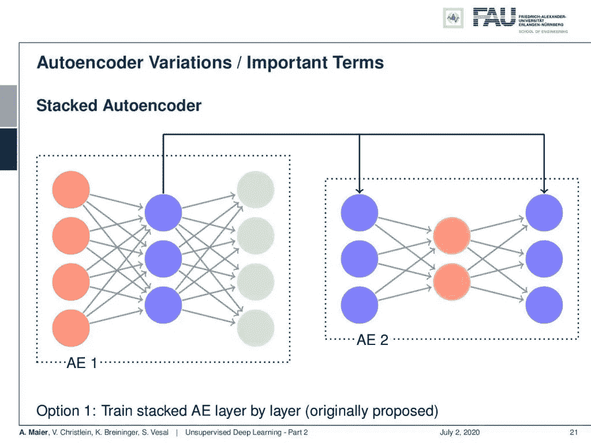

堆叠自动编码器嵌套自动编码器。 [CC 下的图片来自](https://creativecommons.org/licenses/by/4.0/)[深度学习讲座](https://www.youtube.com/watch?v=p-_Stl0t3kU&list=PLpOGQvPCDQzvgpD3S0vTy7bJe2pf_yJFj&index=1)的 4.0 。

我们需要先介绍一些变化。有所谓的堆叠式自动编码器。在堆栈式自动编码器中，实际上是将自动编码器放在自动编码器的内部。这使得我们能够构建真正的深度自动编码器。我们在这个概念中看到了这一点。自动编码器 1 在隐藏层中使用由蓝色节点指示的自动编码器 2。你可以把它们堆叠成一个自动编码器。

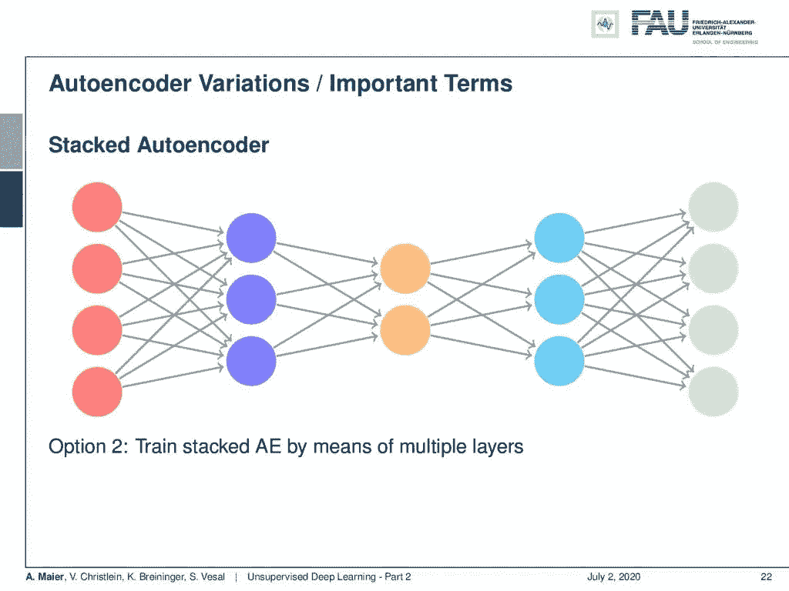

此自动编码器的堆叠版本。 [CC 下的图片来自](https://creativecommons.org/licenses/by/4.0/)[深度学习讲座](https://www.youtube.com/watch?v=p-_Stl0t3kU&list=PLpOGQvPCDQzvgpD3S0vTy7bJe2pf_yJFj&index=1)的 4.0 。

这产生了下面的模型，然后想法是有一个逐渐的维度减少。你可能已经猜到了:这也是卷积和池经常用到的东西。

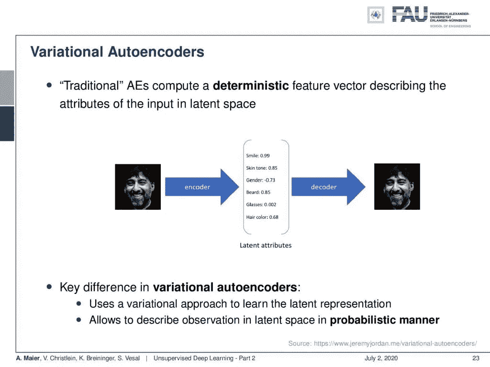

离散空间中的潜在空间阐释。来自[深度学习讲座](https://www.youtube.com/watch?v=p-_Stl0t3kU&list=PLpOGQvPCDQzvgpD3S0vTy7bJe2pf_yJFj&index=1)的 [CC BY 4.0](https://creativecommons.org/licenses/by/4.0/) 下的图片。

现在让我们进入变分自动编码器的概念。这是一个有点不同的概念。在传统的自动编码器中，您试图计算一个确定性的特征向量，该向量描述了某种潜在空间中的输入属性。比方说，你有一个潜在的空间，它描述了不同的特征，例如，一张脸。然后，你可能会说，这个编码器然后把图像投射到一些可能未知的潜在属性上。在这里，我们给他们一些额外的解释。所以对于每一个属性，你都有一个特定的分数，然后根据这个分数，你再次生成原始图像。变分自动编码器的关键区别在于你使用一种变分的方法来学习潜在的表示。它允许你以概率的方式描述潜在空间。

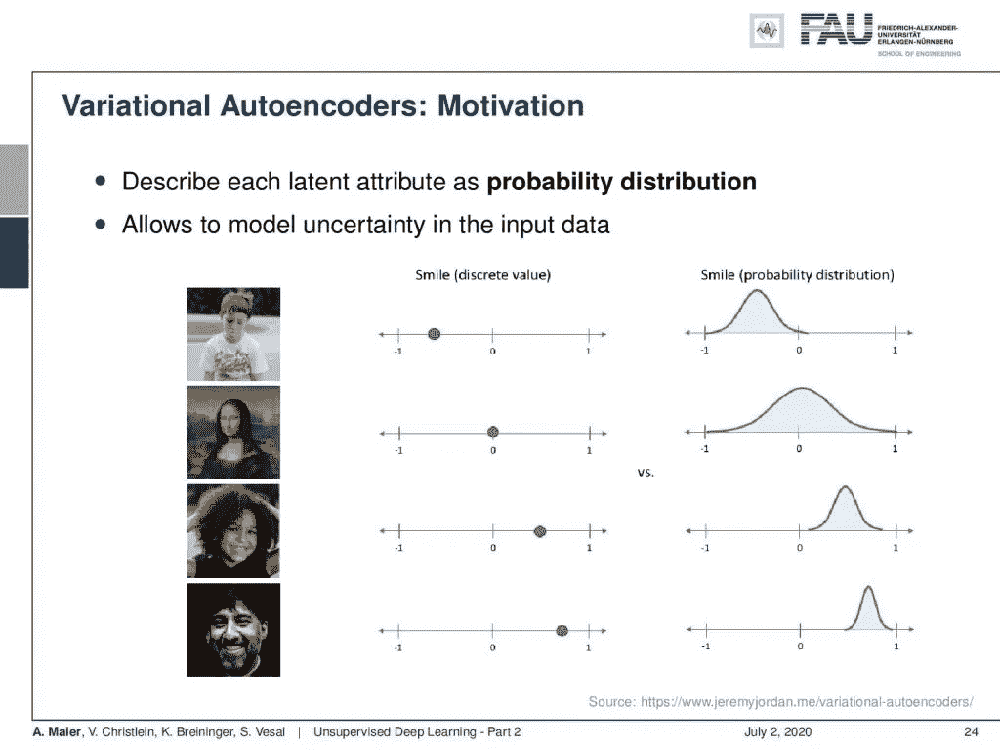

离散与分布建模。 [CC 下的图片来自](https://creativecommons.org/licenses/by/4.0/)[深度学习讲座](https://www.youtube.com/watch?v=p-_Stl0t3kU&list=PLpOGQvPCDQzvgpD3S0vTy7bJe2pf_yJFj&index=1)的 4.0 。

所以这个想法是，它不仅仅是一个简单的每个维度的分类，而是你想要描述每个维度的概率分布。因此，如果我们只有常规的自动编码器，你会在每张图片的左侧看到缩放比例。可变微笑将是一个离散值，您可以选择一个或多或少微笑可用的点。相比之下，变分自动编码器允许您描述属性“微笑”的概率分布。你可以看到第一排没有那么多微笑。第二排是蒙娜丽莎，你不能确定她是否在微笑。人们已经为此争论了几个世纪。你可以看到变分自动编码器能够通过在这个潜在变量上增加一个方差来描述这种不确定性。所以，我们可以看到我们不确定这是不是一个微笑。然后，我们有非常清晰的微笑的例子，然后，当然，分布有一个低得多的标准差。

变分自动编码器使用分布对潜在空间建模。 [CC 下的图片来自](https://creativecommons.org/licenses/by/4.0/)[深度学习讲座](https://www.youtube.com/watch?v=p-_Stl0t3kU&list=PLpOGQvPCDQzvgpD3S0vTy7bJe2pf_yJFj&index=1)的 4.0 。

那么这将如何工作呢？嗯，你有一些编码器，将你的输入映射到潜在属性，然后解码器对这个分布进行采样，以产生最终的输出。所以，这意味着我们有一个概率分布的表示，它加强了一个连续和平滑的潜在空间表示。相似的潜在空间向量应该对应于相似的重建。

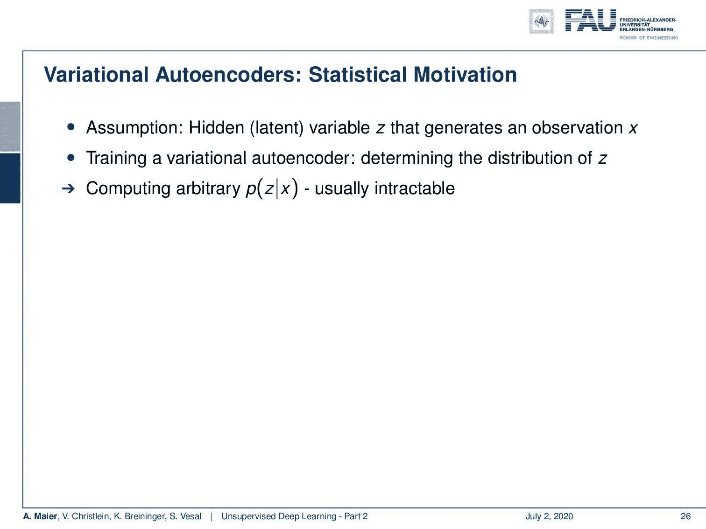

变分自动编码器的统计动机。来自[深度学习讲座](https://www.youtube.com/watch?v=p-_Stl0t3kU&list=PLpOGQvPCDQzvgpD3S0vTy7bJe2pf_yJFj&index=1)的 [CC BY 4.0](https://creativecommons.org/licenses/by/4.0/) 下的图片。

嗯，这里的假设是我们有一些隐藏的潜在变量 **z** 产生一些观察值 **x.** 然后你可以通过确定 **z** 的分布来训练变分自动编码器。那么，问题是这个分布 p( **z** | **x** )的计算通常是很难处理的。所以，我们必须用一个易处理的分布来近似我们的 p( **z** | **x** )。这意味着易处理的分布 q 会导致我们必须确定 q 的参数的问题。例如，您可以为此使用高斯分布。然后，你可以用这个来定义 P( **z** | **x** )和 q( **z** | **x** )之间的 Kullback-Leibler 散度。这相当于最大化 p( **x** | **z** )的对数的期望值减去 q( **z** | **x** )与 p( **z** )的 KL 散度的重构似然。这迫使 q( **z** | **x** )类似于真实的先验分布 p( **z** )。

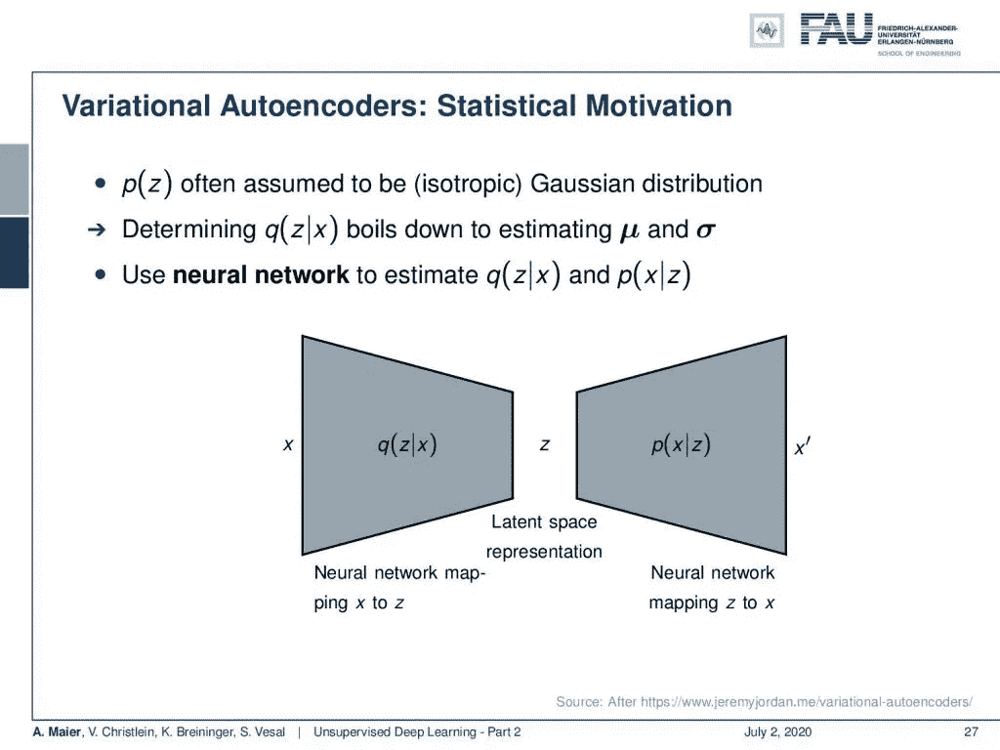

变型自动编码器设计草图。 [CC 下的图片来自](https://creativecommons.org/licenses/by/4.0/)[深度学习讲座](https://www.youtube.com/watch?v=p-_Stl0t3kU&list=PLpOGQvPCDQzvgpD3S0vTy7bJe2pf_yJFj&index=1)的 4.0 。

所以现在，p( **z** )经常被假设为各向同性的高斯分布。现在确定 q( **z** | **x** )归结为估计参数向量 **μ** 和 **σ** 。所以，我们用神经网络来做这件事。谁会想到呢？我们估计我们的 q( **z** | **x** )和 p( **x** | **z** )。所以在这里，你可以看到大致的轮廓。再次，你看到这个自动编码器结构，我们有这个编码器 q( **z** | **x** )产生潜在空间表示，然后我们的 p( **x** | **z** )再次产生我们的输出**x**’。 **x** 应该和 **x** 差不多。

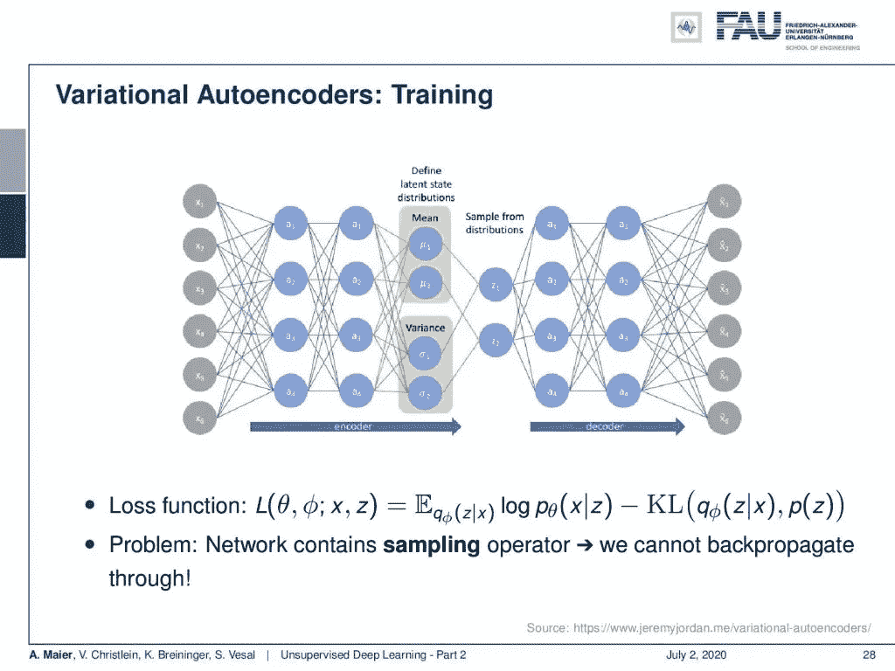

可变自动编码器网络结构综述。 [CC 下的图片来自](https://creativecommons.org/licenses/by/4.0/)[深度学习讲座](https://www.youtube.com/watch?v=p-_Stl0t3kU&list=PLpOGQvPCDQzvgpD3S0vTy7bJe2pf_yJFj&index=1)的 4.0 。

那么，让我们更详细地看看这个。您可以看到，在编码器分支中，我们基本上有一个经典的家用前馈神经网络来降低维度。我们接下来要做的是引入一个关键的变化。这里用浅红色和浅绿色表示。现在这里的关键思想是，在由颜色指示的特定层中，我们改变激活的解释。在这些神经元中，它们本质上只是前馈层，但我们将上面的两个神经元解释为我们潜在分布的平均值，而下面的两个神经元解释为潜在分布的方差。现在，关键问题是，为了进入下一层，我们必须从这些分布中进行采样，以便获得实际观察值并对其进行解码。那么，如何才能做到这一点呢？这里我们有一个问题，因为我们不能通过随机抽样过程反向传播。

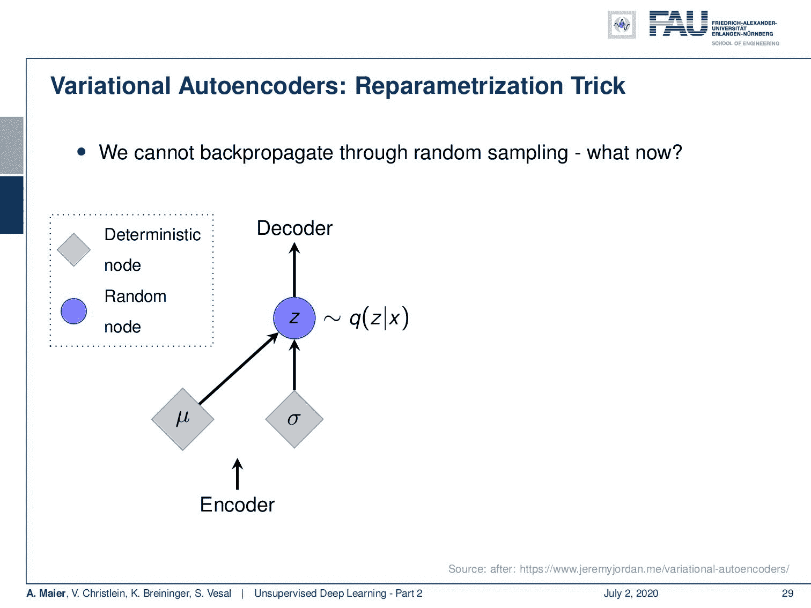

重新参数化的把戏。来自[深度学习讲座](https://www.youtube.com/watch?v=p-_Stl0t3kU&list=PLpOGQvPCDQzvgpD3S0vTy7bJe2pf_yJFj&index=1)的 [CC BY 4.0](https://creativecommons.org/licenses/by/4.0/) 下的图片。

这里的想法是编码器产生均值和方差。然后，我们产生一些 **z** ，这是我们的函数 q( **z** | **x** )的一个采样。这是一个随机节点，随机性的问题是我们不知道如何反向传播这个节点。因此，我们在正向传递中引入的关键元素是我们重新参数化了 **z** 。 **z** 确定为 **μ** 加上 **σ** 乘以某个 **ε** 。 **ε** 是随机信息。现在它源于一个简单连接到 **z 的随机发生器。**例如，你可以选择它是一个均值和单位方差为零的高斯分布。这样，我们就可以反向传播到 **μ** 和 **σ** 中，因为随机节点在右边，我们不需要反向传播到随机节点中。因此，通过这种重新参数化的技巧，我们甚至可以将采样作为一个层引入网络。所以，这是非常令人兴奋的，你已经猜到了。这也很好，因为我们可以利用这个噪声，从这个特定的分布中产生随机样本。因此，我们可以使用自动编码器的右侧来产生新的样本。所有这些在反向传播中都是确定的，你可以用和我们以前一样的方法计算梯度。您可以像以前一样应用反向传播算法。

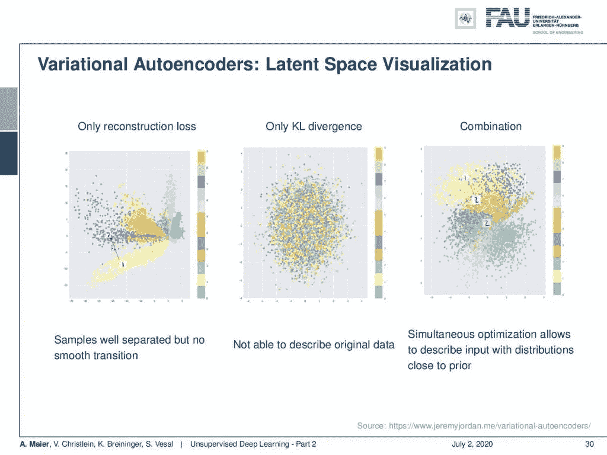

不同潜在空间的比较。 [CC 下的图片来自](https://creativecommons.org/licenses/by/4.0/)[深度学习讲座](https://www.youtube.com/watch?v=p-_Stl0t3kU&list=PLpOGQvPCDQzvgpD3S0vTy7bJe2pf_yJFj&index=1)的 4.0 。

那么这有什么作用呢？在这里，我们有一些潜在的空间可视化。如果仅使用重建损失，可以看到样本分离良好，但没有平滑过渡。显然，如果你只有 KL 散度，那么你就不能描述原始数据。因此，你需要一个组合，同时优化输入分布和各自的 KL 散度。这很酷，因为我们可以从潜在空间的分布中采样，产生新的数据，然后用解码器重建，对角线先验强制独立的潜在变量

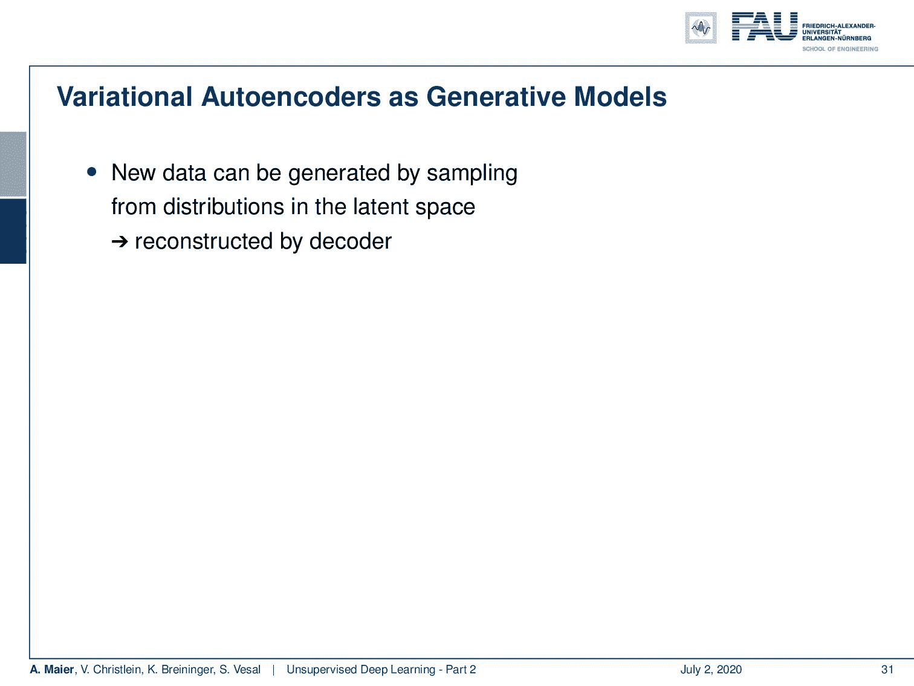

使用变分自动编码器的图像生成。 [CC 下的图片来自](https://creativecommons.org/licenses/by/4.0/)[深度学习讲座](https://www.youtube.com/watch?v=p-_Stl0t3kU&list=PLpOGQvPCDQzvgpD3S0vTy7bJe2pf_yJFj&index=1)的 4.0 。

所以，我们可以编码不同的变异因素。这里，我们有一个例子，我们平滑地改变微笑的程度和头部姿势。你可以看到这种解开实际上是有效的。

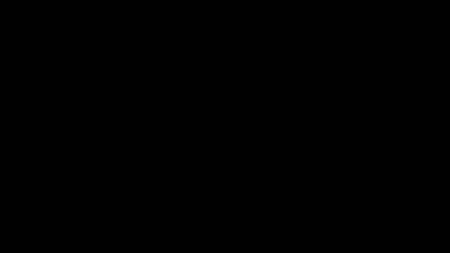

变分自动编码器中的潜在空间探索。使用 [gifify](https://github.com/vvo/gifify) 创建的图像。来源: [YouTube](https://youtu.be/XNZIN7Jh3Sg)

所以，我们总结一下。变分自动编码器是一个概率模型，允许您从一个棘手的密度生成数据。相反，我们能够优化一个变分的下限，这是通过使用重新参数化的反向传播来训练的。

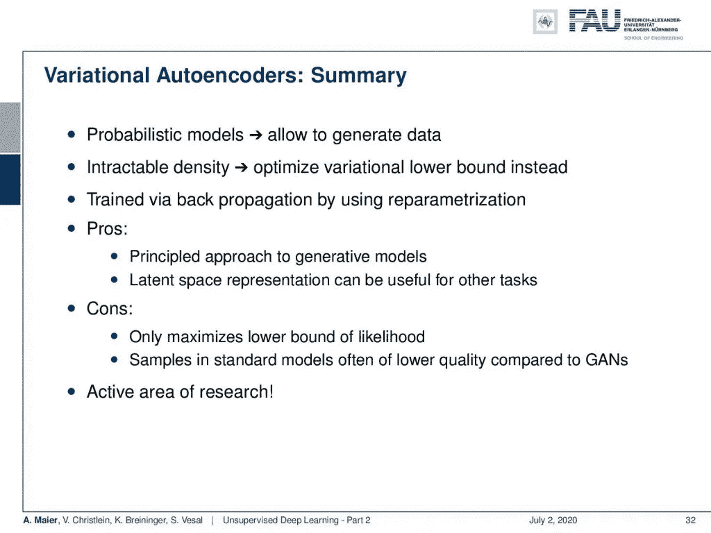

变型自动编码器概述。 [CC 下的图片来自](https://creativecommons.org/licenses/by/4.0/)[深度学习讲座](https://www.youtube.com/watch?v=p-_Stl0t3kU&list=PLpOGQvPCDQzvgpD3S0vTy7bJe2pf_yJFj&index=1)的 4.0 。

优点是我们对生成建模有一个原则性的方法。潜在空间表征对于其他任务可能非常有用，但缺点是这只能最大化可能性的下限。因此，标准模型中的样本通常比生成敌对网络中的样本质量低。这仍然是一个活跃的研究领域。因此，在这个视频中，我给了大家一个非常好的自动编码器总结，重要的技术当然是简单自动编码器、欠完整自动编码器、稀疏自动编码器和堆叠自动编码器。最后，我们一直在研究变分自动编码器，以便能够生成数据，并能够描述我们的潜在变量空间中的概率分布。

在这个深度学习讲座中，更多令人兴奋的事情即将到来。来自[深度学习讲座](https://www.youtube.com/watch?v=p-_Stl0t3kU&list=PLpOGQvPCDQzvgpD3S0vTy7bJe2pf_yJFj&index=1)的 4.0CC 下的图片。

在下一个视频中，我们将看到数据生成是一项非常有趣的任务，我们基本上可以从无人监管的数据中完成。这就是为什么我们要研究生成性对抗网络。您将看到这是一项非常有趣的技术，它已经在许多不同的应用程序中得到广泛使用，以便使用深度神经网络的能力来执行数据生成。所以，我希望你喜欢这个视频。我们讨论了无监督学习的非常重要的点，我认为这些是广泛使用的最先进的技术。所以，如果你喜欢这个视频，请继续关注，期待在下一部中与你见面。谢谢您们。再见！

如果你喜欢这篇文章，你可以在这里找到更多的文章，或者看看我们的讲座。如果你想在未来了解更多的文章、视频和研究，我也会很感激关注 [YouTube](https://www.youtube.com/c/AndreasMaierTV) 、 [Twitter](https://twitter.com/maier_ak) 、[脸书](https://www.facebook.com/andreas.maier.31337)或 [LinkedIn](https://www.linkedin.com/in/andreas-maier-a6870b1a6/) 。本文以 [Creative Commons 4.0 归属许可](https://creativecommons.org/licenses/by/4.0/deed.de)发布，如果引用，可以转载和修改。如果你有兴趣从视频讲座中获得文字记录，试试[自动博客](http://autoblog.tf.fau.de/)。

# 链接

[链接](http://dpkingma.com/wordpress/wp-content/%20uploads/2015/12/talk_nips_workshop_2015.pdf) —变型自动编码器:
[链接](https://www.youtube.com/watch?v=AJVyzd0rqdc)—NIPS 2016 good fellow 的 GAN 教程
[链接](https://github.com/soumith/ganhacks) —如何训练一个 GAN？让 GANs 发挥作用的技巧和诀窍(小心，而不是
一切都是真的了！)
[链接](https://github.com/hindupuravinash/the-gan-zoo)——有没有想过怎么给自己的甘起名？

# 参考

[1]陈曦，陈曦，闫端，等.“InfoGAN:基于信息最大化生成对抗网的可解释表征学习”.神经信息处理系统进展 29。柯伦咨询公司，2016 年，第 2172-2180 页。
[2] Pascal Vincent，Hugo Larochelle，Isabelle Lajoie 等，“堆叠去噪自动编码器:用局部去噪标准学习深度网络中的有用表示”。《机器学习研究杂志》第 11 期。2010 年 12 月，第 3371-3408 页。
[3] Emily L. Denton，Soumith Chintala，Arthur Szlam 等，“使用拉普拉斯金字塔对抗网络的深度生成图像模型”。载于:CoRR abs/1506.05751 (2015 年)。arXiv: 1506.05751。
[4]理查德·杜达、彼得·e·哈特和大卫·g·斯托克。模式分类。第二版。纽约:Wiley-Interscience，2000 年 11 月。
[5]阿斯嘉菲舍尔和克里斯蒂安伊格尔。“训练受限制的玻尔兹曼机器:介绍”。载于:模式识别 47.1 (2014)，第 25–39 页。
[6]约翰·高迪尔。用于人脸生成的条件生成对抗网络。2015 年 3 月 17 日。网址:[http://www.foldl.me/2015/conditional-gans-face-generation/](http://www.foldl.me/2015/conditional-gans-face-generation/)(2018 年 1 月 22 日访问)。
【7】伊恩·古德菲勒。NIPS 2016 教程:生成性对抗网络。2016.eprint: arXiv:1701.00160。
【8】Martin HEU sel，Hubert Ramsauer，Thomas Unterthiner 等，“通过双时标更新规则训练的 GANs 收敛到局部纳什均衡”。神经信息处理系统进展 30。柯伦联合公司，2017 年，第 6626–6637 页。[9]杰弗里·E·辛顿和鲁斯兰·R·萨拉胡季诺夫。"用神经网络降低数据的维数."刊登在:科学 313.5786(2006 年 7 月)，第 504–507 页。arXiv: 20。
【10】杰弗里·e·辛顿。“训练受限玻尔兹曼机器的实用指南”。神经网络:交易技巧:第二版。柏林，海德堡:施普林格柏林海德堡，2012 年，第 599-619 页。
[11]菲利普·伊索拉，，周廷辉等，“条件对立网络下的意象翻译”。在:(2016 年)。eprint: arXiv:1611.07004。
[12]迪耶德里克·P·金马和马克斯·韦林。“自动编码变分贝叶斯”。载于:arXiv 电子版，arXiv:1312.6114(2013 年 12 月)，arXiv:1312.6114。arXiv:1312.6114[统计。ML】。
[13] Jonathan Masci、Ueli Meier、Dan Ciresan 等人，“用于分层特征提取的堆叠卷积自动编码器”。载于:人工神经网络和机器学习— ICANN 2011。柏林，海德堡:施普林格柏林海德堡，2011 年，第 52-59 页。
[14]卢克·梅茨、本·普尔、大卫·普法乌等人，《展开的生成性敌对网络》。国际学习代表会议。2017 年 4 月。eprint: arXiv:1611.02163。
[15]迈赫迪米尔扎和西蒙奥辛德罗。“条件生成对抗网”。载于:CoRR abs/1411.1784 (2014 年)。arXiv: 1411.1784。
[16]亚历克·拉德福德、卢克·梅斯和索史密斯·钦塔拉。深度卷积生成对抗的无监督表示学习 2015。eprint: arXiv:1511.06434。
[17] Tim Salimans，Ian Goodfellow，Wojciech Zaremba 等，“训练 GANs 的改进技术”。神经信息处理系统进展 29。柯伦咨询公司，2016 年，第 2234–2242 页。
【18】吴恩达。“CS294A 课堂笔记”。2011 年。
【19】张寒、徐涛、李洪生等，“StackGAN:利用堆叠生成式对抗网络进行文本到照片级真实感图像合成”。载于:CoRR abs/1612.03242 (2016 年)。arXiv: 1612.03242。
【20】张寒、徐涛、李洪生等，“Stackgan:利用堆叠生成式对抗网络进行文本到照片级真实感图像合成”。载于:arXiv 预印本 arXiv:1612.03242 (2016)。
【21】周，Aditya Khosla，Agata Lapedriza 等，“学习深度特征用于鉴别性定位”。In: 2016 年 IEEE 计算机视觉与模式识别大会(CVPR)。拉斯维加斯，2016 年 6 月，第 2921–2929 页。arXiv: 1512.04150。
[22]朱俊彦，朴泰成，菲利普·伊索拉等，“利用循环一致的对立网络进行不成对的图像到图像的翻译”。载于:CoRR abs/1703.10593 (2017 年)。arXiv: 1703.10593。