# 无监督学习—第三部分

> 原文：<https://towardsdatascience.com/unsupervised-learning-part-3-7b15038bb884?source=collection_archive---------28----------------------->

## [FAU 讲座笔记](https://towardsdatascience.com/tagged/fau-lecture-notes)关于深度学习

## 生成性对抗网络——基础

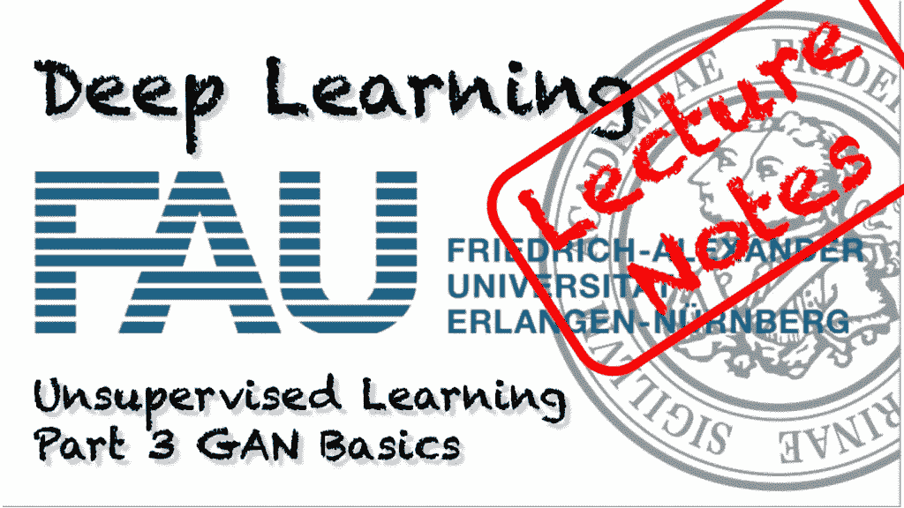

FAU 大学的深度学习。下图 [CC BY 4.0](https://creativecommons.org/licenses/by/4.0/) 来自[深度学习讲座](https://www.youtube.com/watch?v=p-_Stl0t3kU&list=PLpOGQvPCDQzvgpD3S0vTy7bJe2pf_yJFj&index=1)

**这些是 FAU 的 YouTube 讲座** [**深度学习**](https://www.youtube.com/watch?v=p-_Stl0t3kU&list=PLpOGQvPCDQzvgpD3S0vTy7bJe2pf_yJFj&index=1) **的讲义。这是讲座视频&配套幻灯片的完整抄本。我们希望，你喜欢这个视频一样多。当然，这份抄本是用深度学习技术在很大程度上自动创建的，只进行了少量的手动修改。** [**自己试试吧！如果您发现错误，请告诉我们！**](http://autoblog.tf.fau.de/)

# 航行

[**上一讲**](/unsupervised-learning-part-2-b1c130b8815d) **/** [**观看本视频**](https://youtu.be/fXO1fOXnOTI) **/** [**顶级**](/all-you-want-to-know-about-deep-learning-8d68dcffc258)/[**下一讲**](/unsupervised-learning-part-4-eeb4d3ab601)

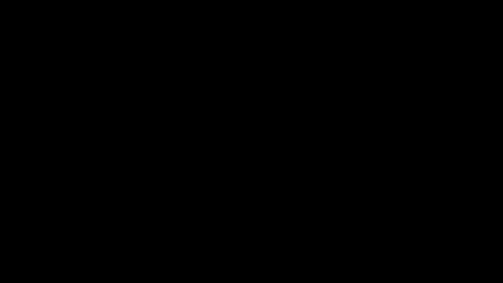

一个常见的 AI 误区是甘主要是用来拜猫的。使用 [gifify](https://github.com/vvo/gifify) 创建的图像。来源: [YouTube](https://youtu.be/AnlUiFMD5lw)

欢迎回到深度学习！所以今天，我们最终想要研究生成对抗网络，这是无监督深度学习中的一项关键技术。让我们看看我为你准备了什么。

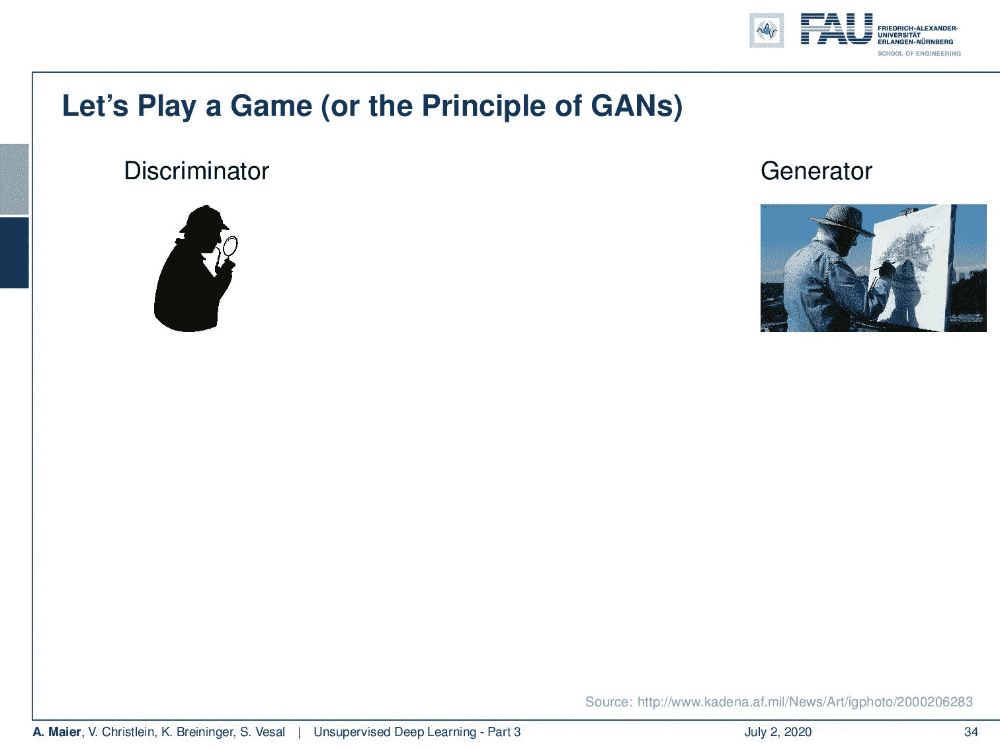

甘斯的概念。 [CC 下的图片来自](https://creativecommons.org/licenses/by/4.0/)[深度学习讲座](https://www.youtube.com/watch?v=p-_Stl0t3kU&list=PLpOGQvPCDQzvgpD3S0vTy7bJe2pf_yJFj&index=1)的 4.0 。

嗯，无监督深度学习部分生成对抗网络来自于 GANs 玩下面这个游戏的关键思想:你有一个生成器和一个鉴别器。有人可能会说，发生器是一个制造假图像的人。然后，辨别必须弄清楚生成器实际上生产的是真的还是假的。因此，鉴别者可以决定真假，为了训练鉴别者，他可以访问许多真实的数据观察。因此，鉴别器的结果是输入是真的还是假的。当然，这很难要求个人和艺术家去画东西。因此，我们用深度神经网络代替工具，D 是鉴别器，G 是生成器。发生器接收一些潜在的输入一些噪声变量 **z** 并从噪声变量和参数中产生一些图像。然后鉴别者试图判断这是真的还是假的图像。因此，鉴频器的输出将为 1 表示真实，0 表示虚假。

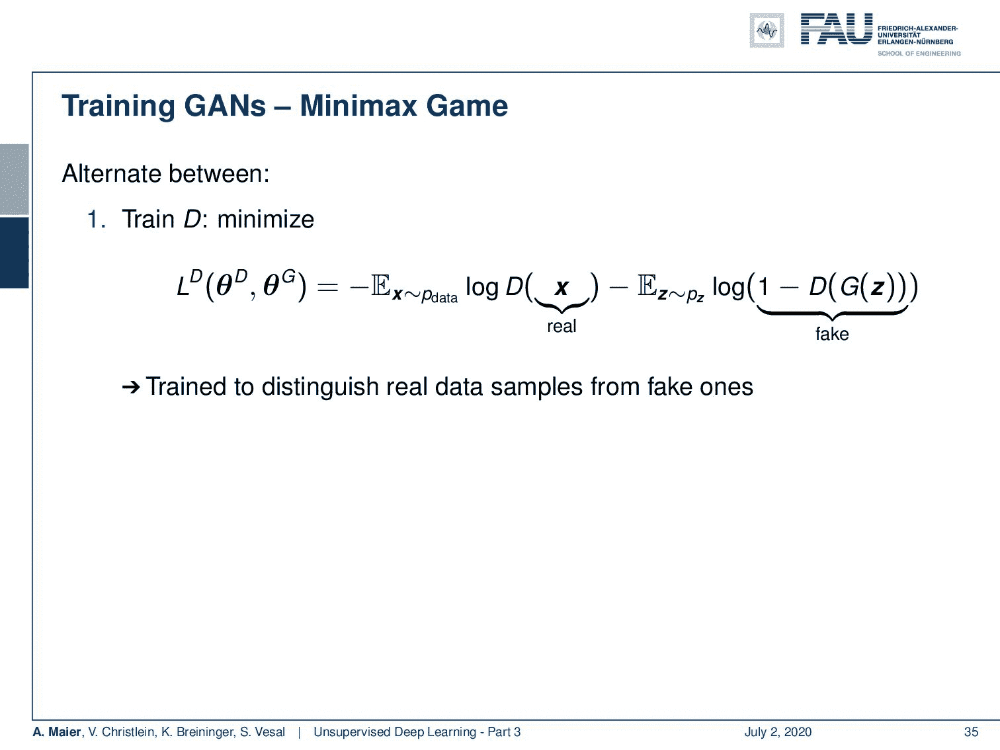

甘的损失。来自[深度学习讲座](https://www.youtube.com/watch?v=p-_Stl0t3kU&list=PLpOGQvPCDQzvgpD3S0vTy7bJe2pf_yJFj&index=1)的 [CC BY 4.0](https://creativecommons.org/licenses/by/4.0/) 下的图片。

一旦我们找到了这种神经网络表示，我们也能够描述损失。我们的鉴别器的损失是最小化以下函数，该函数取决于鉴别器的参数和发生器的参数。本质上是将数据中的预期值 **x** 最小化。这只是我们的鉴频器输出的对数减去一些产生的噪声的期望值，也就是 1 的对数减去一些噪声发生器的鉴频器。所以，它被训练来区分真实数据样本和虚假数据样本。现在，如果你想训练发电机，你要使发电机的损耗最小，即鉴频器的负损耗。因此，生成器将鉴别器正确的概率降至最低。你训练生成域图像来愚弄 d。可选地，你可以为一个玩家的每一步运行另一个玩家的 k 步，并且均衡是鉴别器损失的鞍点。

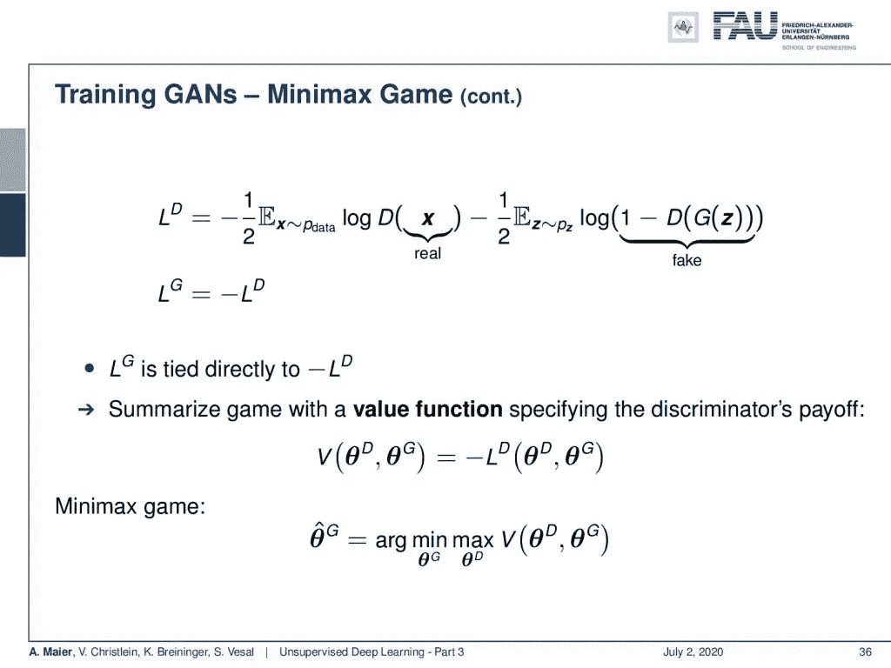

GANs 把他们的最优化表述为一个极大极小游戏。 [CC 下的图片来自](https://creativecommons.org/licenses/by/4.0/)[深度学习讲座](https://www.youtube.com/watch?v=p-_Stl0t3kU&list=PLpOGQvPCDQzvgpD3S0vTy7bJe2pf_yJFj&index=1)的 4.0 。

如果你更仔细地观察，你会发现发电机的损耗与鉴频器的负损耗直接相关。所以，你可以用一个价值函数来总结这个博弈，这个价值函数指定了鉴别者的收益，即 V，这是鉴别者的负损失，这就导致了下面的极大极小博弈:所以，可以通过将鉴别者的 V 最大化来确定发生器的最优参数集，这个最优参数集被嵌套到 G 的参数的极小化中。

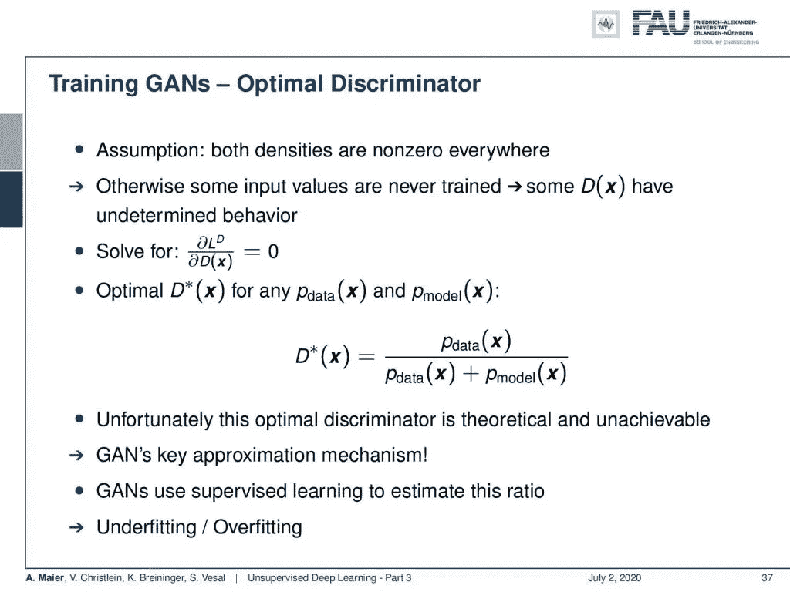

最佳鉴别器可以作为模型和数据的比率找到。 [CC 下的图片来自](https://creativecommons.org/licenses/by/4.0/)[深度学习讲座](https://www.youtube.com/watch?v=p-_Stl0t3kU&list=PLpOGQvPCDQzvgpD3S0vTy7bJe2pf_yJFj&index=1)的 4.0 。

那么，让我们来看看最佳鉴别器。这里有一个关键的假设，即两个密度在任何地方都不为零。否则，一些输入值将永远不会被训练，并且鉴别器将在这些区域中具有不确定的行为。然后求解鉴频器损耗梯度，鉴频器损耗梯度为零。您可以通过以下方式找到任何数据分布和任何模型分布的最佳鉴别器:最佳鉴别器是数据分布除以数据分布加上模型在您的整个输入域 **x** 上的分布。不幸的是，这种最佳的鉴别是理论上的，是无法实现的。因此，对于 GANs 来说，拥有一个评估机制是非常关键的。你可以用监督学习来估计这个比例。那么这就导致了欠拟合和过拟合的问题。

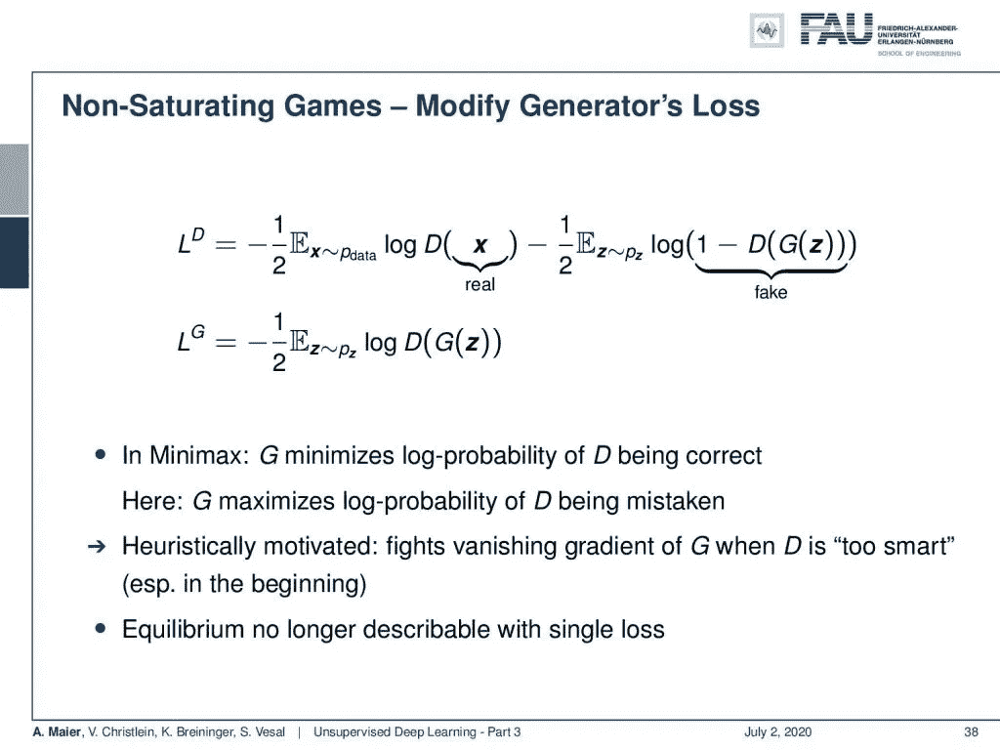

这个修正的损失是不饱和的。来自[深度学习讲座](https://www.youtube.com/watch?v=p-_Stl0t3kU&list=PLpOGQvPCDQzvgpD3S0vTy7bJe2pf_yJFj&index=1)的 4.0CC 下的图片。

现在，我们还能做什么？我们可以做非饱和博弈，修改发电机的损耗。然后，在这个例子中，我们不再对两者使用相同的函数。相反，我们有一个新的发生器损耗，在给定一些输入噪声的情况下，我们只需计算发生器鉴频器对数的期望值。在 minimax 中，G 最小化 D 正确的对数概率。在这个解中，G 最小化了 D 出错的对数概率。它是启发式的，因为当 D 太聪明时，它会对抗 G 的消失梯度。这在开始时尤其是个问题。然而，这种平衡不再能用单一损失来描述。

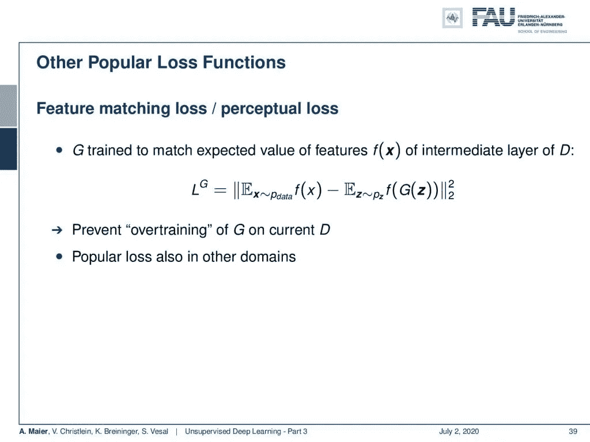

GAN 损耗的其他变体。 [CC 下的图片来自](https://creativecommons.org/licenses/by/4.0/)[深度学习讲座](https://www.youtube.com/watch?v=p-_Stl0t3kU&list=PLpOGQvPCDQzvgpD3S0vTy7bJe2pf_yJFj&index=1)的 4.0 。

因此，有很多像扩展这样的东西非常受欢迎，比如特征匹配损失或感知损失。这里，G 试图匹配 d 的某个中间层的特征 f( **x** )的期望值。您已经看到，f 可以是某个其他网络和某个第 3 层或第 5 层表示。然后，对于真实输入和生成的噪声图像，您希望这些表示的期望值相同。所以，这里你要防止发生器对电流鉴频器的过度训练。顺便说一句，这也是许多其他领域的常见损失。

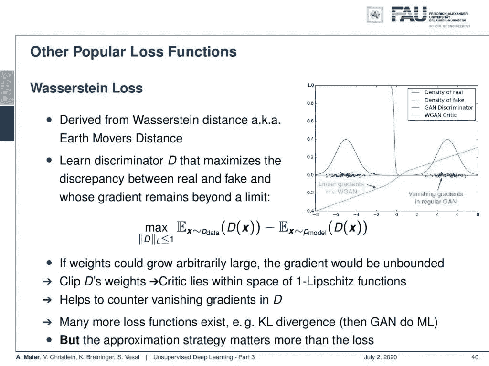

沃瑟斯坦的损失。来自[深度学习讲座](https://www.youtube.com/watch?v=p-_Stl0t3kU&list=PLpOGQvPCDQzvgpD3S0vTy7bJe2pf_yJFj&index=1)的 4.0CC 下的图片。

还能做什么？嗯，有所谓的瓦瑟斯坦损失。这是从瓦瑟斯坦距离推导出来的，也就是众所周知的推土机距离。在这里，您将学习一个鉴别器，它可以最大化真假样本之间的差异，同时，您可以限制梯度，使其保持在某个限制之后。所以，你实际上是把梯度限制在一个特定的 Lipschitz 常数上，它是梯度的最大斜率。这里，在右侧的图像中，您可以看到，在快速饱和的红色鉴别曲线之外，您可以创建一个具有非饱和损耗的鉴别器。这样，即使在已经被鉴别器饱和的区域，你也总能找到好的渐变。同样，这有助于抵消鉴别器中的消失梯度。更多的损失函数存在，如 KL 散度。然后，甘实际上做最大似然，但近似策略比损失重要得多。

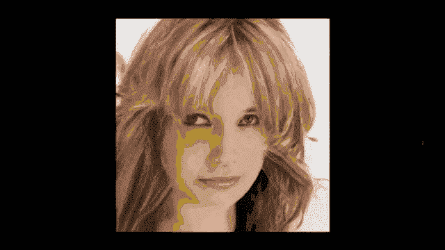

使用 GANS 可以非常好地生成人脸。使用 [gifify](https://github.com/vvo/gifify) 创建的图像。来源: [YouTube](https://youtu.be/djsEKYuiRFE)

那么，我们如何评价甘斯呢？当然，我们可以看着图像说:“是的，它们看起来很逼真！还是没有？”但是这对于大型数据集来说有点棘手。所以，你必须为图像打分。一个想法是初始得分。

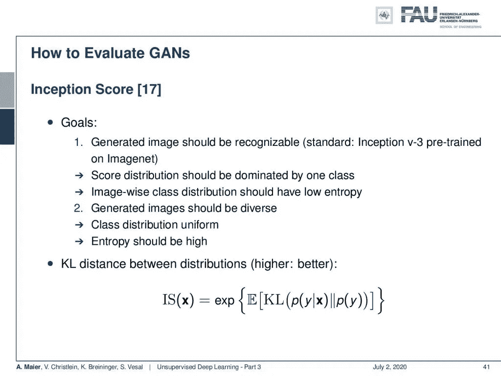

使用初始分数评估 GANs。 [CC 下的图片来自](https://creativecommons.org/licenses/by/4.0/)[深度学习讲座](https://www.youtube.com/watch?v=p-_Stl0t3kU&list=PLpOGQvPCDQzvgpD3S0vTy7bJe2pf_yJFj&index=1)的 4.0 。

初始分数基于两个目标。一个目标是生成的图像应该是可识别的。因此，例如，您使用 ImageNet 上的 Inception v3 预训练网络，并且您希望分数分布由一个类支配。基于图像的类别分布应该具有低熵。同时，您希望生成的图像是多样的。所以总体的阶级分布应该或多或少是均匀的。熵应该很高。因此，您可以将这个初始得分表示为 p(y| **x** )和 p(y)之间的 KL 偏差的期望值的 e 次方。

弗雷歇盗梦空间评分。来自[深度学习讲座](https://www.youtube.com/watch?v=p-_Stl0t3kU&list=PLpOGQvPCDQzvgpD3S0vTy7bJe2pf_yJFj&index=1)的 4.0CC 下的图片。

另一种测量是使用中间层的弗雷歇起始距离。例如，Inception v3 的最后一个池层是在 ImageNet 上预训练的。然后，通过多元高斯分布对数据分布进行建模。真实图像 **x** 和生成图像 **g** 之间的 FID 分数可以表示为 l2 范数下的 **x** 和 **g** 的平均值之差加上 **x** 和 **g** 的协方差矩阵的迹减去协方差矩阵 **x** 乘以协方差矩阵 **g** 的平方根的两倍。这比初始得分更健壮。我们不需要阶级概念。在这种情况下，我们可以简单地对多元高斯分布进行建模。

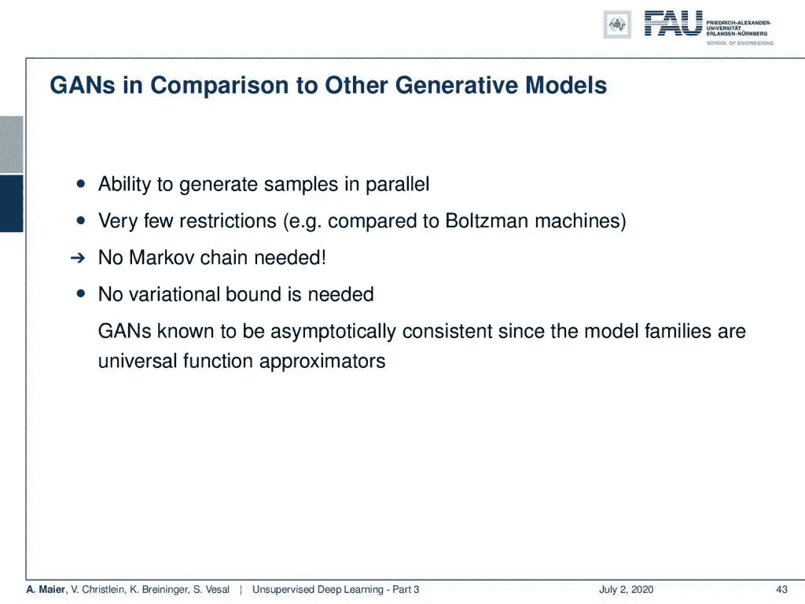

GANs 的优点。 [CC 下的图片来自](https://creativecommons.org/licenses/by/4.0/)[深度学习讲座](https://www.youtube.com/watch?v=p-_Stl0t3kU&list=PLpOGQvPCDQzvgpD3S0vTy7bJe2pf_yJFj&index=1)的 4.0 。

GANs 的一大优势是它们能够并行生成样本。限制很少。例如，与有大量限制的玻尔兹曼机器相比:在这个模型中你不需要马尔可夫链。也不需要变分界限。已知 gan 是渐近一致的，因为模型族是通用函数逼近器。这是对甘斯的第一次介绍。

在这个深度学习讲座中，更多令人兴奋的事情即将到来。 [CC 下的图片来自](https://creativecommons.org/licenses/by/4.0/)[深度学习讲座](https://www.youtube.com/watch?v=p-_Stl0t3kU&list=PLpOGQvPCDQzvgpD3S0vTy7bJe2pf_yJFj&index=1)的 4.0 。

在下一个视频中，我们想谈谈更高级的 GAN 概念，如条件 GAN，我们也可以在生成过程中开始并模拟约束和条件。人们还研究了一种非常酷的技术，称为循环 GAN，它允许不成对的域翻译。所以，你可以从白天到晚上翻译图像。你甚至可以把马翻译成斑马，斑马翻译成马。一个非常非常酷的技术即将出现。我希望你喜欢这个视频，我期待着在下一个视频中见到你。非常感谢！

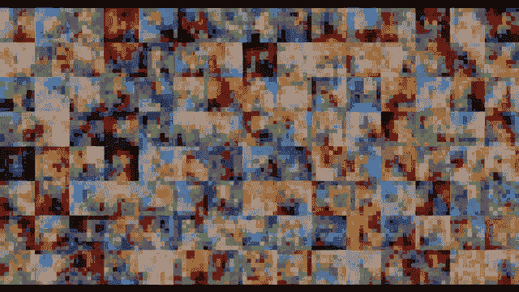

辛普森甘创造你最喜爱的卡通人物。使用 [gifify](https://github.com/vvo/gifify) 创建的图像。来源: [YouTube](https://youtu.be/csLj6KxCBdE)

如果你喜欢这篇文章，你可以在这里找到更多的文章，或者看看我们的讲座。如果你想在未来了解更多的文章、视频和研究，我也会很感激关注 [YouTube](https://www.youtube.com/c/AndreasMaierTV) 、 [Twitter](https://twitter.com/maier_ak) 、[脸书](https://www.facebook.com/andreas.maier.31337)或 [LinkedIn](https://www.linkedin.com/in/andreas-maier-a6870b1a6/) 。本文以 [Creative Commons 4.0 归属许可](https://creativecommons.org/licenses/by/4.0/deed.de)发布，如果引用，可以转载和修改。如果你有兴趣从视频讲座中获得文字记录，试试[自动博客](http://autoblog.tf.fau.de/)。

# 链接

[链接](http://dpkingma.com/wordpress/wp-content/%20uploads/2015/12/talk_nips_workshop_2015.pdf) —变分自动编码器:
[链接](https://www.youtube.com/watch?v=AJVyzd0rqdc)—NIPS 2016 good fellow 的 GAN 教程
[链接](https://github.com/soumith/ganhacks) —如何训练一个 GAN？让 GANs 发挥作用的技巧和诀窍(小心，而不是
一切都是真的了！)
[链接](https://github.com/hindupuravinash/the-gan-zoo)——有没有想过怎么给自己的甘起名？

# 参考

[1]陈曦，陈曦，闫端，等.“InfoGAN:基于信息最大化生成对抗网的可解释表征学习”.神经信息处理系统进展 29。柯伦咨询公司，2016 年，第 2172-2180 页。
[2] Pascal Vincent，Hugo Larochelle，Isabelle Lajoie 等，“堆叠去噪自动编码器:用局部去噪标准学习深度网络中的有用表示”。《机器学习研究杂志》第 11 期。2010 年 12 月，第 3371-3408 页。
[3] Emily L. Denton，Soumith Chintala，Arthur Szlam 等，“使用拉普拉斯金字塔对抗网络的深度生成图像模型”。载于:CoRR abs/1506.05751 (2015 年)。arXiv: 1506.05751。
[4]理查德·杜达、彼得·e·哈特和大卫·g·斯托克。模式分类。第二版。纽约:Wiley-Interscience，2000 年 11 月。
[5]阿斯嘉菲舍尔和克里斯蒂安伊格尔。“训练受限制的玻尔兹曼机器:介绍”。载于:模式识别 47.1 (2014)，第 25–39 页。
[6]约翰·高迪尔。用于人脸生成的条件生成对抗网络。2015 年 3 月 17 日。网址:[http://www.foldl.me/2015/conditional-gans-face-generation/](http://www.foldl.me/2015/conditional-gans-face-generation/)(2018 年 1 月 22 日访问)。
【7】伊恩·古德菲勒。NIPS 2016 教程:生成性对抗网络。2016.eprint: arXiv:1701.00160。
【8】Martin HEU sel，Hubert Ramsauer，Thomas Unterthiner 等，“通过双时标更新规则训练的 GANs 收敛到局部纳什均衡”。神经信息处理系统进展 30。柯伦联合公司，2017 年，第 6626–6637 页。[9]杰弗里·E·辛顿和鲁斯兰·R·萨拉胡季诺夫。"用神经网络降低数据的维数."刊登在:科学 313.5786(2006 年 7 月)，第 504–507 页。arXiv: 20。
【10】杰弗里·e·辛顿。“训练受限玻尔兹曼机器的实用指南”。神经网络:交易技巧:第二版。柏林，海德堡:施普林格柏林海德堡，2012 年，第 599-619 页。
[11]菲利普·伊索拉，，周廷辉等，“条件对立网络下的意象翻译”。在:(2016 年)。eprint: arXiv:1611.07004。
[12]迪耶德里克·P·金马和马克斯·韦林。“自动编码变分贝叶斯”。载于:arXiv 电子版，arXiv:1312.6114(2013 年 12 月)，arXiv:1312.6114。arXiv:1312.6114[统计。ML】。
[13] Jonathan Masci、Ueli Meier、Dan Ciresan 等人，“用于分层特征提取的堆叠卷积自动编码器”。载于:人工神经网络和机器学习— ICANN 2011。柏林，海德堡:施普林格柏林海德堡，2011 年，第 52-59 页。
[14]卢克·梅茨、本·普尔、大卫·普法乌等人，《展开的生成性敌对网络》。国际学习代表会议。2017 年 4 月。eprint: arXiv:1611.02163。
[15]迈赫迪米尔扎和西蒙奥辛德罗。“条件生成对抗网”。载于:CoRR abs/1411.1784 (2014 年)。arXiv: 1411.1784。
[16]亚历克·拉德福德、卢克·梅斯和索史密斯·钦塔拉。深度卷积生成对抗的无监督表示学习 2015。eprint: arXiv:1511.06434。
[17] Tim Salimans，Ian Goodfellow，Wojciech Zaremba 等，“训练 GANs 的改进技术”。神经信息处理系统进展 29。柯伦咨询公司，2016 年，第 2234–2242 页。
【18】吴恩达。“CS294A 课堂笔记”。2011 年。
【19】张寒、徐涛、李洪生等，“StackGAN:利用堆叠生成式对抗网络进行文本到照片级真实感图像合成”。载于:CoRR abs/1612.03242 (2016 年)。arXiv: 1612.03242。
【20】张寒、徐涛、李洪生等，“Stackgan:利用堆叠生成式对抗网络进行文本到照片级真实感图像合成”。载于:arXiv 预印本 arXiv:1612.03242 (2016)。
【21】周，Aditya Khosla，Agata Lapedriza 等，“学习深度特征用于鉴别性定位”。In: 2016 年 IEEE 计算机视觉与模式识别大会(CVPR)。拉斯维加斯，2016 年 6 月，第 2921–2929 页。arXiv: 1512.04150。
[22]朱俊彦，朴泰成，菲利普·伊索拉等，“利用循环一致的对立网络进行不成对的图像到图像的翻译”。载于:CoRR abs/1703.10593 (2017 年)。arXiv: 1703.10593。