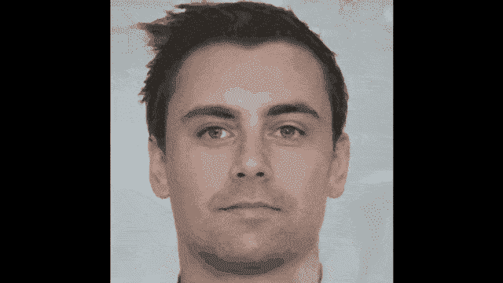

# 无监督学习—第 4 部分

> 原文：<https://towardsdatascience.com/unsupervised-learning-part-4-eeb4d3ab601?source=collection_archive---------24----------------------->

## [FAU 讲座笔记](https://towardsdatascience.com/tagged/fau-lecture-notes)关于深度学习

## 条件和周期甘斯

FAU 大学的深度学习。下图 [CC BY 4.0](https://creativecommons.org/licenses/by/4.0/) 来自[深度学习讲座](https://www.youtube.com/watch?v=p-_Stl0t3kU&list=PLpOGQvPCDQzvgpD3S0vTy7bJe2pf_yJFj&index=1)

**这些是 FAU 的 YouTube 讲座** [**深度学习**](https://www.youtube.com/watch?v=p-_Stl0t3kU&list=PLpOGQvPCDQzvgpD3S0vTy7bJe2pf_yJFj&index=1) **的讲义。这是讲座视频&配套幻灯片的完整抄本。我们希望，你喜欢这个视频一样多。当然，这份抄本是用深度学习技术在很大程度上自动创建的，只进行了少量的手动修改。** [**自己试试吧！如果您发现错误，请告诉我们！**](http://autoblog.tf.fau.de/)

# 航行

[**上一讲**](/unsupervised-learning-part-3-7b15038bb884) **/** [**观看本视频**](https://youtu.be/K27a_doRoxw) **/** [**顶级**](/all-you-want-to-know-about-deep-learning-8d68dcffc258) **/** [**下一讲**](/unsupervised-learning-part-5-f8809d7f1f90)

需要你新专辑的封面吗？我能帮助你。使用 [gifify](https://github.com/vvo/gifify) 创建的图像。来源: [YouTube](https://youtu.be/RtPGIuAZpAo)

欢迎回到深度学习！今天我们想讨论一些更高级的 GAN 概念，特别是条件 GAN 和循环 GAN。

条件 gan 允许控制与某个变量相关的输出。 [CC 下的图片来自](https://creativecommons.org/licenses/by/4.0/)[深度学习讲座](https://www.youtube.com/watch?v=p-_Stl0t3kU&list=PLpOGQvPCDQzvgpD3S0vTy7bJe2pf_yJFj&index=1)的 4.0 。

让我们来看看我幻灯片上的内容。这是我们无监督深度学习讲座的第四部分。首先，我们从条件句开始。到目前为止，我们遇到的一个问题是，生成器创建了一个假的通用图像。不幸的是，它不是针对某个条件或特征的。所以让我们说，如果你有文本到图像的生成，那么，当然，图像应该依赖于文本。因此，您需要能够以某种方式对依赖性进行建模。如果你想生成 0，那就不要生成 1。所以，你需要放入一些条件，你是否想要产生数字 0，1，2，3，等等。这可以通过[15]中介绍的编码条件来实现。

使用调节向量来控制 GAN。 [CC 下的图片来自](https://creativecommons.org/licenses/by/4.0/)[深度学习讲座](https://www.youtube.com/watch?v=p-_Stl0t3kU&list=PLpOGQvPCDQzvgpD3S0vTy7bJe2pf_yJFj&index=1)的 4.0 。

这里的想法是，你本质上把你的潜在向量，分成了本质上有观察的集合。然后，你还有条件，它被编码在条件向量 **y** 中。你把两者连接起来，用它们来产生某种东西。此外，鉴别器然后获得生成的图像，但是它也获得对条件向量 **y** 的访问。因此，它知道应该看到什么，以及生成器的具体输出。所以，他们两个都接受了条件，这实质上又导致了一个两人的极小极大博弈，这个博弈又可以被描述为一个依赖于鉴别者的损失。这里的延伸是，你另外有损失中的 **y** 的条件。

现在，我们可以控制面部表情。 [CC 下的图片来自](https://creativecommons.org/licenses/by/4.0/)[深度学习讲座](https://www.youtube.com/watch?v=p-_Stl0t3kU&list=PLpOGQvPCDQzvgpD3S0vTy7bJe2pf_yJFj&index=1)的 4.0 。

那么这个东西是怎么工作的呢？您添加了一个条件特征，如微笑、性别、年龄或图像的其他属性。然后，发生器和鉴别器学习在这些模式下操作。这就产生了一个属性，你可以生成一个具有某种属性的面。鉴别器知道这是给定特定属性的脸。所以，在这里，你可以看到不同的生成人脸的例子。第一行是随机样本。第二行是老年人的财产。第三行给出的条件是老年加上微笑，这里你可以看到条件向量仍然能够产生类似的图像，但你实际上可以在上面添加这些条件。

因年老而变得健康的甘人。使用 [gifify](https://github.com/vvo/gifify) 创建的图像。来源: [YouTube](https://youtu.be/x3pdf9S60zo)

因此，这允许创建真正非常好的东西，如图像到图像的翻译。下面，你有几个输入和输出的例子。基本上，您可以为街道场景创建标签，可以为地图生成航拍图像，可以为立面生成标签，或者为彩色、白天和夜晚以及照片的边缘生成标签。

条件甘的应用还有很多。来自[深度学习讲座](https://www.youtube.com/watch?v=p-_Stl0t3kU&list=PLpOGQvPCDQzvgpD3S0vTy7bJe2pf_yJFj&index=1)的 [CC BY 4.0](https://creativecommons.org/licenses/by/4.0/) 下的图片。

这里的想法是，我们再次使用标签图像作为条件向量。这使我们观察到这是领域翻译。简直是有条件的甘。给出了判别器的正例。下面的例子展示了一个手袋及其边缘。然后，通过将手提包的边缘交给生成器来创建一个愚弄鉴别者的手提包，来构造负样本。

从边缘到手提包的有条件的 GAN。 [CC 下的图片来自](https://creativecommons.org/licenses/by/4.0/)[深度学习讲座](https://www.youtube.com/watch?v=p-_Stl0t3kU&list=PLpOGQvPCDQzvgpD3S0vTy7bJe2pf_yJFj&index=1)的 4.0 。

你可以看到，我们能够通过使用条件甘来生成非常复杂的图像。现在，这里的一个关键问题是，当然，你需要两个图像对齐。因此，你的调节图像，如这里的边缘图像，必须与相应的手提包图像完全匹配。如果他们没有，你就不能训练这个。因此，对于使用条件 gan 的域翻译，您需要精确匹配。在许多情况下，您无法获得精确匹配。假设你有一个展示斑马的场景。你可能找不到显示完全相同场景的配对数据集，但是有马。因此，您不能仅将它与有条件的 GAN 一起使用。

我们能把斑马和马联系起来吗？ [CC 下的图片来自](https://creativecommons.org/licenses/by/4.0/)[深度学习讲座](https://www.youtube.com/watch?v=p-_Stl0t3kU&list=PLpOGQvPCDQzvgpD3S0vTy7bJe2pf_yJFj&index=1)的 4.0 。

这里的关键因素是所谓的循环一致性损失。所以，你把 gan 和可训练的逆映射结合起来。这里的关键思想是，有一个条件 GAN 输入 **x** 作为调理镜像，然后产生一些新的输出。如果你把这个新的输出用在 F 的条件变量中，它应该会再次产生 **x** 。所以，你用条件变量来形成一个循环，这里的关键是，G 和 F 应该是彼此的倒数。

循环一致性损失允许我们训练不成对的域翻译。 [CC 下的图片来自](https://creativecommons.org/licenses/by/4.0/)[深度学习讲座](https://www.youtube.com/watch?v=p-_Stl0t3kU&list=PLpOGQvPCDQzvgpD3S0vTy7bJe2pf_yJFj&index=1)的 4.0 。

所以，如果你取 F(G( **x** ))，你应该再次以 **x** 结束。当然，如果你取 G(F( **y** )，那么你应该再次得到 **y** 。这就产生了下面的概念:所以，你有两个生成器和两个鉴别器，一个从 **x** 生成 **y** 。一个 GAN F 正在从 **y** 产生 **x** 。你仍然需要两个鉴别器 Dₓ和 Dᵧ.循环 GAN 损耗进一步具有作为损耗的附加的一致性条件。当然，典型的鉴频器损耗是 Dₓ和 Dᵧ.的原始 GAN 损耗当然，它们分别与 G 和 f 耦合，在上面，你把这个循环一致性损失。循环一致性损失是一种耦合损失，它同时将 **x** 转换为 **y** 并将 **y** 再次转换为 **x** ，并确保在 **y** 中生成的斑马纹仍然不会被鉴别器识别为假的。同时，你有逆循环一致性，然后使用 F 将 **y** 转化为 **x** ，然后再次使用 G 将 **x** 转化为 **y** ，同时愚弄关于 **x** 的鉴别器。所以，你需要两个鉴别器。这就导致了循环一致性的丧失，我们已经在这里为你记下了。例如，你可以使用 L1 规范和那些 L1 规范的期望值来形成特定的恒等式。因此，总损耗等于我们之前讨论过的 GAN 损耗加上λ周期一致性损耗。

来自[深度学习讲座](https://www.youtube.com/watch?v=p-_Stl0t3kU&list=PLpOGQvPCDQzvgpD3S0vTy7bJe2pf_yJFj&index=1)的 4.0CC 下的 CycleGANs 图像示例。

所以，这个概念很容易理解，我可以告诉你这已经被广泛应用了。所以，有很多很多例子。你可以从莫奈翻译到照片，从斑马翻译到马，从夏天翻译到冬天，以及各自的逆运算。如果你再加上更多的 GANs 和更多的周期一致性损失，那么你甚至可以拍一张照片，把它翻译成莫奈、梵高和其他艺术家的作品，让他们代表一种特定的风格。

自行车 GANs 也在自动驾驶中得到应用。 [CC 下的图片来自](https://creativecommons.org/licenses/by/4.0/)[深度学习讲座](https://www.youtube.com/watch?v=p-_Stl0t3kU&list=PLpOGQvPCDQzvgpD3S0vTy7bJe2pf_yJFj&index=1)的 4.0 。

当然，这对于自动驾驶也很有意思，例如，您可以输入一个场景，然后生成不同的分段遮罩。所以，在这个任务中你也可以用它来进行图像分割。这里，我们对 GAN 周期进行了烧蚀研究，显示了单独的周期、单独的 GAN、GAN 加上正向损耗、GAN 加上反向损耗以及完整的 GAN 周期损耗。你可以看到，随着周期 GAN 的丢失，如果你把它与你各自的地面真相相比较，你会得到更好的来回翻译。

在这个深度学习讲座中，更多令人兴奋的事情即将到来。来自[深度学习讲座](https://www.youtube.com/watch?v=p-_Stl0t3kU&list=PLpOGQvPCDQzvgpD3S0vTy7bJe2pf_yJFj&index=1)的 [CC BY 4.0](https://creativecommons.org/licenses/by/4.0/) 下的图片。

好了，关于 GAN 还有几件事要说，这些是高级 GAN 概念，我们下次在深度学习中会谈到。所以，我希望你喜欢这个视频，并期待在下一个视频中见到你。再见！

循环甘斯使外科训练稍微更加现实。使用 [gifify](https://github.com/vvo/gifify) 创建的图像。来源: [YouTube](https://youtu.be/xWqP67y3u8Y)

如果你喜欢这篇文章，你可以在这里找到更多的文章，或者看看我们的讲座。如果你想在未来了解更多的文章、视频和研究，我也会很感激关注 [YouTube](https://www.youtube.com/c/AndreasMaierTV) 、 [Twitter](https://twitter.com/maier_ak) 、[脸书](https://www.facebook.com/andreas.maier.31337)或 [LinkedIn](https://www.linkedin.com/in/andreas-maier-a6870b1a6/) 。本文以 [Creative Commons 4.0 归属许可](https://creativecommons.org/licenses/by/4.0/deed.de)发布，如果引用，可以转载和修改。如果你有兴趣从视频讲座中获得文字记录，试试[自动博客](http://autoblog.tf.fau.de/)。

# 链接

[链接](http://dpkingma.com/wordpress/wp-content/%20uploads/2015/12/talk_nips_workshop_2015.pdf) —变分自动编码器:
[链接](https://www.youtube.com/watch?v=AJVyzd0rqdc)—NIPS 2016 good fellow 的 GAN 教程
[链接](https://github.com/soumith/ganhacks) —如何训练一个 GAN？让 GANs 发挥作用的技巧和诀窍(小心，而不是
一切都是真的了！)
[链接](https://github.com/hindupuravinash/the-gan-zoo)——有没有想过怎么给自己的甘起名？

# 参考

[1]陈曦，陈曦，闫端，等.“InfoGAN:基于信息最大化生成对抗网的可解释表征学习”.神经信息处理系统进展 29。柯伦咨询公司，2016 年，第 2172-2180 页。
[2] Pascal Vincent，Hugo Larochelle，Isabelle Lajoie 等，“堆叠去噪自动编码器:用局部去噪标准学习深度网络中的有用表示”。《机器学习研究杂志》第 11 期。2010 年 12 月，第 3371-3408 页。
[3] Emily L. Denton，Soumith Chintala，Arthur Szlam 等，“使用拉普拉斯金字塔对抗网络的深度生成图像模型”。载于:CoRR abs/1506.05751 (2015 年)。arXiv: 1506.05751。
[4]理查德·杜达、彼得·e·哈特和大卫·g·斯托克。模式分类。第二版。纽约:Wiley-Interscience，2000 年 11 月。
[5]阿斯嘉菲舍尔和克里斯蒂安伊格尔。“训练受限制的玻尔兹曼机器:介绍”。载于:模式识别 47.1 (2014)，第 25–39 页。
[6]约翰·高迪尔。用于人脸生成的条件生成对抗网络。2015 年 3 月 17 日。网址:[http://www.foldl.me/2015/conditional-gans-face-generation/](http://www.foldl.me/2015/conditional-gans-face-generation/)(2018 年 1 月 22 日访问)。
【7】伊恩·古德菲勒。NIPS 2016 教程:生成性对抗网络。2016.eprint: arXiv:1701.00160。
【8】Martin HEU sel，Hubert Ramsauer，Thomas Unterthiner 等，“通过双时标更新规则训练的 GANs 收敛到局部纳什均衡”。神经信息处理系统进展 30。柯伦联合公司，2017 年，第 6626–6637 页。[9]杰弗里·E·辛顿和鲁斯兰·R·萨拉胡季诺夫。"用神经网络降低数据的维数."刊登在:科学 313.5786(2006 年 7 月)，第 504–507 页。arXiv: 20。
【10】杰弗里·e·辛顿。“训练受限玻尔兹曼机器的实用指南”。神经网络:交易技巧:第二版。柏林，海德堡:施普林格柏林海德堡，2012 年，第 599-619 页。
[11]菲利普·伊索拉，，周廷辉等，“条件对立网络下的意象翻译”。在:(2016 年)。eprint: arXiv:1611.07004。
[12]迪耶德里克·P·金马和马克斯·韦林。“自动编码变分贝叶斯”。载于:arXiv 电子版，arXiv:1312.6114(2013 年 12 月)，arXiv:1312.6114。arXiv:1312.6114[统计。ML】。
[13] Jonathan Masci、Ueli Meier、Dan Ciresan 等人，“用于分层特征提取的堆叠卷积自动编码器”。载于:人工神经网络和机器学习— ICANN 2011。柏林，海德堡:施普林格柏林海德堡，2011 年，第 52-59 页。
[14]卢克·梅茨、本·普尔、大卫·普法乌等人，《展开的生成性敌对网络》。国际学习代表会议。2017 年 4 月。eprint: arXiv:1611.02163。
[15]迈赫迪米尔扎和西蒙奥辛德罗。“条件生成对抗网”。载于:CoRR abs/1411.1784 (2014 年)。arXiv: 1411.1784。
[16]亚历克·拉德福德、卢克·梅斯和索史密斯·钦塔拉。深度卷积生成对抗的无监督表示学习 2015。eprint: arXiv:1511.06434。
[17] Tim Salimans，Ian Goodfellow，Wojciech Zaremba 等，“训练 GANs 的改进技术”。神经信息处理系统进展 29。柯伦咨询公司，2016 年，第 2234–2242 页。
【18】吴恩达。“CS294A 课堂笔记”。2011 年。
【19】张寒、徐涛、李洪生等，“StackGAN:利用堆叠生成式对抗网络进行文本到照片级真实感图像合成”。载于:CoRR abs/1612.03242 (2016 年)。arXiv: 1612.03242。
【20】张寒、徐涛、李洪生等，“Stackgan:利用堆叠生成式对抗网络进行文本到照片级真实感图像合成”。载于:arXiv 预印本 arXiv:1612.03242 (2016)。
【21】周，Aditya Khosla，Agata Lapedriza 等，“学习深度特征用于鉴别性定位”。In: 2016 年 IEEE 计算机视觉与模式识别大会(CVPR)。拉斯维加斯，2016 年 6 月，第 2921–2929 页。arXiv: 1512.04150。
[22]朱俊彦，朴泰成，菲利普·伊索拉等，“利用循环一致的对立网络进行不成对的图像到图像的翻译”。载于:CoRR abs/1703.10593 (2017 年)。arXiv: 1703.10593。