# 无监督学习—第五部分

> 原文：<https://towardsdatascience.com/unsupervised-learning-part-5-f8809d7f1f90?source=collection_archive---------36----------------------->

## [FAU 讲座笔记](https://towardsdatascience.com/tagged/fau-lecture-notes)关于深度学习

## 高级 GAN 方法

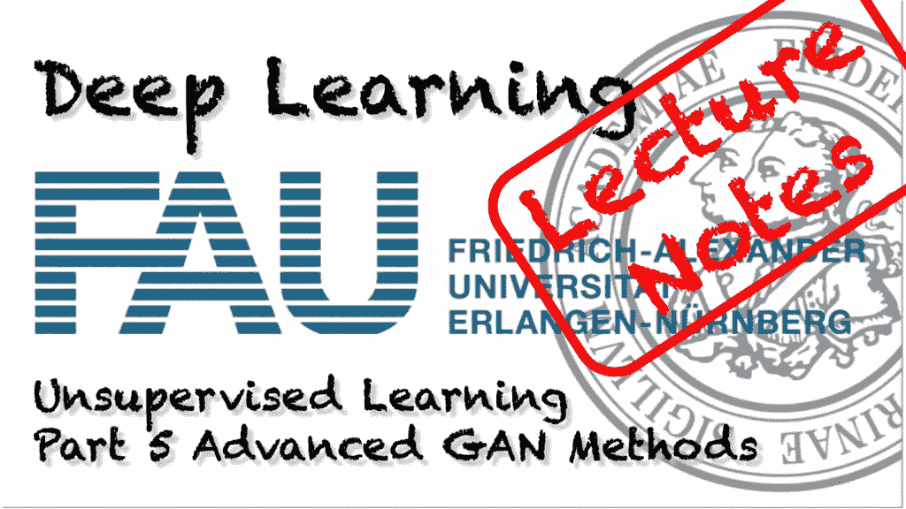

FAU 大学的深度学习。下图 [CC BY 4.0](https://creativecommons.org/licenses/by/4.0/) 来自[深度学习讲座](https://www.youtube.com/watch?v=p-_Stl0t3kU&list=PLpOGQvPCDQzvgpD3S0vTy7bJe2pf_yJFj&index=1)

**这些是 FAU 的 YouTube 讲座** [**深度学习**](https://www.youtube.com/watch?v=p-_Stl0t3kU&list=PLpOGQvPCDQzvgpD3S0vTy7bJe2pf_yJFj&index=1) **的讲义。这是与幻灯片匹配的讲座视频&的完整抄本。我们希望，你喜欢这个视频一样多。当然，这份抄本是用深度学习技术在很大程度上自动创建的，只进行了少量的手动修改。** [**自己试试吧！如果您发现错误，请告诉我们！**](http://autoblog.tf.fau.de/)

# 航行

[**上一讲**](/unsupervised-learning-part-4-eeb4d3ab601) **/** [**观看本视频**](https://youtu.be/4Ot22wkEdfU) **/** [**顶级**](/all-you-want-to-know-about-deep-learning-8d68dcffc258) **/** [**下一讲**](/segmentation-and-object-detection-part-1-b8ef6f101547)

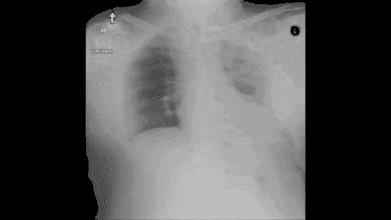

使用 GANs 创建的 x 射线投影。使用 [gifify](https://github.com/vvo/gifify) 创建的图像。来源: [YouTube](https://youtu.be/NBxIigNCryk)

欢迎回到深度学习，回到上一个视频，我们讨论了关于生成敌对网络的不同算法。今天，我们想看看第五部分的无监督训练。这些基本上是关于甘斯的贸易技巧。

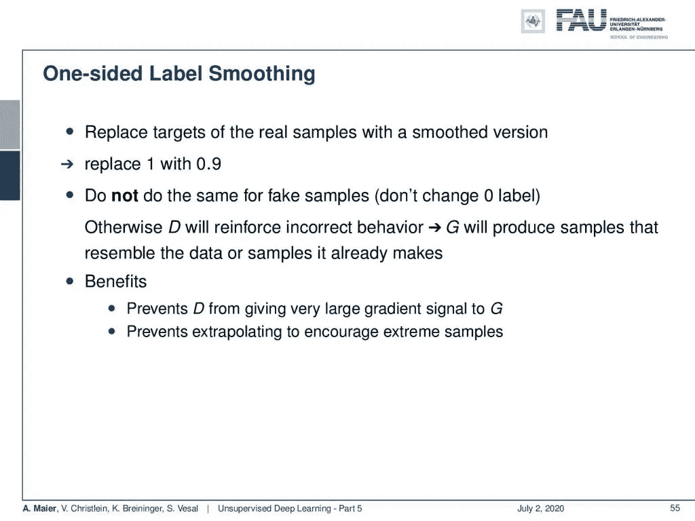

单面标签平滑有助于训练 GANs。 [CC 下的图片来自](https://creativecommons.org/licenses/by/4.0/)[深度学习讲座](https://www.youtube.com/watch?v=p-_Stl0t3kU&list=PLpOGQvPCDQzvgpD3S0vTy7bJe2pf_yJFj&index=1)的 4.0 。

有一个技巧可以帮到你很多，那就是单面标签平滑。所以，你可能想做的是用一个平滑的版本替换真实样本的目标。所以。你不用 1 的概率，而是用 0.9 的概率。你不能用同样的东西来做假样品。你不能改变他们的标签，因为否则，这将加强不正确的行为。因此，您的生成器将生成类似于它已经生成的数据或样本的样本。好处是你可以防止鉴别器给你的发生器很大的梯度，你也可以防止外推鼓励极端的样本。

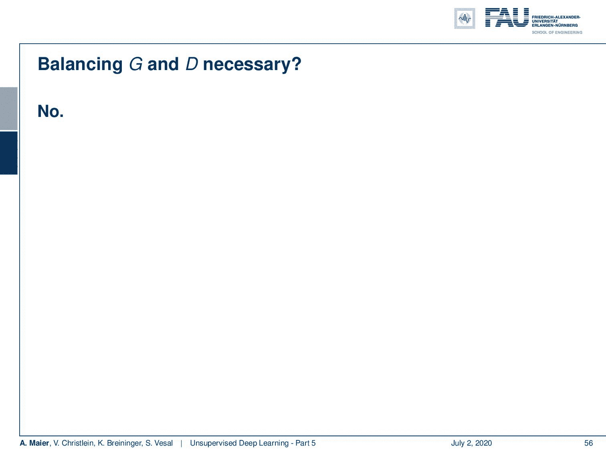

GANs 不需要在鉴别和发电机之间进行平衡。来自[深度学习讲座](https://www.youtube.com/watch?v=p-_Stl0t3kU&list=PLpOGQvPCDQzvgpD3S0vTy7bJe2pf_yJFj&index=1)的 [CC BY 4.0](https://creativecommons.org/licenses/by/4.0/) 下的图片。

发电机和鉴别器之间的平衡是必要的吗？不，不是的。GANs 通过估计数据和模型密度的比率来工作。因此，只有当鉴别器是最佳的时，才能正确地估计比值。所以，如果你的鉴别器超过了发电机也没关系。当鉴别器变得太好，你的梯度，当然，可能会消失。然后，你可以使用一些技巧，比如我们之前讨论过的非饱和损失。你也可能会遇到发电机梯度过大的问题。在这种情况下，您可以使用标签平滑的技巧。

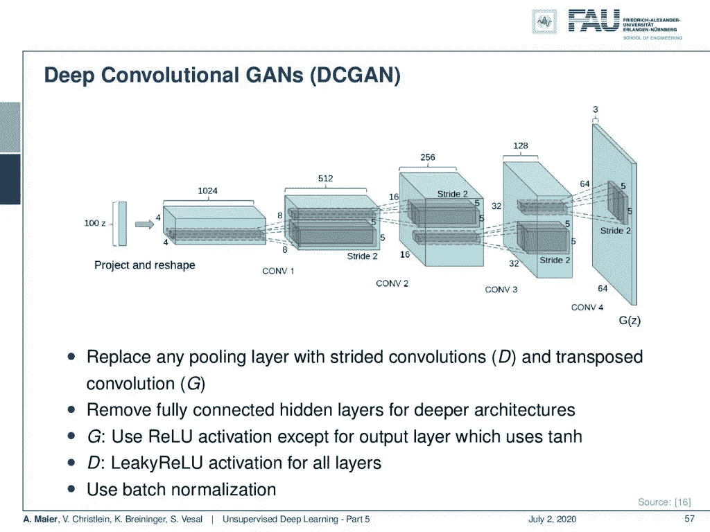

深度卷积 GANs。 [CC 下的图片来自](https://creativecommons.org/licenses/by/4.0/)[深度学习讲座](https://www.youtube.com/watch?v=p-_Stl0t3kU&list=PLpOGQvPCDQzvgpD3S0vTy7bJe2pf_yJFj&index=1)的 4.0 。

当然，你也可以使用深度卷积 GANs。这就是 DCGAN，您可以在生成器中实施深度学习方法。因此，您可以用步进卷积和转置卷积来替换池层。对于更深层次的架构，您可以完全删除连接的隐藏层。然后，生成器通常使用 ReLU 激活，除了使用双曲正切的输出层。例如，这里的鉴别器对所有层使用泄漏 ReLU 激活，并且它们使用批量标准化。

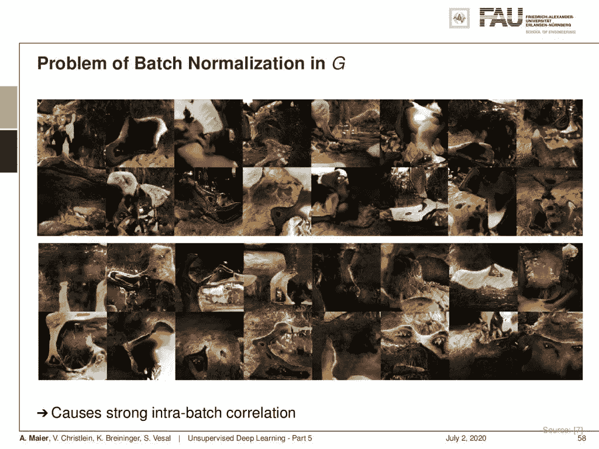

生成的图像可能显示出很强的批内相关性。 [CC 下的图片来自](https://creativecommons.org/licenses/by/4.0/)[深度学习讲座](https://www.youtube.com/watch?v=p-_Stl0t3kU&list=PLpOGQvPCDQzvgpD3S0vTy7bJe2pf_yJFj&index=1)的 4.0 。

如果你这样做，那么你可能会在下面的问题中结束:你可以在这里看到一些生成结果。在批内，可能有很强的批内相关性。所以在这个批次中，所有生成的图像看起来都非常相似。

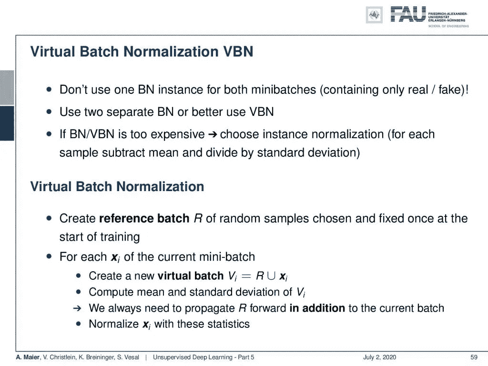

虚拟批次标准化有助于批次内关联。来自[深度学习讲座](https://www.youtube.com/watch?v=p-_Stl0t3kU&list=PLpOGQvPCDQzvgpD3S0vTy7bJe2pf_yJFj&index=1)的 [CC BY 4.0](https://creativecommons.org/licenses/by/4.0/) 下的图片。

这就引出了虚拟批处理规范化的概念。您不希望对两个小型批处理使用一个批处理规范化实例。您可以使用两个单独的批处理规范化，或者更好的是，您可以使用虚拟批处理规范化。如果代价太大，可以为每个样本选择实例归一化，减去平均值，然后除以标准偏差。如果您选择虚拟批次标准化，您将创建一个随机样本的参考批次 R，并在训练开始时修复它们一次。然后，对于当前小批量的每个 **x** 下标 I，您创建一个新的虚拟批量，该虚拟批量是由 **x** 下标 I 组成的参考批量。除了当前批处理之外，您总是需要传播然后向前 R。这就允许你用这些统计数据标准化 **x** 下标 I。因此，这可能有点昂贵，但我们已经看到，这对于稳定训练和消除批内相关性非常有用。

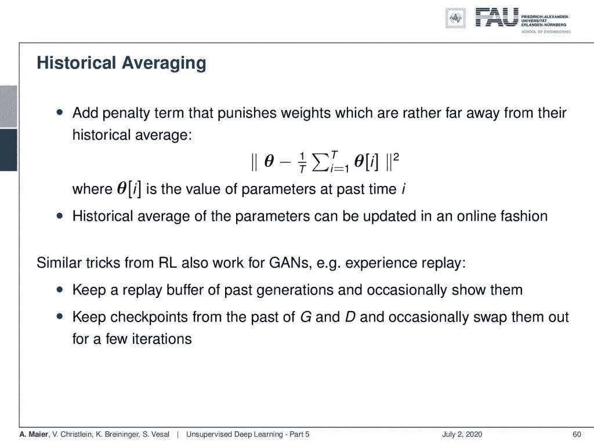

历史平均可以稳定 GAN 训练。来自[深度学习讲座](https://www.youtube.com/watch?v=p-_Stl0t3kU&list=PLpOGQvPCDQzvgpD3S0vTy7bJe2pf_yJFj&index=1)的 4.0CC 下的图片。

还有历史平均的想法。因此，你添加了一个惩罚项，惩罚那些远离历史平均值的权重。然后，可以以在线方式更新这些参数的历史平均值。强化学习的类似技巧也可以用于像经验重放这样的生成性对抗网络。你保存了过去几代的回放缓冲区，并偶尔显示它们。您保留来自过去的生成器和鉴别器的检查点，并偶尔在几次迭代中交换它们。

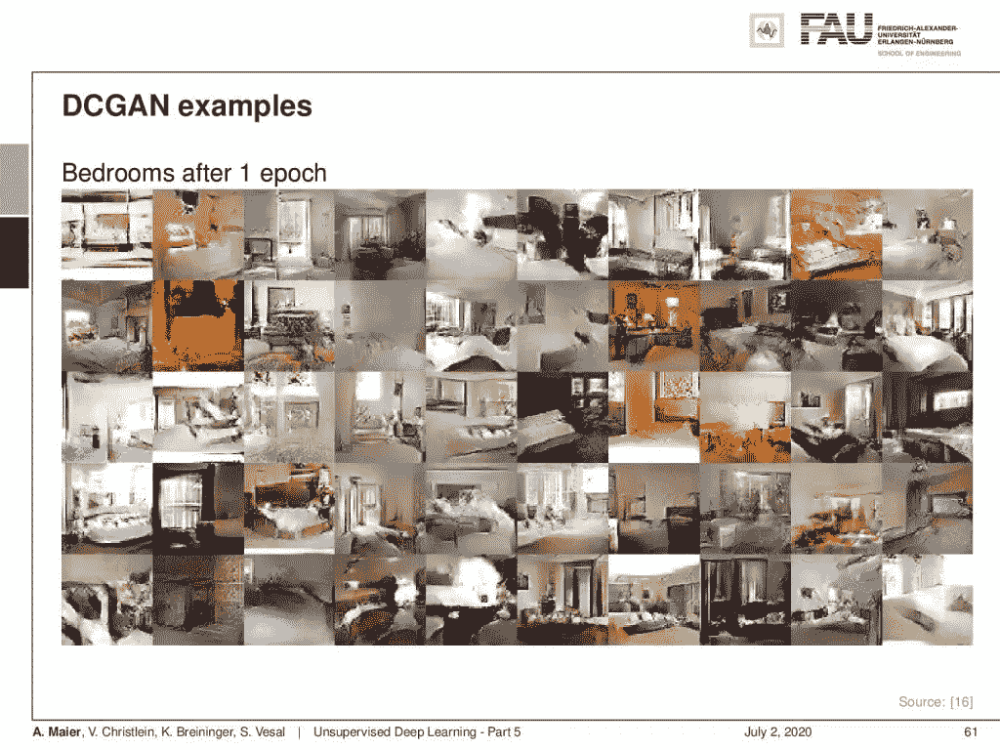

使用 DCGAN 创建的图像示例。 [CC 下的图片来自](https://creativecommons.org/licenses/by/4.0/)[深度学习讲座](https://www.youtube.com/watch?v=p-_Stl0t3kU&list=PLpOGQvPCDQzvgpD3S0vTy7bJe2pf_yJFj&index=1)的 4.0 。

所以，如果你这样做了，你就可以像 DCGAN 那样做了。这是一个时代后的卧室。你可以看到你可以创造出很多不同的卧室。所以这是一个非常有趣的事情，你实际上可以达到什么样的多样性。

来自 GANs 的动漫人物。使用 [gifify](https://github.com/vvo/gifify) 创建的图像。来源: [YouTube](https://youtu.be/2a3U4oHuvlE)

另一个有趣的观察是，您可以对生成的图像进行矢量运算。因此，例如，您可以生成条件“戴眼镜的人”的三个实例的平均值。有了这个平均值，你可以减去“不戴眼镜的男人”的平均值，然后计算“不戴眼镜的女人”的平均值，并把它加在上面。你得到的是“戴眼镜的女人”。

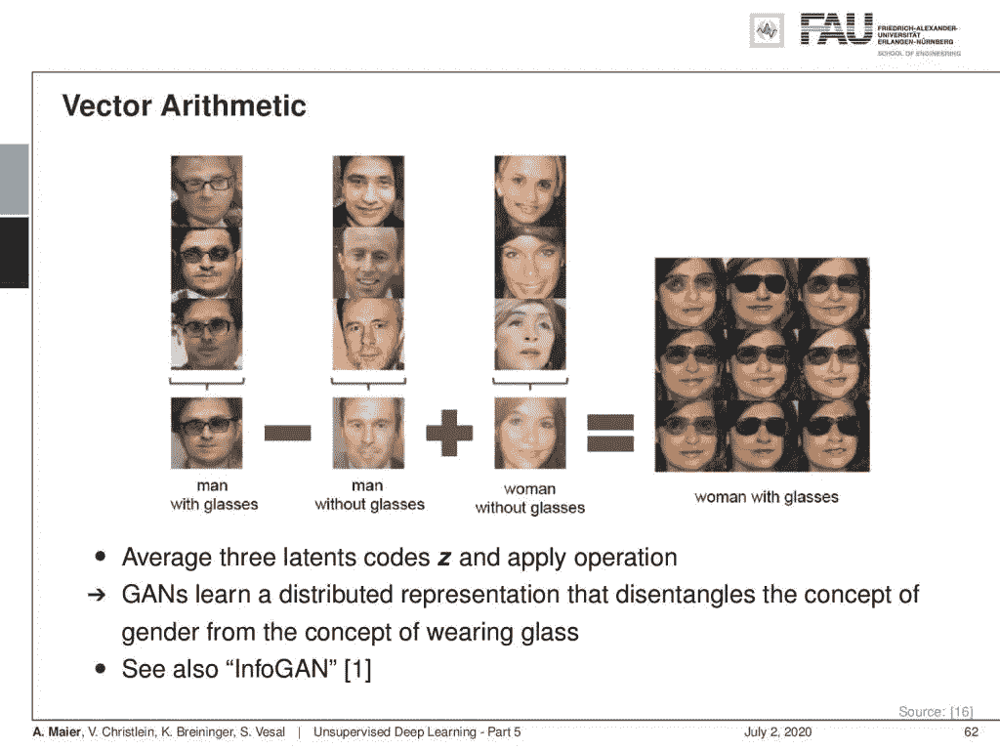

条件允许这种向量运算。 [CC 下的图片来自](https://creativecommons.org/licenses/by/4.0/)[深度学习讲座](https://www.youtube.com/watch?v=p-_Stl0t3kU&list=PLpOGQvPCDQzvgpD3S0vTy7bJe2pf_yJFj&index=1)的 4.0 。

所以，你真的可以用这个技巧来使用约束生成，来生成一些你可能没有条件变量的东西。因此，甘一家学会了一种分配表示法，这种表示法将性别的概念与戴眼镜的概念区分开来。如果你对这些实验感兴趣，我推荐你去看看[1]。

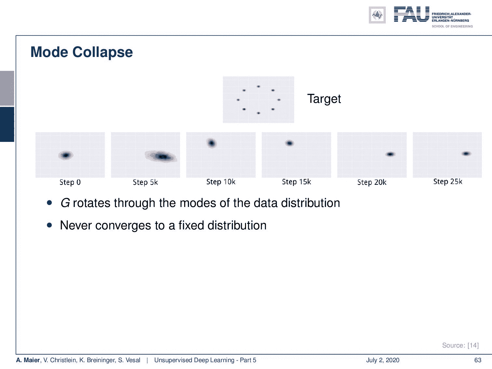

训练中的模式崩溃将阻止学习整个分布。 [CC 下的图片来自](https://creativecommons.org/licenses/by/4.0/)[深度学习讲座](https://www.youtube.com/watch?v=p-_Stl0t3kU&list=PLpOGQvPCDQzvgpD3S0vTy7bJe2pf_yJFj&index=1)的 4.0 。

让我们来看看一些更先进的 GAN 方法。可能出现的典型问题是模式崩溃。因此，如果您尝试让这种目标分布具有几个在二维空间中以环状方式分布的聚类中心，那么您可以看到，您的生成器可能会在数据分布模式中旋转。所以，你做 5000 步，10000 步，直到 25000 步，你开始在模式之间跳跃。这里的问题当然是你永远不会收敛到一个固定的分布。一个可能的原因可能是，G 的最小化超过 D 的最大化不等于 D 的最大化超过 G 的最小化。因此，内环中的鉴别器收敛于正确的分布，内环中的生成器将所有质量放置在最可能的点上。实际上，如果你对两个网络同时进行随机梯度下降，两种效应实际上都可能出现。解决方法是使用迷你鉴别或展开的 GANs。

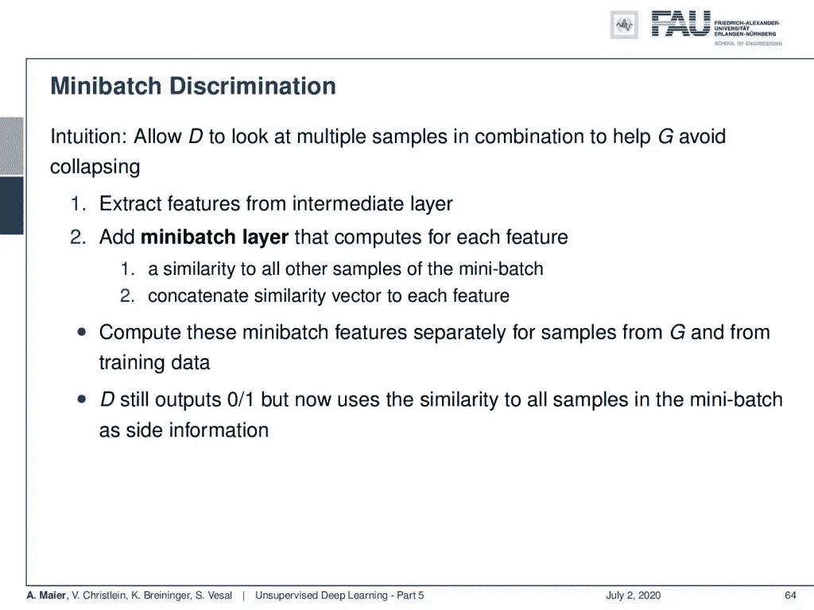

小批量歧视迫使批内出现差异。来自[深度学习讲座](https://www.youtube.com/watch?v=p-_Stl0t3kU&list=PLpOGQvPCDQzvgpD3S0vTy7bJe2pf_yJFj&index=1)的 [CC BY 4.0](https://creativecommons.org/licenses/by/4.0/) 下的图片。

因此，小批量鉴别遵循直觉，允许 D 同时查看多个样本，以帮助生成器避免崩溃。因此，您从中间层提取要素，然后添加一个小批量层，该层计算每个要素与小批量中所有其他样本的相似性。您将相似性向量连接到每个特征。然后，为来自生成器和训练数据的样本分别计算这些小批量特征。您的鉴别器仍然输出 0 和 1，但是使用小批量中所有样品的相似性作为辅助信息。这就是小批量歧视。

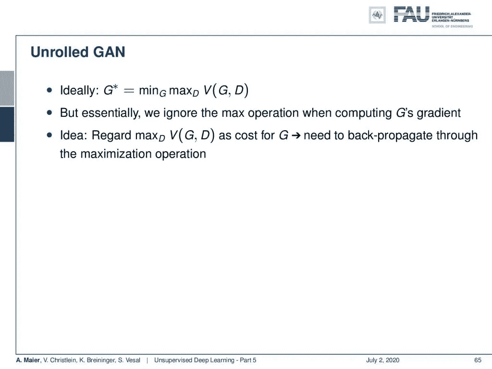

展开 GAN 训练带来了来自训练 rnn 的想法。 [CC 下的图片来自](https://creativecommons.org/licenses/by/4.0/)[深度学习讲座](https://www.youtube.com/watch?v=p-_Stl0t3kU&list=PLpOGQvPCDQzvgpD3S0vTy7bJe2pf_yJFj&index=1)的 4.0 。

您也可以遵循展开的 GAN 的概念。这里你想要理想的发电机。这里的问题是，在计算发电机的梯度时，我们基本上忽略了最大运算。这里的想法是将我们的 V 视为生成器的成本，您需要通过最大化操作反向传播。

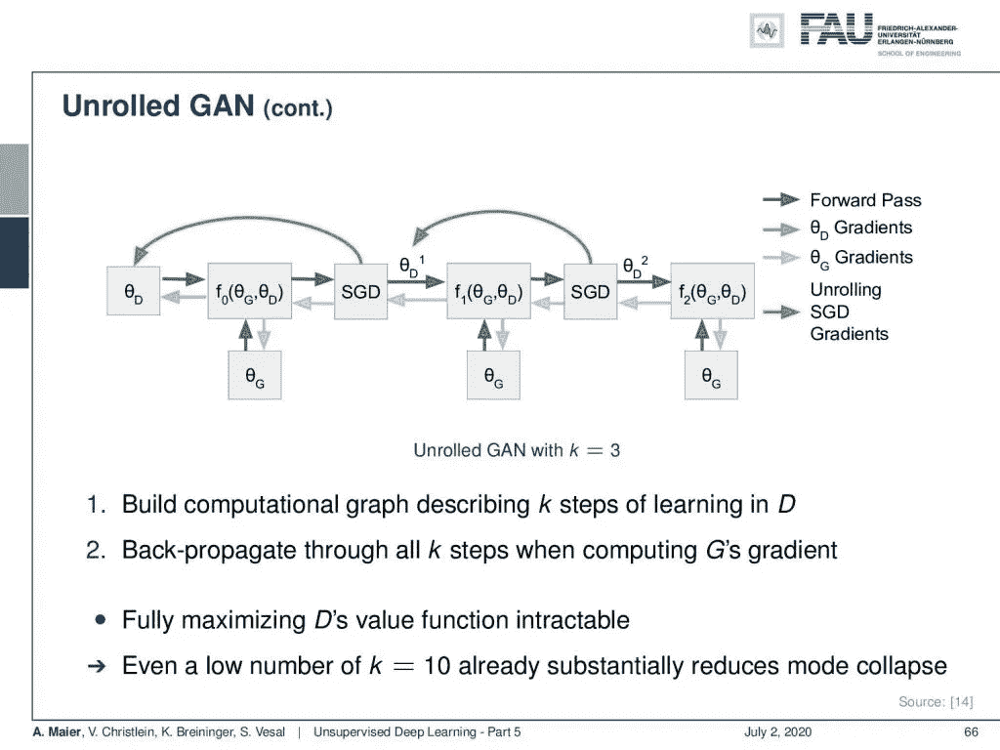

展开过程在示例中示出。 [CC 下的图片来自](https://creativecommons.org/licenses/by/4.0/)[深度学习讲座](https://www.youtube.com/watch?v=p-_Stl0t3kU&list=PLpOGQvPCDQzvgpD3S0vTy7bJe2pf_yJFj&index=1)的 4.0 。

这本质上导致了一个非常相似的概念，正如我们已经在递归神经网络中看到的。因此，您可以在不同的参数集上使用随机梯度下降来展开这些迭代。所以，在几次迭代中，你会得到这种展开的梯度。这就允许我们建立一个计算图来描述鉴别器中学习的几个步骤。当你计算生成器的梯度时，你通过所有的步骤反向传播。当然，完全最大化鉴别器的价值函数是困难的。因此，必须在 k 值较低时停止，但可以看到，在 k 值较低的情况下，如 10，这大大降低了模式崩溃。

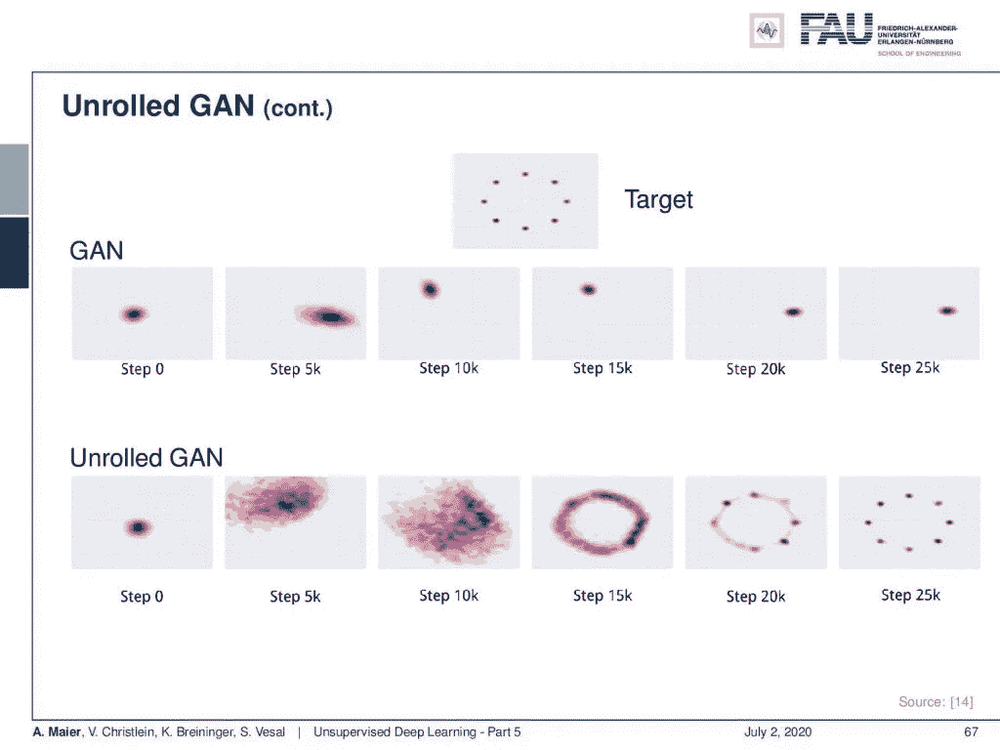

展开的 gan 防止模式崩溃。来自[深度学习讲座](https://www.youtube.com/watch?v=p-_Stl0t3kU&list=PLpOGQvPCDQzvgpD3S0vTy7bJe2pf_yJFj&index=1)的 [CC BY 4.0](https://creativecommons.org/licenses/by/4.0/) 下的图片。

这是一个展开的 GAN 的例子。你有标准 GAN 的目标函数。这是一种交替模式，展开 GAN 后，可以看到，在步骤 0 中，分布仍然相同。但是在第五千步中，你可以看到分布在一个更大的区域。在第一万步中，你可以看到整个域都被填满了。一万五千步后，你形成一个环。在两万步之后，你可以看到我们的某些最大值出现了，在两万五千步之后，我们设法模仿了最初的目标分布。

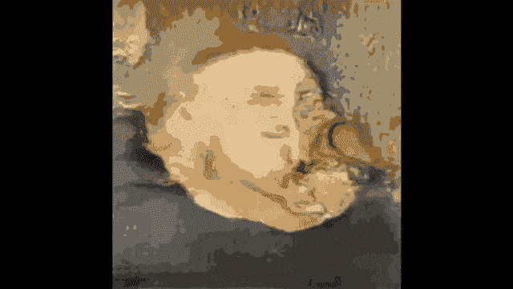

用甘斯创作的肖像。使用 [gifify](https://github.com/vvo/gifify) 创建的图像。来源: [YouTube](https://youtu.be/OouuNmFud78)

也可以使用 GANs 进行半监督学习。因此，这里的想法是通过将 K 类问题转化为 K+1 类问题来使用 GAN。在那里，你有真正的类，它们是监督学习的目标类。

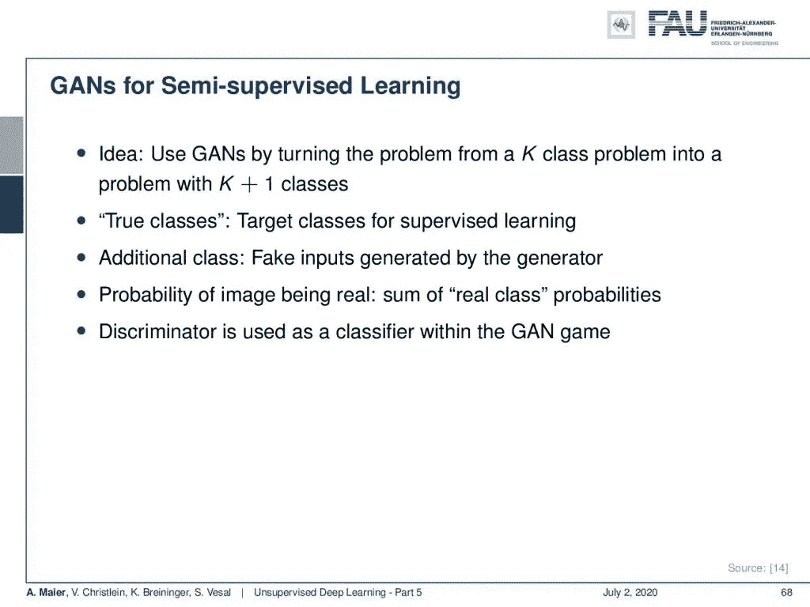

甘也适合半监督训练。 [CC 下的图片来自](https://creativecommons.org/licenses/by/4.0/)[深度学习讲座](https://www.youtube.com/watch?v=p-_Stl0t3kU&list=PLpOGQvPCDQzvgpD3S0vTy7bJe2pf_yJFj&index=1)的 4.0 。

然后，您有一些额外的类来模拟我们的生成器 g 生成的假输入。真实的概率基本上是所有真实类的总和，然后在 GAN 游戏中使用鉴别器作为分类器。

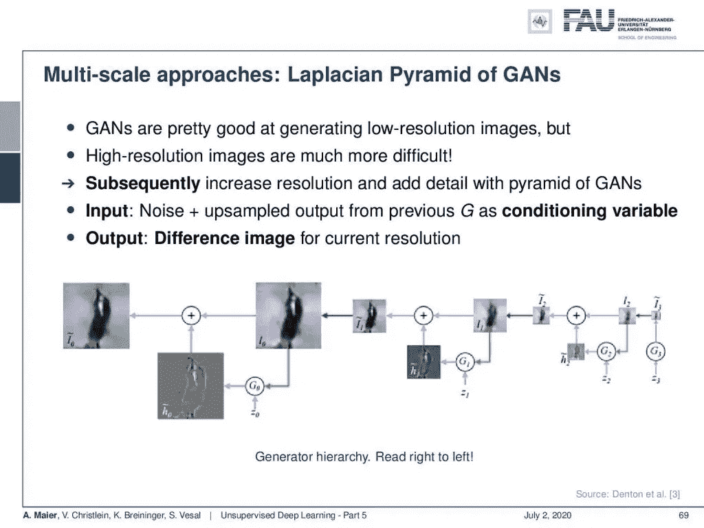

多尺度方法也适用于 gan。来自[深度学习讲座](https://www.youtube.com/watch?v=p-_Stl0t3kU&list=PLpOGQvPCDQzvgpD3S0vTy7bJe2pf_yJFj&index=1)的 [CC BY 4.0](https://creativecommons.org/licenses/by/4.0/) 下的图片。

同样，我们也可以使用我们深度学习课程中的其他想法。比如拉普拉斯金字塔。你也可以做一个拉普拉斯金字塔。因此，到目前为止，我们已经观察到 GANs 非常擅长生成低分辨率图像。高分辨率图像要困难得多。在这里，您可以从生成低分辨率图像开始。所以在这里，我们从右到左。他们将从噪声开始，生成一个小分辨率的图像。然后，您有一个生成器，它将生成的图像作为一个条件和附加噪声来生成高频更新，以放大图像。最后，您可以在下一个标度中再次这样做，再次尝试预测这些图像的高频，添加高频并使用它来放大，再次得到一个丢失高频的模糊图像。同样，在生成高频镜像时，您可以将它用作条件向量，以抑制高频。因此，我们一步一步地使用条件 gan 来产生这种情况下缺失的高频。

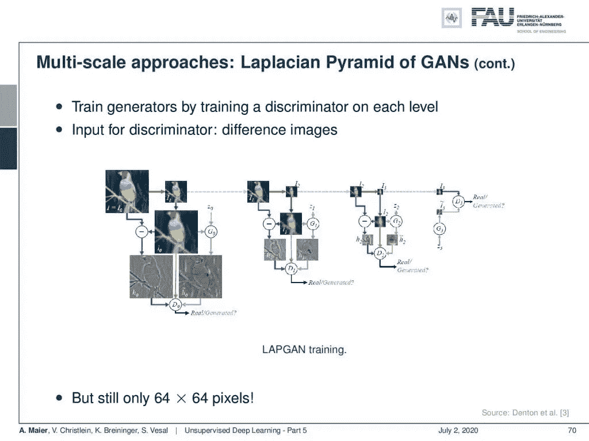

拉普根的训练程序。 [CC 下的图片来自](https://creativecommons.org/licenses/by/4.0/)[深度学习讲座](https://www.youtube.com/watch?v=p-_Stl0t3kU&list=PLpOGQvPCDQzvgpD3S0vTy7bJe2pf_yJFj&index=1)的 4.0 。

你通过在每一层训练一个鉴别器来训练生成器。鉴别器的输入是不同比例的图像。所以你一步一步地缩小图像，然后从缩小的图像中你可以计算出差异图像。两者之间的差异图像会给你正确的高频。训练鉴频器，使其能够区分正确产生的高频和人为产生的高频。这是拉普根训练，但我们仍然只有 64 乘 64 像素。

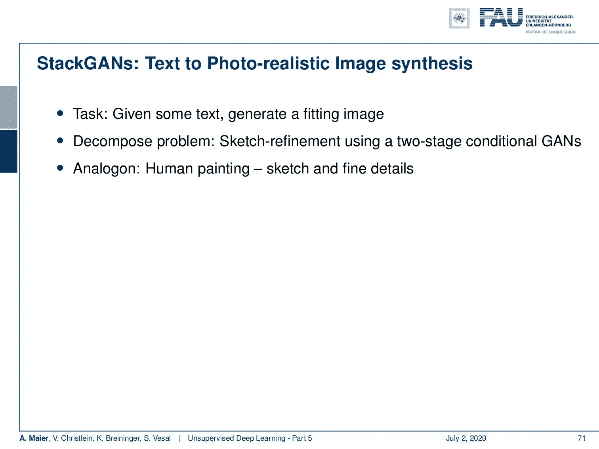

堆叠 GAN 允许多级 GAN 处理。 [CC 下的图片来自](https://creativecommons.org/licenses/by/4.0/)[深度学习讲座](https://www.youtube.com/watch?v=p-_Stl0t3kU&list=PLpOGQvPCDQzvgpD3S0vTy7bJe2pf_yJFj&index=1)的 4.0 。

另一个想法是 StackGAN。这是现在用于从文本生成照片真实感图像。所以，任务是你有一些文本，并生成一个合适的图像。使用两阶段条件 GAN 将问题分解为草图优化。当然，这里的类比是，举例来说，在人类绘画中，你会先画草图，然后画出细节。所以，你有两个阶段。一个 GAN 绘制低分辨率图像。它以文本描述为条件，从给定的文本中规划出大致的形状、基本颜色和背景。然后，第二阶段 GAN 根据第一阶段的结果和文字说明生成高分辨率图像。它纠正缺陷并增加细节。

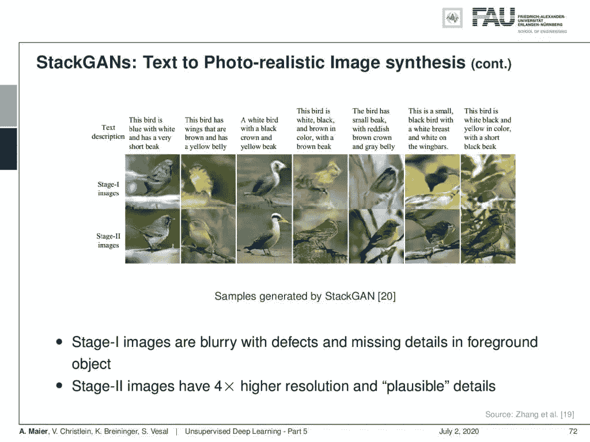

StackGAN 的例子。来自[深度学习讲座](https://www.youtube.com/watch?v=p-_Stl0t3kU&list=PLpOGQvPCDQzvgpD3S0vTy7bJe2pf_yJFj&index=1)的 [CC BY 4.0](https://creativecommons.org/licenses/by/4.0/) 下的图片。

这里有一些例子，有文字描述。我们从描述中生成鸟类。你可以看到第一阶段的一代仍然缺少很多细节。随着第二阶段的产生，第一阶段造成的许多问题得到了解决，你可以看到新的图像具有更高和更好的分辨率。你可以在[20]中看到整篇论文。

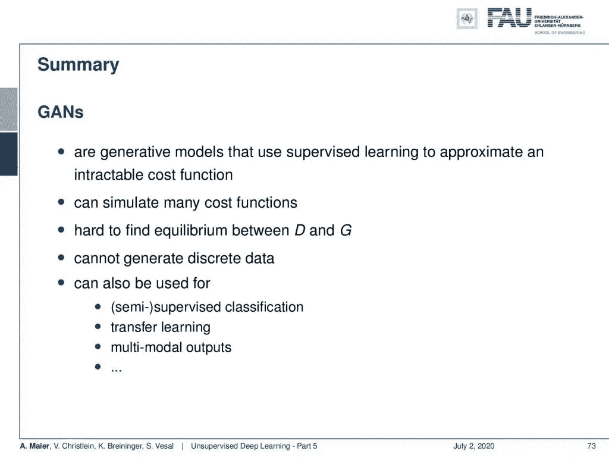

我们对 gan 的观察总结。 [CC 下的图片来自](https://creativecommons.org/licenses/by/4.0/)[深度学习讲座](https://www.youtube.com/watch?v=p-_Stl0t3kU&list=PLpOGQvPCDQzvgpD3S0vTy7bJe2pf_yJFj&index=1)的 4.0 。

让我们总结一下:gan 是生成模型，它使用监督学习来逼近一个难以处理的成本函数。您可以模拟许多不同的成本函数。实际上很难在鉴别器和生成器之间找到平衡。顺便说一下，它不能生成离散数据。您仍然可以将其用于半监督分类、迁移学习、多模态输出和域迁移。现在有很多报纸出现。这些还可以创建高分辨率输出，例如 BigGAN，它可以制作非常高分辨率的图像。

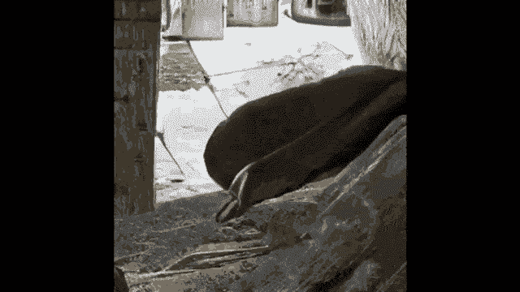

比根眼中的世界。使用 [gifify](https://github.com/vvo/gifify) 创建的图像。来源: [YouTube](https://youtu.be/cbdIUBSn4PU)

下一集深度学习，我们将会看到一些有趣的事情。我们将探讨如何运用神经网络来定位物体。因此，我们进入目标检测和定位。然后我们将检测对象类。我们试图检测类的实例。然后，我们将进一步尝试分割物体的轮廓。

在这个深度学习讲座中，更多令人兴奋的事情即将到来。来自[深度学习讲座](https://www.youtube.com/watch?v=p-_Stl0t3kU&list=PLpOGQvPCDQzvgpD3S0vTy7bJe2pf_yJFj&index=1)的 [CC BY 4.0](https://creativecommons.org/licenses/by/4.0/) 下的图片。

所以，我们真的想进入图像分割，而不仅仅是找到物体和图像，而是真正尝试识别它们的轮廓。我们还将很快研究一种经常被引用的技术。所以，你可以每天查看引用次数，你会发现引用次数增加了。

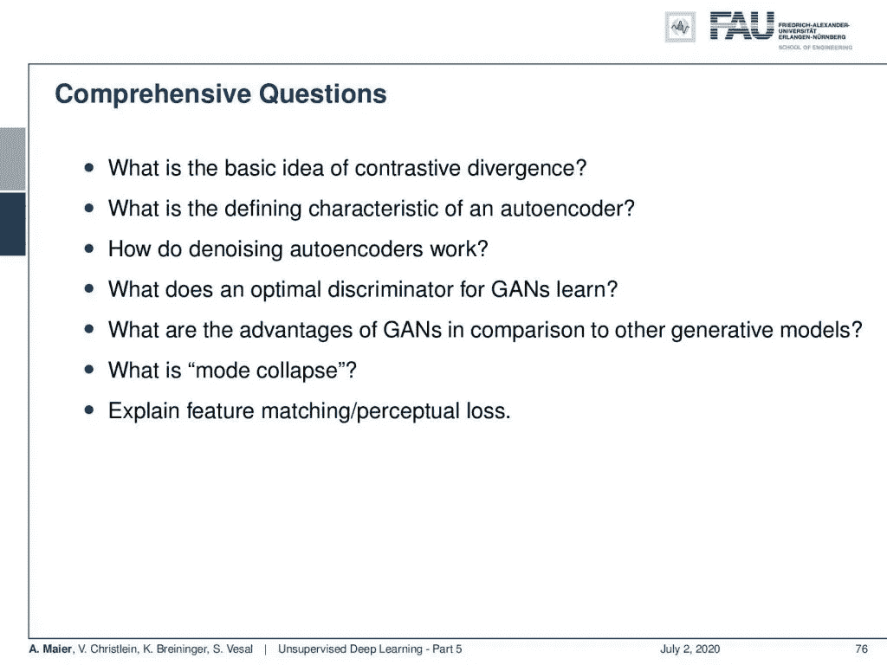

无监督学习的综合问题。 [CC 下的图片来自](https://creativecommons.org/licenses/by/4.0/)[深度学习讲座](https://www.youtube.com/watch?v=p-_Stl0t3kU&list=PLpOGQvPCDQzvgpD3S0vTy7bJe2pf_yJFj&index=1)的 4.0 。

我们这里也有一些综合问题:对比发散的基本思想是什么？自动编码器的特征是什么？如何去噪自动编码器的工作？另外，不要忘记变化的自动编码器。我认为这是一个非常酷的概念，重新参数化技巧告诉我们如何通过一个非常酷的采样过程进行反向传播。当然，你应该调查甘斯。什么是最佳鉴别器？模式崩溃是什么问题？我特别鼓励你看看自行车甘斯。所以现在骑自行车的人非常非常受欢迎。它们真的很好，因为你可以处理像不成对域翻译这样的事情。这在很多很多不同的应用中被使用。因此，如果你真的想在简历中表明你有深度学习的经验，你应该知道这些方法。那么，你应该知道这样的方法。嗯，还有一些进一步的阅读。有一个非常好的关于变分自动编码器的讨论，我们在这里链接。有一个很棒的关于甘的教程，作者是古德菲勒——甘之父。所以，我推荐在这里看这个视频[。然后，我们有更多的交易技巧，你可以在](https://www.youtube.com/watch?v=AJVyzd0rqdc)[这里找到甘黑客。如果你想知道如何命名你的 GAN，那么你可以看看这个参考。当然，我们也有大量的参考资料，我真的建议大家都看看。所以，非常感谢](https://github.com/soumith/ganhacks)看这个视频。我希望你喜欢我们对生成性敌对网络的简短总结，并期待在下一期与你见面。非常感谢，再见！

如果你喜欢这篇文章，你可以在这里找到更多的文章，或者看看我们的讲座。如果你想在未来了解更多的文章、视频和研究，我也会很感激关注 [YouTube](https://www.youtube.com/c/AndreasMaierTV) 、 [Twitter](https://twitter.com/maier_ak) 、[脸书](https://www.facebook.com/andreas.maier.31337)或 [LinkedIn](https://www.linkedin.com/in/andreas-maier-a6870b1a6/) 。本文以 [Creative Commons 4.0 归属许可](https://creativecommons.org/licenses/by/4.0/deed.de)发布，如果引用，可以转载和修改。如果你有兴趣从视频讲座中获得文字记录，试试[自动博客](http://autoblog.tf.fau.de/)。

# 链接

[链接](http://dpkingma.com/wordpress/wp-content/%20uploads/2015/12/talk_nips_workshop_2015.pdf) —变分自动编码器:
[链接](https://www.youtube.com/watch?v=AJVyzd0rqdc)—NIPS 2016 good fellow 的 GAN 教程
[链接](https://github.com/soumith/ganhacks) —如何训练一个 GAN？让 GANs 发挥作用的技巧和诀窍(小心，而不是
一切都是真的了！)
[链接](https://github.com/hindupuravinash/the-gan-zoo)——有没有想过怎么给自己的甘起名？

# 参考

[1]陈曦，陈曦，闫端，等.“InfoGAN:基于信息最大化生成对抗网的可解释表征学习”.神经信息处理系统进展 29。柯伦咨询公司，2016 年，第 2172-2180 页。
[2] Pascal Vincent，Hugo Larochelle，Isabelle Lajoie 等，“堆叠去噪自动编码器:用局部去噪标准学习深度网络中的有用表示”。《机器学习研究杂志》第 11 期。2010 年 12 月，第 3371-3408 页。
[3] Emily L. Denton，Soumith Chintala，Arthur Szlam 等，“使用拉普拉斯金字塔对抗网络的深度生成图像模型”。载于:CoRR abs/1506.05751 (2015 年)。arXiv: 1506.05751。
[4]理查德·杜达、彼得·e·哈特和大卫·g·斯托克。模式分类。第二版。纽约:Wiley-Interscience，2000 年 11 月。
[5]阿斯嘉菲舍尔和克里斯蒂安伊格尔。“训练受限制的玻尔兹曼机器:介绍”。载于:模式识别 47.1 (2014)，第 25–39 页。
[6]约翰·高迪尔。用于人脸生成的条件生成对抗网络。2015 年 3 月 17 日。网址:[http://www.foldl.me/2015/conditional-gans-face-generation/](http://www.foldl.me/2015/conditional-gans-face-generation/)(2018 年 1 月 22 日访问)。
【7】伊恩·古德菲勒。NIPS 2016 教程:生成性对抗网络。2016.eprint: arXiv:1701.00160。
【8】Martin HEU sel，Hubert Ramsauer，Thomas Unterthiner 等，“通过双时标更新规则训练的 GANs 收敛到局部纳什均衡”。神经信息处理系统进展 30。柯伦联合公司，2017 年，第 6626–6637 页。[9]杰弗里·E·辛顿和鲁斯兰·R·萨拉胡季诺夫。"用神经网络降低数据的维数."刊登在:科学 313.5786(2006 年 7 月)，第 504–507 页。arXiv: 20。
【10】杰弗里·e·辛顿。“训练受限玻尔兹曼机器的实用指南”。神经网络:交易技巧:第二版。柏林，海德堡:施普林格柏林海德堡，2012 年，第 599-619 页。
[11]菲利普·伊索拉，，周廷辉等，“条件对立网络下的意象翻译”。在:(2016 年)。eprint: arXiv:1611.07004。
[12]迪耶德里克·P·金马和马克斯·韦林。“自动编码变分贝叶斯”。载于:arXiv 电子版，arXiv:1312.6114(2013 年 12 月)，arXiv:1312.6114。arXiv:1312.6114[统计。ML】。
[13] Jonathan Masci、Ueli Meier、Dan Ciresan 等人，“用于分层特征提取的堆叠卷积自动编码器”。载于:人工神经网络和机器学习— ICANN 2011。柏林，海德堡:施普林格柏林海德堡，2011 年，第 52-59 页。
[14]卢克·梅茨、本·普尔、大卫·普法乌等人，《展开的生成性敌对网络》。国际学习代表会议。2017 年 4 月。eprint: arXiv:1611.02163。
[15]迈赫迪米尔扎和西蒙奥辛德罗。“条件生成对抗网”。载于:CoRR abs/1411.1784 (2014 年)。arXiv: 1411.1784。
[16]亚历克·拉德福德、卢克·梅斯和索史密斯·钦塔拉。深度卷积生成对抗的无监督表示学习 2015。eprint: arXiv:1511.06434。
[17] Tim Salimans，Ian Goodfellow，Wojciech Zaremba 等，“训练 GANs 的改进技术”。神经信息处理系统进展 29。柯伦咨询公司，2016 年，第 2234–2242 页。
【18】吴恩达。“CS294A 课堂笔记”。2011 年。
【19】张寒、徐涛、李洪生等，“StackGAN:利用堆叠生成式对抗网络进行文本到照片级真实感图像合成”。载于:CoRR abs/1612.03242 (2016 年)。arXiv: 1612.03242。
【20】张寒、徐涛、李洪生等，“Stackgan:利用堆叠生成式对抗网络进行文本到照片级真实感图像合成”。载于:arXiv 预印本 arXiv:1612.03242 (2016)。
【21】周，Aditya Khosla，Agata Lapedriza 等，“学习深度特征用于鉴别性定位”。In: 2016 年 IEEE 计算机视觉与模式识别大会(CVPR)。拉斯维加斯，2016 年 6 月，第 2921–2929 页。arXiv: 1512.04150。
[22]朱俊彦，朴泰成，菲利普·伊索拉等，“利用循环一致的对立网络进行不成对的图像到图像的翻译”。载于:CoRR abs/1703.10593 (2017 年)。arXiv: 1703.10593。