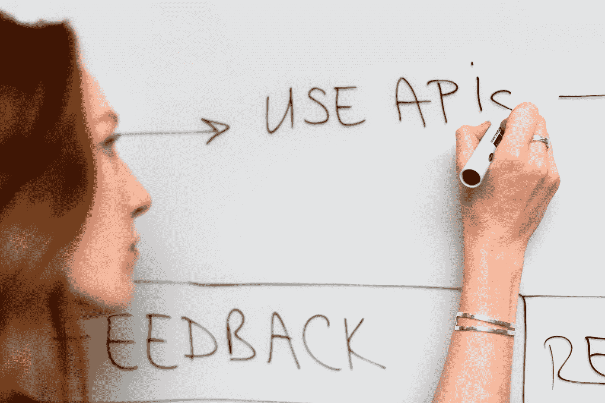
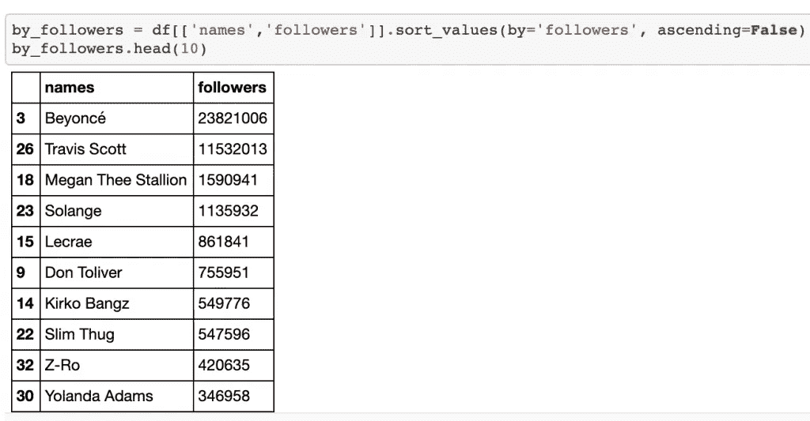
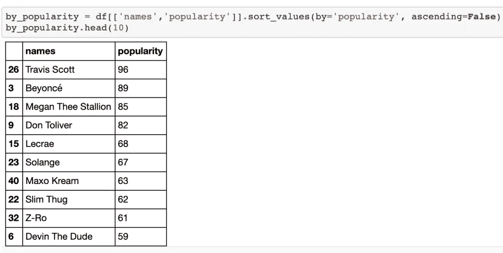
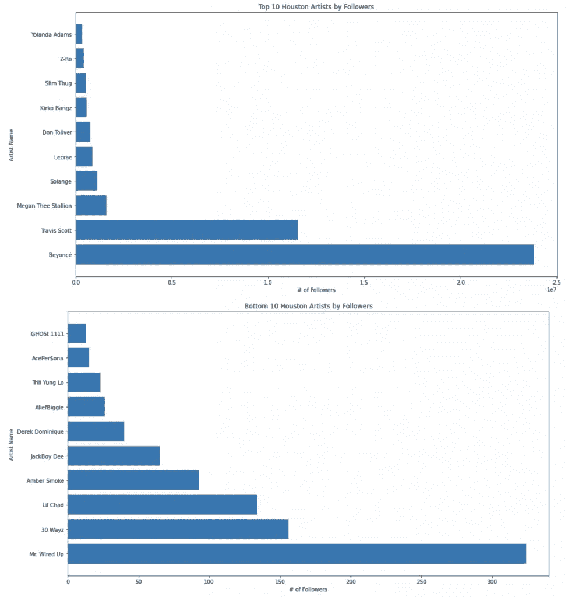
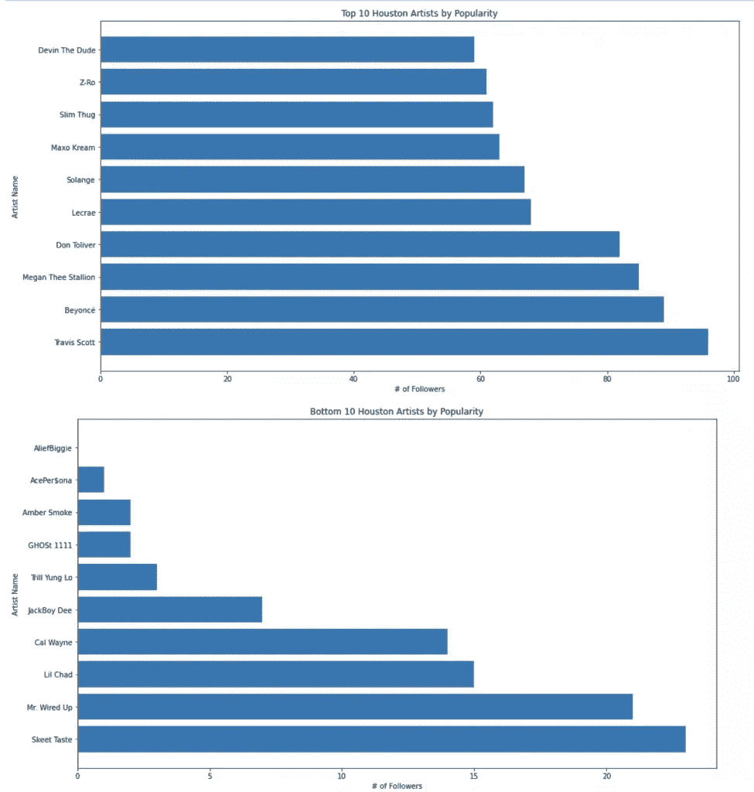
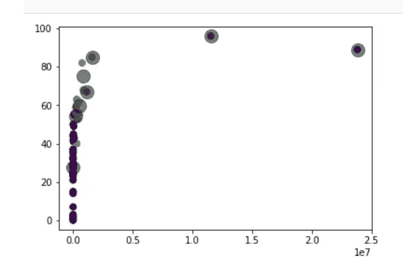
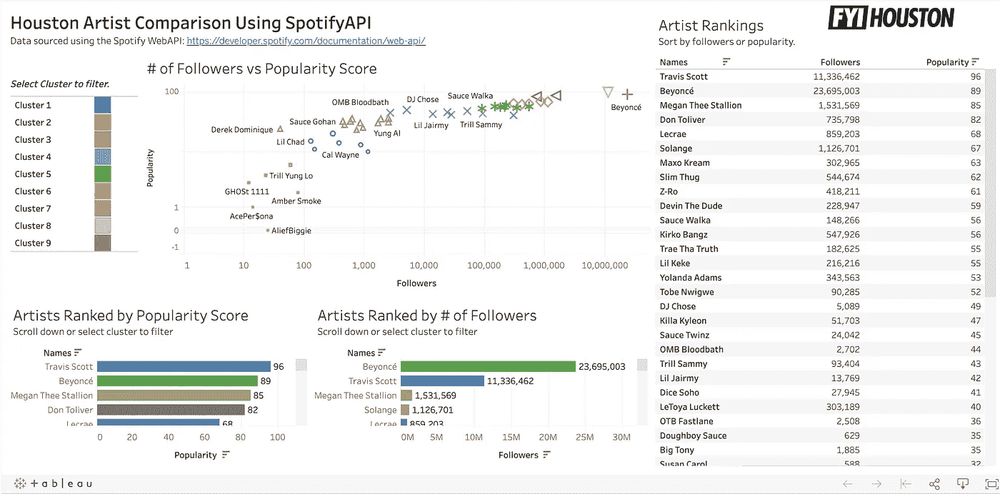

# 使用 Scikit-learn、Spotify API 和 Tableau Public 进行无监督学习

> 原文：<https://towardsdatascience.com/unsupervised-learning-with-scikit-learn-spotify-api-and-tableau-public-50fcecf3bdf5?source=collection_archive---------35----------------------->

## 在这篇文章中，我将使用来自 Scikit-Learn，KMeans 的无监督学习算法，来比较使用 Spotify 的 Web API 的休斯顿艺术家。



来自 [Pexels](https://www.pexels.com/photo/woman-writing-on-whiteboard-3861943/?utm_content=attributionCopyText&utm_medium=referral&utm_source=pexels) 的 [ThisIsEngineering](https://www.pexels.com/@thisisengineering?utm_content=attributionCopyText&utm_medium=referral&utm_source=pexels) 摄影

对于这个机器学习示例，我还将介绍 OSEMN 框架。首字母缩写 OSEMN 代表获取、清理、探索、建模和解释。对于研究机器学习问题的数据科学家来说，这是最常见的框架。

事不宜迟，我们开始吧。

# 使用 Spotify API 获取数据

首先，我们使用 Spotify API 客户端获取数据。如果你不熟悉 Spotify API，你会发现 CodeEntrepreneur 的[Python 30 天——第 19 天——Spotify API——Python 教程](https://www.youtube.com/watch?v=xdq6Gz33khQ)非常有帮助，尤其是因为文档是用 JavaScript 编写的。Spotify 的 Web API 需要开发者账户，API 调用需要认证令牌。

我们将使用 Spotify 的 [Get Artist endpoint](https://developer.spotify.com/documentation/web-api/reference/artists/get-artist/) 来获取来自德克萨斯州休斯顿的 30 位艺术家的数据。您可以下载。如果您想为 API 客户端使用相同的艺术家，请从我的 [GitHub 库](https://github.com/cousinskeeta/SpotifyAPI/)中下载 xlsx 文件。

确保您设置了客户端 id 和客户端密码:

```
client_id = 'your_client_id'
client_secret = 'your_secret_id'
spotify = SpotifyAPI(client_id, client_secret)In [ ]:spotify.get_artist('35magIA6t9JpNwT0sPEBgM')Out[ ]:{'external_urls': {'spotify': 'https://open.spotify.com/artist/35magIA6t9JpNwT0sPEBgM'},
 'followers': {'href': None, 'total': 383},
 'genres': ['houston rap'],
 'href': 'https://api.spotify.com/v1/artists/35magIA6t9JpNwT0sPEBgM',
 'id': '35magIA6t9JpNwT0sPEBgM',
 'images': [{'height': 640,
   'url': 'https://i.scdn.co/image/ab67616d0000b27326ac896c0d9a0e266c29ec27',
   'width': 640},
  {'height': 300,
   'url': 'https://i.scdn.co/image/ab67616d00001e0226ac896c0d9a0e266c29ec27',
   'width': 300},
  {'height': 64,
   'url': 'https://i.scdn.co/image/ab67616d0000485126ac896c0d9a0e266c29ec27',
   'width': 64}],
 'name': 'Yb Puerto Rico',
 'popularity': 26,
 'type': 'artist',
 'uri': 'spotify:artist:35magIA6t9JpNwT0sPEBgM'}
```

由于 api 响应返回一个 JSON 对象，我们可以解析每个艺术家的数据以获得我们需要的信息。我使用一个 for 循环从每个艺术家那里提取数据，并将他们的结果添加到列表中。您还可以尝试使用[Get multiple Artists](https://developer.spotify.com/documentation/web-api/reference/artists/get-several-artists/)端点在一个响应中获得多个艺术家。

下面是我加载。csv 文件并从 Spotify 获取艺术家信息:

```
# Load .csv with artists and spotifyIDs
import pandas as pdcsv = "Houston_Artists_SpotifyIDs.csv"
df = pd.read_csv(csv)
X =  df['Spotify ID']# For loop to collect JSON responses for each artist
json_results = []for i in X:
  json_results.append(spotify.get_artist(f'{i}'))
```

# 从 Spotify 中清除数据

一旦我们解析了每个人的信息，我们就不再需要 api 客户机了。我们可以使用 python check 获取存储在我们列表中的每个艺术家的追随者数量和受欢迎程度分数。我们还可以检查任何重复，并处理任何丢失的值。

下面是我将 JSON 信息解析成 Pandas 数据帧的代码:

```
In [ ]:names = []
followers = []
popularity = []
genres = []
urls = []

for i in json_results:
  names.append(i['name'])
  followers.append(i['followers']['total'])
  popularity.append(i['popularity'])
  genres.append(i['genres'])
  urls.append(i['external_urls']['spotify'])

df = pd.DataFrame()
df['names'] = names
df['followers'] = followers
df['popularity'] = popularity
df['genre'] = genres
df['url'] = urls

df.head()Out [ ]: names	followers	popularity	genre	url
0	AcePer$ona	15	1	[]	https://open.spotify.com/artist/4f06tvRb3HaDFC...
1	AliefBiggie	26	0	[]	https://open.spotify.com/artist/1WkWfhdsdSqVYT...
2	Amber Smoke	93	2	[]	https://open.spotify.com/artist/2JrntJAExmduLd...
3	Beyoncé	23821006	89	[dance pop, pop, post-teen pop, r&b]	https://open.spotify.com/artist/6vWDO969PvNqNY...
4	Chucky Trill	957	25	[houston rap]	https://open.spotify.com/artist/2mdDdKL0UzOqSq...
```

# 探索来自 Spotify 的数据

有了熊猫数据框架中的数据，我们就可以开始分析样本艺术家了。通过查看追随者的数据表，我们可以看到两个离群值，碧昂斯和特拉维斯斯科特。



图片由雅各布·塔德斯提供

我们也可以看到这两位艺术家有相似之处，但又略有不同。虽然碧昂斯有更多的粉丝，但特拉维斯·斯科特在 Spotify 的受欢迎程度上超过了碧昂斯，特拉维斯得分 96 分，碧昂斯得分 89 分，比“女王 B”高出整整 7 分。



图片由雅各布·塔德斯提供

我们也可以通过追随者和受欢迎程度来查看顶级艺术家，而在光谱的另一端，我们可以通过追随者和受欢迎程度来查看底层艺术家。

# 由关注者:



图片由雅各布·塔德斯提供

# 按受欢迎程度:



图片由雅各布·塔德斯提供

虽然这有助于了解谁是谁，谁有什么样的追随者或受欢迎程度，但这篇文章的目的是使用无监督学习算法来比较这些艺术家。

# 用 Scikit-learn 对数据建模

> *“无监督学习(Unsupervised Learning)是一种机器学习算法，用于从由没有标记响应的输入数据组成的数据集进行推断。最常见的无监督学习方法是聚类分析，用于探索性的数据分析，以发现数据中隐藏的模式或分组。”— Mathworks*

因为我们想比较这些艺术家，我们将使用无监督学习算法来将我们的艺术家分组/聚类在一起。更具体地说，在这个例子中，将使用 Scikit-Learn 的 KMeans 算法。我们从 sklearn 导入模块吧。你可以按照这里的说明[安装 sklearn](https://scikit-learn.org/stable/install.html) 。

```
from sklearn.cluster import KMeans
```

> *`[*KMeans*](https://scikit-learn.org/stable/modules/generated/sklearn.cluster.KMeans.html#sklearn.cluster.KMeans)`*算法通过尝试将样本分成 n 个方差相等的组来对数据进行聚类，从而最小化一个称为*惯性*或类内平方和的标准。**
> 
> **Scikit-Learn.org**

## *缩放要素*

*在训练任何机器学习算法之前，缩放您的特征始终是一种最佳做法。处理异常值也是很好的实践。在本例中，我将保留我们的异常值，并使用[最小最大缩放器](https://scikit-learn.org/stable/modules/generated/sklearn.preprocessing.MinMaxScaler.html)来缩放我们的小数据集中的要素，但我们也可以使用[鲁棒缩放器](https://scikit-learn.org/stable/modules/generated/sklearn.preprocessing.RobustScaler.html)来使用对异常值鲁棒的统计数据来缩放要素。*

```
*from sklearn.preprocessing import MinMaxScaler
s = MinMaxScaler()
Scaled_X = s.fit_transform(X)*
```

## *训练模型*

*现在我们已经缩放和转换了我们的特征，我们可以训练我们的 KMeans 算法。我们需要设置多个集群，有几种方法可以帮助选择最佳的集群数量，但是对于我们的示例，我们将使用 8 个集群。我们将使用 predict 方法根据每个艺术家的追随者和受欢迎程度来预测他们的群体或聚类。*

```
*kmeans = KMeans(n_clusters=8, random_state=0).fit(Scaled_X)
y_kmeans = kmeans.predict(X)*
```

## *查看集群*

*为了查看集群，我们可以使用方法*从 Kmeans 模型中提取标签。标签 _* 。我们也可以通过使用*的方法来查看星团的中心。簇 _ 中心 _* 。*

```
*df['labels'] = kmeans.labels_
centers = kmeans.cluster_centers_*
```

**

*图片由雅各布·塔德斯提供*

*图片由雅各布·塔德斯提供*

*虽然我们可以在笔记本中绘制这些内容，但我将使用 Tableau Public 创建一个供公众访问的仪表板。让我们将数据框保存为 Excel 文件。*

## *保存结果*

*下面，我们将过滤我们的数据框架，只包括艺术家的名字，追随者，受欢迎程度和标签。然后我们将按标签值对数据进行排序。*

```
*final = df[['names','followers','popularity','labels']].sort_values(by='labels', ascending=False)*
```

*最后，我们将使用内置的熊猫方法，*。to_excel* ，保存文件。*

```
*final.to_excel('Houston_Artists_Categories_8-7-2020.xlsx')*
```

# *从 Kmeans 解释聚类*

*我使用 [Tableau Public](https://public.tableau.com/s/) (它是免费的)来创建一个结果的交互式仪表板。通过艺术家分组，我们可以看到碧昂斯和特拉维斯·斯科特在他们自己的组中，而其他休斯顿的艺术家通过相似的追随者和受欢迎程度分组在一起。感谢您阅读这篇文章，我希望您在使用无监督学习比较休斯顿艺术家时发现它是有帮助的！*

**

*图片由雅各布·塔德斯提供*

*这是[仪表盘](https://public.tableau.com/profile/jacob.tadesse#!/vizhome/HoustonArtistComparisonusingSpotifyAPI/FYIHouston?publish=yes)的链接。*

*另外，这里有一个[回购](https://github.com/cousinskeeta/SpotifyAPI)的链接。*

*如果你愿意为这个项目做贡献，请通过 [LindedIn](https://www.linkedin.com/in/jacobtadesse/) 联系我。*