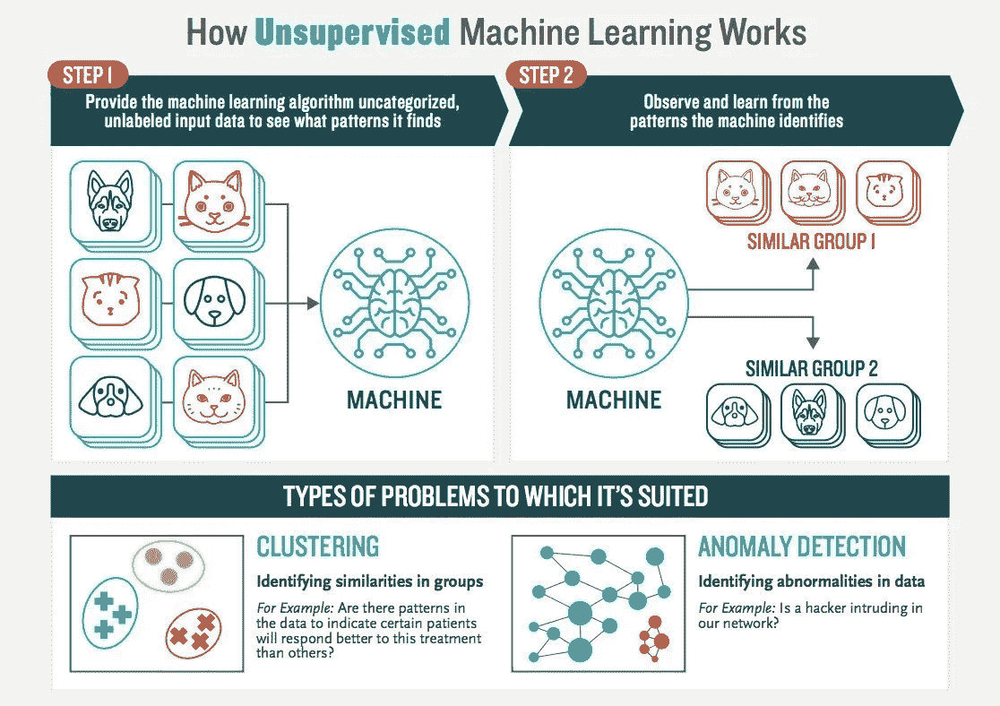
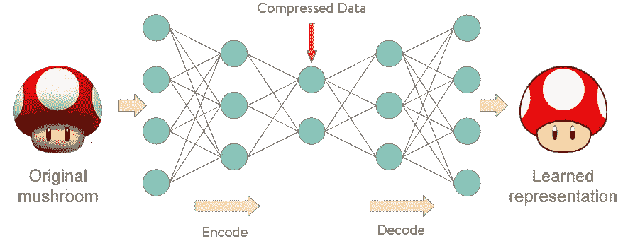
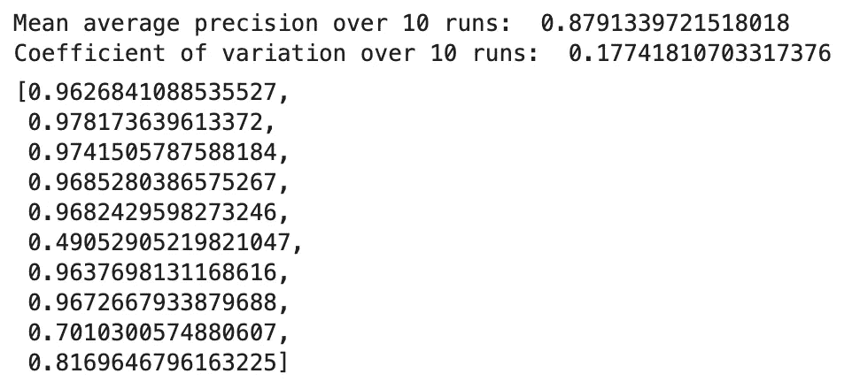
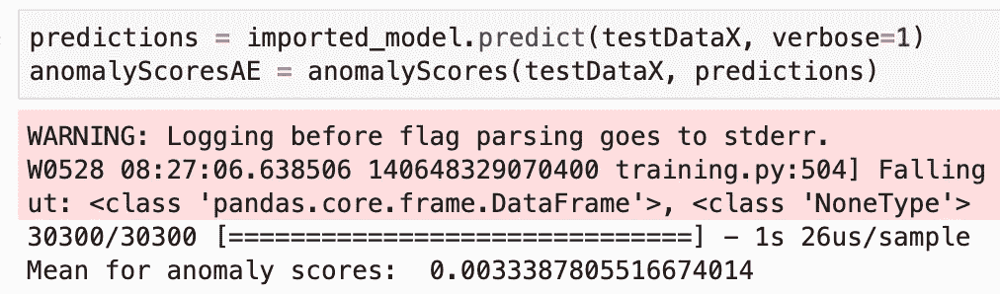
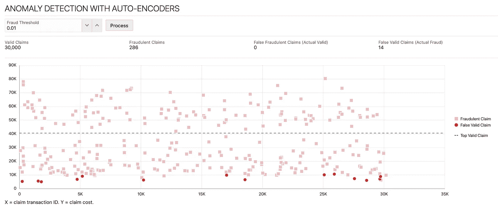
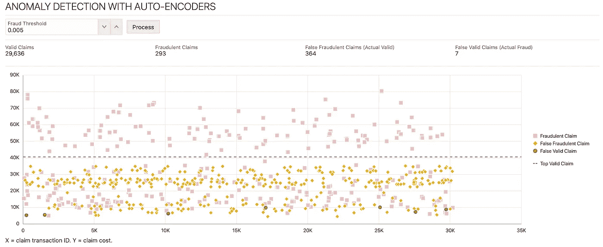

# Keras 中的无监督机器学习示例

> 原文：<https://towardsdatascience.com/unsupervised-machine-learning-example-in-keras-8c8bf9e63ee0?source=collection_archive---------10----------------------->

## 使用自动编码器对欺诈性健康保险索赔进行异常检测。


由 [geralt](https://pixabay.com/users/geralt-9301/) 在 [Pixabay](https://pixabay.com/) 上拍摄的照片

这篇文章是关于无监督学习和我在健康保险欺诈索赔检测方面的研究。

在健康保险中，欺诈性索赔检测存在一些挑战。首先，没有与医疗保险索赔欺诈相关的公开数据，这与数据隐私问题有关。第二，很难确定一套有助于识别欺诈性索赔的规则。这意味着带有标签数据的监督机器学习方法很难适用于我们的情况。无监督的机器学习似乎会是更好的匹配。在无监督的机器学习中，网络在没有标签的情况下训练，它发现模式并将数据分成组。这对于数据中的异常检测特别有用，在这种情况下，我们要寻找的数据很少。医疗保险欺诈就是这种情况——与索赔总额相比，这是不正常的。



来源:[谷歌图片](https://www.google.com/search?q=unsupervised+learning&sxsrf=ALeKk00uZcvCnHyS6bNphYxj_3sQQsVqlA:1590667589937&source=lnms&tbm=isch&sa=X&ved=2ahUKEwiNoZ3FwtbpAhVshosKHULSAdUQ_AUoAXoECBQQAw&biw=1680&bih=948)

我建议通过使用 Python 书籍的[实践无监督学习来更好地实践对这个主题的理解。这本书有一个](https://www.amazon.com/Hands-Unsupervised-Learning-Using-Python-ebook/dp/B07NY447H8) [GitHub](https://github.com/aapatel09/handson-unsupervised-learning) 回购。在我的例子中，我使用了本书中的异常分数计算函数。

我们识别欺诈的方法是检测异常情况。在无监督学习中，可以用自动编码器检测异常。Autoencoder 将原始数据转换为学习过的表示，基于此，我们可以运行一个函数，并计算学习过的表示离原始数据有多远。欺诈性数据以更高的错误率重建，这有助于识别异常。自动编码器适用于无监督学习——训练不需要标记数据。



来源:[谷歌图片](https://www.google.com/search?q=anomaly+detection+with+autoencoders&tbm=isch&ved=2ahUKEwiAqbaKw9bpAhWWvCoKHXjCDOQQ2-cCegQIABAA&oq=anomaly+detection+with+au&gs_lcp=CgNpbWcQARgBMgQIIxAnMgQIABAYMgQIABAYMgQIABAYULQ6WLo7YKlQaABwAHgAgAFJiAGHAZIBATKYAQCgAQGqAQtnd3Mtd2l6LWltZw&sclient=img&ei=16nPXsDhApb5qgH4hLOgDg&bih=948&biw=1680)

我的例子是基于定位欺诈性健康保险索赔的想法。可能有各种类型的欺诈，例如，医院可能会向保险公司收取过高的费用。我们的任务是检测欺诈性索赔，该模型在 Keras 中使用无监督的方式进行训练，没有标签。

很难获得健康保险的公共数据(隐私问题)。出于这个原因，我使用生成的数据(基于这篇文章— [没有数据的数据科学](/data-science-with-no-data-b3c21acee17c)):

*   培训:100 000(有效索赔)，100 0(欺诈索赔)
*   测试:30 000(有效索赔)，30 0(欺诈索赔)
*   欺诈索赔规则:索赔的保险费用增加一倍

检测数据重建错误率的异常分数函数:

```
def anomalyScores(originalDF, reducedDF):
    loss = np.sum((np.array(originalDF) - \
                   np.array(reducedDF))**2, axis=1)
    loss = pd.Series(data=loss,index=originalDF.index)
    loss = (loss-np.min(loss))/(np.max(loss)-np.min(loss))

    print('Mean for anomaly scores: ', np.mean(loss))

    return loss
```

Autoencoder 用 Keras/TensorFlow 实现。神经网络定义为 3 层(节点数=数据维数)。使用线性激活，优化器*亚当:*

```
# Call neural network API
model = Sequential()# Apply linear activation function to input layer
# Generate hidden layer with 14 nodes, the same as the input layer
model.add(Dense(units=14, activation='linear',input_dim=14))
model.add(Dense(units=14, activation='linear'))# Apply linear activation function to hidden layer
# Generate output layer with 14 nodes
model.add(Dense(units=14, activation='linear'))# Compile the model
model.compile(optimizer='adam',
              loss='mean_squared_error',
              metrics=['accuracy'])
```

这是无人监督的学习—欺诈标签不包含在培训中:

```
# Train the model
num_epochs = 10
batch_size = 256history = model.fit(x=dataX, y=dataX,
                    epochs=num_epochs,
                    batch_size=batch_size,
                    shuffle=True,
                    validation_data=(dataX, dataX),
                    verbose=1)
```

该模型在 10 轮中被训练。每次运行后，计算异常分数以测量重建精度。最佳模型被保存。使用精度召回和接收器操作特性来测量准确度。示例培训结果:



作者:安德烈·巴拉诺夫斯基

欺诈检测逻辑在*欺诈检测*笔记本中实现。*预测*功能在无标签的测试数据上执行。使用异常分数函数计算异常分数。我已经计算了平均异常分数，这将有助于定义区分有效索赔和欺诈索赔的阈值。基于测试数据的计算平均值:



作者:安德烈·巴拉诺夫斯基

最后，我将预测标签与实际测试集标签进行比较，这使我们能够通过训练好的模型来衡量欺诈检测的准确性。

**欺诈检测阈值= 0.01** 。

结果:

*   有效索赔:30 000
*   欺诈:286(准确率 95%)
*   未被认定为欺诈的:14



作者:安德烈·巴拉诺夫斯基

**欺诈检测阈值= 0.005** (更接近计算平均值 0.003)。

结果:

*   有效索赔:29 636
*   欺诈:293(准确率 98%)
*   有效识别为欺诈:364
*   未被认定为欺诈的:7



作者:安德烈·巴拉诺夫斯基

**欺诈检测阈值= 0.003** (等于计算的平均值 0.003)。

结果:

*   有效索赔:26 707
*   欺诈:300(准确率 100%)
*   有效识别为欺诈:3293


作者:安德烈·巴拉诺夫斯基

**结论**

随着异常分数变小，我们对异常进行更严格的检查。这使我们能够捕捉所有欺诈性索赔，但作为回报，我们会将更多有效索赔标记为欺诈。

从上面的图表中可以看出，识别低价值的欺诈性索赔更加困难。当数量较少时，这是有意义的——更有可能被遗漏。

**源代码** : [GitHub](https://github.com/abaranovskis-redsamurai/automation-repo/tree/master/unsupervised) 回购