# 使用 BERT 的无监督 NER

> 原文：<https://towardsdatascience.com/unsupervised-ner-using-bert-2d7af5f90b8a?source=collection_archive---------2----------------------->

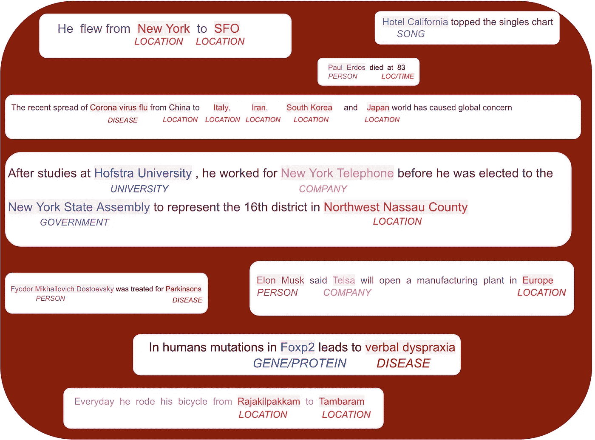

**图一。**图示了使用 BERT (bert-large-cased)执行的无监督 NER 的标记句子样本，没有微调。这些例子突出了用这种方法标记的几个实体类型。标记 500 个句子产生了大约 1000 种独特的实体类型——其中一些被映射到上面显示的合成标签上。Bert-large-case 模型无法区分基因和蛋白质，因为这些实体的描述符落在屏蔽术语的预测分布的同一尾部(它们在基本词汇中也是不可区分的)。区分这些密切相关的实体可能需要 MLM 对特定领域的语料库进行微调，或者使用定制的词汇从头开始预先训练模型(下面将进行讨论)

# **TL；博士**

> 【2022 年 1 月 **发布的这种方法的改进版本** [**描述了如何将其扩展到大量的实体类型(例如，跨越生物学和 PHI 实体领域的 68 种实体类型，如人、位置、组织)。**](/ssl-could-avoid-supervised-learning-fd049a27cd1b)

在自然语言处理中，识别句子中感兴趣的实体，如人、地点、组织等。需要带标签的数据。我们需要用感兴趣的实体来标记句子，其中每个句子的标记都是手动或通过某种自动方法来完成的*(通常使用试探法来创建有噪声/弱标记的数据集)*。然后，这些标记的句子被用来训练一个模型，以识别这些实体作为监督学习任务。

这篇文章描述了一种实现无监督 NER 的方法。NER 是在没有标记句子的情况下使用 BERT 模型在无监督的情况下完成的，该模型仅在具有掩蔽语言模型目标的语料库上被无监督地训练。

该模型在 25 个实体类型*(维基文本语料库)*的小数据集上具有 97%的 F1 分数，在 CoNLL-2003 语料库上对于人和地点具有 86%的 F1 分数。在 CoNLL-2003 语料库上，它对于人、地点和组织具有较低的 F1 分数 76%，这主要是因为句子中固有的实体歧义*(在下面的评估部分中检查)*。这两项测试都是在没有对模型在*上进行测试的数据进行任何预训练/微调的情况下进行的(与对特定领域数据进行预训练/微调模型或使用标记数据进行监督训练形成鲜明对比)。*

# ***这是怎么回事？***

如果我们被问到一个术语的实体类型 *(* ***术语*** *既指* ***单词*** *又指* ***短语****我们从未见过，我们可以通过术语的发音和/或术语出现的句子结构来猜测。也就是说，*

*   *一个术语的子词结构提供了其实体类型的线索。*

```
**Nonenbury is a _____**
```

*   *这是一个虚构的城市名称，但我们可以猜测它可能是一个后缀为“bury”的地点。在这里，术语后缀给了我们一个线索，即使我们从句子上下文中没有任何其他关于实体类型的线索。*
*   *句子结构提供了术语实体类型的线索。*

```
**He flew from _____ to Chester**
```

*这里，句子的上下文给了我们一个线索，即未知项是一个位置。即使在*(例如 Nonenbury)* 之前没有见过，我们也可以猜测句子中空白位置的任何术语都可能是位置。*

*伯特的掩蔽语言模型 head(*MLM——图 7* )可以预测上述掩蔽位置的候选单词，给定之前描述的训练目标——它通过预测句子中被删除的单词来学习。然后，在推断过程中使用这种学习，以输出对句子中被屏蔽的术语的预测，其中该预测是对 BERT 的固定词汇的概率分布。这个输出分布有一个明显但很小的尾部 *( < ~总质量的 0.1)*，其中驻留了捕获术语的上下文敏感实体类型的候选单词。这个尾部充当使用 BERT 词汇表表示的术语的*上下文敏感签名。例如，句子中屏蔽位置的上下文敏感签名如下所示**

```
**Nonenbury is a _____***Context Sensitive (CS) Predictions:** village hamlet town settlement parish Village Hamlet farm place Town*
```

*BERT 的固定词汇*(BERT-large-cased 为 28，996)*用作一组通用描述符*(例如专有名词、普通名词、代词等。).*这些描述符的子集*(可能是重叠的)*由下面描述的聚类过程获得，独立于其句子上下文来表征术语的实体类型。这些子集是*术语的上下文无关签名。*BERT 词汇表中捕获接近上述上下文敏感签名的实体类型的上下文无关子集是*

```
*['villages', 'towns', 'village', 'settlements', 'villagers', 'communities', 'cities']
['Village', 'village']
['city', 'town', 'City', 'cities', 'village']
['community', 'communities', 'Community']
['settlement', 'settlements', 'Settlement']
['Township', 'townships', 'township']
['parish', 'Parish', 'parishes']
['neighborhood', 'neighbourhood', 'neighborhoods']
['castle', 'castles', 'Castle', 'fortress', 'palace']
['Town', 'town']*
```

*在上下文敏感签名/聚类和上下文无关签名/聚类之间的 BERT 词汇表的嵌入空间中实现的最接近匹配函数*(基于单词嵌入的余弦相似度)*产生表示术语的 NER 标签的上下文无关签名的子集。具体来说， **m** 条款 *{B1，B2，C3，…。Bm}* 构成上下文敏感签名，n 组术语 *{{C11，C12，C13，…Ck1}* ， *{C21，C22，C23，…Ck2}，… {Cn1,Cn₂,Cn₃,…Ckn}}* 构成上下文无关签名，产生表示术语*(下面图 2)*的 NER 标签的上下文无关签名的子集。*

*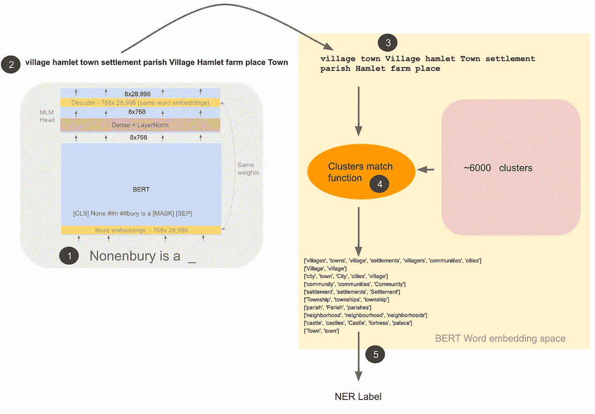*

***图二。** NER 标注了一句话。(1)在最小预处理之后，将带有屏蔽词的输入句子输入到模型中。(2)对 BERT 的 28，996 个词汇的前 10 个预测。(3)这 10 项在伯特的词嵌入空间中被一个函数重新排序。(4)来自重新排序的术语的前 k 个术语以及 6000 个聚类(离线计算)作为输入被馈送到输出匹配聚类的聚类匹配函数。这些聚类的标注(可以是用户定义的标注-一次性手动步骤，或者在某些用例中按原样使用)随后被聚合以输出 NER 标注。图中执行 3、4 和 5 的函数都是在 BERT 的嵌入空间中使用字向量之间的余弦相似性来完成的。约 6000 个聚类的一次性离线生成也是使用 BERT 的单词嵌入空间中单词向量之间的余弦相似度来完成的。图中显示了隐藏大小为 768 的 BERT 基本模型。帖子中的 NER 例子是用隐藏尺寸为 1024 的大号伯特箱完成的*

*给定我们可以从 BERT 的词汇表中自动收获的上下文无关签名的数量为数以千计( *~6000，对于 bert-large-cased* ) —这种方法允许我们在细粒度级别上对大量实体类型执行无监督的实体识别，而不需要标记数据。*

*上面描述的无监督 NER 方法很大程度上是因为，正如本文 中的 [*所考察的*](/examining-berts-raw-embeddings-fd905cb22df7)*

*   *BERT 的原始单词嵌入捕捉有用的和可分离的信息*(明显的直方图尾部，小于 0.1 %的词汇)*关于使用 BERT 词汇中其他单词的术语。这用于生成 6000+个集群*
*   *由具有 MLM 头的 BERT 模型输出的这些嵌入的变换版本被用于预测屏蔽字。预测[也有一个明显的尾巴](/examining-berts-raw-embeddings-fd905cb22df7)。这用于选择术语的上下文敏感签名。*

# *执行无监督 NER 的步骤*

## *一次性离线处理*

*一次离线处理从从 BERT 词汇表中获取的上下文无关签名集合创建到单个描述符/标签的映射。*

## *第一步。过滤 BERT 的词汇以挑选上下文敏感的签名术语*

*伯特的词汇是普通名词、专有名词、子词和符号的混合体。这个集合的最小过滤是去除标点符号、单个字符、子词和 BERT 的特殊符号。得到的 21，418 个术语的集合—普通名词和专有名词的混合用作描述实体类型的描述符。*

## *第二步。从 BERT 的词汇表中生成上下文无关的签名*

*如果我们简单地从尾部为 bert 词汇表中的每个术语挑选上下文无关的签名，我们将获得相当大量的聚类 *(~20，000)* ，即使具有 0.5 的高余弦相似性阈值*(对于 BERT 大型模型，对于高于 0.5 的余弦阈值的术语，平均约有 0.1%的术语位于尾部)*。这不仅是大量的聚类，它也不能捕获这些签名之间的相似性。所以，相反我们*

*   *遍历 BERT 词汇表中的所有术语*(忽略子词和大多数单个字符；补充说明有更多细节)*，并为 0.5 以上的每一项挑选上下文无关的签名。将单词尾部的术语视为一个完整的图，其中边的强度是余弦相似值。*
*   *选择与图中所有其他节点具有最大连接强度的节点。*
*   *该节点充当由这些节点组成的上下文无关签名的中枢。此节点是此图中所有其他节点的最近邻居。*

*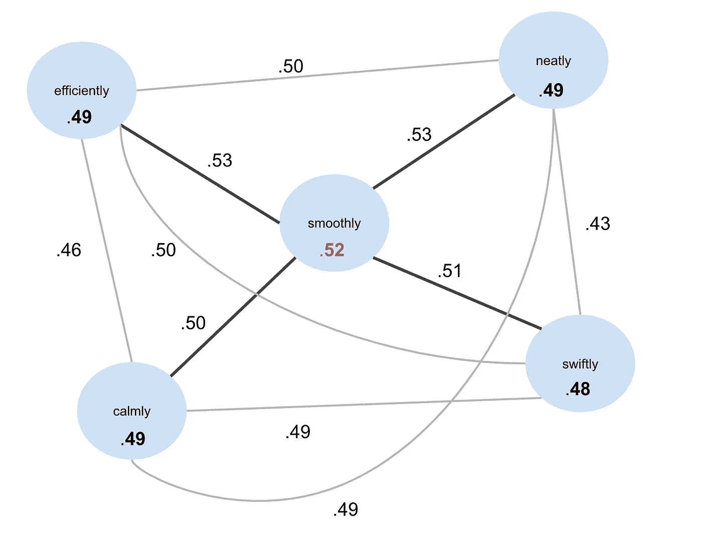*

***图三。在一个完整的图中寻找枢轴节点**。在上面的完整图形中，节点“平滑地”具有到其邻居的最大平均连接强度。所以“平滑地”是这个图*的中枢节点——这个图中所有其他节点的最近邻居。**

*   *一旦一个术语被选作签名的一部分，它将不会被考虑用于 pivot 候选评估*(但是，如果另一个术语的 pivot 节点计算使其成为 pivot，则它可以间接成为 pivot)* 。本质上，一个术语可以是多个集合的一个元素，一个中枢或间接中枢。*

```
*airport 0.6 0.1 Airport airport airports Airfield airfield
stroking 0.59 0.07 stroking stroked caressed rubbing brushing caress
Journalism 0.58 0.09 Journalism journalism Journalists Photography   
                     journalists
smoothly 0.52 0.01 smoothly neatly efficiently swiftly calmly* 
```

*在上面的示例签名中，两个数值是子图边强度的平均值和标准偏差。第一列术语用作代表该签名的枢纽术语。这些术语充当实体标签代理。这些可以手动映射*(一次性操作)*到用户定义的标签。在下面的图 4a 和 4b 中示出了映射这些实体集群的例子。我们只需要映射那些代表与我们的特定应用程序相关的实体类型的集合。其余的可以通过编程映射到一个合成标签“other/misc”。参考部分描述了一种使用模型本身来引导/加速描述符到用户定义标签的手动映射的方法。*

*因为伯特的词汇中大约 30%是专有名词*(人名、地名等)。)*尽管我们只是标注了一小部分术语*(约 2000 个人工标注集群，耗时约 5 个工时，如图 4 和 4b 所示)*而不是大量的句子，但看起来我们似乎在作弊。将句子的标注问题转化为标注上下文不敏感描述符的一个关键优点是，这是一个一次性的过程。这与监督训练方法形成对比，在监督训练方法中，我们必须不可避免地创建更多标记数据，不仅要训练我们的模型，还要根据我们在训练*(通常在部署中)*之后发现的不分布的句子对其进行再训练。然而，在我们的情况下，更糟糕的情况是，我们必须在没有监督的情况下对这些新句子重新训练/微调我们的 BERT 模型——我们不必再做任何标记。*

*上面描述的上下文不敏感签名生成产生大约 6000 个集合，平均基数大约为 4 +/- 7 个节点。这 6000 组数据的聚类强度平均值为 0.59，偏差为 0.007，这些聚类非常紧密，因为平均值远远高于我们从分布*(图 4c)* 中选择的阈值。大约 5000 个词汇术语 *(17 %的词汇)*是单体集合，被忽略。如果选择集合的阈值改变，这些数字也会改变。例如，阈值 0.4 会将总尾部质量增加到 0.2%，并且还会增加聚类平均值*(但是聚类会因实体类型混合而变得嘈杂)。**

*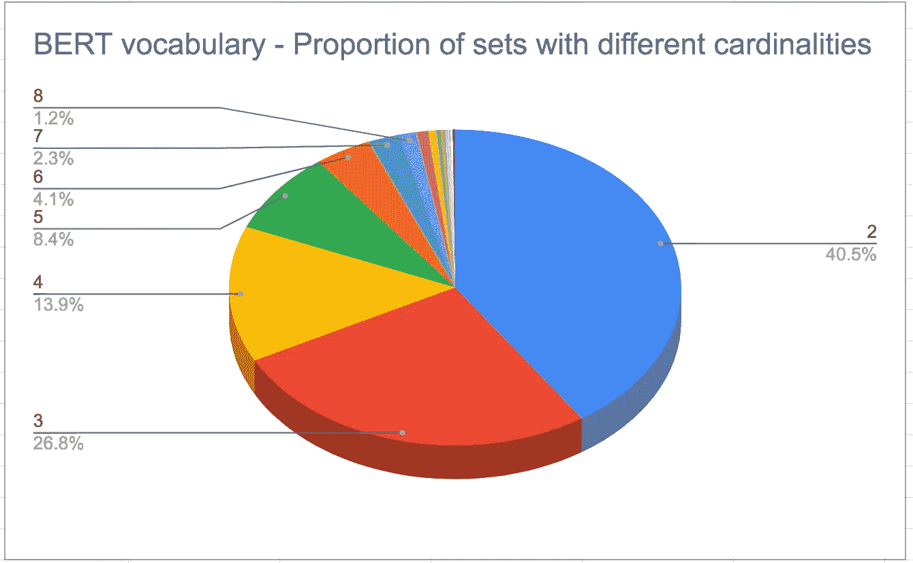*

***图 4** 。BERT 的上下文无关签名集统计信息(bert-large-cased)。平均基数约为 4，标准偏差为 7。这 6110 组的聚类强度的平均值为 0.59，偏差为 0.007，这些聚类是非常紧密的聚类，因为平均值远远高于我们从分布中选择的阈值。我们将看到，相比之下，上下文敏感术语通常是弱聚类。大约 17%的 BERT 词汇是单态的。聚类不考虑子词、特殊标记和大多数单字符标记。*

*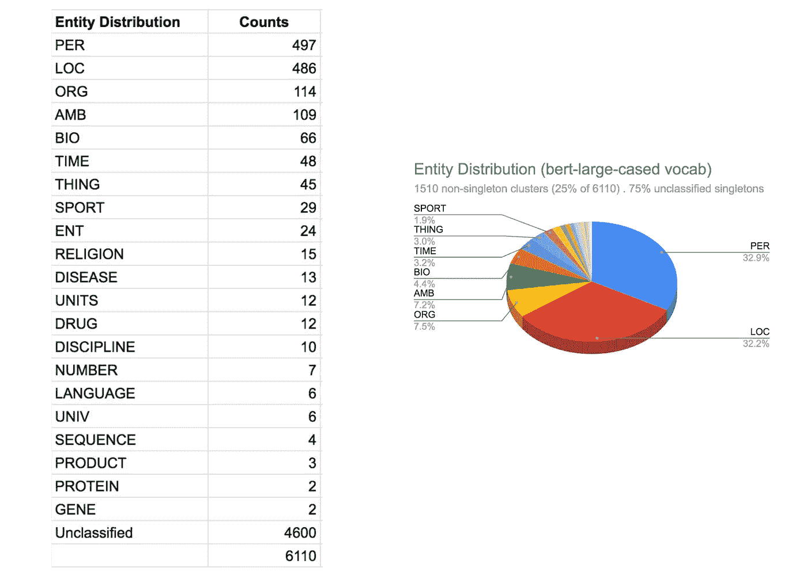*

***图 4a。**BERT(BERT-large-cased)词汇中簇的实体分布。大部分实体集中在人员、位置和组织中。AMB 指的是在给定簇中的术语的情况下不明确的簇。例如，如下图 4b 所示，7 个聚类在人和位置之间具有模糊性。其他人在人、物、运动/生物等方面有歧义。当我们想要发现特定领域的实体类型时，使用自定义词汇表将是有价值的——这可能会消除对个人、位置和组织的偏见。*

*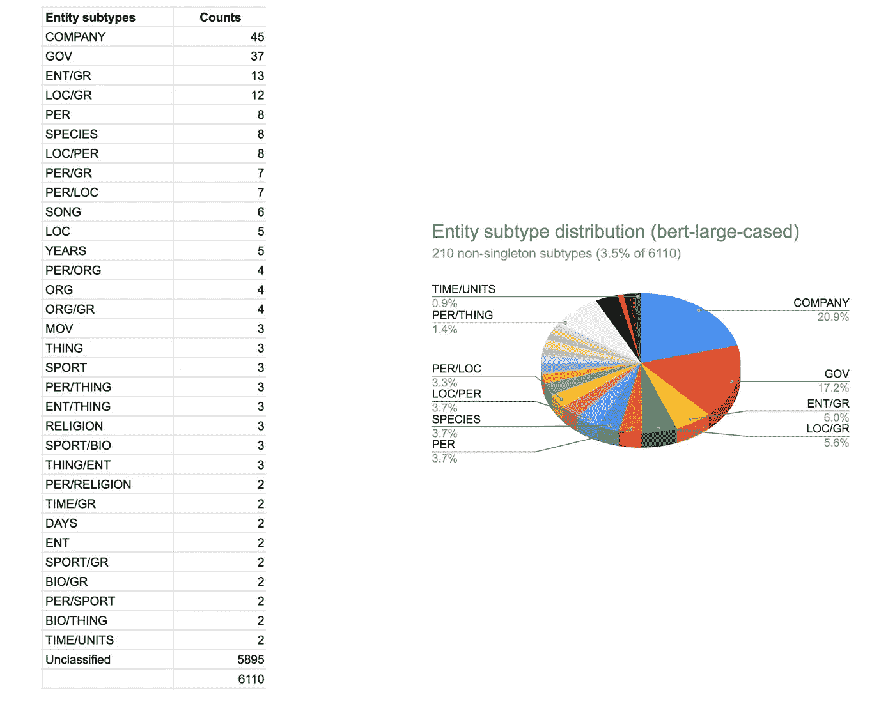*

***图 4b。**BERT 词汇中的实体子类型分布。这些是图 4a 中主要类型的细粒度实体子类型。*

*从 BERT 词汇表中获得的上下文无关聚类的例子*

*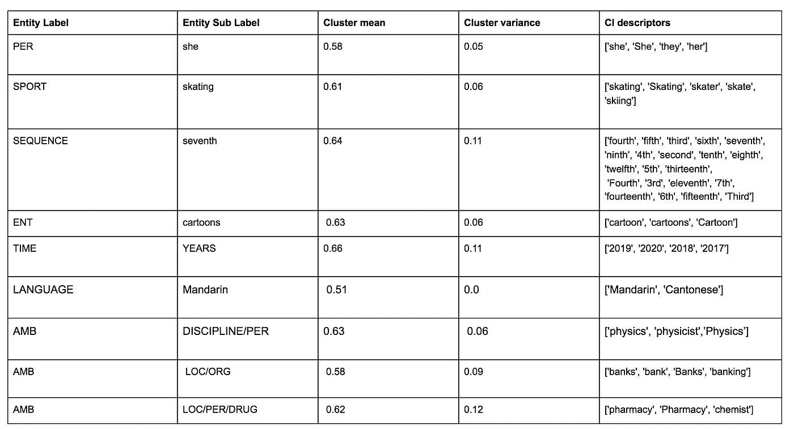*

***图 4c。**来自 BERT 词汇表的聚类示例(bert-large-cased)。不明确的上下文不敏感聚类被标记为 AMB。当子词被考虑用于聚类时，附加注释显示子词聚类(尽管对于本文中的实体识别结果，它们被过滤掉了)*

## *每个输入句子的实体预测*

*执行这些步骤来标记输入句子中的术语。*

## *第三步。最小预处理输入句子*

*给定一个输入句子来标记实体，对输入进行非常简单的预处理。其中之一是大小写规范化——全大写的句子*(通常出现在文档标题中)*被转换为小写，同时保留每个单词中第一个字母的大小写。这有助于提高下一步检测短语跨度的准确性。*

```
*He flew from New York to SFO
          *becomes*
He flew from New York to Sfo*
```

## *第四步。识别句子中的短语跨度*

*一个 POS tagger *(经过理想训练也能处理所有小写单词句子)*用于标记输入句子。这些标签用于识别短语以及大写每个名词短语的第一个字母。*

```
*He flew from **New York** to **Sfo***
```

*标记为名词形式的术语在上面用粗体表示。BERT 的屏蔽词预测对大小写非常敏感，因此使用一个好的词类标记器来可靠地标记名词形式，即使只是小写也是标记性能的关键。例如，下面句子的屏蔽预测通过改变句子中一个字母的大小写来改变实体意义*

```
*Elon **M**usk is a ____
**CS Predictions:** politician musician writer son student businessman biologist lawyer painter memberElon **m**usk is a ____
**CS Predictions:** brand Japanese beer German common Turkish popular French Russian Brazilian*
```

**顺便说一句，BERT 的屏蔽预测仅对于检测实体类型(上面第一个例子中的* ***人*** *)是可靠的，对于事实上准确的预测是不可靠的，尽管事实上 BERT 可能偶尔做出事实上准确的预测。**

## *第五步。使用伯特的 MLM 头来预测每个屏蔽位置*

*对于句子中的每个名词术语，生成一个包含该术语的句子。使用伯特的 MLM 头来预测屏蔽位置的上下文敏感签名。*

```
*He flew from __ to Sfo
**CS Predictions:** Rome there Athens Paris London Italy Cairo here Naples EgyptHe flew from New York to ___
**CS Predictions:** London Paris Singapore Moscow Japan Tokyo Chicago Boston France Houston*
```

*找到这些节点相对于集合中其他节点的强度，就像我们在图 2 中找到枢轴节点一样。按实力排序。这给出了单词嵌入的嵌入空间中的 CS 预测的重新排序列表。重新排序将共享实体意义的术语集合在一起，尽管重新排序是在独立于上下文的单词嵌入的嵌入空间中进行的。例如，下面第一个例子中的重新排序将术语“there”和“here”*(空白位置的有效上下文敏感预测)*推到最末尾。我们将在下一步中挑选这些重新排序的节点的顶部 k (k ≥ 1)。*

```
*He flew from __ to Sfo
**CS Predictions:** Rome there Athens Paris London Italy Cairo here Naples Egypt
**CI space ordering of CS predictions**: Rome Paris Athens Naples Italy Cairo Egypt London there hereHe flew from New York to __
**CS Predictions:** London Paris Singapore Moscow Japan Tokyo Chicago Boston France Houston
**CI space ordering of CS predictions**: Paris London Tokyo Chicago Moscow Japan Boston France Houston Singapore*
```

## *第六步。查找上下文相关签名和上下文无关签名之间的紧密匹配*

*产生合理结果的一个简单的紧密匹配函数是，从前一项中仅选取上下文敏感签名的一个中枢节点，并与上下文无关签名集中的所有 6000+中枢做该项的点积，然后对它们进行排序以获得实体标签候选。在这种情况下，紧密匹配功能实质上是寻找与上下文敏感聚类中枢最近的上下文不敏感聚类中枢。除了顶部支点，我们还可以采用顶部 k 个支点来提高标记/预测的可信度*(图 5)* 。*

*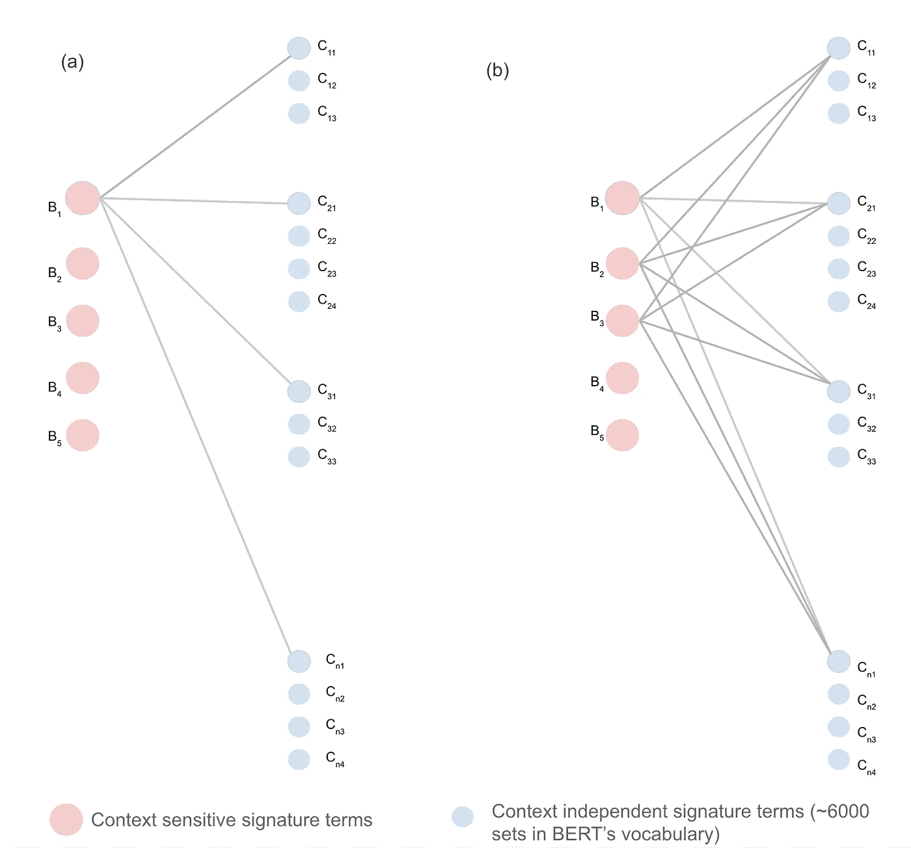*

***图 5** 。单词嵌入空间中上下文相关签名和上下文无关签名的紧密匹配。(A)紧密匹配的简单实现是上下文敏感签名的中枢节点和上下文无关签名中集合的中枢之间的点积。**在这种情况下，紧密匹配功能实质上是寻找与上下文敏感聚类中枢**最近的上下文不敏感聚类中枢。更好的实现是基于上下文敏感签名中的节点的平均值和标准偏差来决定被认为是中枢的节点的数量，然后选择要在二分图中考虑的中枢的数量，以找到与每个上下文敏感聚类中枢最近的上下文不敏感聚类中枢。(b)示出了对于上下文敏感的和仅一个节点上下文无关的项，计数为 3 的情况(奇数可能是打破平局的更好选择；此外，我们不需要上下文不敏感集合中的 3 个节点，因为它们是紧密的集群，平均偏差为 0.007，如我们之前看到的)。在计算中使用来自上下文敏感签名的所有节点不太可能产生好的结果，因为上下文敏感节点中的平均标准偏差要高得多。这可能是因为当在嵌入空间中评估时，上下文敏感签名扩展到更大的区域，甚至当捕获单个实体类型时。*

*仅具有上下文敏感签名的顶部中枢的标签预测如下所示。标签和用户标签如下所示。*

```
*He flew from __ to Sfo
**CI space ordering of CS predictions**: Rome Paris Athens Naples Italy Cairo Egypt London there here **Tags**: Italy Venice Athens Bologna Madrid Carthage Roma Sicily Turin Vatican**User Label** - location location location location location location location location location locationHe flew from New York to __
**CI space ordering of CS predictions**: Paris London Tokyo Chicago Moscow Japan Boston France Houston Singapore**Tags**: London Madrid Geneva Vienna Bordeaux Chicago Metz Athens Cologne Istanbul**User Label** - location location location location location location location location location location*
```

# *评估结果*

*该模型在两个数据集上进行评估:( 1)具有要标记的三种实体类型(人、位置、组织)的标准数据集 CoNLL-2003，以及(2)具有大约 25 种实体类型的维基文本数据集。*

*在 CoNLL-2003 数据集中，所有三种数据类型的平均 F1 分数*(PER-81.5%；LOC-73%；ORG—66%；MISC-83.87%)* 仅为 76%。这是由于两个原因。*

*   *在测试数据的很大一部分中，CoNLL 中的文本结构不是完整的句子——它是板球比分的简洁报告，没有规则的句子结构。由于该模型没有对句子进行预训练或微调，因此它很难预测这些非分布句子中的屏蔽词。在实践中，这可以通过预训练或至少在新的句子结构上微调模型来减轻*
*   *测试数据将许多来自特定位置的团队标记为一个位置。该模型几乎总是将它们标记为位置，而不是团队名称(org)。使用这种无监督的 NER 方法，这个问题没有简单的解决方案。它将只使用最自然地匹配屏蔽位置的实体描述符来标记术语。它不能用不能使用其描述符映射的人工标签来标记术语。虽然从一个角度来看，这可能被认为是一个缺点，但这也是该模型的关键优势——它用来标记屏蔽位置的描述符自然地出现在它被训练的语料库中——它不是从无关的人类标记源学习的。将这些描述符映射到用户定义的标签可能是一种方法，但它可能不是一种干净的解决方案*(例如，在上述将位置描述符视为组织和位置的模糊标签的情况下)**

*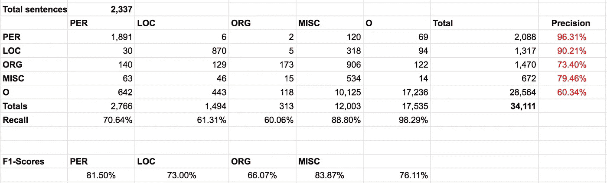*

***图 5a** 。CoNLL-2003 结果*

*在小测试数据上的模型性能是大约 97%的平均 F1 分数，但是具有全部自然发生的句子集合和大约 25 种标签类型*

*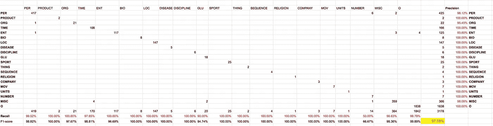*

***图 5b** 。约 25 种实体类型的维基数据结果*

*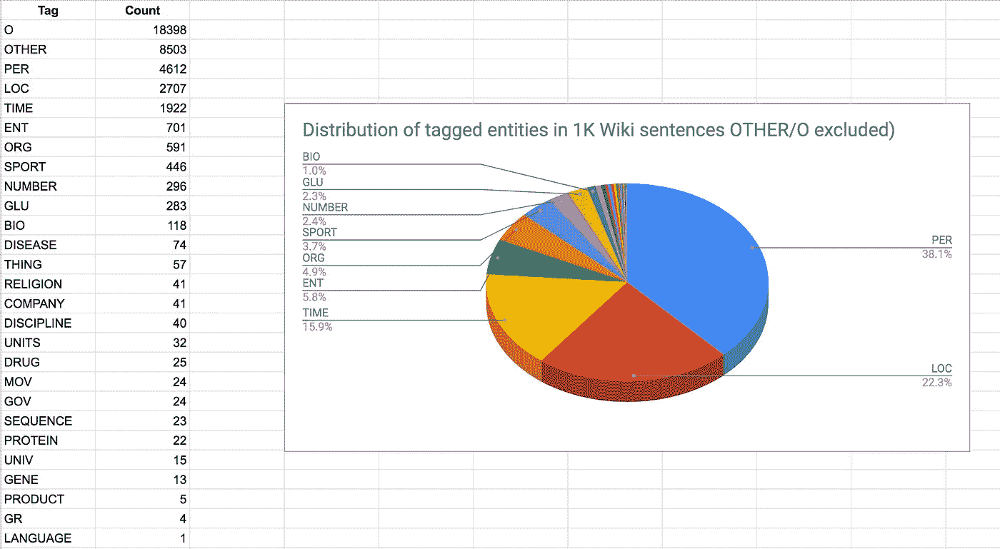*

***图 5c。**维基数据集的实体分布。在这个数据集上，F1 得分的平均表现为 97%。这种方法的一个关键区别是，模型不仅没有使用标记数据进行训练，甚至没有在测试数据集上进行预训练和微调。*

# *这种方法的局限性和挑战*

## *语料库偏倚*

*虽然单个实体预测说明了模型从子词信息中解释实体类型的能力，但实际上，它们只能与具有多种实体类型的句子结合使用。没有太多上下文的单个实体句子对语料偏差很敏感，如下图所示的谷歌和脸书预测。*

```
*Facebook is a __
**CS Predictions**: **joke monster** killer friend story person company failure website faultMicrosoft is a __
**CS Predictions**: company website competitor people friend player Winner winner person brandGoogle is a __
**CS Predictions**: friend website **monster** company killer person man story dog winner*
```

## ***实体预测中的模糊性***

*这种方法产生了两种模糊性*

*   *由上下文不敏感描述符表征的实体类型中的模糊性*(图 4c 中的示例)*。包含*“银行、银行、银行、银行”*的集群可以代表一个组织或位置。然而，在大多数情况下，当通过实体类型的多数投票将上下文敏感签名与上下文不敏感签名紧密匹配时，即使一些匹配的上下文不敏感签名是不明确的，也可以解决这种不明确性。*
*   *下面描述的第二个歧义更难解决*

*有些句子允许不同的实体类型来填充一个隐藏的术语。例如，在预测下面句子中的实体类型“纽约”时*

```
*He felt **New York** has a chance to win this year's competition*
```

*屏蔽词的实体预测可以是暗示*人*的词，这是如下所示的有效预测*

```
*He felt __he____ has a chance to win this year's competition*
```

*模糊性是由于屏蔽而产生的，在大多数情况下，可以通过确定被屏蔽的术语本身的实体类型(纽约)来解决。*

```
*New York is a _____**CS Predictions:** city town place City capital reality square country dream star*
```

*然而，在某些情况下，甚至被屏蔽的术语也是含糊不清的，使得确定实体具有挑战性。例如，如果原句是*

```
*He felt **Dolphins** has a chance to win this year's competition*
```

*海豚可以是一个音乐团体或运动队。*

*这些挑战在很大程度上可以通过多种方法来解决*

*   *在特定领域语料库上微调模型可以帮助减少特定领域实体类型中的歧义。例如， BERT 预训练中的 BRAF *(这是一个基因)在其签名中没有基因意义，而基因意义存在于生物医学语料库上微调的模型中。**

```
*BRAF is a _____
**CS Prediction**: British German new standard the variant name version World worldIn a model fine tuned on a biomedical corpus, 
BRAF is a _____
**CS Prediction**: protein gene kinase structural non family reaction functional receptor molecule*
```

*   *用自定义词汇表从[开始预训练模型可以帮助解决实体歧义，更重要的是还可以提高实体标记性能。BERT 的默认词汇丰富，包含全词和子词，用于检测实体类型，如人员、位置、组织等*(图 4a 和 b)* 。然而，它在获取生物医学领域的全部和部分术语方面存在缺陷。比如像*IMA****tinib****、nilo****tinib****、dasa****tinib***这样的药物的标记化，不考虑常见的子词*【tinib】*。伊马替尼标记为 *i ##mat ##ini ##b* ，而达沙替尼标记为 *das ##ati ##ni ##b* 。如果我们在生物医学语料库上使用](/pre-training-bert-from-scratch-with-cloud-tpu-6e2f71028379)[句子片段](https://github.com/google/sentencepiece)创建自己的词汇，我们会得到 *im ##a ##tinib* 和*d # # as # # a # # tinib*——捕捉常见后缀。此外，自定义词汇包含来自生物医学领域的完整单词，更好地捕捉生物医学领域的特征。例如像*先天性、癌症、致癌物、心脏病专家等词语*。在默认的 BERT 预训练模型中不存在。默认 BERT 词汇中的人称、位置的优势被专有名词和子词所取代，这些专有名词和子词在生物医学语料库中捕捉药物和疾病状况。此外，从生物医学语料库中提取的定制词汇具有大约 45%的新完整词，其中只有 25%与公开可用的 BERT 预训练模型的完整词重叠。当微调 BERT 模型时，有一个选项可以添加 100 个自定义词汇，但不仅数量很少，默认的 BERT 词汇(如前所述)严重偏向某些实体类型，如人员、位置、组织等，如图 4a 所示。*

```
***Token:**            imatinib             dasatinib
**BERT** (default):   i ##mat ##ni ##b     das ##ati  ##nib
**Custom**:           im ##a  ##tinib      d ##as ##a ##tinib*
```

# *最后的想法*

*NER 是一个从输入句子到对应于句子中术语的一组标签的映射任务。传统上，模型被训练/微调以使用标记数据作为监督任务来执行该映射。这不考虑利用像 BERT 这样的预训练模型，该模型在语料库上无监督地学习。*

*这篇文章描述了一种在无监督的情况下执行 NER 的方法，而不需要对用屏蔽语言模型目标无监督训练的预训练/微调 BERT 模型进行任何改变。除了矢量处理的最后阶段使用传统算法*(聚类和最近邻居)*来确定 NER 标签之外，这是通过仅端到端地对学习到的分布式表示(矢量)进行操作来实现的。此外，与来自顶层的向量用于下游任务的大多数用例相反，BERT 对屏蔽句子的输出仅用作种子符号信息，以在算法上对其自己的最低层(其单词嵌入)进行操作，从而收获句子的 NER 标签。*

*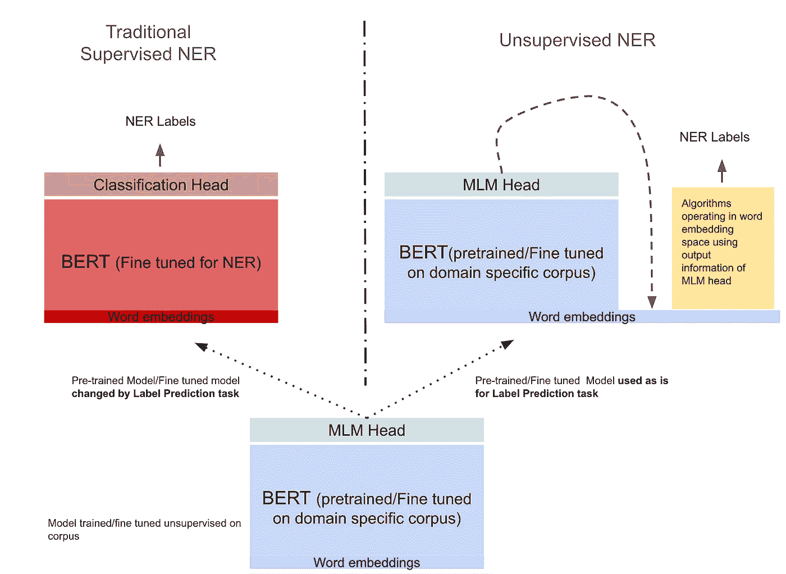*

***图六**。传统的有监督的 NER(左图)与本文描述的无监督的 NER(右图)形成对比。传统上，NER 一直是一项受监督的标签映射任务，其中模型被训练/微调以执行该任务(左侧路径)。相比之下，对于无监督的 NER，按原样使用用屏蔽语言模型目标无监督训练的预训练/微调模型，并且模型的输出被用作播种信息，以在算法上对 BERT 模型的最低层(其单词嵌入)进行操作，从而收获句子的 NER 标签。*

*总之，执行 NER(传统上是监督学习任务)所需的所有信息已经存在于非监督的 BERT 模型中，其关键部分作为单词嵌入驻留在其最低层中。*

*上述无监督 NER 的原型实现可在 [Github](https://github.com/ajitrajasekharan/unsupervised_NER.git) 上获得*

# *相关作品/参考文献*

*[https://homes.cs.washington.edu/~eunsol/open_entity.html](https://homes.cs.washington.edu/~eunsol/open_entity.html)这篇 2018 年的论文使用远程监督来执行实体识别。[细粒度标签](http://nlp.cs.washington.edu/entity_type/slides.pdf)是为训练模型众包的。*

*[https://www.aclweb.org/anthology/N19-1084.pdf](https://www.aclweb.org/anthology/N19-1084.pdf)。本文使用监督多标签分类模型对超过 10，000 个自由类型执行细粒度的实体分类*

*命名实体识别一直是一个被广泛研究的问题，迄今为止，arXiv 中约有 [400 篇论文，Google scholar *(自 2016)*](https://arxiv.org/search/?query=named+entity+recognition&searchtype=all&source=header) 中有~[50000 个结果。](https://scholar.google.com/scholar?as_ylo=2016&q=named+entity+recognition&hl=en&as_sdt=0,33)*

*[检查 BERT 的原始嵌入](/examining-berts-raw-embeddings-fd905cb22df7)*

# *附加注释*

## *贝茨·MLM·海德—快速回顾*

*伯特的 MLM 头本质上是伯特模型，上面堆叠了一个单一的变换层。下图显示了带有 9 个标记的句子的 BERT 输出*(标记化后)*，是一个 9 x 768 矩阵*(768—BERT 基本模型的维度)。这穿过了 MLM 头部的致密层。对具有所有 28，996 个字向量的 9x768 输出执行点积，以找出句子中某个位置的向量输出与 28，996 个字向量有多相似。对于屏蔽的位置，这产生了在该位置的标记的预测。在训练/微调模式中，掩蔽位置的预测误差被反向传播到模型中，一直向下传播到嵌入*(解码器权重和嵌入层权重是相同的)。*在推理模式中，嵌入用于表示标记化的文本，以及在头的顶层输出逻辑。**

*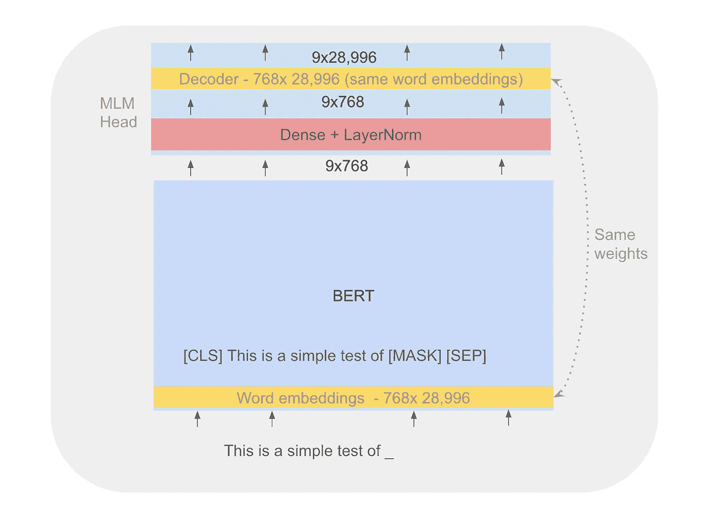*

***图 7。**伯特的 MLM 头像— *显示一个 9 个单词的符号化输入流过模型及其 MLM 头像。解码器使用来自嵌入层的相同向量(在代码中绑定权重，但单独驻留在 pytorch.bin 文件中)。**

## *这种方法的性能*

*对于像这样的句子，*

**

*在使用 BERT 的典型监督方法中，通过将整个句子发送到微调的 BERT 模型一次，将获得如下所示的 NER 输出标签 *(B_PER，I_PER，O…)**

*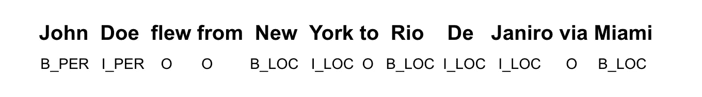*

*本帖中描述的无监督 NER 方法要求我们将上述句子传递给一个 MLM 负责人四次，以识别四个实体——John Doe、New York、Rio De Janiro 和 Miami *(前面描述的这四个实体位置由 POS tagger 与 chunker 协同识别)*。*

*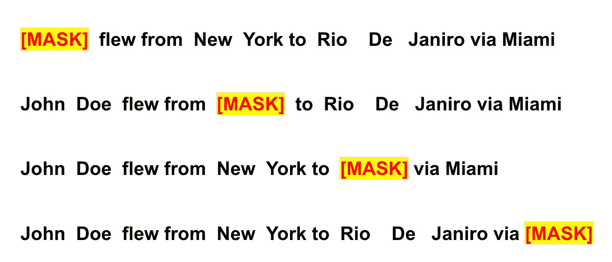*

*具体来说，下面句子的 4 个标记化版本将被传递到 MLM 模型中*

*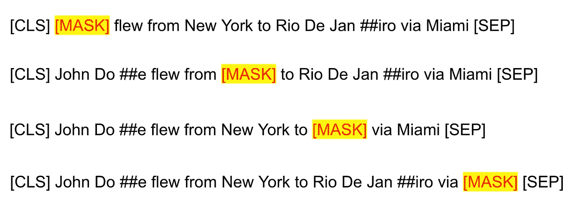*

*以检索每个屏蔽位置的上下文敏感签名，然后将其与上下文不敏感签名进行匹配，以产生每个位置的实体预测，如下所示。*

*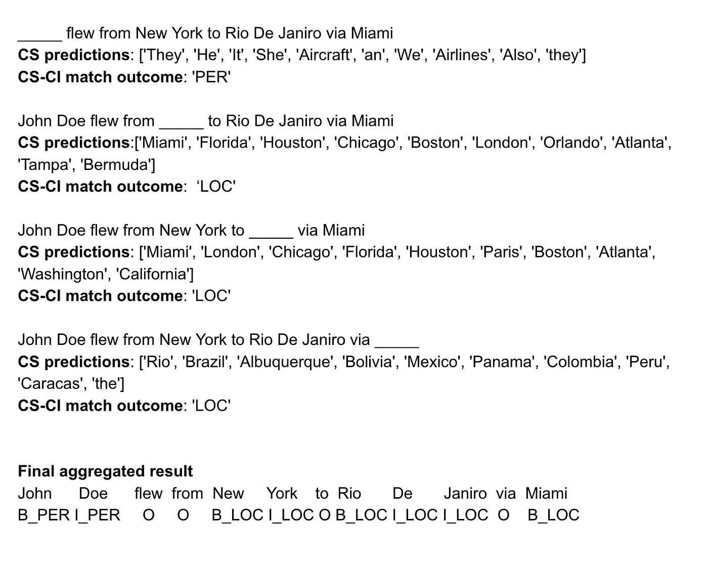*

*尽管原则上我们可以一次检索输入句子中每个单词的 MLM 上下文敏感签名，但实际上我们必须将句子的屏蔽版本分别发送到 MLM 模型以确定实体类型，因为不清楚是否有一种方法来组合对跨越多个单词的短语或子词的上下文敏感预测， 确定实体类型*(如果原始句子只有单个单词实体，并且这些单词的标记化版本也存在于 BERT 的词汇表中——我们可以一次推断上下文敏感签名)*。 例如，部分出现在词汇中的短语，如 *New York* ，以及分解为子词的单词，如*Imatinib-I # # mat # # ini # # b*。使这个问题复杂化的是具有不同默认含义的子词，例如伊马替尼中的*I-I # # mat # # ini # # b，*产生具有高方差的上下文敏感签名。像在子词上的波束搜索这样的尝试产生新的看似合理的单个记号，但是很可能不是基本词汇表的一部分，从而导致上下文敏感签名中的较大差异。鉴于 SpanBERT 具有预测跨度的能力，它似乎是一个可以考虑的选项，但它仍然可以预测屏蔽短语中的每个标记——它不会对屏蔽短语给出一个预测。*

*在实践中，通过并行预测一个句子的所有屏蔽版本，可以解决单个句子的多个屏蔽句子的性能问题。在上面的例子中，被屏蔽的术语占句子中术语总数的 50%——但实际上，平均来看，这个数字要少于这个数字。*如果我们也用一个单独的句子来确认句子中每一项的实体预测，该单独的句子仅包括 from****Term****is a _ _(如句子“Nonenbury is a __”)，那么发送到 MLM 模型进行预测的句子的数量将是该句子中被屏蔽的项的数量的两倍。**

## *引导将标签描述符映射到用户定义的标签*

*如果我们对应用程序中的一组特定实体感兴趣，那么我们可以利用任何未标记的语料库，这些实体主要出现在*

*   *通过模型发送这些句子，并获取模型输出的标签描述符*
*   *通过出现次数对这些描述符进行排序，应该会在顶部产生描述我们感兴趣的实体的描述符。*
*   *我们只需要手动扫描这些描述符，并将它们映射到我们选择的实体标签。*
*   *如果我们用来获取这些标签的未标记语料库真正代表了我们的实体类型，那么这应该覆盖了我们实体的很大一部分*

*这种无人监管的方法*

*   *将特定用例中带有感兴趣实体的句子的标注问题转化为标注代表这些感兴趣标签的上下文不敏感描述符。通过这样做，如前所述，它消除了使用更多标记数据来重新训练模型以处理非分布句子的需要。*
*   *它还利用了一个经过训练的词性标注器来标注任何句子。然而，识别签名和候选描述符的关键部分是由被无监督地训练/微调的 BERT 执行的。*

## *无子词过滤的上下文不敏感聚类统计*

*由于难以为子词找到标签，所以不考虑用子词来创建上下文不敏感的聚类。然而，将它们考虑在内的聚类运行揭示了捕获对某些应用可能有价值的有趣信息的聚类。Bert 大箱模型词汇表有 6477 个子词，其中 1399 个形成了簇中枢。其余的被吸收到 59 个非子词簇中枢 *(2872 个是单态)*。*

*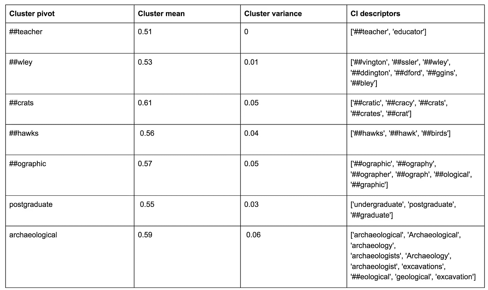*

*将子词作为中枢以及包含子词的其他非子词中枢的上下文不敏感聚类。子词不包括在创建上下文不敏感的聚类中，它们在这里显示只是为了强调一些聚类捕获有趣的可解释信息(其他的不形成实体标记的观点)。*

## *此方法的其他使用案例*

*假设实体类型的确定纯粹是基于一组术语来完成的，那么可以将它用于各种应用程序*

*   *查找两个或多个术语是否属于同一实体类型。分别输入包含这些术语的句子，找到上下文敏感签名，并检查模型输出的标签是否相同/相似*
*   *获取特定实体类型的更多术语。*
*   *当不仅仅局限于标记名词短语时，这种方法的输出可以*(可选地结合词性标记器和依存解析器)*用于为下游监督任务生成标记数据，如分类、关系提取等。在某些情况下，如果不替换被监督的任务本身，至少可以创建一个基线。*

*【2021 年 2 月更新。对术语*(或一般短语)*(如“Nonenbury”)的实体类型预测可以使用术语*的[CLS]表示来完成(假设模型已经在下一个句子预测任务中训练好)*。这种方法可以与上面文章中描述的上下文不敏感预测一起使用—使用合成句子“Nonenbury is a ____”预测实体类型。*

**这篇文章是从* [*Quora*](https://qr.ae/Tf8hlX) 手工导入的*