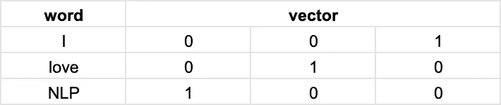
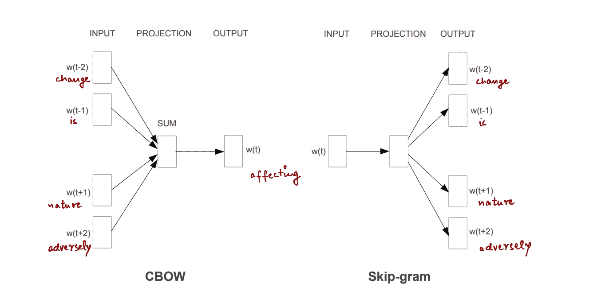
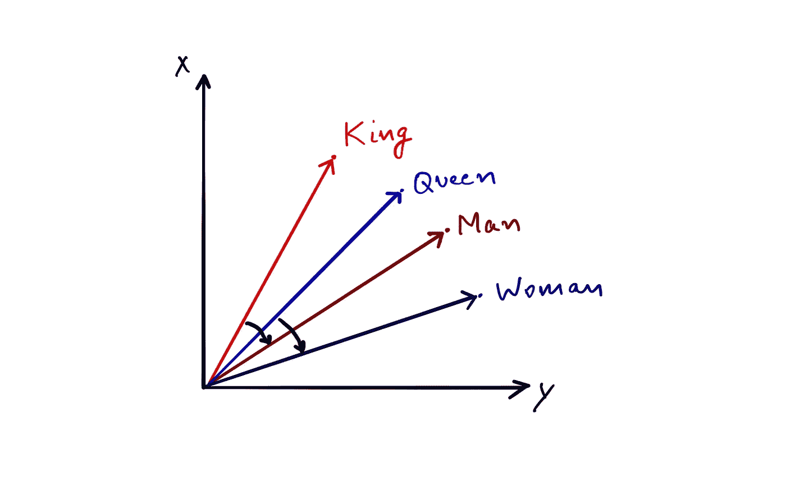
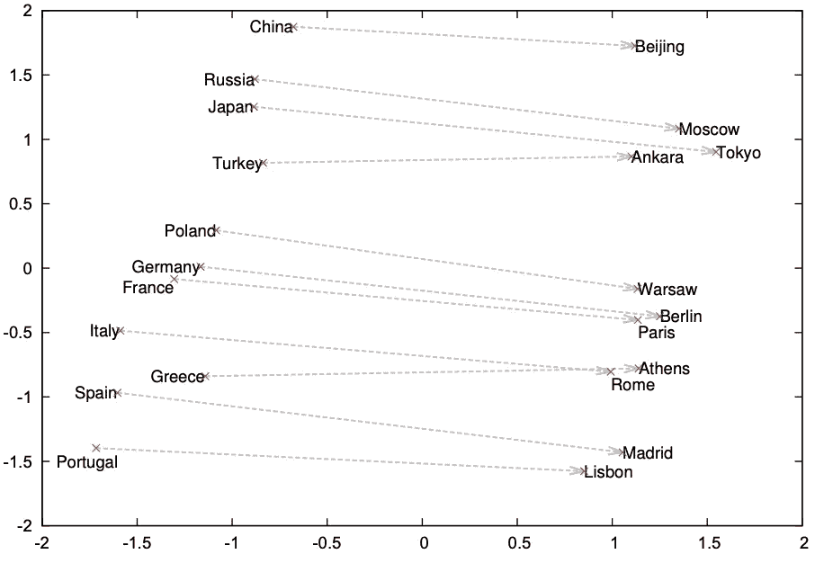
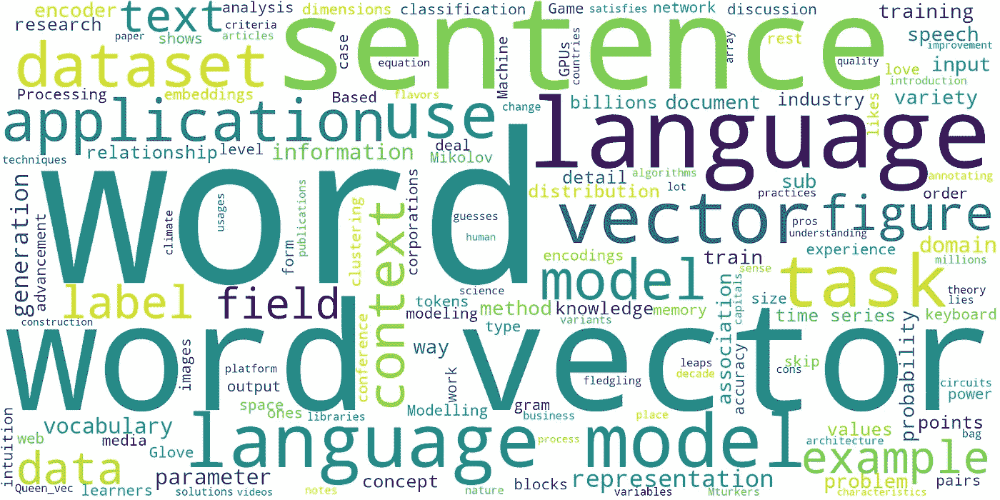
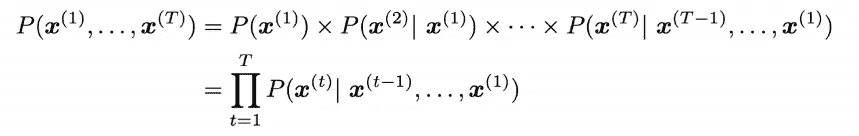
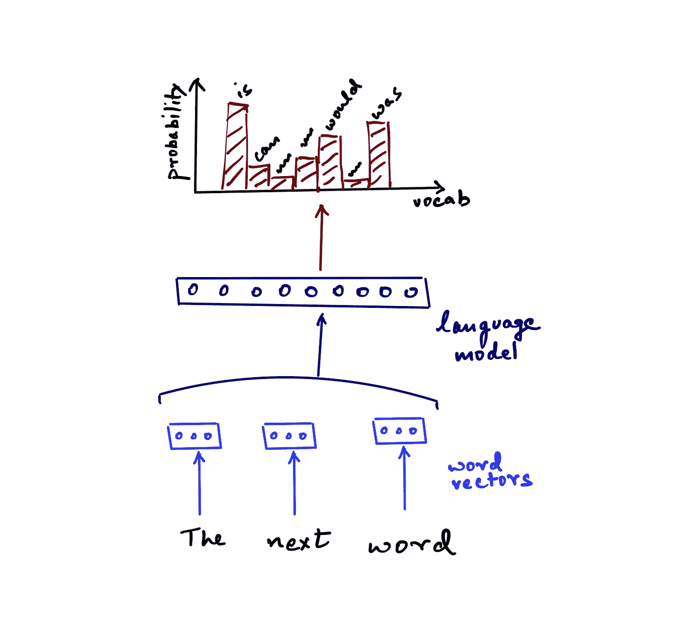
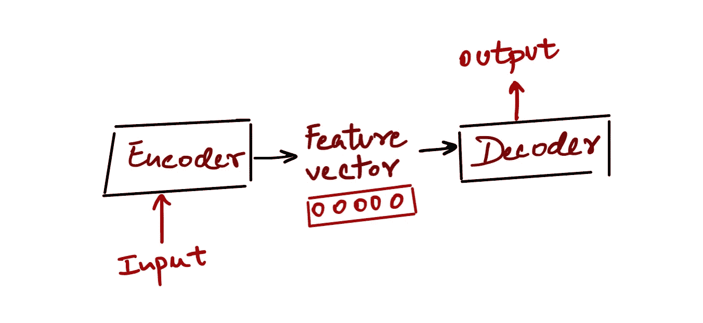
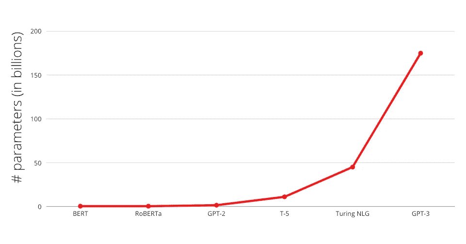

# 无监督的自然语言处理:处理非结构化文本背后的方法和直觉

> 原文：<https://towardsdatascience.com/unsupervised-nlp-methods-and-intuitions-behind-working-with-unstructured-texts-b84aa4d286da?source=collection_archive---------16----------------------->


由 [Raphael Schaller](https://unsplash.com/@raphaelphotoch?utm_source=medium&utm_medium=referral) 在 [Unsplash](https://unsplash.com?utm_source=medium&utm_medium=referral) 拍摄的照片

> tldr 这是自然语言处理中非监督技术及其应用领域的入门书。它始于单词向量背后的直觉，它们的使用和进步。这就演变成了关于语言模型的详细讨论的中心阶段——介绍、在行业中的积极使用以及不同用例的可能应用。

在新兴但先进的自然语言处理(NLP)和自然语言理解(NLU)领域，无监督学习占据着精英地位。这是因为它满足了一个令人垂涎的科学领域的两个标准——它无处不在，但同时理解起来又相当复杂。

我将尝试把我在这个领域的经验和知识分解成简单的块，希望你能更多地了解这个领域，甚至更多地了解——对解决和处理 NLP 问题有更好和更结构化的直觉。

我的工作主要是处理无监督的数据集，即没有标签或目标变量的数据集。在这个行业中，经常会出现这样的情况:你首先收到一个业务问题，然后头脑风暴，想出可能的解决方案。有时，您会提出创新的数据集和标签来解决您的问题。通常，标签是不存在的，你要么与 Mturkers 打交道(*为门外汉，* [*Mturk*](https://www.mturk.com/) *是一个众包数据注释平台*)，要么在没有任何标签的情况下解决问题，即使用无人监督的技术。

让我们深入到单词向量和语言模型这两个最基本、最普遍的子领域。除了介绍基本概念和理论，我还将包括我个人经验中关于最佳实践、实际和工业应用以及相关图书馆的优缺点的笔记。

# 词向量

## 为什么是单词的向量？

将单词表示为向量——50-300 个浮点值的数组是 NLP 中最大的飞跃之一，也是最容易理解的一个。

在现在无处不在的单词向量出现之前，词汇表中的单词是使用传统的[单键向量编码](https://en.wikipedia.org/wiki/One-hot)进行矢量化的，如下所示。该图示出了在句子“我爱 NLP”中包含 3 个单词的词汇的单热点向量。这种方法在 TF-IDF 等 ML 算法中仍被广泛使用，在数字电路中也很普遍。



图片作者:one-hot 编码:这里的单词“love”由向量[0，1，0]表示

在过去十年之交，单词向量模型随着 word2vec[1]和 Glove[2]等出版物的出现而出现。有了它们，NLP 领域很快转变为几乎所有可能的任务都采用它们。

## 单词向量是如何训练的？

词向量模型有两种风格——跳格模型和连续词袋(CBOW)模型，如下图所示。这两个模型基本上都基于相同的基本原则——关于一个单词的信息存在于它在中使用的上下文中。例如，“男人”和“女人”这两个词用在非常相似的上下文中，比如“男人可以做某事”和“女人可以做某事”。这些上下文，超过数百万个句子和数十亿个标记，通过模型学习概括为“男人”和“女人”在用法上是相关的，而“男人”与“他/他”相关联，“女人”与“她/她”相关联。因此，在大型数据集上，基于这些在各种句子中使用形成的关联，词向量开始变得很有意义。

CBOW 体系结构试图根据上下文猜测当前单词，而 Skip-gram 猜测给定当前单词周围的单词。例如，在句子中——“气候变化正在对自然产生不利影响。”在给定的上下文中，CBOW 模型将试图预测影响的单词*，即句子中的其他单词。下图说明了这两种方法。*



来自出版物的基本图像— [向量空间中单词表示的有效估计[1]](https://arxiv.org/pdf/1301.3781.pdf) :用于训练单词向量的模型变量。

当你在一个包含网络文章等内容的大型数据集的数十亿个标记上训练这样一个模型时，你得到的是一个向量形式的词汇表中每个单词的非常有效的表示。这些向量可以是 300 维长，即每个单词由 300 个实数表示。解释这些向量的最著名的例子如下图所示。



作者的图像:一个例子说明了二维可视化时的词向量。

根据该图，下面的矢量方程应该成立:

```
King_vec - Man_vec ~= Queen_vec - Woman_vec
```

或者基本上，换句话说，向量为这些对投射相似的关系。



图片来自出版物—[https://papers . nips . cc/paper/5021-distributed-presentations-of-words-and-phrases-and-they-composition ity . pdf](https://papers.nips.cc/paper/5021-distributed-representations-of-words-and-phrases-and-their-compositionality.pdf):展示不同国家与其首都之间关系的二维单词向量

词向量可以展示在现实世界应用中有用的有趣特征。有了单词向量，机器能够以更像人类的方式理解和处理文本。这种对文字和一般文本的理解延伸到其他形式的媒体，如语音、图像和视频，这些媒体通常首先转换为文本，然后进行进一步处理。稍后将详细介绍。

## 子词嵌入

在 2017 年发表的一篇论文[3]中，词向量的表示质量有了巨大的提高。这种新方法利用所谓的子词嵌入来构建向量。通过将一个单词分解成子单词或字符 n-grams，关注单词的形态学。我们以“哪里”这个词为例。取 n=3，它被分解为以下 n 元文法:

```
where -: <wh, whe, her, ere, re>
```

然后这些子词向量被组合以构建词的向量。这有助于更好地学习语言中单词之间的联系。想象一下，我们是在更精细的尺度上学习。这有助于学习词汇内部的现象。例如,“cat”和“cats”之间的区别类似于“dog”和“dogs”这样的词对。同样，“男孩”和“男朋友”的关系与“女孩”和“女朋友”的关系相同。这种方法还有助于为模型在训练集中尚未看到的 OOV(不在词汇表中)单词创建更有意义的表示。

## 词向量有什么用？

在我的另一篇[文章](https://medium.com/swlh/nlp-all-them-features-every-feature-that-can-be-extracted-from-text-7032c0c87dee)中，我会更详细地讨论词向量的应用。简而言之——词向量对于快速计算非常有用，尤其是在计算资源有限的情况下。在各种语料库(新闻、网络、Twitter 和 Reddit 等社交媒体)上找到预先训练好的词向量很容易。您可能希望使用在最接近您的应用数据集的数据集上训练的词向量。例如，twitter 数据集上训练的单词向量将不同于新闻文章上训练的单词向量。

单词向量可用于构建单词或句子的向量，用于相似性或聚类任务。即使像为数据集绘制单词云这样简单的任务也是分析数据集的一种强大方法。然而，单词向量的真正力量是通过语言建模释放出来的。



作者图片:由这篇博客文章生成的文字云

# 语言模型

## 什么是语言模型？

语言建模是所有无监督 NLP 任务的主要工具。根据定义，[维基百科](https://en.wikipedia.org/wiki/Language_model)恰当地将语言模型定义为:

> 统计语言模型是单词序列的概率分布。

因此，用更简单的话来说——语言模型用于捕捉和预测一个句子或一个文档中单词之间的关系。基本上，语言模型预测句子中下一个单词的条件概率分布，由下式给出:-


使用这个，一个句子出现的概率由下式给出:-



长话短说，语言模型用于学习数据集中的单词关联，以便它可以用于预测句子中的下一个单词，或句子的有效性-根据它从训练数据集中学习到的分布，这个句子出现的可能性有多大。所以一个模特可以说“嗨，你好吗？”比起像“嗨，晚安！”这样古怪的话，这是一个更可能的英语句子。


作者图片:语言模型在电话键盘应用中被用来预测下一个单词。

如上图所示，在语言模型的一个最明显的用途中——键盘应用程序在我们打字时提示下一个单词。这也是自动更正的工作方式。让我们使用下图更详细地看看这是如何发生的。



作者图片:语言模型的工作图

句子的单词或上下文被转换成单词向量。这些作为语言模型的输入，语言模型本质上是基于时间序列的神经网络。最后，我们得到词汇表中所有单词的概率值，即某个特定单词有多大可能适合作为给定输入上下文的下一个单词。实际上，词汇表是巨大的(~300k 或更多)，这些输出概率只对几十个单词有意义，而其余的值很小(如 0.00001)。

## 体系结构

从体系结构上来说，语言模型有两个主要部分——编码器和解码器。顾名思义，编码器用于使用时间序列神经网络模型对输入(词向量)进行编码。对于时间序列，我的意思是该模型考虑了单词在句子中的位置顺序，其中单词 _2 在单词 _1 之后。另一方面，解码器与编码器相反，它使用编码器的输出(特征向量)来输出单词，一次一个单词，在循环到结尾时完成一个句子。这是一些深层的架构性的东西，除非你自己编码，否则你可能不需要。只是一个很好的了解术语，否则。



作者图像:语言模型的典型结构

## 语言模型的应用

我们讨论的是一个基本的开箱即用的语言模型。语言模型可以在无监督的环境中以多种方式使用。让我们看看一些更受欢迎的:

*   **向量化**把一个句子变成一个向量。这是一种比任何平均单词向量更好的句子矢量化方法。
*   句子/文件**分类**在监督设置下的任务(其中有目标标签)。在这里，操作上-您使用预训练的非监督语言模型来进一步训练(微调)监督分类任务。在没有任何标签的情况下，您可以执行**聚类**来分割数据进行分析。
*   **生成**任务正如我们在前面的图中看到的。句子生成是一个新兴的领域，最近像 GPT 3 这样的人成为头条新闻。对于像广告( [pencil](http://trypencil.com) 、 [persado](http://www.persado.com) )、游戏([ai dungons](https://play.aidungeon.io/))、新闻或文档摘要( [agolo](http://www.agolo.com) )、对话模型、聊天机器人、键盘/谷歌自动完成、问题回答等等这样的任务，生成任务可以从零开始逐代变化。如果你有一个合适的数据集，任何类型的生成都是可能的，就像有人为《权力的游戏》所做的一样。一些高级应用在多媒体设置中使用语言模型，如图像字幕、各种语音到文本和文本到语音任务，如 [Alexa](http://alexa.amazon.com) ，手写识别等等。
*   用于跨语言翻译的机器翻译已经走过了漫长的道路。像[谷歌翻译](https://translate.google.com/)这样的应用程序使用语言模型将语音转换成文本，然后翻译成不同的语言。
*   **信息检索**大型数据集上的任务，如实体解析、基于方面的情感分析、文档标记。一些最强大的应用程序将语言模型与知识库结合使用。

这些是一些受欢迎的。任何顺序消费或生成的数据都可以用语言模型来建模。使用人工智能的音乐生成就是这样一种应用。那里有难以想象的大量应用，而且每分钟都在扩大。随着来自学术界和企业的大量研究，建模能力正在迅速提高。相关任务的艺术状态随着每一次主要人工智能会议的召开而进一步推进——以至于现在很难跟踪整个领域——你现在必须专注于一个或几个前述的子领域。

# 少射和零射学习

人工智能中一个有趣的新生发展是少量学习的概念[4]。这意味着一个经过训练的模型可以通过整合先前的知识，仅用少数几个有监督信息的例子来学习一个新任务。

这是人工智能领域的一个巨大进步，因为传统上，你需要难以置信的大量数据来学习甚至简单的任务。在语言模型的背景下，像 BERT 和 GPT-x 模型这样的预训练模型是在数十亿个令牌(> 100GB 的原始文本数据)上训练的，即使如此，针对特定任务微调这些模型也需要 100 多万个数据点。相比之下，很少尝试的学习者可以利用每个标签的几分来学习新的任务。这个概念提升到了一个全新的水平，即零触发学习，其中使用的不是数据点，而是关于类的元数据级别的信息作为输入。这是一个新的活跃的研究领域，仍处于早期阶段。一旦我们获得了可接受的精度指标，这将是一个非常有前途的领域。

## 参数爆炸

人工智能模型的准确性和有用性与数据集和模型参数大小有直接关系。



作者图片:根据参数大小绘制的各种语言模型

该图显示了 2017–2020 年期间的主要语言模型。参数大小每年都在增加一个数量级——BERT-Large(2018)[5]有 3.55 亿个参数，GPT-2(2019 年初)[6]有 1.5B 个，T5(2019 年末)[7]进一步扩展到 11B，最后 GPT-3(2020 年中期)[4]有 175 亿个。

有了这些，对这些模型的研究和培训的访问已经转移到了像谷歌，OpenAI，微软和脸书这样的大公司。GPT-3 需要 700GB 的 GPU 内存进行训练，远远超过了普通消费级 GPU 的 10-16GB 内存，在 cloud Tesla V100 GPUs 上进行并行训练的成本超过 460 万美元。我们这些凡人只能使用这些巨大的预训练模型的较小版本来完成我们无关紧要的任务。这不一定是一件坏事，也是人工智能进步的必然结果，但考虑到这一基础技术的未来，这是值得我们深思和铭记的事情。

期待听到你的任何评论、讨论，或者任何你想和我分享的想法。

# 参考

[1] Mikolov，Tomas，et al. [向量空间中单词表示的有效估计。](https://arxiv.org/pdf/1301.3781.pdf)

[2]j .潘宁顿、r .索彻和 C. D .曼宁(2014 年 10 月)。 [Glove:单词表示的全局向量。](https://www.aclweb.org/anthology/D14-1162.pdf)载于《2014 年自然语言处理经验方法会议论文集》(第 1532-1543 页)。

[3] Bojanowski，p .，Grave，e .，Joulin，a .，& Mikolov，T. (2017 年)。[用子词信息丰富词向量。计算语言学协会汇刊，5，135–146。](https://arxiv.org/pdf/1607.04606.pdf)

[4]布朗、T. B .、曼、b .、赖德、n .、苏比亚、m .、卡普兰、j .、达里瓦尔、p .……和阿加瓦尔(2020)。[语言模型是一次性学习者。](https://arxiv.org/abs/2005.14165) *arXiv 预印本 arXiv:2005.14165* 。

[5] Devlin，j .，Chang，M.W .，Lee，k .和 Toutanova，k .，2018 年。 [Bert:用于语言理解的深度双向转换器的预训练。](https://arxiv.org/abs/1810.04805) *arXiv 预印本 arXiv:1810.04805* 。

[6]a .、Wu、j .、Child、r .、Luan、d .、Amodei、d .和 Sutskever，I .，2019 年。[语言模型是无监督的多任务学习器。](https://cdn.openai.com/better-language-models/language_models_are_unsupervised_multitask_learners.pdf) *OpenAI 博客*， *1* (8)，第 9 页。

[7] Raffel，c .，Shazeer，n .，Roberts，a .，Lee，k .，Narang，s .，Matena，m .，周，y .，Li，w .和刘，P.J .，2019 年。[用统一的文本到文本转换器探索迁移学习的极限。](https://arxiv.org/abs/1910.10683)arXiv 预印本 arXiv:1910.10683 。