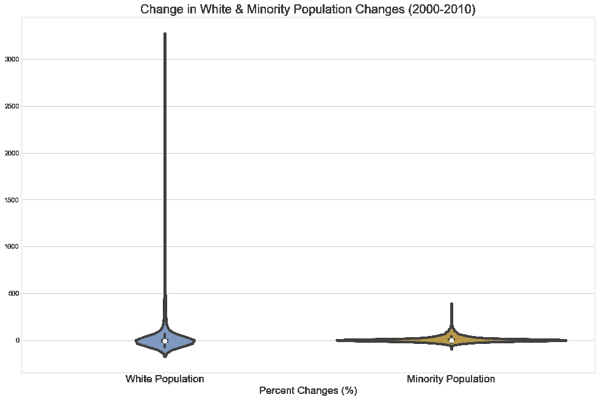
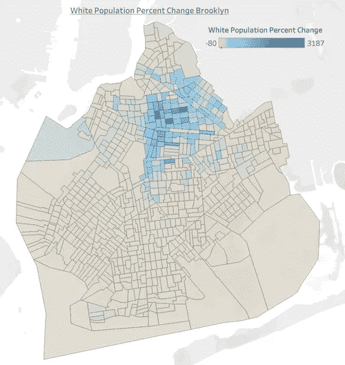
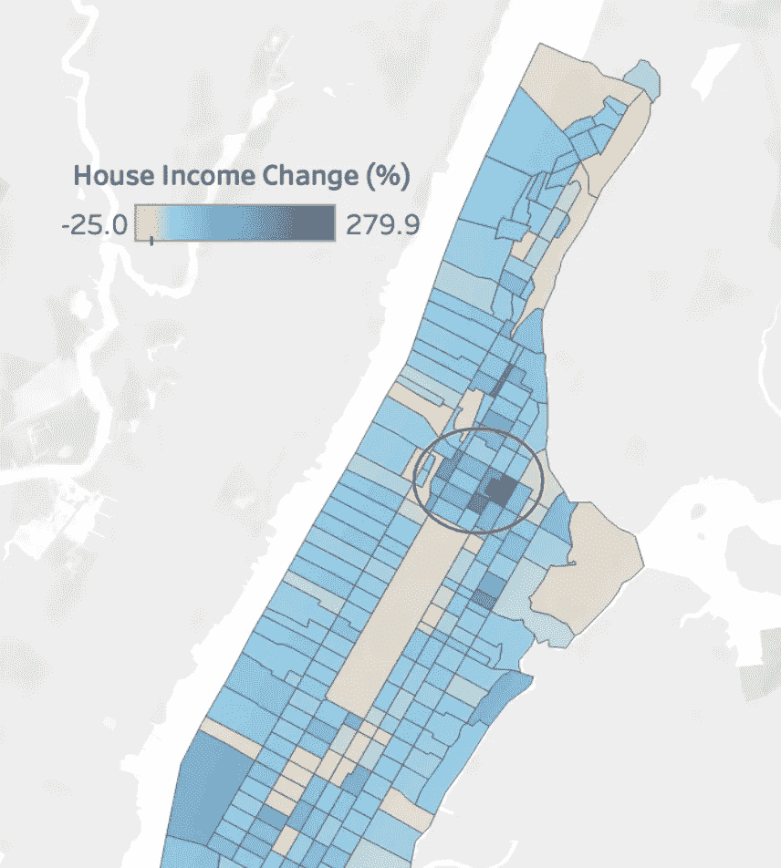
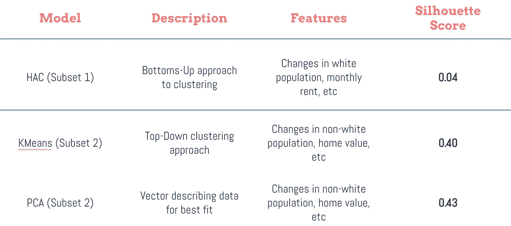
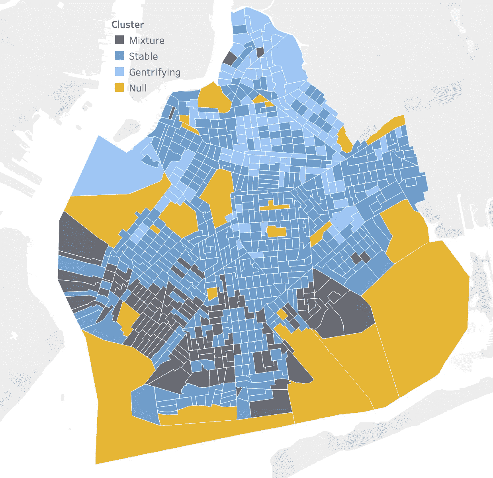
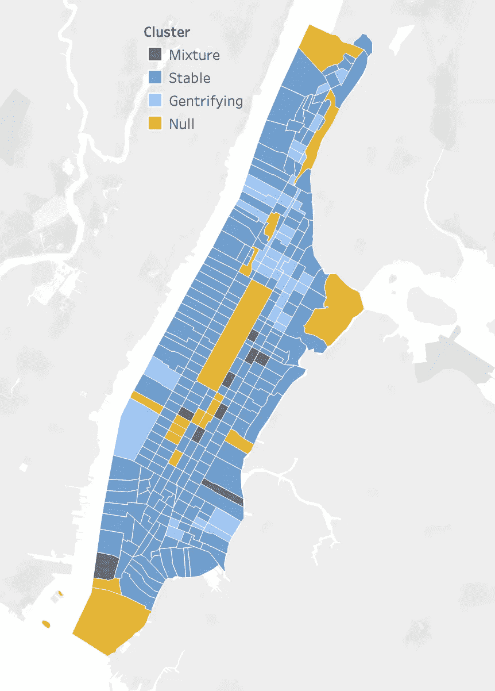
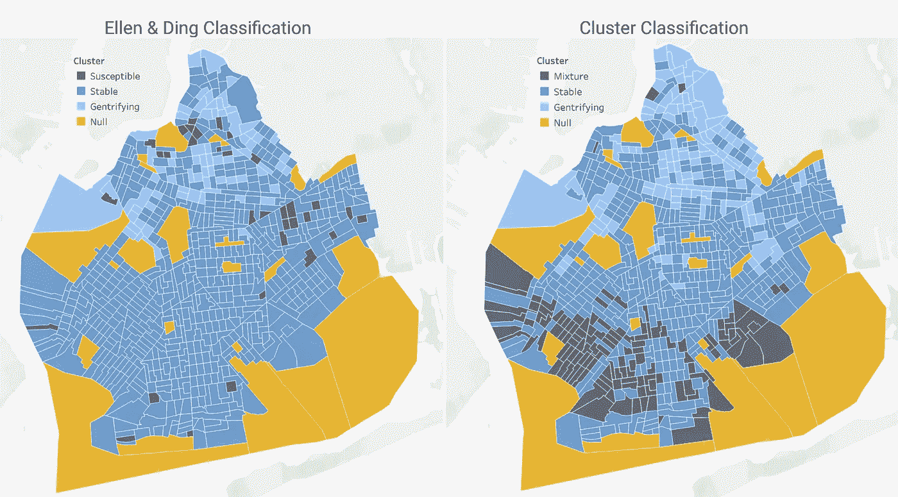
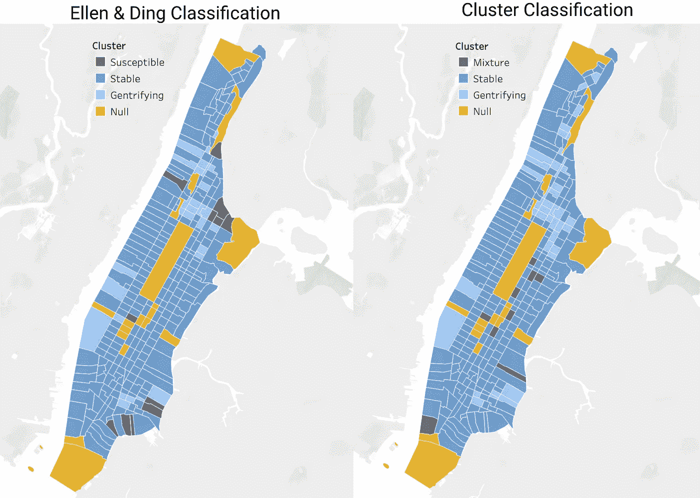

# 无人监管的纽约街头

> 原文：<https://towardsdatascience.com/unsupervised-on-the-streets-of-new-york-ec0f218f8ee8?source=collection_archive---------65----------------------->

## 使用聚类分类更深入地研究人口普查区域的贵族化

米尔蒂亚迪斯·弗拉基迪斯在 [Unsplash](https://unsplash.com/s/photos/brooklyn?utm_source=unsplash&utm_medium=referral&utm_content=creditCopyText) 上拍摄的照片

我在纽约市出生和长大，在 90 年代中后期，我作为一个孩子看到了哈莱姆区从一个压倒性的少数族裔社区变成了今天的中产阶级化的褐色砂石天堂。已有关于邻里关系变化的学术论文，Ellen & Ding (2016)最近的一篇论文是我与我的模型进行比较的基准。

采用数据科学的方法，我想问一个非常具体的问题:

# 机器学习算法能检测中产阶级化吗？

这个项目要理解的最重要的特点是，这是无监督学习。这意味着没有为模型提供目标变量。因此，模型不是预测一个已经决定的结果，而是获取数据并得出自己的结论。最后，我将把它与我引用的学术论文中的发现进行比较。

# 数据

这类工作的最佳数据集是美国人口普查区域数据，通过一些研究，我发现了布朗大学(纵向区域数据库——LTDB)进行的一项关于多样性的研究。该研究收集并汇编了 2000 年、2010 年和 2012 年的人口普查和美国社区调查(ACS)信息。

数据类型自然地被分成两个不同的数据集。人口普查本身包含了一般的人口数据。这包括年龄、家庭规模、种族和民族。调查数据包括更详细的信息——移民身份、就业类型和收入。所有这些特征都包含在四个区的每个人口普查区域中。在识别中产阶级化方面，这两个数据集的组合将是最有效的。该项目以下列方式继续进行。

1.  数据清理和预处理
2.  数据探索
3.  集群创建
4.  与 Ellen & Ding (2016)的定性比较
5.  结论和进一步的工作

# 1.数据清理和预处理

第一步是处理 2000 年美国人口普查数据，第一步是隔离纽约市。我用自己创建的一个助手函数做到了这一点，这样我就不必将函数定义放在代码中。要完全理解这个代码，你需要知道斯塔滕岛不包括在这项研究中。它在种族构成和人口密度方面的显著特征使它成为这个群体中的异类。

因此，通过一个快捷的功能，我能够将纽约市的四个区从美国所有的县中分离出来。接下来是我想要的总人口的百分比。

然后我把数据分成两类，*人*数据，*房*数据。人民方面可以包括文化遗产(即俄罗斯人、波多黎各人、爱尔兰人后裔)，而房屋会告诉我们关于建筑和房屋的细节(即租金与自有、多单元建筑与单户住宅)。

由于中产阶级化意味着变化，因此总计数不会对模型有太大影响。我需要更清楚地了解这些邻里关系的变化，这意味着找出这些比率是如何变化的。我需要找到变化的百分比，为此我需要找到开始日期的百分比。

用总人口数作为分母，我很快做了一个函数来计算有多少人口符合这些子集。这适用于住房和人员子集。这将有助于回答一些更具体的问题。

白人占人口的百分比是多少？非裔美国人？有多少人拥有自己的房子？蓝领工人和白领工人的比例是多少？失业？首先，我必须手工制作这些列表。它们的名字都是唯一的，所以我必须对它们进行排序，但是一旦我这样做了，我就把列名保存为列表。

下面的函数允许我获取百分比，同时删除现在不需要的完整计数列。

2010 年人口普查数据重复了这一过程。然后将两个数据集合并。接下来是最重要的部分，这是整个项目的基础——计算百分比变化。

群体百分比的增加或减少将是无监督学习模型中的驱动因素。这是两种功能的结合。第一个从每个数据集(2000 年和 2010 年)中提取列，并将它们保存为压缩文件。第二个获取百分比变化，并将其保存为自己的列。

这可能会导致一些无穷大的值，但可以很容易地替换。

对样本数据重复这两个过程。在这个漫长的数据清理和预处理的最后，我们有了一个包含纽约市每个人口普查区域的百分比变化的数据框。接下来，我们进入了项目的探索部分。

# 2.数据探索

对于数据探索部分，我使用了 Python 的 Seaborn 包和 Tableau 的组合。对于 Python 部分，我将包含附带的代码。

有几个指标可以衡量中产阶级化。白人或非白人人口的变化和中位收入的变化。我的探索集中在这些事情上。

我的第一步是检查发行版。

作家创造的海边情节

你可以从这个图表中得到一些东西。首先，非白人人口发生积极变化的人口普查区域比白人人口多。第二，你可以看到，越多的人口普查地区的非白人人口越多，而白人人口越多的地区，非白人人口也越多。

我还想处理空间数据，所以我在 Tableau 上制作了以下图表。第一幅展示了白人人口增长最多的人口普查区域。

由作者创建的 Tableau 地图

Bedford-Stuyvesant 拥有前四名，该社区的白人人口增长了 2000%以上。深蓝色的点都在贝德福德-斯图文森。我们关注的最后一个指标是收入的变化。曼哈顿的地图最好地证明了这一点。

由作者创建的 Tableau 地图

哈林区中心在红色圆圈内。根据人口普查数据，每个家庭的平均收入已经上升了 250%以上。这是一个难以置信的数字，无法用工资增长来解释。这只能用一群新的人来解释，他们比以前住在那里的人拥有更多的财富。

# 3.集群创建

该过程的下一步是创建集群。聚类是一种无监督的分类技术，它查看所有数据，并根据其特征的相似性进行分组。在二维空间中，质心模型看起来像这样。

KMeans 聚类 Gif — [Wikimedia](https://commons.wikimedia.org/wiki/File:K-means_convergence.gif) Commons

然而，对于我的数据集，我们正在寻找 100 多个特征。这很难想象，集群也很难完成它的工作。使用所有的特性意味着尝试在 108 维空间中创建集群。此时，星团中各点之间的距离毫无意义。所以我不得不使用子集。

我尝试了三个独立的模型，每个模型都有三个不同的特性子集。第一个是层次凝聚聚类(HAC)、KMeans 和主成分分析(PCA)。关于集群的详细解释，请查看这篇来自 Analytics Vidhya 的关于集群的[博客](https://www.analyticsvidhya.com/blog/2016/11/an-introduction-to-clustering-and-different-methods-of-clustering/)。最佳模型是根据其轮廓得分选出的。这考虑到了它的变形和惯性。基本上，星团有多紧密，它们之间的距离有多远。

最终结果以 PCA 结束，其中某个子集是具有最佳轮廓分数的模型。

使用第二子集的 PCA 具有最好的轮廓分数，并被选为最终模型。以下是这些结果的一些空间图表。

布鲁克林的集群模型。作者的 Tableau 图

该群集的缺陷是不能对普查区域的未来状态做出假设。这些数据都是关于人口变化的，但不包括 2000 年人口普查数据的原始状态。这意味着集群只知道人口普查区域的最终状态，而不会对易受中产阶级化影响的社区做出假设。

在这个集群的模型中，布鲁克林北部的大部分地区都遭受了中产阶级化。这是重新规划法和布鲁克林在一段时间内快速发展的产物。

为了与无监督学习保持一致，模型不会给聚类分配标签。相反，它们被分配了分组号。只有在分析过程中，我才给每个集群分配标题。最简单的方法是将空值分配给公园、人口较少的商业区或监狱(以莱克岛为例)。接下来是“稳定”地带。这里收到的名称并没有明确表明 2010 年的中产阶级化水平，而是表明人口或收入水平没有发生显著变化。“混合物”标签是最难理解的。由于这个模型没有考虑可能性，我不能把它归类为易受中产阶级化影响的地块。这个小组需要研究他们在城市中的位置。我在曼哈顿的领域知识比在布鲁克林强得多，所以我将使用聚类图来阐述我的下一个观点。

曼哈顿的聚类模型。作者的 Tableau 图

在上面的曼哈顿地图中，注意深灰色区域。它们包括上东区、中城和炮台公园城。作为一个群体，他们没有理由不属于稳定的群体。然而，我们必须记住，该模型工作的时间范围是 2000 年至 2010 年。2001 年 9 月，由于世贸中心的大火仍在燃烧，炮台公园城变得无法居住。所以它从一个非常高级的社区变成了一个几乎无人居住的社区。像上东区和中城这样的其他街区似乎被错误地分类了。这就是为什么贴上了“*混合物*的标签。它就像是不属于任何其他类别的小册子的总称。

“*”集群展现了一幅鲜明的画面。收入和白人人口突然增加或非白人人口大量减少的地区出现了。下东区和哈莱姆区是明显的分类。然而，《地狱厨房》却让人大跌眼镜。虽然不知道是一个历史上的少数民族社区，但在开发真正开始之前，它基本上是商业区。*

# *4.与 Ellen & Ding (2016)的定性比较*

*下一步是对模型的分类和 Ellen & Ding 建立的度量标准之间的异同进行定性分析。*

**

*艾伦&丁与布鲁克林集群模式的并列比较*

*在上面的模型中，你可以看到聚类模型在多大程度上确定了人口普查区域的中产阶级化。布鲁克林北部，包括威廉斯堡和贝德福德-斯图文森，几乎都在这里。但是在由该组指标生成的地图中要小得多。*

**

*艾伦&丁与曼哈顿集团模型的并列比较*

*在曼哈顿，头条新闻是艾伦和丁没有像该集群那样认为人口普查区正在变得中产阶级化。虽然他们在许多相同的社区上意见一致，但聚类模型也将曼哈顿北部——华盛顿高地和因伍德确定为中产阶级化。*

# *5.结论和进一步的工作*

*请记住，虽然这些数据是从 2000 年到 2010 年的，其中一些信息来自 2012 年的 ACS，但结果非常清楚。纽约经历了大规模的中产阶级化，布鲁克林超过 17%的人口普查区都进行了中产阶级化。布鲁克林在 2020 年仍在经历大规模的中产阶级化，其结果尚未明朗。*

*该项目的下一步将包括使用 2020 年的人口普查数据和最新的 ACS 数据。看看其他行政区是如何发展的，以及是否有新的中产阶级热点，将会很有趣。*

# *联系我*

*如果你想更多地谈论这个项目或联系，你可以在 [***LinkedIn***](https://www.linkedin.com/in/pntorres/) 上找到我。或者，如果你想要一个项目的解释，包括详细的降价，请查看 Github [repo](https://github.com/ptorres001/cluster_gentrification_new_york) 。*

# *来源*

1.  *LTDB — [布朗大学纵向束数据库](https://s4.ad.brown.edu/projects/diversity/Researcher/Bridging.htm)*
2.  *艾伦&丁 [*推进我们对中产阶级化的理解*](https://www.philadelphiafed.org/-/media/community-development/events/2016/research-symposium-on-gentrification/pdfs/ellen-ding.pdf?la=en) (2016)*
3.  *分析 Vidhya — [*聚类和不同聚类方法的介绍*](https://www.analyticsvidhya.com/blog/2016/11/an-introduction-to-clustering-and-different-methods-of-clustering/)*