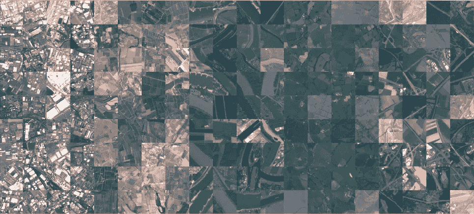
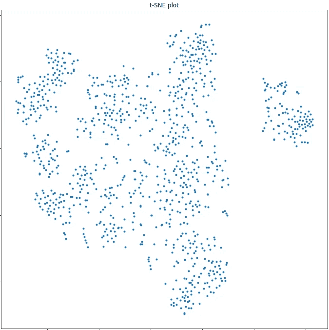
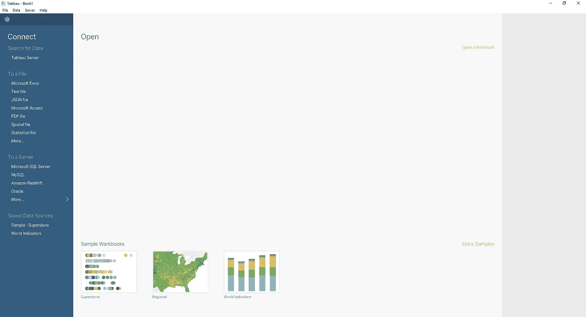
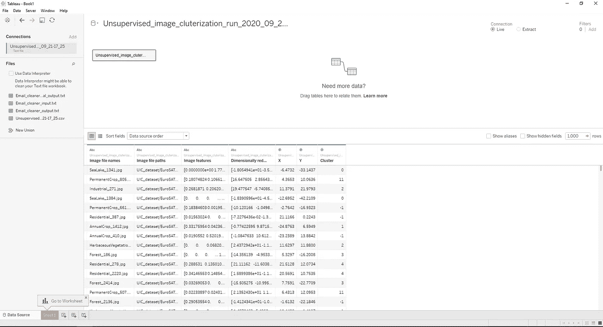
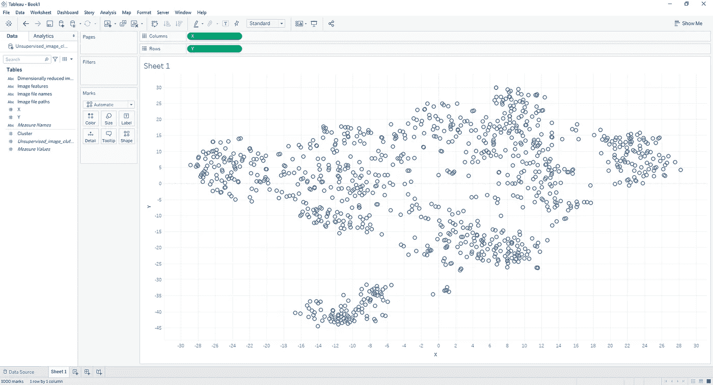
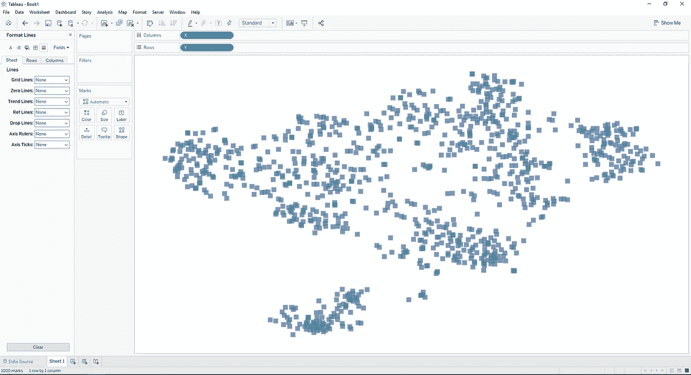
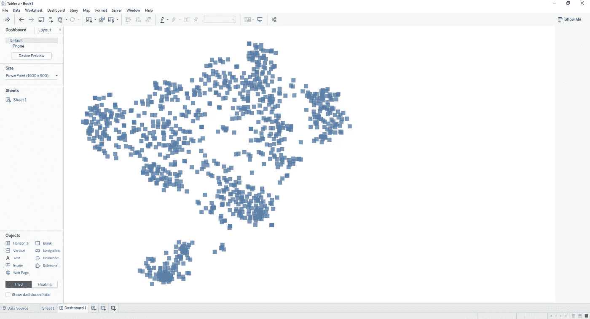
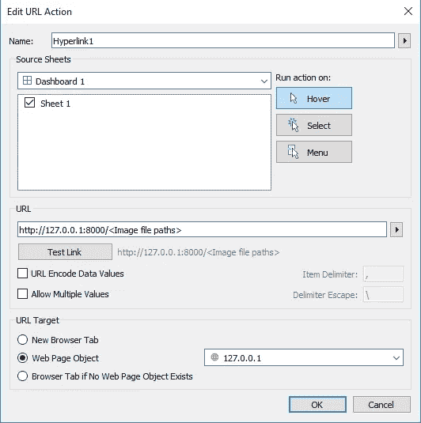
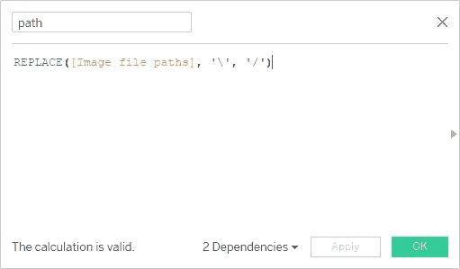
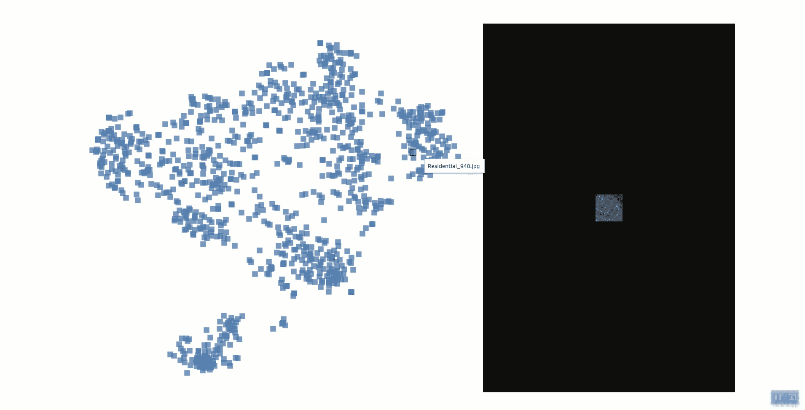

# 无监督图像映射

> 原文：<https://towardsdatascience.com/unsupervized-image-clusterization-7ff7fadcf358?source=collection_archive---------36----------------------->

## 探索大量图像的简单有效的方法


照片由[乔恩·泰森](https://unsplash.com/@jontyson?utm_source=medium&utm_medium=referral)在 [Unsplash](https://unsplash.com?utm_source=medium&utm_medium=referral) 上拍摄

作为一名数据科学家，我经常参与反欺诈调查任务。因此，探索是调查的重要组成部分。它允许一个人熟悉分析的主题。
我将在这里详细介绍一种简单、快速、高效且可重复的方法，让你对你所拥有的图像有一个整体的概念。这是我的第一篇文章，所以请不要犹豫，提出你的问题和意见。享受😉

# 内容

1.  先决条件
2.  数据
3.  描述图像
4.  推断
5.  (英)可视化(= visualization)

# 先决条件

该算法使用 Python 3.6.8 和库 keras(版本 2.2.4)、pandas(版本 0.24.1)、scikit-learn(版本 0.22.2.post1)、numpy(版本 1.18.2)和 matplotlib(版本 3.0.3)。

要安装 Python，如果你在 Windows 或 Mac 上，你可以在这里下载安装程序[。对于 linux 用户，下面的 bash 命令将安装 Python 3.6: `sudo apt-get install python3.6`](https://www.python.org/downloads/release/python-368/)

对于库，终端中的以下命令(bash、powershell 等。)将安装它们:`pip install keras==2.2.4 pandas==0.24.1 scikit-learn==0.22.2.post1 matplotlib==3.0.3 numpy==1.18.2`

最后，使用 Tableau 软件对结果进行可视化。这是一个付费软件，但你可以在这里免费试用。

我们现在可以导入库并指定图像的路径:

```
## Imports
from datetime import datetime
from keras.applications.resnet50 import preprocess_input, ResNet50
from keras.models import Model
from keras.preprocessing import image
from pandas import DataFrame
from random import sample
from sklearn.manifold import TSNEimport matplotlib.pyplot as plt
import numpy as np
import os
import time## Parameters
INPUT_DIRECTORY = 'UIC_dataset/'
assert os.path.exists(INPUT_DIRECTORY), 'Directory does not exist'
```

# 数据

在这个例子中，我选择使用 EuroSAT (RGB)数据集，这里是。



EuroSAT 数据集以 Sentinel-2 卫星图像为基础，覆盖 13 个光谱带，由 10 类 27，000 个带标签和地理参考样本组成——euros at:一种用于土地利用和土地覆盖分类的新型数据集和深度学习基准，作者:Helber、Patrick 和 Bischke、Benjamin 和 Dengel、Andreas 和 Borth、Damian，载于 2019 年《IEEE 应用地球观测和遥感专题杂志》

# 描述图像

第一步是找到一种方法来丰富地描述图像。一种快速简单的方法是使用已经在一般分类任务上训练过的神经网络作为编码器。我们的目标不是分类，而是使用网络提取的特征将相似的图像分组在一起。在 ImageNet 数据集上训练的 ResNet50 残差神经网络是一个非常好的开始。

*想了解更多关于残差神经网络的知识？第一部分* [*这篇文章*](/an-overview-of-resnet-and-its-variants-5281e2f56035) *解释得很好。*

为什么在 ImageNet 数据集上训练 ResNet50？ImageNet 项目是一个大型视觉数据库，设计用于视觉对象识别软件研究。该项目已经对超过 1400 万张图像进行了手工注释，以指示所拍摄的对象，并且在至少 100 万张图像中，还提供了边界框。ImageNet 包含 20，000 多个类别，其中一个典型的类别，如“气球”或“草莓”，由数百个图像组成。
因此，经过训练对 ImageNet 图像进行分类并获得良好分数的神经网络将学会正确区分图像的形状和特征。这种能力对我们来说非常珍贵。问题是我们的 ResNet50 目前只知道如何从 ImageNet 类列表中预测一个类。
为了克服这一点，我们必须移除用于分类的网络的最后一层。网络的输出将是维度 2048 的特征向量。

```
## Model
# Retrieve the base model trained on ImageNet
base_model = ResNet50(weights='imagenet')# Removing the last layer by selecting the layers from the first to the penultimate one.
model = Model(inputs=base_model.input, outputs=base_model.get_layer('avg_pool').output)# Display layers
print(model.summary())## Get image paths
image_file_names = list()
image_file_paths = list()for root_path, directory_names, file_names in os.walk(INPUT_DIRECTORY):
    for file_name in file_names:
        if file_name.lower().endswith(('.jpg', '.jpeg', '.png')):
            image_file_names.append(file_name)
            image_file_paths.append(os.path.join(root_path, file_name))

print('{} images found'.format(len(image_file_paths)))## Sampling
image_file_names, image_file_paths = zip(*sample(list(zip(image_file_names, image_file_paths)), 1000))
image_file_names = list(image_file_names)
image_file_paths = list(image_file_paths)## Get image features
image_features = list()start_time = time.time()for index, image_file_path in enumerate(image_file_paths.copy()):
    try:
        img = image.load_img(image_file_path, target_size=(224, 224))
        x = image.img_to_array(img)
        x = np.expand_dims(x, axis=0)
        x = preprocess_input(x) image_features.append(model.predict(x)[0])
    except OSError:
        del image_file_paths[index]
        del image_file_names[index]
        print("ERROR: Can't load image {}".format(os.path.basename(image_file_path)))image_features = np.array(image_features)print('Done ({:.0f} min)'.format((time.time() - start_time) / 60))
```

# 推断

我们人类发现很难掌握超过 3 个维度。所以想象一下 2048 年…

我最喜欢的可视化大矢量的方法之一是 t-SNE 算法。t-SNE 代表 t-分布式随机邻居嵌入。
是一种基于随机近邻嵌入的可视化机器学习算法。这是一种非线性降维技术，非常适合于在二维或三维的低维空间中嵌入用于可视化的高维数据。具体而言，它通过二维或三维点对每个高维对象进行建模，以这种方式，相似的对象通过附近的点进行建模，而不相似的对象通过远处的点以高概率进行建模。
t-SNE 算法包括两个主要阶段。首先，t-SNE 在高维对象对上构建概率分布，使得相似的对象被分配较高的概率，而不同的点被分配较低的概率。第二，t-SNE 在低维图中的点上定义了类似的概率分布，并且它最小化了关于图中点的位置的两个分布之间的 Kullback-Leibler 散度(KL 散度)。

像许多算法一样，参数必须仔细选择。[这篇文章](https://distill.pub/2016/misread-tsne/)很好地解释了 t-SNE 不同参数的影响。
在我们的案例中，以下参数值使我们获得了令人满意的结果。

```
## Compute t-SNE
start_time = time.time()t_SNE = TSNE(n_components=2,
             perplexity=20,
             n_iter=2000,
             metric='euclidean', 
             random_state=8,
             n_jobs=-1).fit_transform(image_features)print('Done ({:.3f} s)'.format(time.time() - start_time))
```

# (英)可视化(= visualization)

一旦投射完成，我们就可以想象结果。

## **Matplotlib**

一个简单的散点图已经可以用来确定一些分组。

```
## Plot results
# Increase plot size
plt.figure(figsize=(12, 12))# Set title
plt.title('t-SNE plot')# Plot and show
plt.scatter(t_SNE[:, 0], t_SNE[:, 1], marker='.')
plt.show()
```



我们已经可以区分出一组与众不同的图片——作者的图片

这个简单图形的缺点是，它不允许您查看由点表示的图像。为此，需要更高级的可视化解决方案，如 Power BI 或 Tableau 软件，详情如下。

## **Tableau 软件**

Tableau 是一个付费的数据可视化软件，使用起来相当简单，允许大量不同类型的可视化，包括交互式可视化。

我们必须首先保存 t-SNE 的结果。

```
## Save results
data_frame = DataFrame(data={'Image_file_names': image_file_names,
                             'Image_file_paths': image_file_paths,
                             'Image_features': [str(vector).replace('\n', '') for vector in image_features], 
                             'X': t_SNE[:, 0], 
                             'Y': t_SNE[:, 1]})
data_frame = data_frame.set_index('Image_file_names')data_frame.to_csv(path_or_buf='Unsupervised_image_cluterization_run_{}.csv'.format(datetime.now().strftime("%Y_%m_%d-%H_%M")),
                  sep=';',
                  encoding='utf-8')
```

然后，在 Tableau 软件中，点击“新数据源”>“文本文件”，选择你的 CSV 文件打开。



Tableau 加载页面-作者提供的图像

数据加载后，转到“第 1 页”。



Tableau 数据页面-作者图片

在这里，右击“X”>“转换为尺寸”。对“Y”做同样的操作。
通过拖放将“X”和“Y”分别添加到“列”和“行”字段中。
点击将鼠标移到“列”字段中的“X”上时出现的小箭头，然后点击“连续”。对“Y”做同样的操作。您应该得到一个类似于散点图的视觉效果。
预计到以后，将“图像文件路径”拖放到“标记”窗格的“细节”框中。



Tableau 表单页面-作者提供的图像

为了使视觉更美观，你可以让网格、轴和工作表的名称消失。为此，右键单击网格>“格式”，然后在右侧的“格式字体”窗格中，单击“线条”图标，并通过选择“无”来禁用不同的线条。
然后，右击轴，您可以禁用“显示标题”选项。右键单击标题激活“隐藏标题”选项。
最后，在“标记”窗格中，您可以修改点的形状、大小、颜色等。就我个人而言，我喜欢让它们看起来像不透明度为 75%的小方块。这让我想起了小的拍立得照片，我们会把它们分类放在一张桌子上。
您也可以将“图像文件名”拖放到“工具提示”中，使图像的名称出现，然后双击“工具提示”，您可以编辑工具提示的内容，修改为只保留“< ATTR(图像文件名)>”。



纸张修饰—图片由作者提供

我们现在可以切换到“Dashboard”选项卡，方法是单击工作表 1 底部的“New Dashboard”图标。
让我们通过将“宽度”和“高度”分别更改为 1600 像素和 900 像素来增加“尺寸”窗格中的尺寸。
然后，您可以将“工作表 1”从“工作表”选项卡拖放到仪表板。右键点击标题使其消失。
在“对象”窗格中，将“网页”拖放到仪表板上“工作表 1”的右侧。然后单击“确定”,将 URL 留空。



Tableau 仪表板页面-按作者分类的图像

这个网页是显示图像的一种方式。目的是通过将鼠标悬停在一个正方形上来显示网页中的图像。为此，我们将启动一个本地 web 服务器。在您的终端中，转到要服务的目录并键入`cd <path where UIC_dataset folder is>`，然后通过键入`python -m http.server --bind 127.0.0.1`启动一个 Python web 服务器。您的服务器现已启动。
在顶部的“仪表板”标签中>“操作……”>“添加操作>”>“转到 URL……”。在“运行操作于:”中，选择“悬停”。在“URL”中，输入 URL*“http://127 . 0 . 0 . 1:8000/<图像文件路径>”*。在“URL 目标”中，选择“网页对象”。最后，点击“确定”。



动作窗口—按作者分类的图像

注意:如果您在 Windows 中工作，您可能需要通过将“\”替换为“/”来更改“图像文件路径”。为此，在“工作表 1”中，右键单击“数据”窗格底部，然后单击“创建计算字段…”。输入名称“路径”,并输入如下计算公式。然后在“Dashboard”>“Actions”>双击“Hyperlink1”，用“*http://127 . 0 . 0 . 1:8000/<path>*”更改网址。



计算字段窗口-按作者排序的图像

瞧！当你飞过它们时，你的图像就会出现。



结果—作者提供的图片

所以我们可以看到相似的图像被分组在一起。可以看到一些星团，如右上角的“住宅”星团或底部明显分离的“海湖”星团。

# 结论

因此，我们看到了一种简单有效的方法来获得一个图像数据集的好主意。这个想法对你进一步的分析工作会非常珍贵。
我希望你喜欢这篇文章，它让你想了解更多关于数据分析的知识。请随意提问和评论。

代码[在我的 gitlab 上有一个 Jupyter 笔记本，如果你愿意，你可以贡献给它。](https://gitlab.com/jthieyre/unsupervized-image-clusterization)

更多的文章将会出现，包括一篇关于清理纯文本邮件的文章。敬请关注，稍后见😉