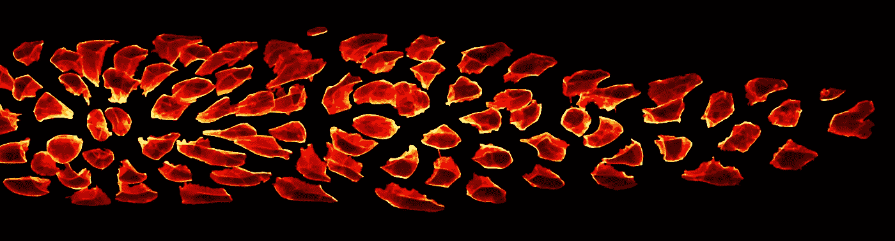
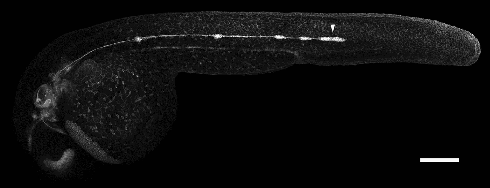
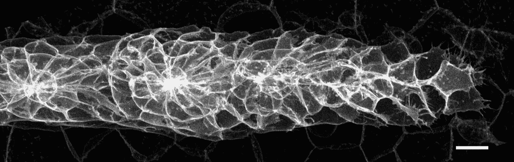
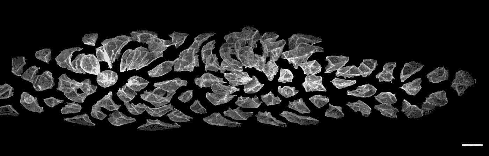

# 用显微镜和算法理清生物学

> 原文：<https://towardsdatascience.com/untangling-biology-microscopes-algorithms-d6528f996faf?source=collection_archive---------83----------------------->

## 我们的新研究论文使用数据科学来分析器官在胚胎中是如何形成的。这里有一个针对感兴趣的非专家的快速总结。

从数据科学的角度看胚胎中细胞的美丽。(图片由作者提供)

随着胚胎的生长，其内部的无数细胞聚集在一起，组装成不同的器官，每个器官都有其独特的形状、大小和生物功能。这一基本过程看起来不太像是工厂里的汽车机器人组装，而更像是一群忙碌的蚂蚁。这些细胞探索它们的周围环境，通过化学信号进行交流，在彼此身上爬行，推拉它们的邻居……这是一个令人费解的混乱，但它确实产生了比汽车复杂得多的生物机器。

对于想要弄清楚这一切是如何工作的生物学家来说，显微镜是一个必不可少的工具，因为它们可以直接观察胚胎中的细胞。现代显微镜是一种高科技设备，可以产生极其详细和大规模放大的全 3D 图像。然而，因为器官的形成是如此复杂，仅仅通过看这些图像通常很难理解发生了什么。这就是为什么许多生物学家已经开始使用计算机算法来帮助他们筛选出重要的信息。由于过去几年统计学和机器学习的快速发展，计算机已经非常擅长解决这类问题，尽管它们通常需要特定的数据格式(所谓的*特征空间*)或非常大量的数据(所谓的*大数据*)。不幸的是，细胞的图像没有形成特征空间，显微镜检查通常太耗时，无法产生大数据。这使得很难使用现代计算工具来研究器官的形成。

我们的目标是克服这一限制，并应用计算机的能力来分析斑马鱼胚胎中一组称为*侧线原基*的细胞。这组细胞代表了器官形成的一个有趣例子，其中细胞以高度协调的方式同时移动和改变它们的形状。为了使计算分析成为可能，我们开发了新的算法，将细胞图像转换到一个特征空间，该空间编码几乎相同的信息。使用这种格式，我们能够对侧线原基的许多不同图像进行数字组合和统计分析。我们以不同的方式过滤和可视化数据，以帮助我们找到和解释侧线细胞如何组织的最重要模式。我们的分析检测到了一些已知的模式，证实它工作正常。更有趣的是，它还揭示了一些以前未知的模式，例如位于原基中心的细胞与位于外部的细胞在形状上的差异。基于这些结果，我们可以为侧线细胞组织自身的物理相互作用提出一个新的假设。

一个年轻的斑马鱼胚胎的显微图像，带有一个特殊的标签，突出了某些细胞，包括侧线原基(白色箭头)的细胞。比例尺:200 微米。(*图片作者*)

侧线原基的高倍特写显微镜图像。比例尺:10 微米。作为参考，假设人类头发的平均直径略小于 100 微米。(*图片作者*)

在这张图片中，原基的单个细胞已经通过计算机识别并分开，突出了它们在形状上的不同。这样的图像是我们新的图像转换算法和后续计算分析的起点。比例尺:10 微米。(*图片作者*)

我们开发的算法开辟了使用计算机分析显微镜图像的新途径。通过这种分析发现的模式可以通过额外的实验进行更详细的研究，这将最终导致对细胞群如何组装成器官的更好理解。这些知识将帮助我们治疗由器官形成问题引起的疾病，并使我们更接近于为移植而人工培养器官的可能性。从长远来看，我们甚至可以完全控制器官的形成过程，设计出全新的生物机器。

本文由 Jonas Hartmann 撰写，Elisa Gallo 和 Julia Suter 提供了反馈。这项研究是在德国海德堡的欧洲分子生物学实验室进行的。同行评审论文全文可在 eLife 杂志上免费获得:

 [## 发育组织中细胞结构的基于图像的数据驱动分析

### 从 3D 显微数据中提取代表性数值特征的计算策略使得能够深入…

elifesciences.org](https://elifesciences.org/articles/55913)