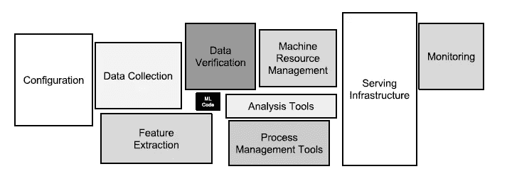

# 直到机器学习的技术债务把我们分开

> 原文：<https://towardsdatascience.com/until-technical-debt-in-machine-learning-tear-us-apart-2de7d54dd0ea?source=collection_archive---------45----------------------->

## CACE 原理和为什么 ML 中的技术债务是不同的

埃胡德·纽豪斯在 [Unsplash](https://unsplash.com?utm_source=medium&utm_medium=referral) 上拍摄的照片

# 我简介

***技术债*** 。如果这些话没有让你不寒而栗，你可能太新手了，或者你已经完全放弃了。在最近的一篇论文中，谷歌的一组研究人员讨论了隐藏在机器学习(ML)系统中的技术债务。

ML 允许我们快速构建有用的复杂预测系统，但这不是免费的。作者指出，技术债务框架可以揭示 ML 系统中的大量持续维护成本，例如:

*   边界侵蚀，
*   纠结，
*   隐藏的反馈回路，
*   未申报的消费者，
*   数据依赖性，
*   配置问题，
*   外部世界的变化，
*   系统级反模式

如今开发和部署 ML 并不昂贵，但是等式的另一部分是:长时间的维护。这被证明是困难和昂贵的，如果技术债务得不到控制，情况会变得更糟。

# 起源和财政类比

*技术债务*最早是由沃德·坎宁安在 1992 年提出的，当时他在论证软件工程快速发展的长期成本。他将其比作财政债务。这种比较引起了共鸣，因为债务本身并不是一件特别坏的事情。我们可能会欠下债务，但如果我们有一个明确的目标和如何偿还的计划。当我们不这样做时，事情会变得更加复杂。

我们先来看财政债务。如果是战略性收购，并计划获得比债务利息更高的回报，那就有意义。现金流的期限和时机也要考虑，*即*“*下一笔债务何时到期？”***vs .***下一个收入流什么时候到来*？”。你明白了。并非所有的债务都是坏的，但所有的债务都需要处理。虽然财政债务大多只有一个方面，即金钱，但技术债务可以通过多种方式偿还:

*   代码重构，
*   单元测试增强，
*   删除死代码和注释，
*   减少依赖性，
*   文件审查

解决技术债务并不意味着增加新功能，而是净化环境，使未来的增强更容易，错误更少，维护更容易。

与财政债务一样，任何延迟都意味着复利，而且与财政债务不同，对于技术债务来说，它们在沉默中增长。正如作者提醒我们的，当谈到机器学习中的技术债务时，它是两个移动部分的组合:对代码和 ML 方面的关注。

# 侵蚀抽象边界

在传统的软件工程中存在很强的抽象界限，并以封装和模块化设计的形式出现。这些实践允许代码可维护，并确保变更和增强是隔离的。

有了 ML，事情变得更加复杂。如作者所述，ML 的本质用于“*在不依赖外部数据*的情况下，无法在软件逻辑中有效表达所需行为的情况”。

## 纠缠

ML 使用混合输入，仅仅一个输入的存在就会影响其他输入的重要性。如果我们有特性[ *x1* ， *…，* *xn* ]，那么对*例如* *x1* 输入分配的改变可能会影响剩余的 *n-1* 特性对它们的使用，例如它们将采用的重要性或权重。

类似地，删除或添加新功能也会导致变化。作者称之为“CACE”原则，因为改变任何事物都会改变一切。该原则不仅适用于输入，也适用于学习设置、采样方法、超参数、数据选择等。

## 校正级联

想象一个模型 *M1* 解决问题*一个*。如果类似的问题*A’*出现，一个捷径就是创建*M1’*作为 *M1 的一个调整。研究人员认为这造成了对 M1 的依赖，使未来的改进分析变得复杂。模型级联建立作为另一个问题，一个“将被模型 M1 解决”。*

一个提议的解决方案是增强 *M1* 来直接学习校正，具有区分案例的特征或者接受为 A’问题建立单独模型的需要。

## 未申报的消费者

他们被定义为默默的依赖他们系统的模型输出。因为他们对团队管理模式 *M1* 不了解，他们有受到 *M1* 任何变动影响的风险。这种可见性债务可能会导致 M1 实施变革的成本和难度增加。他们也能创造隐藏的反馈循环。

# 代码依赖与数据依赖

虽然代码依赖可以被编译器发现，但是数据依赖却很难跟踪。研究人员指出了三个原因:

1.  **不稳定的数据依赖关系**

利用系统的输出作为系统的输入被证明是不稳定的。这在定性和定量方面都是有效的。正如作者指出的，当两个不同的团队参与时，事情会变得更糟。当一个团队拥有系统的输出，而另一个团队拥有将该输出作为输入的模型时。在这个设置中，变化可能随时发生并影响模型团队。为了减轻这一事件，作者建议对给定的输出进行版本控制。

**2。未充分利用的数据相关性**

假设一个产品编号方案从旧编号过渡到新编号，并且两个方案都作为特性保留。新产品只收新号，老的同时维护新旧。每当删除数据库中的旧号码时，ML 系统都会遇到问题。作者将这些特性分为捆绑特性、遗留特性和相关/工程特性。

作为一个缓解方案，建议运行“*保留一个特性*评估，这样可以删除不必要的特性。

**3。数据相关性的静态分析**

虽然代码依赖可以被编译器发现，但是数据依赖却很难跟踪。一个自动化的特性管理系统是一个有帮助的工具，更多细节请参见源代码。

# 隐藏的反馈循环

当两个独立的系统相互影响时，就会发生这种情况。我们以一个电子商务页面为例。一个系统向用户推荐相似的项目，而另一个系统选择最相关的相关评论。一个系统的变化可能会影响用户的行为，从而影响其他组件的点击率。

# 水管问题

在现实世界的 ML 系统中，ML 代码所占的份额相对较小。围绕它的轨道通常被描述为管道/管线，如下所述:

图片作者[论文作者](http://papers.nips.cc/paper/5656-hidden-technical-debt-in-machine-learning-systems.pdf)

在这种情况下，技术债务以设计模式的形式出现。研究人员定义如下:

*   **粘合代码**支持代码不同部分的互操作，如库或程序。这反过来会冻结系统，因为测试任何替代方案都变得及时且昂贵。作为解决方案，建议将其转化为 API。这允许更多的可重用性，并降低了改变包的成本。
*   **管道丛林**往往发生在资料准备阶段。特别要注意的是，ML 系统中的连接、中间文件的采样和解析很快就会变得越来越多。作为一种解决方案，建议在进行数据收集和特征提取时保持整体方法。从头开始重建管道的决定可能是一项重大努力，但可以降低未来成本，并且不会阻碍创新速度。

作者指出，如果“研究”和“工程”角色不分离，角色在同一个团队中工作或由相同的人担任，那么胶水代码和管道丛林的摩擦可以减少。

# 我们的债务水平如何？

作者建议问几个问题，作为潜在债务水平的温度检查:

*   改进一个模型或信号会降低其他模型或信号吗？
*   一个新的变化对系统的影响能有多精确的测量？
*   团队的新成员需要多长时间才能适应？

最后一个问题似乎是最能说明问题的，如果一个新的加入者可以很快加入，并且只使用文档，而不与团队成员互动，这可能是一个精益 ML 系统的标志。

# 在技术债务上走得更远

如果你对技术债务的渴望没有得到满足，这里有更多的陷阱可以寻找:

*   死的实验代码路径，
*   普通的气味，
*   抽象债务，
*   配置债，
*   数据测试债务，
*   再现债务

# 结论

术语技术债务是一个有意义的比喻。至于财政债务，如果不加以控制，迟早会产生滚雪球效应。还清债务将是一个痛苦的过程。作者注意到，如果一个团队可以快速移动和释放，仍然不足以确定债务水平低。相反，仅仅是行动迅速这一事实就可能带来技术性债务。

布莱斯·帕斯卡在他的一个 letters⁴:中说得很好

> “我把这封(信)写得比平时长，因为我没有时间把它写短。”

这是有症状的，可以移植到软件工程中，因此也移植到 ML 中。对快速解决方案的需求也意味着，在 ML 系统的不同移动部分进行适当规划、内务处理和思考的时间减少了。除了计划，文档可能是软件工程的穷孩子& ML。团队知道他们需要编写和维护它，但是这不是一个令人愉快的任务，然而却很有帮助。也许是时候接受一个新的座右铭了: **ML 团队总是偿还他们的债务！**

## 编码快乐！

感谢阅读！喜欢这个故事吗？ [**加入 Medium**](https://medium.com/@maximegodfroid/membership) 完整访问我的所有故事。

# 参考

[1] Sculley，d .等人，“机器学习系统中隐藏的技术债务” *NIPS* (2015)，[http://papers . NIPS . cc/paper/5656-hidden-technical-debt-in-machine-learning-systems . pdf](http://papers.nips.cc/paper/5656-hidden-technical-debt-in-machine-learning-systems.pdf)

[2]沃德·坎宁安(1992 年)。*wy cash 投资组合管理系统*，[http://c2.com/doc/oopsla92.html](http://c2.com/doc/oopsla92.html)

[3]麦克马汉等人(2013 年)。*广告点击预测:战壕里的风景。*”

[4]布莱士·帕斯卡(1657)，*《信札·外省人》(Les Provinciales)*