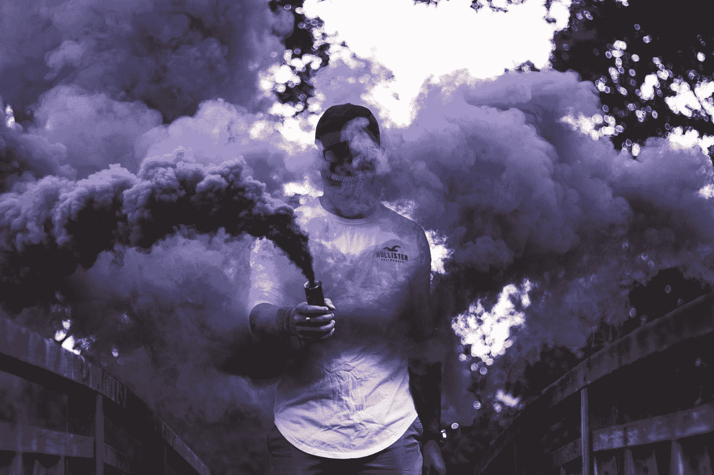
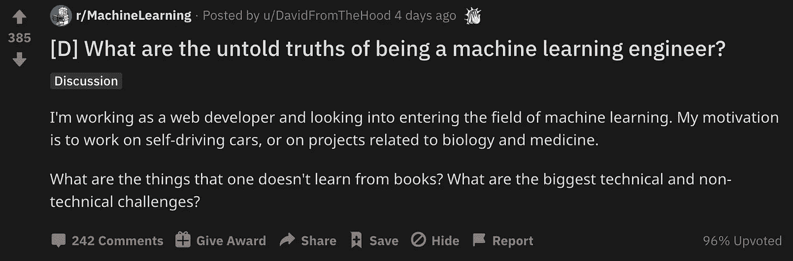
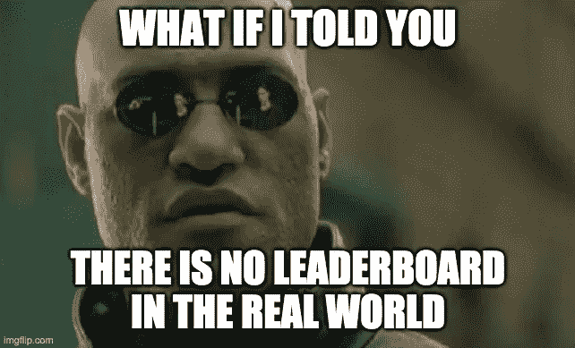

# 成为机器学习工程师的不为人知的真相

> 原文：<https://towardsdatascience.com/untold-truths-of-being-a-machine-learning-engineer-364218db2317?source=collection_archive---------23----------------------->

## 从事人工通用智能研究？自动驾驶汽车？不…组成训练集并在基础设施上工作？更有可能。



照片由 [Unsplash](https://unsplash.com?utm_source=medium&utm_medium=referral) 上的 [Gwendal Cottin](https://unsplash.com/@gwendal?utm_source=medium&utm_medium=referral) 拍摄

我最近参与了 Reddit 上一个有趣的讨论，我的一些回答得到了高度评价。它的要点是作为一名机器学习工程师的不为人知的真相。我以策划的方式分享关键要点，因为我是更积极的参与者之一。



作为一名 ML 工程师有哪些不为人知的真相？关于 [Reddit](https://www.reddit.com/r/MachineLearning/comments/ifn7ua/d_what_are_the_untold_truths_of_being_a_machine/)

**这里有几个你可能会感兴趣的链接:**

```
- [Labeling and Data Engineering for Conversational AI and Analytics](https://www.humanfirst.ai/)- [Data Science for Business Leaders](https://imp.i115008.net/c/2402645/880006/11298) [Course]- [Intro to Machine Learning with PyTorch](https://imp.i115008.net/c/2402645/788201/11298) [Course]- [Become a Growth Product Manager](https://imp.i115008.net/c/2402645/803127/11298) [Course]- [Deep Learning (Adaptive Computation and ML series)](https://amzn.to/3ncTG7D) [Ebook]- [Free skill tests for Data Scientists & Machine Learning Engineers](https://aigents.co/skills)
```

*上面的一些链接是附属链接，如果你通过它们购买，我会赚取佣金。请记住，我链接课程是因为它们的质量，而不是因为我从你的购买中获得的佣金。*

# 1.使用深度学习

许多机器学习爱好者认为他们会玩花哨的深度学习模型，调整神经网络架构和超参数。别误会，有些人会，但不多。

事实是，ML 工程师将大部分时间花在“**如何恰当地提取类似真实世界问题分布的训练集**”上。一旦你有了这些，你就可以在大多数情况下训练一个经典的机器学习模型，它会工作得足够好。

## 出于好奇，这些算法中最难解决的问题是什么？又是用哪一个来解决的呢？


由 [Caleb George](https://unsplash.com/@seemoris?utm_source=medium&utm_medium=referral) 在 [Unsplash](https://unsplash.com?utm_source=medium&utm_medium=referral) 上拍摄的照片

深度学习最近在计算机视觉(例如，自动驾驶汽车)和自然语言处理(GPT-3 等)方面取得了最大的成功。).因此，在这些领域工作的研究人员和从业者最有可能使用深度学习。

IMO 有史以来最大的成就就是 DeepMind 的 AlphaGo Zero。自动驾驶汽车可能是对社会影响最大的汽车。自然语言处理的最新成果是 GPT-3。

## 深度学习模型与经典的 ML 模型相比是否很难解释？

> OP 说得好:
> 
> 我看不出解释卷积神经网络会比解释基于支持向量机、随机森林或梯度推进的整个分类框架更难。
> 
> 我觉得随着 NNs 对可解释性的研究越来越多，这种说法越来越不真实了。
> 
> 当将 NNs 与 GLMs 或朴素贝叶斯等优秀的传统统计学进行比较时，它显然仍然成立。但是一旦你转向基于 CART 的方法或者任何使用内核技巧的方法，这种虚构的可解释性就不复存在了。

[](https://medium.com/@romanorac/autonomous-systems-dcf6af4f88c5) [## 自治系统

### 自动驾驶汽车领域将在未来四年内增长 42%,顶级工程师的薪水…

medium.com](https://medium.com/@romanorac/autonomous-systems-dcf6af4f88c5) 

# 2.学习机器学习


在 [Unsplash](https://unsplash.com?utm_source=medium&utm_medium=referral) 上 [NeONBRAND](https://unsplash.com/@neonbrand?utm_source=medium&utm_medium=referral) 拍摄的照片

> 在学习的时候，你倾向于浏览很多关于 arxiv-sanity 的论文，里面有一些非常酷的算法。然后你进入这个行业，你看到的都是相对基础的东西，如逻辑回归、前馈神经网络、随机森林(决策树)、单词袋而不是嵌入，你觉得这些模型可以由普通大学生甚至聪明的高中生实现。也许如果你幸运的话，你会看到 SVM。
> 
> 基础设施和数据管道是所有真正的工程工作发生的地方。

职业生涯刚开始的时候感觉和上面的 OP 差不多。但是为什么在没有必要的情况下，你会使用一个更复杂的工具来完成任务呢？许多现实世界的问题不需要最先进的神经网络架构来解决。有时一个简单的逻辑回归就能完成任务。

评论的第二部分适用于较小的初创公司，在这些公司中，你通常必须自己处理数据管道。在较大的公司中，有专门的部门处理基础设施。但是没有捷径——数据科学家仍然需要充分了解数据基础设施是如何工作的。

# 3.学习理论


照片由[🇸🇮·扬科·菲利](https://unsplash.com/@itfeelslikefilm?utm_source=medium&utm_medium=referral)在 [Unsplash](https://unsplash.com?utm_source=medium&utm_medium=referral) 拍摄

> 想学多少理论就学多少，但最终，你的工作将是 99%的数据清理和基础设施工作。

99%有点夸张了。换句话说:机器学习工程师不只是玩花哨的模型。有时他们需要通过清理和标记数据来弄脏自己的手。

## 为什么不用软件和服务给数据贴标签？

> 这是非常正确的。以至于我以为只有我一个人。我主要在 NLP 工作，99%的工作是用 Java 标记数据和制作一些基础设施。

对于实践中使用的大数据集来说，数据标注服务通常过于昂贵。有些数据集的标注并不简单。我有过一次在发票分类上工作的经历，你需要专业的会计师来标记这些数据。

# 机器学习在现实世界中是怎样的？



用 [imgflip](https://imgflip.com/) 创建的迷因

我越来越注意到，在理解数据科学家做什么方面存在差距。当期望与现实不符时，许多有抱负的数据科学家会感到失望。数据科学不仅仅是调整你最喜欢的模型的参数，并在 Kaggle 排行榜上获得更高的排名- **如果我告诉你现实世界中没有排行榜会怎么样？！？**

这就是为什么我写了[你的第一本云中的机器学习模型](https://datascienceisfun.net/)电子书来展示如何从头到尾处理一个实际的数据科学项目。这本电子书的目标是数据科学爱好者和软件工程师，他们正在考虑从事数据科学职业。

[](https://medium.com/@romanorac/hands-on-data-science-course-e764853f516b) [## 你在云中的第一个机器学习模型

### 一步一步的指导，将告诉你如何训练一个机器学习模型，建立一个网络应用程序，并部署到…

medium.com](https://medium.com/@romanorac/hands-on-data-science-course-e764853f516b) 

# 在你走之前

在 [Twitter](https://twitter.com/romanorac) 上关注我，在那里我定期[发布关于数据科学和机器学习的](https://twitter.com/romanorac/status/1328952374447267843)消息。


照片由[Courtney hedge](https://unsplash.com/@cmhedger?utm_source=medium&utm_medium=referral)在 [Unsplash](https://unsplash.com/?utm_source=medium&utm_medium=referral) 拍摄