# 揭示网络中的重要节点

> 原文：<https://towardsdatascience.com/unveiling-important-nodes-in-a-network-4992a2ea1cca?source=collection_archive---------30----------------------->

## 揭示数据中隐藏层次的概率方法

编剧[基尔弗·j·坎波斯](https://medium.com/u/21ff61c9c0d9?source=post_page-----4992a2ea1cca--------------------------------)，[尼古拉斯·波扎·莫雷诺](https://medium.com/u/569d8eaaff37?source=post_page-----4992a2ea1cca--------------------------------)，[亚历杭德罗·阿尔瓦雷斯](https://medium.com/u/bc4510eb14a?source=post_page-----4992a2ea1cca--------------------------------)，[托马斯·维拉](https://medium.com/u/a05dc8d41aa5?source=post_page-----4992a2ea1cca--------------------------------)。

图数据库(或网络数据集)中最重要节点的检测是各种科学学科，尤其是数据科学中广泛关注的问题。近年来，由于现代计算机存储和计算能力的进步[1]，以及 21 世纪初网络理论的爆炸式繁荣[2，3，4]，其相关性一直在增加。

基本上，可以通过一组节点或实体以及一组描述这些实体之间如何交互或相关的链接来描述的任何数据集。这些类型的系统(或数据库)的一些例子是:

*   社交网络:人们用节点来表示，链接表示他们之间不同的社会联系(友谊、合作、共同爱好等)。).这些类型的网络出现在科技产品中，如脸书、推特、LinkedIn、Instagram、抖音等。在后者中，最重要的节点与高影响力的人“影响者”相关，这些人对现代营销部门越来越感兴趣[5]。
*   生物有机体:有机体的代谢可以用网络(代谢组学)来表示，其中的节点是生物分子(代谢物或酶)，如果代谢物是酶介导的酶促反应的离析物或产物，则代谢物与酶相连。我们还可以通过蛋白质相互作用网络(蛋白质组学)将生物体内物理相互作用的所有蛋白质联系起来。最重要的节点与可能的药物靶标相关，这对于新治疗方法的设计非常重要，例如在寄生虫病中[6]。
*   运输网络:在这个场景中，节点代表地理位置(城市、机场、港口等。)并且如果存在连接两个节点的路由，则这两个节点是连接的。例如，在机场网络的情况下，如果从一个机场到另一个机场有直飞航班，则两个机场是连接的。最重要的节点/机场与大多数人流动通过的机场有关，如果我们假设标准的商业航班，因此避免或最大限度地减少流行病的传播，在这样的机场放置控制点和疫苗接种活动是非常重要的[7]。
*   计算机和物联网设备网络:这里的节点由物联网生态系统的所有设备(智能手机、基于 Arduino 的传感器、树莓、平板电脑、智能设备、计算机等)组成。)并且连接可以是有线的和/或抽象的，例如 wifi、3G、4G、5G、蓝牙等。
*   地震活动和气候:网络的多功能性也通过表现时间性质的数据来显示，如地震活动或气候，按时间来衡量。在这种情况下，节点是地理区域，如果两个节点之间存在高度的相关性或因果关系，则这两个节点是连接的[8]。
*   在线商店:我们可以将电子商店的产品表示为一个网络，在这个网络中，如果两个产品都是由同一个用户搜索或购买的，那么这两个产品就是相连的。另一种联系是由这些产品之间的关系(元数据)提供的。例如，网球拍和袜子可以共享属性:运动、户外、爱好。因此，球拍和袜子可以连接，但球拍和床不能连接。
*   互联网:在这种情况下，路由器是节点，链路是允许它们通信的有线或无线连接[9]。
*   WWW(或万维网):允许我们通过节点来描述网页的世界，并且如果有从一个网页到另一个网页的超链接，这些网页中的两个是连接的。在这种情况下，WWW 是一个有向网络(因为它可能是从 A 页到 B 页的超链接，但不一定是从 B 到 A)。如果大量页面“指向”一个网页，我们可以说这个网页是相关的。网页的相关性或重要性的概念被用于像 Google 这样的搜索引擎的设计中。

前面所有的例子都允许我们从不同的角度来看数据，例如，作为组成系统(数据集)的元素之间的交互图。因此，使我们能够利用现有的数据挖掘和人工智能工具来揭示层次结构、模式、漏洞、重要元素等。这对于由记录列表组成的传统数据库模式来说是极其困难的。

# 具体来说，网络分析能为我们提供什么？

我们通过一个例子来回答这个问题。让我们想象一下，我们正试图在货物运输领域创建一家初创公司，例如像联邦快递、DHL、UPS 这样的企业。降低成本同样重要，对宏观公司和初创公司都是如此。我们需要问的第一个问题是主仓库放在哪里？尽管这个问题起源于被称为运筹学的数学学科。另一方面，网络理论允许我们从新的角度来处理这个问题，例如，通过计算中心性指数。特别是，计算在统计上最接近网络中任何点的节点(或站点)(紧密度中心性指数)，或更容易从任何起点流向任何目的地的节点(或站点)(中间中心性指数)。这是寻找最中心的节点对一个公司有价值的几个例子之一。

***“在下面的论文中，我们将感兴趣的是检测最重要的、相关的、有影响的或中心的节点。”***

根据所研究的系统，重要性、相关性或影响的概念可能会有所不同。然而，对于大多数系统来说，一个重要的节点是

*   最连通(度中心性[10])。
*   最接近其余节点(接近中心性[11])。
*   通过它传递更多的信息(中间中心性[12])。
*   一个连接到其他重要节点(特征向量中心性[13])。
*   在许多其他人当中[14]。

这里我们将对基于信息流的方法感兴趣。

典型地，出租车司机不通过最短路线从 A 点到 B 点，因为城市交通网络中两点之间的最短路径可能遭受瓶颈效应(即可能饱和)。相反，出租车司机会选择比最短路线更省时的路线。同样的情况也发生在信息环境中，信息并不总是以最短的路径传播。因此，传统的中介度量(中间性)并没有利用网络中两点之间存在的路径多样性所提供的所有信息。

受 Mark Newman 的论文[15]的启发，下面我们从一个更简单的方法来探索他的方法，即通过吸收性均匀随机行走对网络中的信息包流进行建模。我们在下文中将这种方法称为纽曼方法。

# **随机漫步的方法论**

我们从以下启发性的原则开始。信息网络中最相关的节点通过信息包与最常访问的节点相关，即大多数信息通过的那些节点。为了进一步阐明这个想法，想象从灰色节点集合开始的三次随机行走。为了到达蓝色节点，它们必须不可避免地经过红色和绿色节点，这样后者将比其他节点拥有更多的信息流。

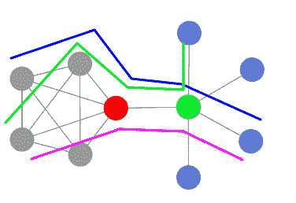

图 1 两组节点(灰色和蓝色)之间的随机游走。

数学上，我们可以通过其转移矩阵 P_ij 描述随机游走，由下式给出:

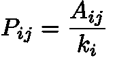

等式 1

其中，邻接矩阵 A 是图的代数表示，如果节点 I 和 j 相连，则其输入 A_ij 等于 1，否则为 0(见图)

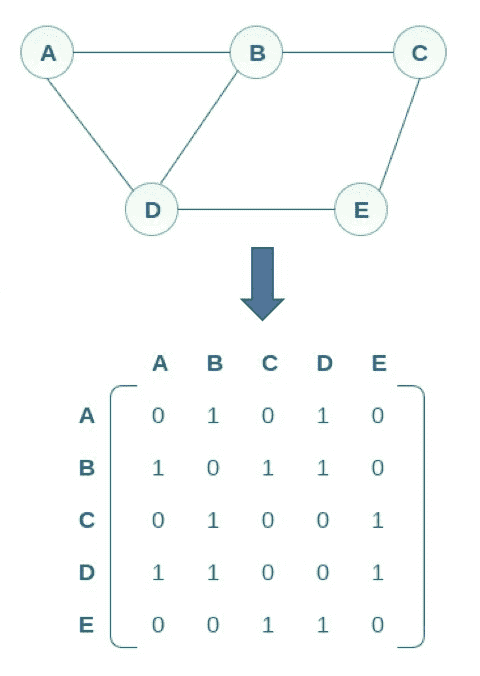

图 2 图或网络及其邻接矩阵。

k_i 是一个节点拥有的连接数。它被称为节点的度。例如，在图 2 中，节点 A 具有度 2，而节点 B 具有度 3。

# **对比结果**

表 1 显示了应用于维克多·雨果的小说《悲惨世界》中的人物之间的同现网络的不同方法之间的比较[10]。根据每个度量显示前 10 个最重要的字符。应当指出，几乎所有的措施都把主角“冉阿让”以及反面角色沙威视为最重要的因素。顶部的其他主要人物是伽弗洛什和马吕斯。只有亲近也包括珂赛特在内。

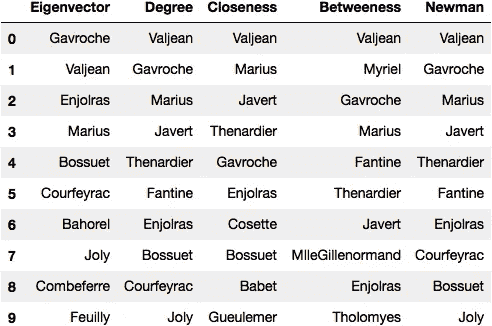

表 1。不同中心性度量的比较分析

请注意，排名与小说的主要人物非常一致，即使只考虑了互动(没有权重)，忽略了其频率。

# **随机漫步中间方法的实现**

我们首先引入实现基于随机行走的纽曼方法所必需的一组库。

使用的 Python 包

(i) Networkx 能够通过适当的方法进行图形处理和基本分析。

(ii) Numpy 为我们提供了一套代数运算的工具。

(iii) Matplotlib 用于可视化结果。

我们还实现了一个函数来读取 sif 文件(简单交互文件)

这个函数允许我们读取 sif 格式的数据集，并构建一个 networkx 图。然后，使用`nx.to_numpy_matrix(G)`我们创建其相应的邻接矩阵。

“转移”函数允许我们计算从节点 I 到节点 j 的概率。注意，这与等式(1)中的写法相同。然后，我们通过使图上的随机行走进化更大数量的步骤来模拟网络中的信息流。这是通过允许 walker 根据其转移概率从一个节点移动到一个邻居节点来实现的。

对于随机行走执行的每一步，我们将访问过的节点存储在一个名为 Orbit 的列表中。然后，我们计算随机漫步在图 G 的每个节点 I 上的访问频率，以这种方式获得每个节点的中心性。为了可视化的目的，我们从一个特定的色标中心值。

使用 nx.draw 函数绘制网络，使用 Kamada Kawai 布局计算节点的位置，这提供了网络的良好表示。色标用红色调表示最中心的节点，用蓝色调表示最不中心和最外围的节点。

最后，下面的代码块旨在导出使用该方法获得的排名的前 10 名，并将其存储在 pandas 数据帧中，以供表 1 中所示的后续分析和比较。

将中心性值标准化，并设计条形图来比较这里研究的每个中心性测量的重要性的规模和分布。

# **各种数据集中的应用**

## **悲惨世界网络图。**

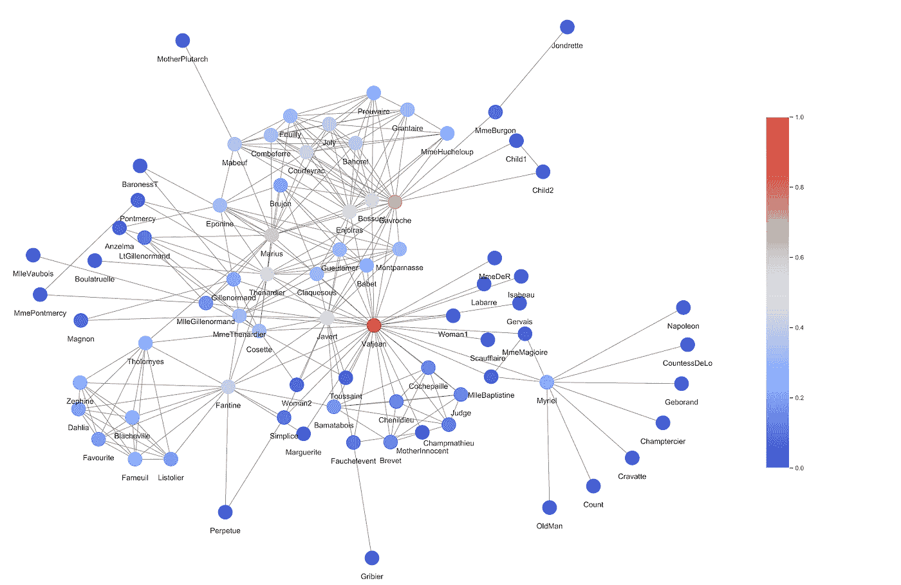

冉阿让突出显示为最中心的节点，以红色显示。接下来，我们将看到从所研究的不同方法获得的图，其轴是所涉及的节点及其在网络中相对于从轨道列表的 H 直方图获得的密度的影响或中心性(从 0 到 1)。由节点除以轨道的最大值产生。

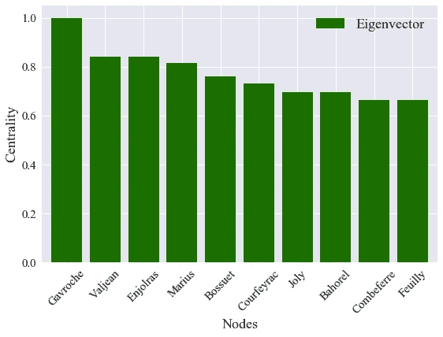

**特征向量中心性**:认为伽弗洛什是最有影响力的节点，其次是冉阿让。

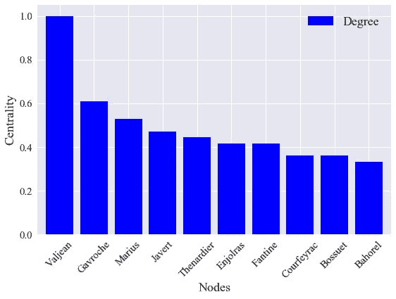

度中心性:冉阿让被认为是网络中最有影响力的节点，其次是伽弗洛什。比预期的要近。

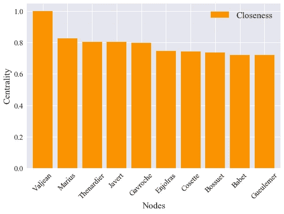

**接近中心性**:显示冉阿让为最中心节点，然后显示随后的 4 个形成具有大致相同重要性值的平台。沙威(与冉阿让对立的人物)、马吕斯和伽弗洛什脱颖而出。

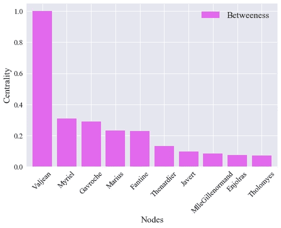

**中间中心性**:它将冉阿让显示为最有影响力的节点，并且由于其试探法中使用的测地线概念的限制性，以下中心性值与冉阿让相比呈现相当低的值。

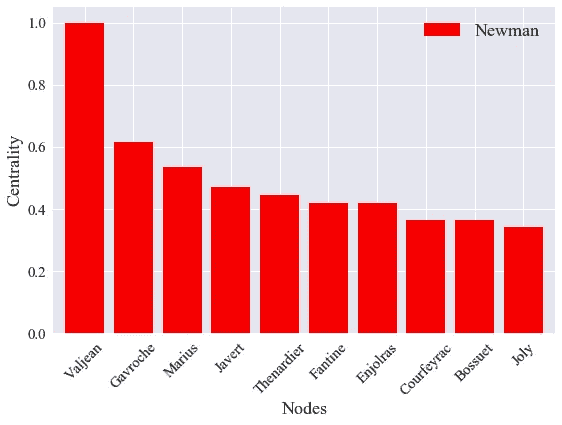

**纽曼基于随机游走的中心性**:给我们一个与小说中最有代表性的人物很符合的排名:冉阿让、伽弗洛什、马吕斯、沙威。包括更多的信息，例如转移矩阵中的共现频率，肯定会改善这个结果。

## **文艺复兴时期的佛罗伦萨家族网络。**

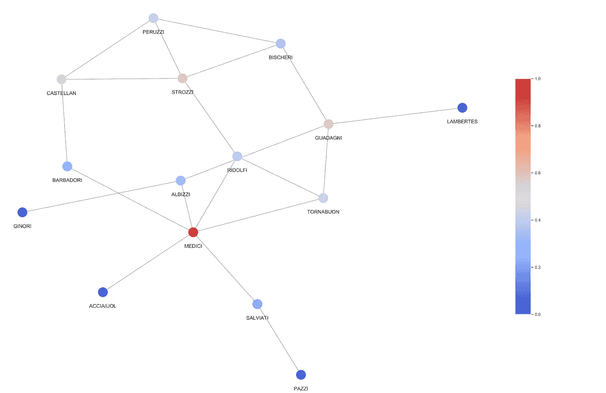

这个网络取自帕吉特等人的作品，并根据描述不同家庭间婚姻网络的历史文献构建而成。从[17，18]我们有证据表明，美第奇家族是 15 世纪佛罗伦萨最强大的。

## **扎卡里空手道俱乐部网**

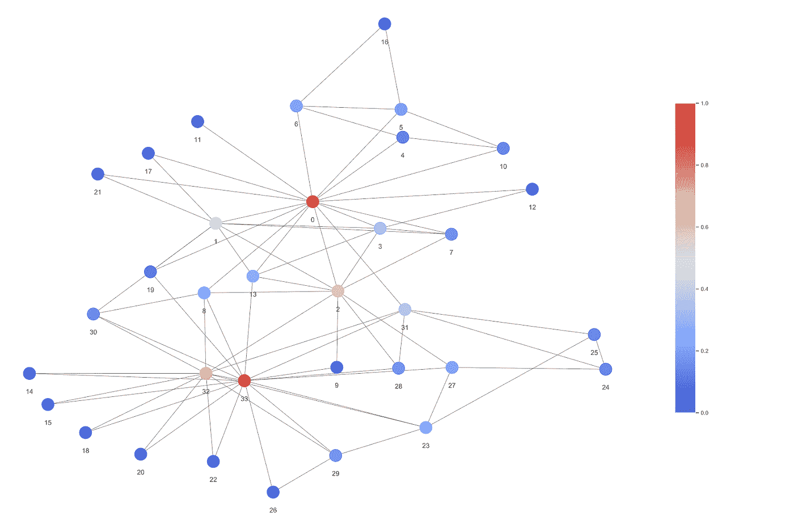

这个网络取自 Wayne Zachary 关于小型社会团体裂变的研究[19]。节点是大学空手道俱乐部的成员，它们之间的链接表示它们之间在俱乐部之外的社交互动。扎卡里的工作表明，最重要的节点是 33，32，和 0，分别是俱乐部的主席，副主席，和唤醒。了解了这一点，我们注意到，通过应用纽曼的算法，发现俱乐部主席和老师是这个网络中最有影响力的节点。

# **结论**

*   在基于随机游走的网络型数据库中实现了一种重要节点分析方法。
*   在几个测试网络中，其性能与文献中报道的其他中心性方法进行了比较，在这些测试网络中，存在关于节点的层次或重要性的部分或全部信息，显示纽曼方法具有更好的结果。
*   鉴于其性质，它可以并行化，采取许多轨道，而不是只有一个。
*   更实际的方法是考虑转移矩阵的渐近分析(稳态),这相当于进行无限长的随机行走。然而，关于暂时统计状态的信息却丢失了，而这些信息是人们非常感兴趣的。

# **代码**

所有代码都可以在存储库中找到:

【https://github.com/vtomasv/uiNin 

# **参考文献。**

1.  Grochowski，EG，Hoyt，RF & Heath，JS 磁硬盘驱动器外形尺寸演变。IEEE 磁学汇刊 29，4065–4067(1993)。
2.  A.博纳博·巴拉巴斯(2003 年)。“无标度网络”。科学美国人:50–59。
3.  施·斯特罗加兹，DJ·瓦茨(1998 年)。“小世界网络的集体动力”。大自然。393 (6684): 440–442.
4.  Amaral，LAN，Scala，a .，Barthélémy，M. & Stanley，何类小世界网络。美国国家科学院学报 97，11149–11152(2000)。
5.  [https://medium . com/swlh/what-is-influencer-marketing-the-complete-guide-2ef 95 a 6 EB 4a 3](https://medium.com/swlh/what-is-influencer-marketing-the-complete-guide-2ef95a6eb4a3)
6.  Herrera-Almarza G .，等从网络理论的角度看大肠杆菌蛋白质相互作用网络中必需基因的性质，科学与工程计算方法杂志 17 (1)，209–216(2017)。
7.  复杂网络中的流行病过程。现代物理学评论 87，(2015)。
8.  Yook，SH，Jeong，h .和 Barabási，AL 模拟互联网的大规模拓扑结构。*美国国家科学院院刊* 99 **，**13382–13386(2002)。
9.  Bottinelli，a .，Perna，a .，Ward，A. & Sumpter，2012 年欧洲复杂系统会议录。2012 年欧洲复杂系统会议论文集 591–606(2013)。doi:10.1007/978–3–319–00395–5
10.  社会网络分析方法与应用。(剑桥大学出版社，1944 年)。
11.  图的中心性指数。心理测量学。31, 4, 581–603 (1996).
12.  一个更快的中间中心性算法。今天。数学。搭档。25, 163–177 (2001).
13.  《权力与中心性:一系列衡量标准》。我是。你好。社会主义者 92, 1170 (1987).
14.  复杂网络中的重要节点识别。物理报告 650，1–63(2016). 650，
15.  纽曼，MEJ (2005)。“基于随机游走的中介中心性的度量”。社交网络 27:39–54。
16.  斯坦福图表库:组合计算的平台。(艾迪生-卫斯理，雷丁，马，1993)。
17.  帕吉特、JF 和安塞尔、CK《强力行动和美第奇家族的崛起，1400-1434》。我是。你好。社会主义者 98, 1259 (1993).
18.  社会和经济网络。(普林斯顿大学出版社，2010 年)。
19.  Zachary WW --小团体中冲突和分裂的信息流模型。你好。安东尼。第 33，452-473 号决议(1977 年)。