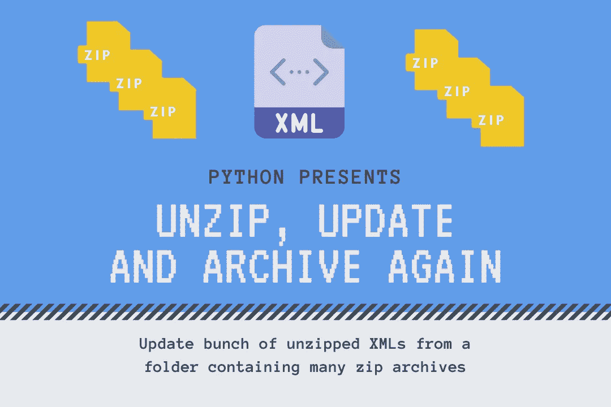
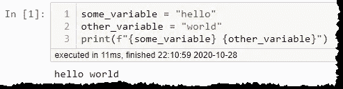
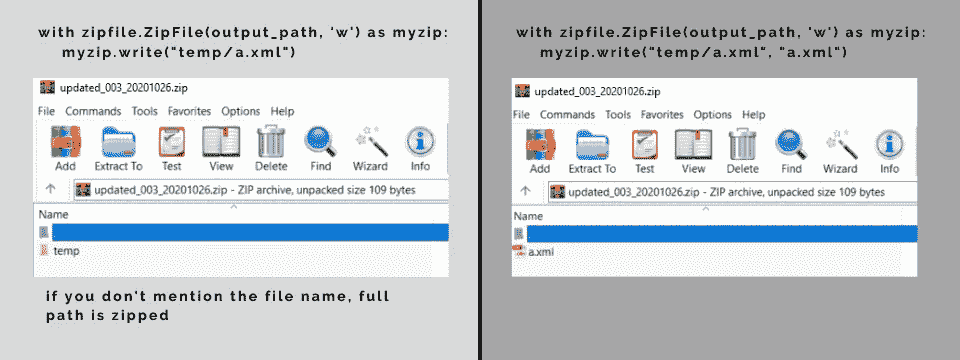

# 在一个文件夹中解压缩、更新和再压缩 XML

> 原文：<https://towardsdatascience.com/unzip-update-and-zip-again-xmls-in-a-folder-7d57f9710ddb?source=collection_archive---------24----------------------->

## 使用 python 自动化办公程序



作者图片

日常办公中，经常要带着一堆文件做一些事情。解压，移动，重命名，更新，再次压缩，发送或加载到 FTP。所有这些事情做起来都很简单，但是非常耗时，你必须手动地在数十或数百个文件上重复它们。

幸运的是，您可以使用编程语言来自动化这些重复的任务。Python 是一个理想的选择，因为它很容易在计算机上安装，几乎不用试错，即使是计算机新手也能创建程序。Python 是一种通用的编程语言，基本上你可以用它解决任何问题。

让我们来探讨一个在许多行业中相当常见的任务。我们将:

1.  解压缩一组文件
2.  更新它们的内容—在我们的示例中，我们将更改 XML 节点的内容
3.  使用`zipfile` 和`shutil` 库再次压缩结果

你可以在 github 笔记本-[Unzip _ Update _ Zip _ full . ipynb](https://github.com/vaclavdekanovsky/data-analysis-in-examples/blob/master/Unzip/XML/Unzip_Update_Zip_full.ipynb)中跟进这个练习。

# 安装 Python



在 Jupyter 笔记本中执行的示例 python 代码

有几种方法可以在你的电脑上设置 python。我个人很喜欢使用 Anaconda 和 Jupyter 笔记本。您下载并安装 conda 包，该包旨在通过所有可能的增强使 python 环境易于管理，并运行笔记本，这是包的重要部分。

在笔记本中，您可以运行包含一行或多行代码的单独单元格，并立即看到结果。这种方法非常适合原型开发。在 google、 [stackoverflow、](http://stackoverflow.com/)和教程的帮助下，例如在 [medium](https://medium.com/) 上，你可以快速组合你需要做的事情所需的代码片段。

# **解压缩**

让我们探索一下如何在 python 中处理解压文件的任务。只要去谷歌输入“解压 python”就可以了。它会快速列出结果，你可以选择，比如说最大的编码问答网站之一——[stack overflow 的 Python 解压文件](https://stackoverflow.com/questions/3451111/unzipping-files-in-python)。在 3 行代码中，您将了解如何做到这一点:

```
import zipfile
with zipfile.ZipFile(path_to_zip_file, 'r') as zip_ref:
    zip_ref.extractall(directory_to_extract_to)
```

你在`import`图书馆工作所需的`.zip`文件— `zipfile`。这允许您使用它的函数和方法来解包归档文件并再次压缩它们。

首先，使用`zipfile.ZipFile(path_to_zip_file, 'r')`打开归档文件进行读取，然后将包的内容提取到目录`zip_ref.extractall(directory_to_extract_to)`中。

我使用了`with`符号来确保打开归档文件，执行一个操作，然后关闭归档文件，以便从内存中释放其内容。它可以防止在处理成百上千个文件时出现内存泄漏。

# 解压缩包含许多文件的文件夹

在 python 中解压缩一个文件需要使用三行代码。要解压缩一堆文件，您只需再添加几行。您必须识别文件夹中的 zip 文件，并将它们传递给我们上面描述的过程。

`os`库让你既可以获得文件夹`os.listdir()`的内容，又可以使用`os.path.join(folder,file)`将文件夹和文件名组合起来。Listdir 返回文件和子文件夹。您可以添加`file.endswith(".zip")`来仅识别档案。

> 或者你可以使用`os.path.splitext()`。它的第二个输出是文件扩展名。

知道了文件夹中的所有文件，就可以应用前面的代码来解压缩它们。同样，您可以遍历文件并解压缩每个文件，或者将解压缩打包到一个函数中，该函数在一行综合符号中调用。

```
def unzip(folder: str, file: str, folder_to_extract: str) -> list:
    """unzips a file in a folder into folder_to_extract
    returns a list of files in the zip archive"""
    with zipfile.ZipFile(os.path.join(folder,file), 'r') as zip_ref:
        zip_ref.extractall(folder_to_extract)
        return zip_ref.namelist()# applying a function to the output can be squeezed into the list comprehension
[unzip(folder, f, "temp") for f in os.listdir(folder) if f.endswith(".zip")]
```

# 更新提取的 XML

一旦我们将 XML 提取到`temp`文件夹中，我们就可以使用它了。Python 包含 [xml.etree](https://docs.python.org/3.9/library/xml.etree.elementtree.html#module-xml.etree.ElementTree) 库来处理 xml 文件。在我们的例子中，我们知道 zip 存档包含一个 XML 文件`a.xml`，尽管您可以使用`zip_ref.namelist()`列出存档中的所有文件。

要更新 XML 文件，您必须导入树库并加载 XML 文档。

```
from xml.etree import ElementTree as ET# parse the XML document into a variable
tree = ET.parse(path)# get the root emelement containing all the XML nodes
root = tree.getroot()
```

> 请记住，从`tree` 派生的任何变量都是一个引用。当您更新这些变量的内容时，您也更新了`tree`。

假设我们想要更新 XML 中的`<id>...</id>`节点。我们必须首先找到它。etree 库中有几种定位 XML 节点的方法。

*   `.find()`找到 XML 元素的第一次出现
*   `.findall()`列出子元素的所有外观

这两种方法都接受元素的名称，或者您可以使用`xpath`找到它。Xpath 是一种在 XML 中定位所需元素的地址。一旦找到使用的节点，就用`.text`参数来获取写在标签之间的值。

```
# in the <data> find the <id>...</id> node and show its content (.text)
id = root.find("id").text
```

我们的 Id 由下划线“_”分隔成三部分:

*   前缀
*   版本
*   日期

其中一个 XML 的 id 是`test_001_20201026`。`.text`返回字符串形式的值，您可以应用`.split("_")`函数将文本分解成细节。

```
[In]: 
  split_id = id.split("_")
  print(split_id)[Out]: ["test","001","20201026"]
```

输出是一个 python 列表，可以很容易地按元素更新。首先我们改变前缀`split_id[0] = new_prefix`。然后我们更新版本。

```
split_id[0] = new_prefix
split_id[1] = "{:03d}".format(new_version) 
```

如果需要将`1`转换为`001`，我们已经使用`"{:03d}".format(new_version)`添加了最多 3 个字符的前导零。

更新的值可以通过`.join("_")`组合成一个字符串，原始的 XML 组件可以用它来更新:

```
root.find("id").text = "_".join(split_id)
```

正如我提到的，对从`tree`派生的变量的任何更新也会更新`tree`。我们已经实现了我们想要的 XML 更新，我们只需要使用`tree.write(output_path)`将其导出。

让我们看看 XML 更新的完整代码:

# 压缩更新的 XML

现在更新后的`a.xml`位于`temp`文件夹中。我们只需要压缩它，并将这个归档文件放到`processed` 文件夹中。让我们首先创建输出文件夹，如果它不存在的话。我们将使用`pathlib`库中的`Path`。

```
# create the output folder if it doesn't exists
Path(output_folder).mkdir(parents=True, exist_ok=True)
```

然后，我们使用`zipfile` lib 将 XML 打包到 zip 存档中。现在我们必须打开归档文件进行写入`'w'`。然后我们使用这个档案和`.write(path_to_file, name_of_this_file)`的引用。

> 如果不指定第二个参数`name_of_the_zipped_file`，那么包括文件夹和子文件夹在内的整个路径都会被压缩。

如果你不知道文件名，`os`库可以用它的`os.path.basename()`功能帮你。

```
with zipfile.ZipFile(output_path, 'w') as myzip:
    myzip.write(path_to_processed_xml, os.path.basename(path_to_processed_xml))
```



压缩时，指定压缩文件的名称，以避免压缩包含的文件夹。作者图片

尽管有时你也需要打包文件夹和文件。在我们的例子中`Folder_001_20201101.zip`包含一个文件和另一个文件夹中的文件。

*   folder_A/a.xml
*   efg.txt

在这种情况下，使用 zipfile 会有点太完整，但是在`[shutil.make_archive](https://docs.python.org/3/library/shutil.html)(output_folder, format, folder_to_pack)`中有一个替代方法。这个方法只将`folder_to_pack`的内容存档，并将结果放在`output_folder`中。您可以选择`zip`、`tar`、`gztar`、`bztar`、`xztar`格式。

# 把它们放在一起

现在我们知道了该过程的所有组成部分:

1.  将一个文件夹中的多个归档文件解压缩到一个临时文件夹中
2.  更新了每个解压后的文件
3.  并将更新后的文件再次压缩到归档文件中

在这个最后的练习中，我们必须做一些小小的调整。我们将使用原始存档的名称，更新它，同时更新所有包含的 XML 的内容。原因是归档中可能有两个或更多的 XML，每个都有不同的 id，我们将它们全部压缩回更新的 zip 归档(不能有两个不同的名称)。

完整的代码，可以在这个笔记本中找到—[Unzip _ Update _ Zip _ full . ipynb](https://github.com/vaclavdekanovsky/data-analysis-in-examples/blob/master/Unzip/XML/Unzip_Update_Zip_full.ipynb)

# 结论

在这个简单的教程中，您已经看到了 python(或任何其他编程语言)的威力。在几行代码中，您可以自动执行任务，如果手动执行，将会花费大量时间。当决定是否值得花时间编码时，我使用这个原则:

> 如果你做一次小事情，手动做。如果它很大，你在许多项目上重复同样的操作，或者你认为你将来不得不这样做——用编程语言自动化。

这个例子中的操作可以有许多变化。您可能希望更新不同的 XML 节点。zip 可能包含 CSV 文件。您宁愿更新日期，而不是前缀和版本。您可能需要修改输入—例如，将版本增加 1 或在日期上添加一周。

只要对代码稍加修改，所有这些都是可能的。您也可以在 Github[上的 jupyter 笔记本中查看完整的示例。](https://github.com/vaclavdekanovsky/data-analysis-in-examples/blob/master/Unzip/XML/Unzip_Update_Zip_full.ipynb)

我希望你喜欢这篇关于压缩和 XML 处理的教程，也希望你喜欢用 python 可以实现的东西。可能性是无限的。

```
Other articles:* [Plotly Express complete tutorial](/visualization-with-plotly-express-comprehensive-guide-eb5ee4b50b57)
* [Very illustrative highlighted line chart](/highlighted-line-chart-with-plotly-express-e69e2a27fea8)
* [Plotly Histogram - Complete Guide](/histograms-with-plotly-express-complete-guide-d483656c5ad7)
* [Everything you wanted to know about Kfold train-test split](/complete-guide-to-pythons-cross-validation-with-examples-a9676b5cac12)
* [How to turn a list of addreses into a map](/pythons-geocoding-convert-a-list-of-addresses-into-a-map-f522ef513fd6)
```