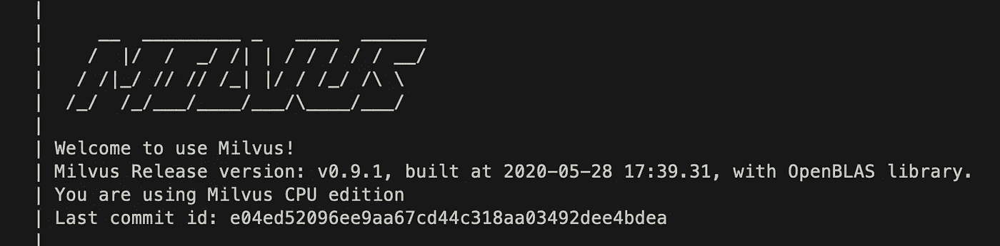
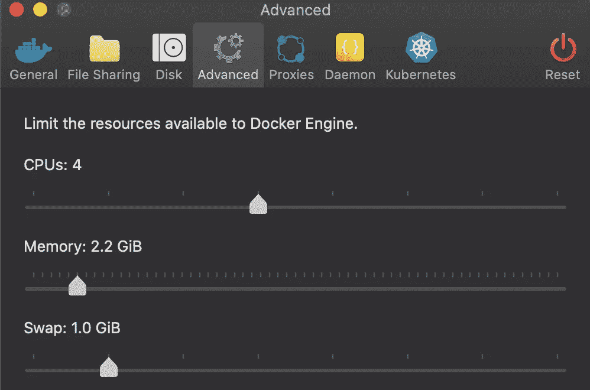
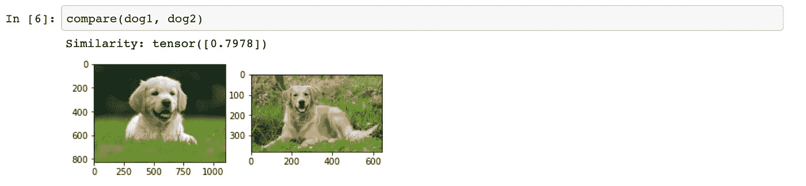
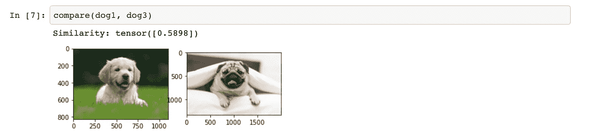
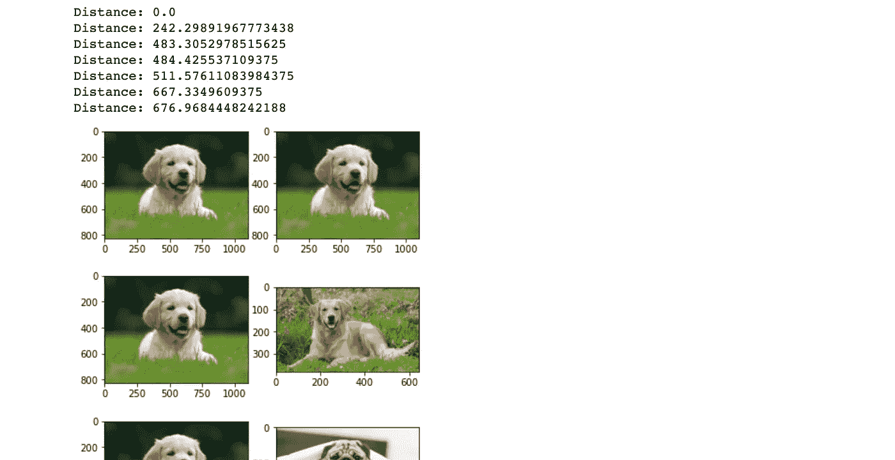

# 与 Milvus 一起运行

> 原文：<https://towardsdatascience.com/up-and-running-with-milvus-2466161e8b1f?source=collection_archive---------25----------------------->

## 向量相似性搜索引擎。构建推荐并搜索图像/视频、音频或非结构化文本。


马库斯·温克勒在 [Unsplash](https://unsplash.com?utm_source=medium&utm_medium=referral) 上的照片



# 什么是 Milvus？

一个矢量相似性搜索引擎，看起来已经可以生产了。据[网站](https://milvus.io/):

*   它提供了多种相似性度量和索引类型。
*   水平缩放。
*   读写几乎是实时进行的，这意味着我们可以在引擎在线时插入记录。
*   公开一个 REST 接口。

听起来很酷！

对于那些还不知道的人来说，像这样的技术有很多用例。在机器学习的帮助下，我们可以搜索图像、视频和音频。

假设我们训练了一个对图像进行分类的 CNN。如果我们在最终输出之前查看任何层的输出，我们可能会发现描述输入的 N 维特征向量。随着我们在网络中移动，这些特征变得更加具体。开始时，我们可以识别纹理、形状等。接近尾声时，我们辨认出像猫耳朵和狗尾巴这样的物体。我们可以获取这些层的输出，通过某种方法将其展平，并在搜索引擎中对其进行索引！瞧啊。所选择的层将对什么被认为是“相似的”产生影响。这将因使用情形而异。这个例子是基于内容的图像检索(CBIR)的一个应用。

# 我们在建造什么？

一个非常简单的在 Dockerized 环境中使用 Milvus 的 CBIR 实现。这是完整的回购协议和我们将使用的技术列表。如果你想下载回购，只是乱搞，它已经准备好了。

[](https://github.com/dshvimer/milvus-up-and-running) [## dshvimer/milv us-启动并运行

### 在 GitHub 上创建一个帐户，为 dshvimer/milvus 的启动和运行开发做出贡献。

github.com](https://github.com/dshvimer/milvus-up-and-running) 

*   python——因为
*   Docker —这样每个人都有一个标准的环境
*   py torch——因为我总是跳 Keras，想学点新东西。
*   Jupyter 笔记本—与 Milvus 互动的简单方式

# 设置项目

在一个新的目录中，让我们创建更多的空目录。

```
-project
  -notebook
  -milvus
    -conf
```

在顶层目录中，创建一个名为`docker-compose.yml`的文件，内容如下:

```
version: '2.0'
services:
    notebook:
        build:
            context: ./notebook
        ports:
            - '8888:8888'
        volumes:
            - ./notebook:/home/jovyan
        links:
            - milvus
    milvus:
        image: milvusdb/milvus:0.9.1-cpu-d052920-e04ed5
        ports:
            - '19530:19530'
            - '19121:19121'
        volumes:
            - ./milvus/db:/var/lib/milvus/db
            - ./milvus/conf:/var/lib/milvus/conf
            - ./milvus/logs:/var/lib/milvus/logs
            - ./milvus/wal:/var/lib/milvus/wal
```

我们定义了两个 docker 容器，一个用于 Milvus，另一个用于 jupyter 笔记本。Milvus 容器通过`links`属性对笔记本可见。我们声明的卷是为了让 Milvus 文件系统与我们的操作系统共享一些文件夹。这让我们可以轻松地配置和监控 Milvus。因为我们给了笔记本容器一个上下文来构建，所以我们需要在`notebook`目录中创建一个名为`Dockerfile`的文件，其内容如下:

```
FROM jupyter/scipy-notebookRUN pip install pymilvus==0.2.12RUN conda install --quiet --yes pytorch torchvision -c pytorch
```

这不是声明依赖关系的最佳方式，但可以在以后进行优化。我们还应该下载一些图片来玩。随意下载我用的[这里的](https://github.com/dshvimer/milvus-up-and-running/tree/master/notebook/images):把它们放入`notebook/images`。

最后一步，下载启动器 Milvus [配置文件](https://raw.githubusercontent.com/milvus-io/milvus/v0.9.1/core/conf/demo/server_config.yaml)并放入`milvus/conf/`中。现在只要 Docker 安装并运行，我们运行`docker-compose up`，我们就活了！

如果您在控制台输出中看到以下行:

```
milvus_1    | Milvus server exit...milvus_1    | Config check fail: Invalid cpu cache capacity: 1\. Possible reason: sum of cache_config.cpu_cache_capacity and cache_config.insert_buffer_size exceeds system memory.milvus_1    | ERROR: Milvus server fail to load config file
```

这意味着 Docker 没有足够的内存来运行 Milvus。如果我们打开配置文件并搜索“cpu_cache_capacity ”,我们会看到一些有用的文档。"T11'插入缓冲区大小'和' cpu 缓存容量'之和必须小于系统内存大小。"

将两个值都设置为 1，然后打开 Docker 的设置，确保将其配置为任何大于 2GB 的值(必须大于)。确保应用设置并重启 Docker。然后再试试`docker-compose up`。如果有其他问题，请在评论中告诉我。



# PyTorch 特征向量

有趣的东西，开始了。一旦一切都运行了，我们应该有一个 URL 来访问我们的 jupyter 实例。让我们创建一个新的笔记本并开始编码。一次一个细胞。

首先是进口:

```
import torch
import torch.nn as nn
import torchvision.models as models
import torchvision.transforms as transforms
from torch.autograd import Variable
from PIL import Image
import matplotlib.pyplot as plt
import numpy as np
%matplotlib inline
```

现在让我们定义一个助手类来提取特征向量:

我为什么选 ResNet18？因为它有一个输出长度为 512 的平面向量的层。学习新事物时，方便和容易是合理的。这个类有很大的扩展空间。我们可以一次从多个层提取特征，并一次输入多个图像。就目前而言，这已经足够好了。

现在，我们可以加载我们的图像，并开始查看相似性:

```
feat_vec = FeatureVector()
dog1 = Image.open('./images/dog1.jpg')
dog2 = Image.open('./images/dog2.jpg')
dog3 = Image.open('./images/dog3.jpg')
cat1 = Image.open('./images/cat1.jpg')
cat2 = Image.open('./images/cat2.jpg')
person1 = Image.open('./images/person1.jpg')
person2 = Image.open('./images/person2.jpg')def compare(a, b):
    plt.figure()
    plt.subplot(1, 2, 1)
    plt.imshow(a)
    plt.subplot(1, 2, 2)
    plt.imshow(b)
    a_v = feat_vec.get_vector(a)
    b_v = feat_vec.get_vector(b)
    print('Similarity: {}'.format(feat_vec.similarity(a_v, b_v)))compare(dog1, dog2)
```



在第一个例子中，小狗和成年金毛猎犬图像的相似性得分约为 0.79。当我们比较一只小狗金毛寻回犬和一只哈巴狗时，我们得到的相似性分数约为 0.58。

# 使用 Milvus:连接、插入、查询

让我们做我们来这里要做的事。我们从连接 Milvus 开始，创建一个集合

```
from milvus import Milvus, IndexType, MetricType, Status# Milvus server IP address and port.
# Because the link to milvus in docker-compose 
# was named `milvus`, thats what the hostname will be
_HOST = 'milvus'
_PORT = '19530'  # default value# Vector parameters
_DIM = 512  # dimension of vector_INDEX_FILE_SIZE = 32  # max file size of stored indexmilvus = Milvus(_HOST, _PORT, pool_size=10)# Create collection demo_collection if it dosen't exist.
collection_name = 'resnet18_simple'status, ok = milvus.has_collection(collection_name)
if not ok:
    param = {
        'collection_name': collection_name,
        'dimension': _DIM,
        'index_file_size': _INDEX_FILE_SIZE,  # optional
        'metric_type': MetricType.L2  # optional
    }print(milvus.create_collection(param))# Milvus expo
_, collection = milvus.get_collection_info(collection_name)
print(collection)
```

现在我们可以插入图像的特征向量。我们需要将向量转换成 python 列表:

```
images = [
    dog1,
    dog2,
    dog3,
    cat1,
    cat2,
    person1,
    person2
]# 10000 vectors with 128 dimension
# element per dimension is float32 type
# vectors should be a 2-D array
vectors = [feat_vec.get_vector(i).tolist() for i in images]# Insert vectors into demo_collection, return status and vectors id list
status, ids = milvus.insert(collection_name=collection_name, records=vectors)
if not status.OK():
    print("Insert failed: {}".format(status))
else: print(ids)
```

如果成功了，我们应该会看到 Milvus 用来识别图像的 ID 列表。它们的顺序与我们的图像列表相同，因此让我们创建一个快速查找表，以便在给定一些 ID 的情况下轻松访问图像:

```
lookup = {}
for ID, img in zip(ids, images):
    lookup[ID] = imgfor k in lookup:
    print(k, lookup[k])
```

我们可以将新项目刷新到磁盘上，并为收藏获取一些信息:

```
# Flush collection  inserted data to disk.
milvus.flush([collection_name])# Get demo_collection row count
status, result = milvus.count_entities(collection_name)
print(result)
# present collection statistics info
_, info = milvus.get_collection_stats(collection_name)
print(info)
```

让我们搜索！

```
# execute vector similarity search
search_param = {
    "nprobe": 16
}print("Searching ... ")param = {
    'collection_name': collection_name,
    'query_records': [vectors[0]],
    'top_k': 10,
    'params': search_param,
}status, results = milvus.search(**param)
if status.OK():
    print(results)
else:
    print("Search failed. ", status)
```

如果我们看到结果列表，这意味着一切都很好。我们可以用下面的代码片段将它们可视化

```
for neighbors in results:
    for n in neighbors:
        plt.figure()
        plt.subplot(1, 2, 1)
        plt.imshow(images[0])
        plt.subplot(1, 2, 2)
        plt.imshow(lookup[n.id])
        print('Distance: {}'.format(n.distance))
```



要删除收藏:

```
milvus.drop_collection(collection_name)
```

# 结论

启动并运行起来非常容易。这里大部分与 Milvus 相关的代码来自网站上的入门示例。我们的一个向量大小约为 1KB，因此我们可以将一百万个特征向量放入 1GB 的内存中。我们在这里没有使用索引，这会增加成本，但这仍然是一种非常有效的图像索引方式。网站文档很棒，但是我认为通读配置文件是理解这个东西能做什么的好方法。在这篇文章中，我们把它保持得非常简单，但是对于那些想更进一步的人来说，这里有一些想法:

*   预处理特征向量。(即标准化)
*   尝试不同的层，如果它们不平坦，尝试最大池化或平均池化，然后平坦化
*   应用降维技术:tNSE、PCA、LDA
*   使用自动编码器进行预处理

这是我的第一篇文章。所以如果你喜欢，请告诉我。如果有什么不工作或格式被关闭，也让我知道！在外面保持优雅。