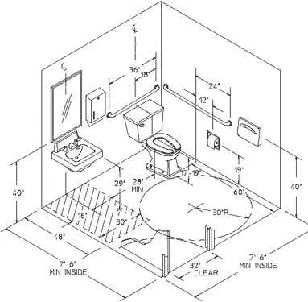
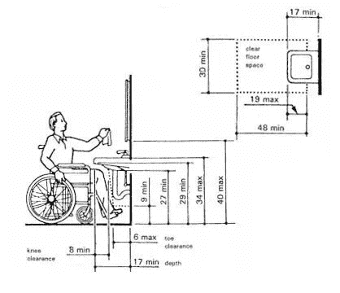
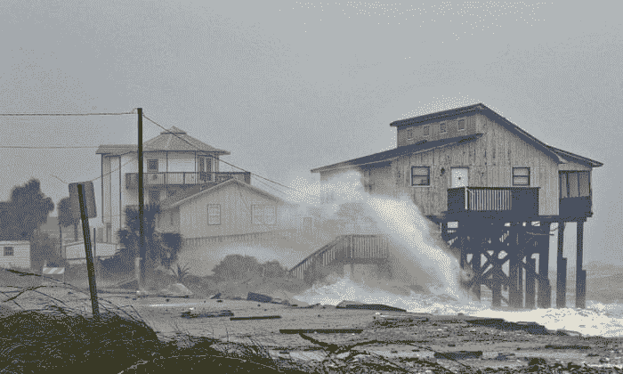
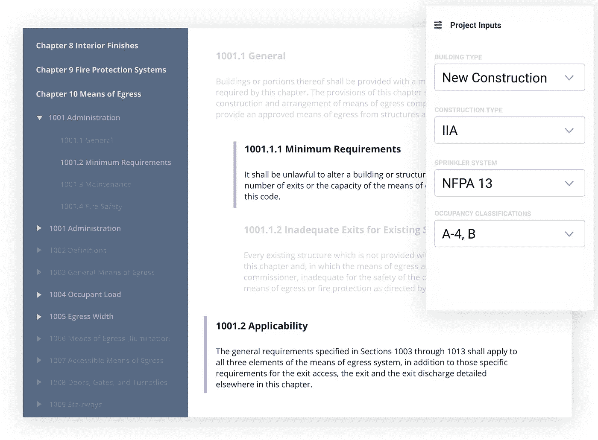
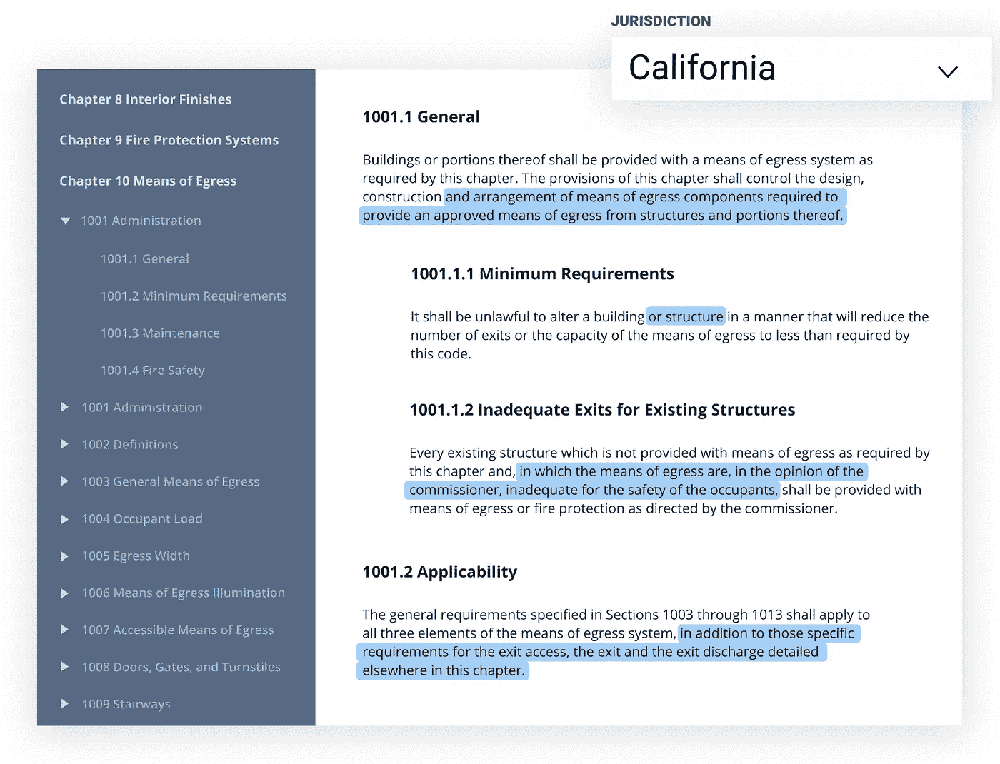
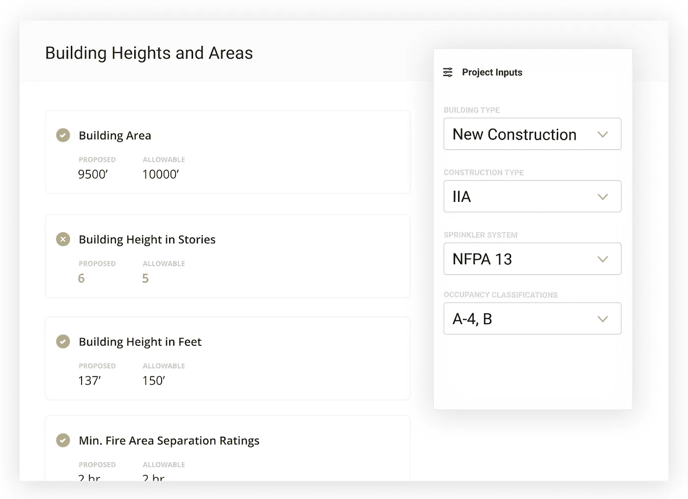
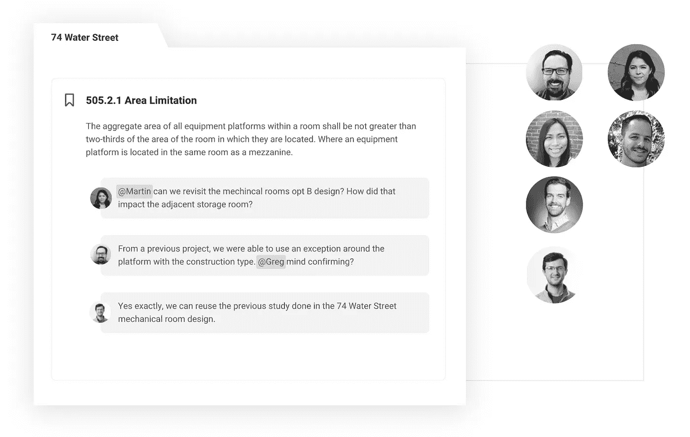
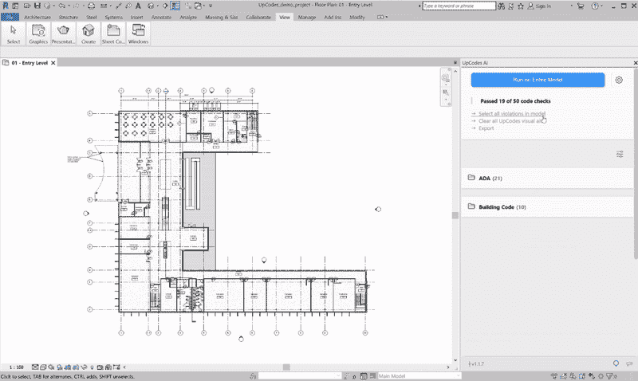
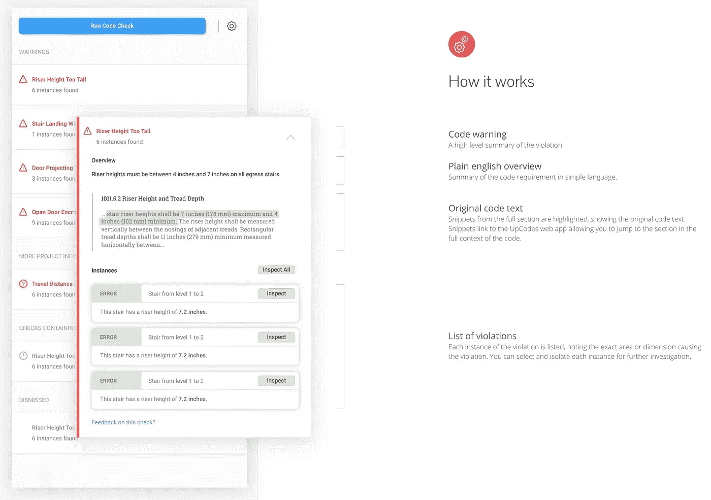

# 升级代码

> 原文：<https://towardsdatascience.com/upcodes-36f724b81d42?source=collection_archive---------41----------------------->

## 从注册建筑师的角度看建筑规范符合性的未来:UpCodes Web & UpCodes AI

[来源。](https://www.bobvila.com/articles/709-complying-with-the-code/)

作为一名注册建筑师和数据科学家，我对通过数据科学和机器学习简化建筑实践中的工作流感兴趣。我作为一名建筑师已经工作了 4 年，我知道建筑师、工程师和承包商在建筑法规合规性方面面临的挫折。需要有一种更好的方法来设计符合规范的建筑——多亏了一家名为 **UpCodes 的初创公司，这种方法确实存在。**

# 什么是建筑规范？

简要概述— **建筑规范是确保建筑用户安全和无障碍的标准。**例如，建筑法规限制火灾时出口的距离，要求容纳更多人的房间有更多的门，并强制规定楼梯台阶的最大高度。

虽然建筑规范并不意味着抑制建筑师和设计师的创造力，但它往往会成为设计问题创造性解决方案的障碍。架构师经常会看到代码符合性的图表——并且只是想准确地提供所显示的内容以确保符合性。可以说，构建代码可能是一个令人沮丧和痛苦的需求，它经常抑制设计过程的创造性流动。

左图:符合美国残疾人协会指南的无障碍浴室的三维示意图。右图:剖面图显示了符合 ADA 指南的间隙和安装高度。[来源。](https://www.partitionsandstalls.com/ada-bathroom-layout.html)

# 我使用哪种建筑规范？

更复杂的是，强制执行的建筑法规在不同的司法管辖区可能会有所不同。不同的建筑规范可能会在地方一级或国家一级采用，这可能会变得非常混乱！有[地图](https://www.iccsafe.org/wp-content/uploads/Code_Adoption_Maps.pdf)和其他[文档](https://www.iccsafe.org/gr/Documents/AdoptionToolkit/HowStatesAdopt_I-Codes.pdf)显示各州的代码采用情况。

例如，在不涉及太多细节的情况下，佛罗里达州迈阿密的一栋新公寓楼与加利福尼亚州旧金山的同一栋楼相比，将有不同的建筑规范要求。在迈阿密——建筑规范坚持设计要求，以应对飓风和风暴潮的可能性，而在旧金山——建筑规范假定需要更坚固的建筑来抵御地震。

建筑规范因管辖范围和面临的独特挑战而异。左:佛罗里达。[来源。](https://www.theguardian.com/us-news/2018/oct/11/hurricane-michael-strongest-storm-to-hit-us-since-1992-batters-florida#img-1)右图:旧金山。[出处。](https://time.com/3739989/california-earthquake-usgs-ucerf3/)

# 我引用哪个代码段？

一旦我们弄清楚了管辖区使用的建筑规范，我们必须确保我们引用了规范的正确的**部分**。有不同的章节涉及建筑设计的各个方面。有关于占用，建筑高度&面积，建筑结构类型，出口，内部装修等章节。

因此，当我们设计建筑时，我们必须在物理代码簿(或者 PDF 文档，如果你幸运的话)的页面中搜寻，找到我们需要参考的正确部分，以确保合规性。仅 IBC 2018(一个通用的建筑标准)就有 726 页——这可能是你的项目必须遵守的许多建筑规范之一。所以你可能需要为你的项目引用成千上万的页面。

国际代码委员会(ICC)开发的代码集。他们是开发建筑规范的几个主要实体之一。有很多要记录的！[来源。](https://www.iccsafe.org/content/2018-i-codes-free-trial/)

作为一名建筑师，可能需要数年的时间来积累足够的经验和专业知识，以便对建筑规范足够熟悉，从而培养对符合规范的设计的敏感性。我注意到的是这样的:年轻的设计师通常不确定一个特定的设计决策是否符合代码，直到更高级的架构师检查他们的工作。这导致对设计安全和无障碍空间缺乏信心，不得不返工，而成功取决于对更年长、更有经验的员工的依赖。

# 一定有更好的方法…

所以现在你明白了构建代码的头痛之处，一定有更好的方法，对吗？自从计算机出现以来，科技公司彻底改变了建筑师设计建筑的方式。 [Autodesk](https://www.autodesk.com/) 改变了建筑师通过 AutoCAD 和 Revit 绘制图纸的方式。 [Adobe](https://www.adobe.com/) 改变了建筑师通过 Photoshop、Illustrator 和 InDesign 制作图表、渲染和演示的方式。那么，技术如何解决建筑法规合规性的问题呢？

# 升级代码

输入: [UpCodes](https://up.codes/) 。这家初创公司利用数据和软件开发的力量为架构师创造了两种工具。第一个工具是[**UpCodes Web**](https://up.codes/features)**——这是一个搜索引擎，(想想谷歌)增强了机器学习和分析，唯一的目的是找到你需要的建筑代码，超级快。第二个工具是 [**UpCodes AI**](https://up.codes/features/ai) —这是 Revit 的一个插件，允许我们实时查看代码错误！这些工具有可能每年为 AEC 专业人员节省数千小时的辛苦时间。**

# **UpCodes 网站**

**Upcodes Web 是一个查找建筑规范的一站式商店，而不是在多个代码簿、网站或 pdf 中查找。通过提供“项目输入”,如我们的建筑类型、建筑类型、喷水灭火系统和建筑占用等级，UpCodes 可以过滤以仅显示与我们的项目唯一相关的建筑代码。这有助于所有年龄段的架构师和工程师更快速、更自信地浏览代码。**

****

**通过提供“项目输入”，UpCodes 将与我们的项目无关的代码变灰，只突出显示我们关心的代码。[资料来源:UpCodes](https://up.codes/features)**

**有时，司法管辖区会对通用建筑规范进行修改，如国际建筑规范(IBC)——UpCodes 帮助我们识别这些变化。UpCodes 随时更新 UpCodes 网络工具，更新我们管辖区最近可能实施的任何修订，因此我们始终关注最新的指南。**

****

**例如，通过选择“California”作为我们的辖区，我们可以快速突出显示并了解加州与典型基础建筑规范的独特差异，如 IBC。[资料来源:UpCodes](https://up.codes/features)**

**在设计的早期阶段，建筑师需要确定支持建筑规模的建筑类型。一般来说，建筑物越大和/或越高，建筑系统就必须越坚固。存在与建筑面积、楼层数和建筑高度相关的限制，这些限制会随着建筑占用、建筑类型和其他因素的变化而变化。为了解决这个问题，UpCodes Web 工具有一个**计算器**功能，在提供您的“项目输入”后，允许我们检查我们没有超出允许的建筑面积、建筑高度或楼层数。**

****

**计算器功能一瞥。在提供我们的项目输入之后，一个绿色的“检查”意味着我们的项目是代码兼容的。红色的“X”表示我们不符合规范。[资料来源:UpCodes](https://up.codes/features)**

**UpCodes Web 将代码研究变成了一项更友好、更有吸引力的社交活动！通过在 UpCodes Web 中创建一个项目，团队成员可以评论、标记和共享可能需要进一步审查或可能引发项目设计变更的代码摘录。我们可以边看建筑规范边聊建筑规范。**

****

**您可以在 UpCodes web 应用程序中与您的项目团队一起对代码摘录进行评论。[资料来源:UpCodes](https://up.codes/features)**

# **UpCodes AI**

**UpCodes AI 是 Autodesk Revit 的一个插件。对于那些使用 Revit 的人来说，你们是否有过这样的想法:**

> **“如果 Revit 能告诉我这些(楼梯、走廊、门、ADA 卫生间等)是否符合规范，那就太好了。”**

**你猜怎么着:这正是 UpCodes AI 所做的！目前，该项目只关注构建代码的两个方面:egress 和 ADA。将来，有望支持更多的构建代码方面，使该工具更加全面和健壮。**

**要使用该工具，您只需下载并安装插件，它就会与您现有的 Revit 模型集成，自动分析模型的构件和几何图形。该工具可以标记建筑规范错误，并按类别对其进行分类，无论是 ADA、浴室还是门。我们可以单击这些类别来突出显示模型中的单个问题。从这里开始，我们可以进行必要的设计更改以符合代码。这个工具有可能改变我们使用建筑规范的方式，集成到我们用来建模和记录建筑设计的主要软件中。我们不再需要等待更有经验的高级架构师(或者外部顾问)的代码审查。有了这个工具，每个人都可以随时检查他们的工作是否符合代码。 **UpCodes AI 允许我们在设计时检查我们的工作，而不是在设计之后。**查看下面 UpCodes AI 的视频演示。**

****

**UpCodes AI 的视频演示。[来源:UpCodes](https://up.codes/features/ai)**

**当我们在 UpCodes AI 中查看问题时，该工具会显示与错误相关的特定代码信息。首先，它向我们简要概述了这个问题。第二，它将建筑规范中通常隐晦的语言解释成“外行人的术语”，以便每个人都能理解问题。第三，它提供了原始代码摘录以供参考，只需单击一下就可以带您到 UpCodes Web 应用程序，如果需要，可以查看更多的构建代码。最后，它列举了我们模型中的每一个代码违规实例——我们可以使用“Inspect”按钮直观地研究每一个违规。见下图。**

****

**UpCodes AI 如何引起我们对代码违规的注意。[资料来源:UpCodes](https://up.codes/features/ai)**

**随着时间的推移，UpCodes 会自动更新新功能。来自 UpCodes AI 用户的反馈决定了该工具如何开发和进化。他们优先考虑用户反馈中最受欢迎的请求。你可以在这里给升级代码 AI 更新日志[留下反馈。](https://up.codes/upcodes-ai-changelog)**

# **后续步骤**

**了解更多关于 UpCodes AI 工具如何在幕后工作，以及如何改进它将会很有趣。是否只是访问指导建模图元尺寸的 Revit 参数来确定合规性？**

**UpCodes AI 还能如何使用机器学习算法来预测问题区域？它可以使用自然语言处理来提取房间名称的含义，然后预测并分配这些房间的入住等级吗？还是必须依赖建筑师在 Revit 模型中手动输入的占用等级参数？这个工具可能有很多方法可以通过数据科学和机器学习/人工智能努力来改进。**

****

**来源:作者。**

# **结论**

**UpCodes 试图以一种更加包容和用户友好的方式来打破建筑师设计建筑的方式。从本质上来说，建筑规范是建筑师和工程师必须遵守的规则的集合，以创造安全和无障碍的空间供人们使用。到目前为止，作为一个职业，我们总是在几个不同的资源中手动检查这些规则的合规性。**

**UpCodes Web 将建筑代码集中到一个 Web 应用程序中，并利用项目数据使代码合规性更容易、更直观。UpCodes AI 更进一步，允许我们在架构师习惯的软件环境中进行代码检查。建筑的未来取决于数据以及我们如何利用数据来更高效地设计我们的建筑环境。UpCodes 可能是这个未来的一大部分。**