# 预测 NFL 几乎是不可能的…是吗？

> 原文：<https://towardsdatascience.com/updated-super-bowl-prediction-model-2019-90d2a039b2ba?source=collection_archive---------32----------------------->

## 采用新开发的色谱柱选择技术的综合测试系统

图片来源:perfectduluthday.com

作者:Matthew Littman 商业分析硕士

加州大学欧文分校

# 介绍

我以前的文章“超级碗预测模型”讨论了预测超级碗冠军的整个建模过程，重点是缺失值的数据插补方法。该过程如下:

1.  从多个来源收集数据(3 个网站)
2.  连接数据(1579 行，242 列)
3.  清理数据
4.  估算缺失值-通过链式方程进行多重估算(MICE)
5.  对数据进行采样-对少数进行综合过采样(SMOTE)
6.  选择重要列—递归特征消除(RFE)
7.  拆分数据(80%培训，20%验证)
8.  通过逻辑回归运行数据
9.  当前年份(2019 年)的测试数据

利用 ROC 曲线，该前一种方法的曲线下面积为 95%。ROC 曲线是通过并列真阳性率(TP/P)和假阳性率(FP/N)来可视化不同分类模型之间的比较的标准方式。当对错是唯一重要的结果时，这种方法很有效。从 32 支球队的常规赛数据预测超级碗不是一件容易的事；因此，测试系统应该反映这种可变性，并为接近的预测加分，即使它们不是真阳性。结论是 ROC 曲线不是有效的测量工具。

正如我在上一篇文章中提到的，有一些地方我想深入研究，也就是第六到第九点。本文重点介绍了一个全新的健壮测试系统、两种列选择技术(随机森林和一种新颖的“RFE 循环”方法)，以及一个附加的算法/模型(神经网络)。我之前的文章包括了本赛季前 13 周的数据，但随着常规赛的结束，这篇文章包括了我对 2019-2020 NFL 赛季超级碗冠军的最终预测。

# 数据源

提醒一下，图 1 显示了所使用的数据源。

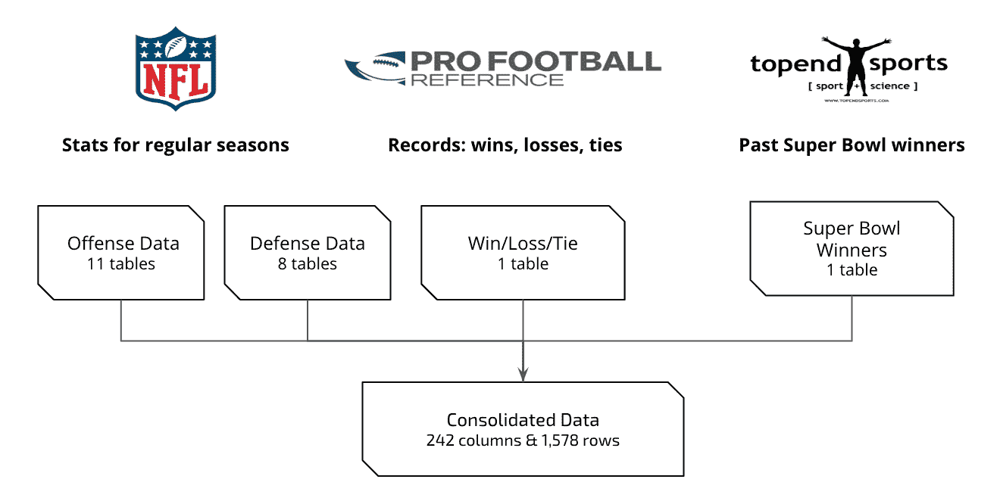

**图一。**数据来源

# 清洁

每个团队的统计数据都是特定年份中与该团队相关的独立事件。这意味着，所有的计算或比较都是在按年份分组并进行范围标准化之后进行的，以便在该年的每个统计中清楚地对每个团队进行排名。

# 超级碗预测的改进测试系统

新的测试系统反映了每年预测的累积总数，以确保对“接近”但不一定正确的预测进行无偏见的评分和奖励。评分规则如表 1 所示。

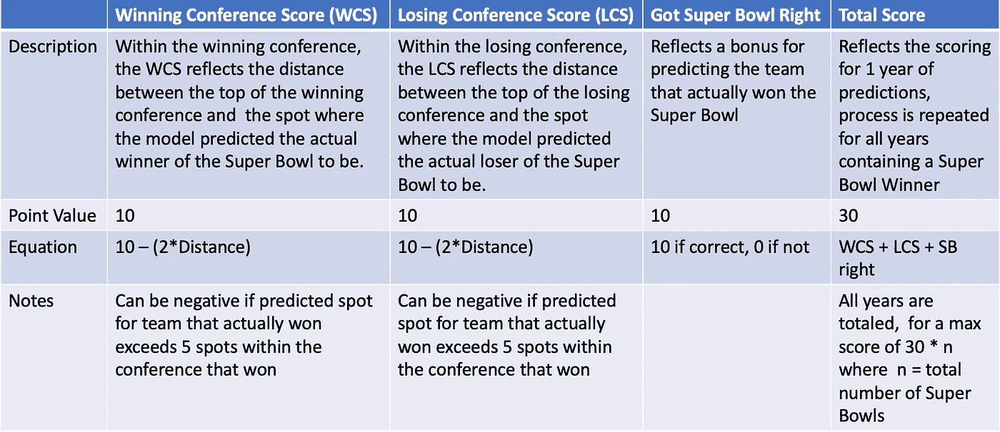

**表 1。**评估/比较模型和技术变化的新评分系统

新系统计算包含超级碗的每一年的分数，最高年分数为 30 分。这一过程在所有年份都重复进行，在超级碗时代的 53 年中，最高得分为 1590。对于每一年，该年的数据用于测试，而其余的用于训练。

评分系统背后的基本原理是,“赢得会议的分数”和“输掉会议的分数”代表该模型是否能够准确预测超级碗的竞争者。预测正确的超级碗冠军赢得 10 分，以便测试系统支持超级碗冠军预测。有 12 支球队进入了季后赛，6 支来自亚足联，6 支来自 NFC。由于这种季后赛结构，任何球队的最大可行距离将是距离联盟第一名 5 个位置。如果一支球队超过了这个距离，这个模型将会预测这支球队没有进入季后赛，从而导致负分。

# 评分系统示例:

为了进一步理解评分系统，我将通过一个对 2018 年超级碗的预测进行评分的示例(出于说明目的，使用了假数字)。2018 年超级碗的获胜者是新英格兰爱国者队，而失败者是洛杉矶公羊队。图 2 给出了预测示例。

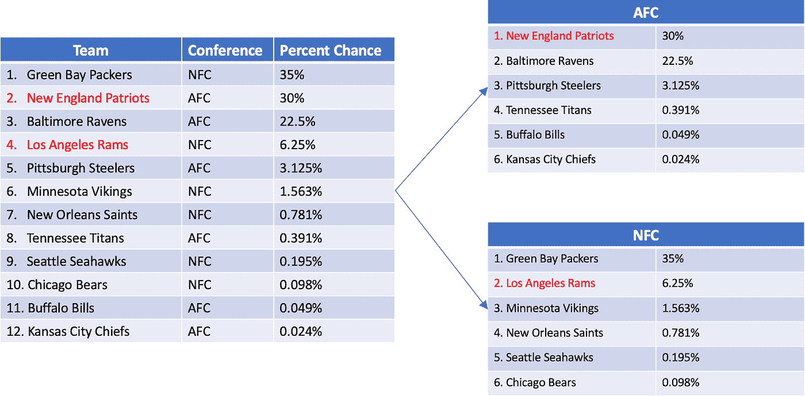

**图二。**示范 2018 赛季评分系统的预测示例。

在两场会议一起进行的预测中，爱国者队排名第二，公羊队排名第四。这两个队被分成各自的小组，因为最终，亚足联的冠军将对阵 NFC 的冠军。一旦分开，爱国者现在是第一，公羊是第二。

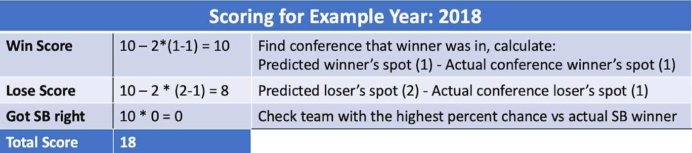

**表二。**示例年得分计算明细:2018 年

# 列选择技术

有了新的测试系统，我们尝试了几种色谱柱选择技术来改进模型。广泛使用的随机森林和新建立的“RFE 环”(下面详细描述)都被添加到测试方法列表中，该列表先前包括 RFE 方法和“初始列”。上一篇文章中的最初专栏是通过 RFE 和信息增益的结合发现的。

**随机森林**

随机森林算法可用于特征选择以及分类。决策树的思想是，所有的观察结果都可以根据对或错的陈述(例如，触地得分> 30)被任何属性分割。随机森林是决策树的组合(在我们的例子中是 1000 棵)。该算法随机选择一个色谱柱，然后使用杂质平均减少量(MDI)或基尼系数最大化分离 [(Breiman 2001)](https://paperpile.com/c/AsfUVE/5NbH) 。“它被定义为在集合的所有树上平均的节点杂质的总减少量(由到达该节点的概率加权(由到达该节点的样本的比例近似))[(李 2017)](https://paperpile.com/c/AsfUVE/Btum) 。从本质上讲，该算法寻找最能分割数据的特征。

**RFE 环线**

利用递归特征消除方法，我开发了一种在数据集中选择重要列的新方法。RFE 从所有列中随机选择一个子集，并使用一个决策函数来决定该子集中的哪些列是最重要的列。它重复这个过程，直到剩下的列数等于用户指定的数目。

为了选择数据集的重要列，我开发了一种使用 RFE 的新方法，我称之为 RFE 循环。在 RFE 循环中，一个字典记录了被测试的每一年的重要列的数量。一旦所有年份都经过测试，字典就会被检查，计数最高的列(用户指定的列数)将被选为最重要的列。当与 K-fold 或 hold one out 测试方法配对时，这种技术工作得非常好，因为算法已经在重复运行。

**伪代码:**

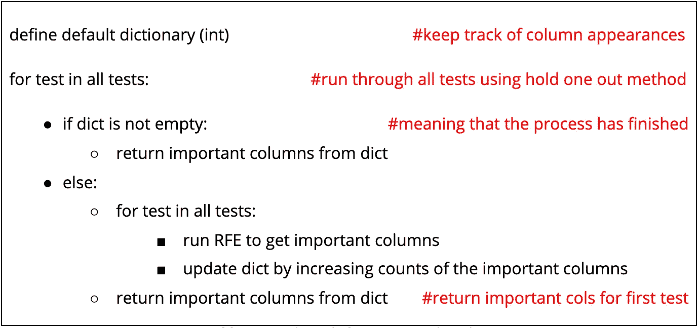

**表 3。**RFE 循环算法的伪代码

# 建模

除了两种新的色谱柱选择技术之外，还使用 TensorFlow 的 Keras 构建了一个神经网络，尝试与逻辑回归模型竞争。神经网络通常适用于高维数据以及大量数值数据。我搜集的 NFL 数据集没有大量的数据(1579 个观察值)，但它确实有很高的维数(137 列)。该模型使用不同数量的隐藏层和参数创建了多次:

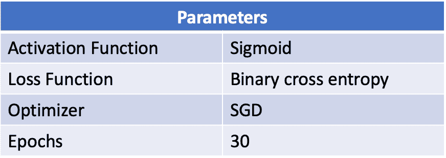

**表 4。**用 Keras 建立的神经网络的参数

# 测试系统的结果

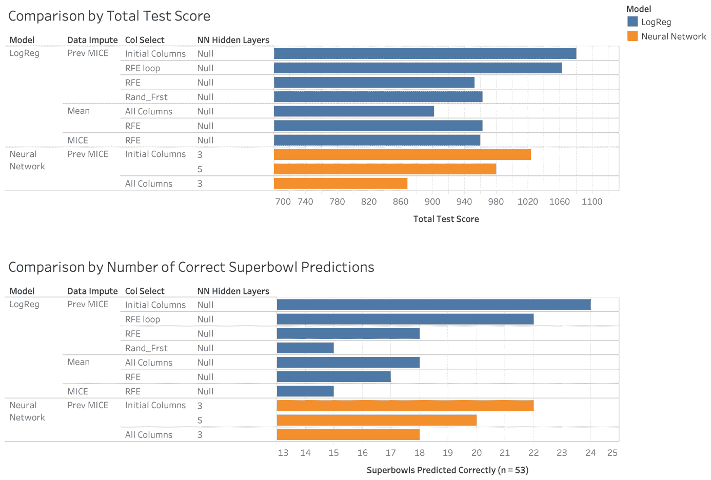

**图 3。**模型选择、数据插补和列选择方法的综合测试结果比较

如图 3 所示，技术/方法的最佳组合是逻辑回归，缺失值由先前的 MICE 计算文件处理，初始列在我的第一篇文章 [Super Bowl 预测模型](/super-bowl-prediction-model-99048f366fed)中。这种组合对于正确预测的超级碗的数量和总得分都是最好的。图 3 包括:

*   两种建模方法(逻辑回归和神经网络)
*   五种列选择技术(RFE 循环、RFE、随机森林、初始列和所有列)
*   三种数据插补方法(先前计算的 MICE 值、MICE 和平均值)

RFE 循环法的总分略低于初始列的总分。此外，初始列正确地预测了另外两个超级碗。基线模型是包含所有列和缺失值平均值的逻辑回归。当涉及到正确的超级碗预测时，该基线比其他一些组合稍好，但在总分上它输给了几乎所有其他模型。唯一的例外是包含所有列和先前计算的 MICE 值的神经网络。图 3 显示了模型的不同组合以及它们的表现，而图 4 根据总分对不同方法进行了分类。

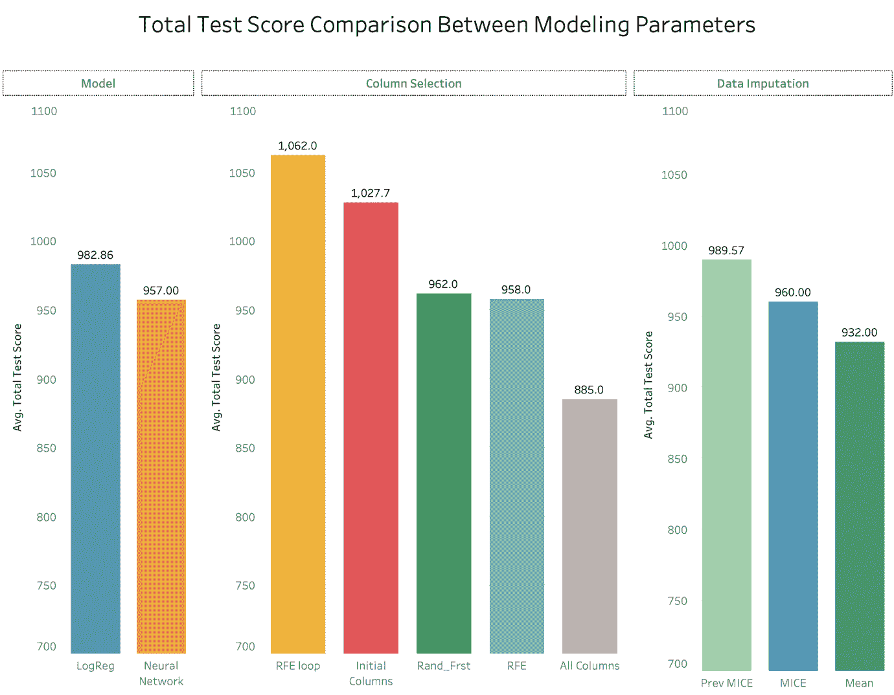

**图四。**类别预测方法比较:模型选择、列选择、数据插补

图 4 阐明了相互比较时，每项技术对总分的贡献程度。对于模型选择，平均而言，逻辑回归得分比神经网络高约 2.7%。对于列选择，RFE 循环的性能比使用所有列时高 20%，比第二高的初始列方法高 3.3%，比仅使用 RFE 高 10.9%。随机森林技术的性能比普通 RFE 方法稍好。值得一提的是，RFE 方法每年大约需要 45 秒(总共 53 年)，而随机森林方法每年大约需要 5 分钟。这点时间差，不值总分的些微增益。

继续进行数据插补，之前计算的 MICE 值比仅使用平均值高 6.2%。为了强调每个 MICE 计算之间的细微差异，先前计算的 MICE 值和新计算的 MICE 值之间的差异大约为 3%。这表明，如果不使用之前计算的值，结果可能会略有不同。

总的来说，考虑到所用的不同方法可能得到的总分范围很广，很明显色谱柱选择的影响最大。当谈到模型选择时，导致最终算法的步骤远比选择的“模型”重要。根据这个项目，建模过程的每个部分都会极大地影响预测能力的结果，但是最重要的部分是列的选择。由于 NFL 捕获的统计数据的数量，列选择很可能是建模过程中最重要的部分。辨别哪些统计数据最有意义的能力是这个项目的缩影。

通过 RFE 环技术选择的 20 根柱子如下表 5 所示。

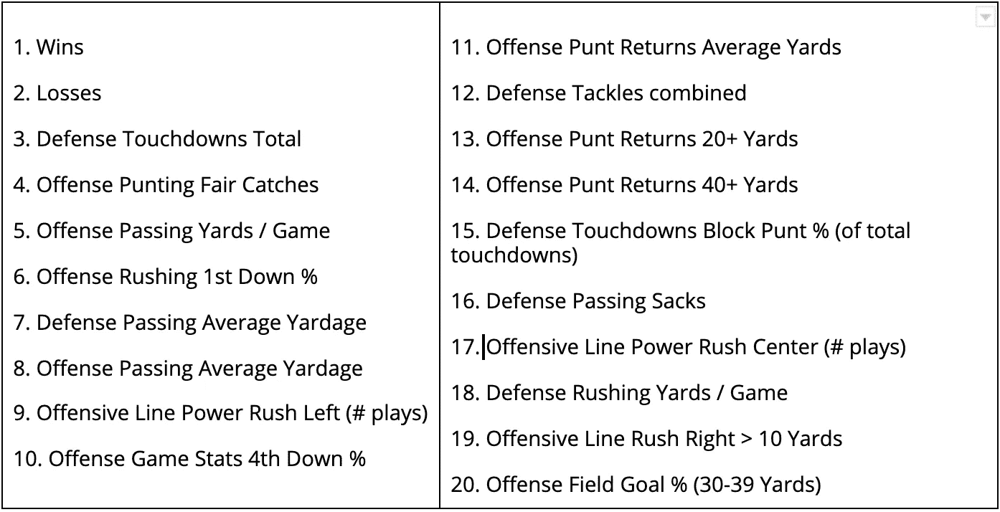

**表 5。**根据 RFE 循环技术最重要的列

在所有 12 个模型都经过测试后，我很好奇是否有哪个年份的大多数模型预测正确。结果显示，12 个模型都预测正确的 6 年(1972 年、1979 年、1985 年、1991 年、1996 年和 2003 年)表现突出。

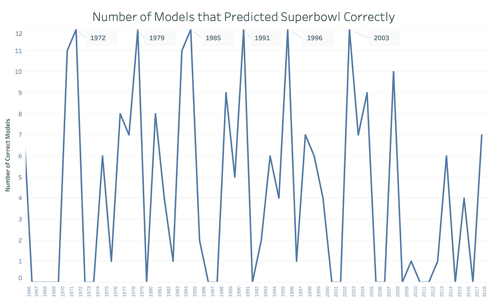

**图五。**显示每年正确预测超级碗的模型数量

**1972 年**:不败的迈阿密海豚队

1979 年:12-4 匹茨堡钢人队与圣地亚哥充电器队平了最佳记录

1985 年，芝加哥熊队以 15 比 1 领先(最佳记录)

1991 年:14-2 华盛顿红人队(最佳记录)

1996 年:13-3 绿湾包装工队，进攻得分比防守允许的得分多 37 次触地得分。第二高的是 49 岁的人，只有 18 人。

2003 年:14–2 名新英格兰爱国者(最佳记录)

记录显然对预测有很大的影响，因为有好记录的球队往往有其他好的统计数据。在选择了之前讨论过的最佳方法(逻辑回归、RFE 循环和之前计算的小鼠值)之后，整个测试过程的可视化可以在下面的图 6 中看到。

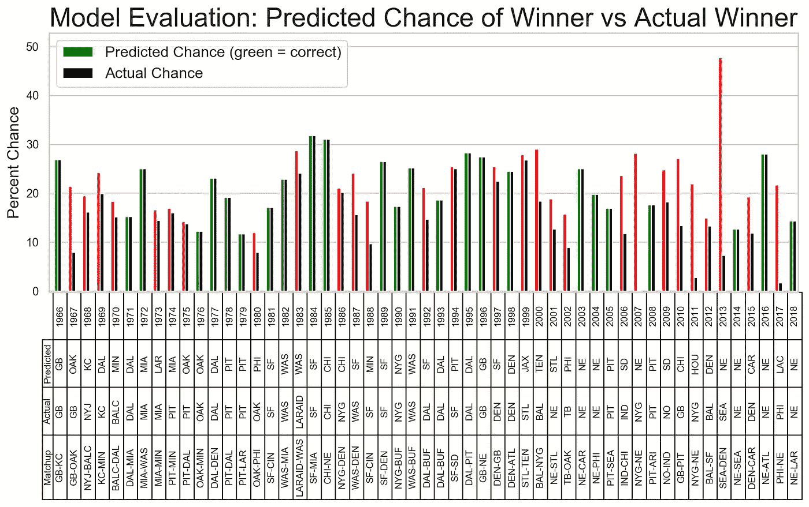

**图 6。**整体模型评估，显示模型对预测赢家的选择及其机会百分比(根据预测是否正确以红色/绿色显示)，以及实际赢家和模型给予实际赢家的机会百分比(黑色)。

图 6 显示了所有年份的预测赢家、实际赢家和超级碗竞争者。这表明，即使模型是不正确的，它也可能只是预测超级碗的输家是赢家。例如，2015 年，卡罗莱纳黑豹队在超级碗比赛中对阵丹佛野马队。该模型预测了卡罗莱纳黑豹队，而实际的赢家是野马队。因此，虽然模型不正确，但它仍然预测了一支参加超级碗的球队。

# 结论

总之，新的测试系统允许以前不可能的模型比较。该系统允许在神经网络和以前的逻辑回归之间进行比较。此外，测试了两种新的列选择技术，其中“RFE 循环”获得了最佳平均总得分的第一名。图 7 中橙色部分显示了整个模型的变化。

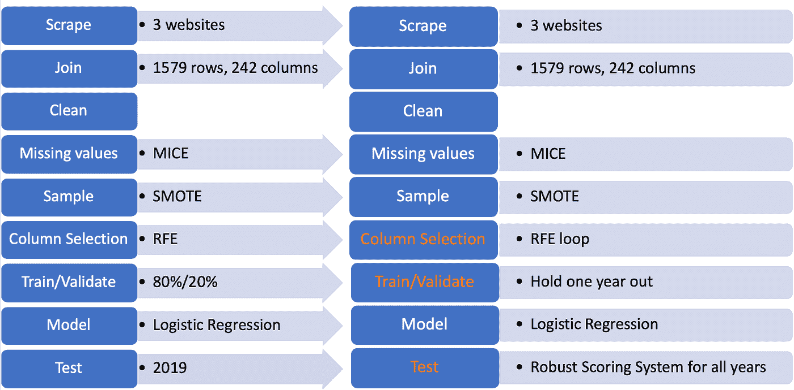

**图 7。**对以前方法的流程变更进行建模。

使用这种改进的预测模型，截至分区赛，2019 年超级碗的预测赢家是旧金山 49 人队，胜率为 36%，如图 8 所示。

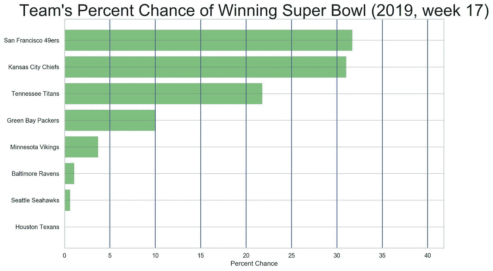

**图 8。**2019-2020 NFL 赛季超级碗预测，截至通配符回合

# 相关作品/参考文献

**随机森林列选择**

[布雷曼，狮子座。2001.“机器学习。”https://doi.org/](http://paperpile.com/b/AsfUVE/5NbH)10.1023/a:1010933404324[。](http://paperpile.com/b/AsfUVE/5NbH)

[李，瑟辛。2017.“树木模型的特征重要性测量—第一部分”中等。名副其实。2017 年 10 月 28 日。](http://paperpile.com/b/AsfUVE/Btum)[https://medium . com/the-artificial-impostor/feature-importance-measures-for-tree-models-part-I-47f 187 C1 a2 C3](https://medium.com/the-artificial-impostor/feature-importance-measures-for-tree-models-part-i-47f187c1a2c3)[。](http://paperpile.com/b/AsfUVE/Btum)

**Github**

一个全自动的模型版本发布在我在 https://github.com/kelandrin/Superbowl-Prediction-Model/的 Github 上

请随意下载并体验不同的功能！

只要确保下载了适当的包(列在主文件的顶部)，然后运行主文件，你就可以开始了！

可能的网络应用即将推出！