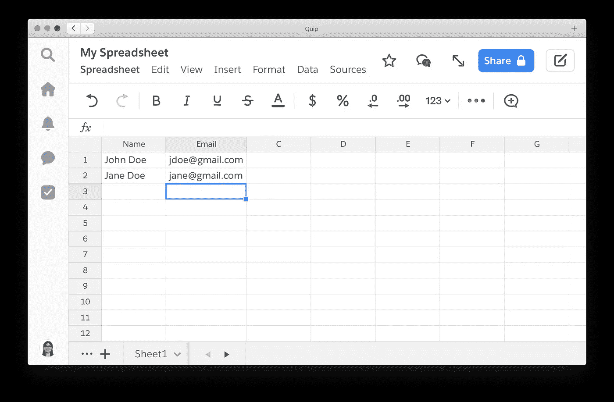

# 使用 Python API 更新 Quip 电子表格

> 原文：<https://towardsdatascience.com/updating-a-quip-spreadsheet-with-python-api-1b4bb24d4aac?source=collection_archive---------18----------------------->

## 什么是妙语，你为什么要在意？

> Quip 是一个用于移动和网络的协作生产力软件套件。它允许多组人员作为一个组来创建和编辑文档和电子表格，通常用于商业目的。([维基百科](https://en.wikipedia.org/wiki/Quip_(software)))

Quip 和 Google Docs/Sheets 的一个主要区别是 Quip 有一个原生的桌面应用程序。



Quip 电子表格截图(Lynn Zheng)

在这篇文章中，我将向您展示如何使用其 [Python API 客户端](https://github.com/quip/quip-api)来自动化创建、插入和更新 Quip 电子表格的过程。为了增强 API 的功能，我对它的官方 GitHub 库做了一个分支，并加入了一些有用的 pull 请求，这些请求还没有合并到主分支中。从[我的库](https://github.com/RuolinZheng08/quip-api)下载`quip.py`继续本教程。

# Quip API 基础

[官方 API 文档位于本网站](https://quip.com/dev/automation/documentation)。您将需要一个访问令牌来与 Quip 的 API 进行交互。访问页面[https://quip.com/dev/token](https://quip.com/dev/token)生成个人访问令牌。

要打开 Python 客户端:

```
import quip
ACCESS_TOKEN = "" # your access token
client = quip.QuipClient(access_token=ACCESS_TOKEN)
```

Quip API 的一个基本实体是**线程。**

> Quip 将文档和消息集成到一个单元中，我们称之为线程。Quip Automation API 中的大多数操作都是在线程上进行的。线索可以简单地是消息列表，即聊天线索，或者除了消息列表之外，它们还可以具有文档。([装备 API 文件](https://quip.com/dev/automation/documentation#overview)

# 在 Quip 中创建电子表格

向`new_document`传递一个空字符串作为第一个参数，告诉 Quip 使用它的默认 HTML 模板。

```
jso = client.new_document("", title="My Spreadsheet", type="spreadsheet")
```

您还可以指定一个 HTML 字符串作为第二个代码段中的模板。如下创建一个名为**template.html**的文件。这个电子表格模板只包含两列。

```
<table>
 <thead>
  <tr>
   <th></th>
   <th></th>
  </tr>
 </thead>
 <tbody>
 </tbody>
</table>with open("template.html", "rt") as f:
    template = f.read()
jso = client.new_document(template, title="My Spreadsheet", type="spreadsheet")
```

抓住`thread_id`发来的服务器响应。我们将需要它作为我们创建的电子表格的参考，以插入/更新记录。

```
thread_id = jso["thread"]["id"]
```

让我们将标题(默认为 A 和 B)更新为更具描述性的内容。

```
client.update_spreadsheet_headers(thread_id, "Name", "Email")
```

检查标题设置是否正确:

```
spreadsheet = client.get_first_spreadsheet(thread_id)
headers = client.get_spreadsheet_header_items(spreadsheet)
print(headers) # prints ['Name', 'Email']
```

## 按标题检索电子表格

```
title = "My Spreadsheet"
jso = client.get_matching_threads(title, only_match_titles=True)
# get the id of the first thread
thread_id = jso[0]["thread"]["id"]
```

# 将记录插入电子表格

```
client.add_to_spreadsheet(thread_id, ["John Doe", "jdoe@gmail.com"])
client.add_to_spreadsheet(thread_id, ["Jane Doe", "jane@gmail.com"])
```

# 更新电子表格中的记录

假设简将她的电子邮件地址更新为 jd12@gmail.com，让我们更新电子表格来反映这一变化。

```
client.update_spreadsheet_row(thread_id, "Name", "Jane Doe", {"Email": "jd12@gmail.com"})
```

一个警告:Quip 的 API 实现了严格的速率限制，默认为每分钟 50 个请求，这意味着每分钟最多只能插入/更新 50 条记录。在[文档](https://quip.com/dev/automation/documentation#rate-limit)中阅读更多关于自定义标题`X-Ratelimit-Limit`的信息。

# 与您组织中的其他 Quip 用户共享电子表格

假设您想与电子邮件地址为 smith@gmail.com 的同事共享该电子表格。

```
email = "smith@gmail.com"
jso = client.get_user(email)
member_id = jso["id"]
client.add_thread_members(thread_id, [member_id])
```

这些是 Quip 的电子表格 API 的基础。感谢阅读！