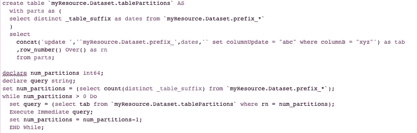

# 更新 BigQuery 中的已分区表

> 原文：<https://towardsdatascience.com/updating-partitioned-tables-in-bigquery-6adb0051c6ec?source=collection_archive---------45----------------------->

BigQuery 已经取得了很大的进步，但是一些重要的方面(比如通配符搜索)仍然缺少一些在 SQLServer 中相对简单的功能。其中一个功能是更新分区表的能力。更新一个分区很容易，但是，如果您有 100 个分区，单独更新它们会很麻烦。

下面是一个更系统化的尝试。请记住你的 GCP 成本，因为这可能不是最具成本效益的方式。如果您确实找到了更高效或更经济的方法，请将您的解决方案添加到回复部分。

为了更新一个分区表，我们将首先创建一个包含所有需要更新的分区的表，然后为每个分区创建一个 update 语句。最后，我们将遍历每个 update 语句来完成更新。

```
create table `myResource.Dataset.tablePartitions` AS
  with parts as (
  select distinct _table_suffix as dates from `myResource.Dataset.prefix_*`
  )
  select
    concat('update ','`myResource.Dataset.prefix_',dates,'` set columnUpdate = "abc" where columnB = "xyz"') as tab
    ,row_number() Over() as rn
    from parts;
```

要创建一个表，只需查询您要分区的表的每个不同分区。本例中为 Dataset.prefix_* 。表分区，或 *myResource。Dataset.tablePartitions，*是一个新表，将被创建和引用以创建 update 语句。如果不需要保存每个分区的记录，也可以在这里创建一个临时表。如果您选择这样做，请确保一次性运行上面和下面的代码。

```
declare num_partitions int64;
declare query string;
set num_partitions = (select count(distinct _table_suffix) from `myResource.Dataset.prefix_*`);while num_partitions > 0 Do
  set query = (select tab from `myResource.Dataset.tablePartitions` where rn = num_partitions);
  Execute Immediate query;
  set num_partitions = num_partitions-1;
  END While;
```

后一部分将引用在步骤 1 中创建的 update 语句，并遍历它们。根据分区的大小、GCP 成本结构和分区的数量，您可能希望分批完成工作，而不是像这里一样遍历每个分区。要批量执行，调整 num_partitions 变量和 while 语句条件。

这是一个快速的解决方案，可以改进。如果你发现了一种更新 BQ 中的分区表的更好的方法，我很想听听。希望这是有帮助的，并为您节省一些时间。

