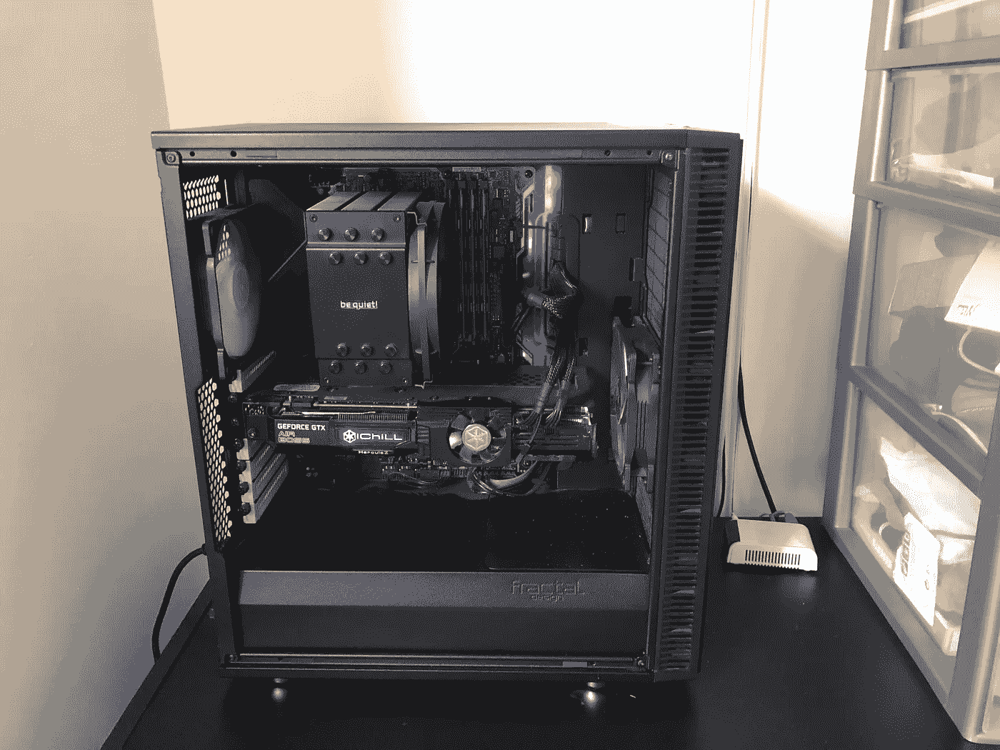

# 升级您的 Nvidia GPU 驱动程序以获得更好的性能🚀

> 原文：<https://towardsdatascience.com/upgrade-your-nvidia-gpu-drivers-for-a-better-performance-52818ad7ee8d?source=collection_archive---------27----------------------->

## 你的训练不稳定？考虑将 Cuda 升级到最新版本

我有一个运行在 Ubuntu 16.04 发行版和 Nvidia 1080 TI 上的 GPU 服务器。2018 年买的，到今天还在用 Cuda 9.0，驱动版本 384.130。



我的设置

我决定升级到 Cuda 10.2，用最新版本的驱动(440.33.01)。出于几个原因，我很早就想这么做了:

*   我偶尔会注意到我当前设置的不稳定训练和 GPU 故障
*   一些最新版本的通用深度学习框架(主要是 PyTorch)只能在 Cuda 10+上运行

所以这是做这件事的最佳时机。我在这篇文章中记录了不同的步骤。我们走吧！

1.  头顶[https://developer.nvidia.com/cuda-downloads](https://developer.nvidia.com/cuda-downloads)
2.  选择您的
    -操作系统(Linux)
    -架构(x86_64)
    -发行版(Ubuntu)
    -版本(16.04)
    -安装程序类型(runfile (local))
3.  一旦您选择了元素，您将会得到以下两个命令的提示。处决他们

```
**wget** [**http://developer.download.nvidia.com/compute/cuda/10.2/Prod/local_installers/cuda_10.2.89_440.33.01_linux.run**](http://developer.download.nvidia.com/compute/cuda/10.2/Prod/local_installers/cuda_10.2.89_440.33.01_linux.run)**sudo sh cuda_10.2.89_440.33.01_linux.run**
```

4.重启你的机器

`**sudo reboot now**`

你现在应该没事了。但是，如果您在运行`nvidia-smi`时遇到此错误消息

**未能初始化 NVML:驱动程序/库版本不匹配**

这意味着您以前的驱动程序太旧，无法被`**cuda_10.2.89_440.33.01_linux.run**` 脚本检测和删除。

这就是为什么你需要清除 Nvidia 旧的依赖:

```
**sudo apt-get update
sudo apt-get --purge remove cuda
sudo apt-get autoremove
dpkg --list |grep "^rc" | cut -d " " -f 3 | xargs sudo dpkg --purge
sudo apt-get purge nvidia*
sudo apt-get update
sudo reboot now**
```

5.创建指向 Cuda 最新版本的符号链接

```
**sudo ln -s /usr/local/cuda-10.2 /usr/local/cuda**
```

6.更新您的。bashrc

**旧行:** 导出路径=/usr/local/cuda-9.0/bin:$ PATH
导出 LD _ LIBRARY _ PATH =/usr/local/cuda-9.0/lib 64:$ LD _ LIBRARY _ PATH

**新行:** 导出路径=/usr/local/cuda/bin:$PATH
导出 LD _ LIBRARY _ PATH =/usr/local/cuda/lib 64:$ LD _ LIBRARY _ PATH

然后重启以保存更改。

7.安装 **Cudnn**

在这里创建一个 Nvidia 开发者账号[。然后，点开这个](https://developer.nvidia.com/developer-program)[链接](https://developer.nvidia.com/compute/machine-learning/cudnn/secure/7.6.5.32/Production/10.2_20191118/cudnn-10.2-linux-x64-v7.6.5.32.tgz)，下载 Cudnn。

下载该文件后，运行以下命令:

```
**sudo cp cuda/include/cudnn.h /usr/local/cuda/include** **sudo cp cuda/lib64/libcudnn* /usr/local/cuda/lib64** **sudo chmod a+r /usr/local/cuda/include/cudnn.h /usr/local/cuda/lib64/libcudnn***
```

8.检查您的安装

我用支持 Cuda 10.2 的最新 PyTorch 版本创建了一个新的 conda 环境。安装后，我运行以下命令:

```
**import torch****torch.cuda.is_available()
# True****torch.version.cuda
# '10.2'****torch.backends.cudnn.version()
# 7605**
```

但是您也可以使用您最喜欢的框架进行检查。

感谢阅读，我希望这是有用的！

干杯！