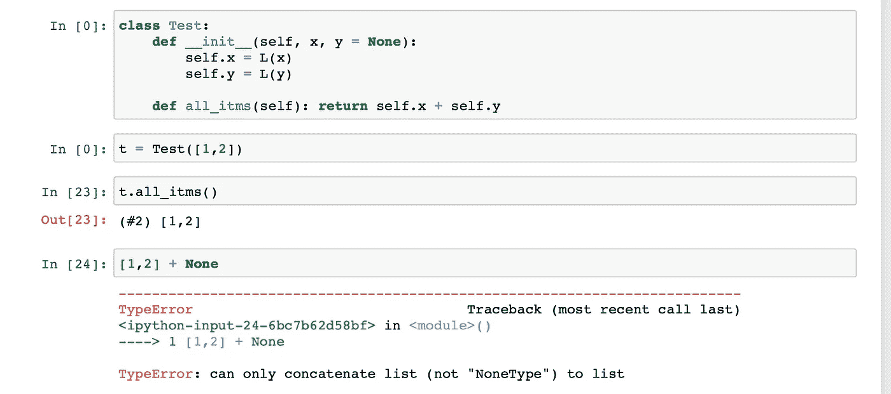

# 升级 Python 列表

> 原文：<https://towardsdatascience.com/upgrading-python-lists-35440096ec36?source=collection_archive---------15----------------------->

## 向 Python 列表添加有用的功能

图片来源:JoeyBLS 摄影

## 介绍

Python 列表很好。但他们并不伟大。有如此多的功能，可以很容易地添加到他们，但仍然缺乏。用布尔进行索引，轻松地用它们创建字典，一次追加多个元素，等等。嗯，不再是了。

***Fastai*** 已经拿出了自己的数据结构叫做`L`。它能做 Python 列表能做的一切，甚至更多。

本文的目的是向您展示自己编写这样有用的功能是多么容易。尤其是如果你是一个初学者，试着创建一个迷你版本的库。试着写一些你希望存在的功能。这将是一次很好的学习经历。

现在，让我们来了解一下 **L** 。这是 Colab 的链接。在您的 Colab ( **文件- >驱动器**中保存一份副本)上制作一份副本，并且只运行第一个单元格一次。你的笔记本会崩溃。但是你马上就可以使用图书馆了。

[谷歌联合实验室链接](https://colab.research.google.com/drive/1sv_q6X8XUOKz-254diVTEYsjo3nfiNgz)。

## 我是什么？

就像我之前提到的，它类似于 Python 列表，但是可以实现更多。让我们从导入库并创建`L.`的实例开始

我们看到它打印了列表的长度，然后是内容。再也不用一直单独打印长度了。

如果你和我一样，不喜欢用方括号。移除它们。

编写`.append()`来追加元素又是如此乏味。此外，一次只能追加一个元素。咩。移除移除。

请注意，这些东西非常容易编码。我们只是在幕后定义了一个`__add__`魔法方法来决定`+`操作员将做什么。如果你想学习更多关于魔法方法的知识，你可以阅读我的文章[如何在 Python 中熟练使用 OOP](/how-to-be-fancy-with-python-part-2-70fab0a3e492)。

我们来考察一下`__add__`的方法。

它用当前元素和新元素创建 L 的新实例。很简单，对吧？

我们也试试`__mul__`吧。

它将列表复制两次。另外，请注意，它只打印前 10 个元素，然后显示`...`这比显示所有元素的 Python 列表要干净得多。

你可以在 l 中找到独特的元素。

你可以很容易地把它转换成一本字典。

然而，L 的真正强大之处在于它的索引功能。

1.  使用索引列表进行索引

2.使用布尔进行索引

3.多重赋值

4.处理无问题的连接

很多时候，我们用 Python 返回一系列列表。我们需要 if 语句来检查其中是否有一个是空的，否则它们会抛出一个错误。不是和 l。

## 结论:

总而言之，这是一个很好的数据结构，可以很容易地用来代替列表。试试笔记本。探索它。这就是本文的全部内容。

~快乐学习

## 参考资料:

[https://github . com/fastai/fastai _ dev/blob/master/dev/01 _ core _ foundation . ipynb](https://github.com/fastai/fastai_dev/blob/master/dev/01_core_foundation.ipynb)