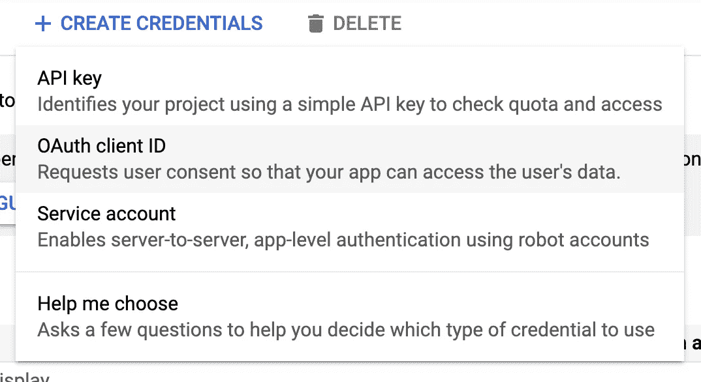
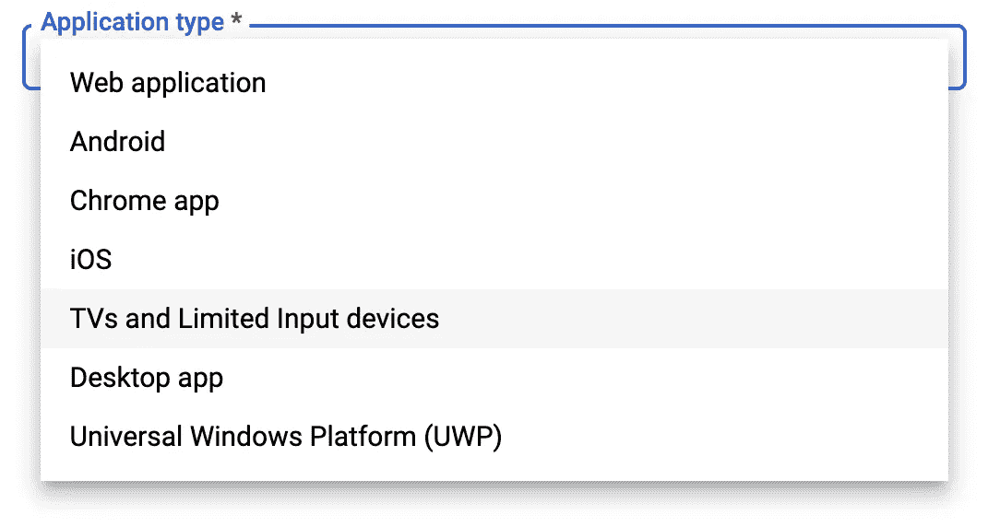

# 直接从终端上传文件到 Google Drive(使用 Curl)

> 原文：<https://towardsdatascience.com/uploading-files-to-google-drive-directly-from-the-terminal-using-curl-2b89db28bb06?source=collection_archive---------3----------------------->

## 将数据从计算机推送到云的另一种方法。

在许多情况下，从一台新机器向另一台机器发送数据可能很困难。这方面的例子包括隐藏在登录门户后面但不允许 ssh 隧道的 HPC 设施，或者只安装了几个核心程序的简单无头机器。在本文中，我们将使用 cURL(一个用于传输数据的命令行程序)将一个压缩文件(包含日志文件)推送到我们的 google drive 帐户上，以便进行进一步的分析。


照片由 [Element5 数码](https://unsplash.com/@element5digital?utm_source=medium&utm_medium=referral)在 [Unsplash](https://unsplash.com?utm_source=medium&utm_medium=referral) 上拍摄

# 装置

大多数机器都会安装 cURL(试着输入`which curl`)。如果不是这样，我们可以安装它

```
sudo apt install curl # Linux Debian/Ubuntu
```

或者

```
brew install curl     # Mac
```

现在我们已经安装了它，我们可以看看如何创建发送文件所需的凭证。

# 创建您的项目凭据

由于我们允许访问我们的谷歌驱动器，我们希望能够管理这一点。这是通过创建一个具有用户定义权限的项目来实现的，该项目充当我们的用户(在本例中，我们在不同的机器上)和我们的帐户之间的代理。我们首先转到下面的页面(下面的链接)并创建一个新项目。

[](https://console.developers.google.com/apis/credentials?pli=1) [## 谷歌云平台

### Google 云平台让您可以在同一基础设施上构建、部署和扩展应用程序、网站和服务…

console.developers.google.com](https://console.developers.google.com/apis/credentials?pli=1) 

完成后，我们选择“凭据”选项卡(在左侧),然后从顶部选择“创建凭据”。



当询问应用程序类型时，我们选择电视和其他。



最后，这会生成一个`client id`和一个`client seacret`。

这是您的用户名和密码，请将其复制到安全的地方。

# 现在我们需要验证设备

为此，我们`ssh`进入我们希望上传的机器，并运行以下命令:

```
curl -d "client_id=**<client_id>**&scope=https://www.googleapis.com/auth/drive.file" https://oauth2.googleapis.com/device/code
```

这样，我们会得到以下格式的响应

```
{"**device_code**": "<long string>",
"**user_code**": "xxx-xxx-xxx",
"expires_in": 1800,
"interval": 5,
"**verification_url**": "https://www.google.com/device"}
```

这里我们需要访问 URL([https://www.google.com/device](https://www.google.com/device))并提供用户代码来完成我们的验证。我们现在继续选择我们的 google 帐户并授予相关权限。进行此操作时，确保记下**设备代码**用于下一步。

# 获取不记名代码

当我们开始上传时，这是我们需要用来识别我们的帐户的代码。我们通过使用以下内容获得它:

```
curl -d client_id=**<client id>** -d client_secret=**<client secret>** -d device_code=**<device code>** -d grant_type=urn%3Aietf%3Aparams%3Aoauth%3Agrant-type%3Adevice_code https://accounts.google.com/o/oauth2/token
```

客户端 id 和密码保存在*第一步*中，设备代码保存在*上一节*中。输出应采用以下格式:

```
{
"access_token": ".....",
"expires_in": 3599,
"refresh_token": "....",
"scope": "https://www.googleapis.com/auth/drive.file",
"token_type": "Bearer"
}
```

记下**访问令牌**，因为上传阶段会用到它。

# 上传文件

下面给出了我们用来上传文件的命令

```
curl -X POST -L \
    -H "Authorization: Bearer **<enter** **access token here****>**" \
    -F "metadata={name :'**<our.zip>'**};type=application/json;charset=UTF-8" \
    -F "file=@**<our.zip>**;type=application/zip" \
    "https://www.googleapis.com/upload/drive/v3/files?uploadType=multipart"
```

*在允许上传数据之前，您可能需要启用应用程序 API。如果是这种情况，错误消息中会给出执行此操作的链接。*

这里的*多部分*文件预计只有几 MB 大小。然而，如果你正在考虑移动更大的文件*可恢复的*可能更适合(见[https://developers.google.com/drive/api/v3/manage-uploads](https://developers.google.com/drive/api/v3/manage-uploads)

# 用一个脚本把它包起来

现在我们知道我们的命令工作，我们可以创建一个可执行脚本来为我们做所有的工作。在这里，我们可以提供一组文件，它将它们压缩，然后发送到 google drive。

我们首先用`nano curlgoogle;`创建一个新文件，并输入以下代码——记得添加您自己的个人身份验证令牌！选择 Python 2.7 是因为这仍然是旧系统上的默认 Python 版本，但是下面的脚本也应该适用于 python 3。

如果 curl 已经存在于系统中，它应该不需要新的依赖关系。

```
#!/usr/bin/python'''
A quick python script to automate curl->googledrive interfacing
This should require nothing more than the system python version and curl. Written for python2.7 (with 3 in mind).Dan Ellis 2020
'''import os,sys,jsonif sys.version[0]=='3':
  raw_input = lambda(x): input(x)##############################
#Owner information goes here!#
##############################
name = 'curldata'
client_id= '**<enter your client id>**'
client_secret='**<enter your client secret>**'############################## cmd1 = json.loads(os.popen('curl -d "client_id=%s&scope=[https://www.googleapis.com/auth/drive.file](https://www.googleapis.com/auth/drive.file)" https://oauth2.googleapis.com/device/code'%client_id).read())str(raw_input('\n Enter %(user_code)s\n\n at %(verification_url)s \n\n Then hit Enter to continue.'%cmd1))str(raw_input('(twice)'))cmd2 = json.loads(os.popen(('curl -d client_id=%s -d client_secret=%s -d device_code=%s -d grant_type=urn~~3Aietf~~3Aparams~~3Aoauth~~3Agrant-type~~3Adevice_code https://accounts.google.com/o/oauth2/token'%(client_id,client_secret,cmd1['device_code'])).replace('~~','%')).read())
print(cmd2)# zip files
cmd3 = os.popen('zip -r %s.zip %s'%(name,' '.join(sys.argv[1:]))).read
print(cmd3)cmd4 = os.popen('''
curl -X POST -L \
    -H "Authorization: Bearer %s" \
    -F "metadata={name :\'%s\'};type=application/json;charset=UTF-8" \
    -F "file=@%s.zip;type=application/zip" \
    "[https://www.googleapis.com/upload/drive/v3/files?uploadType=multipart](https://www.googleapis.com/upload/drive/v3/files?uploadType=multipart)"
    '''%(cmd2["access_token"],name,name)).read()print(cmd4)
print('end')
```

然后我们使它可执行`chmod a+x curlgoogle`,允许我们以可执行的方式使用它:

```
**./curlgoogle** file1 file2.txt file3.jpg etc... 
```

# 结论

现在我们有了一个简单的方法，可以将多个日志文件从一台无头机器发送到一个 google drive 存储库中，供多人访问以进行分析。

如果你需要更多的信息，由 [Tanaike](https://stackoverflow.com/users/7108653/tanaike) 和 [HAKS](https://stackoverflow.com/users/7362099/haks) (以及其他人)提供的堆栈溢出回答对创建这篇文章特别有帮助。