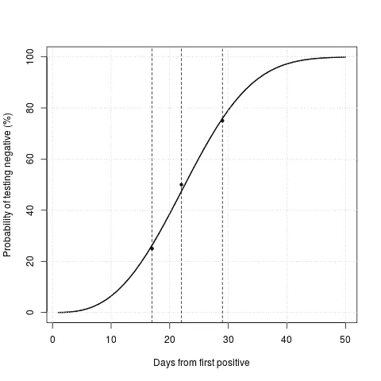
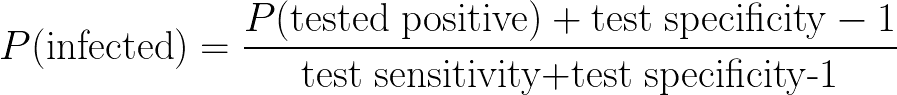
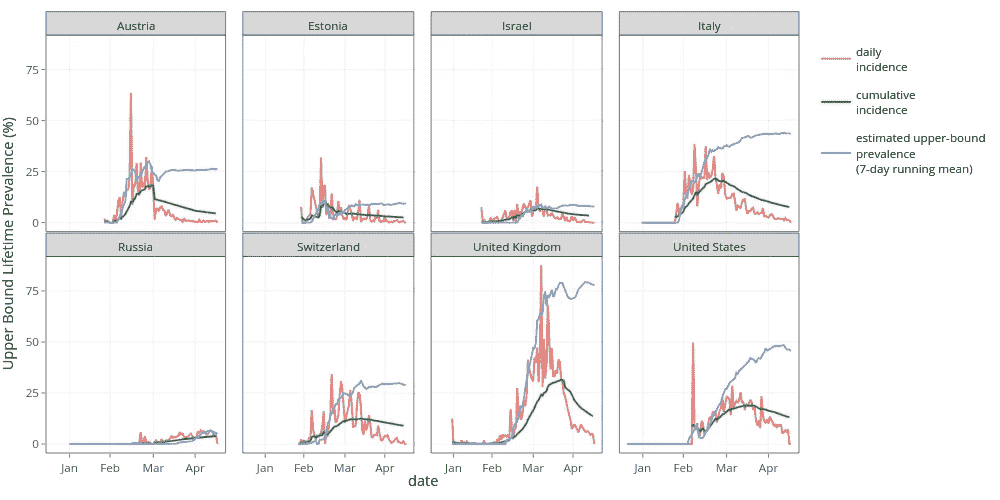
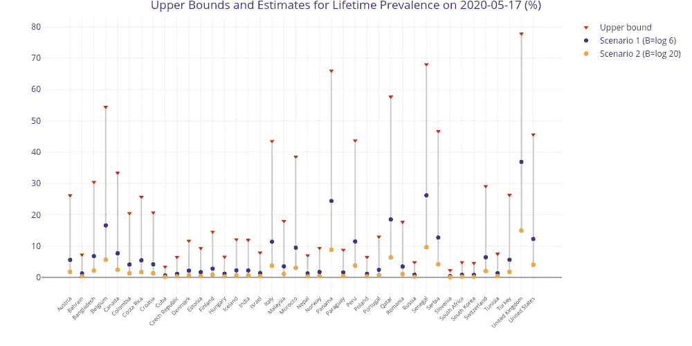
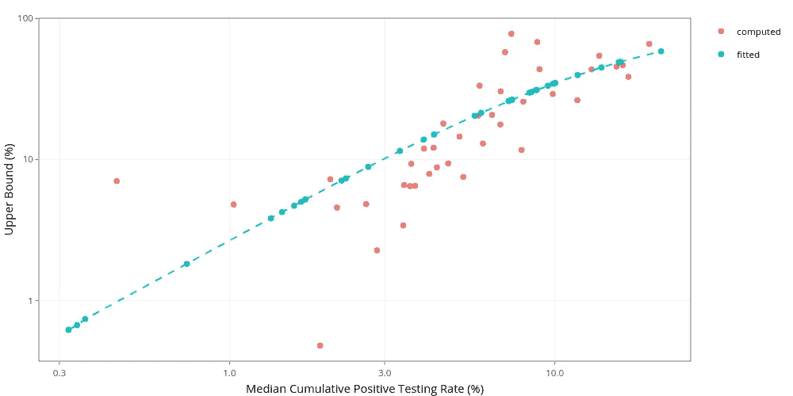
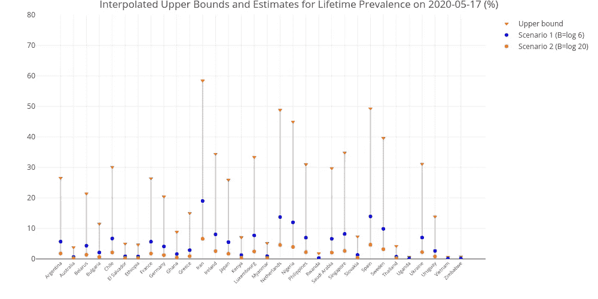
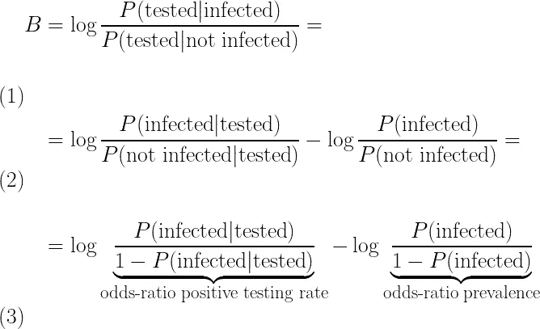
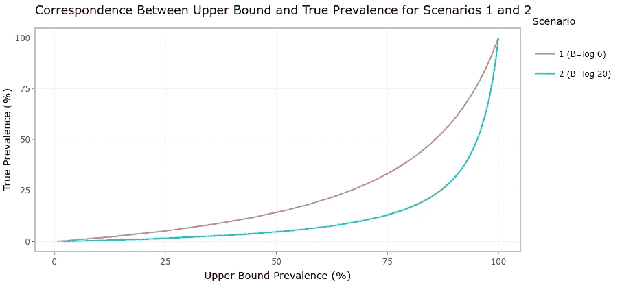

# SARS-新冠肺炎感染人数的上限和检验偏差

> 原文：<https://towardsdatascience.com/upper-bounds-and-testing-biases-for-the-number-of-sars-covid-19-infections-66ff3eaa5be7?source=collection_archive---------88----------------------->

## [我看着新冠肺炎](http://towardsdatascience.com/tagged/my-look-at-covid-19)

## 估计目前该疾病在各国传播的最大可能程度

由 [GregPlom](https://pixabay.com/users/gregplom-3802982/) 在 [Pixabay](https://pixabay.com/) 上拍摄的照片

在[之前的一篇](/how-many-people-have-really-been-infected-by-sars-covid-19-ed9338641501)文章中，我提出了不同国家可能被当前的 SARS-新冠肺炎疫情感染的人数的上限和下限——无论他们是否表现出症状——以及提供一个接近实际数字的中心估计值。总的来说，这些界限和核心估计数表明，该疾病并没有像一些人声称的那样广泛传播，而且所有国家离群体免疫的可能性还很远。我在那篇文章中的结论和主要观点已经被最近发表的几项研究所证实。然而，我的朋友兼语言学家同事博班·阿尔塞尼耶维奇在对那篇文章的私人回复中注意到我的上限有一个错误。在这篇文章中，我进一步完善了疾病传播的上限，以回应博班的批评。我表明，尽管有这个错误，前一篇文章的主要结论仍然成立，甚至得到了最近数据的支持。在这里，我还考虑了额外的重要细节，比如测试的准确性，为了简单起见，在之前的帖子中有意忽略了这些细节。使用这些新的改进，我使用更近的数据提供了更精细的疫情扩散范围，并且我研究了这些告诉我们不同国家遵循的测试政策。

# 更可靠的上限

## 人们在有限的时间内测试呈阳性

在我的[上一篇文章](/how-many-people-have-really-been-infected-by-sars-covid-19-ed9338641501)中，我使用了人群中检测结果呈阳性的比例——阳性检测率*——作为感染该疾病人数的上限——终生患病率。这种关系成立的原因是*检测偏差:*当已经有迹象表明他们可能已经被感染时，人们更有可能接受检测，无论是通过明确的症状，还是通过与其他已知被感染的人的密切接触。由于这个原因，在任何一天，被检测者中的阳性比例都会高于普通人群。*

上述关系在任何一天都成立，但是——正如博班·阿塞尼耶维奇友好地向我指出的——它不需要在更长的时间内成立。问题是，人们从感染中康复后，只能在一定时间内保持检测阳性。例如，如果我们有一百个人，在五天的时间里，我们每天测试其中的十个人，每天获得两个阳性结果，我们可以推断在任何一天，被感染的人不超过百分之二十，这是正确的。然而，如果我们假设在第一天测试为阳性的人在第五天也测试为阳性，那么这一估计只能延伸到整个五天。如果不是这种情况，我们就需要把在非重叠日感染*的人口比例加起来。请注意，这个问题的解决方案并不像将不同日期的积极因素相加那么简单。如果我们这样做的话，我们将会把一些受感染的人计算几次，直到他们检测呈阳性。简而言之，如果人们在很长一段时间内测试呈阳性，那么我上一篇文章的上限或多或少是正确的。然而，如果人们在更短的时间内测试呈阳性，我会严重低估上限。*

为了解决这个问题，我们需要知道人们在被感染后，甚至在康复后，多久会继续检测为阳性。在最近发表的一项研究中，[杜和他的同事们](https://www.ncbi.nlm.nih.gov/pubmed/32283161)调查了人们在 SARS-新冠肺炎检测中呈阳性的时间长度。他们发现，这一持续时间取决于某人被感染的病毒载量(即初始感染的严重程度)，以及患者的年龄(老年人比年轻人保持阳性的时间更长)。在他们研究的 161 人中，他们发现一名患者在被感染 50 天后仍呈阳性。更普遍的是，他们发现 25%的人在不到 17 天内保持阳性，50%的人在最多 21 天内测试呈阳性，75%的人在 28 天或更短时间内测试呈阳性(在技术术语中，这三个数字被称为分布的*四分位数*)。

图 1:在确认患有该疾病后，CoV-19 检测为阴性的概率。使用杜等人(2020)报告的四分位数(由图中的点表示)拟合到威布尔分布(参数 k=2.88，λ=25.68)。

杜等人报告的数字很好地符合威布尔概率分布(绘制在图 1 之外)。这是一个两参数的等待时间分布，通常用于可靠性分析(例如，估计设备故障前的预期时间)和生存分析(例如，估计治疗对病人预期未来寿命的影响)。有趣的是，拟合分布的形状参数反映了统计学术语中所谓的“老化过程”( *k > 1* ):在我们的情况下，这意味着一个人测试阳性的时间越长，我们就越不可能发现这个人测试阳性的时间更长；换句话说，*检测阴性的概率随着时间的推移而增加*。

## 如何累积阳性检测率

在一段时间内累计阳性检测率的关键在于，每天只累加与前一天已经检测为阳性且仍为阳性的那部分人群不对应的阳性检测。换句话说，每天只有*的新阳性*应该被累加。累积一段时间内的新阳性结果将为我们提供一个真实的患病率上限。实际上，这意味着重复应用图 1 中的曲线:在疫情的第一天，我们增加了整个阳性检测率。在接下来的几天里，我们只累计前一天低于图 1 曲线的阳性检测率案例部分。这种累积过程避免了遗漏那些过去测试为阳性，但此后变成阴性的患者，并且通过重复应用曲线来确保不重叠防止了对那些仍然为阳性的患者进行两次计数。我将这一措施称为*部分累积阳性检测率*。

请注意，上面概述的累积过程需要足够详细的*每日*测试数据，而我在上一篇文章中使用的度量可以仅使用累积的测试数量和相应的累积案例来计算。不幸的是，对于不报告每日进行的检测数量，而是报告多日累计批次的国家，如德国(目前报告了 8 个批次)或西班牙(目前报告了 4 个批次)，这使得很难获得可靠的上限估计值。

## 没有测试是完美的:敏感性和特异性

需要考虑的另一个因素是，尽管测试可能很准确，但没有一个测试是完美的。CoV-2 测试有多个提供者，所提供的不同测试在多个属性上有所不同。根据约翰·霍普金斯大学彭博公共卫生学院的一份报告，在不同的测试中，现有测试的 T2 敏感度，即“真实阳性率”，即测试呈阳性的感染者的比例，在 87%到 93%之间。同一消息来源称，测试的*特异性*——即“真实阴性率”，即未被感染的人测试呈阴性的概率——在 95%到 100%之间。尽管这些数字看起来很高，但事实上它们可以改变测试结果。例如，假设我们测试了 100 个人，我们得到了 80 个肯定的结果。我们可能会得出结论，有 80 人被感染，20 人未被感染。然而，如果我们把自己放在测试准确性最差的情况下——87%的灵敏度和 95%的特异性——我们实际上应该预期:

*   在测试呈阳性的 80 人中，79.57 人实际上对应于被感染的人(即*真阳性*)。剩余的 0.43 人预计是*假阳性*——由于测试的局限性，未感染的人测试为阳性。
*   在测试为阴性的 20 人中，只有 8.11 人对应于未被感染的人(即*真阴性*)。剩下的 11.89 人极有可能是假阴性——测试未能检测到的感染者。

考虑检测灵敏度和特异性，对阳性检测率进行校正。

考虑到上述情况，在阳性检测率为 80%的情况下，测试的灵敏度和特异性告诉我们，我们应该预计 79.57+11.89=91.46%的人被感染，8.11+0.43=8.54%的人未被感染。换句话说，如果我们直接使用测试数据，我们的估计会有超过百分之十的误差。即使我们不容易知道谁是假阳性或假阴性，我们也可以合理确定地知道有多少错误归因。一般来说，你可以用旁边的公式直接修正正比率。

# 不同国家的上限

## 修正的上限

图 2:一些代表性国家的每日阳性检测率、累计阳性检测率(我在上一篇文章中使用的上限)和此处建议的校正估计最大流行率的比较。

我使用了从数据中的[我们的世界获得的检测数据来计算新的上限测量，结合了部分累积法和上述检测准确度校正(假设最差精度情况为 87%的灵敏度和 95%的特异性),适用于所有报告了一系列至少 45 天的每日阳性检测率的国家。](https://ourworldindata.org/coronavirus-testing)

图 2 显示了部分累积的度量如何随着时间的推移产生恒定的累积。最重要的是，将其与累积阳性检测率(我在上一篇文章中提出的患病率上限)进行比较，后一种方法在该疾病在一个国家最流行的时候达到峰值，此后*持续下降*。这种下降反映了累积阳性检测率未能解释许多已解决的疾病病例，即，我们不应指望终生患病率指标会下降。相比之下，新的上限指标的表现与人们预期的一样:它快速增长，直到疾病达到峰值，然后稳定下来，进入较慢的增长。唯一的下降(使用七天运行平均值衰减)出现在每日测试速率的噪音振荡中。

图 3:至少 45 天的每日测试序列可用的国家的计算上限(红色三角形)。蓝色和黄色圆点分别表示情景 1 和情景 2 中提出的偏差的结果。

图 3(上图)中的红色三角形显示了超过 45 天的每日测试结果可用的国家的计算上限。只有三个国家——按降序排列为英国、塞内加尔、巴拿马和比利时——的 SARS-新冠肺炎终生患病率可能超过 60%,绝大多数国家远低于 30%。然而，正如我下面所讨论的，上限实际上是非常宽松的。一旦将测试偏差考虑在内，这些数字会大幅降低。

## 缺少日常测试数据时回归上限

图 4:逻辑回归预测中位数累积阳性率的上限。使用红点拟合回归，并用于预测蓝点。

不幸的是，许多国家没有报告每日测试数据，例如西班牙或德国，而其他国家只是在最近才开始提供这种每日报告，以便能够在一定程度上可靠地重建上限，例如智利或法国。然而，我们仍然可以根据其与累积阳性检测率的相关性来估算这些国家的上限。图 4(除此之外)绘制了累积率中值与那些有足够数据的国家(红点)的上限度量之间的关系。这里要注意是，使用*平均值*累积速率*，回归会更加准确。*然而，我使用了中间值，因为它对于数据点很少的国家更稳健(如西班牙只有四批数据)。我使用虚线绘制的回归线来插入其余国家的上限值(图 4 中的蓝点)。请注意，与我在[的上一篇文章](/how-many-people-have-really-been-infected-by-sars-covid-19-ed9338641501)中使用的外推法相比，这仍然是回归训练范围内的插值，因此更加可靠。

图 5。回归-对于至少 45 天的每日测试序列可用的国家，插值上限(红色三角形)。蓝色和黄色圆点分别表示情景 1 和情景 2 中提出的偏差的结果。

图 5 中的红点标出了那些无法直接计算的国家通过回归插值得出的上限。和以前一样，在绝对最坏的情况下，只有三个国家(伊朗、西班牙和荷兰)的患病率可能超过 50%，而绝大多数国家的患病率远低于 30%。

# 缩小界限

## 偏倚和患病率之间的数学关系

现在，我将简短地——但也是必要地——谈谈数学符号，因为这对于理清测试偏差与流行度指标之间的关系至关重要。

根据概率论，我们可以将测试偏差定义为测试感染了疾病的人的概率与测试未感染的人的概率之间的比率。理想情况下，当两个方向都不存在实际偏差时，偏差的测量值应该正好为零，也就是说，感染者和非感染者接受检测的可能性完全相同。这是通过以对数标度定义等式 1(上面)中的测量值 *B* 来实现的。等式 2 是通过应用贝叶斯定理(概率的基本规则之一)从等式 1 得出的，该定理指出，对于任何事件 *A* 和 *B* ，它们的条件概率与*P(A | B)= P(B | A)*×*P(A)/P(B)*相关，并且抵消了所得的 *P(* 测试 *)* 项。最后，应用概率的另一个基本规则——*P(不是 A)= 1-P(A)*——我们得出了至关重要的等式 3。这最后一个等式确定了——对于给定的一天——偏差是上限的对数比值比(即，博彩赔率)和真实患病率之间的差异。

> [……]等式 3[……]必然意味着每日阳性检测率是每日流行率的严格上限

B*B*的正值代表偏向于检测患病人群，这是所有国家都存在的情况。正如我在之前的[帖子](/how-many-people-have-really-been-infected-by-sars-covid-19-ed9338641501)中所讨论的，所有人都自然而然地优先检测有暴露于病毒迹象的人(例如参见[美国疾病控制中心关于新冠肺炎检测的标准](https://www.cdc.gov/coronavirus/2019-nCoV/hcp/clinical-criteria.html))。因此，我们可以相当肯定地说，对所有国家来说。请注意，相反的情况意味着非感染者比感染者更有可能接受检测，这在任何可能的情况下都没有意义——除非检测机构有意避免找到 SARS-CoVID 病例，这多少有些令人惊讶。

反过来，根据等式 3，这必然意味着每日阳性检测率是每日患病率的严格上限。通过将阳性检测率项替换为上述部分累积的阳性检测率，以及感染终生流行率的日流行率，等式 3 可以扩展到比特定一天更长的时间段。

## “基于统计的常识”

从上面的等式 3 中，我们还可以推断出*真实*患病率的对数优势比正好是上限减去偏差。因此，为了限制真实患病率，限制偏差值 *B* 就足够了。我们可以将现有的数据与一些常识性的假设结合起来——我称之为*基于统计的常识*——以更好地了解各国的流行情况。

首先，现在众所周知的是，大部分感染 CoV-2 的人从未出现任何明显的症状，尽管这些无症状患者的确切比例仍在调查中(参见此处的[了解不同研究报告的不同比例的概述)。据报道，无症状感染的最高比例约为 70%(来自对意大利北部 Vo '的 3000 名居民的测试)。](https://www.cebm.net/covid-19/covid-19-what-proportion-are-asymptomatic/)

现在假设 60%的人口——专家估计达到群体免疫所需的最低水平[——在某个时候已经被 CoV-2 感染。在评估患病率的最坏情况下，让我们假设只有 30%的感染者表现出任何症状——就像 Vo '的情况一样。我有意将这个非常高的无症状百分比作为偏倚的下限(因此也是患病率的上限)。采用任何较低的无症状百分比都会导致更大的测试偏差。要达到 60%,我们需要观察患病率的上限值是多少？](https://www.nationalgeographic.com/science/2020/03/uk-backed-off-on-herd-immunity-to-beat-coronavirus-we-need-it/)

让我们假设两种可能的情况:

*   **情景 1** :假设每 20 个没有真正感染 CoV-2 的人中就有一个显示出被感染的迹象——或者是通过与 SARS-新冠肺炎一致的症状，或者是通过与已知感染者的密切接触。与大多数国家正在做的事情相似，我们选择只检测表现出疾病症状的人。因此，我们有 *P(* 测试|感染 *)=* 30%和 *P(* 测试|未感染 *)=* 5%。这意味着感染者接受检测的可能性是未感染者的六倍。然后，根据等式 1，我们的偏差将是 *B* = log .3 /.05 = 1.79，这反映出感染者接受检测的可能性是非感染者的六倍。我们可以使用测试偏倚的值来查看真实的终生患病率为 60%时需要的上限值。从等式 3 我们知道上限的对数比值比等于真实患病率的对数比值比加上偏差值:log .6 / .4 + 1.79 = 2.2。将对数优势比转换为简单的概率值，这意味着要获得 60%或更高的真实患病率，需要找到 90%以上的上限。
*   **情景 2** :在实践中，许多国家不仅仅要求测试症状或 CoV-2 暴露的迹象；他们实际上将测试限制在那些有严重症状需要住院治疗的人，或者属于非常特殊的关键或高风险人群(例如，医务人员、老年人……)。例如，许多国家都有报告称，即使人们表现出明显的非典-新冠肺炎症状，他们也很难接受检测。在这种情况下，情景 1 中描述的偏差实际上是一个很大的低估。我们可以预期测试偏差会大得多。本着这种精神，如果我们假设一个受感染的人比一个未受感染的人被检测的可能性高 20 倍，我们将得到 *B=* 3.00。重复上面的计算，在这种情况下，60%的真实患病率需要观察不小于 97%的上限值。

图 6:在两种偏倚情况下，可能的估计流行率上限和达到此上限所需的相应真实流行率值之间的关系。

如图 6 所示，这些情景可用于猜测观察某个上限值所需的真实流行率。在这两种情况下，除了接近 100%的上限值，真实流行率必须大大低于上限值，通常是 4 或 5 倍。

在图 3(对于直接计算的上限)和图 5(对于通过回归内插的上限)中，应用来自两种情况的猜测偏差的结果由蓝色(情况 1)和黄色(情况 2)点绘制。重要的是，除了英国、塞内加尔和巴拿马——拥有可靠的每日序列的国家——以及伊朗和西班牙——通过回归估计的国家——预计绝大多数国家的患病率低于 20%,即使在非常低的偏倚情景 1 中也是如此。在情景 2 更现实的偏差下，只有英国、伊朗和塞内加尔的终生患病率超过 10%。

# 结论

## 这些场景有多真实？西班牙、法国和爱沙尼亚

上述两种情况结合了对偏差可能有多大的粗略常识性猜测，以及统计上合理的上限测量。人们当然会怀疑这些估算中的常识成分。然而，请注意，常识推理是概率论的核心。正如皮埃尔·西蒙·拉普拉斯所说，

> *[…]* 概率的理论不是建立在基础上的，而是建立在计算基础上的。 *——**皮埃尔·西蒙·拉普拉斯《概率哲学随笔》* 1814 年

概率论只不过是简化成微积分的常识。这个想法后来在 Richard T. Cox 的一个著名定理( [Cox 的定理](https://aapt.scitation.org/doi/10.1119/1.1990764))中得到更正式的证明，表明常识和直觉知识可以被编纂，然后概率论的规则提供了对这些知识进行推理的最合理的方式——事实上是唯一的方式。我提出的常识性情景只是对我们先前知识的简单公开量化，即在大多数国家，CoV-2 检测偏向于感染者。这里使用的方法能够——如果有人有理由相信偏差应该更高或更低——只需插入一个新的先前猜测，并获得与这些假设最一致的结果。我们现在可以使用来自我们对其真实流行率有可靠估计的国家的数据来调查各国之间真正的阳性检测偏倚。

> [……]在西班牙，感染者接受检测的可能性是未感染者的 127 倍。

最近，西班牙的卡洛斯三世健康研究所发布了其在 T2 的第一轮 ENE-COVID19 研究的初步结果(链接是西班牙语的，点击此处查看路透社的英语摘要)。这是一项大规模的血清流行病学研究，旨在从 4 月 27 日至 5 月 11 日期间随机抽样的 6 万多名西班牙居民的血液样本中寻找 CoV-2 抗体，这些样本经过精心选择，以提供西班牙人口的准确代表性。他们报告说，大约 5%的西班牙居民会被病毒感染，95%的置信区间在 4.7%到 5.4%之间。这非常接近西班牙在情景 2 下的估计，即 4.64%。然而，看起来西班牙的测试偏差实际上比设想 2 所猜测的还要高。考虑到西班牙患病率的估计上限(49.32%)，加上 5%的真实患病率，使用等式 3，我们将得到测试偏差 *B=* 3.00，与第二位小数的情形 2 相同。这意味着，在西班牙，感染者接受检测的可能性是非感染者的 20 倍。然而，请注意，根据 ENE-COVID19 研究，不是我故意采取的 70%的最坏情况，只有 2.5%的 CoV-2 抗体携带者没有表现出任何症状，另有 4.6%的人表现出两种或更少的症状(怀疑一个人可能被感染的最低要求是三种症状)。这本身就可以解释从情景 1 到情景 2 的转变。

从 ENE-COVID2 研究报告的数据中可以推断出更多关于西班牙检测偏倚情况的详细事实。该研究报告从 60，640 名以前没有接受过 CoV-2 检测的人和 247 名已经接受过检测的人身上采集了样本。在这些人中，只有 4.7%未检测的人有 CoV-2 抗体，而之前检测过的人有 87%。有了这些数字，通过应用贝叶斯定理，我们可以直接使用等式 1，计算出**西班牙的真实偏差为 B=4.85** 。换句话说，在西班牙，感染者接受检测的可能性几乎是未感染者的 127 倍。测试偏差中一个完整对数单位的增加表明西班牙的上限(通过回归插值)实际上被低估了，应该在 87%左右，而不是回归插值的 49.32%。

上述不匹配的部分原因可归因于回归的使用。然而，这背后还有另一个更令人担忧的原因。不同国家报告的测试数据差异很大(参见此处的了解每个国家的详细信息)。一些国家报告了进行检测的次数，一些国家报告了采集样本的次数，另一些国家报告了接受检测的人数，一些国家报告了其中几项措施，还有一些国家根本没有说明。在西班牙的具体案例中，报告的是*进行测试的次数—* ，但是请注意，通常会对一个人进行几项测试。累计阳性检测率计算为确诊病例与检测次数的比率。截至今日，西班牙的这一比例为 11.95%。然而，87%的上限与 ENE-COVID19 研究中报告的人数的阳性检测率*完全一致。换句话说，在所有只报告检测次数而没有提及实际检测人数的国家中，上限很可能被严重低估。*

关于西班牙测试策略的说明应该在这里给出。87%接受检测的人实际上是阳性的——注意这个数字可能更高，因为许多在检测后不久死亡的人不能参加血清阳性反应研究——揭示了一个相当有问题的检测策略。这种偏差如此之大，以至于只能用来确认我们已经几乎可以肯定是谁被感染了。请注意，阳性检测率实际上接近实际检测的灵敏度——这很可能是一个灵敏度为 87%，特异性为 95.3%的检测。换句话说，在西班牙，接受疾病检测的事实本身就构成了对疾病的检测，几乎和检测本身一样可靠！我不认为这是一个非常有用的测试应用。

> [……]在爱沙尼亚，感染者接受检测的可能性是未感染者的 68 倍

同样，5 月 6 日，爱沙尼亚塔尔图大学发布了第一波全国新冠肺炎血清学研究的结果。他们在 4 月 24 日开始的七天时间里测试了爱沙尼亚的 2007 名成年居民，他们发现了三例 CoV-2 抗体。这表明截至 5 月 1 日，爱沙尼亚人口的患病率约为 0.15%(95%置信区间[0%–0.32%])。这非常接近爱沙尼亚在情景 2 下的估计值，即 0.51%。如前所述，将抗体数据与爱沙尼亚上限(9.32%)相结合，爱沙尼亚的偏倚估计值为 *B* =4.23。这相当于说，在爱沙尼亚，感染者接受检测的可能性是非感染者的 68 倍。这确实与[爱沙尼亚政府的新冠肺炎检测指南](https://www.terviseamet.ee/en/testing-virus)相一致，该指南通常建议仅对有症状的患者进行检测，特别是当他们被认为有风险时(除了进行[单独批次的随机检测以评估疾病在全国的传播程度](https://news.err.ee/1073473/covid-19-testing-to-include-people-without-symptoms-to-get-better-overview))。与西班牙的回归上限不同，爱沙尼亚的估计值是直接从日常测试数据中计算出来的，但它仍然基于所进行的测试数量——而不是测试的人数——所以它可能被低估了。这意味着测试偏差实际上可能比这更高，也许和西班牙一样高。

此外，由于计算样本数量相对较少，爱沙尼亚的血清阳性率估计值可能不那么准确。我怀疑这个比率的原因是双重的:首先，它的 95%置信区间将包括 0%和两倍以上的比率。第二，爱沙尼亚目前的*确诊*病例数实际上相当于其人口的 0.13%，而且——正如我在[上一篇](/how-many-people-have-really-been-infected-by-sars-covid-19-ed9338641501)文章中所主张的——这是终生患病率的绝对最小值。只有 0.15%的流行率非常接近于最小值，这表明爱沙尼亚是相当独特的，因为它发现了几乎所有的 SARS-新冠肺炎病例。

> [……]法国的感染者接受检测的可能性“仅仅”是非感染者的 7.79 倍。

最近，来自法国巴斯德研究所的研究人员在科学杂志上发表了一项关于 T2 的详细研究，使用非常详细的人口数据模拟了 CoV-2 在法国人口中的流行情况。这比全国患病率研究低了一步，但仍然是一个非常可靠的估计。他们得出结论，到 5 月 11 日，大约 4.4%的法国人口——95%的置信区间在 2.8%和 7.2%之间——在某个时候感染了 CoV-2。这仅略低于法国在情景 1 下的估计值(5.64%)。使用法国的插值上限(26.39%)，将意味着法国实际上具有相当低的测试偏差 B = 2.05 法国的感染者接受检测的可能性“仅仅”是非感染者的 7.79 倍。然而，我们应该对这种偏差估计持保留态度，因为法国的上限(和西班牙的上限一样)是通过对大量测试进行回归而获得的，我们从西班牙的数据中知道这导致了严重的低估。

## 英国正在发生什么？

在 2020 年 5 月 15 日完成这篇文章时，英国在可以直接从每日测试率计算上限的国家中脱颖而出。其上限是惊人的 77.8%的最大可能终生流行率。英国报告的是每天接受测试的人数，而不是进行的测试，因此上限很可能没有被低估。虽然，正如我已经表明的，即使引入非常小的检测偏倚也会显著降低这一数字——例如，情景 1 下的 36.87%，已经与群体免疫的任何希望相去甚远——即使是高偏倚情景 2 也使英国的估计患病率为 14.91%。我怀疑英国的真实流行率实际上远低于这个数字，可能更接近西班牙的 5%(因为它有非常相似的死亡数字)。这将使英国的检测偏差为*B*= 4.25——几乎与爱沙尼亚相同，表明一个感染者被检测的可能性是一个非感染者的大约 70 倍。

## 带回家的信息

在修正上限测量值并更详细地研究阳性检测偏倚的明确测量值时，我必须重申我在 4 月 29 日提出的主要观点[——如上所述，这一点已经得到了开始可用的真实流行率研究结果的证实:群体免疫非常遥远，需要很长时间才能达到，直到疫苗可用。因此，重要的是，各国——即使它们已设法控制住了疫情高峰——仍要非常小心，以避免今后再次出现感染。显然，在大多数国家，解除一些限制将成为*经济*和*公共卫生当务之急*——正如我在之前的帖子中提到的，**](/how-many-people-have-really-been-infected-by-sars-covid-19-ed9338641501)**[深度经济危机也会导致许多人死亡](https://www.sciencedirect.com/science/article/pii/S2468266716300184)。然而，在疫苗问世之前，试图完全恢复到疫情之前的常态是鲁莽的。这有可能重演——或者更糟——发生在米兰、马德里、伦敦或纽约医院的悲剧。**

*“无论如何，最终每个人都会得这种病，所以试图阻止它是没有意义的”这种观点本身就是鲁莽的——尤其是在公共卫生官员的嘴里。它忽略了一个证据，即经历病例的逐渐泄漏是不一样的——在许多国家，这可以通过卫生服务得到很好的控制——因为它将经历突然的压倒性病例雪崩，正如我们已经在意大利、西班牙和其他几个国家看到的那样。在第二种情况下，生命的代价肯定会高得多。*

*这里进行的计算也强调了拥有可用的每日测试数据的重要性。这是一些国家目前没有做的事情，但这是监测各国疫情进展的一个关键部分。反过来，这对于评估用于控制疫情的不同政策选择的效力至关重要。此外，正如西班牙发布的 ENE-COVID19 研究所表明的那样，各国报告已接受检测的人数和已进行检测的人数至关重要。只有这样，我们才能计算出可靠的跨国数据。*

****编者按:*** [*走向数据科学*](http://towardsdatascience.com/) *是一份以数据科学和机器学习研究为主的中型刊物。我们不是健康专家或流行病学家，本文的观点不应被解释为专业建议。想了解更多关于疫情冠状病毒的信息，可以点击* [*这里*](https://www.who.int/emergencies/diseases/novel-coronavirus-2019/situation-reports) *。**