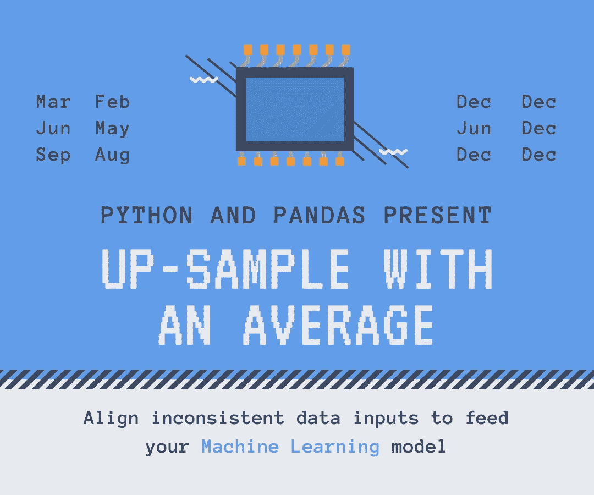
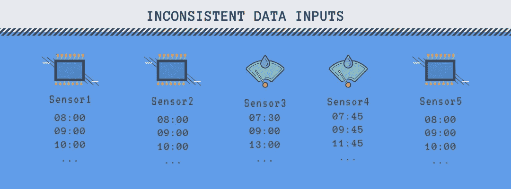

# 熊猫的样本高于平均值

> 原文：<https://towardsdatascience.com/upsample-with-an-average-in-pandas-c029032c57ca?source=collection_archive---------25----------------------->

## [入门](https://towardsdatascience.com/tagged/getting-started)

## 为您的机器学习对齐不一致的报告数据



图片作者([许可](https://about.canva.com/license-agreements/onedesign/))

许多模型输入累积变量，如几小时内的降雨量或几个月内的公司收入。不幸的是，数据源通常在时间上不一致。一个传感器每隔奇数小时提供数据，另一个在偶数小时提供数据。一家公司在五月提供信息，另一家在六月。

如果您不想等待所有数据源都收集输入数据，或者当不适合向模型提供来自不同时间段的数据时，您必须将测量结果分散到相同的时间段。熊猫本身可以完成部分工作，但在本文中，我们将探索如何用平均值进行上采样，这需要一点额外的编码。

您可以通过 Github 上共享的笔记本运行本教程中的所有示例—[up sample _ to _ average . ipynb](https://github.com/vaclavdekanovsky/data-analysis-in-examples/blob/master/Pandas/Upsample/Upsample%20to%20average.ipynb)

# 重采样

## 向下采样

[python 的 Pandas 中的重采样](https://pandas.pydata.org/pandas-docs/stable/reference/resampling.html)允许您将频率较高的值转换为频率较低的值— `**downsample**`，例如，将每小时的数据转换为每天的总和、计数和平均值，或者将每天的值转换为每月的值。

```
# downsample:
CAT|DATE|VALUE
abc|0101|10
abc|0102|20
abc|0103|15# downsample
**[IN]:** df.groupby("CAT").resample("W", on="DATE").agg({"VALUE":["sum","count","mean","first","last"]})**[OUT]:** CAT|DATE|SUM|COUNT|MEAN|MIN|MAX|FIRST|LAST
abc|0107|45 |   3 | 15 | 10| 20|  10 | 15
```

它被称为`downsample`,因为数据行的数量减少了。可以申请`sum`、`count`、`mean`(平均)、`median`、`min`、`max`、`first`或`last`。基于每日输入，您可以重采样到周、月、季度、年，也可以重采样到半月——参见 pandas 文档中[重采样选项的完整列表。您还可以对乘法进行重新采样，例如`5H`以 5 小时为一组。](https://pandas.pydata.org/pandas-docs/stable/user_guide/timeseries.html#offset-aliases)

## 向上采样

重新采样到更频繁的时间戳被称为`**upsampling**`。你可以把几天变成几小时，或者几个月变成几天。进行上采样时，必须首先将日期时间列设置为数据框的索引(`.set_index`)，然后才能进行上采样。

```
# error in case you try upsample using .resample("D", on="col")
**ValueError**: Upsampling from level= or on= selection is not supported, use .set_index(...) to explicitly set index to datetime-like
```

除上述功能外，上采样还支持`backfill/bfill`、`ffill/pad`和`nearest`。但是如果你认为应用`mean`会把每天的值分割成每小时的平均值，那你就错了。所有加起来的样本都用`NaN`填充。

## 为什么我们要向上采样到平均值

假设你有一个商店组合，试着估算一下销售额。您输入`Jan-1`、`Jan-2`和`Jan-3`的收入，并执行回归以猜测`Jan-4`的目标值。你对你所有的商店进行训练，并使用模型来预测未来的销售。

但是如果有些商店只提供`Jan-2`和`Jan-3`的数据呢？其他仅在`Jan-1`和`Jan-3`上。您可以使用这 3 天中的`sum`或`average`进行缩减采样和建模，但在这种情况下，您会丢失有价值的输入信息，如周五的收入或周一的收入。

与普遍看法相反，这种情况很典型。当分析公司的基本数据以预测未来的股票价格时，一些公司每季度报告一次，而另一些公司每年报告两次。有些在 11 月，有些在 8 月。如果你等到每个人都提供了他们的数据，你可能会得出一个精确的预测，但那时所有有利可图的股票都会被卖出。



图片作者([许可](https://about.canva.com/license-agreements/onedesign/))

> 通常 80%的输入保持相同的模式，20%包括一些重要的场景具有不寻常的结构，你必须重新计算。

要解决这些数据泄漏，您可以向上采样到平均值。

## 用平均值向上采样

我说的是平滑不一致的报告数据的选项，这样您就可以

```
**[IN]:**
data="""
**CAT|DATE|VALUE**
abc|0101|10
abc|0103|20
abc|0105|15
efg|0102|40
efg|0105|30"""**[OUT]:**
**CAT|DATE|VALUE**
abc|0102|10
abc|0103|10   # 20 on 0103 covers interval 0102-0103 (2 days)
abc|0104|7.5
abc|0105|7.5  # 15 on 0105 covers interval 0104-0105 (2 days)
efg|0103|10
efg|0104|10
efg|0105|10   # 30 on 0105 covers interval 0103-0105 (3 days)
```

上面的例子很简单，但是想象一下你有几千个类别。有些是每天报告，有些是单双日报告，其余的是每三天或不定期报告。

## 如何做一般的魔术

为了计算平均值，你需要两个东西——`sum`除以`count`。您知道总数，因为它已被报告，但从最后一个值算起的天数(月数、周数……)未知。幸运的是，熊猫重采样包含一个参数`.group`,它显示了上采样时创建了多少个群组。

不幸的是，它本身不能与`groupby`一起工作，所以我们将首先查看单个类别。

```
data="""
CAT|DATE|VALUE
abc|**0101**|10
abc|**0103**|20
abc|**0106**|15"""
```

[重采样](https://pandas.pydata.org/pandas-docs/stable/reference/resampling.html)方法有两个属性:

*   `indices` —显示输入数据出现的位置
*   `groups` —用组索引对每个日期时间值进行索引。

```
# indices
[In]: df.set_index("DATE").resample("D").**indices**
[Out]: 
defaultdict(list,
            {Timestamp('1900-01-**01** 00:00:00', freq='D'): [0],
             Timestamp('1900-01-**03** 00:00:00', freq='D'): [1],
             Timestamp('1900-01-**06** 00:00:00', freq='D'): [2]})# groups
[In]: df.set_index("DATE").resample("D").**groups**
[Out]:
{Timestamp('1900-01-01 00:00:00', freq='D'): 1,
 Timestamp('1900-01-02 00:00:00', freq='D'): 1,
 Timestamp('1900-01-03 00:00:00', freq='D'): 2,
 Timestamp('1900-01-04 00:00:00', freq='D'): 2,
 Timestamp('1900-01-05 00:00:00', freq='D'): 2,
 Timestamp('1900-01-06 00:00:00', freq='D'): 3}
```

1 月 1 日和 2 日形成第一组，3 日至 5 日是第二组，最后一个数据样本属于最后一组。大多数情况下，报告的数据包含报告日期的值—1 月 3 日报告的 20 个数据涵盖 1 月 2 日和 1 月 3 日。在这种情况下，您使用`label`参数并将其设置为`right`。

```
# groups
[In]: df.set_index("DATE").resample("D", label="right).**groups**
[Out]:
{
 Timestamp('1900-01-02 00:00:00', freq='D'): 1,
 Timestamp('1900-01-03 00:00:00', freq='D'): 1,
 Timestamp('1900-01-04 00:00:00', freq='D'): 2,
 Timestamp('1900-01-05 00:00:00', freq='D'): 2,
 Timestamp('1900-01-06 00:00:00', freq='D'): 2,
 Timestamp('1900-01-07 00:00:00', freq='D'): 3,}
```

或者，您可以将组转换成数据帧，并移动值

```
df_groups = pd.DataFrame(df.set_index("DATE").resample("D").groups, index=["group"]).T.shift(1)
```

然后你计算每组中出现的次数。

```
s = df_groups.groupby("group").size()
s.name = "count"
```

并将计数与日期和回填值连接起来。它会生成一个数据帧，其中包含该时间段的总和以及该时间段内的发生次数，这就是计算平均值所需的全部内容。

如果你现在兴奋地大叫，坚持住，我们还没有到达终点。我们已经计算了单个组的平均值，但是如果我们想要`groupby`多个类别，例如，当我们有许多商店、公司或传感器要处理时，我们必须分别计算每个组的平均值。

这并不复杂，但如果您有许多输入，这可能会很耗时。参见下面的代码:

您已经将数据平滑到平均值，但通常您不需要每个月的平均值。您只需要涵盖不同的报告期。例如，在审查上市公司[业绩的财务分析](/stock-fundamental-analysis-eda-of-secs-quarterly-data-summary-455e62ff4817)中，大多数公司在季度末报告数据。但是有些是在不同的月份，甚至不是每季度。如果你想对一大堆公司的行为建模，你首先要对那些没有季度报告的公司进行平滑平均，然后使用`rolling`函数将输入限制为仅季度。

> 更多的输入意味着更多的模型参数和更长的计算时间

让我们看一下股票市场分析的例子:

编码再次让我们感到惊讶。当您对**天**应用`.resample("D", label="right")`重采样时，结果与`.resample("D", label="right", **closed="left"**)`相同。如果在重新采样到**月**时做同样的操作，`label="right"`与`label="right", **closed="right"**`相匹配。因此，您必须为每月计算指定`label="right", closed="left"`,或者使用上述带有`shift`的变通方法。

# 结论

我希望你不仅学到了关于重采样的知识，还学到了在输入机器学习模型时如何使用替代方法来对齐不一致的数据。

```
The images were with [canva.com](https://partner.canva.com/vdek) (affiliate link, when you click on it and purchase a product, you won't pay more, but I can receive a small reward; you can always write canva.com to your browser to avoid this). Canva offer some free templates and graphics too. 
Other articles:
* [Everything you wanted to know about Kfold train-test split](/complete-guide-to-pythons-cross-validation-with-examples-a9676b5cac12)
* [Why it's worth considering another file types than csv](/stop-persisting-pandas-data-frames-in-csvs-f369a6440af5)
* [How to turn a list of addreses into a map](/pythons-geocoding-convert-a-list-of-addresses-into-a-map-f522ef513fd6)Great thanks to [Towards data science](https://towardsdatascience.com/)
```

Github 上的完整代码—[up sample _ to _ average . ipynb](https://github.com/vaclavdekanovsky/data-analysis-in-examples/blob/master/Pandas/Upsample/Upsample%20to%20average.ipynb)。