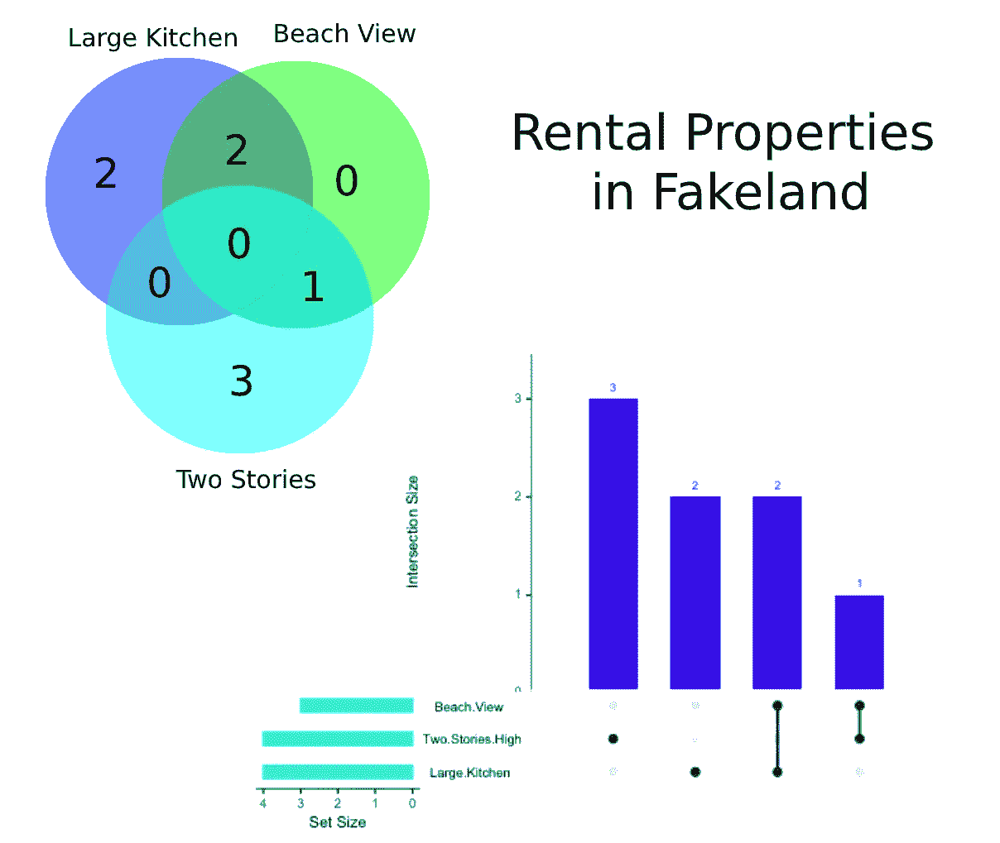
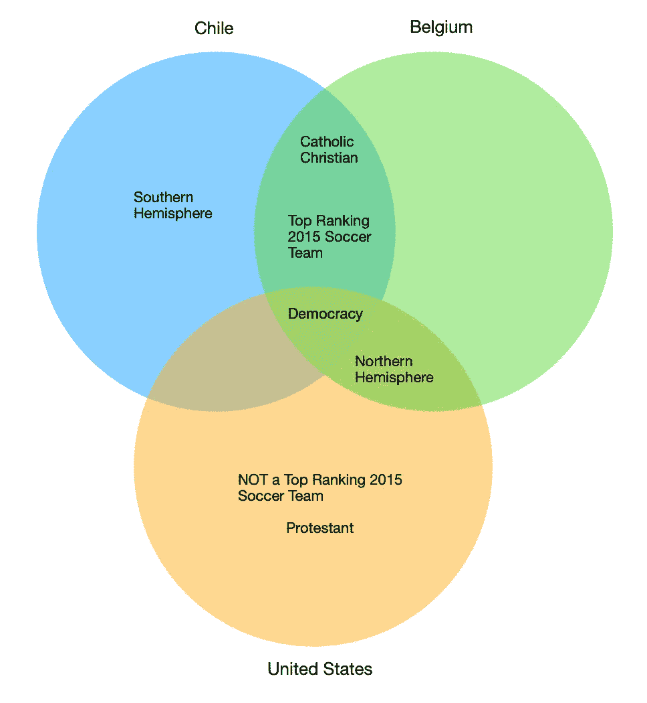
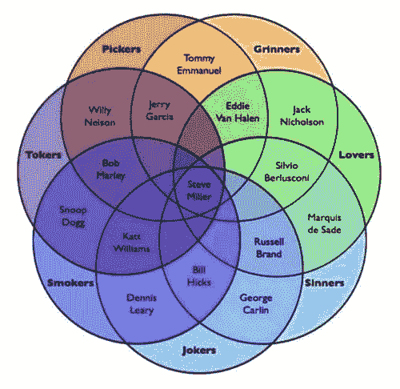
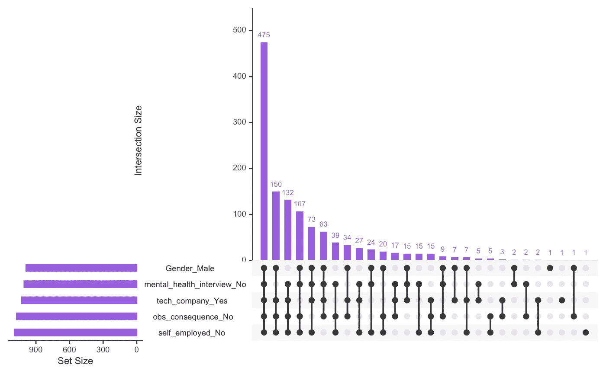

# 镦粗是自维恩图以来最伟大的可视化设置

> 原文：<https://towardsdatascience.com/upsetr-is-the-greatest-set-visualization-since-the-venn-diagram-8bccbaef698a?source=collection_archive---------18----------------------->

## 一个新的 R 包，用于查看复杂数据中的交叉点



作者图片，灵感来自[一张来自原始论文](https://www.ncbi.nlm.nih.gov/core/lw/2.0/html/tileshop_pmc/tileshop_pmc_inline.html?title=Click%20on%20image%20to%20zoom&p=PMC3&id=4720993_emss-66749-f0029.jpg)的图片

我坚信[翻转器](https://rdrr.io/cran/UpSetR/man/upset.html)是我见过的最漂亮、最直观的大型复杂集合交集可视化。

维恩图让我微笑，但冷门让我感到强大。冷镦机可以可视化维恩图只能梦想的数据。

但首先，让我们回顾一下文氏图。

# 维恩图综述

维恩图在我们今天的文化中无处不在。它们易于阅读，能有效地传递信息，而且玩起来也很有趣。但是如果你想形象化三个以上的类别，你会怎么做？

让我们看一个简单的例子。

假设我们有一个关于世界各国的数据集，我们有每个国家的一些信息。


这是一个愚蠢的例子，但信息是准确的

将不同国家之间的相似性和差异可视化的维恩图可能如下所示:



作者图片

这张图看起来很漂亮，但我不能代表太多，它会很快变得杂乱无章。

如果我想比较另一个国家呢？嗯，我运气不好。你真的想尝试破译类似[这种](https://i.pinimg.com/originals/3f/ca/ec/3fcaece6dbd982319883233342328a6f.jpg)的东西吗？这个呢？



[“史蒂夫·米勒·维恩图:你是一个采摘者、一个微笑者、一个情人、一个罪人、一个小丑、一个吸烟者还是一个午夜吸烟者？](https://www.flickr.com/photos/14829735@N00/7313395998) [dullhunk](https://www.flickr.com/photos/14829735@N00) 的(艺术家未知)由 2.0 在 [CC 下授权](https://creativecommons.org/licenses/by/2.0/?ref=ccsearch&atype=rich)

是啊，我不这么认为。

# 介绍:冷镦机

UpSet 是一种非常[新的可视化技术](https://www.ncbi.nlm.nih.gov/pmc/articles/PMC4720993/)，它通过用条形图以表格形式呈现信息来解决这个问题。你可以在每一个类别中拥有你想要的任意多的东西，并且很容易找到它们之间的交集。UpSetR 是实现它的一个 [R 包](https://rdrr.io/cran/UpSetR/man/upset.html)。

有一个来自 IMDB 的数据集，看看有多少部电影有相同的演员，他们是谁？没问题！想看看癌症患者的基因中是否有相同的一组突变，它们是什么？颠覆者为你而来！

UpSetR 最适合在包含大量要素的复杂数据集中查找模式。这是通过将不同要素中具有许多相同值的数据点分组来实现的。也就是说，冷镦机寻找最大的相交集。

对于已经是二进制的变量(这意味着两个类别)，或者可以转换成二进制的变量，这是最好的。需要注意的是，一键编码可以将任何分类特征转换为二进制特征。事实上，目前的实现只适用于二进制变量。

# 例如:心理健康数据

我正在为这个 Kaggle 数据集开发一个分类模型，我试图理解不同的列是如何相互关联的。

**数据集包含了科技公司对心理健康的态度，以及员工心理健康的信息**。调查数据包含了从雇主是否提供心理健康福利到员工自己是否接受过心理健康治疗的所有问题的答案。

在这一点上，还不清楚这些特性是如何相互关联的，我想知道发生了什么。

之前，我已经清理了一些数据，所以现在我将把它输入到 R 中。然而，在我创建颠覆可视化之前，我想一次性编码我的数据，因为它大部分是分类数据。

**一键编码**

**one-hot encoding** 是一种通过创建新列将分类变量转化为二进制变量的方法。例如，我们的 *work_interfere* 栏有 3 个选项:经常、有时、从不。在我们一次性编码我们的数据后，我们将有 3 列:*work _ interfere _ occurly，work _ interfere _ sometimes，work_interfere_never，*如果该值适用，则每一列包含 1，如果不适用，则包含 0。如果你想了解更多，网上有很多很棒的教程。

下面是 R 代码:

```
data = read.csv('survey_data.csv', na.strings="Not Applicable")#install packages (can skip if already installed)
install.packages("mltools") 
install.packages("data.table")
install.packages("UpSetR")#one-hot encode
library(mltools)
library(data.table)
newdata <- one_hot(as.data.table(data))#create the visualization
library(UpSetR)
upset(newdata, order.by=”freq”, main.bar.color = “#995ee1”, sets.bar.color = “#995ee1”, group.by = ‘degree’) 
```

您可以在此下载调查数据[。](https://gist.github.com/ElianaGrosof/6de16437d63721d17392d199ce2a92f7)

你会得到这个可爱的东西:



作者图片

**如何解读**

*左侧栏*

在左侧，有代表每个集合的总大小的条。在*性别 _ 男性*的案例中，我们可以看到大约有 950 名调查受访者认为自己的性别是男性。这些集合是**不分离的**——也就是说， *mental_interview_No* 包括所有对“你会在面试中向潜在雇主提出精神健康问题吗？”这个问题回答“不”的人，无论性别如何

*顶栏*

在顶部，我们可以看到每个交叉集合的大小。如果黑点被填充，则该类别包含在集合中。如果圆点是灰色的，则该类别不在集合中。注意集合**是不相交的**，这意味着它们是不重叠的。你可以在顶部的横条中看到每个数据点，不像左边的横条。

*示例 1:* 由于左起第一个条上的所有点都已填写，该条代表对由*性别*变量表示的问题回答为男性的所有 475 人，对*心理 _ 健康 _ 面试*、*观察 _ 结果*和*自雇者*，以及对*技术 _ 公司*回答为“是”。

*示例 2:* 然而，右边第二组代表一名单身男子( *Gender_Male* )，他没有听说过或观察到患有精神健康疾病的同事在其工作场所造成的负面后果(*OBS _ result*)**，但**是一家科技公司的自营职业者，并将在采访中提及精神健康问题。我们知道这位工人是个体经营者，并且会在采访中提到精神健康，这是基于可视化中某些点没有被选中的事实以及我们对其他可能选项的了解。

**在这个可视化中，考虑*在可视化中没有出现*的信息非常重要，就像第二个例子一样。在某些情况下，这是最有趣的部分。**

# 心烦意乱的形象告诉我们

我们来看左起第一列(*例 1* )。

我知道我有大约 1200 个数据点，其中 988 个是男性。有 475 名男性表示，他们不会在面试中向潜在雇主提出心理健康问题*mental _ health _ interview _ No*，他们目前在一家科技公司工作 *tech_company_Yes* ，他们没有听说或观察到工作场所有心理健康问题的同事会带来负面后果*OBS _ result _ No*，他们也不是自由职业者*自由职业者 _No* ，这一事实意义重大，因为**显示，近一半的男性(48**

如果你把对这四个问题做出相同回答的 132 名非男性加入进来，就像我们在左起第二列看到的那样，那么你会发现整个数据集中有将近一半的人对这四个问题做出了完全相同的回答(48%)。

*释义*

这些结果告诉我，人们，尤其是男性，不会在工作场所公开谈论心理健康。这是一个有趣的初步发现。

*潜在的改进*

如果我想改进我的分析，我可以将序数变量(具有顺序感的变量，如从 1 到 5 的范围，或“没有、一些、很多”)转换成二元变量，通过宁滨(将相关值分成两个复合类别)保留一些层次感。这将允许他们更强烈地考虑到 upser 的分析中，因为 upser 可以考虑的选项更少。

# 总结想法

我很喜欢 UpSetR 软件包，认为这是进行探索性数据分析的一种很好的方式。它的[文档很不错](https://rdrr.io/cran/UpSetR/man/upset.html)，并且有一个可用的 [Python 版本](https://github.com/ImSoErgodic/py-upset)。

如果您有任何问题或意见，请联系我们！我希望你能像我一样喜欢这种想象。