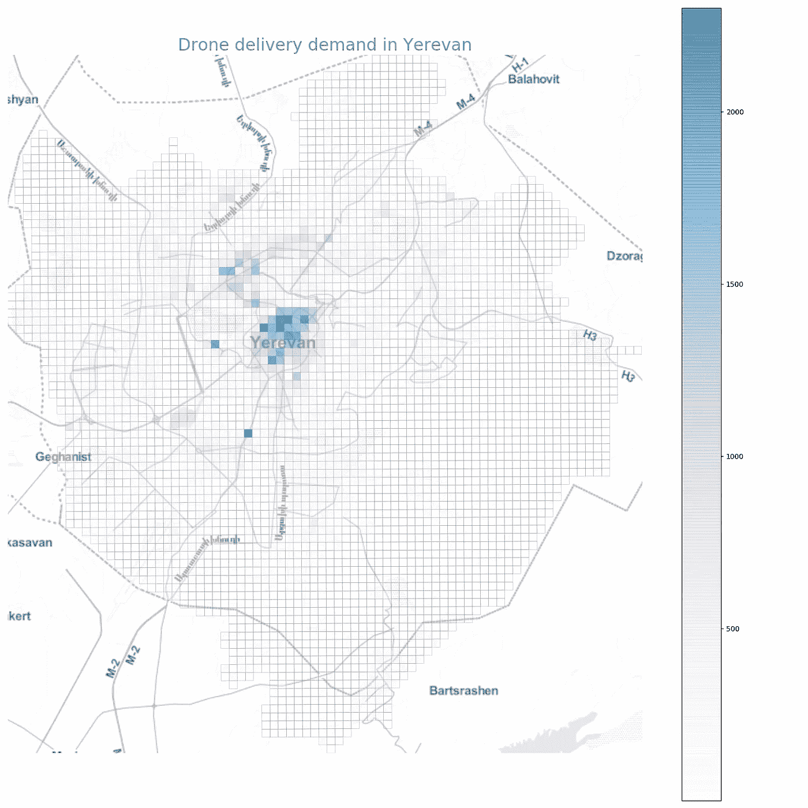
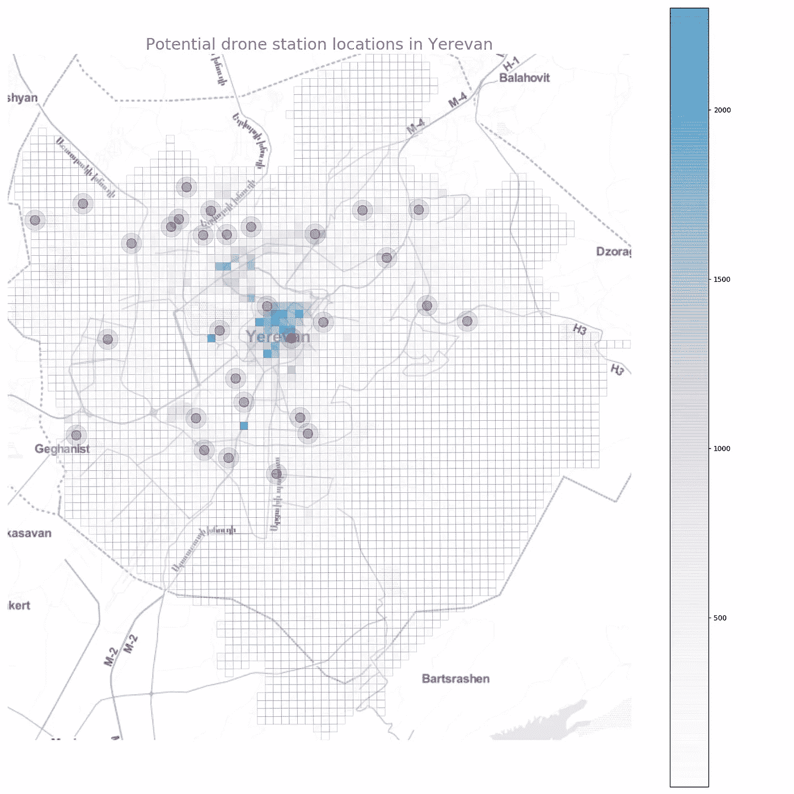
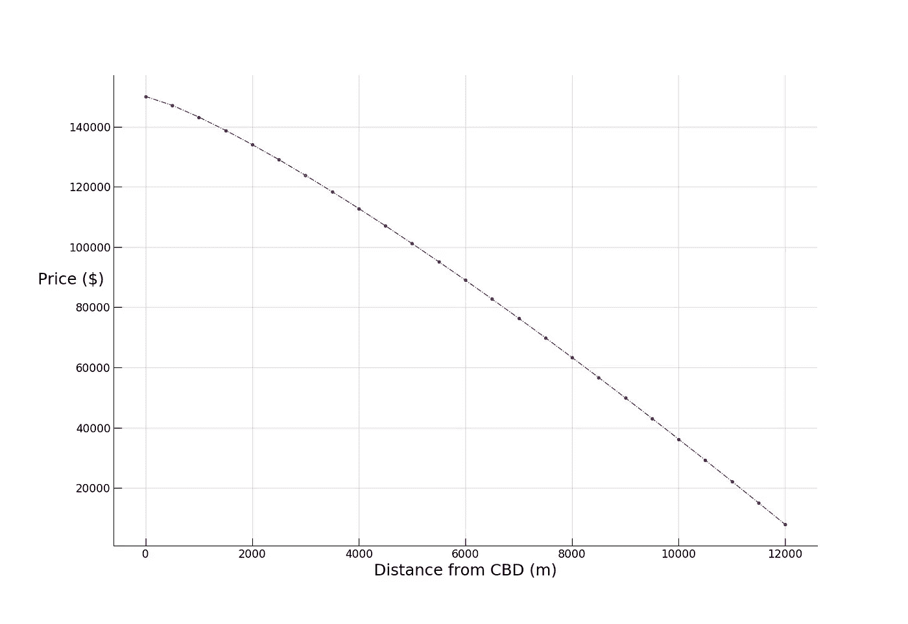
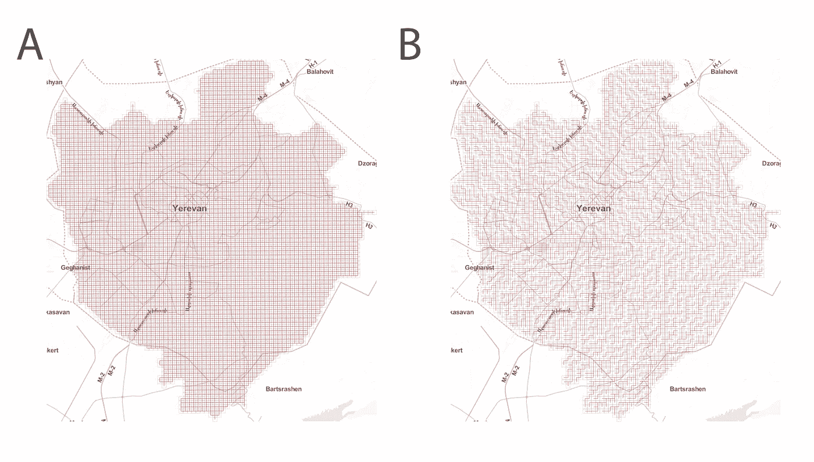
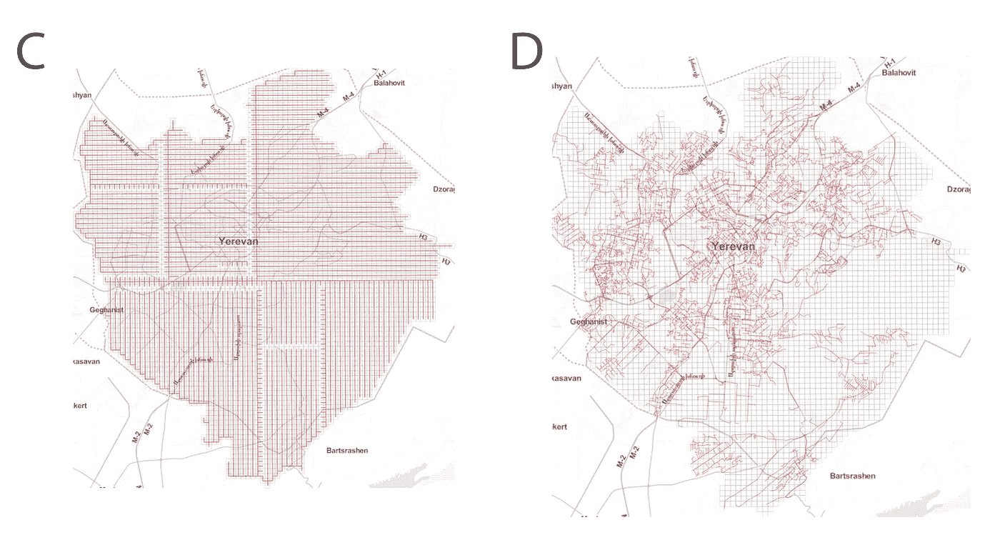
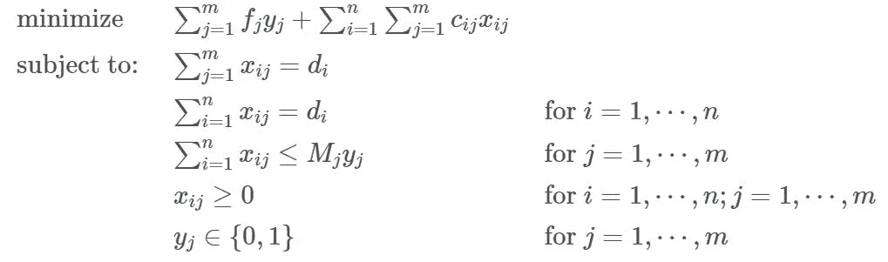
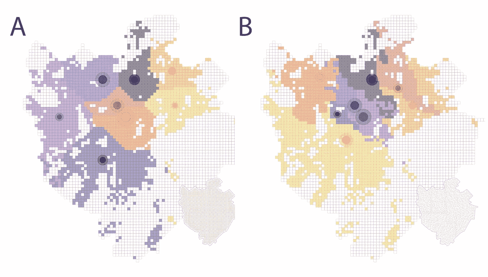
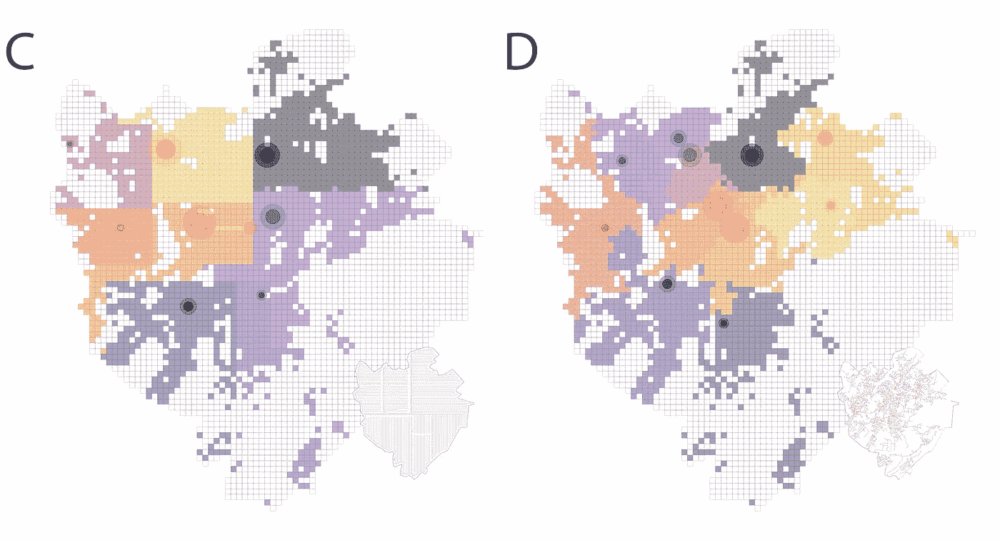
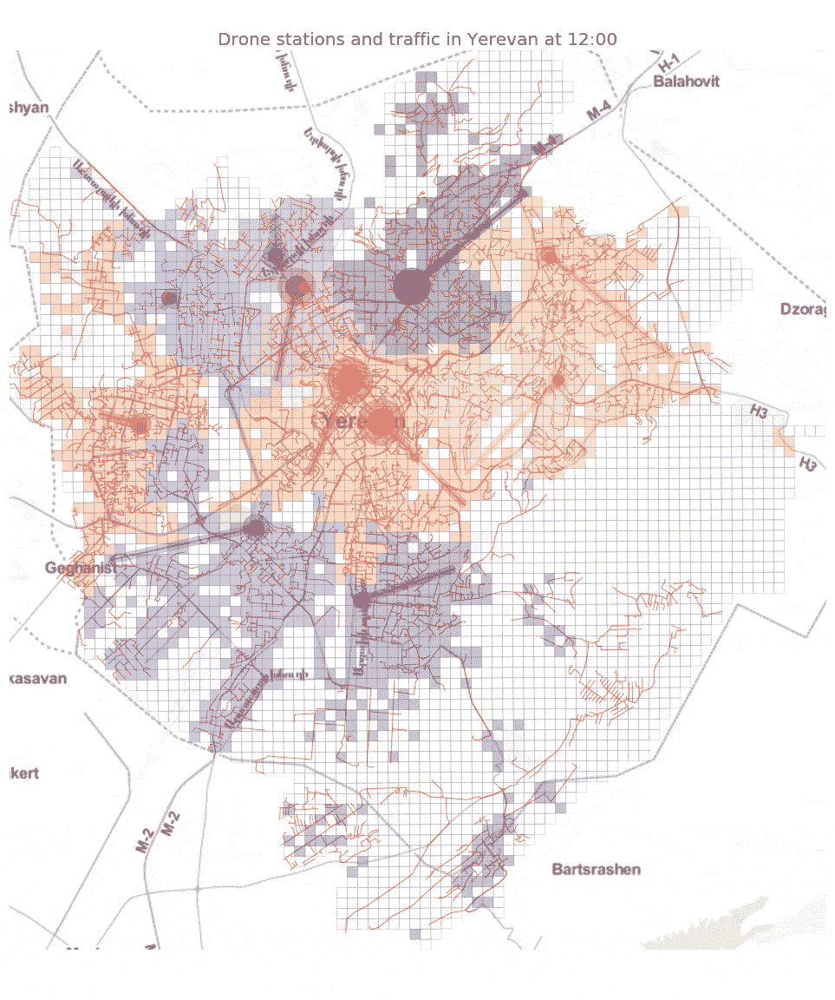

# 城市无人机:设施定位问题

> 原文：<https://towardsdatascience.com/urban-drones-the-facility-location-problem-6137c59d7a7e?source=collection_archive---------16----------------------->

## 当成群的无人机涌入我们的城市时会发生什么，为什么城市规划者应该关心？


## 城市需要无人机吗？

根据美国联邦航空局的一份报告，到 2021 年，预计将有 447 万架小型无人机在美国运营，高于今天的 275 万架。自 2017 年以来，已经有超过 100 万无人机所有者在美国联邦航空管理局(FAA)注册。到目前为止，[正如预期的](https://link.springer.com/article/10.1007/s10846-017-0483-z)，商业无人机购买量快速增长的主要驱动力是它们的高机动性和在计算机视觉中的应用:在危险区域拍照，建筑物检查，交通监控，摄影测量等。

然而，**这仅仅是开始**。预计无人机将在未来的城市中执行重要任务:如果一座桥梁即将倒塌，一场火灾正在蔓延或一个人陷入困境，它们将立即提供从天空鸟瞰的报告。它们将补充我们的运输系统，把东西搬来搬去，或者把人快速送到某个地方。事实上，[亚马逊的 Prime Air](https://en.wikipedia.org/wiki/Amazon_Prime_Air) 无人机送货服务已经处于开始运营前的最后开发阶段。无人机也将是长着翅膀的机器人，执行诸如修桥或救火等任务。

在本帖中，我们将讨论无人机将如何影响城市，以及城市规划者将如何扩展他们的专业知识范围，以便能够处理城市空域、城市空中交通及其与传统城市空间的相互作用。我们将通过解决无人机站在一个城市中的高效放置问题，并查看不同的城市空中交通配置如何导致不同的操作区和城市机动性来实现这一点。

## 为什么城市规划者应该关注？

到目前为止，我们大多数人只是偶尔见过无人机。但是，当成群的无人机涌入我们的城市时，会发生什么？**我们可以充满信心地预计，无人机的大规模部署将给规划、管理和设计可持续城市带来一些重大挑战**。无人机技术的大规模扩散将对我们城市的本质产生影响。某些类型的无人机应用将需要新的物理基础设施。

无人机系统可能会影响建筑物的设计和建造方式。例如，如果**无人机对接站**将被放置在建筑物的屋顶上，那么屋顶将必须易于人类接近，同时也便于运输货物进出。新建筑的设计必须考虑到这一点(例如，增加内部或外部电梯井)。改造旧建筑以适应新环境也是一个严峻的挑战。还需要解决对建筑环境的视觉影响。

将出现新型基础设施，如形成无人机移动网络的**客运和物流枢纽**，以及配备有**雷达、** [**信号干扰机**](https://uavcoach.com/drone-jammer/) **和** [**无人机捕捉技术**](https://fortemtech.com/products/dronehunter/) 的地面**反无人机系统**，用于打击具有流氓或危险行为的无人机。必须通过[地理围栏](https://en.wikipedia.org/wiki/Geo-fence)指定并强制执行关键基础设施和建筑物(如政府大楼、机场或监狱)上空的禁飞区。将所有这些与现有的建筑环境相结合，并为其运作创建必要的监管框架，将对建筑师、城市规划者和决策者的日常实践产生重大影响。

高度自动化的无人机操作将需要固定的起降坞站，集成充电或加油系统。这可能是一个放置在建筑物顶部的移动或永久车站，与现有的交通基础设施或其他类型的基础设施(如小型车站的灯柱)相结合。这些扩展坞很可能会集成电池充电功能。鉴于大多数发达国家的能源政策，必须考虑和认真规划飙升的电力需求对电网和相关排放的影响。

例如，私人拥有无人机的成本可能[比租赁无人机的成本](https://ieeexplore.ieee.org/document/8288882)要高得多，尤其是对于那些可能只需要无人机执行单一任务的公司。然而，随着全市租赁系统的到位，城市、公司和用户将不需要购买无人机，有效地在他们之间分配成本。因此，基于遍布城市的无人机港口(或站)系统规划无人机租赁服务是必要的。通过提供在无人机站等待的分布式自主无人机的公共无人机租赁服务，这可以减少空中无人机的总数以及利用无人机完成城市服务、公民和其他用户请求的任务的总成本。这意味着有必要解决许多其他问题中的下列问题:

*   **在哪里放置扩展坞？**
*   **他们有多少人？**
*   **凭什么能力？**

# 设施选址问题

上述问题可以在数学优化的帮助下得到解答，特别是用[线性规划](https://en.wikipedia.org/wiki/Linear_programming)如果公式化为[容量受限设施选址问题](https://en.wikipedia.org/wiki/Facility_location_problem#Capacitated_facility_location)。

后者是为工厂、仓库、发电站或其他基础设施选址的经典优化问题。一个典型的设施选址问题涉及在潜在可用的地点中确定最佳地点，服从特定的约束，该约束要求在几个地点的需求由开放的设施服务。与此类计划相关的成本包括通常与从设施到需求地点的距离总和成比例的部分，以及与设施的开放和维护成本成比例的部分。**该问题的目标是选择设施位置，以最小化总成本**。设施的服务能力可能有限，也可能有限，这将问题分为有能力和无能力两种情况。

## 给点上下文吧！

想象一下这样一种情况，我们的任务是为在埃里温市放置无人机停靠站草拟一份概念计划。具有城市中每日(每小时、每周或每月)名义需求的空间分布(出于演示目的，出租车需求被用作替代):



以及许多安装无人机站的潜在地点(在我们的示例中有 30 个):



我们如何确定放置扩展坞的最佳位置？嗯，这显然取决于成本。

**第一类成本**是购买和安装扩展坞。为了简化问题，让我们假设 [Alonso 的单中心城市模型](https://en.wikipedia.org/wiki/Bid_rent_theory)，根据该模型，房地产价格随着与中央商务区的距离增加而按照某种指数或幂衰减规律下降:



*这显然是一种权衡*:虽然大部分需求在空间上集中在中心位置(见需求图)，因此在中心位置安装扩展坞以降低传输成本是有意义的，但相反，我们会因选择中心位置而产生更高的成本(虽然价格是根据一些常识选择的，但它们仅用于演示目的)。

**第二类成本**是操作无人机的成本，可以安全地假设这与飞行距离成比例。然而，这里事情变得有趣了，**这些距离将取决于底层(实际上是*上层*所在)的城市空中交通路径方式！**在下图中，我们可以看到空中交通简单配置的两个例子，笛卡尔网格( **A** )和迷宫式布局( **B** ):



让我们再看两个例子:上面网格的[最小生成树](https://en.wikipedia.org/wiki/Minimum_spanning_tree)，通常用于在通信网络中建立物理线路以减少总线路长度，以及实际的埃里温街道网络，因为现实场景之一是无人机将直接在现有街道网络上方运行，以减少视觉污染并出于安全原因( **D** )。



由于四个空中交通路径系统如此不同，我们可以直观地预期无人机站选址问题的解决方案也会产生差异。

## 数学公式

为了验证这一点是否正确，解决方案之间的比较，以及这对未来的城市规划者和交通工程师意味着什么，我们需要解决一个线性优化问题。考虑 *n* 个客户 *i = 1，2，…，n* 和 *m* 个地点放置无人机对接站 *j = 1，2，…，m* 。将连续变量 *Xij ≥ 0* 定义为从无人机站 *j* 到客户 *i* 的服务量，如果无人机站安装在位置 *j* 处，则定义为二进制变量 *Yj = 1* ，否则定义为 *Yj = 0* 。容量受限的设施位置问题的整数优化模型现在可以公式化如下:



该问题的目标是最小化无人机站安装成本和无人机运行成本的总和。第一组约束要求严格满足每个客户的需求。每个无人机站 *j* 的能力受到第二组约束的限制:如果安装了无人机站 *j* ，则考虑其能力限制；如果没有安装， *j* 满足的需求为零。第三组约束强加了可变的上限。尽管它们是多余的，但它们产生了比等价的较弱公式更严格的线性规划松弛(线性规划的很好的介绍可以在[这里](https://www.math.ucla.edu/~tom/LP.pdf)找到)。为了直观地了解这些问题是如何解决的，这篇维基百科文章提供了一个相当好的初步概述。幸运的是，有许多优秀的数学优化求解器。让我们看看如何用 Python 自己编码:

```
from pulp import *
  COSTUMERS = positive_flow_inds # the demand vector
  potential_stations = np.random.choice(COSTUMERS,30) #choose 30 potential sites
  STATION = ['STATION {}'.format(x) for x in potential_stations]
  demand = dict(polyflows[polyflows.inflow>0]['inflow']) #setting up the demand dictionary
  STATION_dict = dict(zip(STATION, potential_stations))

  #installation cost decay from center (given a vector of distances from a central location)
  costs_from_cen = 150000 - 1.5*dists_from_cen**1.22
  install_cost = {key: costs_from_cen[val] for key, val in STATION_dict.items()} #installation costs
  max_capacity = {key: 100000 for key in FACILITY} #maximum capacity

  #setting up the transportation costs given a distance cost matrix (computed as pairwise shortest paths in the underlying air 
  #traffic network)
  transp = {}
  for loc in potential_stations:
      cost_dict = dict(zip(COSTUMERS, costmat_full[loc][COSTUMERS]))
      transp['STATION {}'.format(loc)] = cost_dict

  # SET PROBLEM VARIABLE
  prob = LpProblem("STATIONLocation", LpMinimize)

  # DECISION VARIABLES
  serv_vars = LpVariable.dicts("Service", 
                              [
                                  (i,j) for i in COSTUMERS for j in STATION
                              ], 0)
  use_vars = LpVariable.dicts("Uselocation", STATION, 0,1, LpBinary)

  # OBJECTIVE FUNCTION

  prob += lpSum(actcost[j]*use_vars[j] for j in STATION) + lpSum(transp[j][i]*serv_vars[(i,j)]
                                                                 for j in STATION for i in COSTUMERS)

  # CONSTRAINTS
  for i in COSTUMERS:
      prob += lpSum(serv_vars[(i,j)] for j in STATION) == demand[i] #CONSTRAINT 1

  for j in STATION:
      prob += lpSum(serv_vars[(i,j)] for i in COSTUMERS) <= maxam[j]*use_vars[j]

  for i in COSTUMERS:
      for j in STATION:
          prob += serv_vars[(i,j)] <= demand[i]*use_vars[j]

  # SOLUTION

  prob.solve()
  print("Status: ", LpStatus[prob.status])

  # PRINT DECISION VARIABLES
  TOL = .0001 #tolerance for identifying which locations the algorithm has chosen
  for i in STATION:
      if use_vars[i].varValue > TOL:
          print("Establish drone station at site ", i)

  for v in prob.variables():
      print(v.name, " = ", v.varValue)

  # PRINT OPTIMAL SOLUTION
  print("The total cost of installing and operating drones = ", value(prob.objective))
```

## 四个解决方案

解决上述优化问题产生了配置 **A** 和 **B** 的以下解决方案:



对于 **C** 和 **D** :



现有街道网络配置的小动画，用于说明系统动态:



我们从图中看到，尽管所有四种布局都有一个共同的优化模式，无人机站的最佳数量大致相似(从 8 到 11)，大型供应商站的空间聚类也相似(较大的圆圈表示较大的供应量)，但最佳位置和需求覆盖区域(以颜色显示)有很大不同！

这意味着空中交通路径设计的微小变化会对无人机站的最佳位置、每个站覆盖的地理区域以及不同区域的空中交通量产生巨大影响。我们也可以看看每个航空系统的最佳总成本。特别是，我们发现最好的路径系统是笛卡尔网格(~ 250 万美元)，然后是现有的街道网络(~ 410 万美元)，然后是迷宫系统(~ 450 万美元)，最差的是其最小生成树(~ 600 万美元)。我们看到结果暗示了未来规划者将不得不面对的权衡:**成本对安全对美观对实用性**。

# 结论

在这篇文章中，我们试图提高建筑师、城市规划者和政策制定者对无人机技术即将给我们的城市带来的巨大变化的认识和警觉。我们研究了埃里温的案例，并解决了一个简单的数学优化问题，以找到无人机停靠站的最佳位置来满足需求(包括商业和城市运营，如紧急服务)。我们看到了城市空间规划的差异如何对上述问题的解决产生巨大影响。与城市街道空间不同，城市街道空间的大部分存在都是逐渐演变的，城市空气空间必须在相对较短的时间框架内进行规划、设计和部署。

在现实环境中解决设施选址问题时，显然会有更多的变量需要考虑，这使得优化问题[更难解决](https://link.springer.com/article/10.1007/s10479-019-03385-x)。例如，在我们的例子中，我们假设了一次性需求结构，而在大多数现实世界的设置中，需求是不稳定的，需要[随机优化](https://en.wikipedia.org/wiki/Stochastic_optimization)。

然而，这篇文章的目的不是提供解决无人机站选址问题的手册(让我们把它留给[运筹学](https://en.wikipedia.org/wiki/Operations_research)专业人士)，而是展示它对城市空间和移动性的影响，并指出扩展城市规划者和其他城市爱好者兴趣范围的必要性。

附注:你可以在这里找到更多关于主题[的信息。](https://lexparsimon.github.io)