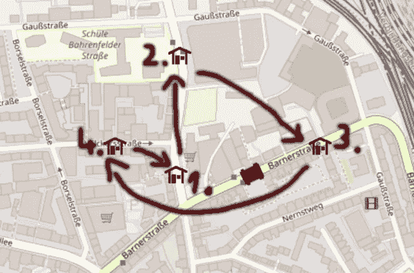
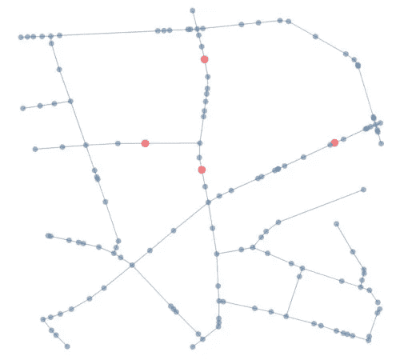
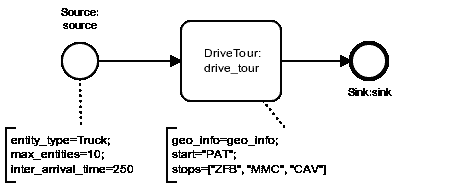
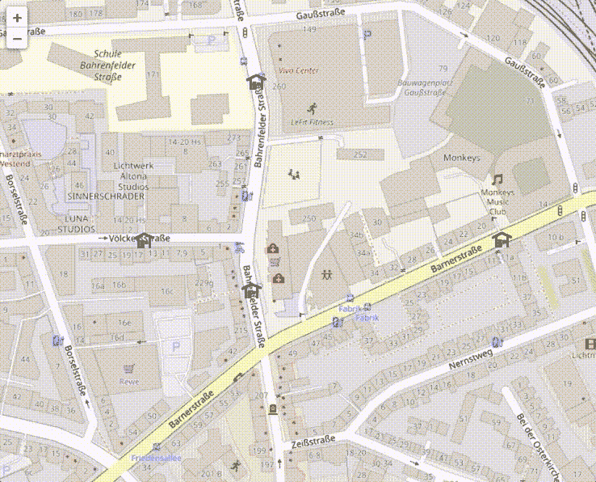

# 基于 Python 的城市物流网络仿真

> 原文：<https://towardsdatascience.com/urban-logistics-network-simulation-in-python-60b0132375f9?source=collection_archive---------17----------------------->

## *使用 SimPy、OSMnx 和 fleet . js 构建 Anylogic 的 GIS 功能*

[Anylogic](https://www.anylogic.com/) 可能是目前最流行的物流应用模拟软件包之一。一个非常好而且非常独特的特性是可以将 GIS 地图包含到模拟模型中。它允许在地图上放置模拟元素，并根据真实的空间信息沿现有路线移动它们。这很酷，因为它可以用来模拟整个供应链，包括为复杂的问题提供一个伟大的，有形的可视化的手段。例如，[项目](https://fladdimir.github.io/publication/i3m2017/)使用 *Anylogic* 评估法国格勒诺布尔市中心更可持续的城市物流网络的不同设计和交付方案。数据驱动的模拟模型允许计算多层供应链网络中各种转运节点位置和不同类型运输设备的 KPI。

随着该功能的成功，Anylogic 的家伙们甚至构建了[anylistix](https://www.anylogistix.com/)，将预先构建的&可定制模拟模型与商业求解器相结合，用于集成供应链规划&优化。

显然，那些商业特性是有代价的，所以我们来看看这种模式是否也可以用不同的手段来实现。

[*从 github 获取回购。*](https://github.com/fladdimir/csa-streetmap)

# 场景和范围

这个职位的模拟模型将基于一个小型的案例研究。

面对人类越来越习惯于甚至是日常必需品的送货上门这一事实，汉堡阿尔托纳的法国面包店 [Die Patisserie](http://www.die-patisserie.de/de_DE) 想要为附近的顾客提供甜点。

确定了 3 个主要购买者:失物招领处[中央基金会](https://www.hamburg.de/altona/fundbuero/)、[猴子音乐俱乐部](https://www.monkeys-hamburg.de/)和出版社[卡尔森出版社](https://www.carlsen.de/node/18749)。

不同位置的坐标(纬度、经度):

1.  法式蛋糕店(53.55668，9.92815)
2.  中央公园(53.55817，9.92829)
3.  猴子音乐俱乐部(53.55706，9.93161)
4.  卡尔森出版社(53.55703，9.92684)

为了简单起见，假设访问节点的顺序是固定的。旅游的起点和终点都在蛋糕店(1。):



作为旅程的一部分要访问的节点

# 仿真模型

简单场景的模拟模型是通过以下方式创建的:

*   用于检索地理信息和计算最短路径的 OS mnx/networkx(Python)
*   SimPy/Casymda 用于模拟游览(Python)
*   基于浏览器的动画(JavaScript)的传单. js

# 1.OSMnx

令人惊叹的 OS mnx T1 包提供了从 OpenStreetMap 获取街道网络的 T2 网络图 T3 的可能性。通过指定要包括的 OSM 节点的中心和距离，可以获得我们场景的相关部分:

```
CENTER = (53.55668, 9.92815)  
DISTANCE = 300
G = ox.graph_from_point(CENTER, distance=DISTANCE, network_type='drive')
```

OSMnx 让我们为旅游的 4 个地点中的每一个选择最近的 OSM 节点，并且还提供了绘制网络的方便方法。蓝点代表由边连接的 OSM 节点。4 个相关位置以红色显示:



提取的街道网络的 OSMnx 图

为了准备仿真模型所需的所有信息，现在使用 networkx 计算网络中 4 个相关节点之间的所有最短路径，并且包括每条路线的所有分段线性段的详细信息。结果被保存到磁盘上，以避免每次运行模型时进行提取和重新计算(当然，这也是为了尽可能降低 OSM 服务器的负载)。

上述方法可以被改进，例如，通过从给定的相关位置自动确定要加载的区域。不是为每个相关位置选择最近的 OSM 节点，而是首先寻找网络中最近的边会更精确。随着网络规模的增长，从 OSM 服务器直接查询相关节点之间的最短路径可能是一个更好的主意，而不是获取整个网络(Anylogic 似乎就是这样做的)。

# 2.Casymda/SimPy

[Casymda](https://pypi.org/project/casymda/) 在 [SimPy](https://pypi.org/project/simpy/) 之上提供了基于块的离散事件模拟模型建模。
我们的模型可以用一个简单的流程来描述:



模拟的流程模型

卡车实体在参数化的`Source`中创建，然后在自定义的`DriveTour`模块中处理，该模块包含根据路线长度和卡车移动速度计算时间的逻辑。它还提供了为动画计算中间实体位置的选项(时间间隔取决于模拟运行的实时因子)。模拟模型也可以在不调度任何动画相关行为的情况下运行，以最小化执行时间。要访问的节点及其顺序通过文本注释`stops=["ZFB", "MMC", "CAV"]`指定。

动画是通过 [flask](https://flask.palletsprojects.com/en/1.1.x/) 暴露信息和资源实现的(类似于[本帖](https://fladdimir.github.io/post/casymda/)中描述的基于 *tile-map* 的动画)。

# 3.传单. js

为了可视化地图上节点和实体的位置，[传单](https://leafletjs.com/)只需要几行。为了设置旋转角度，有一个[旋转。标记插件](https://github.com/bbecquet/Leaflet.RotatedMarker)满足我们的需求。

```
marker = L.marker(element.coords, { icon: new L.Icon({iconUrl: element.icon_path}) }).addTo(map);
marker.bindPopup(element.text);
marker.setRotationAngle(element.direction);
```

# 结果

从克隆的存储库中通过 [http://localhost:5000](http://localhost:5000/) 运行模拟:

```
docker-compose up geo-web-animation
```

下面的截屏显示了一辆卡车按照定义的顺序( *Patisserie —失物招领—Monkey ' s—Carlsen Publishing—Patisserie*)访问所有节点的完整旅程。单行道被正确地考虑在内，例如当从*猴子音乐俱乐部* (3。，最右边的节点)到*卡尔森出版社* (4。最左边的节点)沿着*线。*



基于浏览器的动画的屏幕截图