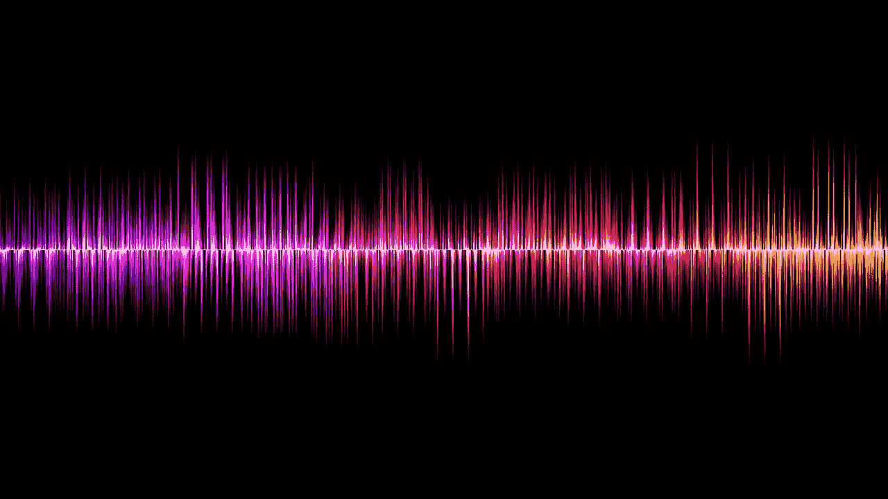
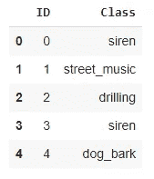
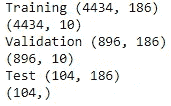

# 基于神经网络的城市声音分类

> 原文：<https://towardsdatascience.com/urban-sound-classification-using-neural-networks-9b6fcd8a9150?source=collection_archive---------16----------------------->

## 使用深度学习进行声音分类

每天我们都会听到不同的声音，这是我们生活的一部分。人类可以很容易地区分不同的声音，但是如果计算机也能把声音分类，那该多好啊。



图片由 [CSTRSK](https://pixabay.com/users/CSTRSK-642467/?utm_source=link-attribution&utm_medium=referral&utm_campaign=image&utm_content=856771) 来自 [Pixabay](https://pixabay.com/?utm_source=link-attribution&utm_medium=referral&utm_campaign=image&utm_content=856771)

在这篇博文中，我们将学习使用带有神经网络的机器学习对城市声音进行分类的技术。该数据集取自一个名为[城市声音](https://datahack.analyticsvidhya.com/contest/practice-problem-urban-sound-classification/)的分析视频竞赛。该数据集包含 8732 个标记的城市声音摘录，来自 10 个类别:空调、汽车喇叭、儿童玩耍、狗叫、钻孔、发动机空转、枪击、手提钻、警笛和街头音乐。

我将使用 python librosa 库从音频剪辑中提取数字特征，并使用这些特征来训练神经网络模型。

首先，让我们得到所有需要的库，

```
**import** **IPython.display** **as** **ipd**
**import** **os**
**import** **numpy** **as** **np**
**import** **pandas** **as** **pd**
**import** **matplotlib.pyplot** **as** **plt**
**import** **librosa**
**from** **tqdm** **import** tqdm
**from** **sklearn.preprocessing** **import** StandardScaler
**from** **keras.models** **import** Sequential
**from** **keras.layers** **import** Dense, Dropout, Activation
**from** **keras.optimizers** **import** Adam
```

数据集可以在 google drive 中找到，可以从[这里](https://drive.google.com/drive/folders/0By0bAi7hOBAFUHVXd1JCN3MwTEU)下载。

数据集包含保存声音摘录的 train、test 文件夹，并且存在具有每个声音摘录的标签的 train.csv 和 test.csv。我将只使用训练文件夹进行训练、验证和测试，它包含 5435 个标记的声音。

现在让我们阅读 train.csv，它包含有关声音摘录的标签信息。

```
data=pd.read_csv('/content/drive/MyDrive/colab_notebook/train.csv')data.head()#To see the dataset
```



让我们听听数据集中的任何随机声音，

```
ipd.Audio(‘/content/drive/My Drive/colab_notebook/Train/123.wav’)
```

现在，主要步骤是从数据集中提取要素。为此，我将使用 librosa 库。这是一个很好的音频文件库。

使用 librosa 库，我将从音频文件中提取四个特征。这些特征是 mel 倒谱系数(MFCCs)、tonnetz、Mel 标度谱图和来自波形的色谱图。

```
mfc=[]
chr=[]
me=[]
ton=[]
lab=[]
**for** i **in** tqdm(range(len(data))):
    f_name='/content/drive/My Drive/colab_notebook/Train/'+str(data.ID[i])+'.wav'
    X, s_rate = librosa.load(f_name, res_type='kaiser_fast')
    mf = np.mean(librosa.feature.mfcc(y=X, sr=s_rate).T,axis=0)
    mfc.append(mf)
    l=data.Class[i]
    lab.append(l)
    **try**:
        t =    np.mean(librosa.feature.tonnetz(
                       y=librosa.effects.harmonic(X),
                       sr=s_rate).T,axis=0)
        ton.append(t)
    **except**:
        print(f_name)  
    m = np.mean(librosa.feature.melspectrogram(X, sr=s_rate).T,axis=0)
    me.append(m)
    s = np.abs(librosa.stft(X))
    c = np.mean(librosa.feature.chroma_stft(S=s, sr=s_rate).T,axis=0)
    chr.append(c)
```

我有 186 个功能，每个音频文件都有各自的标签。

从音频文件中提取特征后，保存特征，因为提取特征将花费大量时间。

```
mfcc = pd.DataFrame(mfc)
mfcc.to_csv('/content/drive/My Drive/colab_notebook/mfc.csv', index=**False**)
chrr = pd.DataFrame(chr)
chrr.to_csv('/content/drive/My Drive/colab_notebook/chr.csv', index=**False**)
mee = pd.DataFrame(me)
mee.to_csv('/content/drive/My Drive/colab_notebook/me.csv', index=**False**)
tonn = pd.DataFrame(ton)
tonn.to_csv('/content/drive/My Drive/colab_notebook/ton.csv', index=**False**)
la = pd.DataFrame(lab)
la.to_csv('/content/drive/My Drive/colab_notebook/labels.csv', index=**False**)
```

将特征连接成一个数组，以便传递给模型。

```
features = []
**for** i **in** range(len(ton)):
    features.append(np.concatenate((me[i], mfc[i], 
                ton[i], chr[i]), axis=0))
```

对标签进行编码，以便模型能够理解。

```
la = pd.get_dummies(lab)label_columns=la.columns #To get the classestarget = la.to_numpy() #Convert labels to numpy array
```

现在归一化的特点，使梯度下降可以更快地收敛。

```
tran = StandardScaler()
features_train = tran.fit_transform(features)
```

现在，我将创建训练、验证和测试数据集。

```
feat_train=features_train[:4434]
target_train=target[:4434]
y_train=features_train[4434:5330]
y_val=target[4434:5330]
test_data=features_train[5330:]
test_label=lab['0'][5330:]print("Training",feat_train.shape)
print(target_train.shape)
print("Validation",y_train.shape)
print(y_val.shape)
print("Test",test_data.shape)
print(test_label.shape)
```



下一步是建立模型。

```
model = Sequential()

model.add(Dense(186, input_shape=(186,), activation = 'relu'))

model.add(Dense(256, activation = 'relu'))
model.add(Dropout(0.6))

model.add(Dense(128, activation = 'relu'))
model.add(Dropout(0.5))

model.add(Dense(10, activation = 'softmax'))

model.compile(loss='categorical_crossentropy', metrics=['accuracy'], optimizer='adam')
```

这是将用于培训的最终模型。

```
history = model.fit(feat_train, target_train, batch_size=64, epochs=30, 
                    validation_data=(y_train, y_val))
```

该模型将针对 epoch =30 进行训练，并且批量大小为 64。

在训练模型之后，它给出了 92%的验证准确度。

现在让我们看看我们的模型将如何在测试数据集上执行。

```
predict = model.predict_classes(test_data) #*To predict labels*
```

这将获得现在的值，以获得作为类的预测。

```
prediction=[]
**for** i **in** predict:
  j=label_columns[i]
  prediction.append(j)
```

预测有 104 个测试标签，现在计算有多少是正确预测。

```
k=0
for i, j in zip(test_label,prediction):
    if i==j:
       k=k+1
```

在 104 个标签中，这个模型已经正确预测了 94 个标签，这是非常好的。

在这篇博客中，我们讨论了如何使用 librosa 库从音频文件中提取特征，然后建立一个模型来将音频文件分类到不同的类别中。

本文中的所有代码都驻留在这个 Github [链接](https://github.com/shubham7169/Projects/blob/master/Urban%20Sound%20Classification.ipynb)上:

[](https://github.com/shubham7169/Projects/blob/master/Urban%20Sound%20Classification.ipynb) [## Shu bham 7169/项目

### permalink dissolve GitHub 是超过 5000 万开发人员的家园，他们一起工作来托管和审查代码，管理…

github.com](https://github.com/shubham7169/Projects/blob/master/Urban%20Sound%20Classification.ipynb)