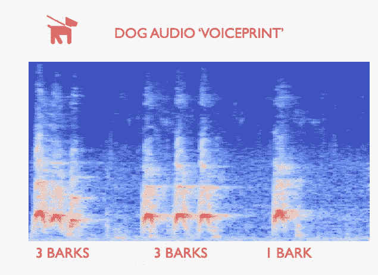
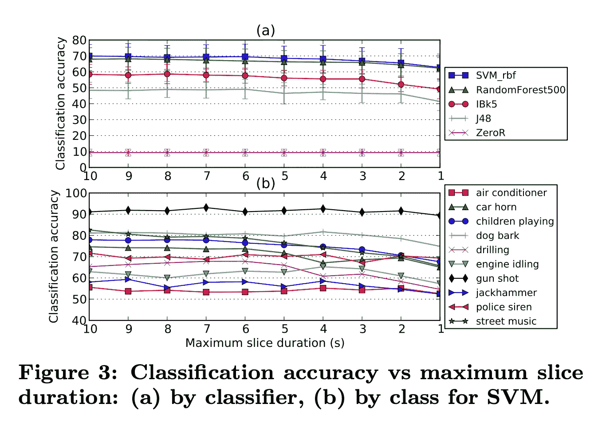
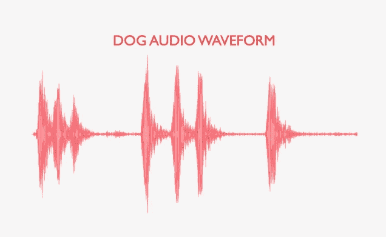
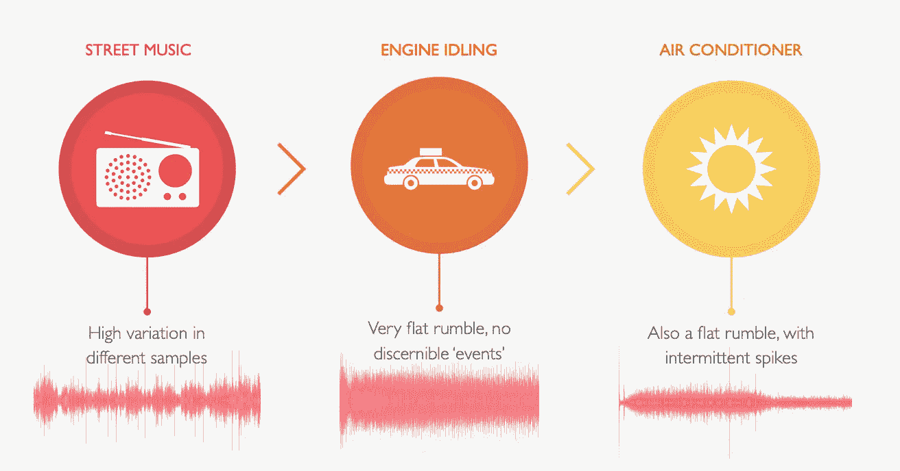

# 基于 Librosa 的城市声音分类——复杂的交叉验证

> 原文：<https://towardsdatascience.com/urban-sound-classification-with-librosa-nuanced-cross-validation-5b5eb3d9ee30?source=collection_archive---------19----------------------->

## 使用 scikit-learn 展示“将一个群体排除在外”策略



作者图片[Marc Kelechava]

# 概述

这篇文章的目的有两个:

1.  我将展示一个实现一篇有趣的研究论文的结果的例子，该论文基于音频片段的声音内容对它们进行分类。这将包括 librosa 库的应用，librosa 库是一个用于音乐和音频分析的 Python 包。剪辑是来自城市的短音频剪辑，并且分类任务是预测适当的类别标签。
2.  我将展示有效的交叉验证方案的重要性。鉴于我将使用的音频源数据集的细微差别，很容易从录音中意外泄露信息，这会使您的模型过拟合，并阻止其泛化。这个解决方案有点微妙，所以看起来是一个写博客的好机会。

## 原始研究论文

[http://www . justinsalamon . com/uploads/4/3/9/4/4394963/salamon _ urban sound _ acmmm 14 . pdf](http://www.justinsalamon.com/uploads/4/3/9/4/4394963/salamon_urbansound_acmmm14.pdf)

## 论文作者的源数据集

【https://urbansounddataset.weebly.com/urbansound8k.html 

## 他们的数据集摘要

“该数据集包含来自 10 个类别的城市声音的 **8732 个标记的声音摘录(< =4s)** **):空调、汽车喇叭、儿童玩耍、狗叫、钻孔、发动机空转、枪击、手提钻、警笛和街头音乐。这些类别来自[城市声音分类法](https://urbansounddataset.weebly.com/taxonomy.html)。**

我将从这些声音摘录中提取特征，并安装一个分类器来预测 10 个类别中的一个。我们开始吧！

# 关于我的代码的注释

我创建了一个回购协议，允许您完整地重新创建我的示例:

1.  **脚本运行器**:[https://github . com/Marc muon/urban _ sound _ classification/blob/master/main . py](https://github.com/marcmuon/urban_sound_classification/blob/master/main.py)
2.  **特征提取模块**:[https://github . com/Marc muon/urban _ sound _ classification/blob/master/audio . py](https://github.com/marcmuon/urban_sound_classification/blob/master/audio.py)
3.  **模型模块**:[https://github . com/Marc muon/urban _ sound _ class ification/blob/master/Model . py](https://github.com/marcmuon/urban_sound_classification/blob/master/model.py)

脚本运行器处理从磁盘加载源音频，解析关于源音频的元数据，并将该信息传递给特征提取器和模型。

## 下载数据

您可以使用研究论文作者提供的表格下载数据，该数据可提取至 7.09 GB:[https://urban sound dataset . weebly . com/download-urban sound 8k . html](https://urbansounddataset.weebly.com/download-urbansound8k.html)

## 目录结构[可选部分—如果您想自己运行它]

显然，您可以派生代码并将其重新映射到您想要的任何目录结构，但是如果您想要遵循我的:

*   在你的主目录中:创建一个名为*数据集*的文件夹，并将解压后的 *UrbanSound8K* 文件夹放在那里【从‘下载数据’中的链接获得】
*   同样在您的主目录中:创建一个*项目*文件夹，并将克隆的 repo 放在那里，以*~/projects/urban _ sound _ classification/…*结尾

在代码中，我使用一些方法将每个音频文件提取的特征向量自动写入*~/projects/urban _ sound _ classification/data*

我这样做是因为特征提取需要很长时间，而且你不想做两次。还有检查这些特征向量是否存在的代码。

**TL；dr——如果你遵循我的目录结构，你可以简单地运行 main.py 脚本，一切都应该工作！**

# 为什么这个问题需要仔细的交叉验证

请注意，源数据被分成 10 个子文件夹，标记为“文件夹 1”、“文件夹 2”等。

我们有 8732 个四秒钟的各种城市声音的音频剪辑。这些剪辑是由研究论文的作者手动创建的，他们将它们分为几组，如“汽车喇叭”、“手提钻”、“儿童玩耍”等。除了 10 折，还有 10 个类。

折叠数与类别标签没有任何关系；更确切地说，**折叠指的是这些 4 秒钟的训练示例拼接而来的未剪切的音频文件。**

我们*不希望*的是模型能够学习如何根据特定底层记录的各个方面对事物进行分类。

我们需要一个通用的分类器，它可以处理各种各样的录音类型，但仍能正确地对声音进行分类。

## 论文作者关于正确简历的指导

这就是为什么作者为我们预先构建了折叠，并提供了以下值得引用的指导:

> ***不要洗牌数据！*** *使用预定义的 10 折，执行 10 折(不是 5 折)交叉验证…*
> 
> *…* ***如果您重组数据*** *(例如，组合所有折叠的数据并生成随机的训练/测试分割)* ***您将错误地将相关样本放入训练和测试集，从而导致分数膨胀，无法代表您的模型在看不见的数据上的表现。*** *简单地说，你的结果会是错误的。*

## 正确方法的总结

*   在折叠 1-9 上训练，然后在折叠 10 上测试并记录分数。然后在第 2-10 层进行训练，在第 1 层进行测试并记录分数。
*   重复此**操作，直到每个折叠都作为保持一次。**
*   总得分将是来自 10 个不同维持集的 10 个准确性得分的平均值。

## 重新创建纸质结果

请注意，研究论文没有任何代码示例。我想做的是首先看看我能否用我自己的实现重新创建(或多或少)论文的结果。

然后，如果这看起来是一致的，我将在一些模型改进上工作，看看我是否能击败它。

这是他们的模型精度的快照，来自[论文](http://www.justinsalamon.com/uploads/4/3/9/4/4394963/salamon_urbansound_acmmm14.pdf)【他们的图像，不是我的】:



图片来自研究论文作者贾斯汀·萨拉蒙、克里斯托弗·雅各布和胡安·巴勃罗·贝洛

因此，我们希望在如图 3a 所示的褶皱上达到高 60%/低 70%的精确度。

# 音频特征提取



作者图片[Marc Kelechava]

Librosa 是一个优秀且易于使用的 Python 库，它实现了音乐信息检索技术。[我最近在这里写了另一篇关于使用 librosa 库的模型的博文](/audio-genre-classification-with-python-oop-66119e10cd05)。这个练习的目标是训练一个音频类型分类器，这个分类器来自我的个人图书馆的带标签的音频文件(标签=音乐类型)。然后，我使用训练好的模型来预测我的音乐库中其他未标记文件的流派。

我将使用从该练习中学到的一些音乐信息检索技术，并将它们应用于城市声音分类问题的音频特征提取。具体来说，我将使用:

*   [梅尔频率倒谱系数(MFCC)](https://librosa.org/doc/latest/generated/librosa.feature.mfcc.html#librosa.feature.mfcc)
*   [光谱对比度](https://librosa.org/doc/latest/generated/librosa.feature.spectral_contrast.html)
*   [色谱图](https://librosa.org/doc/latest/generated/librosa.feature.chroma_stft.html)

## 快速了解音频转换[可选]

[我的另一篇[博文](/audio-genre-classification-with-python-oop-66119e10cd05)对这一部分进行了更详细的阐述，如果你对此有特别的兴趣的话]

请注意，从技术上讲，将原始音频源转换为数字矢量并直接对其进行训练是可行的。然而，一个(降采样)7 分钟的音频文件将产生一个长度接近~9，000，000 浮点数的时间序列向量！

即使对于我们的 4 秒剪辑，原始时间序列表示也是一个大约 7000 维的向量。考虑到我们只有 8732 个训练样本，这可能是不可行的。

各种音乐信息检索技术减少了原始音频向量表示的维度，并使其更易于建模。

我们将用来提取特征的技术试图捕捉音频随时间变化的不同特性。例如，MFCCs 描述了声音的频谱包络[振幅频谱]。使用 librosa，我们可以随着时间的推移获得这些信息——也就是说，我们获得了一个矩阵！

特定音频文件的 MFCC 矩阵在 y 轴上具有系数，在 x 轴上具有时间。因此，我们希望汇总这些系数随时间的变化情况(跨 x 轴，或 numpy land 中的轴=1)。假设我们在一段时间内取一个平均值，然后我们得到每个 MFCC 系数在一段时间内的平均值，即特定音频文件的数字特征向量！

我们能做的是对不同的音乐信息检索技术或不同的汇总统计重复这个过程。例如，频谱对比技术也将随着时间的推移产生不同频率范围的不同频谱特性的矩阵。同样，我们可以随时间重复聚合过程，并将其打包到我们的特征向量中。

## 作者使用了什么

论文作者明确指出了 MFCC。他们提到提取前 25 个 MFCC 系数

> 每个系数的每帧值使用下面的汇总统计数据在时间上汇总:最小值、最大值、中值、平均值、方差、偏斜度、峰度以及一阶和二阶导数的平均值和方差，得到每个切片 225 维的特征向量

因此，在他们的情况下，他们在不同的汇总统计上不断聚集 25 个 MFCCs，并将它们打包到一个特征向量中。

我将在这里实现一些稍微不同的东西，因为它在前面提到的流派分类器问题中对我很有效。

我认为(对于每个片段):

*   一段时间内 MFCC 矩阵的平均值
*   Std。MFCC 矩阵随时间的发展
*   一段时间内光谱对比度矩阵的平均值
*   Std。光谱对比度矩阵随时间的变化
*   一段时间内色谱图矩阵的平均值
*   Std。色谱图矩阵随时间的变化

我的输出(每个音频片段)将只有 82 维，而不是 225 维，所以建模应该会快一点。

## 终于有代码了！行动中的音频特征提取。

[请注意，我将在博客文章和 GitHub Gist 链接中发布代码片段。有时 Medium 不能正确渲染 Github Gists，这就是我这样做的原因。同样，所有的文档内代码都可以复制并粘贴到 ipython 终端上，但是 GitHub gists 却不行]。

这里引用我的脚本运行程序:

[](https://github.com/marcmuon/urban_sound_classification/blob/master/main.py) [## Marc muon/urban _ sound _ 分类

### 使用 Urban Sound 8K 数据集-Marc muon/Urban _ Sound _ classification 的模型的一系列博客帖子的代码

github.com](https://github.com/marcmuon/urban_sound_classification/blob/master/main.py) 

我解析元数据(与数据集一起提供)并获取每个音频文件的文件名、文件夹和类标签。然后这被发送到音频特征提取器类。

AudioFeature 类包装 librosa，并提取您输入的特征作为字符串，如上所示。然后，它还会将每个音频剪辑的 AudioFeature 对象保存到磁盘。这个过程需要一段时间，所以我将类别标签和折叠号与特征向量一起保存在 AudioFeature 对象中。通过这种方式，您可以返回并在以后对提取的特征使用模型。

这个类实现了我之前描述的内容，即随着时间的推移聚合各种音乐信息检索技术，然后将每个音频片段的所有内容打包到一个单一的特征向量中。

# 建模



作者图片[Marc Kelechava]

由于我们将所有的 AudioFeature 对象放在上面的列表中，我们可以做一些快速理解来获得建模所需的内容:

模型类将实现作者描述的交叉验证循环(记住相关的陷阱！).

提醒一下，这是作者的第二个警告:

> "**不要只在一个分裂上评价！使用 10 倍(非 5 倍)交叉验证并平均得分**
> 我们已经看到仅提供单次训练/测试分割结果的报告，例如，在第 1-9 倍进行训练，在第 10 倍进行测试并报告单个准确度得分。我们强烈反对这样做。相反，使用提供的折叠进行 [10 次交叉验证，并报告平均分数。](https://urbansounddataset.weebly.com/urbansound8k.html#10foldCV)
> 
> 为什么？
> 
> 并不是所有的拆分都那么“容易”。也就是说，与(例如)在折叠 2-10 上训练和在折叠 1 上测试相比，模型在折叠 1-9 上训练和在折叠 10 上测试时往往获得更高的分数。因此，在 10 次分割中的每一次上评估您的模型并报告平均准确度是非常重要的。
> 
> 同样，你的结果将无法与文献中以前的结果相比。"

关于他们的后一点——(这来自论文)值得注意的是，不同的录音/折叠对于片段何时出现在前景或背景中有不同的分布——这就是为什么一些折叠容易而一些折叠困难。

## TL；简历博士

*   我们需要在第 1-9 圈进行训练，在第 10 圈进行预测和评分
*   然后在第 2-10 层进行训练，在第 1 层进行预测和评分
*   …等等…
*   使用这一过程对测试折叠的分数进行平均将与现有的研究相匹配，并确保我们不会意外地将关于源记录的数据泄露给我们的维持组。

## 遗漏一组

最初，我根据给定的折叠，使用 numpy 手工编写了上述分割过程的代码。虽然还不算太糟，但我意识到 scikit-learn 以 LeaveOneGroupOut KFold 拆分的形式提供了一个完美的解决方案。

为了向自己证明这就是我们想要的，我运行了来自[sk learn 文档](https://scikit-learn.org/stable/modules/generated/sklearn.model_selection.LeaveOneGroupOut.html)的 splitter 测试代码的一个略微修改的版本:

请注意，在这个玩具示例中有 3 个组，“1”、“2”和“3”。

当我将每个训练样本的组成员列表输入到分离器时，**它正确地确保了相同的组样本不会同时出现在训练和测试中。**

## 模特班

多亏了 sklearn，这最终变得非常容易实现！

在这里，我添加了一些缩放，但本质上分裂会给我们想要的 CV。在拆分器的每次迭代之后，我在 9 个折叠上训练折叠，并在维持折叠上进行预测。这种情况发生 10 次，然后我们可以对维持折叠返回的 10 个分数列表进行平均。

## 结果

```
"""
In: fold_acc                                                                                                                                              
Out: 
[0.6632302405498282,
 0.7083333333333334,
 0.6518918918918919,
 0.6404040404040404,
 0.7585470085470085,
 0.6573511543134872,
 0.6778042959427207,
 0.6910669975186104,
 0.7230392156862745,
 0.7825567502986858]

In: np.mean(fold_acc)                                                                                                                                     
Out: 0.6954224928485881
"""
```

69.5%与作者在他们的论文中对顶级模特的预测基本一致！因此，我感觉很好，这是按照他们的设想实现的。另请注意，他们还显示 fold10 是最容易得分的(我们也有)，所以我们也在那里排队。

## 为什么不为此任务运行超参数搜索？[非常可选]

这就是事情变得有点棘手的地方。

*“正常”CV 流程:*

如果我们可以任意地训练/测试/分割，我们可以做这样的事情:

1.  分离维持测试集
2.  从较大的训练部分中，分离出一个验证集。
3.  在列车上运行某种类型的参数搜索算法(比如 GridSearchCV)(非 val，非测试)。
4.  GridSearch 将在训练测试上运行 k-fold 交叉验证，将其分成多个折叠。最后，使用 GridSearchCV 的内部 k-fold 交叉验证中找到的最佳参数在训练部分上重新装配估计器
5.  然后，我们采用拟合的最佳估计值，并在验证集上评分

因为我们在第 5 部分中设置了验证，所以我们可以在不同的模型系列或不同的参数搜索范围上多次重复步骤 3 和 4。

然后，当我们完成时，我们将采用我们的最终模型，并使用维持测试集来查看它是否通用，我们还没有触及这一点。

但是这在我们基于 Fold 的 LeaveOneGroupOut 方法中是如何工作的呢？假设我们试图如下设置一个 GridSearchCV:

但是现在，当 GridSearchCV 运行内部拆分时，我们将会遇到使用 LeaveOneGroupOut 解决的相同问题！

也就是说，想象这个循环的第一次运行，其中测试集是折叠 1，训练集是折叠 2-10。如果我们随后将训练集(折叠 2-10)传递到内部 GridSearchCV 循环中，我们将以内部 KFold 案例结束，其中相同的折叠用于内部 GridSearchCV 训练和内部 GridSearchCV 测试。

因此，它将(很可能)在内部 GridSearchCV 循环中过度选择最佳参数。

因此，我不会在 LeaveOneGroupOut 循环中运行超参数搜索。

## 后续步骤

我很高兴这正确地实现了研究论文——至少在非常接近他们的结果方面。

1.  我想尝试从每个例子中提取更大的特征向量，然后按照这里相同的 CV 过程通过几个不同的基于 Keras 的 NN 架构运行这些向量
2.  在特征提取方面，我也想考虑类之间错误分类的细微差别，看看我是否能为困难的例子想出更好的特征。例如，它肯定是越来越混乱的空调发动机空转类。为了检查这一点，我在之前的音频博客文章中提供了一些代码，您可以使用这些代码来查看每个类的假阳性率和假阴性率:[https://github . com/Marc muon/audio _ genre _ classification/blob/master/model . py # L84-L128](https://github.com/marcmuon/audio_genre_classification/blob/master/model.py#L84-L128)

感谢您读到这里！我打算很快写这篇文章的第二部分，讨论接下来的步骤。其他一些可能感兴趣的工作可以在这里找到:

【https://github.com/marcmuon】T3
T5[https://medium.com/@marckelechava](https://github.com/marcmuon)

# 引文

*J. Salamon、C. Jacoby 和 J. P. Bello，“* [***城市声音研究的数据集和分类法***](http://www.justinsalamon.com/uploads/4/3/9/4/4394963/salamon_urbansound_acmmm14.pdf) *”，第 22 届 ACM 多媒体国际会议，美国奥兰多，2014 年 11 月。*[[ACM](http://dl.acm.org/citation.cfm?id=2655045)][[PDF](http://www.justinsalamon.com/uploads/4/3/9/4/4394963/salamon_urbansound_acmmm14.pdf)][[BibTeX](http://www.justinsalamon.com/uploads/4/3/9/4/4394963/salamon_urbansound_acmmm14.bib)