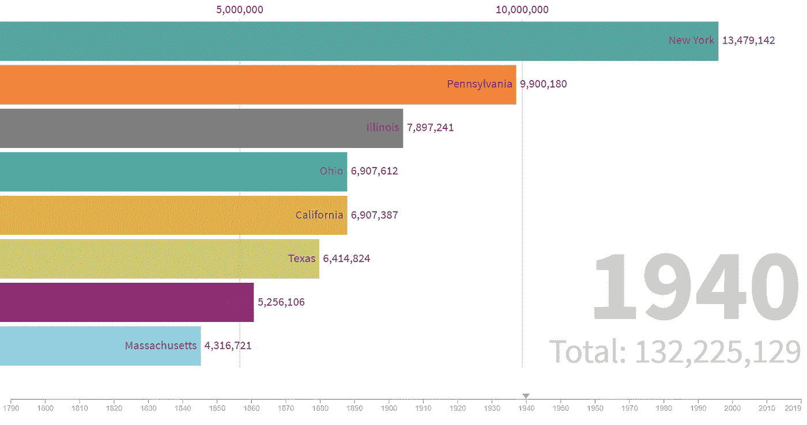

# 美国 2020 年人口普查

> 原文：<https://towardsdatascience.com/us-census-2020-868e8555313?source=collection_archive---------33----------------------->

## 可视化美国过去 230 年的人口普查数据！

2020 年对所有美国人来说都是特殊的一年——这是美国人口普查年。美国人口普查是世界上最大的人口调查之一，由美国宪法授权。它每十年举行一次，帮助政府决定在哪里建设和维护学校、医院、交通基础设施和警察部门等等。总之，各种人口普查决定了每年超过 4000 亿美元的联邦资金的分配。

为了庆祝这一时刻，我收集了 230 年的美国人口普查数据，并把它们变成了一场条形图竞赛。我[记录了进入这个数据项目的所有步骤](https://github.com/AntonMu/Census2020/blob/master/USCensus2020.ipynb)——这样，如果你想在未来处理类似的项目，你可以遵循它们。

# 美国人口普查 230 年

早在 1790 年，美国只有 16 个州，总人口略低于 400 万——比今天的洛杉矶市还少！整个纽约州只有不到 35 万人，而人口超过 70 万的弗吉尼亚州是迄今为止人口最多的州。

但这种优势并没有持续很久——随着 1792 年华尔街的建立和战略煤炭和木材港口的建立，纽约迅速成为美国的经济领袖。1810 年，纽约州的居民接近 100 万，成为美国人口最多的州——这一称号在接下来的 150 年里一直保持着！



那么谁拿了第一呢？你猜对了——加利福尼亚！从 1940 年开始，随着航空航天和电子等先进技术的兴起，加州成为美国新的经济强国。平均而言，加州人口每十年增长 400 多万人——这一趋势一直延续至今。

这些只是数据可以向我们展示的一些例子，但还有更多东西需要探索。例如，是什么导致了俄亥俄州人口在 1820 年和伊利诺斯州人口在 1960 年的突然增长？为什么弗吉尼亚的人口在 1860 年后下降了？是什么导致了 20 世纪中期佛罗里达人口的快速增长？

# 创建美国人口普查条形图竞赛

除了分享一些关于美国的有趣事实，这篇文章还将帮助你解决自己的数据项目，并教你如何使用一些数据科学家最流行的工具。对于所有步骤的深入描述，你可以查看我关于 github.com 的[教程。为了展示这些数据，我选择了一个条形图竞赛，这是一个在 2019 年变得非常受欢迎的数据动画工具——在 Twitter、脸书和 LinkedIn 上都有趋势帖子。](https://github.com/AntonMu/Census2020/blob/master/USCensus2020.ipynb)

## 数据采集

像几乎所有的数据科学项目一样，我从获取数据开始。我决定使用维基百科精心策划的关于美国人口普查的文章。尽管通常不建议解析来自网络的数据，但在这种情况下，维基百科的美国人口普查页面布局相对一致，因此易于解析。尽管如此，与几乎所有解析的数据一样，需要进行一些清理。为了获得原始数据，我使用了[熊猫](https://pandas.pydata.org/)的读取 HTML 函数。

```
pd.read_html(
“https://en.wikipedia.org/wiki/1790_United_States_Census”)
```

## 数据清理

一旦我得到了原始数据，是时候清理不同的格式，并确保所有的数字看起来合理。一致性检查在数据科学项目中经常被忽视，并可能导致很多麻烦。在我的例子中，年份 [1800](https://en.wikipedia.org/wiki/1800_United_States_Census#State_and_regional_populations) 与其他年份不太合拍，使用了完全不同的牌桌布局。与其他年份不同的是，1800 年的人口普查数据被分解到不同的地区。

```
**State**
New York (excluding Duchess, Ulster, Orange co...
New York (Duchess, Ulster, Orange counties)
```

在这种情况下，我很幸运地在早期发现了这些不一致之处。但实际上，你可能并不总是那么幸运。但是不用担心——继续下去是完全没问题的。一旦您开始可视化您的数据，这些小问题应该会变得更加明显。例如，在我们的例子中，这个误差会导致 1800 年纽约人口突然明显下降。一旦您看到这样的异常，有两种可能的情况:要么发生了很酷的事情，要么您的数据是错误的。两者最好不要混用！

为了解决不同地区的问题，我将行名与当前 50+1 州的名称进行匹配，然后对共享相同行名的所有人口进行汇总。经过一些额外的清理后，数据可以使用了。

## 数据可视化

一旦数据格式正确，大部分工作就结束了。为了创建条形图动画，我使用了一个名为“繁荣工作室”的应用程序，它似乎为这项任务提供了一个友好的界面和布局。

# 结论

我希望这个简短的数据项目演练对那些刚刚开始接触数据科学的人有所帮助。要看完整的教程，请去 github.com/AntonMu/Census2020。

即使从这个小数据项目中，我们也可以学到两个重要的经验:

> 数据清理很重要！

数据清理和一致性检查通常是任何数据科学项目中最耗时的部分，也很少是最迷人的部分。然而，要成为一名成功的数据科学家，你需要投入时间来正确地做这些事情，否则[即使是最花哨的模型也无法挽救局面](https://en.wikipedia.org/wiki/Garbage_in,_garbage_out)。

> 使用强大的可视化！

一旦你完成了数据清理——尽情享受吧！我选择用条形图比赛来可视化数据，但是有许多不同的方式来可视化数据，在解决之前探索一些选项是值得的。有时一个简单的表格就足够了，但通常有更好、更吸引人的方法来展示数据并从中学习。强大的可视化的好处是双重的。它可以提高*你对数据的理解*，并引导你发现数据中需要进一步清理的潜在缺陷。它可以提高*你的观众对数据的理解*。一个好的视觉效果可以吸引你的观众，并保证你的信息被传达出去——无论是对你的老板，你的家人还是你最好的朋友。