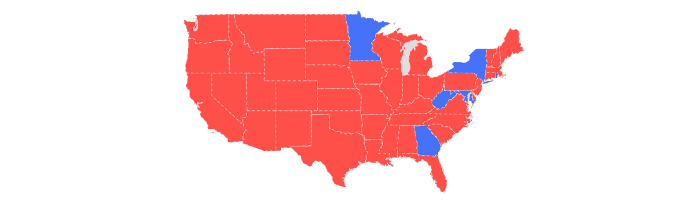
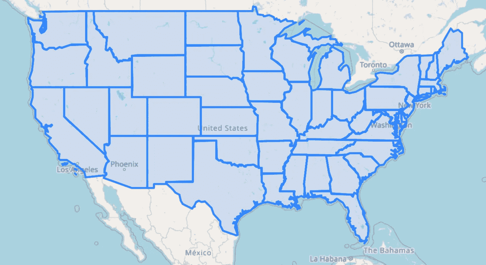
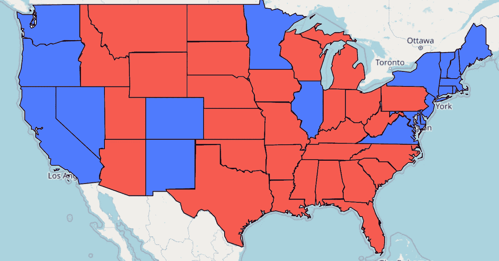
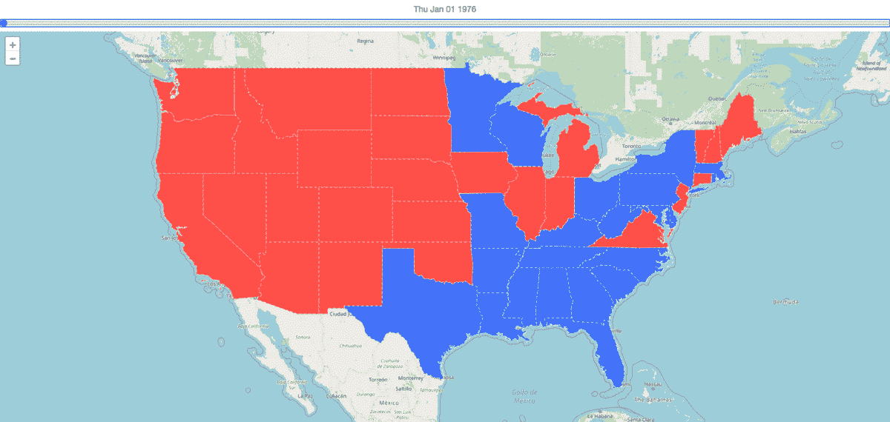
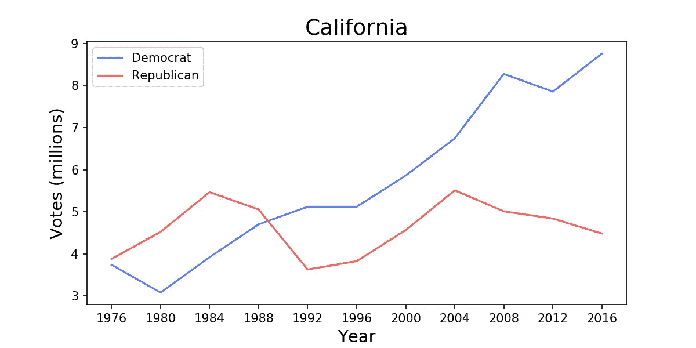
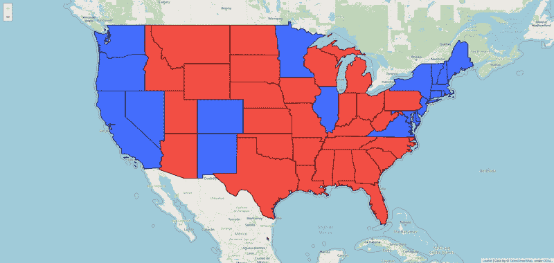

# 使用 Python 的美国选举 Choropleth

> 原文：<https://towardsdatascience.com/us-election-choropleth-with-python-bad8e355f1bd?source=collection_archive---------29----------------------->

## 如何创建美国选举结果的时间序列图表

这次美国大选带来了高度紧张，毫无根据的欺诈指控，最重要的是，一些伟大的形象化。至少对数据科学家来说很重要。看起来你在任何地方都看不到展示选举结果的新方法。那么，为什么不多加几个呢？在本教程中，你将学习如何使用 Python 创建一些你自己的可视化。



来源:作者

您将学习如何创建两个从 1976 年到 2016 年美国总统选举结果的互动合唱曲。第一张地图有一个时间滑块。当您移动滑块时，地图将会改变以显示给定年份每个州的结果。对于第二张地图，每个州都变成了一个按钮。您可以单击状态来查看一段时间内的投票趋势。我们会检查代码，你可以在 [GitHub](https://github.com/conorosully/medium-articles) 上找到完整的项目。你也可以在这里下载[的地图](https://github.com/conorosully/medium-articles/tree/master/maps)。您应该能够在浏览器中打开并浏览它们。


来源: [flaticon](https://www.flaticon.com/packs/united-states-presidential-election-10?word=election)

# Python 包

我们将使用[叶子](https://python-visualization.github.io/folium/)来构建地图。这是一个非常有用的软件包，用于创建简单的地理空间数据可视化。除了 leav，我们还将使用一些其他的 Python 包。您可以使用下面的代码导入它们。确保你已经安装了所有的软件包。

# 数据源

## 美国形状文件

我们需要的第一个数据集是一个[美国形状文件](https://alicia.data.socrata.com/Government/States-21basic/jhnu-yfrj/data)。shapefile 是一种用于存储地理空间矢量数据的文件格式。在我们的例子中，我们有一组定义美国各州边界的坐标。我们将数据作为地理数据框读入。数据框的 51 行中的每一行都给出了国家的名称和坐标(即几何图形)。

让我们使用这个 shapefile 来创建我们的第一个叶子地图。在下面的代码中，我们初始化了地图。通过设置 location=[50.77500，-100]，地图打开时会聚焦美国。然后，我们使用 US shapefile 和 GeoJson 函数向地图添加一个 choropleth。在图 1 中，您可以看到这段代码创建的地图。shapefile 为我们提供了一个工作基础，但我们需要另一个数据集来获得选举结果。



图 1:美国形状文件 choropleth

## 选举结果数据集

对于选举结果，我们使用麻省理工学院选举数据和科学实验室提供的数据集。它包含了 1976 年至 2016 年的美国总统选举结果。该数据集包含每个州、年份和当年参选的候选人的一行。为了使事情变得简单一点，我们应该首先将这个数据集转换成不同的格式。

使用下面的代码，我们将数据集转换成一个嵌套字典。对于每一年，我们都有一个以州名为关键字的字典。对于每个州，都有一本字典给出民主党和共和党候选人的票数。该词典的格式如下:

```
{
  <year>: { 
    <state> : {'dem':<#votes>, 'rep':<#votes>},
    <state> : {'dem':<#votes>, 'rep':<#votes>},
    ...},
  ...
}
```

# 将数据可视化

在我们进入交互式地图之前，让我们使用这些数据集来创建一个简单的 choropleth。我们首先需要定义两个函数。 **state_style** 函数返回一个字典，用来定义一个州的颜色和边界。在某一年，如果一个州投了民主党的票，它就变成蓝色；如果它投了共和党的票，它就变成红色。根据是由 **style_dictionary** 还是 **style_function** 使用，该函数返回的词典略有不同。

对于这个 choropleth，我们将使用一个**样式 _ 函数**。GeoJson 包使用此函数将 GeoJson 要素映射到样式。在我们的示例中，GeoJson 要素将包含状态信息(即名称和几何)。这些特征由 GeoJson 包传递给 **style_function** 。通过设置 year=2016，我们使用 2016 年选举的结果来定义每个州的风格。

我们现在可以使用这些函数来创建我们的第一个 choropleth。该代码与我们用来创建第一张地图的代码非常相似。唯一的区别是我们现在将 **style_function** 传递给 GeoJson 函数。如前所述，这给每个州一种基于选举结果的颜色。生成的地图如图 2 所示。现在，让我们看看如何改进这张地图，使它更具互动性。



图 2: 2016 年选举结果

## 地图 1: Choropleth 滑块

我们首先创建一个带有时间滑块的 choropleth 地图。使用函数 TimeSliderChoropleth 完成。该函数假设所有日期都是 Unix 时间格式(即时间戳)。因此，我们使用 **year_to_ts** 函数将选举年份转换为时间戳。例如，2016 年将被转换为“1451606400”。

我们需要定义的第二个函数， **style_dictionary** ，返回一个样式字典。这与 **style_function** 类似，只是我们现在处理的是时间序列数据。所以，对于每一个州，我们需要定义从 1976 年到 2016 年每一年的风格。 **style_dictionary** 函数返回如下形式的嵌套字典:

```
{
  <ID>: { 
    <timestamp> : {'opacity':1, 'color':<hex_color>},
    <timestamp> : {'opacity':1, 'color':<hex_color>},
    ...},
  ...
}
```

上面提到的 ID 是给予一个国家的唯一 ID。由**自动分配。to_json()** 函数。TimeSliderChoropleth 使用这些 id 将状态映射到它们的样式。因此，为了确保我们有正确的映射，我们首先创建一个从 ID 到州名的映射。这是在下面的第 7 到 13 行中完成的。该函数的其余部分用上面看到的形式创建字典。

我们现在准备创建我们的地图。同样，代码与之前类似，只是我们使用了 TimeSliderChoropleth 函数并传入了一个样式字典。代码的结果如图 3 所示。你可以滑动地图上方的滚动条来查看不同时间的选举结果。例如，从 2012 年到 2016 年，我们可以看到几个州变红。这导致了共和党候选人的胜利。



图 3: Choropleth 滑块

我们应该提到上面第 6 行中保存地图的代码。这一行将地图保存为 HTML 文件。您可以在任何浏览器中打开并浏览它。如果您正在使用 jupyter 笔记本，地图也会显示在您的代码块下方。如果地图太复杂，笔记本可能会出现渲染问题。在这种情况下，您必须保存地图并在浏览器中打开它，然后才能看到它。

## 地图 2: Choropleth 按钮

对于下一个地图，我们将把每个州变成一个按钮。你可以点击状态来查看一段时间内的投票趋势。首先，为了创建这些趋势图表，我们使用下面的代码。函数为给定的状态创建一个标准的 matplotlib 图表。在最后几行中，我们将图表转换成 HTML，并将其添加到 IFrame 中。这是为了能够嵌入到我们的叶子地图中。您可以在图 5 中看到为加利福尼亚制作的图表示例。



图 5:加州投票趋势

在创建按钮 choropleth 之前，我们必须定义最后一个函数。highlight_style 函数用于定义当鼠标悬停在一个状态上时该状态的样式。当这种情况发生时，状态会变得稍微有点阴影。这让我们可以在点击鼠标之前看到它的状态。

最后，为了创建地图，我们首先使用 2016 年的结果创建一个 choropleth。我们使用与图 2 中的地图完全相同的代码来实现这一点。然后，使用每个状态的几何图形，我们创建一个状态标记，并为每个标记添加一个弹出窗口。每个弹出窗口都包含一个上面讨论过的嵌入式图表。单击时，标记将显示弹出窗口，我们将能够看到投票趋势。

您可以在图 4 中看到这段代码的结果。您可以看到悬停在一个状态上是如何突出显示它的。德克萨斯和加利福尼亚也被点击来揭示他们的趋势。在笔记本中查看这张地图可能会有一些困难。在这种情况下，将其保存为 HTML 文件并在浏览器中打开。



图 4: Choropleth 按钮

与本文不同的是，美国大选还没有完全结束。在我写这篇文章的时候，还有一些选票需要统计。当他们完成时，我们将能够用 2020 年的数据更新可视化。我们会看到一些州改变颜色，而其他州的投票趋势将保持不变。这些变化的原因很复杂。像这样的观想有助于我们理解它们。

## 图像来源

所有图片都是我自己的或从[www.flaticon.com](http://www.flaticon.com/)获得的。在后者的情况下，我拥有他们的[高级计划](https://support.flaticon.com/hc/en-us/articles/202798201-What-are-Flaticon-Premium-licenses-)中定义的“完全许可”。